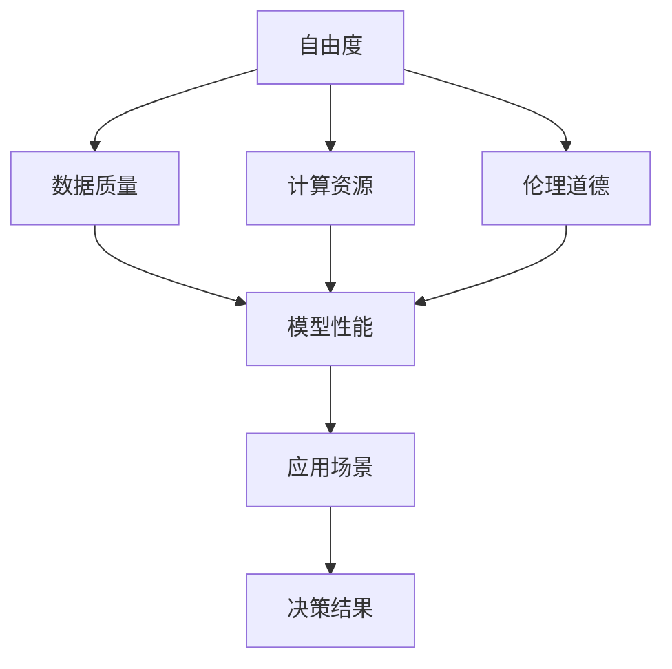

                 

# 人生而自由，却无往不在枷锁之中

> 关键词：自由度、算法、枷锁、机器学习、人工智能

## 1. 背景介绍

在人类漫长的文明历史中，自由一直是人们渴望追求的理想状态。古希腊哲学家亚里士多德曾言：“人生的目的在于追求幸福，幸福即在于实现自由。”然而，人类在追求自由的道路上，却一次次陷入枷锁之中。自由与枷锁，是人类文明进步的永恒命题。

在计算机科学和人工智能（AI）领域，这一命题同样适用。算法的优劣、模型的选择、数据的处理，无不是人类智慧与技术枷锁的较量。算法能带给人自由，但错误的算法却可能让人陷入枷锁之中。在人工智能的浪潮中，如何通过算法与模型，实现真正的自由，是每一位AI从业者不懈追求的目标。

本文旨在通过探讨机器学习与人工智能中的算法自由度与枷锁问题，揭示自由与枷锁间的动态关系，为算法设计和应用提供深刻的洞见。

## 2. 核心概念与联系

### 2.1 核心概念概述

在探讨算法与自由的枷锁问题之前，我们首先需要理解以下几个核心概念：

- **自由度（Freedom）**：指算法或模型在处理数据、做出决策时，能够选择的空间大小。自由度越大，算法的灵活性和适应性越强。
- **枷锁（Shackle）**：指算法或模型在应用过程中所受的限制。枷锁可能来自数据质量、计算资源、伦理道德等方面。
- **机器学习（Machine Learning, ML）**：一种利用数据和算法，使机器能够自动提升其性能的技术。
- **人工智能（Artificial Intelligence, AI）**：使机器能够执行需要人类智能的任务，包括但不限于视觉、语言理解、决策等。

### 2.2 核心概念的关系

自由与枷锁，在大数据和深度学习时代，成为了一种新型的动态关系。算法的自由度可以随着数据和模型的演变而变化，而枷锁则随着应用场景和伦理道德的调整而调整。以下Mermaid流程图展示了自由与枷锁在大数据与深度学习中的动态关系：



这个流程图说明：自由度受到数据质量、计算资源和伦理道德的约束，这些约束反过来影响模型的性能和应用场景。

## 3. 核心算法原理 & 具体操作步骤
### 3.1 算法原理概述

算法与自由度的关系，在于其对数据的处理能力和决策方式。自由度高的算法，能够更灵活地处理数据，做出更为复杂和多样的决策。然而，过高的自由度也可能导致过拟合和不可解释性，带来新的枷锁。

以下是一个简单例子，展示算法自由度与枷锁之间的关系：

假设我们有一个二分类问题，数据集为 $(x_i, y_i)$，其中 $x_i \in \mathbb{R}^n$ 为输入特征，$y_i \in \{0, 1\}$ 为标签。我们希望训练一个模型 $f(x)$，使得 $f(x)$ 能够准确地预测 $y$。

- **自由度低**的模型，如逻辑回归，自由度小，但可解释性强。然而，自由度小可能导致模型过于简单，无法处理复杂的数据分布，陷入枷锁。
- **自由度高**的模型，如深度神经网络，自由度大，能够处理复杂数据，但可能导致过拟合和不可解释性，带来新的枷锁。

### 3.2 算法步骤详解

算法步骤包括以下几个关键步骤：

**Step 1: 数据准备与预处理**

数据质量是算法自由度的重要约束。高质量的数据集能够使算法发挥最大自由度，但实际应用中往往存在噪声、缺失值、不平衡等问题。

**Step 2: 模型选择与训练**

在模型选择上，需要平衡自由度与约束。自由度高的模型，如深度神经网络，能够处理复杂数据，但需要更多的计算资源和更高的超参数调优。

**Step 3: 模型评估与调优**

评估模型的性能，通常通过交叉验证、AUC-ROC曲线、F1分数等指标。调优包括超参数调整、模型结构优化等。

**Step 4: 模型部署与应用**

模型部署时，需要考虑模型的计算效率、可解释性和适用场景。过高的自由度可能带来计算开销和不可解释性，需要权衡自由度与性能。

### 3.3 算法优缺点

算法自由度与枷锁之间存在平衡关系。以下表格展示了算法自由度与枷锁的关系及优缺点：

| 自由度        | 枷锁       | 优点                           | 缺点                           |
|--------------|------------|--------------------------------|--------------------------------|
| 高           | 计算资源   | 处理复杂数据、泛化能力强        | 过拟合、不可解释性强            |
| 中           | 数据质量   | 相对易解释、易部署             | 处理能力有限、可能过拟合        |
| 低           | 模型复杂度 | 模型易解释、计算资源需求低      | 处理简单数据、泛化能力差        |

### 3.4 算法应用领域

算法自由度与枷锁问题，在多个AI应用领域均有体现：

- **计算机视觉**：卷积神经网络（CNN）具有高自由度，能够处理图像分类、目标检测等复杂任务，但需要大规模计算资源。
- **自然语言处理**：Transformer模型在语言生成、翻译等方面具有高自由度，但模型参数量巨大，训练复杂。
- **语音识别**：深度学习模型在语音识别中具有高自由度，但受到噪声、口音等变量的约束。
- **推荐系统**：协同过滤、基于内容的推荐算法具有一定自由度，但需要大量数据和计算资源。

## 4. 数学模型和公式 & 详细讲解
### 4.1 数学模型构建

我们以线性回归模型为例，展示算法自由度与枷锁问题。

假设我们有数据集 $(x_i, y_i)$，其中 $x_i \in \mathbb{R}^n$，$y_i \in \mathbb{R}$。我们的目标是找到最优参数 $\theta$，使得线性回归模型 $f(x) = \theta x$ 能够拟合数据：

$$
\min_{\theta} \sum_{i=1}^N (y_i - \theta x_i)^2
$$

此模型的自由度为 $n+1$，即模型参数数量。然而，若数据存在噪声或缺失值，模型自由度可能降低。

### 4.2 公式推导过程

线性回归模型的梯度下降更新公式为：

$$
\theta \leftarrow \theta - \eta \frac{1}{N} \sum_{i=1}^N (y_i - \theta x_i)x_i
$$

其中 $\eta$ 为学习率。该公式展示了算法自由度与枷锁之间的关系：

- **自由度高**时，算法能够灵活处理数据，但可能导致过拟合。
- **自由度低**时，算法可能过于简单，无法处理复杂数据。

### 4.3 案例分析与讲解

假设我们有一个数据集，其中 $x_1 = (1, 2, 3)$，$y_1 = 5$，$x_2 = (4, 5, 6)$，$y_2 = 8$。我们希望找到一个最优参数 $\theta$，使得模型能够拟合数据。

若使用自由度较高的线性模型 $f(x) = \theta x$，可以拟合出 $\theta = 3$，但该模型过拟合严重，预测其他数据时表现不佳。

若使用自由度较低的模型，如常数模型 $f(x) = 1$，则无法拟合数据，陷入枷锁。

## 5. 项目实践：代码实例和详细解释说明
### 5.1 开发环境搭建

开发环境搭建包括以下几个步骤：

1. 安装Python：从官网下载并安装最新版本的Python。
2. 安装必要的库：如NumPy、Pandas、Scikit-learn等。
3. 配置开发工具：如Jupyter Notebook、PyCharm等。

### 5.2 源代码详细实现

以线性回归模型为例，展示算法自由度与枷锁问题的代码实现：

```python
import numpy as np
from sklearn.linear_model import LinearRegression

# 准备数据
x = np.array([[1, 2, 3], [4, 5, 6]])
y = np.array([5, 8])

# 构建模型
model = LinearRegression()

# 训练模型
model.fit(x, y)

# 预测
prediction = model.predict(np.array([[7, 8, 9]]))
print(prediction)
```

### 5.3 代码解读与分析

线性回归模型的代码实现相对简单，主要包括以下几个步骤：

1. 准备数据：定义输入特征 $x$ 和输出标签 $y$。
2. 构建模型：使用Scikit-learn库中的LinearRegression类。
3. 训练模型：使用模型fit方法进行训练。
4. 预测：使用模型predict方法进行预测。

## 6. 实际应用场景
### 6.1 计算机视觉

在计算机视觉领域，算法的自由度与枷锁问题同样显著。以下是一个图像分类任务中的例子：

- **自由度高**的模型，如深度神经网络，能够处理复杂的图像分类任务，但需要大规模计算资源和大量标注数据。
- **自由度低**的模型，如KNN，能够处理简单图像分类任务，但受到数据分布的影响较大。

### 6.2 自然语言处理

在自然语言处理领域，算法的自由度与枷锁问题也尤为突出。以语言生成任务为例：

- **自由度高**的模型，如Transformer，能够生成高质量的文本，但需要大规模计算资源和大量标注数据。
- **自由度低**的模型，如线性回归，能够处理简单的文本生成任务，但生成文本质量较差。

### 6.3 推荐系统

在推荐系统中，算法的自由度与枷锁问题体现在推荐策略的选择上：

- **自由度高**的模型，如深度协同过滤，能够处理复杂的推荐任务，但需要大量数据和计算资源。
- **自由度低**的模型，如基于内容的推荐，能够处理简单的推荐任务，但推荐效果有限。

## 7. 工具和资源推荐
### 7.1 学习资源推荐

为了深入理解算法自由度与枷锁问题，推荐以下学习资源：

1. 《机器学习实战》：是一本实战性的机器学习入门书籍，介绍了多种常见算法及其应用场景。
2. 《深度学习》：由Ian Goodfellow等人编写，深入浅出地介绍了深度学习的基本原理和应用。
3. Coursera和edX的机器学习课程：由斯坦福大学和MIT等名校提供的免费课程，涵盖了机器学习的基本概念和实践技巧。
4. Kaggle竞赛平台：可以通过参与实际数据集竞赛，提升算法设计和数据处理能力。

### 7.2 开发工具推荐

以下开发工具可以帮助提升算法设计和实现效率：

1. PyTorch：一个灵活、高效的深度学习框架，支持动态图和静态图，适合研究性工作。
2. TensorFlow：由Google开发的深度学习框架，支持分布式训练和生产部署。
3. Jupyter Notebook：一个交互式编程环境，适合快速迭代算法设计和实现。
4. PyCharm：一个功能强大的IDE，支持代码编写、调试和版本控制。

### 7.3 相关论文推荐

以下论文深入探讨了算法自由度与枷锁问题：

1. 《Understanding Machine Learning: From Theory to Algorithms》：由Ian Goodfellow等人编写，介绍了机器学习的基本理论、算法和应用。
2. 《Deep Learning》：由Yoshua Bengio等人编写，深入浅出地介绍了深度学习的基本原理和应用。
3. 《Algorithms for Machine Learning》：由Christopher M. Bishop编写，介绍了机器学习的基本算法和实际应用。

## 8. 总结：未来发展趋势与挑战
### 8.1 研究成果总结

本文通过探讨算法自由度与枷锁问题，揭示了算法设计与应用的复杂性。自由度与枷锁之间存在着动态平衡，需要根据具体应用场景进行权衡。

### 8.2 未来发展趋势

未来，算法自由度与枷锁问题将继续引发广泛关注。以下趋势值得期待：

1. **自动化调参**：通过自动化调参技术，优化算法超参数，提高算法自由度。
2. **模型压缩与优化**：通过模型压缩、剪枝等技术，提升算法效率和资源利用率。
3. **联邦学习**：通过分布式训练和联邦学习，优化数据分布不均问题，提高算法适应性。
4. **解释性与可解释性**：通过可解释性算法和模型，提升算法透明度和可信度。

### 8.3 面临的挑战

虽然算法自由度与枷锁问题得到了广泛关注，但仍面临诸多挑战：

1. **数据质量与分布**：高质量数据和合理的数据分布是算法自由度的重要约束。
2. **计算资源与效率**：大规模计算资源和高效算法设计是算法自由度的重要保障。
3. **伦理道德与安全性**：算法的伦理道德和安全性问题，是算法自由度的重要约束。

### 8.4 研究展望

未来，算法自由度与枷锁问题的研究将继续深化，以下是几个研究方向：

1. **多模态融合**：将视觉、语音、文本等多模态数据融合，提高算法自由度。
2. **自监督学习**：利用自监督学习方法，优化算法自由度与枷锁关系。
3. **可解释性算法**：开发可解释性算法，提高算法透明度和可信度。
4. **联邦学习与分布式计算**：通过联邦学习、分布式计算等技术，优化算法自由度与资源利用率。

## 9. 附录：常见问题与解答

**Q1: 如何平衡算法自由度与枷锁？**

A: 在算法设计中，需要根据具体应用场景和数据特点，平衡算法自由度与枷锁。可以通过以下方法：

1. **数据增强**：利用数据增强技术，扩充训练数据，提高算法自由度。
2. **模型简化**：通过模型简化和剪枝技术，降低模型复杂度，减小计算资源消耗。
3. **正则化**：引入正则化技术，避免过拟合，提高算法自由度。
4. **分布式计算**：通过分布式计算，优化计算资源利用率，提升算法效率。

**Q2: 如何评估算法自由度与枷锁？**

A: 算法自由度与枷锁的评估可以通过以下几个指标：

1. **模型精度**：模型在测试集上的表现，评估算法自由度。
2. **计算资源**：算法所需的计算资源，评估算法枷锁。
3. **可解释性**：算法的透明性和可解释性，评估算法自由度与枷锁的平衡。

**Q3: 如何在实际应用中提高算法自由度？**

A: 提高算法自由度的方法包括：

1. **数据增强**：利用数据增强技术，扩充训练数据，提高算法自由度。
2. **模型复杂化**：通过增加模型复杂度，提高算法自由度。
3. **正则化**：引入正则化技术，避免过拟合，提高算法自由度。
4. **分布式计算**：通过分布式计算，优化计算资源利用率，提升算法效率。

**Q4: 如何在实际应用中降低算法枷锁？**

A: 降低算法枷锁的方法包括：

1. **数据清洗**：清洗数据中的噪声和缺失值，提高数据质量，降低算法枷锁。
2. **模型简化**：通过模型简化和剪枝技术，降低模型复杂度，减小计算资源消耗。
3. **分布式计算**：通过分布式计算，优化计算资源利用率，降低算法枷锁。
4. **可解释性算法**：开发可解释性算法，提高算法透明度和可信度，降低算法枷锁。

---

作者：禅与计算机程序设计艺术 / Zen and the Art of Computer Programming

