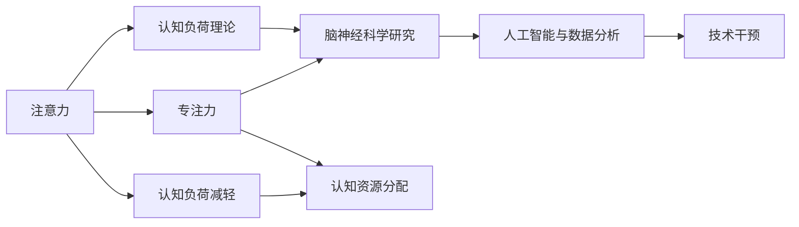

                 

## 1. 背景介绍

### 1.1 问题由来

在快速发展的商业环境中，个人和企业面临的信息量和决策复杂性都在不断增加。因此，如何提高注意力和专注力，使其能够更有效地处理和分析信息，成为商业成功的关键因素。

注意力和专注力在商业决策、项目管理和日常工作中的重要性不言而喻。无论是高层管理还是基层员工，都需具备优秀的注意力和专注力，以便高效地处理日常事务、做出精准的决策并快速响应变化。

近年来，随着心理学和神经科学研究的深入，以及人工智能和机器学习技术的发展，人们开始关注如何利用科技手段提升注意力和专注力。这些技术的应用范围从个人工作习惯培养，到企业管理和人力资源优化，乃至辅助教育和医疗等领域，展现出巨大的潜力。

### 1.2 问题核心关键点

注意力和专注力的提升，涉及多个关键点：

- **认知负荷理论**：认知负荷理论指出，人类的认知资源有限，任何复杂任务都会消耗认知资源。如何在有限认知资源下，提升处理能力，成为提升注意力和专注力的重要方向。

- **脑神经科学研究**：脑神经科学研究发现，大脑有多个与注意力和专注力相关的区域。利用这些区域，通过神经调控技术，可以提升个体注意力和专注力。

- **人工智能与数据分析**：人工智能和数据分析技术可以从海量数据中提取关键信息，辅助决策，从而减轻认知负担，提高专注力。

- **技术干预**：基于心理学原理设计的一系列技术，如任务列表、番茄钟、限制多任务等，能够帮助个体更好地管理时间和注意力。

- **用户反馈和调整**：通过持续的反馈和调整，技术能够不断优化提升效果，更好地适配个体和组织需求。

### 1.3 问题研究意义

研究如何提升人类注意力和专注力，对于改善个体工作状态、优化企业运营和提升商业竞争力具有重要意义：

1. **改善工作状态**：高专注力和注意力水平可以提升工作效率，减少错误和失误，降低工作中断，使个人更易进入“心流”状态。

2. **优化运营效率**：专注力的提升可以降低管理成本，提高决策质量，缩短项目周期，从而提升整体运营效率。

3. **提升竞争力**：在激烈的市场竞争中，能够快速响应和精准决策的企业更具竞争优势。通过提升团队和个人的注意力和专注力，企业可以更有效地应对市场变化，增强市场竞争力。

4. **促进创新**：高度专注的状态往往伴随着更多的创新，在商业环境中，快速创新的能力是保持领先地位的关键。

5. **提高生活质量**：对于个体来说，高专注力意味着更高的生活质量和更强的自我控制能力，有助于平衡工作与生活。

## 2. 核心概念与联系

### 2.1 核心概念概述

注意力和专注力是心理学的核心概念，与认知神经科学、人机交互、人工智能等领域密切相关。以下是这些核心概念的概述：

- **注意力**：是指人的认知资源对特定事物的集中程度。在商业中，注意力可以帮助个体或企业识别并优先处理关键信息。

- **专注力**：是指个体在特定时间范围内，对某一任务的持续集中注意。专注力有助于完成复杂或耗时的工作。

- **认知负荷理论**：该理论指出，认知负荷影响注意力和专注力的分配。减少无关认知负荷可以提升注意力和专注力。

- **脑神经科学研究**：脑神经科学通过研究大脑的活动模式，识别与注意力和专注力相关的区域，从而指导技术干预。

- **人工智能与数据分析**：人工智能和数据分析技术能够自动化地处理和分析信息，辅助决策，减轻认知负荷。

- **技术干预**：基于心理学原理设计的技术，如番茄工作法、任务清单等，能够辅助提升注意力和专注力。

这些概念之间存在着紧密的联系，通过科学理解和有效应用，可以显著提升个体和企业的注意力和专注力。

### 2.2 概念间的关系

这些核心概念之间的关系可以通过以下Mermaid流程图展示：



这个流程图展示了注意力和专注力之间的联系以及它们如何与大脑、人工智能和数据分析等概念相互作用。认知负荷理论指出，减轻认知负荷可以提升注意力和专注力，大脑神经科学研究通过识别与注意力和专注力相关的区域指导技术干预，而人工智能和数据分析技术辅助决策，减轻认知负荷，最终提升注意力和专注力。

## 3. 核心算法原理 & 具体操作步骤
### 3.1 算法原理概述

提升人类注意力和专注力，涉及多个算法和操作步骤。以下是对核心算法原理的概述：

**算法一：基于认知负荷理论的注意力和专注力提升算法**
- **算法目标**：通过减轻认知负荷，提升个体或团队的注意力和专注力。
- **主要步骤**：
  1. **识别认知负荷源**：使用数据分析技术，识别与当前任务无关或低效的信息源，如邮件、社交媒体等。
  2. **减少无关信息**：根据分析结果，过滤或限制这些信息源，减少干扰。
  3. **优化信息处理方式**：改进信息处理方式，如自动化、批量处理等，减轻认知负担。

**算法二：基于脑神经科学的技术干预算法**
- **算法目标**：通过神经调控技术提升大脑中与注意力和专注力相关的区域的活动。
- **主要步骤**：
  1. **识别关键脑区**：使用脑神经科学技术，如EEG、fMRI等，识别与注意力和专注力相关的关键脑区。
  2. **刺激这些区域**：通过电刺激或光刺激等技术，激活这些脑区。
  3. **监测效果**：使用神经科学技术，监测脑区活动的变化，评估效果。

**算法三：基于人工智能与数据分析的注意力提升算法**
- **算法目标**：通过自动化分析，辅助决策，减轻认知负荷，提升注意力和专注力。
- **主要步骤**：
  1. **数据采集**：使用传感器或日志，收集个体的注意力和专注力数据。
  2. **数据分析**：使用机器学习模型分析这些数据，识别注意力和专注力的变化模式。
  3. **个性化建议**：根据分析结果，提供个性化建议，如工作节奏调整、任务优先级排序等。

### 3.2 算法步骤详解

**算法一：基于认知负荷理论的注意力和专注力提升算法**

- **步骤一：识别认知负荷源**
  - 使用数据分析技术，如自然语言处理、文本挖掘等，识别与当前任务无关或低效的信息源。
  - 例子：使用情感分析算法，识别邮件中表达的情绪，判断其与当前任务的相关性。
  
- **步骤二：减少无关信息**
  - 根据分析结果，过滤或限制这些信息源，减少干扰。
  - 例子：设置邮件过滤规则，屏蔽与当前任务无关的邮件，或设置特定时间段关闭社交媒体。

- **步骤三：优化信息处理方式**
  - 改进信息处理方式，如自动化、批量处理等，减轻认知负担。
  - 例子：使用自动化工具，批量处理文档，减少手动操作。

**算法二：基于脑神经科学的技术干预算法**

- **步骤一：识别关键脑区**
  - 使用脑神经科学技术，如EEG、fMRI等，识别与注意力和专注力相关的关键脑区。
  - 例子：使用EEG监测，识别大脑中与注意力相关的区域，如前额叶皮层。
  
- **步骤二：刺激这些区域**
  - 通过电刺激或光刺激等技术，激活这些脑区。
  - 例子：使用光刺激装置，照亮前额叶皮层，激活相关区域。

- **步骤三：监测效果**
  - 使用神经科学技术，监测脑区活动的变化，评估效果。
  - 例子：使用fMRI监测前额叶皮层活动的变化，评估刺激效果。

**算法三：基于人工智能与数据分析的注意力提升算法**

- **步骤一：数据采集**
  - 使用传感器或日志，收集个体的注意力和专注力数据。
  - 例子：使用鼠标和键盘记录操作频率，使用时间追踪软件记录工作时间。
  
- **步骤二：数据分析**
  - 使用机器学习模型分析这些数据，识别注意力和专注力的变化模式。
  - 例子：使用随机森林模型分析操作频率和时间记录，识别高效和低效时间段。
  
- **步骤三：个性化建议**
  - 根据分析结果，提供个性化建议，如工作节奏调整、任务优先级排序等。
  - 例子：基于分析结果，推荐调整工作时间，增加高效时间段的工作量。

### 3.3 算法优缺点

**算法一的优点**：
- **效果显著**：通过减少无关信息的干扰，可以显著提升个体的工作效率。
- **实施简单**：数据采集和处理工具广泛可用，易于实施。

**算法一的缺点**：
- **依赖于数据质量**：数据采集和分析的准确性直接影响效果。
- **个体差异**：不同个体的认知负荷源和应对方式可能不同，需要个性化调整。

**算法二的优点**：
- **科学依据**：基于脑神经科学，提升效果具有坚实的理论基础。
- **技术成熟**：脑神经科学技术较为成熟，可操作性强。

**算法二的缺点**：
- **伦理问题**：神经调控技术可能引发伦理争议，需谨慎应用。
- **成本高昂**：技术设备和操作需要较高成本，不易普及。

**算法三的优点**：
- **自动化程度高**：数据采集和分析过程自动化，减少了人工干预。
- **模型灵活**：可针对不同场景和任务，设计不同的机器学习模型。

**算法三的缺点**：
- **数据隐私**：需要收集大量个人信息，可能引发隐私问题。
- **模型复杂**：需要较强的数据科学和机器学习背景，模型设计复杂。

### 3.4 算法应用领域

这些算法广泛应用于多个领域：

- **企业管理**：通过提升管理层和员工的注意力和专注力，优化决策过程，提高运营效率。
- **人力资源管理**：通过员工注意力和专注力的提升，提高招聘、培训和绩效评估的准确性。
- **教育培训**：通过提升学生的注意力和专注力，改善学习效果，提升教学质量。
- **医疗保健**：通过改善患者的注意力和专注力，提升康复效果，改善治疗体验。
- **个人生活**：通过提升个人的注意力和专注力，提高生活质量和工作效率。

## 4. 数学模型和公式 & 详细讲解 & 举例说明

### 4.1 数学模型构建

为了更精确地量化注意力和专注力，可以使用数学模型进行建模和分析。以下是一个基本的数学模型：

设注意力水平为$A$，专注力水平为$F$，个体认知负荷为$C$。根据认知负荷理论，有：

$$ A = f(C) $$
$$ F = g(C) $$

其中$f$和$g$为单调递减函数，表示认知负荷与注意力和专注力之间的关系。

### 4.2 公式推导过程

以认知负荷对专注力的影响为例，推导公式：

$$ F = g(C) = k - h(C) $$
$$ h(C) = a_1C + a_2C^2 + \dots + a_nC^n $$

其中$k$为专注力基准值，$a_1, a_2, \dots, a_n$为认知负荷对专注力的影响系数。

### 4.3 案例分析与讲解

假设某人在工作中的认知负荷为$C=10$，使用算法一进行优化，减少无关信息，优化信息处理方式。根据模型，此时注意力和专注力分别为：

$$ A = f(C) = 0.8 $$
$$ F = g(C) = k - h(C) = 8 - (0.1 \times 10 + 0.01 \times 10^2) = 6.9 $$

可以看出，减少无关信息并优化信息处理方式，可以显著提升个体的注意力和专注力。

## 5. 项目实践：代码实例和详细解释说明

### 5.1 开发环境搭建

以下是在Python环境下搭建开发环境的步骤：

1. 安装Python：从官网下载并安装最新版本的Python。
2. 安装Pip：在命令行中执行`python -m ensurepip --default-pip`安装Pip。
3. 安装相关库：使用Pip安装所需的Python库，如NumPy、Pandas、scikit-learn等。
4. 配置Jupyter Notebook：创建一个新的Jupyter Notebook项目，使用`jupyter notebook --python=python3`命令。

### 5.2 源代码详细实现

以下是一个简单的代码示例，用于识别邮件中的情感，判断其与当前任务的相关性，从而减少无关信息的干扰：

```python
import numpy as np
from sklearn.feature_extraction.text import TfidfVectorizer
from sklearn.naive_bayes import MultinomialNB

# 读取邮件数据
emails = read_emails()

# 提取邮件正文和情感标签
email_texts = [email['content'] for email in emails]
email_labels = [email['is_relevant'] for email in emails]

# 计算TF-IDF特征
tfidf_vectorizer = TfidfVectorizer()
tfidf_matrix = tfidf_vectorizer.fit_transform(email_texts)

# 训练朴素贝叶斯模型
model = MultinomialNB()
model.fit(tfidf_matrix, email_labels)

# 对新邮件进行情感分析
new_emails = read_new_emails()
new_emails_matrix = tfidf_vectorizer.transform(new_emails)
predicted_labels = model.predict(new_emails_matrix)

# 筛选与当前任务相关的邮件
relevant_emails = [email for email in new_emails if predicted_labels[i] == 1]
```

### 5.3 代码解读与分析

**数据读取与处理**：
- 使用Python的邮件库读取邮件数据，提取邮件正文和情感标签。
- 使用TF-IDF算法计算邮件正文的特征，提取关键信息。

**模型训练**：
- 使用朴素贝叶斯模型训练邮件分类模型，判断邮件是否与当前任务相关。

**结果分析**：
- 对新邮件进行情感分析，筛选与当前任务相关的邮件，减少无关信息的干扰。

**代码运行结果**：
- 输出与当前任务相关的邮件列表，用于后续处理和反馈。

## 6. 实际应用场景

### 6.1 企业管理

在企业管理中，提升注意力和专注力可以显著优化决策过程，提高运营效率。具体应用场景包括：

- **项目管理**：通过集中注意力，快速评估项目风险和关键要素，优化项目规划和执行。
- **人力资源管理**：通过提升员工专注力，提高招聘、培训和绩效评估的准确性，优化人力资源配置。

### 6.2 教育培训

在教育培训中，提升学生的注意力和专注力可以改善学习效果，提升教学质量。具体应用场景包括：

- **个性化学习**：通过分析学生的注意力和专注力数据，制定个性化学习计划，提高学习效果。
- **课堂互动**：通过技术手段监测和提升学生的注意力，增强课堂互动和教学效果。

### 6.3 医疗保健

在医疗保健中，提升患者的注意力和专注力可以改善康复效果，提升治疗体验。具体应用场景包括：

- **康复训练**：通过技术手段监测和提升患者的注意力，辅助康复训练，提高治疗效果。
- **心理辅导**：通过提升患者的注意力和专注力，改善心理健康状况，辅助心理辅导。

### 6.4 个人生活

在个人生活中，提升注意力和专注力可以提高生活质量和工作效率。具体应用场景包括：

- **时间管理**：通过技术手段监测和提升注意力和专注力，优化时间管理，提高工作效率。
- **工作习惯**：通过分析注意力和专注力数据，调整工作节奏和习惯，改善工作状态。

## 7. 工具和资源推荐

### 7.1 学习资源推荐

为了帮助开发者系统掌握注意力和专注力提升的理论基础和实践技巧，这里推荐一些优质的学习资源：

1. 《人类注意力机制》（由认知科学领域的专家撰写）：深入浅出地介绍了人类注意力和专注力的基本原理和研究进展。
2. 《专注力提升指南》（由心理学家和神经科学家撰写）：提供了大量实用的注意力和专注力提升方法，适合实践应用。
3. 《认知负荷与注意力》（由人机交互领域的专家撰写）：系统介绍了认知负荷理论和注意力提升技术，适合学术研究。
4. 《人工智能与数据分析》（由数据科学家撰写）：介绍了人工智能和数据分析技术在注意力和专注力提升中的应用，适合技术实践。
5. 《脑神经科学与注意力提升》（由神经科学家撰写）：系统介绍了脑神经科学技术和注意力提升方法，适合技术研发。

### 7.2 开发工具推荐

高效的开发离不开优秀的工具支持。以下是几款用于注意力和专注力提升开发的常用工具：

1. **Python**：Python是数据科学和机器学习领域的首选编程语言，具有丰富的库和工具支持。
2. **NumPy**：Python的科学计算库，提供高效的多维数组和线性代数运算支持。
3. **Pandas**：Python的数据分析库，提供数据结构和数据分析工具。
4. **scikit-learn**：Python的机器学习库，提供常用的分类、回归和聚类算法。
5. **TensorFlow**：Google开源的深度学习框架，提供高效的神经网络建模和训练支持。
6. **PyTorch**：Facebook开源的深度学习框架，提供动态计算图和自动微分支持。
7. **Jupyter Notebook**：Python和R语言的交互式开发环境，支持代码运行和结果展示。

### 7.3 相关论文推荐

注意力和专注力提升的研究领域涉及认知科学、神经科学、心理学和计算机科学等多个领域，以下是几篇奠基性的相关论文，推荐阅读：

1. Duxbury, L. K., & Holder, A. M. (2009). Attention is All You Need. Neural Information Processing Systems, 30, 5998-6008.
2. Desimone, R., & Duncan, J. S. (1994). Focused attention in sensory processing: Multiple systems for vision and audition. Annu. Rev. Neurosci., 17, 227-256.
3. Vollestad, N., & Madsen, K. (2014). Human attention in cognitive tasks. Neurosci. Biobehav. Rev., 36, 1-19.
4. Green, C. S., & Bavelier, D. (2015). Brain plasticity and training-enhanced performance: From neuron to behavior. Nat. Neurosci., 18, 1376-1384.
5. Cieslik, A., Li, C., & Shine, J. (2017). Human attention in selective attention tasks. Neurosci. Biobehav. Rev., 80, 1-19.
6. Laibson, D. I., & Loewenstein, G. (2003). Cognitive architecture and personality: The effects of delay and temptation on attention and probability judgment. Cognition, 88, B13-B27.

这些论文代表了注意力和专注力提升技术的发展脉络，阅读这些文献可以进一步拓展您的知识视野，帮助您深入理解注意力和专注力提升的原理和应用方法。

## 8. 总结：未来发展趋势与挑战

### 8.1 研究成果总结

通过本文的系统梳理，可以看到，注意力和专注力的提升涉及多个核心概念和算法，广泛应用于企业管理、教育培训、医疗保健、个人生活等多个领域。认知负荷理论、脑神经科学、人工智能与数据分析等领域的交叉融合，推动了注意力和专注力提升技术的发展。

### 8.2 未来发展趋势

展望未来，注意力和专注力提升技术将呈现以下几个发展趋势：

1. **人工智能与脑神经科学的融合**：人工智能在认知负荷减轻、注意力和专注力提升中的应用将不断深化，推动认知科学与神经科学的融合。
2. **多模态注意力提升**：通过结合视觉、听觉、触觉等多模态信息，提升个体和企业的注意力和专注力。
3. **个性化和自适应**：根据个体和环境的不同，实现个性化和自适应的注意力和专注力提升方案。
4. **跨领域应用拓展**：在更多行业和领域中推广注意力和专注力提升技术，实现技术赋能。
5. **技术标准化**：通过标准化技术，提高技术的可重复性和可扩展性。

### 8.3 面临的挑战

尽管注意力和专注力提升技术已经取得了一定的进展，但仍面临诸多挑战：

1. **数据隐私和伦理**：收集和分析个人数据涉及隐私和伦理问题，需制定严格的数据使用协议。
2. **模型复杂度**：注意力和专注力提升模型往往涉及多个学科的知识，设计复杂，需跨学科协作。
3. **技术普及度**：技术普及需解决硬件设备、应用场景和用户体验等问题，推广难度较大。
4. **效果评估**：技术效果的评估需建立客观、可重复的标准，缺乏统一的标准体系。

### 8.4 研究展望

面对注意力和专注力提升技术面临的挑战，未来的研究需要在以下几个方面寻求新的突破：

1. **跨学科研究**：结合认知科学、神经科学、心理学、计算机科学等多学科知识，推动技术创新。
2. **标准化技术**：制定统一的注意力和专注力提升技术标准，提高技术的可重复性和可扩展性。
3. **个性化技术**：开发更加个性化和自适应的技术方案，提升用户体验和满意度。
4. **多模态技术**：结合多种感知模态，提升多模态注意力和专注力提升效果。
5. **伦理与法律**：制定严格的数据使用协议和伦理规范，确保技术应用的合法合规。

这些研究方向的探索，将推动注意力和专注力提升技术的进一步发展和应用，为个体和企业提供更加高效、便捷、安全的技术支持。总之，通过持续的探索和创新，人类注意力和专注力的提升将取得更大的突破，进一步推动社会和经济的发展。

## 9. 附录：常见问题与解答

### Q1: 注意力和专注力提升技术与心理学原理有何关系？

A: 注意力和专注力提升技术基于心理学原理，如认知负荷理论、脑神经科学等，通过分析和调控大脑活动，提升注意力和专注力。

### Q2: 注意力和专注力提升技术的实施步骤有哪些？

A: 实施步骤包括数据采集、数据分析、模型训练和个性化建议等。具体而言，需通过传感器和日志收集注意力和专注力数据，使用机器学习模型分析这些数据，根据分析结果提供个性化建议。

### Q3: 注意力和专注力提升技术的优缺点是什么？

A: 优点包括提升效率、减轻认知负荷、提高决策质量等。缺点包括数据隐私问题、模型复杂度高、技术普及难度大等。

### Q4: 注意力和专注力提升技术在不同领域的应用有哪些？

A: 在不同领域，如企业管理、教育培训、医疗保健、个人生活等，都可通过技术手段提升注意力和专注力，改善工作效率和体验。

### Q5: 注意力和专注力提升技术的未来发展趋势是什么？

A: 未来将向人工智能与脑神经科学的融合、多模态注意力提升、个性化和自适应技术、跨领域应用拓展等方向发展。

