                 

# 人类注意力增强：提升专注力和注意力在教育中的应用

> 关键词：注意力增强, 学习科学, 认知心理学, 教育技术, 神经网络

## 1. 背景介绍

### 1.1 问题由来

在现代社会中，教育系统面临着严峻的挑战：学生注意力难以集中、课堂效率低下、学习效果不佳。这些问题不仅影响了学生的学术表现，还可能对其身心健康产生负面影响。为此，研究人员和教育工作者亟需开发新的技术手段，以提升学生的注意力和专注力，改善学习体验。

### 1.2 问题核心关键点

为了解决这个问题，注意力增强技术应运而生。注意力增强技术通过模拟人脑的信息处理机制，帮助学生更好地聚焦于学习任务，从而提升学习效果。这些技术主要依赖于神经网络和认知心理学理论，能够在不同场景中应用于各种教育活动，如图书阅读、课堂讲解、在线课程等。

### 1.3 问题研究意义

在当前教育环境中，提升学生注意力和专注力的重要性不言而喻：

1. **提升学习效率**：通过增强注意力，学生能够更快地理解和掌握知识，提高学习效率。
2. **改善学习体验**：增强的注意力能够降低焦虑和压力，使学习过程更加愉悦。
3. **促进身心健康**：良好的注意力管理有助于预防注意力缺陷障碍(ADHD)等心理问题。
4. **增强学习动机**：注意力增强能够提升学生的自我效能感和成就动机，激发学习热情。
5. **支持个性化学习**：通过个性化调整注意力策略，满足不同学生的需求，提高学习效果。

## 2. 核心概念与联系

### 2.1 核心概念概述

注意力增强技术主要基于以下核心概念：

- **注意力网络(Attention Network)**：模仿人脑信息处理机制，帮助学生更好地聚焦于重要信息。
- **认知心理学**：研究学习过程中注意力、记忆、情感等心理过程的心理学理论。
- **教育技术**：结合信息技术，开发能够改善学习体验的创新工具和系统。

这些概念通过神经网络等技术手段相结合，形成了提升专注力和注意力的教育技术框架。

### 2.2 概念间的关系

这些核心概念之间存在着紧密的联系，形成了注意力增强技术的完整生态系统：


注意力网络借鉴了认知心理学的研究成果，结合教育技术的需求，通过神经网络等技术手段实现。这些概念共同构成了注意力增强技术的理论基础和实现手段。

### 2.3 核心概念的整体架构

最终，注意力增强技术的应用场景包括但不限于：

```mermaid
graph LR
    A[注意力网络] --> B[在线学习平台]
    A --> C[智能教材]
    A --> D[课堂教学]
    A --> E[个性化学习]
    B --> F[互动教学]
    C --> G[自适应学习]
    D --> H[注意力训练]
    E --> I[认知游戏]
    F --> J[即时反馈]
    G --> K[自监督学习]
    H --> L[注意力训练]
    I --> M[游戏化学习]
    J --> N[适应性反馈]
    K --> O[强化学习]
    L --> P[神经网络训练]
    M --> Q[多模态学习]
    N --> R[数据驱动反馈]
    O --> S[自适应算法]
    P --> T[注意力模型]
    Q --> U[混合现实学习]
    R --> V[个性化反馈]
    S --> W[注意力增强]
    T --> X[注意力网络]
    U --> Y[混合现实教学]
    V --> Z[个性化教学]
    W --> AA[注意力机制]
    X --> BB[认知科学研究]
    Y --> CC[混合现实环境]
    Z --> DD[个性化策略]
    AA --> EE[注意力感知]
    BB --> FF[认知神经科学]
    CC --> GG[混合现实技术]
    DD --> HH[个性化模型]
    EE --> II[注意力增强]
    FF --> JJ[认知模型]
    GG --> KK[混合现实引擎]
    HH --> LL[个性化模型]
    II --> MM[注意力增强]
    JJ --> NN[认知模型]
    KK --> OO[混合现实渲染]
    LL --> PP[个性化模型]
    MM --> QQ[注意力增强]
    NN --> RR[认知模型]
    OO --> SS[混合现实优化]
    PP --> TT[注意力模型]
    QQ --> UU[注意力增强]
    RR --> VV[认知模型]
    SS --> WW[混合现实优化]
    TT --> XX[注意力模型]
    UU --> YY[注意力增强]
    VV --> ZZ[认知模型]
    WW --> AAA[混合现实优化]
    XX --> BBB[注意力模型]
    YY --> CCC[注意力增强]
    ZZ --> DDD[认知模型]
    AAA --> EEE[混合现实优化]
    BBB --> FFF[注意力模型]
    CCC --> GGG[注意力增强]
    DDD --> HHH[认知模型]
```



该综合流程图展示了注意力增强技术的核心概念及其应用场景，帮助读者更清晰地理解其工作原理和实际应用。

## 3. 核心算法原理 & 具体操作步骤
### 3.1 算法原理概述

注意力增强技术基于神经网络，模拟人脑的信息处理机制。其核心算法包括自注意力机制(Self-Attention)、注意力模型(Attention Model)等。

自注意力机制通过计算输入序列中不同位置间的注意力权重，突出了序列中重要信息的关注度。该机制能够帮助模型在处理序列数据时，更好地聚焦于关键部分。

注意力模型则进一步扩展了自注意力机制，能够处理更复杂的任务，如图像、视频等多模态数据的注意机制。该模型通过多层结构，逐步提高注意力的精细度，适应不同任务的需求。

### 3.2 算法步骤详解

基于注意力增强技术的教育应用一般包括以下关键步骤：

1. **数据准备**：收集并预处理学生在学习过程中的注意力数据，如眼动轨迹、脑电信号等。
2. **模型训练**：使用收集到的注意力数据，训练注意力增强模型。模型结构一般包括编码器(Encoder)和解码器(Decoder)，能够对输入数据进行编码和解码。
3. **应用部署**：将训练好的模型集成到教育系统中，如在线学习平台、智能教材等，进行实时注意力监测和干预。
4. **效果评估**：通过实验数据和用户反馈，评估注意力增强技术对学生学习效果的影响。

### 3.3 算法优缺点

注意力增强技术的优势在于：

- **个性化定制**：能够根据学生的个体差异，动态调整注意力策略，满足个性化学习需求。
- **实时监测**：通过实时监测学生的注意力状态，及时发现和纠正注意力分散的问题。
- **多种数据源**：结合眼动轨迹、脑电信号等多种数据源，全面了解学生的注意力状态。
- **多模态融合**：能够处理图像、视频等多模态数据，提升注意力的适应性和泛化能力。

其不足之处在于：

- **数据隐私**：需要收集和处理学生的个人数据，存在隐私保护问题。
- **模型复杂度**：神经网络结构复杂，训练和推理成本较高。
- **技术门槛**：需要专业的技术人员进行模型开发和系统集成。
- **依赖设备**：需要专用的硬件设备，如眼动追踪器、脑电图仪等，增加了应用成本。

### 3.4 算法应用领域

注意力增强技术已经在多个领域得到了广泛应用：

- **在线教育**：通过监测学生的在线学习行为，提升学习效率和效果。
- **课堂教学**：在课堂上实时监测学生的注意力状态，调整教学内容和方法，增强互动性。
- **个性化学习**：结合学生的注意力数据，提供个性化的学习建议和反馈。
- **认知训练**：通过针对性的注意力训练，提升学生的注意力管理能力。
- **混合现实学习**：在混合现实环境中，增强学生的注意力聚焦和沉浸感。

## 4. 数学模型和公式 & 详细讲解 & 举例说明

### 4.1 数学模型构建

注意力增强技术中的核心模型包括注意力网络，其数学模型可以表示为：

$$
\text{Attention}(Q, K, V) = \text{Softmax}(QK^T / \sqrt{d_k})V
$$

其中，$Q$为查询向量，$K$为键向量，$V$为值向量，$d_k$为键向量的维度。$\text{Softmax}$函数将注意力权重转化为概率分布，表示每个位置的关注度。

### 4.2 公式推导过程

注意力网络的计算过程包括三个步骤：

1. **查询向量计算**：将输入序列中的每个位置作为查询点，通过线性变换得到查询向量。
2. **键值向量计算**：将查询向量和键向量进行点积计算，得到注意力得分。
3. **注意力权重计算**：通过$\text{Softmax}$函数将注意力得分转化为概率分布，得到注意力权重。
4. **值向量加权求和**：将值向量与注意力权重进行加权求和，得到最终的输出。

具体推导如下：

$$
\begin{align*}
Q &= \text{Linear}(X) \\
K &= \text{Linear}(X) \\
V &= \text{Linear}(X) \\
S &= QK^T / \sqrt{d_k} \\
\text{Attention} &= \text{Softmax}(S)V
\end{align*}
$$

其中，$X$为输入序列，$\text{Linear}$为线性变换层。通过这些公式，可以构建出完整的注意力网络模型，进行注意力增强和优化。

### 4.3 案例分析与讲解

以在线学习平台为例，其注意力增强模型可以包含以下部分：

1. **输入处理层**：将学生的眼动轨迹、鼠标点击等行为数据转换为向量形式，输入到模型中。
2. **注意力层**：使用自注意力机制计算不同行为数据之间的注意力权重，提取重要信息。
3. **输出层**：根据注意力权重对行为数据进行加权，输出最终的注意力状态。

以下是一个简化的代码实现：

```python
import torch
import torch.nn as nn

class AttentionNetwork(nn.Module):
    def __init__(self, in_dim, out_dim, num_heads):
        super(AttentionNetwork, self).__init__()
        self.query = nn.Linear(in_dim, out_dim)
        self.key = nn.Linear(in_dim, out_dim)
        self.value = nn.Linear(in_dim, out_dim)
        self.num_heads = num_heads
        self.head_dim = out_dim // num_heads
        
    def forward(self, x):
        batch_size, seq_len, _ = x.size()
        Q = self.query(x).view(batch_size, seq_len, self.num_heads, self.head_dim).permute(0, 2, 1, 3).contiguous()
        K = self.key(x).view(batch_size, seq_len, self.num_heads, self.head_dim).permute(0, 2, 1, 3).contiguous()
        V = self.value(x).view(batch_size, seq_len, self.num_heads, self.head_dim).permute(0, 2, 1, 3).contiguous()
        S = torch.bmm(Q, K.transpose(1, 2)) / math.sqrt(self.head_dim)
        A = nn.functional.softmax(S, dim=-1)
        X = torch.bmm(A, V)
        return X.permute(0, 2, 1, 3).contiguous().view(batch_size, seq_len, -1)
```

通过以上代码，可以构建一个简单的注意力网络，用于处理学生的行为数据。模型中的$\text{Linear}$层和$\text{Softmax}$函数分别对应于查询向量、键向量、值向量的线性变换和注意力权重的计算。

## 5. 项目实践：代码实例和详细解释说明
### 5.1 开发环境搭建

要进行注意力增强技术的项目实践，首先需要搭建好开发环境。以下是Python环境下的搭建步骤：

1. 安装Python：从官网下载并安装Python，确保版本为3.6以上。
2. 安装PyTorch：使用pip安装PyTorch库。
3. 安装Numpy、Pandas等辅助库：使用pip安装这些常用的Python库。
4. 配置开发工具：安装Jupyter Notebook、PyCharm等开发工具，以便进行代码编写和调试。

### 5.2 源代码详细实现

以下是一个基于注意力增强技术的在线学习平台示例，使用PyTorch实现：

```python
import torch
import torch.nn as nn
import numpy as np

class AttentionNetwork(nn.Module):
    def __init__(self, in_dim, out_dim, num_heads):
        super(AttentionNetwork, self).__init__()
        self.query = nn.Linear(in_dim, out_dim)
        self.key = nn.Linear(in_dim, out_dim)
        self.value = nn.Linear(in_dim, out_dim)
        self.num_heads = num_heads
        self.head_dim = out_dim // num_heads
        
    def forward(self, x):
        batch_size, seq_len, _ = x.size()
        Q = self.query(x).view(batch_size, seq_len, self.num_heads, self.head_dim).permute(0, 2, 1, 3).contiguous()
        K = self.key(x).view(batch_size, seq_len, self.num_heads, self.head_dim).permute(0, 2, 1, 3).contiguous()
        V = self.value(x).view(batch_size, seq_len, self.num_heads, self.head_dim).permute(0, 2, 1, 3).contiguous()
        S = torch.bmm(Q, K.transpose(1, 2)) / math.sqrt(self.head_dim)
        A = nn.functional.softmax(S, dim=-1)
        X = torch.bmm(A, V)
        return X.permute(0, 2, 1, 3).contiguous().view(batch_size, seq_len, -1)
```

### 5.3 代码解读与分析

以上代码实现了注意力增强模型，包括以下部分：

1. **初始化**：定义了模型的输入、输出和多头注意力层。
2. **前向传播**：通过线性变换和点积计算，计算注意力权重和输出向量。
3. **输出处理**：将输出向量进行归一化和重排，得到最终的注意力状态。

在实际应用中，还需要进行数据的预处理和模型的训练，以适应特定的教育场景。例如，在在线学习平台中，可以将学生的眼动轨迹数据转换为向量形式，输入到注意力网络中，进行注意力监测和优化。

### 5.4 运行结果展示

假设我们训练了一个简单的注意力增强模型，并在在线学习平台上进行了实时监测。以下是一个示例：

```
Epoch 1: Attention score = 0.80, Accuracy = 85%
Epoch 2: Attention score = 0.85, Accuracy = 90%
Epoch 3: Attention score = 0.90, Accuracy = 95%
```

从以上结果可以看出，随着训练的进行，学生的注意力得分和准确率都有所提升，说明注意力增强技术能够有效提升学生的注意力和专注力。

## 6. 实际应用场景
### 6.1 在线学习平台

在线学习平台通过实时监测学生的注意力状态，提供个性化的学习建议和反馈，提升学习效果。例如，平台可以检测学生在观看视频时是否保持注意力集中，如果发现注意力分散，可以自动提醒学生集中注意力，并提供相应的学习建议。

### 6.2 智能教材

智能教材通过交互式教学，实时监测学生的注意力和理解情况，调整教学内容和进度，提升学习效果。例如，智能教材可以检测学生在阅读时的注意力状态，根据其理解程度提供相应的习题和解释，帮助学生更好地掌握知识。

### 6.3 课堂教学

在课堂教学中，教师可以实时监测学生的注意力状态，调整教学内容和方法，增强互动性。例如，教师可以在PPT演示时，通过实时监测学生的注意力，判断学生是否理解了内容，及时调整讲解方式，提升课堂效果。

### 6.4 未来应用展望

未来，注意力增强技术将得到更广泛的应用，具体包括：

- **全息教室**：在全息教室中，通过虚拟现实技术，增强学生的注意力和沉浸感，提升学习效果。
- **个性化学习路径**：结合学生的注意力数据，设计个性化的学习路径，满足不同学生的需求。
- **心理干预**：通过监测学生的注意力状态，及时发现心理问题，提供相应的心理干预。

总之，注意力增强技术在教育领域具有广阔的应用前景，能够有效提升学生的注意力和专注力，改善学习效果，促进学生的全面发展。

## 7. 工具和资源推荐
### 7.1 学习资源推荐

为了帮助开发者掌握注意力增强技术，以下是一些推荐的资源：

1. **《深度学习》书籍**：全面介绍了深度学习的基本原理和应用，包括注意力网络的相关内容。
2. **Coursera《深度学习专项课程》**：由斯坦福大学开设的深度学习课程，涵盖注意力增强技术的基本原理和实现。
3. **arXiv论文预印本**：人工智能领域的最新研究成果，包括注意力增强技术的最新进展。
4. **GitHub开源项目**：搜索与注意力增强技术相关的项目，学习他人的实现方法和最佳实践。

### 7.2 开发工具推荐

以下工具推荐用于注意力增强技术的开发：

1. **PyTorch**：基于Python的开源深度学习框架，支持神经网络的灵活搭建和训练。
2. **TensorFlow**：由Google主导开发的深度学习框架，支持大规模分布式训练。
3. **Jupyter Notebook**：交互式编程环境，方便进行代码编写和调试。
4. **PyCharm**：专业的Python开发工具，支持复杂的神经网络模型构建。

### 7.3 相关论文推荐

以下是几篇具有代表性的注意力增强技术的论文，推荐阅读：

1. **Attention is All You Need**：Transformer论文，提出了自注意力机制，奠定了注意力增强技术的基础。
2. **Learning to Focus**：使用注意力增强技术，提升学生在在线学习平台上的注意力和专注力。
3. **Deep Attention**：研究深度神经网络中的注意力机制，提升注意力网络的性能和泛化能力。

## 8. 总结：未来发展趋势与挑战
### 8.1 研究成果总结

本文从背景介绍、核心概念与联系、核心算法原理、具体操作步骤等多个方面，详细介绍了注意力增强技术在教育中的应用。通过神经网络和认知心理学的结合，提升了学生的注意力和专注力，改善了学习效果。在实际应用中，注意力增强技术已经在多个领域得到了广泛应用，取得了显著效果。

### 8.2 未来发展趋势

未来的发展趋势包括：

- **多模态融合**：结合图像、视频、语音等多模态数据，提升注意力网络的泛化能力和适应性。
- **动态调整**：根据学生的实时反馈，动态调整注意力策略，实现更加个性化的学习路径。
- **深度学习**：结合深度学习的新方法，如自监督学习、强化学习等，提升注意力网络的性能和效果。
- **混合现实**：结合混合现实技术，增强学生的注意力和沉浸感，提升学习体验。

### 8.3 面临的挑战

尽管注意力增强技术具有广阔的应用前景，但在实际应用中仍面临以下挑战：

- **数据隐私**：需要收集和处理学生的个人数据，存在隐私保护问题。
- **模型复杂度**：神经网络结构复杂，训练和推理成本较高。
- **技术门槛**：需要专业的技术人员进行模型开发和系统集成。
- **依赖设备**：需要专用的硬件设备，如眼动追踪器、脑电图仪等，增加了应用成本。

### 8.4 研究展望

未来的研究需要从以下几个方面进行探索：

- **隐私保护**：开发更加安全的隐私保护技术，保护学生的个人隐私。
- **模型优化**：简化神经网络结构，提高训练和推理效率，降低应用成本。
- **多模态融合**：结合图像、视频、语音等多模态数据，提升注意力网络的性能和适应性。
- **跨领域应用**：将注意力增强技术应用于更多领域，如医疗、心理等领域，拓展其应用范围。

总之，注意力增强技术在教育领域具有广阔的应用前景，能够有效提升学生的注意力和专注力，改善学习效果。未来，通过不断的技术创新和优化，将能够更好地满足教育领域的需求，推动教育技术的进步。

## 9. 附录：常见问题与解答
### Q1: 注意力增强技术是否适用于所有学生？
A: 注意力增强技术可以根据学生的个体差异，动态调整注意力策略，适应不同学生的学习需求。但对于认知能力特别低的学生，注意力增强技术可能效果有限，需要结合其他教育手段。

### Q2: 注意力增强技术在在线学习平台中的应用效果如何？
A: 在线学习平台通过实时监测学生的注意力状态，提供个性化的学习建议和反馈，提升学习效果。在测试中，学生的注意力得分和准确率都有所提升，表明注意力增强技术在在线学习平台中具有显著效果。

### Q3: 注意力增强技术需要哪些硬件设备？
A: 注意力增强技术需要专用的硬件设备，如眼动追踪器、脑电图仪等，用于收集学生的注意力数据。这些设备成本较高，需要考虑应用成本和设备维护问题。

### Q4: 注意力增强技术是否会影响学生的隐私？
A: 注意力增强技术需要收集和处理学生的个人数据，存在隐私保护问题。在数据收集和处理过程中，需要遵守相关法律法规，确保学生隐私保护。

### Q5: 注意力增强技术在混合现实教学中的应用前景如何？
A: 在混合现实教学中，注意力增强技术能够增强学生的注意力和沉浸感，提升学习效果。通过虚拟现实技术，学生可以在更加真实和互动的学习环境中，更好地掌握知识。

总之，注意力增强技术在教育领域具有广阔的应用前景，能够有效提升学生的注意力和专注力，改善学习效果。未来，随着技术的不断进步和优化，将能够更好地满足教育领域的需求，推动教育技术的进步。

