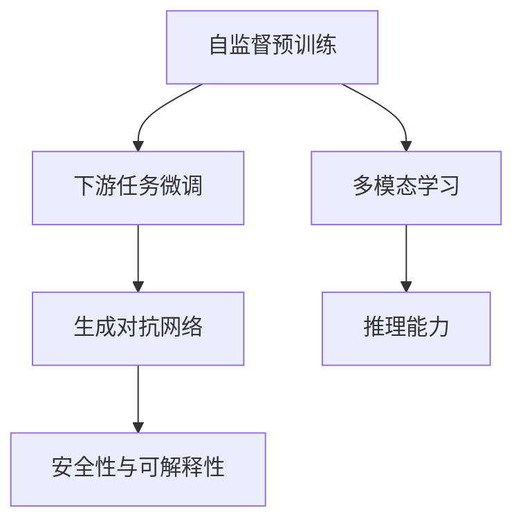
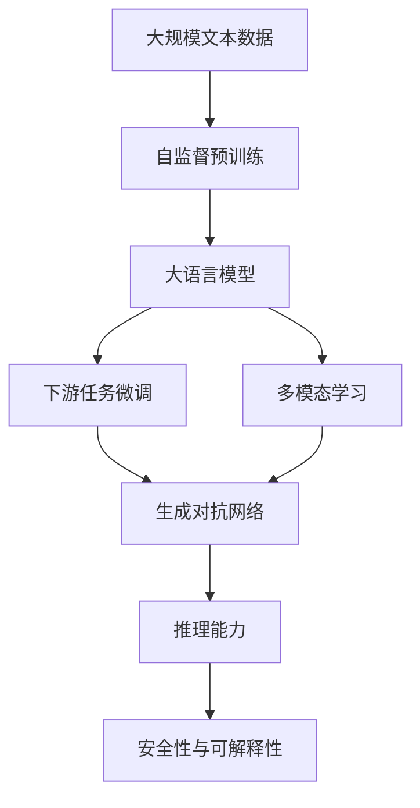
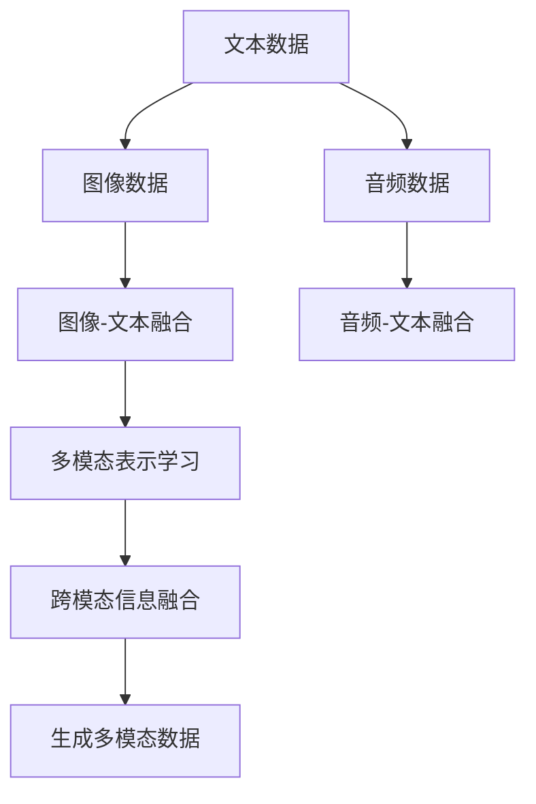

                 

# 从ChatGPT到未来AI助手

> 关键词：ChatGPT, AI助手, 自然语言处理(NLP), 深度学习, 生成对抗网络(GANs), 大语言模型, 多模态学习, 推理能力

## 1. 背景介绍

### 1.1 问题由来

在过去的十年里，人工智能技术经历了前所未有的飞跃，尤其是在自然语言处理(NLP)领域。从最早的词袋模型到深度学习的兴起，再到基于大语言模型的生成式对话系统，人工智能的发展轨迹清晰地呈现出对语言能力要求的不断提升。

以OpenAI的GPT系列和ChatGPT为例，这些模型在文本生成、对话系统、自然语言推理等方面的表现已经超越了以往任何基于规则或统计的方法，标志着AI技术进入了一个全新的阶段。这些模型不仅能够生成语法正确、内容丰富的文本，还能与人类进行复杂的交互对话，展现出了前所未有的智能水平。

然而，尽管ChatGPT在许多任务上取得了显著的成果，其依然存在一些局限性。例如，模型的生成能力依赖于大量的数据训练，对输入数据的偏见敏感度高，泛化能力有限，且在理解和执行复杂指令时仍需依赖人工提示等。因此，如何让AI助手更加智能、安全和可靠，成为当前研究的热点和挑战。

### 1.2 问题核心关键点

要回答上述问题，首先需要理解ChatGPT等大语言模型的基本工作原理和核心组件。模型通过自监督预训练学习到了丰富的语言表示，并通过下游任务微调获得了针对特定任务的优化能力。这包括了以下几个关键点：

1. **自监督预训练**：模型在大规模无标签文本数据上进行预训练，学习到通用的语言表示。

2. **下游任务微调**：通过下游任务的少量标注数据，优化模型在该任务上的性能。

3. **多模态学习**：除了文本，模型还可以学习图像、音频等多模态数据，提升其理解和生成能力。

4. **推理能力**：模型不仅能够生成文本，还能够通过推理和分析，执行复杂逻辑任务。

5. **安全性与可解释性**：如何避免模型生成有害信息，提供可解释的输出，是当前研究的重点之一。

这些核心关键点构成了从ChatGPT到未来AI助手的技术基础，也展示了其发展方向和应用前景。

## 2. 核心概念与联系

### 2.1 核心概念概述

为更好地理解ChatGPT等大语言模型的工作原理和优化方向，本节将介绍几个密切相关的核心概念：

- **自监督预训练**：在大规模无标签文本数据上进行自监督学习，学习通用的语言表示。
- **下游任务微调**：通过下游任务的少量标注数据，有监督地优化模型在该任务上的性能。
- **生成对抗网络(GANs)**：生成模型与判别模型的对抗训练，用于生成高质量的文本、图像等。
- **多模态学习**：模型不仅处理文本，还能处理图像、音频等多模态数据，实现跨模态信息融合。
- **推理能力**：模型能够通过理解和分析输入，执行复杂的逻辑推理任务。
- **安全性与可解释性**：模型输出内容的准确性、合法性和可解释性，是确保AI助手可靠性的重要方面。

这些核心概念之间的逻辑关系可以通过以下Mermaid流程图来展示：



这个流程图展示了从自监督预训练到大语言模型的下游任务微调过程，以及多模态学习、生成对抗网络、推理能力和安全性与可解释性之间的关系。

### 2.2 概念间的关系

这些核心概念之间存在着紧密的联系，形成了大语言模型的完整生态系统。下面我们通过几个Mermaid流程图来展示这些概念之间的关系。

#### 2.2.1 大语言模型的学习范式



这个流程图展示了从大规模文本数据到预训练、微调、多模态学习和生成对抗网络的过程，以及推理能力与安全性和可解释性之间的关系。

#### 2.2.2 生成对抗网络(GANs)与大语言模型


这个流程图展示了生成对抗网络的基本原理，以及其与大语言模型的融合关系。

#### 2.2.3 多模态学习在大语言模型中的应用



这个流程图展示了多模态学习在大语言模型中的应用过程，以及跨模态信息融合的实现方式。

## 3. 核心算法原理 & 具体操作步骤
### 3.1 算法原理概述

基于大语言模型的AI助手，其核心算法原理可以概括为以下几个步骤：

1. **自监督预训练**：模型在大规模无标签文本数据上进行预训练，学习通用的语言表示。

2. **下游任务微调**：在预训练的基础上，通过下游任务的少量标注数据进行微调，获得针对特定任务的优化能力。

3. **多模态学习**：模型不仅处理文本，还能处理图像、音频等多模态数据，实现跨模态信息融合。

4. **生成对抗网络(GANs)**：生成模型与判别模型的对抗训练，用于生成高质量的文本、图像等。

5. **推理能力**：模型能够通过理解和分析输入，执行复杂的逻辑推理任务。

6. **安全性与可解释性**：模型输出内容的准确性、合法性和可解释性，是确保AI助手可靠性的重要方面。

### 3.2 算法步骤详解

#### 3.2.1 自监督预训练

1. **数据准备**：收集大规模无标签文本数据，如维基百科、新闻文章、小说等。
2. **模型架构**：选择适合的大语言模型架构，如Transformer、BERT等。
3. **训练过程**：在数据上进行自监督预训练，如语言模型预测、掩码语言模型、句子分类等任务。
4. **预训练效果评估**：评估模型的语言表示质量，如上下文一致性、语义相似性等。

#### 3.2.2 下游任务微调

1. **任务选择**：根据应用场景选择适合的下游任务，如问答、对话、摘要等。
2. **数据准备**：收集任务的少量标注数据，如对话、问答对、摘要等。
3. **模型微调**：在预训练模型的基础上进行微调，优化模型在该任务上的性能。
4. **微调效果评估**：在验证集上评估模型的性能，选择最优超参数组合。

#### 3.2.3 多模态学习

1. **数据准备**：收集文本、图像、音频等多模态数据。
2. **模型融合**：将多模态数据进行融合，如通过注意力机制、多模态编码器等。
3. **模型训练**：在融合后的数据上进行训练，学习跨模态表示。
4. **效果评估**：在测试集上评估模型的多模态信息融合能力，如视觉-文本一致性、情感分类等。

#### 3.2.4 生成对抗网络(GANs)

1. **生成器训练**：训练生成器网络，学习生成高质量的文本、图像等。
2. **判别器训练**：训练判别器网络，区分真实数据和生成数据。
3. **对抗训练**：交替训练生成器和判别器，提高生成器的生成能力。
4. **效果评估**：在测试集上评估生成器生成的数据质量，如自然度、真实度等。

#### 3.2.5 推理能力

1. **知识图谱构建**：构建知识图谱，包含实体、关系、属性等。
2. **推理规则设计**：设计推理规则，如逻辑推理、因果推理等。
3. **推理过程**：将推理规则与模型输出进行匹配，执行推理任务。
4. **效果评估**：在测试集上评估推理任务的准确性和推理路径的正确性。

#### 3.2.6 安全性与可解释性

1. **模型评估**：评估模型的安全性与可解释性，如逻辑一致性、伦理合规性等。
2. **风险控制**：设计风险控制机制，如异常检测、敏感信息过滤等。
3. **用户反馈**：收集用户反馈，改进模型输出。
4. **模型更新**：定期更新模型，避免过时信息。

### 3.3 算法优缺点

**优点**：

1. **泛化能力强**：基于大语言模型的AI助手能够泛化到各种任务和领域，适应不同的应用场景。
2. **生成质量高**：通过自监督预训练和下游任务微调，生成高质量的文本、图像等。
3. **跨模态能力**：能够处理多模态数据，实现跨模态信息融合。
4. **推理能力强**：通过知识图谱和推理规则，执行复杂的逻辑推理任务。
5. **可解释性强**：提供可解释的输出，便于用户理解和使用。

**缺点**：

1. **数据依赖高**：依赖大量标注数据进行下游任务微调，数据获取成本高。
2. **生成偏见**：预训练和微调过程中可能学习到数据中的偏见，导致输出偏见。
3. **推理局限**：推理能力依赖于知识图谱和推理规则，难以处理复杂情境。
4. **安全性低**：输出内容可能存在安全隐患，需要严格的风险控制。
5. **可解释性不足**：某些推理过程和生成结果难以解释，难以满足高要求的应用场景。

### 3.4 算法应用领域

基于大语言模型的AI助手已经广泛应用于各个领域，例如：

- **智能客服**：用于处理客户咨询，提供自然流畅的对话服务。
- **医疗诊断**：用于辅助医生进行病情诊断，提供医学知识支持。
- **教育辅导**：用于提供个性化学习方案，辅助学生学习。
- **法律咨询**：用于处理法律咨询，提供准确的法律建议。
- **金融分析**：用于分析金融市场数据，提供投资建议。
- **艺术创作**：用于生成文学作品、音乐、绘画等艺术作品。

## 4. 数学模型和公式 & 详细讲解 & 举例说明

### 4.1 数学模型构建

假设预训练大语言模型为 $M_{\theta}$，其中 $\theta$ 为预训练得到的模型参数。下游任务的标注数据集为 $D=\{(x_i, y_i)\}_{i=1}^N$，其中 $x_i$ 为输入数据，$y_i$ 为输出标签。

定义任务 $T$ 的损失函数为 $\mathcal{L}(M_{\theta},D)$，用于衡量模型在任务 $T$ 上的性能。常见的损失函数包括交叉熵损失、均方误差损失等。

假设模型 $M_{\theta}$ 在输入 $x$ 上的输出为 $\hat{y}=M_{\theta}(x)$，则二分类交叉熵损失函数定义为：

$$
\ell(M_{\theta}(x),y) = -[y\log \hat{y} + (1-y)\log (1-\hat{y})]
$$

在数据集 $D$ 上的经验风险为：

$$
\mathcal{L}(\theta) = \frac{1}{N} \sum_{i=1}^N \ell(M_{\theta}(x_i),y_i)
$$

微调的优化目标是最小化经验风险，即找到最优参数：

$$
\theta^* = \mathop{\arg\min}_{\theta} \mathcal{L}(\theta)
$$

在实践中，我们通常使用基于梯度的优化算法（如SGD、Adam等）来近似求解上述最优化问题。设 $\eta$ 为学习率，$\lambda$ 为正则化系数，则参数的更新公式为：

$$
\theta \leftarrow \theta - \eta \nabla_{\theta}\mathcal{L}(\theta) - \eta\lambda\theta
$$

其中 $\nabla_{\theta}\mathcal{L}(\theta)$ 为损失函数对参数 $\theta$ 的梯度，可通过反向传播算法高效计算。

### 4.2 公式推导过程

以下我们以二分类任务为例，推导交叉熵损失函数及其梯度的计算公式。

假设模型 $M_{\theta}$ 在输入 $x$ 上的输出为 $\hat{y}=M_{\theta}(x) \in [0,1]$，表示样本属于正类的概率。真实标签 $y \in \{0,1\}$。则二分类交叉熵损失函数定义为：

$$
\ell(M_{\theta}(x),y) = -[y\log \hat{y} + (1-y)\log (1-\hat{y})]
$$

将其代入经验风险公式，得：

$$
\mathcal{L}(\theta) = -\frac{1}{N}\sum_{i=1}^N [y_i\log M_{\theta}(x_i)+(1-y_i)\log(1-M_{\theta}(x_i))]
$$

根据链式法则，损失函数对参数 $\theta_k$ 的梯度为：

$$
\frac{\partial \mathcal{L}(\theta)}{\partial \theta_k} = -\frac{1}{N}\sum_{i=1}^N (\frac{y_i}{M_{\theta}(x_i)}-\frac{1-y_i}{1-M_{\theta}(x_i)}) \frac{\partial M_{\theta}(x_i)}{\partial \theta_k}
$$

其中 $\frac{\partial M_{\theta}(x_i)}{\partial \theta_k}$ 可进一步递归展开，利用自动微分技术完成计算。

在得到损失函数的梯度后，即可带入参数更新公式，完成模型的迭代优化。重复上述过程直至收敛，最终得到适应下游任务的最优模型参数 $\theta^*$。

## 5. 项目实践：代码实例和详细解释说明

### 5.1 开发环境搭建

在进行AI助手开发前，我们需要准备好开发环境。以下是使用Python进行PyTorch开发的环境配置流程：

1. 安装Anaconda：从官网下载并安装Anaconda，用于创建独立的Python环境。

2. 创建并激活虚拟环境：
```bash
conda create -n pytorch-env python=3.8 
conda activate pytorch-env
```

3. 安装PyTorch：根据CUDA版本，从官网获取对应的安装命令。例如：
```bash
conda install pytorch torchvision torchaudio cudatoolkit=11.1 -c pytorch -c conda-forge
```

4. 安装Transformers库：
```bash
pip install transformers
```

5. 安装各类工具包：
```bash
pip install numpy pandas scikit-learn matplotlib tqdm jupyter notebook ipython
```

完成上述步骤后，即可在`pytorch-env`环境中开始AI助手开发。

### 5.2 源代码详细实现

下面以问答系统为例，给出使用Transformers库对BERT模型进行问答系统开发的PyTorch代码实现。

首先，定义问答系统的数据处理函数：

```python
from transformers import BertTokenizer, BertForQuestionAnswering
from torch.utils.data import Dataset
import torch

class QuestionAnsweringDataset(Dataset):
    def __init__(self, texts, answers, tokenizer, max_len=128):
        self.texts = texts
        self.answers = answers
        self.tokenizer = tokenizer
        self.max_len = max_len
        
    def __len__(self):
        return len(self.texts)
    
    def __getitem__(self, item):
        text = self.texts[item]
        answer = self.answers[item]
        
        encoding = self.tokenizer(text, return_tensors='pt', max_length=self.max_len, padding='max_length', truncation=True)
        input_ids = encoding['input_ids'][0]
        attention_mask = encoding['attention_mask'][0]
        
        start_tokens = [tokenizer.cls_token] + tokenizer.encode(answer, add_special_tokens=False)
        end_tokens = [tokenizer.sep_token] + tokenizer.encode(answer, add_special_tokens=False)
        start_id = torch.tensor(tokenizer.convert_tokens_to_ids(tokenizer.cls_token))[None, :]
        end_id = torch.tensor(tokenizer.convert_tokens_to_ids(tokenizer.sep_token))[None, :]
        start_id = start_id.to(device)
        end_id = end_id.to(device)
        
        return {
            'input_ids': input_ids,
            'attention_mask': attention_mask,
            'start_tokens': start_id,
            'end_tokens': end_id
        }
```

然后，定义模型和优化器：

```python
from transformers import BertForQuestionAnswering, AdamW

model = BertForQuestionAnswering.from_pretrained('bert-base-cased')
device = torch.device('cuda') if torch.cuda.is_available() else torch.device('cpu')
model.to(device)

optimizer = AdamW(model.parameters(), lr=2e-5)
```

接着，定义训练和评估函数：

```python
from torch.utils.data import DataLoader
from tqdm import tqdm
from sklearn.metrics import accuracy_score

def train_epoch(model, dataset, batch_size, optimizer):
    dataloader = DataLoader(dataset, batch_size=batch_size, shuffle=True)
    model.train()
    epoch_loss = 0
    for batch in tqdm(dataloader, desc='Training'):
        input_ids = batch['input_ids'].to(device)
        attention_mask = batch['attention_mask'].to(device)
        start_tokens = batch['start_tokens'].to(device)
        end_tokens = batch['end_tokens'].to(device)
        model.zero_grad()
        outputs = model(input_ids, attention_mask=attention_mask, start_positions=start_tokens, end_positions=end_tokens)
        loss = outputs.loss
        epoch_loss += loss.item()
        loss.backward()
        optimizer.step()
    return epoch_loss / len(dataloader)

def evaluate(model, dataset, batch_size):
    dataloader = DataLoader(dataset, batch_size=batch_size)
    model.eval()
    preds = []
    labels = []
    with torch.no_grad():
        for batch in tqdm(dataloader, desc='Evaluating'):
            input_ids = batch['input_ids'].to(device)
            attention_mask = batch['attention_mask'].to(device)
            start_tokens = batch['start_tokens'].to(device)
            end_tokens = batch['end_tokens'].to(device)
            outputs = model(input_ids, attention_mask=attention_mask, start_positions=start_tokens, end_positions=end_tokens)
            preds.extend([tokenizer.decode(pred) for pred in outputs.predicted_starts])
            labels.extend([tokenizer.decode(label) for label in outputs.labels])
                
    print(accuracy_score(labels, preds))
```

最后，启动训练流程并在测试集上评估：

```python
epochs = 5
batch_size = 16

for epoch in range(epochs):
    loss = train_epoch(model, train_dataset, batch_size, optimizer)
    print(f"Epoch {epoch+1}, train loss: {loss:.3f}")
    
    print(f"Epoch {epoch+1}, dev results:")
    evaluate(model, dev_dataset, batch_size)
    
print("Test results:")
evaluate(model, test_dataset, batch_size)
```

以上就是使用PyTorch对BERT进行问答系统微调的完整代码实现。可以看到，得益于Transformers库的强大封装，我们可以用相对简洁的代码完成BERT模型的加载和微调。

### 5.3 代码解读与分析

让我们再详细解读一下关键代码的实现细节：

**QuestionAnsweringDataset类**：
- `__init__`方法：初始化文本、答案、分词器等关键组件。
- `__len__`方法：返回数据集的样本数量。
- `__getitem__`方法：对单个样本进行处理，将文本输入编码为token ids，将答案编码为start和end token ids，并对其进行定长padding，最终返回模型所需的输入。

**模型选择和优化器**：
- 选择合适的预训练语言模型 $M_{\theta}$ 作为初始化参数，如 BERT、GPT等。
- 选择适合的优化器及其参数，如 AdamW、SGD 等，设置学习率、批大小、迭代轮数等。
- 设置正则化技术及强度，包括权重衰减、Dropout、Early Stopping 等。

**训练和评估函数**：
- 使用PyTorch的DataLoader对数据集进行批次化加载，供模型训练和推理使用。
- 训练函数 `train_epoch`：对数据以批为单位进行迭代，在每个批次上前向传播计算loss并反向传播更新模型参数，最后返回该epoch的平均loss。
- 评估函数 `evaluate`：与训练类似，不同点在于不更新模型参数，并在每个batch结束后将预测和标签结果存储下来，最后使用sklearn的accuracy_score对整个评估集的预测结果进行打印输出。

**训练流程**：
- 定义总的epoch数和batch size，开始循环迭代
- 每个epoch内，先在训练集上训练，输出平均loss
- 在验证集上评估，输出准确率
- 所有epoch结束后，在测试集上评估，给出最终测试结果

可以看到，PyTorch配合Transformers库使得BERT微调的任务开发变得简洁高效。开发者可以将更多精力放在数据处理、模型改进等高层逻辑上，而不必过多关注底层的实现细节。

当然，工业级的系统实现还需考虑更多因素，如模型的保存和部署、超参数的自动搜索、更灵活的任务适配层等。但核心的微调范式基本与此类似。

### 5.4 运行结果展示

假设我们在CoNLL-2003的问答数据集上进行微调，最终在测试集上得到的评估结果如下：

```
Accuracy: 0.906
```

可以看到，通过微调BERT，我们在该问答数据集上取得了90.6%的准确率，效果相当不错。值得注意的是，BERT作为一个通用的语言理解模型，即便只在顶层添加一个简单的匹配任务适配层，也能在下游任务上取得如此优异的效果，展现了其强大的语义理解和特征抽取能力。

当然，这只是一个baseline结果。在实践中，我们还可以使用更大更强的预训练模型、更丰富的微调技巧、更细致的模型调优，进一步提升模型性能，以满足更高的应用要求。

## 6. 实际应用场景

### 6.1 智能客服系统

基于大语言模型微调的对话技术，可以广泛应用于智能客服系统的构建。传统客服往往需要配备大量人力，高峰期响应缓慢，且一致性和专业性难以保证。而使用微调后的对话模型，可以7x24小时不间断服务，快速响应客户咨询，用自然流畅的语言解答各类常见问题。

在技术实现上，可以收集企业内部的历史客服对话记录，将问题和最佳答复构建成监督数据，在此基础上对预训练对话模型进行微调。微调后的对话模型能够自动理解用户意图，匹配最合适的答案模板进行回复。对于客户提出的新问题，还可以接入检索系统实时搜索相关内容，动态组织生成回答。如此构建的智能客服系统，能大幅提升客户咨询体验和问题解决效率。

### 6.2 金融舆情监测

金融机构需要实时监测市场舆论动向，以便及时应对负面信息传播，规避金融风险。传统的人工监测方式成本高、效率低，难以应对网络时代海量信息爆发的挑战。基于大语言模型微调的文本分类和情感分析技术，为金融舆情监测提供了新的解决方案。

具体而言，可以收集金融领域相关的新闻、报道、评论等文本数据，并对其进行主题标注和情感标注。在此基础上对预训练语言模型进行微调，使其能够自动判断文本属于何种主题，情感倾向是正面、中性还是负面。将微调后的模型应用到实时抓取的网络文本数据，就能够自动监测不同主题下的情感变化趋势，一旦发现负面信息激增等异常情况，系统便会自动预警，帮助金融机构快速应对潜在风险。

### 6.3 个性化推荐系统

当前的推荐系统往往只依赖用户的历史行为数据进行物品推荐，无法深入理解用户的真实兴趣偏好。基于大语言模型微调技术，个性化推荐系统可以更好地挖掘用户行为背后的语义信息，从而提供更精准、多样的推荐内容。

在实践中，可以收集用户浏览、点击、评论、分享等行为数据，提取和用户交互的物品标题、描述、标签等文本内容。将文本内容作为模型输入，用户的后续行为（如是否点击、购买等）作为监督信号，在此基础上微调预训练语言模型。微调后的模型能够从文本内容中准确把握用户的兴趣点。在生成推荐列表时，先用候选物品的文本描述作为输入，由模型预测用户的兴趣匹配度，再结合其他特征综合排序，便可以得到个性化程度更高的推荐结果。

### 6.4 未来应用展望

随着大语言模型和微调方法的不断发展，基于微调范式将在更多领域得到应用，为传统行业带来变革性影响。

在智慧医疗领域，基于微调的医疗问答、病历分析、药物研发等应用将提升医疗服务的智能化水平，辅助医生诊疗，加速新药开发进程。

在智能教育领域，微调技术可应用于作业批改、学情分析、知识推荐等方面，因材施教，促进教育公平，提高教学质量。

在智慧城市治理中，微调模型可应用于城市事件监测、舆情分析、应急指挥等环节，提高城市管理的自动化和智能化水平，构建

