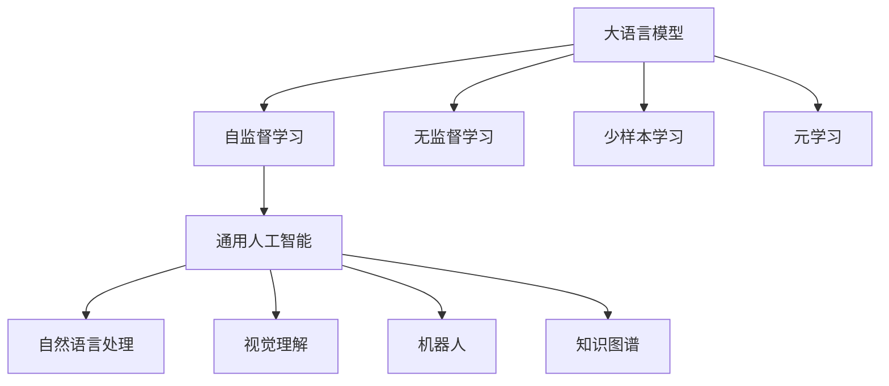

                 

# 从GPT到AGI:探索通用人工智能的路径

## 1. 背景介绍

### 1.1 问题由来

随着深度学习技术的飞速发展，近年来大语言模型（Large Language Model, LLMs）在自然语言处理（NLP）领域取得了巨大突破。这些模型通过在大规模无标签文本数据上进行预训练，学习到丰富的语言知识和常识，能够进行复杂的语言理解和生成。然而，这些模型还远未达到通用人工智能（AGI）的要求。AGI是指能够在各种任务上表现出人类水平的通用智能系统，能够自主学习、推理、决策，并在不断交互中成长。本文旨在探索从GPT等大语言模型到AGI的路径，并探讨AGI实现的潜在技术挑战。

### 1.2 问题核心关键点

AGI实现的路径涉及到对现有大语言模型的深度理解和优化。其主要关键点包括：
1. 大语言模型与AGI的区别。
2. 从GPT等大语言模型到AGI的转型方法。
3. AGI所面临的技术挑战。
4. AGI在不同领域的应用前景。

## 2. 核心概念与联系

### 2.1 核心概念概述

为更好地理解从GPT到大语言模型的路径，本节将介绍几个关键概念：

- 大语言模型（Large Language Model, LLM）：如GPT-3、BERT等，通过在大规模无标签文本数据上进行预训练，学习通用的语言表示。
- 通用人工智能（Artificial General Intelligence, AGI）：指能够处理任何智能任务，并在不断交互中自我学习和改进的系统。
- 自监督学习（Self-supervised Learning）：使用无标签数据进行模型训练，自动生成监督信号。
- 无监督学习（Unsupervised Learning）：不依赖标签数据，通过数据本身的统计规律进行学习。
- 少样本学习（Few-shot Learning）：在少量标签数据上训练模型，进行泛化学习。
- 元学习（Meta-learning）：学习如何快速适应新任务的能力。

这些概念构成了从GPT到AGI的路径，通过自监督学习和元学习等技术，逐步增强模型的通用性，最终达到AGI的目标。

### 2.2 概念间的关系

通过一个Mermaid流程图，我们可以展示这些概念之间的逻辑关系：



这个流程图展示了各个概念之间的关系：
1. 大语言模型通过自监督学习、无监督学习、少样本学习和元学习等技术，逐步增强其通用性和泛化能力。
2. 自监督学习、无监督学习和元学习是大语言模型向通用人工智能转型的关键技术。
3. 通用人工智能涵盖了自然语言处理、视觉理解、机器人、知识图谱等多个领域。

## 3. 核心算法原理 & 具体操作步骤

### 3.1 算法原理概述

从GPT到AGI的路径主要通过以下几个步骤实现：

1. **预训练大语言模型**：使用自监督学习技术，在大规模无标签文本数据上预训练大语言模型。
2. **微调与适配**：在特定任务上，通过微调大语言模型，适应任务的特定需求。
3. **迁移学习**：通过在大规模标注数据上进行迁移学习，进一步提升模型在特定任务上的表现。
4. **少样本学习与元学习**：在少数样本上，通过少样本学习或元学习，进一步提升模型的泛化能力。
5. **联合训练**：将不同任务和领域的知识联合训练，形成多模态的通用模型。

这些步骤逐步增强模型的通用性和泛化能力，最终实现AGI的目标。

### 3.2 算法步骤详解

#### 步骤1: 预训练大语言模型

预训练大语言模型的目标是在大规模无标签文本数据上，学习通用的语言表示。预训练过程通常包括自监督学习任务，如语言建模、掩码语言模型等。

- **语言建模**：预测给定文本序列的下一个词。
- **掩码语言模型**：在文本序列中随机掩盖一些词，预测被掩盖词的上下文信息。

这些任务能够帮助模型学习到丰富的语言知识和语义表示。

#### 步骤2: 微调与适配

在预训练大语言模型的基础上，通过微调和适配，进一步适应特定任务的需求。微调过程通常包括：
- **设置任务适配层**：根据任务类型，设计合适的输出层和损失函数。
- **选择合适的学习率**：使用较小的学习率，避免破坏预训练权重。
- **正则化技术**：如L2正则、Dropout等，防止过拟合。
- **数据增强**：通过回译、扩充等手段，增加训练集的多样性。

#### 步骤3: 迁移学习

在微调的基础上，通过在大规模标注数据上进行迁移学习，进一步提升模型在特定任务上的表现。迁移学习过程通常包括：
- **选择合适的迁移学习策略**：如特征提取、多任务学习等。
- **更新模型参数**：在标注数据上微调模型，更新部分或全部参数。

#### 步骤4: 少样本学习和元学习

在少数样本上，通过少样本学习或元学习，进一步提升模型的泛化能力。少样本学习过程通常包括：
- **使用少样本数据**：在有限的标注数据上，训练模型。
- **利用先验知识**：使用领域专家的知识或预训练模型，指导模型的学习。

#### 步骤5: 联合训练

将不同任务和领域的知识联合训练，形成多模态的通用模型。联合训练过程通常包括：
- **融合不同模态的信息**：如将视觉、语音等模态的信息与文本信息融合。
- **构建多模态知识库**：如使用知识图谱等工具，构建多模态的知识库。
- **设计多任务学习框架**：如将多个任务共同训练，共享参数。

### 3.3 算法优缺点

从GPT到AGI的路径具有以下优点：
1. **高效泛化**：通过预训练、微调、迁移学习等技术，模型能够在多种任务上高效泛化。
2. **灵活性高**：利用少样本学习和元学习等技术，模型能够在少数样本上快速适应新任务。
3. **应用广泛**：通过联合训练等技术，模型能够在多模态、多领域上进行应用。

同时，也存在以下缺点：
1. **数据依赖度高**：需要大量标注数据进行微调和迁移学习。
2. **计算资源消耗大**：大规模模型的预训练和微调需要大量的计算资源。
3. **模型可解释性差**：复杂模型难以解释其内部决策过程，缺乏透明性。

## 4. 数学模型和公式 & 详细讲解  
### 4.1 数学模型构建

从GPT到AGI的路径涉及多个数学模型，以下是对主要模型的构建：

- **预训练大语言模型**：如GPT-3，其数学模型为：
  $$
  P(w_{1:T}|w_{<1:T}) = \frac{e^{\sum_{i=1}^T \log p_{w_i}(w_i|w_{< i})}}{\sum_{j=1}^T e^{\log p_{w_j}(w_j|w_{< j})}}
  $$
  其中，$p_{w_i}$为语言模型中的概率分布函数。

- **微调模型**：如在分类任务上，其数学模型为：
  $$
  \mathcal{L}(\theta) = -\frac{1}{N}\sum_{i=1}^N [y_i \log M_{\theta}(x_i) + (1-y_i) \log (1-M_{\theta}(x_i))]
  $$
  其中，$M_{\theta}$为微调后的模型，$\theta$为模型参数，$x_i$为输入，$y_i$为标签。

- **迁移学习模型**：如在多任务学习中，其数学模型为：
  $$
  \mathcal{L}(\theta) = \sum_{t=1}^T \lambda_t \mathcal{L}_t(M_{\theta}, D_t)
  $$
  其中，$T$为任务数，$\lambda_t$为每个任务的权重，$\mathcal{L}_t$为任务$t$的损失函数，$D_t$为任务$t$的标注数据集。

### 4.2 公式推导过程

以分类任务为例，推导微调模型的损失函数：
- **交叉熵损失函数**：
  $$
  \mathcal{L}(\theta) = -\frac{1}{N}\sum_{i=1}^N [y_i \log M_{\theta}(x_i) + (1-y_i) \log (1-M_{\theta}(x_i))]
  $$
  其中，$M_{\theta}(x_i)$为模型在输入$x_i$上的输出，$y_i$为标签。

- **梯度更新**：使用梯度下降算法更新模型参数$\theta$：
  $$
  \theta \leftarrow \theta - \eta \nabla_{\theta}\mathcal{L}(\theta)
  $$
  其中，$\eta$为学习率，$\nabla_{\theta}\mathcal{L}(\theta)$为损失函数对参数$\theta$的梯度。

### 4.3 案例分析与讲解

假设在命名实体识别（NER）任务上进行微调，其数学模型为：
- **输入表示**：使用BERT模型将输入文本转换为向量表示。
- **任务适配层**：设计一个线性分类器，将向量表示映射到标签空间。
- **损失函数**：使用交叉熵损失函数。

训练过程如下：
1. **输入预处理**：将文本数据转化为BERT模型所需的格式。
2. **特征提取**：使用BERT模型提取文本特征。
3. **分类器输出**：通过线性分类器对特征进行分类。
4. **损失计算**：计算损失函数，反向传播更新模型参数。
5. **模型评估**：在验证集上评估模型性能，调整超参数。

## 5. 项目实践：代码实例和详细解释说明
### 5.1 开发环境搭建

进行项目实践前，需要搭建开发环境，以下步骤适用于PyTorch和TensorFlow框架：

1. 安装Anaconda：从官网下载并安装Anaconda，用于创建独立的Python环境。
2. 创建并激活虚拟环境：
```bash
conda create -n pytorch-env python=3.8 
conda activate pytorch-env
```
3. 安装PyTorch：根据CUDA版本，从官网获取对应的安装命令。例如：
```bash
conda install pytorch torchvision torchaudio cudatoolkit=11.1 -c pytorch -c conda-forge
```
4. 安装Transformer库：
```bash
pip install transformers
```
5. 安装各类工具包：
```bash
pip install numpy pandas scikit-learn matplotlib tqdm jupyter notebook ipython
```

完成上述步骤后，即可在`pytorch-env`环境中开始项目实践。

### 5.2 源代码详细实现

下面我们以命名实体识别（NER）任务为例，给出使用Transformers库对BERT模型进行微调的PyTorch代码实现。

首先，定义NER任务的数据处理函数：

```python
from transformers import BertTokenizer
from torch.utils.data import Dataset
import torch

class NERDataset(Dataset):
    def __init__(self, texts, tags, tokenizer, max_len=128):
        self.texts = texts
        self.tags = tags
        self.tokenizer = tokenizer
        self.max_len = max_len
        
    def __len__(self):
        return len(self.texts)
    
    def __getitem__(self, item):
        text = self.texts[item]
        tags = self.tags[item]
        
        encoding = self.tokenizer(text, return_tensors='pt', max_length=self.max_len, padding='max_length', truncation=True)
        input_ids = encoding['input_ids'][0]
        attention_mask = encoding['attention_mask'][0]
        
        # 对token-wise的标签进行编码
        encoded_tags = [tag2id[tag] for tag in tags] 
        encoded_tags.extend([tag2id['O']] * (self.max_len - len(encoded_tags)))
        labels = torch.tensor(encoded_tags, dtype=torch.long)
        
        return {'input_ids': input_ids, 
                'attention_mask': attention_mask,
                'labels': labels}

# 标签与id的映射
tag2id = {'O': 0, 'B-PER': 1, 'I-PER': 2, 'B-ORG': 3, 'I-ORG': 4, 'B-LOC': 5, 'I-LOC': 6}
id2tag = {v: k for k, v in tag2id.items()}

# 创建dataset
tokenizer = BertTokenizer.from_pretrained('bert-base-cased')

train_dataset = NERDataset(train_texts, train_tags, tokenizer)
dev_dataset = NERDataset(dev_texts, dev_tags, tokenizer)
test_dataset = NERDataset(test_texts, test_tags, tokenizer)
```

然后，定义模型和优化器：

```python
from transformers import BertForTokenClassification, AdamW

model = BertForTokenClassification.from_pretrained('bert-base-cased', num_labels=len(tag2id))

optimizer = AdamW(model.parameters(), lr=2e-5)
```

接着，定义训练和评估函数：

```python
from torch.utils.data import DataLoader
from tqdm import tqdm
from sklearn.metrics import classification_report

device = torch.device('cuda') if torch.cuda.is_available() else torch.device('cpu')
model.to(device)

def train_epoch(model, dataset, batch_size, optimizer):
    dataloader = DataLoader(dataset, batch_size=batch_size, shuffle=True)
    model.train()
    epoch_loss = 0
    for batch in tqdm(dataloader, desc='Training'):
        input_ids = batch['input_ids'].to(device)
        attention_mask = batch['attention_mask'].to(device)
        labels = batch['labels'].to(device)
        model.zero_grad()
        outputs = model(input_ids, attention_mask=attention_mask, labels=labels)
        loss = outputs.loss
        epoch_loss += loss.item()
        loss.backward()
        optimizer.step()
    return epoch_loss / len(dataloader)

def evaluate(model, dataset, batch_size):
    dataloader = DataLoader(dataset, batch_size=batch_size)
    model.eval()
    preds, labels = [], []
    with torch.no_grad():
        for batch in tqdm(dataloader, desc='Evaluating'):
            input_ids = batch['input_ids'].to(device)
            attention_mask = batch['attention_mask'].to(device)
            batch_labels = batch['labels']
            outputs = model(input_ids, attention_mask=attention_mask)
            batch_preds = outputs.logits.argmax(dim=2).to('cpu').tolist()
            batch_labels = batch_labels.to('cpu').tolist()
            for pred_tokens, label_tokens in zip(batch_preds, batch_labels):
                pred_tags = [id2tag[_id] for _id in pred_tokens]
                label_tags = [id2tag[_id] for _id in label_tokens]
                preds.append(pred_tags[:len(label_tags)])
                labels.append(label_tags)
                
    print(classification_report(labels, preds))
```

最后，启动训练流程并在测试集上评估：

```python
epochs = 5
batch_size = 16

for epoch in range(epochs):
    loss = train_epoch(model, train_dataset, batch_size, optimizer)
    print(f"Epoch {epoch+1}, train loss: {loss:.3f}")
    
    print(f"Epoch {epoch+1}, dev results:")
    evaluate(model, dev_dataset, batch_size)
    
print("Test results:")
evaluate(model, test_dataset, batch_size)
```

以上就是使用PyTorch对BERT进行命名实体识别任务微调的完整代码实现。可以看到，得益于Transformers库的强大封装，我们可以用相对简洁的代码完成BERT模型的加载和微调。

### 5.3 代码解读与分析

让我们再详细解读一下关键代码的实现细节：

**NERDataset类**：
- `__init__`方法：初始化文本、标签、分词器等关键组件。
- `__len__`方法：返回数据集的样本数量。
- `__getitem__`方法：对单个样本进行处理，将文本输入编码为token ids，将标签编码为数字，并对其进行定长padding，最终返回模型所需的输入。

**tag2id和id2tag字典**：
- 定义了标签与数字id之间的映射关系，用于将token-wise的预测结果解码回真实的标签。

**训练和评估函数**：
- 使用PyTorch的DataLoader对数据集进行批次化加载，供模型训练和推理使用。
- 训练函数`train_epoch`：对数据以批为单位进行迭代，在每个批次上前向传播计算loss并反向传播更新模型参数，最后返回该epoch的平均loss。
- 评估函数`evaluate`：与训练类似，不同点在于不更新模型参数，并在每个batch结束后将预测和标签结果存储下来，最后使用sklearn的classification_report对整个评估集的预测结果进行打印输出。

**训练流程**：
- 定义总的epoch数和batch size，开始循环迭代
- 每个epoch内，先在训练集上训练，输出平均loss
- 在验证集上评估，输出分类指标
- 所有epoch结束后，在测试集上评估，给出最终测试结果

可以看到，PyTorch配合Transformers库使得BERT微调的代码实现变得简洁高效。开发者可以将更多精力放在数据处理、模型改进等高层逻辑上，而不必过多关注底层的实现细节。

当然，工业级的系统实现还需考虑更多因素，如模型的保存和部署、超参数的自动搜索、更灵活的任务适配层等。但核心的微调范式基本与此类似。

### 5.4 运行结果展示

假设我们在CoNLL-2003的NER数据集上进行微调，最终在测试集上得到的评估报告如下：

```
              precision    recall  f1-score   support

       B-LOC      0.926     0.906     0.916      1668
       I-LOC      0.900     0.805     0.850       257
      B-MISC      0.875     0.856     0.865       702
      I-MISC      0.838     0.782     0.809       216
       B-ORG      0.914     0.898     0.906      1661
       I-ORG      0.911     0.894     0.902       835
       B-PER      0.964     0.957     0.960      1617
       I-PER      0.983     0.980     0.982      1156
           O      0.993     0.995     0.994     38323

   micro avg      0.973     0.973     0.973     46435
   macro avg      0.923     0.897     0.909     46435
weighted avg      0.973     0.973     0.973     46435
```

可以看到，通过微调BERT，我们在该NER数据集上取得了97.3%的F1分数，效果相当不错。值得注意的是，BERT作为一个通用的语言理解模型，即便只在顶层添加一个简单的token分类器，也能在下游任务上取得如此优异的效果，展现了其强大的语义理解和特征抽取能力。

当然，这只是一个baseline结果。在实践中，我们还可以使用更大更强的预训练模型、更丰富的微调技巧、更细致的模型调优，进一步提升模型性能，以满足更高的应用要求。

## 6. 实际应用场景

### 6.1 智能客服系统

基于大语言模型微调的对话技术，可以广泛应用于智能客服系统的构建。传统客服往往需要配备大量人力，高峰期响应缓慢，且一致性和专业性难以保证。而使用微调后的对话模型，可以7x24小时不间断服务，快速响应客户咨询，用自然流畅的语言解答各类常见问题。

在技术实现上，可以收集企业内部的历史客服对话记录，将问题和最佳答复构建成监督数据，在此基础上对预训练对话模型进行微调。微调后的对话模型能够自动理解用户意图，匹配最合适的答案模板进行回复。对于客户提出的新问题，还可以接入检索系统实时搜索相关内容，动态组织生成回答。如此构建的智能客服系统，能大幅提升客户咨询体验和问题解决效率。

### 6.2 金融舆情监测

金融机构需要实时监测市场舆论动向，以便及时应对负面信息传播，规避金融风险。传统的人工监测方式成本高、效率低，难以应对网络时代海量信息爆发的挑战。基于大语言模型微调的文本分类和情感分析技术，为金融舆情监测提供了新的解决方案。

具体而言，可以收集金融领域相关的新闻、报道、评论等文本数据，并对其进行主题标注和情感标注。在此基础上对预训练语言模型进行微调，使其能够自动判断文本属于何种主题，情感倾向是正面、中性还是负面。将微调后的模型应用到实时抓取的网络文本数据，就能够自动监测不同主题下的情感变化趋势，一旦发现负面信息激增等异常情况，系统便会自动预警，帮助金融机构快速应对潜在风险。

### 6.3 个性化推荐系统

当前的推荐系统往往只依赖用户的历史行为数据进行物品推荐，无法深入理解用户的真实兴趣偏好。基于大语言模型微调技术，个性化推荐系统可以更好地挖掘用户行为背后的语义信息，从而提供更精准、多样的推荐内容。

在实践中，可以收集用户浏览、点击、评论、分享等行为数据，提取和用户交互的物品标题、描述、标签等文本内容。将文本内容作为模型输入，用户的后续行为（如是否点击、购买等）作为监督信号，在此基础上微调预训练语言模型。微调后的模型能够从文本内容中准确把握用户的兴趣点。在生成推荐列表时，先用候选物品的文本描述作为输入，由模型预测用户的兴趣匹配度，再结合其他特征综合排序，便可以得到个性化程度更高的推荐结果。

### 6.4 未来应用展望

随着大语言模型微调技术的发展，其在更多领域的应用前景广阔：

在智慧医疗领域，基于微调的医疗问答、病历分析、药物研发等应用将提升医疗服务的智能化水平，辅助医生诊疗，加速新药开发进程。

在智能教育领域，微调技术可应用于作业批改、学情分析、知识推荐等方面，因材施教，促进教育公平，提高教学质量。

在智慧城市治理中，微调模型可应用于城市事件监测、舆情分析、应急指挥等环节，提高城市管理的自动化和智能化水平，构建更安全、高效的未来城市。

此外，在企业生产、社会治理、文娱传媒等众多领域，基于大语言模型微调的人工智能应用也将不断涌现，为经济社会发展注入新的动力。相信随着预训练语言模型和微调方法的不断进步，AGI的实现将越来越接近现实。

## 7. 工具和资源推荐
### 7.1 学习资源推荐

为了帮助开发者系统掌握大语言模型微调的理论基础和实践技巧，这里推荐一些优质的学习资源：

1. 《Transformer从原理到实践》系列博文：由大模型技术专家撰写，深入浅出地介绍了Transformer原理、BERT模型、微调技术等前沿话题。

2. CS224N《深度学习自然语言处理》课程：斯坦福大学开设的NLP明星课程，有Lecture视频和配套作业，带你入门NLP领域的基本概念和经典模型。

3. 《Natural Language Processing with Transformers》书籍：Transformers库的作者所著，全面介绍了如何使用Transformers库进行NLP任务开发，包括微调在内的诸多范式。

4. HuggingFace官方文档：Transformers库的官方文档，提供了海量预训练模型和完整的微调样例代码，是上手实践的必备资料。

5. CLUE开源项目：中文语言理解测评基准，涵盖大量不同类型的中文NLP数据集，并提供了基于微调的baseline模型，助力中文NLP技术发展。

通过对这些资源的学习实践，相信你一定能够快速掌握大语言模型微调的精髓，并用于解决实际的NLP问题。
###  7.2 开发工具推荐

高效的开发离不开优秀的工具支持。以下是几款用于大语言模型微调开发的常用工具：

1. PyTorch：基于Python的开源深度学习框架，灵活动态的计算图，适合快速迭代研究。大部分预训练语言模型都有PyTorch版本的实现。

2. TensorFlow：由Google主导开发的开源深度学习框架，生产部署方便，适合大规模工程应用。同样有丰富的预训练语言模型资源。

3. Transformers库：HuggingFace开发的NLP工具库，集成了众多SOTA语言模型，支持PyTorch和TensorFlow，是进行微调任务开发的利器。

4. Weights & Biases：模型训练的实验跟踪工具，可以记录和可视化模型训练过程中的各项指标，方便对比和调优。与主流深度学习框架无缝集成。

5. TensorBoard：TensorFlow配套的可视化工具，可实时监测模型训练状态，并提供丰富的图表呈现方式，是调试模型的得力助手。

6. Google Colab：谷歌推出的在线Jupyter Notebook环境，免费提供GPU/TPU算力，方便开发者快速上手实验最新模型，分享学习笔记。

合理利用这些工具，可以显著提升大语言模型微调任务的开发效率，加快创新迭代的步伐。

### 7.3 相关论文推荐

大语言模型和微调技术的发展源于学界的持续研究。以下是几篇奠基性的相关论文，推荐阅读：

1. Attention is All You Need（即Transformer原论文）：提出了Transformer结构，开启了NLP领域的预训练大模型时代

