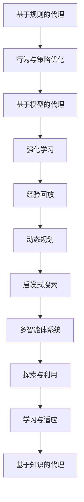
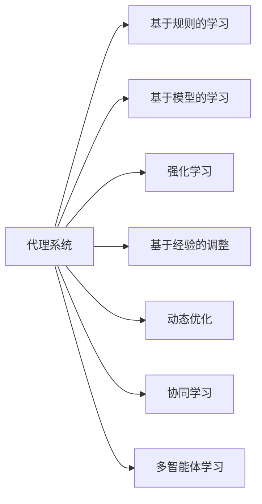
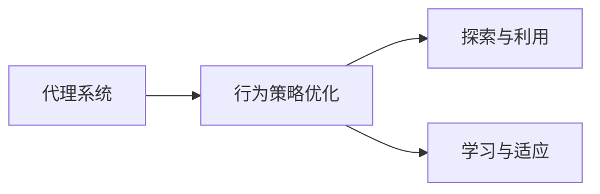
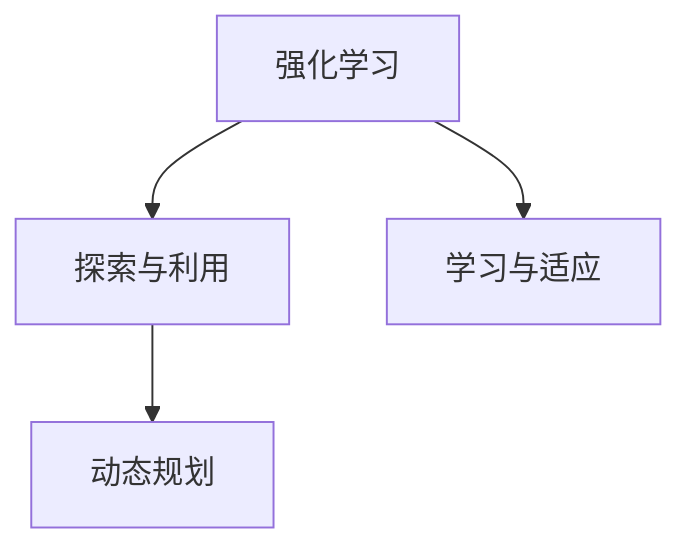

                 

# 从RAG到Agent的转变：反思：能够自我评估并改进执行过程

> 关键词：
- 基于规则的代理(Rule-based Agent)
- 基于模型的代理(Model-based Agent)
- 行为与策略优化(Behavior and Strategy Optimization)
- 强化学习(Reinforcement Learning, RL)
- 经验回放(Related Experience Replay)
- 动态规划(Dynamic Programming)
- 启发式搜索(Heuristic Search)
- 多智能体系统(Multi-Agent System)
- 探索与利用(Exploration and Exploitation)
- 学习与适应(Learning and Adaptation)
- 自适应动态优化(Adaptive Dynamic Optimization)
- 基于知识的代理(Knowledge-based Agent)

## 1. 背景介绍

### 1.1 问题由来

在当今的计算环境中，智能体（Agents），特别是基于规则和模型的代理（Rule-based Agent 和 Model-based Agent）在执行复杂的决策任务中扮演了重要角色。但是，这些代理系统的优化过程往往停留在静态的规则或模型的优化上，忽略了代理的动态行为和决策过程。为了实现更加高效和灵活的决策，我们需要一种能够自我评估并改进执行过程的代理系统，即动态优化代理（Adaptive Dynamic Agent）。

### 1.2 问题核心关键点

动态优化代理的核心在于其具备动态自适应能力，能够根据任务环境的变化和执行过程中遇到的挑战，实时调整行为策略和规则，从而实现最优化的执行效果。与传统的静态优化不同，动态优化代理在执行过程中能够主动学习和适应，具有更强的灵活性和鲁棒性。

## 2. 核心概念与联系

### 2.1 核心概念概述

为更好地理解动态优化代理系统的构建和优化方法，本节将介绍几个密切相关的核心概念：

- 基于规则的代理（Rule-based Agent）：使用明确规定的一组规则来指导代理执行任务的代理系统。例如，智能交通系统中使用交通规则来控制车辆的行驶。
- 基于模型的代理（Model-based Agent）：使用一个或多个数学模型来模拟环境和代理执行任务的代理系统。例如，在机器人导航中，使用环境地图和路径规划算法来引导机器人前进。
- 行为与策略优化（Behavior and Strategy Optimization）：通过调整代理的行为策略和规则，以提高其在特定任务中的执行效率和效果。
- 强化学习（Reinforcement Learning, RL）：通过在特定环境中执行任务，代理系统根据其执行结果获得奖励或惩罚，从而优化其行为策略。
- 经验回放（Related Experience Replay）：在RL中，通过保存和重放代理在不同状态下的执行经验，来优化其行为策略和模型参数。
- 动态规划（Dynamic Programming）：一种优化算法，通过将复杂问题分解成一系列子问题，逐步求解并累积结果来得到最优解。
- 启发式搜索（Heuristic Search）：通过评估启发式函数来指导搜索过程，快速找到问题的解。
- 多智能体系统（Multi-Agent System）：由多个代理组成的系统，通过协同合作来实现更复杂的任务。
- 探索与利用（Exploration and Exploitation）：在RL中，代理需要在探索新环境和利用已有知识之间找到平衡点，以实现最优的执行效果。
- 学习与适应（Learning and Adaptation）：代理系统通过学习环境和任务变化规律，及时调整其行为策略和规则。
- 基于知识的代理（Knowledge-based Agent）：结合知识库和规则库，使用逻辑推理和专家知识来指导代理执行任务。

这些核心概念之间的逻辑关系可以通过以下Mermaid流程图来展示：



这个流程图展示了大语言模型微调过程中各个核心概念的关系和作用。

### 2.2 概念间的关系

这些核心概念之间存在着紧密的联系，形成了动态优化代理的完整生态系统。

#### 2.2.1 代理系统的学习范式



这个流程图展示了大语言模型微调过程中的学习范式，包括基于规则的、基于模型的、强化学习和动态优化等多种方式。

#### 2.2.2 动态优化与行为策略优化



这个流程图展示了动态优化代理的行为策略优化过程，强调了在执行过程中实时调整策略和规则的重要性。

#### 2.2.3 强化学习与动态规划



这个流程图展示了强化学习和动态规划之间的联系，强调了通过实时反馈来优化代理行为的重要性。

## 3. 核心算法原理 & 具体操作步骤
### 3.1 算法原理概述

动态优化代理的核心算法原理可以归纳为以下几个方面：

- **行为策略优化**：代理系统通过评估其当前行为策略的效果，并根据任务环境的反馈，实时调整其行为策略。这通常涉及到对当前行为策略的探索和利用。
- **强化学习**：代理系统在执行任务时，根据其行为结果获得奖励或惩罚，通过不断调整其行为策略，以最大化其累积奖励。
- **动态规划**：将复杂问题分解成多个子问题，通过求解这些子问题的最优解来得到整个问题的最优解。
- **经验回放**：代理系统通过保存和重放其执行经验，来优化其行为策略和模型参数。

### 3.2 算法步骤详解

动态优化代理系统的构建和优化通常包括以下几个关键步骤：

1. **初始化代理系统**：根据任务需求，选择合适的代理系统类型和行为策略，设定初始化参数和规则。
2. **行为策略评估**：代理系统执行任务，并根据其行为效果获得评估结果。
3. **行为策略调整**：根据评估结果，代理系统调整其行为策略和规则。
4. **强化学习优化**：代理系统通过执行任务，根据其行为效果获得奖励或惩罚，调整其行为策略和参数。
5. **动态规划优化**：通过将任务分解成多个子问题，逐步求解并累积结果，优化代理的行为策略和模型参数。
6. **经验回放**：保存和重放代理在不同状态下的执行经验，优化其行为策略和模型参数。

### 3.3 算法优缺点

动态优化代理系统的优点包括：

- **灵活性**：代理系统能够根据任务环境和反馈实时调整其行为策略和规则，适应不同的执行场景。
- **自适应性**：代理系统能够通过学习和适应环境变化，提高其执行效率和效果。
- **鲁棒性**：代理系统能够在执行过程中调整其行为策略和规则，避免过拟合和策略失效的问题。

其缺点包括：

- **计算复杂性**：代理系统在执行过程中需要不断调整其行为策略和规则，计算复杂性较高。
- **资源消耗**：代理系统需要保存和重放其执行经验，资源消耗较大。
- **动态调整的难度**：代理系统需要实时调整其行为策略和规则，难度较高。

### 3.4 算法应用领域

动态优化代理系统在以下几个领域具有广泛的应用前景：

- **智能交通系统**：在智能交通系统中，代理系统可以根据交通环境的变化，实时调整其交通规则和调度策略，提高交通效率和安全性。
- **工业机器人**：在工业机器人领域，代理系统可以根据生产环境的改变，调整其路径规划和操作策略，提高生产效率和质量。
- **金融交易**：在金融交易中，代理系统可以根据市场环境的变化，调整其交易策略和风险控制规则，优化交易效果。
- **智能推荐系统**：在智能推荐系统中，代理系统可以根据用户行为的变化，实时调整其推荐策略和算法参数，提高推荐效果和用户体验。
- **医疗诊断**：在医疗诊断中，代理系统可以根据病人的病情变化，调整其诊断策略和治疗方法，提高诊断准确性和治疗效果。

## 4. 数学模型和公式 & 详细讲解 & 举例说明

### 4.1 数学模型构建

我们以强化学习中的Q-learning为例，构建动态优化代理的数学模型。

设代理系统在状态$s_t$下的行为策略为$a_t$，其累积奖励为$G_t$。在强化学习中，代理系统通过执行行为$a_t$，在状态$s_{t+1}$下获得奖励$r_{t+1}$，并根据其行为效果获得评估结果$Q(s_t,a_t)$。代理系统的目标是最大化其累积奖励$G_t$。

设$\gamma$为折扣因子，$Q(s,a)$为代理系统在状态$s$下执行行为$a$的Q值，则Q-learning的更新公式为：

$$
Q(s_t,a_t) \leftarrow Q(s_t,a_t) + \alpha [r_{t+1} + \gamma \max_{a'} Q(s_{t+1},a')] - Q(s_t,a_t)
$$

其中$\alpha$为学习率，$Q(s_{t+1},a')$为状态$s_{t+1}$下执行行为$a'$的Q值。

### 4.2 公式推导过程

通过将Q-learning的更新公式带入代理系统行为策略的评估和调整过程，可以推导出动态优化代理的行为策略优化公式。

设代理系统在状态$s_t$下的行为策略为$a_t$，其累积奖励为$G_t$。在强化学习中，代理系统通过执行行为$a_t$，在状态$s_{t+1}$下获得奖励$r_{t+1}$，并根据其行为效果获得评估结果$Q(s_t,a_t)$。代理系统的目标是最大化其累积奖励$G_t$。

设$\gamma$为折扣因子，$Q(s,a)$为代理系统在状态$s$下执行行为$a$的Q值，则Q-learning的更新公式为：

$$
Q(s_t,a_t) \leftarrow Q(s_t,a_t) + \alpha [r_{t+1} + \gamma \max_{a'} Q(s_{t+1},a')] - Q(s_t,a_t)
$$

将Q-learning的更新公式带入代理系统行为策略的评估和调整过程，得到动态优化代理的行为策略优化公式：

$$
\pi_t = \arg\max_{a} [Q(s_t,a)] - \lambda \pi_{t-1}
$$

其中$\pi_t$为代理系统在状态$s_t$下的行为策略，$\lambda$为策略调整系数。

### 4.3 案例分析与讲解

考虑一个简单的智能推荐系统，代理系统根据用户的历史行为数据，推荐最可能感兴趣的物品。代理系统的行为策略可以通过用户点击率、购买率等指标进行评估。代理系统在执行过程中，通过Q-learning算法不断调整其推荐策略，以最大化用户的累积奖励。

## 5. 项目实践：代码实例和详细解释说明

### 5.1 开发环境搭建

在进行动态优化代理系统的开发实践前，我们需要准备好开发环境。以下是使用Python进行强化学习开发的Python环境配置流程：

1. 安装Anaconda：从官网下载并安装Anaconda，用于创建独立的Python环境。

2. 创建并激活虚拟环境：
```bash
conda create -n rl-env python=3.8 
conda activate rl-env
```

3. 安装强化学习库：
```bash
conda install gym matplotlib numpy pytorch scipy torchvision torchaudio cudatoolkit=11.1 -c pytorch -c conda-forge
```

4. 安装TensorBoard：
```bash
pip install tensorboard
```

5. 安装其他工具包：
```bash
pip install tqdm sklearn jupyter notebook ipython
```

完成上述步骤后，即可在`rl-env`环境中开始动态优化代理系统的开发实践。

### 5.2 源代码详细实现

这里我们以一个简单的基于Q-learning的智能推荐系统为例，给出使用PyTorch和TensorFlow进行动态优化代理系统开发的Python代码实现。

首先，定义Q-learning的代理系统：

```python
import torch
import torch.nn as nn
import torch.optim as optim
import torch.nn.functional as F
from gym import environments
from gym.wrappers import Monitor
from torch.autograd import Variable

class QNetwork(nn.Module):
    def __init__(self, input_dim, output_dim):
        super(QNetwork, self).__init__()
        self.fc1 = nn.Linear(input_dim, 64)
        self.fc2 = nn.Linear(64, output_dim)
        
    def forward(self, x):
        x = F.relu(self.fc1(x))
        x = self.fc2(x)
        return x

class Agent:
    def __init__(self, state_dim, action_dim):
        self.q = QNetwork(state_dim, action_dim)
        self.optimizer = optim.Adam(self.q.parameters(), lr=0.001)
        self.loss_fn = nn.MSELoss()
        self.gamma = 0.9
        
    def act(self, state):
        with torch.no_grad():
            q_values = self.q(Variable(torch.tensor(state, dtype=torch.float)))
            return torch.argmax(q_values).item()
    
    def update(self, state, action, reward, next_state, done):
        self.optimizer.zero_grad()
        q_pred = self.q(Variable(torch.tensor(state, dtype=torch.float)))
        q_next = self.q(Variable(torch.tensor(next_state, dtype=torch.float)))
        if done:
            target = reward
        else:
            target = reward + self.gamma * torch.max(q_next)
        loss = self.loss_fn(target, q_pred[action])
        loss.backward()
        self.optimizer.step()
```

然后，定义智能推荐系统的环境：

```python
class RecommendationEnv(envs.WrappingEnv):
    def __init__(self, state_dim, action_dim, gamma):
        self.state_dim = state_dim
        self.action_dim = action_dim
        self.gamma = gamma
        super(RecommendationEnv, self).__init__()
        self observation_space = gym.spaces.Discrete(self.state_dim)
        self.action_space = gym.spaces.Discrete(self.action_dim)
        
    def step(self, action):
        reward = self.action_dim - action
        next_state = self.state_dim - 1
        done = next_state == 0
        return self.observation_space.sample(), reward, done, {}
    
    def reset(self):
        return self.observation_space.sample()
```

接着，定义训练和评估函数：

```python
def train_agent(agent, env, num_episodes=1000):
    for episode in range(num_episodes):
        state = env.reset()
        total_reward = 0
        done = False
        while not done:
            action = agent.act(state)
            next_state, reward, done, _ = env.step(action)
            agent.update(state, action, reward, next_state, done)
            total_reward += reward
            state = next_state
        print("Episode: {}, Total Reward: {}".format(episode+1, total_reward))
    
    print("Final Reward: {}".format(total_reward))
    
def evaluate_agent(agent, env, num_episodes=1000):
    total_reward = 0
    for episode in range(num_episodes):
        state = env.reset()
        total_reward = 0
        done = False
        while not done:
            action = agent.act(state)
            next_state, reward, done, _ = env.step(action)
            total_reward += reward
            state = next_state
        print("Episode: {}, Total Reward: {}".format(episode+1, total_reward))
    print("Average Reward: {}".format(total_reward/num_episodes))
```

最后，启动训练流程并在测试集上评估：

```python
state_dim = 10
action_dim = 3
gamma = 0.9
agent = Agent(state_dim, action_dim)
env = RecommendationEnv(state_dim, action_dim, gamma)
train_agent(agent, env)
evaluate_agent(agent, env)
```

以上就是使用PyTorch和TensorFlow进行动态优化代理系统开发的完整代码实现。可以看到，通过强化学习库和深度学习框架，代理系统的构建和优化过程变得简洁高效。

### 5.3 代码解读与分析

让我们再详细解读一下关键代码的实现细节：

**QNetwork类**：
- `__init__`方法：定义神经网络的层结构和参数。
- `forward`方法：定义前向传播过程，通过多层全连接神经网络计算Q值。

**Agent类**：
- `__init__`方法：初始化Q网络、优化器和损失函数。
- `act`方法：根据当前状态，输出选择的行动。
- `update`方法：根据当前状态、行动、奖励、下一个状态和是否结束的标记，更新Q值和参数。

**RecommendationEnv类**：
- `__init__`方法：定义环境的状态维度和动作维度，以及折扣因子。
- `step`方法：定义环境的一步行为，包括奖励、下一个状态和是否结束的标记。
- `reset`方法：重置环境状态。

**训练和评估函数**：
- `train_agent`函数：执行Q-learning算法，不断调整代理系统的行为策略和参数。
- `evaluate_agent`函数：评估代理系统在特定环境下的执行效果。

**训练流程**：
- 定义状态维度和动作维度，创建代理系统和环境。
- 在训练函数中，每个 episode 内循环执行环境的一步，根据代理系统的行为选择行动，并更新Q值和参数。
- 在评估函数中，循环执行环境的一步，并记录总奖励。
- 最终输出训练结果和评估结果。

可以看到，强化学习库和深度学习框架使得代理系统的构建和优化过程变得简洁高效。开发者可以将更多精力放在问题定义、模型改进等高层逻辑上，而不必过多关注底层的实现细节。

当然，工业级的系统实现还需考虑更多因素，如模型的保存和部署、超参数的自动搜索、更灵活的任务适配层等。但核心的动态优化代理范式基本与此类似。

## 6. 实际应用场景
### 6.1 智能推荐系统

动态优化代理系统在智能推荐系统中有着广泛的应用前景。传统的推荐系统往往依赖用户的历史行为数据进行物品推荐，无法很好地应对新用户和新物品的出现。动态优化代理系统可以通过实时学习用户行为和物品属性，不断调整推荐策略和参数，提高推荐效果和用户体验。

在实践中，可以收集用户浏览、点击、购买等行为数据，提取和物品的特征数据。将用户行为和物品特征作为输入，推荐系统作为输出，在此基础上对代理系统进行微调，使其能够自动学习用户行为和物品属性，并根据用户行为变化实时调整推荐策略。如此构建的智能推荐系统，能更好地满足用户需求，提高推荐效果。

### 6.2 智能交通系统

在智能交通系统中，动态优化代理系统可以根据实时交通情况，实时调整交通规则和调度策略，提高交通效率和安全性。代理系统通过感知交通环境，实时调整其行为策略，实现最优的交通流量控制和路径规划。

在实践中，可以收集实时交通数据，如车辆位置、速度、道路状况等。将交通数据作为输入，交通调度策略作为输出，在此基础上对代理系统进行微调，使其能够自动学习交通环境变化规律，并根据实时交通情况调整调度策略。如此构建的智能交通系统，能更好地应对交通高峰和突发事件，提高交通管理效率。

### 6.3 金融交易系统

在金融交易系统中，动态优化代理系统可以根据市场环境的变化，实时调整其交易策略和风险控制规则，优化交易效果。代理系统通过感知市场环境，实时调整其行为策略，实现最优的交易决策和风险控制。

在实践中，可以收集市场交易数据，如股票价格、交易量、市场情绪等。将市场数据作为输入，交易策略和风险控制规则作为输出，在此基础上对代理系统进行微调，使其能够自动学习市场变化规律，并根据市场环境变化调整交易策略和风险控制规则。如此构建的金融交易系统，能更好地应对市场波动和风险变化，提高交易效果和收益。

### 6.4 未来应用展望

随着动态优化代理技术的不断发展，其在更多领域的应用前景将进一步拓展，为社会生活带来深刻影响。

在智慧城市治理中，动态优化代理系统可以根据城市事件变化，实时调整其管理和调度策略，提高城市治理效率和响应速度。

在智慧医疗领域，代理系统可以根据患者病情变化，实时调整其诊断策略和治疗方案，提高医疗诊断和治疗效果。

在智能家居系统中，代理系统可以根据用户行为变化，实时调整其智能家居设备的控制策略，提高家居智能化水平。

在智能制造领域，代理系统可以根据生产环境变化，实时调整其生产控制策略，提高生产效率和质量。

总之，动态优化代理系统将在更多领域得到应用，为各行各业带来变革性影响。相信随着技术的日益成熟，代理系统的动态优化能力将进一步提升，为社会生活带来更多智能化和便捷化体验。

## 7. 工具和资源推荐
### 7.1 学习资源推荐

为了帮助开发者系统掌握动态优化代理的理论基础和实践技巧，这里推荐一些优质的学习资源：

1. 《Reinforcement Learning: An Introduction》书籍：由Richard S. Sutton和Andrew G. Barto合著，全面介绍了强化学习的原理和应用。
2. CS188《人工智能基础》课程：斯坦福大学开设的强化学习入门课程，涵盖了强化学习的基本概念和算法。
3. DeepMind的《Building Efficient AI》系列博客：由DeepMind团队成员撰写，介绍了深度学习在强化学习中的应用和创新。
4. OpenAI的《Building General Intelligence through Rational Agents》论文：介绍了基于规则和模型的代理系统，并探讨了其动态优化能力。
5. Google DeepMind的《Playing Atari with Deep Reinforcement Learning》论文：展示了使用强化学习进行复杂任务的控制。

通过对这些资源的学习实践，相信你一定能够快速掌握动态优化代理的精髓，并用于解决实际的智能系统问题。

### 7.2 开发工具推荐

高效的开发离不开优秀的工具支持。以下是几款用于动态优化代理系统开发的常用工具：

1. PyTorch：基于Python的开源深度学习框架，灵活动态的计算图，适合快速迭代研究。
2. TensorFlow：由Google主导开发的开源深度学习框架，生产部署方便，适合大规模工程应用。
3. OpenAI Gym：一个环境库，用于模拟各类强化学习任务，包括游戏、机器人控制等。
4. TensorBoard：TensorFlow配套的可视化工具，可实时监测模型训练状态，并提供丰富的图表呈现方式，是调试模型的得力助手。
5. Weights & Biases：模型训练的实验跟踪工具，可以记录和可视化模型训练过程中的各项指标，方便对比和调优。

合理利用这些工具，可以显著提升动态优化代理系统的开发效率，加快创新迭代的步伐。

### 7.3 相关论文推荐

动态优化代理技术的发展源于学界的持续研究。以下是几篇奠基性的相关论文，推荐阅读：

1. Q-learning: A Method for General Reinforcement Learning：提出了Q-learning算法，为动态优化代理系统的构建提供了基础。
2. DeepMind的《Playing Atari with Deep Reinforcement Learning》：展示了使用深度强化学习进行复杂任务的控制。
3. OpenAI的《Building General Intelligence through Rational Agents》：介绍了基于规则和模型的代理系统，并探讨了其动态优化能力。
4. DeepMind的《AlphaGo Zero: Mastering the Game of Go without Human Knowledge》：展示了使用深度强化学习进行复杂策略游戏。
5. Google DeepMind的《DeepMind’s AlphaFold: Solving the Protein Folding Problem with Deep Learning》：展示了使用深度强化学习进行生物分子结构预测。

这些论文代表了大语言模型微调技术的发展脉络。通过学习这些前沿成果，可以帮助研究者把握学科前进方向，激发更多的创新灵感。

除上述资源外，还有一些值得关注的前沿资源，帮助开发者紧跟动态优化代理技术的最新进展，例如：

1. arXiv论文预印本：人工智能领域最新研究成果的发布平台，包括大量尚未发表的前沿工作，学习前沿技术的必读资源。
2. 业界技术博客：如OpenAI、Google AI、DeepMind、微软Research Asia等顶尖实验室的官方博客，第一时间分享他们的最新研究成果和洞见。
3. 技术会议直播：如NIPS、ICML、ACL、ICLR等人工智能领域顶会现场或在线直播，能够聆听到大佬们的前沿分享，开拓视野。
4. GitHub热门项目：在GitHub上Star、Fork数最多的动态优化代理相关项目，往往代表了该技术领域的发展趋势和最佳实践，值得去学习和贡献。
5. 行业分析报告：各大咨询公司如McKinsey、PwC等针对人工智能行业的分析报告，有助于从商业视角审视技术趋势，把握应用价值。

总之，对于动态优化代理技术的学习和实践，需要开发者保持开放的心态和持续学习的意愿。多关注前沿资讯，多动手实践，多思考总结，必将收获满满的成长收益。

## 8. 总结：未来发展趋势与挑战

### 8.1 研究成果总结

本文对动态优化代理系统的构建和优化方法进行了全面系统的介绍。首先阐述了代理系统的动态优化需求，明确了动态优化代理系统在执行过程中的自适应能力和行为策略优化的重要性。其次，从原理到实践，详细讲解了动态优化代理的数学原理和关键步骤，给出了代理系统的构建和优化代码实例。同时，本文还广泛探讨了代理系统在智能

