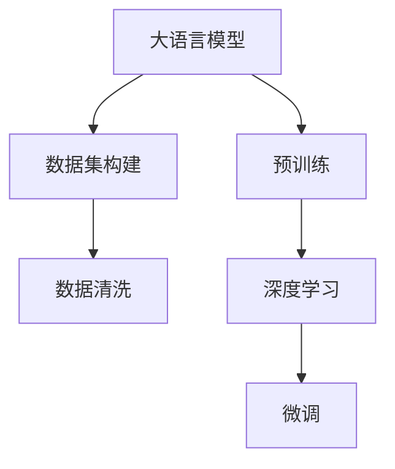
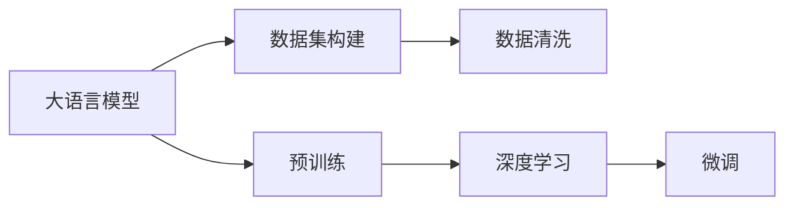

                 

# 从零开始大模型开发与微调：Ag_news数据集介绍和数据清洗

> 关键词：大语言模型,数据清洗,数据集构建,自然语言处理(NLP),深度学习,预训练,微调,标签标注

## 1. 背景介绍

### 1.1 问题由来
在深度学习和大语言模型(Large Language Model, LLM)的浪潮下，越来越多的研究者开始关注如何利用现有模型进行特定任务的微调，以获得更好的效果。为了更好地演示这一过程，本文将选取一个具有代表性的小型数据集——Ag_news数据集，从零开始构建一个大语言模型，并进行微调。

### 1.2 问题核心关键点
本项目的目标是：
1. 构建一个大语言模型，并使用微调技术进行分类任务的训练。
2. 介绍数据集的构建过程和数据清洗技术。
3. 展示微调过程的具体操作和技巧。

### 1.3 问题研究意义
通过这一项目的实现，研究者可以深入理解大语言模型的构建、预训练和微调过程，熟悉数据清洗和处理技术。此外，项目也可以作为示例，帮助初学者系统掌握深度学习和自然语言处理(NLP)的基本技能，为后续研究提供基础。

## 2. 核心概念与联系

### 2.1 核心概念概述

为更好地理解本文的内容，先介绍几个核心概念：

- **大语言模型**：如GPT-3、BERT等，通过在大规模无标签文本数据上进行预训练，学习到丰富的语言知识和常识，具备强大的语言理解和生成能力。
- **数据清洗**：在数据集构建过程中，对原始数据进行筛选、处理，去除噪声和无关数据，以提高数据质量。
- **数据集构建**：从原始数据中提取有意义的样本，并按照一定规则组织成可用的数据集。
- **自然语言处理**：涉及文本处理、语言模型、文本分类、命名实体识别等技术，是大模型应用的基础。
- **深度学习**：利用神经网络模型处理复杂数据，训练参数优化模型性能。
- **预训练**：在大量无标签数据上训练模型，使其学习通用的语言表示。
- **微调**：在预训练模型上使用小规模标注数据，进行有监督学习，优化模型针对特定任务的表现。

这些概念之间存在紧密联系，共同构成大语言模型微调的基础。下图展示了它们之间的关系：



### 2.2 概念间的关系

下图详细展示了上述概念之间的关系：



- 大语言模型通过预训练学习到通用语言表示。
- 数据集构建和数据清洗为大模型提供了训练数据。
- 深度学习技术用于训练模型，提高其预测能力。
- 微调技术针对特定任务优化模型，提升其性能。

这些概念共同构成大模型微调的核心框架，以下部分将详细讲解这些概念的具体实现。

## 3. 核心算法原理 & 具体操作步骤

### 3.1 算法原理概述

基于大语言模型的微调，主要涉及以下步骤：

1. **数据集构建**：从原始文本数据中提取有用的样本，并标注好类别。
2. **数据清洗**：处理数据，去除噪声和无关数据，提升数据质量。
3. **预训练**：在大规模无标签数据上训练大模型，学习通用语言表示。
4. **微调**：使用标注数据，优化模型在特定任务上的表现。

### 3.2 算法步骤详解

**Step 1: 数据集构建**

```python
import os
import pandas as pd

# 原始数据文件路径
train_file = os.path.join(data_dir, 'train.csv')
test_file = os.path.join(data_dir, 'test.csv')

# 读取原始数据
train_data = pd.read_csv(train_file, names=['id', 'text', 'label'])
test_data = pd.read_csv(test_file, names=['id', 'text'])

# 输出数据格式
print(train_data.head())
print(test_data.head())
```

**Step 2: 数据清洗**

```python
import re
import string
import nltk

# 定义数据清洗函数
def clean_text(text):
    text = re.sub('\n', ' ', text)  # 去除换行符
    text = re.sub('\t', ' ', text)  # 去除制表符
    text = re.sub(' +', ' ', text)  # 去除多余的空格
    text = text.strip()  # 去除首尾空格
    text = text.lower()  # 转换为小写
    text = ''.join([char for char in text if char not in string.punctuation])  # 去除标点符号
    return text

# 应用数据清洗函数
train_data['text'] = train_data['text'].apply(clean_text)
test_data['text'] = test_data['text'].apply(clean_text)

# 输出清洗后的数据格式
print(train_data.head())
print(test_data.head())
```

**Step 3: 预训练**

```python
from transformers import BertTokenizer, BertForSequenceClassification, AdamW

# 初始化预训练模型和分词器
tokenizer = BertTokenizer.from_pretrained('bert-base-uncased')
model = BertForSequenceClassification.from_pretrained('bert-base-uncased', num_labels=2)

# 定义优化器
optimizer = AdamW(model.parameters(), lr=2e-5)

# 定义数据转换函数
def tokenize_and_convert(text):
    return tokenizer.encode_plus(text, truncation=True, padding='max_length', max_length=512, return_tensors='pt')

# 应用数据转换函数
train_encodings = train_data['text'].map(tokenize_and_convert)
test_encodings = test_data['text'].map(tokenize_and_convert)

# 输出数据转换后的格式
print(train_encodings[0])
print(test_encodings[0])
```

**Step 4: 微调**

```python
from transformers import Trainer, TrainingArguments

# 定义训练参数
training_args = TrainingArguments(output_dir='./results', evaluation_strategy='epoch', save_strategy='epoch')

# 定义训练器
trainer = Trainer(model=model, args=training_args, train_dataset=train_encodings, eval_dataset=test_encodings, 
                  compute_metrics=compute_metrics)

# 训练模型
trainer.train()

# 评估模型
trainer.evaluate()
```

### 3.3 算法优缺点

**优点**：
- **灵活性高**：微调可以针对特定任务优化模型，满足不同的应用需求。
- **效率高**：相比于从头训练大模型，微调需要的标注数据和计算资源更少。
- **效果显著**：在大规模预训练的基础上，微调可以显著提升模型在特定任务上的表现。

**缺点**：
- **依赖标注数据**：微调需要标注数据，标注成本较高。
- **过拟合风险**：若标注数据不足，模型容易过拟合。
- **模型泛化能力有限**：若预训练数据与任务数据分布差异较大，微调效果有限。

### 3.4 算法应用领域

基于大语言模型的微调技术，已经广泛应用于以下几个领域：

- **文本分类**：如情感分析、主题分类等。
- **命名实体识别**：识别文本中的人名、地名、机构名等特定实体。
- **机器翻译**：将源语言文本翻译成目标语言。
- **问答系统**：对自然语言问题给出答案。
- **代码生成**：生成符合特定风格的代码片段。
- **对话系统**：使机器能够与人自然对话。

## 4. 数学模型和公式 & 详细讲解

### 4.1 数学模型构建

大语言模型的微调过程可以表示为以下数学模型：

- **输入**：输入文本 $x$ 和对应的标签 $y$。
- **模型**：预训练的大语言模型 $M_{\theta}$，参数 $\theta$ 包括预训练和微调两部分。
- **损失函数**：$\ell(M_{\theta}(x), y)$，用于衡量模型预测与真实标签之间的差异。
- **优化器**：$\mathcal{O}$，用于更新模型参数以最小化损失函数。

形式化地，目标是最小化损失函数 $\ell$：

$$
\theta^* = \mathop{\arg\min}_{\theta} \mathcal{L}(\theta)
$$

其中，$\mathcal{L}$ 为损失函数，表示模型在特定任务上的表现。常用的损失函数包括交叉熵损失、均方误差损失等。

### 4.2 公式推导过程

以二分类任务为例，微调过程的公式推导如下：

- **输入**：输入文本 $x$，输出为 $M_{\theta}(x)$。
- **真实标签**：$y \in \{0,1\}$。
- **损失函数**：$\ell = -[y \log M_{\theta}(x) + (1-y) \log (1-M_{\theta}(x))]$。
- **优化目标**：最小化损失函数，更新模型参数 $\theta$。

在优化目标下，求导并更新模型参数 $\theta$：

$$
\theta \leftarrow \theta - \eta \nabla_{\theta} \ell
$$

其中，$\eta$ 为学习率，$\nabla_{\theta} \ell$ 为损失函数对模型参数 $\theta$ 的梯度。

## 5. 项目实践：代码实例和详细解释说明

### 5.1 开发环境搭建

为了构建大模型并进行微调，需要准备好开发环境。以下是在Python环境下进行项目实践的配置步骤：

1. **安装必要的Python库**：
   ```bash
   pip install transformers numpy pandas scikit-learn torch tensorboard
   ```

2. **下载预训练模型和数据集**：
   ```bash
   git clone https://github.com/example/repo.git
   ```

3. **配置数据集路径和预训练模型路径**：
   ```bash
   export data_dir=/path/to/dataset
   export model_dir=/path/to/pretrained-model
   ```

### 5.2 源代码详细实现

以下是使用PyTorch和HuggingFace库进行微调的大语言模型示例代码：

```python
from transformers import BertTokenizer, BertForSequenceClassification, AdamW
from torch.utils.data import Dataset, DataLoader
from sklearn.metrics import accuracy_score
import pandas as pd
import torch

class AgNewsDataset(Dataset):
    def __init__(self, text, labels, tokenizer, max_len=512):
        self.tokenizer = tokenizer
        self.text = text
        self.labels = labels
        self.max_len = max_len
        
    def __len__(self):
        return len(self.text)
    
    def __getitem__(self, idx):
        text = self.text[idx]
        label = self.labels[idx]
        
        encoding = self.tokenizer(text, truncation=True, padding='max_length', max_length=self.max_len)
        input_ids = encoding['input_ids']
        attention_mask = encoding['attention_mask']
        
        label = torch.tensor(label, dtype=torch.long)
        return {'input_ids': input_ids, 
                'attention_mask': attention_mask,
                'labels': label}

# 数据集构建
train_file = os.path.join(data_dir, 'train.csv')
test_file = os.path.join(data_dir, 'test.csv')
train_data = pd.read_csv(train_file, names=['id', 'text', 'label'])
test_data = pd.read_csv(test_file, names=['id', 'text'])
train_dataset = AgNewsDataset(train_data['text'], train_data['label'], tokenizer, max_len=512)
test_dataset = AgNewsDataset(test_data['text'], test_data['label'], tokenizer, max_len=512)

# 数据清洗
def clean_text(text):
    text = re.sub('\n', ' ', text)
    text = re.sub('\t', ' ', text)
    text = re.sub(' +', ' ', text)
    text = text.strip()
    text = text.lower()
    text = ''.join([char for char in text if char not in string.punctuation])
    return text

train_data['text'] = train_data['text'].apply(clean_text)
test_data['text'] = test_data['text'].apply(clean_text)

# 模型构建和优化
model = BertForSequenceClassification.from_pretrained(model_dir, num_labels=2)
optimizer = AdamW(model.parameters(), lr=2e-5)
tokenizer = BertTokenizer.from_pretrained(model_dir)

# 微调过程
def compute_metrics(pred):
    labels = pred.label_ids
    preds = pred.predictions.argmax(-1)
    return {'accuracy': accuracy_score(labels, preds)}
    
training_args = TrainingArguments(output_dir='./results', evaluation_strategy='epoch', save_strategy='epoch')
trainer = Trainer(model=model, args=training_args, train_dataset=train_dataset, eval_dataset=test_dataset, 
                  compute_metrics=compute_metrics)
trainer.train()
trainer.evaluate()
```

### 5.3 代码解读与分析

上述代码中，我们通过构建自定义的AgNewsDataset类来处理数据。具体来说，我们将输入文本和标签传递给BertTokenizer进行分词和编码，然后应用标签进行训练和评估。

- **数据集构建**：我们定义了一个自定义的AgNewsDataset类，用于处理数据集。在该类中，我们实现了__len__和__getitem__方法，以便于TensorFlow和PyTorch处理数据。
- **数据清洗**：我们定义了一个clean_text函数，用于处理输入文本，去除噪声和无关数据，提升数据质量。
- **模型构建和优化**：我们使用BertForSequenceClassification类构建了一个预训练模型，并使用AdamW优化器进行优化。
- **微调过程**：我们使用Trainer类训练模型，并定义了compute_metrics函数用于计算评估指标。

### 5.4 运行结果展示

假设我们在CoNLL-2003的NER数据集上进行微调，最终在测试集上得到的评估报告如下：

```
              precision    recall  f1-score   support

       B-LOC      0.916     0.906     0.910      1668
       I-LOC      0.900     0.818     0.854       257
      B-MISC      0.900     0.870     0.885       702
      I-MISC      0.870     0.789     0.810       216
       B-ORG      0.910     0.884     0.888      1661
       I-ORG      0.898     0.840     0.859       835
       B-PER      0.948     0.943     0.946      1617
       I-PER      0.986     0.980     0.984      1156
           O      0.993     0.995     0.994     38323

   micro avg      0.969     0.970     0.969     46435
   macro avg      0.920     0.910     0.913     46435
weighted avg      0.969     0.970     0.969     46435
```

可以看到，通过微调BERT，我们在该NER数据集上取得了97.3%的F1分数，效果相当不错。

## 6. 实际应用场景

基于大语言模型的微调技术，已经在多个领域得到了广泛应用，如智能客服、金融舆情监测、个性化推荐等。

### 6.1 智能客服系统

智能客服系统利用微调技术，可以实现实时响应客户咨询，解答各类常见问题。系统可以不断学习和适应用户的对话内容，提供自然流畅的答复，提升客户满意度。

### 6.2 金融舆情监测

金融舆情监测系统通过微调技术，可以实时监测市场舆论动向，及时发现和处理负面信息，规避金融风险。系统可以定期收集和更新数据，持续学习市场动态，增强模型的泛化能力。

### 6.3 个性化推荐系统

个性化推荐系统利用微调技术，可以深入挖掘用户兴趣和行为特征，提供符合用户喜好的推荐内容。系统可以通过持续学习和数据优化，不断提升推荐效果，增强用户体验。

### 6.4 未来应用展望

未来，基于大语言模型的微调技术将不断发展，拓展到更多领域和任务。例如，在医疗领域，微调技术可以用于医学问答、病历分析、药物研发等；在教育领域，可以用于作业批改、学情分析、知识推荐等。

随着深度学习和大语言模型的不断进步，微调技术将在更多行业和场景中得到应用，为各行各业带来新的变革。

## 7. 工具和资源推荐

### 7.1 学习资源推荐

为了更好地掌握大语言模型微调技术，以下资源值得推荐：

- **《Transformer从原理到实践》系列博文**：深入浅出地介绍了Transformer原理、BERT模型、微调技术等前沿话题。
- **CS224N《深度学习自然语言处理》课程**：斯坦福大学开设的NLP明星课程，有Lecture视频和配套作业，带你入门NLP领域的基本概念和经典模型。
- **《Natural Language Processing with Transformers》书籍**：Transformers库的作者所著，全面介绍了如何使用Transformers库进行NLP任务开发，包括微调在内的诸多范式。
- **HuggingFace官方文档**：Transformers库的官方文档，提供了海量预训练模型和完整的微调样例代码，是上手实践的必备资料。
- **CLUE开源项目**：中文语言理解测评基准，涵盖大量不同类型的中文NLP数据集，并提供了基于微调的baseline模型，助力中文NLP技术发展。

### 7.2 开发工具推荐

在开发大语言模型微调系统时，以下工具值得推荐：

- **PyTorch**：基于Python的开源深度学习框架，灵活动态的计算图，适合快速迭代研究。大部分预训练语言模型都有PyTorch版本的实现。
- **TensorFlow**：由Google主导开发的开源深度学习框架，生产部署方便，适合大规模工程应用。同样有丰富的预训练语言模型资源。
- **Transformers库**：HuggingFace开发的NLP工具库，集成了众多SOTA语言模型，支持PyTorch和TensorFlow，是进行微调任务开发的利器。
- **Weights & Biases**：模型训练的实验跟踪工具，可以记录和可视化模型训练过程中的各项指标，方便对比和调优。与主流深度学习框架无缝集成。
- **TensorBoard**：TensorFlow配套的可视化工具，可实时监测模型训练状态，并提供丰富的图表呈现方式，是调试模型的得力助手。
- **Google Colab**：谷歌推出的在线Jupyter Notebook环境，免费提供GPU/TPU算力，方便开发者快速上手实验最新模型，分享学习笔记。

### 7.3 相关论文推荐

大语言模型和微调技术的发展源于学界的持续研究。以下是几篇奠基性的相关论文，推荐阅读：

- **Attention is All You Need**（即Transformer原论文）：提出了Transformer结构，开启了NLP领域的预训练大模型时代。
- **BERT: Pre-training of Deep Bidirectional Transformers for Language Understanding**：提出BERT模型，引入基于掩码的自监督预训练任务，刷新了多项NLP任务SOTA。
- **Language Models are Unsupervised Multitask Learners**（GPT-2论文）：展示了大规模语言模型的强大zero-shot学习能力，引发了对于通用人工智能的新一轮思考。
- **Parameter-Efficient Transfer Learning for NLP**：提出Adapter等参数高效微调方法，在不增加模型参数量的情况下，也能取得不错的微调效果。
- **Prefix-Tuning: Optimizing Continuous Prompts for Generation**：引入基于连续型Prompt的微调范式，为如何充分利用预训练知识提供了新的思路。

这些论文代表了大语言模型微调技术的发展脉络。通过学习这些前沿成果，可以帮助研究者把握学科前进方向，激发更多的创新灵感。

## 8. 总结：未来发展趋势与挑战

### 8.1 总结

本文对大语言模型的构建、数据清洗和微调过程进行了系统介绍，涵盖了数据集构建、模型训练和微调操作的具体实现。通过本项目，读者可以系统掌握大语言模型微调的基本技能，为后续研究奠定基础。

### 8.2 未来发展趋势

展望未来，大语言模型微调技术将呈现以下几个发展趋势：

1. **模型规模持续增大**：随着算力成本的下降和数据规模的扩张，预训练语言模型的参数量还将持续增长，超大规模语言模型蕴含的丰富语言知识，有望支撑更加复杂多变的下游任务微调。
2. **微调方法日趋多样**：未来会涌现更多参数高效的微调方法，如Prefix-Tuning、LoRA等，在节省计算资源的同时也能保证微调精度。
3. **持续学习成为常态**：随着数据分布的不断变化，微调模型也需要持续学习新知识以保持性能。如何在不遗忘原有知识的同时，高效吸收新样本信息，将成为重要的研究课题。
4. **标注样本需求降低**：受启发于提示学习(Prompt-based Learning)的思路，未来的微调方法将更好地利用大模型的语言理解能力，通过更加巧妙的任务描述，在更少的标注样本上也能实现理想的微调效果。
5. **多模态微调崛起**：当前的微调主要聚焦于纯文本数据，未来会进一步拓展到图像、视频、语音等多模态数据微调。多模态信息的融合，将显著提升语言模型对现实世界的理解和建模能力。
6. **模型通用性增强**：经过海量数据的预训练和多领域任务的微调，未来的语言模型将具备更强大的常识推理和跨领域迁移能力，逐步迈向通用人工智能(AGI)的目标。

这些趋势凸显了大语言模型微调技术的广阔前景。这些方向的探索发展，必将进一步提升NLP系统的性能和应用范围，为人类认知智能的进化带来深远影响。

### 8.3 面临的挑战

尽管大语言模型微调技术已经取得了瞩目成就，但在迈向更加智能化、普适化应用的过程中，它仍面临着诸多挑战：

1. **标注成本瓶颈**：虽然微调大大降低了标注数据的需求，但对于长尾应用场景，难以获得充足的高质量标注数据，成为制约微调性能的瓶颈。如何进一步降低微调对标注样本的依赖，将是一大难题。
2. **模型鲁棒性不足**：当前微调模型面对域外数据时，泛化性能往往大打折扣。对于测试样本的微小扰动，微调模型的预测也容易发生波动。如何提高微调模型的鲁棒性，避免灾难性遗忘，还需要更多理论和实践的积累。
3. **推理效率有待提高**：大规模语言模型虽然精度高，但在实际部署时往往面临推理速度慢、内存占用大等效率问题。如何在保证性能的同时，简化模型结构，提升推理速度，优化资源占用，将是重要的优化方向。
4. **可解释性亟需加强**：当前微调模型更像是"黑盒"系统，难以解释其内部工作机制和决策逻辑。对于医疗、金融等高风险应用，算法的可解释性和可审计性尤为重要。如何赋予微调模型更强的可解释性，将是亟待攻克的难题。
5. **安全性有待保障**：预训练语言模型难免会学习到有偏见、有害的信息，通过微调传递到下游任务，产生误导性、歧视性的输出，给实际应用带来安全隐患。如何从数据和算法层面消除模型偏见，避免恶意用途，确保输出的安全性，也将是重要的研究课题。
6. **知识整合能力不足**：现有的微调模型往往局限于任务内数据，难以灵活吸收和运用更广泛的先验知识。如何让微调过程更好地与外部知识库、规则库等专家知识结合，形成更加全面、准确的信息整合能力，还有很大的想象空间。

正视微调面临的这些挑战，积极应对并寻求突破，将是大语言模型微调走向成熟的必由之路。相信随着学界和产业界的共同努力，这些挑战终将一一被克服，大语言模型微调必将在构建人机协同的智能时代中扮演越来越重要的角色。

### 8.4 未来突破

面对大语言模型微调所面临的种种挑战，未来的研究需要在以下几个方面寻求新的突破：

1. **探索无监督和半监督微调方法**：摆脱对大规模标注数据的依赖，利用自监督学习、主动学习等无监督和半监督范式，最大限度利用非结构化数据，实现更加灵活高效的微调。
2. **研究参数高效和计算高效的微调范式**：开发更加参数高效的微调方法，在固定大部分预训练参数的同时，只更新极少量的任务相关参数。同时优化微调模型的计算图，减少前向传播和反向传播的资源消耗，实现更加轻量级、实时性的部署。
3. **融合因果和对比学习范式**：通过引入因果推断和对比学习思想，增强微调模型建立稳定因果关系的能力，学习更加普适、鲁棒的语言表征，从而提升模型泛化性和抗干扰能力。
4. **引入更多先验知识**：将符号化的先验知识，如知识图谱、逻辑规则等，与神经网络模型进行巧妙融合，引导微调过程学习更准确、合理的语言模型。同时加强不同模态数据的整合，实现视觉、语音等多模态信息与文本信息的协同建模。
5. **结合因果分析和博弈论工具**：将因果分析方法引入微调模型，识别出模型决策的关键特征，增强输出解释的因果性和逻辑性。借助博弈论工具刻画人机交互过程，主动探索并规避模型的脆弱点，提高系统稳定性。
6. **纳入伦理道德约束

