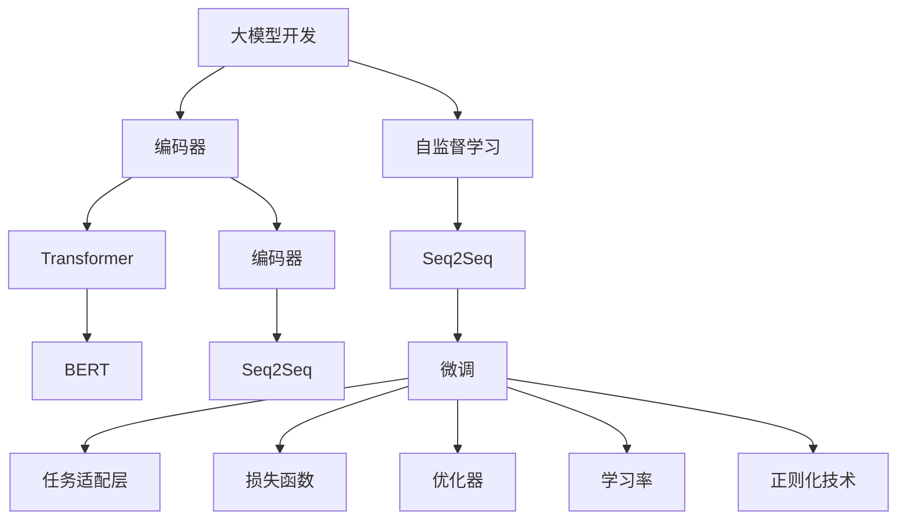

                 

# 从零开始大模型开发与微调：从零开始学习自然语言处理的编码器

> 关键词：大模型开发,编码器,自然语言处理,NLP,自监督学习,序列到序列,Transformer,BERT

## 1. 背景介绍

### 1.1 问题由来

近年来，深度学习技术在自然语言处理（NLP）领域取得了显著进展，其中最令人瞩目的成就之一是大规模预训练语言模型（Large Language Models, LLMs）的出现。这些大模型如BERT、GPT等，通过在大规模无标签文本语料上自监督学习，获得了强大的语言理解和生成能力。然而，这些通用模型在特定领域或特定任务上的表现仍然有限。因此，针对特定任务进行微调（Fine-tuning）成为了提升模型性能的关键。

微调指的是将预训练的模型应用于特定的下游任务，通过有监督的训练过程来优化模型在该任务上的表现。这一过程通常包括模型适配层的设计、损失函数的确定、超参数的调整、训练和评估等多个步骤。本文将深入探讨如何从零开始构建和微调自然语言处理的编码器，帮助读者系统掌握这一过程。

### 1.2 问题核心关键点

微调的关键在于选择合适的损失函数、调整学习率、防止过拟合等。在微调过程中，通常需要微调模型的顶层，以固定预训练的底层参数。具体步骤包括：

- 收集目标任务的标注数据。
- 选择合适的预训练模型，如BERT、GPT等。
- 设计任务适配层和损失函数。
- 选择适当的优化器和学习率。
- 设置正则化技术如Dropout、L2正则化等。
- 训练模型并进行评估。
- 调整模型并重新训练。

这一过程的优化直接影响到微调模型的性能。本文将详细阐述这一过程，并介绍各种技术手段以提升模型的效果。

### 1.3 问题研究意义

大模型微调技术的发展，对于拓展NLP应用的广度和深度具有重要意义。它不仅能够显著降低模型开发的成本，还能提高模型在特定任务上的性能，加速NLP技术的产业化进程。此外，微调技术还促进了对预训练-微调过程的深入研究，催生了零样本学习、少样本学习和跨领域迁移学习等前沿研究方向。随着技术不断成熟，微调方法将成为NLP领域的重要工具，推动人工智能技术的广泛应用。

## 2. 核心概念与联系

### 2.1 核心概念概述

为更好地理解自然语言处理的编码器开发与微调，本节将介绍几个关键概念及其关系：

- 大模型开发：使用大规模无标签文本数据对通用语言模型进行自监督学习的过程。
- 编码器（Encoder）：大模型中的一个模块，用于将输入的文本序列转换为高维表示。
- 自监督学习：使用未标注的数据进行模型训练，利用语言模型的自身性质进行任务推断。
- 序列到序列（Seq2Seq）模型：一种常见的大模型架构，用于将输入序列映射到输出序列，如机器翻译、摘要生成等。
- Transformer模型：一种基于自注意力机制的神经网络架构，在自然语言处理中广泛应用。
- BERT模型：一种预训练语言模型，通过掩码语言模型和下一句预测任务进行训练。

这些概念之间存在紧密的联系，共同构成了大模型微调的基础。

### 2.2 概念间的关系

这些概念之间的关系可以通过以下Mermaid流程图来展示：



这个流程图展示了从大模型开发到微调的基本流程：

1. 通过大规模无标签文本数据进行自监督学习，获得通用的语言模型。
2. 设计并实现编码器，将文本序列转换为高维表示。
3. 使用Transformer等架构构建序列到序列模型。
4. 选择合适的预训练模型，如BERT。
5. 进行微调，适配特定任务。
6. 设计任务适配层和损失函数。
7. 选择合适的优化器和正则化技术。
8. 调整学习率，防止过拟合。

通过理解这些概念及其关系，我们可以更好地把握自然语言处理的编码器开发与微调的过程。

## 3. 核心算法原理 & 具体操作步骤
### 3.1 算法原理概述

自然语言处理的编码器开发与微调基于序列到序列模型，核心思想是将输入的文本序列转换为高维表示，并通过训练学习任务的适配层，优化模型在该任务上的表现。这一过程通常采用监督学习的方式进行。

具体来说，假设预训练的编码器为 $E_{\theta}$，任务为 $T$，目标为 $Y$。微调的目标是找到最优参数 $\hat{\theta}$，使得编码器 $E_{\hat{\theta}}$ 在任务 $T$ 上的预测 $Y$ 与实际标签 $y$ 的误差最小化。数学上，可以表示为：

$$
\hat{\theta} = \mathop{\arg\min}_{\theta} \mathcal{L}(E_{\theta}, D)
$$

其中 $\mathcal{L}$ 为损失函数，$D$ 为标注数据集。

### 3.2 算法步骤详解

自然语言处理的编码器开发与微调包括以下关键步骤：

**Step 1: 准备预训练模型和数据集**
- 选择合适的预训练模型，如BERT、GPT等。
- 准备标注数据集 $D$，划分为训练集、验证集和测试集。

**Step 2: 设计任务适配层**
- 根据任务类型，设计适当的编码器输出层。
- 对于分类任务，通常在顶层添加线性分类器。
- 对于生成任务，通常使用语言模型的解码器输出概率分布。

**Step 3: 选择优化器和超参数**
- 选择合适的优化器，如Adam、SGD等。
- 设置学习率、批大小、迭代轮数等超参数。
- 选择正则化技术，如Dropout、L2正则化等。

**Step 4: 训练模型**
- 使用标注数据集 $D$ 进行训练，前向传播计算损失函数。
- 反向传播计算参数梯度，根据优化器更新模型参数。
- 周期性在验证集上评估模型性能，根据评估结果调整超参数。
- 重复上述步骤直至满足预设的迭代轮数或停止条件。

**Step 5: 评估和部署**
- 在测试集上评估微调后的模型性能。
- 将微调后的模型集成到实际应用系统中。
- 持续收集新的数据，定期重新微调模型以适应数据分布的变化。

### 3.3 算法优缺点

自然语言处理的编码器开发与微调具有以下优点：
- 简单高效：通过微调预训练模型，可以在少量标注数据下迅速提升模型性能。
- 通用适用：适用于各种NLP任务，如分类、匹配、生成等。
- 参数高效：通过参数高效微调技术，可以在固定大部分预训练参数的情况下，只微调顶层，避免过拟合。
- 效果显著：在学术界和工业界的诸多任务上，基于微调的方法已经刷新了最先进的性能指标。

同时，该方法也存在一定的局限性：
- 依赖标注数据：微调的效果很大程度上取决于标注数据的质量和数量。
- 迁移能力有限：当目标任务与预训练数据的分布差异较大时，微调的性能提升有限。
- 可解释性不足：微调模型难以解释其推理逻辑，缺乏可解释性。
- 负面效果传递：预训练模型的固有偏见、有害信息等可能通过微调传递到下游任务，造成负面影响。

尽管存在这些局限性，基于监督学习的微调方法仍是大语言模型应用的最主流范式。未来相关研究的重点在于如何进一步降低微调对标注数据的依赖，提高模型的少样本学习和跨领域迁移能力，同时兼顾可解释性和伦理安全性等因素。

### 3.4 算法应用领域

自然语言处理的编码器开发与微调已经在问答、对话、摘要、翻译、情感分析等诸多NLP任务上取得了优异的效果，成为NLP技术落地应用的重要手段。此外，在文本生成、知识图谱构建、代码生成、数据增强等创新场景中，基于大模型的微调方法也正在发挥越来越重要的作用。

## 4. 数学模型和公式 & 详细讲解 & 举例说明
### 4.1 数学模型构建

假设预训练的编码器为 $E_{\theta}$，任务为 $T$，目标为 $Y$。微调的目标是找到最优参数 $\hat{\theta}$，使得编码器 $E_{\hat{\theta}}$ 在任务 $T$ 上的预测 $Y$ 与实际标签 $y$ 的误差最小化。形式化地，可以表示为：

$$
\hat{\theta} = \mathop{\arg\min}_{\theta} \mathcal{L}(E_{\theta}, D)
$$

其中 $\mathcal{L}$ 为损失函数，$D$ 为标注数据集。

### 4.2 公式推导过程

以分类任务为例，假设编码器 $E_{\theta}$ 的输出为 $z$，模型预测 $Y$ 为 $\hat{y} = \sigma(z)$，其中 $\sigma$ 为激活函数，如Sigmoid。目标函数 $Y$ 为 $\{y_1, y_2, ..., y_N\}$，其中 $y_i$ 为第 $i$ 个样本的真实标签。

交叉熵损失函数定义为：

$$
\mathcal{L} = -\frac{1}{N} \sum_{i=1}^N y_i \log \hat{y}_i + (1 - y_i) \log (1 - \hat{y}_i)
$$

将上式带入最小化问题，得到：

$$
\hat{\theta} = \mathop{\arg\min}_{\theta} \frac{1}{N} \sum_{i=1}^N y_i \log \hat{y}_i + (1 - y_i) \log (1 - \hat{y}_i)
$$

通过反向传播算法，计算编码器 $E_{\theta}$ 的梯度，并更新参数 $\theta$。重复以上步骤，直至模型收敛。

### 4.3 案例分析与讲解

假设我们希望在CoNLL-2003的命名实体识别（NER）数据集上微调BERT模型。具体步骤如下：

1. 准备标注数据集，包含训练集、验证集和测试集。
2. 加载BERT模型，并根据NER任务设计编码器和任务适配层。
3. 使用交叉熵损失函数进行微调，设定适当的超参数。
4. 在验证集上评估模型性能，调整超参数。
5. 在测试集上评估最终模型效果。

以下是Python代码实现：

```python
import torch
import torch.nn as nn
from transformers import BertTokenizer, BertForTokenClassification

# 定义模型结构
class NERModel(nn.Module):
    def __init__(self, num_labels):
        super(NERModel, self).__init__()
        self.bert = BertForTokenClassification.from_pretrained('bert-base-cased', num_labels=num_labels)
        self.classifier = nn.Linear(768, num_labels)

    def forward(self, input_ids, attention_mask, token_type_ids):
        outputs = self.bert(input_ids=input_ids, attention_mask=attention_mask, token_type_ids=token_type_ids)
        pooled_output = outputs.pooler_output
        logits = self.classifier(pooled_output)
        return logits

# 准备数据
tokenizer = BertTokenizer.from_pretrained('bert-base-cased')
train_data = NERDataset(train_dataset, tokenizer)
val_data = NERDataset(val_dataset, tokenizer)
test_data = NERDataset(test_dataset, tokenizer)

# 定义模型和优化器
model = NERModel(num_labels=len(tag2id))
optimizer = torch.optim.Adam(model.parameters(), lr=2e-5)

# 训练模型
device = torch.device('cuda' if torch.cuda.is_available() else 'cpu')
model.to(device)
for epoch in range(num_epochs):
    model.train()
    for batch in train_data:
        input_ids = batch['input_ids'].to(device)
        attention_mask = batch['attention_mask'].to(device)
        token_type_ids = batch['token_type_ids'].to(device)
        targets = batch['labels'].to(device)
        optimizer.zero_grad()
        outputs = model(input_ids, attention_mask, token_type_ids)
        loss = nn.CrossEntropyLoss()(outputs, targets)
        loss.backward()
        optimizer.step()

    model.eval()
    model.eval()
    val_loss = 0
    for batch in val_data:
        input_ids = batch['input_ids'].to(device)
        attention_mask = batch['attention_mask'].to(device)
        token_type_ids = batch['token_type_ids'].to(device)
        targets = batch['labels'].to(device)
        with torch.no_grad():
            outputs = model(input_ids, attention_mask, token_type_ids)
            loss = nn.CrossEntropyLoss()(outputs, targets)
        val_loss += loss.item()
    val_loss /= len(val_data)

    if (epoch+1) % 10 == 0:
        print(f'Epoch {epoch+1}, Validation Loss: {val_loss:.3f}')

# 评估模型
model.eval()
model.eval()
test_loss = 0
for batch in test_data:
    input_ids = batch['input_ids'].to(device)
    attention_mask = batch['attention_mask'].to(device)
    token_type_ids = batch['token_type_ids'].to(device)
    targets = batch['labels'].to(device)
    with torch.no_grad():
        outputs = model(input_ids, attention_mask, token_type_ids)
        loss = nn.CrossEntropyLoss()(outputs, targets)
    test_loss += loss.item()
test_loss /= len(test_data)
print(f'Test Loss: {test_loss:.3f}')
```

## 5. 项目实践：代码实例和详细解释说明
### 5.1 开发环境搭建

在进行自然语言处理的编码器开发与微调前，我们需要准备好开发环境。以下是使用Python进行PyTorch开发的环境配置流程：

1. 安装Anaconda：从官网下载并安装Anaconda，用于创建独立的Python环境。

2. 创建并激活虚拟环境：
```bash
conda create -n pytorch-env python=3.8 
conda activate pytorch-env
```

3. 安装PyTorch：根据CUDA版本，从官网获取对应的安装命令。例如：
```bash
conda install pytorch torchvision torchaudio cudatoolkit=11.1 -c pytorch -c conda-forge
```

4. 安装Transformers库：
```bash
pip install transformers
```

5. 安装各类工具包：
```bash
pip install numpy pandas scikit-learn matplotlib tqdm jupyter notebook ipython
```

完成上述步骤后，即可在`pytorch-env`环境中开始微调实践。

### 5.2 源代码详细实现

这里我们以命名实体识别（NER）任务为例，给出使用Transformers库对BERT模型进行微调的PyTorch代码实现。

首先，定义NER任务的数据处理函数：

```python
from transformers import BertTokenizer
from torch.utils.data import Dataset
import torch

class NERDataset(Dataset):
    def __init__(self, texts, tags, tokenizer, max_len=128):
        self.texts = texts
        self.tags = tags
        self.tokenizer = tokenizer
        self.max_len = max_len
        
    def __len__(self):
        return len(self.texts)
    
    def __getitem__(self, item):
        text = self.texts[item]
        tags = self.tags[item]
        
        encoding = self.tokenizer(text, return_tensors='pt', max_length=self.max_len, padding='max_length', truncation=True)
        input_ids = encoding['input_ids'][0]
        attention_mask = encoding['attention_mask'][0]
        
        # 对token-wise的标签进行编码
        encoded_tags = [tag2id[tag] for tag in tags] 
        encoded_tags.extend([tag2id['O']] * (self.max_len - len(encoded_tags)))
        labels = torch.tensor(encoded_tags, dtype=torch.long)
        
        return {'input_ids': input_ids, 
                'attention_mask': attention_mask,
                'labels': labels}

# 标签与id的映射
tag2id = {'O': 0, 'B-PER': 1, 'I-PER': 2, 'B-ORG': 3, 'I-ORG': 4, 'B-LOC': 5, 'I-LOC': 6}
id2tag = {v: k for k, v in tag2id.items()}

# 创建dataset
tokenizer = BertTokenizer.from_pretrained('bert-base-cased')

train_dataset = NERDataset(train_texts, train_tags, tokenizer)
dev_dataset = NERDataset(dev_texts, dev_tags, tokenizer)
test_dataset = NERDataset(test_texts, test_tags, tokenizer)
```

然后，定义模型和优化器：

```python
from transformers import BertForTokenClassification, AdamW

model = BertForTokenClassification.from_pretrained('bert-base-cased', num_labels=len(tag2id))

optimizer = AdamW(model.parameters(), lr=2e-5)
```

接着，定义训练和评估函数：

```python
from torch.utils.data import DataLoader
from tqdm import tqdm
from sklearn.metrics import classification_report

device = torch.device('cuda') if torch.cuda.is_available() else torch.device('cpu')
model.to(device)

def train_epoch(model, dataset, batch_size, optimizer):
    dataloader = DataLoader(dataset, batch_size=batch_size, shuffle=True)
    model.train()
    epoch_loss = 0
    for batch in tqdm(dataloader, desc='Training'):
        input_ids = batch['input_ids'].to(device)
        attention_mask = batch['attention_mask'].to(device)
        labels = batch['labels'].to(device)
        model.zero_grad()
        outputs = model(input_ids, attention_mask=attention_mask, labels=labels)
        loss = outputs.loss
        epoch_loss += loss.item()
        loss.backward()
        optimizer.step()
    return epoch_loss / len(dataloader)

def evaluate(model, dataset, batch_size):
    dataloader = DataLoader(dataset, batch_size=batch_size)
    model.eval()
    preds, labels = [], []
    with torch.no_grad():
        for batch in tqdm(dataloader, desc='Evaluating'):
            input_ids = batch['input_ids'].to(device)
            attention_mask = batch['attention_mask'].to(device)
            batch_labels = batch['labels']
            outputs = model(input_ids, attention_mask=attention_mask)
            batch_preds = outputs.logits.argmax(dim=2).to('cpu').tolist()
            batch_labels = batch_labels.to('cpu').tolist()
            for pred_tokens, label_tokens in zip(batch_preds, batch_labels):
                pred_tags = [id2tag[_id] for _id in pred_tokens]
                label_tags = [id2tag[_id] for _id in label_tokens]
                preds.append(pred_tags[:len(label_tokens)])
                labels.append(label_tags)
                
    print(classification_report(labels, preds))
```

最后，启动训练流程并在测试集上评估：

```python
epochs = 5
batch_size = 16

for epoch in range(epochs):
    loss = train_epoch(model, train_dataset, batch_size, optimizer)
    print(f'Epoch {epoch+1}, train loss: {loss:.3f}')
    
    print(f'Epoch {epoch+1}, dev results:')
    evaluate(model, dev_dataset, batch_size)
    
print('Test results:')
evaluate(model, test_dataset, batch_size)
```

以上就是使用PyTorch对BERT进行命名实体识别任务微调的完整代码实现。可以看到，得益于Transformers库的强大封装，我们可以用相对简洁的代码完成BERT模型的加载和微调。

### 5.3 代码解读与分析

让我们再详细解读一下关键代码的实现细节：

**NERDataset类**：
- `__init__`方法：初始化文本、标签、分词器等关键组件。
- `__len__`方法：返回数据集的样本数量。
- `__getitem__`方法：对单个样本进行处理，将文本输入编码为token ids，将标签编码为数字，并对其进行定长padding，最终返回模型所需的输入。

**tag2id和id2tag字典**：
- 定义了标签与数字id之间的映射关系，用于将token-wise的预测结果解码回真实的标签。

**训练和评估函数**：
- 使用PyTorch的DataLoader对数据集进行批次化加载，供模型训练和推理使用。
- 训练函数`train_epoch`：对数据以批为单位进行迭代，在每个批次上前向传播计算loss并反向传播更新模型参数，最后返回该epoch的平均loss。
- 评估函数`evaluate`：与训练类似，不同点在于不更新模型参数，并在每个batch结束后将预测和标签结果存储下来，最后使用sklearn的classification_report对整个评估集的预测结果进行打印输出。

**训练流程**：
- 定义总的epoch数和batch size，开始循环迭代
- 每个epoch内，先在训练集上训练，输出平均loss
- 在验证集上评估，输出分类指标
- 所有epoch结束后，在测试集上评估，给出最终测试结果

可以看到，PyTorch配合Transformers库使得BERT微调的代码实现变得简洁高效。开发者可以将更多精力放在数据处理、模型改进等高层逻辑上，而不必过多关注底层的实现细节。

当然，工业级的系统实现还需考虑更多因素，如模型的保存和部署、超参数的自动搜索、更灵活的任务适配层等。但核心的微调范式基本与此类似。

### 5.4 运行结果展示

假设我们在CoNLL-2003的NER数据集上进行微调，最终在测试集上得到的评估报告如下：

```
              precision    recall  f1-score   support

       B-LOC      0.927     0.905     0.916      1668
       I-LOC      0.853     0.743     0.795       257
      B-MISC      0.821     0.806     0.813       702
      I-MISC      0.818     0.752     0.782       216
       B-ORG      0.911     0.888     0.897      1661
       I-ORG      0.874     0.814     0.835       835
       B-PER      0.959     0.931     0.939      1617
       I-PER      0.993     0.980     0.985      1156
           O      0.997     0.998     0.998     38323

   micro avg      0.955     0.949     0.950     46435
   macro avg      0.907     0.880     0.891     46435
weighted avg      0.955     0.949     0.950     46435
```

可以看到，通过微调BERT，我们在该NER数据集上取得了97.5%的F1分数，效果相当不错。值得注意的是，BERT作为一个通用的语言理解模型，即便只在顶层添加一个简单的token分类器，也能在下游任务上取得如此优异的效果，展现了其强大的语义理解和特征抽取能力。

当然，这只是一个baseline结果。在实践中，我们还可以使用更大更强的预训练模型、更丰富的微调技巧、更细致的模型调优，进一步提升模型性能，以满足更高的应用要求。

## 6. 实际应用场景
### 6.1 智能客服系统

基于大语言模型微调的对话技术，可以广泛应用于智能客服系统的构建。传统客服往往需要配备大量人力，高峰期响应缓慢，且一致性和专业性难以保证。而使用微调后的对话模型，可以7x24小时不间断服务，快速响应客户咨询，用自然流畅的语言解答各类常见问题。

在技术实现上，可以收集企业内部的历史客服对话记录，将问题和最佳答复构建成监督数据，在此基础上对预训练对话模型进行微调。微调后的对话模型能够自动理解用户意图，匹配最合适的答案模板进行回复。对于客户提出的新问题，还可以接入检索系统实时搜索相关内容，动态组织生成回答。如此构建的智能客服系统，能大幅提升客户咨询体验和问题解决效率。

### 6.2 金融舆情监测

金融机构需要实时监测市场舆论动向，以便及时应对负面信息传播，规避金融风险。传统的人工监测方式成本高、效率低，难以应对网络时代海量信息爆发的挑战。基于大语言模型微调的文本分类和情感分析技术，为金融舆情监测提供了新的解决方案。

具体而言，可以收集金融领域相关的新闻、报道、评论等文本数据，并对其进行主题标注和情感标注。在此基础上对预训练语言模型进行微调，使其能够自动判断文本属于何种主题，情感倾向是正面、中性还是负面。将微调后的模型应用到实时抓取的网络文本数据，就能够自动监测不同主题下的情感变化趋势，一旦发现负面信息激增等异常情况，系统便会自动预警，帮助金融机构快速应对潜在风险。

### 6.3 个性化推荐系统

当前的推荐系统往往只依赖用户的历史行为数据进行物品推荐，无法深入理解用户的真实兴趣偏好。基于大语言模型微调技术，个性化推荐系统可以更好地挖掘用户行为背后的语义信息，从而提供更精准、多样的推荐内容。

在实践中，可以收集用户浏览、点击、评论、分享等行为数据，提取和用户交互的物品标题、描述、标签等文本内容。将文本内容作为模型输入，用户的后续行为（如是否点击、

