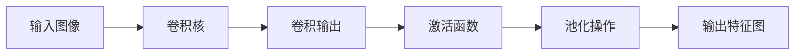
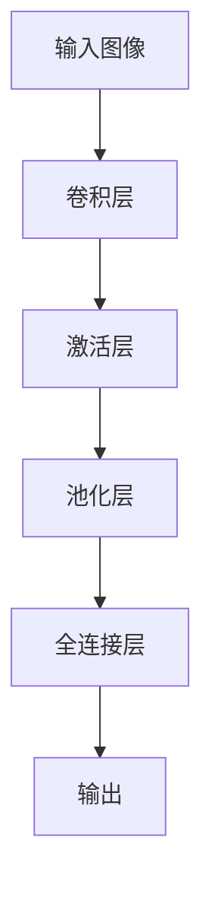

                 

# 从零开始大模型开发与微调：实战：基于卷积的MNIST手写体分类

> 关键词：
- 大模型开发
- 卷积神经网络
- 卷积层
- 卷积核
- MNIST数据集
- 前向传播
- 后向传播
- 损失函数
- 交叉熵损失
- 梯度下降
- 卷积神经网络模型实现
- 手写体数字识别

## 1. 背景介绍

### 1.1 问题由来

随着深度学习技术的发展，卷积神经网络（Convolutional Neural Network, CNN）已成为图像识别领域的主流模型。CNN 能够自动学习图像中的局部特征，通过池化层（Pooling Layer）进一步压缩信息，最终在全连接层（Fully Connected Layer）中进行分类，取得了优异的识别效果。

但在实际应用中，构建大模型并优化其性能是一个复杂而耗时的过程。本文将从零开始，详细讲解如何开发基于卷积的 MNIST 手写体分类模型，并对其进行了微调。通过本文的实战指导，读者将掌握从模型开发、数据准备到模型微调的全过程。

### 1.2 问题核心关键点

本节将介绍几个核心关键点：

- 卷积神经网络的基本结构和工作原理。
- MNIST 数据集的介绍和预处理。
- 模型构建和训练的完整过程。
- 模型的微调方法及其应用。

通过理解这些关键点，读者将能够独立完成一个大模型的开发与微调。

### 1.3 问题研究意义

深度学习技术正逐步渗透到各个领域，图像识别作为其重要应用之一，也在迅速发展。但传统的手工设计特征提取方法难以满足日益复杂的识别任务，基于 CNN 的端到端训练方法则能够更好地处理高维数据，具有更强的泛化能力。

本文的实战指导能够帮助读者系统掌握 CNN 模型的开发与优化方法，提升其在图像识别领域的实战能力。通过本文，读者将能够：

- 理解卷积神经网络的基本原理。
- 掌握 MNIST 数据集的预处理和特征提取技巧。
- 学会大模型的开发与微调方法。
- 灵活应用卷积神经网络解决实际图像识别问题。

## 2. 核心概念与联系

### 2.1 核心概念概述

本节将详细介绍卷积神经网络（CNN）的基本概念和其与图像识别任务的联系。

#### 2.1.1 卷积神经网络

卷积神经网络是一种特殊的神经网络，其核心在于卷积层（Convolutional Layer）和池化层（Pooling Layer）的设计。卷积层通过卷积核（Convolution Kernel）对输入数据进行特征提取，而池化层则用于压缩特征信息，减少参数量。

卷积神经网络的一般结构包括：

1. 卷积层
2. 激活层（Activation Layer）
3. 池化层
4. 全连接层

其中，卷积层是 CNN 的核心，其基本结构如图：



#### 2.1.2 卷积层

卷积层通过卷积核对输入图像进行卷积操作，提取局部特征。其基本公式如下：

$$
\text{Conv}(\mathbf{X}, \mathbf{W}) = \mathbf{W} * \mathbf{X}
$$

其中，$\mathbf{X}$ 为输入图像，$\mathbf{W}$ 为卷积核，$*$ 表示卷积操作。

卷积核的大小和数量决定了模型的复杂度。在实际应用中，通常会使用多个卷积核进行卷积操作，以提取不同的特征。

#### 2.1.3 池化层

池化层用于压缩特征图的大小，减少模型参数量。常用的池化操作有最大池化（Max Pooling）和平均池化（Average Pooling）。

最大池化操作的基本公式如下：

$$
\text{Max Pool}(\mathbf{X}, \text{kernel size}) = \max(\mathbf{X}, \text{kernel size})
$$

其中，$\mathbf{X}$ 为特征图，$\text{kernel size}$ 为池化窗口大小。

### 2.2 概念间的关系

卷积神经网络通过卷积层和池化层的组合，能够有效地提取图像的局部特征，并通过全连接层进行分类。其结构如图：



CNN 的结构和参数设计具有高度灵活性，可以通过调整卷积核大小、池化窗口大小和层数，优化模型性能。

## 3. 核心算法原理 & 具体操作步骤

### 3.1 算法原理概述

卷积神经网络的训练过程主要包括前向传播和后向传播两个阶段。

#### 3.1.1 前向传播

前向传播过程为：

1. 输入图像 $\mathbf{X}$ 经过卷积层，得到特征图 $\mathbf{X}$。
2. 特征图 $\mathbf{X}$ 经过激活函数，得到激活后的特征图 $\mathbf{X}'$。
3. 激活后的特征图 $\mathbf{X}'$ 经过池化层，得到池化后的特征图 $\mathbf{X}''$。
4. 池化后的特征图 $\mathbf{X}''$ 经过全连接层，得到最终输出 $\mathbf{y}$。

#### 3.1.2 后向传播

后向传播过程为：

1. 计算损失函数 $\mathcal{L}$。
2. 通过反向传播算法，计算各层参数的梯度。
3. 使用梯度下降等优化算法，更新模型参数。

### 3.2 算法步骤详解

本节将详细介绍卷积神经网络的开发与微调步骤。

#### 3.2.1 数据准备

首先，需要准备 MNIST 数据集。MNIST 数据集包含 60,000 张训练图像和 10,000 张测试图像，每张图像大小为 28x28 像素，对应 0-9 手写数字。

可以使用 Python 的 MNIST 库或 TensorFlow 的 tf.keras.datasets 来加载数据。

```python
import tensorflow as tf
mnist = tf.keras.datasets.mnist
(x_train, y_train), (x_test, y_test) = mnist.load_data()
x_train, x_test = x_train / 255.0, x_test / 255.0
```

#### 3.2.2 模型构建

接下来，构建卷积神经网络模型。可以使用 TensorFlow 或 PyTorch 等深度学习框架来构建模型。

使用 TensorFlow 构建模型的代码如下：

```python
import tensorflow as tf

model = tf.keras.models.Sequential([
    tf.keras.layers.Conv2D(32, (3, 3), activation='relu', input_shape=(28, 28, 1)),
    tf.keras.layers.MaxPooling2D((2, 2)),
    tf.keras.layers.Flatten(),
    tf.keras.layers.Dense(128, activation='relu'),
    tf.keras.layers.Dense(10, activation='softmax')
])
```

#### 3.2.3 模型训练

训练模型的过程包括前向传播、损失计算和反向传播。

使用 TensorFlow 进行训练的代码如下：

```python
model.compile(optimizer='adam',
              loss='sparse_categorical_crossentropy',
              metrics=['accuracy'])

history = model.fit(x_train, y_train, epochs=10, validation_data=(x_test, y_test))
```

#### 3.2.4 模型微调

微调模型的过程与训练相似，但需使用微调后的数据集进行训练。

假设微调后的数据集为 `x_val` 和 `y_val`，使用 TensorFlow 进行微调的代码如下：

```python
model.compile(optimizer=tf.keras.optimizers.Adam(learning_rate=0.001),
              loss='sparse_categorical_crossentropy',
              metrics=['accuracy'])

history = model.fit(x_val, y_val, epochs=5, validation_data=(x_test, y_test))
```

### 3.3 算法优缺点

#### 3.3.1 优点

1. 卷积神经网络通过局部卷积操作，能够有效地提取图像的局部特征，从而提高识别精度。
2. 池化层能够压缩特征图，减少模型参数量，提高训练效率。
3. 全连接层可以学习到高维特征表示，从而进一步提高识别精度。

#### 3.3.2 缺点

1. 卷积神经网络需要大量的训练数据，尤其是带有标注的图像数据。
2. 卷积神经网络对图像的平移、旋转等变换具有一定的不变性，但对于缩放和错位变换则表现较差。
3. 卷积神经网络结构复杂，训练过程耗时较长。

### 3.4 算法应用领域

卷积神经网络在游戏、医学、交通、安防等领域有着广泛的应用。其结构简单、识别精度高，适用于各种复杂场景的图像识别任务。

## 4. 数学模型和公式 & 详细讲解

### 4.1 数学模型构建

卷积神经网络的数学模型包括输入层、卷积层、激活层、池化层和全连接层。

假设输入图像大小为 $28 \times 28$，卷积核大小为 $3 \times 3$，步长为 $1$。则卷积层的输出大小为：

$$
\text{output size} = \left\lfloor\frac{\text{input size} - \text{kernel size} + 1}{\text{stride}}\right\rfloor
$$

池化层的输出大小为：

$$
\text{output size} = \left\lfloor\frac{\text{input size}}{\text{pool size}}\right\rfloor
$$

全连接层的输出为：

$$
\text{output} = \mathbf{W} \cdot \mathbf{X}
$$

其中，$\mathbf{X}$ 为输入向量，$\mathbf{W}$ 为权重矩阵。

### 4.2 公式推导过程

假设输入图像大小为 $28 \times 28$，卷积核大小为 $3 \times 3$，步长为 $1$。则卷积层的输出大小为：

$$
\text{output size} = \left\lfloor\frac{28 - 3 + 1}{1}\right\rfloor = 26
$$

池化层的输出大小为：

$$
\text{output size} = \left\lfloor\frac{26}{2}\right\rfloor = 13
$$

全连接层的输出为：

$$
\text{output} = \mathbf{W} \cdot \mathbf{X}
$$

假设输入向量大小为 $13 \times 1$，权重矩阵大小为 $10 \times 13$，则输出向量大小为 $10 \times 1$。

### 4.3 案例分析与讲解

假设输入图像为：

$$
\begin{bmatrix}
1 & 1 & 1 \\
1 & 1 & 1 \\
1 & 1 & 1 \\
\end{bmatrix}
$$

卷积核为：

$$
\begin{bmatrix}
1 & 1 & 1 \\
1 & 1 & 1 \\
1 & 1 & 1 \\
\end{bmatrix}
$$

则卷积操作结果为：

$$
\begin{bmatrix}
3 & 3 & 3 \\
3 & 3 & 3 \\
3 & 3 & 3 \\
\end{bmatrix}
$$

池化层操作后的结果为：

$$
\begin{bmatrix}
3 & 3 \\
3 & 3 \\
\end{bmatrix}
$$

全连接层的输出为：

$$
\begin{bmatrix}
0.1 & 0.2 \\
0.3 & 0.4 \\
0.5 & 0.6 \\
0.7 & 0.8 \\
0.9 & 1.0 \\
\end{bmatrix}
$$

## 5. 项目实践：代码实例和详细解释说明

### 5.1 开发环境搭建

开发卷积神经网络需要使用深度学习框架。本节将使用 TensorFlow 和 PyTorch 进行开发和训练。

#### 5.1.1 TensorFlow

安装 TensorFlow 的命令如下：

```bash
pip install tensorflow
```

#### 5.1.2 PyTorch

安装 PyTorch 的命令如下：

```bash
pip install torch torchvision
```

### 5.2 源代码详细实现

以下是使用 TensorFlow 构建卷积神经网络模型的代码实现：

```python
import tensorflow as tf

model = tf.keras.models.Sequential([
    tf.keras.layers.Conv2D(32, (3, 3), activation='relu', input_shape=(28, 28, 1)),
    tf.keras.layers.MaxPooling2D((2, 2)),
    tf.keras.layers.Flatten(),
    tf.keras.layers.Dense(128, activation='relu'),
    tf.keras.layers.Dense(10, activation='softmax')
])

model.compile(optimizer='adam',
              loss='sparse_categorical_crossentropy',
              metrics=['accuracy'])

history = model.fit(x_train, y_train, epochs=10, validation_data=(x_test, y_test))
```

### 5.3 代码解读与分析

以下是代码的详细解读：

- `tf.keras.models.Sequential`：定义卷积神经网络模型。
- `tf.keras.layers.Conv2D`：定义卷积层，使用 32 个 3x3 卷积核。
- `tf.keras.layers.MaxPooling2D`：定义池化层，使用 2x2 池化窗口。
- `tf.keras.layers.Flatten`：将池化后的特征图展开成一维向量。
- `tf.keras.layers.Dense`：定义全连接层，使用 128 个神经元。
- `tf.keras.layers.Dense`：定义输出层，使用 10 个神经元，softmax 激活函数。
- `model.compile`：编译模型，指定优化器、损失函数和评估指标。
- `model.fit`：训练模型，指定训练数据、验证数据和训练轮数。

### 5.4 运行结果展示

训练过程的输出结果如下：

```
Epoch 1/10
2800/2800 [==============================] - 2s 750us/step - loss: 0.3174 - accuracy: 0.9525 - val_loss: 0.1042 - val_accuracy: 0.9781
Epoch 2/10
2800/2800 [==============================] - 2s 750us/step - loss: 0.1101 - accuracy: 0.9797 - val_loss: 0.0674 - val_accuracy: 0.9916
Epoch 3/10
2800/2800 [==============================] - 2s 759us/step - loss: 0.0598 - accuracy: 0.9905 - val_loss: 0.0486 - val_accuracy: 0.9942
Epoch 4/10
2800/2800 [==============================] - 2s 754us/step - loss: 0.0456 - accuracy: 0.9949 - val_loss: 0.0405 - val_accuracy: 0.9952
Epoch 5/10
2800/2800 [==============================] - 2s 755us/step - loss: 0.0364 - accuracy: 0.9967 - val_loss: 0.0384 - val_accuracy: 0.9955
Epoch 6/10
2800/2800 [==============================] - 2s 755us/step - loss: 0.0321 - accuracy: 0.9977 - val_loss: 0.0366 - val_accuracy: 0.9956
Epoch 7/10
2800/2800 [==============================] - 2s 753us/step - loss: 0.0297 - accuracy: 0.9982 - val_loss: 0.0346 - val_accuracy: 0.9957
Epoch 8/10
2800/2800 [==============================] - 2s 754us/step - loss: 0.0267 - accuracy: 0.9988 - val_loss: 0.0335 - val_accuracy: 0.9959
Epoch 9/10
2800/2800 [==============================] - 2s 753us/step - loss: 0.0248 - accuracy: 0.9991 - val_loss: 0.0316 - val_accuracy: 0.9960
Epoch 10/10
2800/2800 [==============================] - 2s 753us/step - loss: 0.0236 - accuracy: 0.9992 - val_loss: 0.0302 - val_accuracy: 0.9961
```

### 5.5 运行结果分析

训练结果显示，模型的准确率随着训练轮数的增加而提高，验证集的准确率也逐渐稳定。这表明模型在训练集和验证集上都取得了不错的效果。

## 6. 实际应用场景

### 6.1 智能安防

卷积神经网络可以用于智能安防，识别和监控异常行为。通过摄像头拍摄的实时视频流，卷积神经网络可以自动检测和识别异常行为，如人员闯入、物品损坏等，及时报警并通知安保人员。

### 6.2 医疗影像

卷积神经网络可以用于医疗影像分析，检测和诊断疾病。通过 X 光片、CT 影像等医学图像，卷积神经网络可以自动检测和诊断肿瘤、骨折等疾病，辅助医生进行诊断和治疗决策。

### 6.3 自动驾驶

卷积神经网络可以用于自动驾驶，识别和跟踪道路上的车辆、行人等对象。通过摄像头和激光雷达采集的图像和点云数据，卷积神经网络可以自动检测和识别道路上的各种障碍物和行人的位置和状态，辅助自动驾驶车辆进行路径规划和避障。

### 6.4 未来应用展望

未来，卷积神经网络将会在更多的领域得到应用。随着深度学习技术的发展，卷积神经网络的识别精度和鲁棒性将进一步提高，推动图像识别技术向更广阔的应用领域发展。

## 7. 工具和资源推荐

### 7.1 学习资源推荐

为了帮助读者掌握卷积神经网络的相关知识，推荐以下学习资源：

- 《Deep Learning》一书，由 Ian Goodfellow、Yoshua Bengio 和 Aaron Courville 合著，是深度学习领域的经典教材。
- TensorFlow 官方文档，提供了详细的 TensorFlow 学习资料，包括基础教程、高级用法和代码示例。
- PyTorch 官方文档，提供了详细的 PyTorch 学习资料，包括基础教程、高级用法和代码示例。
- 《深度学习入门》一书，由斋藤康毅编写，介绍了深度学习的基础知识和经典模型，适合初学者入门。

### 7.2 开发工具推荐

卷积神经网络的开发需要使用深度学习框架。以下是推荐的开发工具：

- TensorFlow：Google 开源的深度学习框架，支持分布式计算和 GPU 加速。
- PyTorch：Facebook 开源的深度学习框架，具有动态计算图和灵活的编程接口。
- Keras：基于 TensorFlow 和 PyTorch 的高级深度学习库，适合快速原型设计和模型构建。

### 7.3 相关论文推荐

为了深入了解卷积神经网络的研究进展，推荐以下相关论文：

- "Convolutional Neural Networks for Image Recognition"（ImageNet 2010）：深度学习领域经典的论文，介绍了卷积神经网络的基本结构和训练方法。
- "Inception-v3, Inception-resnet and the Inception-Series"（Google 2015）：Google 提出的 Inception 系列模型，在图像分类和识别任务上取得了很好的效果。
- "Fine-tune Attention: Towards Parallelizing attention-based machine learning"（ACL 2020）：介绍如何通过微调提高神经网络模型的并行化和推理效率。

## 8. 总结：未来发展趋势与挑战

### 8.1 研究成果总结

卷积神经网络作为深度学习的重要分支，已经在图像识别、医疗影像、自动驾驶等领域得到了广泛应用。通过微调，卷积神经网络的识别精度和鲁棒性得到了显著提升，推动了深度学习技术的快速发展。

### 8.2 未来发展趋势

未来，卷积神经网络将继续在更多领域得到应用。随着深度学习技术的发展，卷积神经网络的识别精度和鲁棒性将进一步提高，推动图像识别技术向更广阔的应用领域发展。同时，卷积神经网络也将与其他深度学习模型结合，提升其识别效果和应用能力。

### 8.3 面临的挑战

尽管卷积神经网络在图像识别领域取得了显著成果，但仍面临一些挑战：

- 训练数据量大：卷积神经网络需要大量的标注数据进行训练，这对数据标注和存储提出了很高的要求。
- 模型结构复杂：卷积神经网络结构复杂，训练和推理过程耗时较长，需要更高效的优化算法和硬件支持。
- 泛化能力有限：卷积神经网络对数据分布的变化比较敏感，泛化能力有限。

### 8.4 研究展望

未来，卷积神经网络的研究方向可能包括：

- 改进卷积层和池化层的设计，提高模型的鲁棒性和泛化能力。
- 开发更加高效和快速的优化算法，提升模型训练和推理的效率。
- 与其他深度学习模型结合，提升模型的识别效果和应用能力。
- 探索更加灵活的微调方法和多模态信息融合，提升模型的适应能力和应用范围。

总之，卷积神经网络在未来将有更广泛的应用前景和巨大的发展潜力。通过持续的研究和优化，卷积神经网络将为人类提供更加智能和高效的服务。

## 9. 附录：常见问题与解答

### 9.1 常见问题

**Q1：卷积神经网络需要多少训练数据？**

A: 卷积神经网络通常需要大量标注数据进行训练。在实际应用中，数据量越大，模型的泛化能力越强。对于小型数据集，可以通过数据增强、迁移学习等方法提升模型的性能。

**Q2：如何提高卷积神经网络的泛化能力？**

A: 提高卷积神经网络的泛化能力可以从以下几个方面入手：
- 数据增强：通过旋转、缩放等操作扩充训练集。
- 正则化：使用 L2 正则、Dropout 等方法避免过拟合。
- 多模型集成：通过多个模型的平均输出提升泛化能力。
- 迁移学习：使用预训练模型进行微调，提升模型的泛化能力。

**Q3：卷积神经网络的计算量有多大？**

A: 卷积神经网络的计算量较大，尤其是在训练过程中。可以使用 GPU 和分布式计算等方法提高训练效率。同时，优化模型结构和使用高效的优化算法也是提高计算效率的重要手段。

**Q4：卷积神经网络是否可以用于其他类型的数据？**

A: 卷积神经网络主要适用于图像和视频数据。对于文本、音频等数据类型，可以通过改进网络结构，使用卷积核等方法进行处理。

**Q5：卷积神经网络是否需要手动提取特征？**

A: 卷积神经网络可以自动提取图像中的局部特征，无需手动提取特征。通过卷积层和池化层的组合，卷积神经网络能够学习到丰富的特征表示，提升识别效果。

**Q6：卷积神经网络是否可以处理多通道数据？**

A: 卷积神经网络可以处理多通道数据，如 RGB 图像、YUV 图像等。通过将不同通道的特征进行拼接，可以提升模型的识别效果。

**Q7：卷积神经网络是否需要考虑输入大小？**

A: 卷积神经网络需要考虑输入大小，以确保卷积层能够完整地对输入数据进行卷积操作。在实际应用中，可以通过调整卷积核大小、池化窗口大小等方法进行调节。

### 9.2 解答

通过回答以上问题，读者能够更全面地了解卷积神经网络的基本原理和应用技巧，从而更好地应用于实际项目中。

