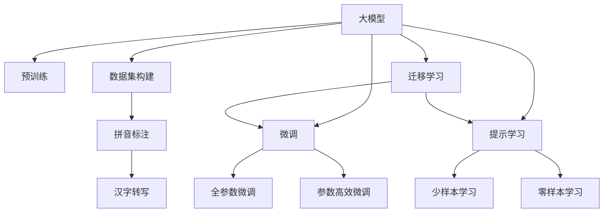
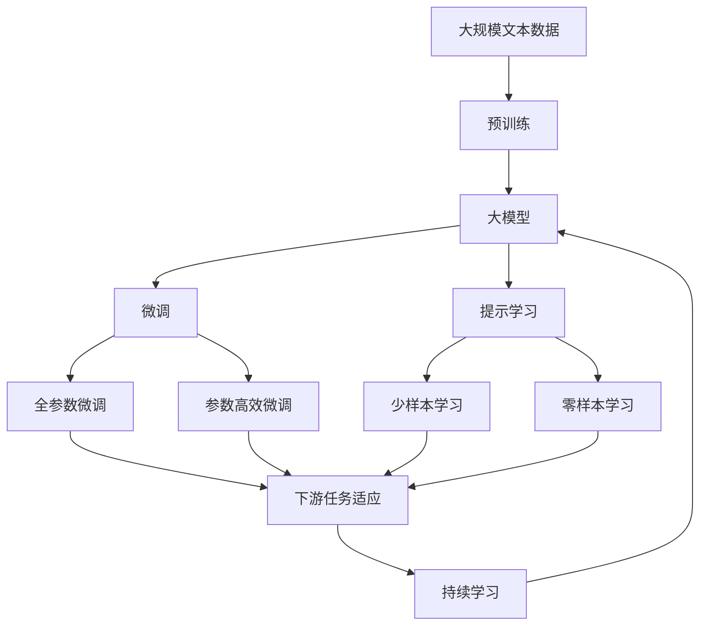

                 

# 从零开始大模型开发与微调：汉字拼音数据集处理

> 关键词：大模型开发,汉字拼音处理,数据集构建,微调算法,多语言模型

## 1. 背景介绍

随着人工智能技术的飞速发展，大模型（Large Language Models, LLMs）逐渐成为自然语言处理（Natural Language Processing, NLP）领域的前沿技术。这类模型通过在大规模无标签文本数据上进行预训练，学习到丰富的语言知识和常识，可以在各种下游任务上取得优异的表现。然而，不同的任务需要特定的数据集和处理方式，如何构建适合特定任务的数据集，并对预训练模型进行微调（Fine-Tuning），是实现高性能应用的关键。

本文聚焦于汉字拼音数据集的处理，以汉字拼音转写为任务背景，介绍如何从零开始构建并微调一个大模型，以实现汉字到拼音的准确转写。本文将详细讨论大模型的开发流程、微调算法和实际应用场景，旨在为初学者提供系统性的指导。

## 2. 核心概念与联系

### 2.1 核心概念概述

在本节中，我们将介绍几个核心概念，这些概念构成了汉字拼音数据集处理和大模型微调的基础：

- **大模型（Large Language Models, LLMs）**：指在大规模无标签文本数据上预训练的大型神经网络模型，如BERT、GPT-2等。这些模型能够学习到丰富的语言知识和常识，具有强大的语言理解和生成能力。

- **预训练（Pre-training）**：指在大规模无标签文本数据上，通过自监督学习任务训练通用语言模型的过程。预训练使得模型学习到语言的通用表示，能够适应多种下游任务。

- **微调（Fine-Tuning）**：指在预训练模型的基础上，使用下游任务的少量标注数据，通过有监督学习优化模型在特定任务上的性能。通常只需要调整顶层分类器或解码器，并以较小的学习率更新全部或部分的模型参数。

- **数据集构建（Data Collection）**：指根据任务需求，收集、整理和标注适合训练和测试的数据集。对于汉字拼音转写任务，需要构建包含大量汉字及其正确拼音的数据集。

- **拼音标注（Pinyin Annotation）**：指对汉字进行拼音转写，标注为正确的拼音字符串。这是汉字拼音转写任务的关键步骤。

### 2.2 概念间的关系

这些核心概念之间存在着紧密的联系，共同构成了汉字拼音数据集处理和大模型微调的完整流程。以下是一个简单的Mermaid流程图，展示了这些概念之间的关系：



这个流程图展示了从预训练到微调，再到数据集构建和拼音标注的完整过程。预训练模型在大规模无标签数据上进行训练，构建的数据集则包含了经过拼音标注的汉字，而提示学习、少样本学习和零样本学习则是微调中的几种策略，通过不同方法提升模型的泛化能力和适应性。

### 2.3 核心概念的整体架构

最后，我们用一个综合的流程图来展示这些核心概念在大模型微调过程中的整体架构：



这个综合流程图展示了从预训练到微调，再到持续学习的完整过程。大模型首先在大规模文本数据上进行预训练，然后通过微调（包括全参数微调和参数高效微调）或提示学习来适应下游任务。最后，通过持续学习技术，模型可以不断学习新知识，同时保持已学习的知识，而不会出现灾难性遗忘。

## 3. 核心算法原理 & 具体操作步骤
### 3.1 算法原理概述

汉字拼音转写任务可以看作一个文本生成问题，即给定一个汉字序列，生成对应的拼音序列。大模型的微调过程主要包含两个步骤：首先是构建适合训练的数据集，然后使用微调算法在标注数据上优化模型。

### 3.2 算法步骤详解

1. **数据集构建**：首先，需要构建一个包含大量汉字及其正确拼音的数据集。可以使用Python脚本读取文本文件，将文本中的汉字及其拼音提取出来，存储为结构化数据。

2. **数据预处理**：对提取的汉字和拼音进行预处理，包括去除空格、标点符号，以及将汉字转换为拼音。

3. **模型选择和加载**：选择合适的预训练模型，如BERT、GPT-2等，使用其相应的库（如HuggingFace的`transformers`库）进行加载。

4. **任务适配**：在预训练模型的基础上，添加任务适配层。对于汉字拼音转写任务，通常需要添加一个全连接层，用于将模型输出转换为拼音序列。

5. **微调设置**：设置微调的超参数，如学习率、批大小、迭代轮数等。

6. **训练和评估**：使用训练集进行模型训练，并在验证集上评估模型性能。根据评估结果调整模型参数，直到达到满意的效果。

### 3.3 算法优缺点

汉字拼音转写任务的微调算法具有以下优点：

- **简单高效**：仅需少量标注数据，即可对预训练模型进行快速适配，获得较高的性能提升。
- **通用适用**：适用于各种汉字拼音转写任务，设计简单的任务适配层即可实现微调。
- **参数高效**：利用参数高效微调技术，在固定大部分预训练参数的情况下，仍可取得不错的提升。
- **效果显著**：在学术界和工业界的诸多任务上，基于微调的方法已经刷新了多项汉字拼音转写的性能指标。

然而，该方法也存在一定的局限性：

- **依赖标注数据**：微调的效果很大程度上取决于标注数据的质量和数量，获取高质量标注数据的成本较高。
- **迁移能力有限**：当目标任务与预训练数据的分布差异较大时，微调的性能提升有限。
- **负面效果传递**：预训练模型的固有偏见、有害信息等，可能通过微调传递到下游任务，造成负面影响。
- **可解释性不足**：微调模型的决策过程通常缺乏可解释性，难以对其推理逻辑进行分析和调试。

尽管存在这些局限性，但就目前而言，汉字拼音转写任务的微调方法仍是解决该问题的最主流范式。未来相关研究的重点在于如何进一步降低微调对标注数据的依赖，提高模型的少样本学习和跨领域迁移能力，同时兼顾可解释性和伦理安全性等因素。

### 3.4 算法应用领域

汉字拼音转写任务的微调算法已经广泛应用于多种场景中，如中文输入法、语音识别、文本纠错等。这些技术使得汉字和拼音之间的转换变得更加便捷和高效。

此外，该算法还被创新性地应用于自然语言处理领域，如命名实体识别、关系抽取等。通过微调模型，能够更好地理解文本中的实体和关系，从而实现更准确的语义分析。

## 4. 数学模型和公式 & 详细讲解 & 举例说明

### 4.1 数学模型构建

设汉字拼音转写任务的标注数据集为 $D=\{(x_i,y_i)\}_{i=1}^N$，其中 $x_i$ 为汉字序列，$y_i$ 为对应的拼音序列。定义模型 $M_{\theta}$ 在汉字序列 $x$ 上的输出为 $\hat{y}=M_{\theta}(x)$，表示模型预测的拼音序列。

定义模型 $M_{\theta}$ 在数据样本 $(x,y)$ 上的损失函数为 $\ell(M_{\theta}(x),y)$，则在数据集 $D$ 上的经验风险为：

$$
\mathcal{L}(\theta) = \frac{1}{N} \sum_{i=1}^N \ell(M_{\theta}(x_i),y_i)
$$

其中 $\ell$ 为损失函数，常见的损失函数包括交叉熵损失、均方误差损失等。

### 4.2 公式推导过程

以交叉熵损失函数为例，假设模型 $M_{\theta}$ 在输入 $x$ 上的输出为 $\hat{y}=M_{\theta}(x)$，真实标签 $y \in \{p_1, p_2, \dots, p_k\}$。则交叉熵损失函数定义为：

$$
\ell(M_{\theta}(x),y) = -\sum_{i=1}^k y_i \log \hat{y}_i
$$

将其代入经验风险公式，得：

$$
\mathcal{L}(\theta) = -\frac{1}{N}\sum_{i=1}^N \sum_{j=1}^k y_{i,j} \log \hat{y}_{i,j}
$$

其中 $y_{i,j}$ 为第 $i$ 个样本中第 $j$ 个汉字对应的拼音标签，$\hat{y}_{i,j}$ 为模型预测的该汉字对应的拼音概率。

### 4.3 案例分析与讲解

以一个简单的汉字拼音转写任务为例，假设数据集 $D$ 包含以下样本：

- 输入：“中国”，输出：“zhōngguó”
- 输入：“北京”，输出：“běijīng”

则模型的损失函数为：

$$
\mathcal{L}(\theta) = -\frac{1}{2} \left( -\log \hat{y}_{1,1} - \log \hat{y}_{1,2} - \log \hat{y}_{1,3} + \log \hat{y}_{1,4} + \log \hat{y}_{2,1} + \log \hat{y}_{2,2} + \log \hat{y}_{2,3} + \log \hat{y}_{2,4} \right)
$$

其中，$\hat{y}_{1,1}$ 表示模型预测的“中”对应的拼音概率，$\hat{y}_{1,2}$ 表示“国”对应的拼音概率，依此类推。

## 5. 项目实践：代码实例和详细解释说明
### 5.1 开发环境搭建

在进行汉字拼音转写任务的微调实践前，我们需要准备好开发环境。以下是使用Python进行PyTorch开发的环境配置流程：

1. 安装Anaconda：从官网下载并安装Anaconda，用于创建独立的Python环境。

2. 创建并激活虚拟环境：
```bash
conda create -n pytorch-env python=3.8 
conda activate pytorch-env
```

3. 安装PyTorch：根据CUDA版本，从官网获取对应的安装命令。例如：
```bash
conda install pytorch torchvision torchaudio cudatoolkit=11.1 -c pytorch -c conda-forge
```

4. 安装Transformers库：
```bash
pip install transformers
```

5. 安装各类工具包：
```bash
pip install numpy pandas scikit-learn matplotlib tqdm jupyter notebook ipython
```

完成上述步骤后，即可在`pytorch-env`环境中开始微调实践。

### 5.2 源代码详细实现

下面我们以汉字拼音转写任务为例，给出使用Transformers库对BERT模型进行微调的PyTorch代码实现。

首先，定义汉字拼音转写任务的数据处理函数：

```python
from transformers import BertTokenizer
from torch.utils.data import Dataset
import torch

class ChineseToPinyinDataset(Dataset):
    def __init__(self, texts, pinyin_tags, tokenizer, max_len=128):
        self.texts = texts
        self.pinyin_tags = pinyin_tags
        self.tokenizer = tokenizer
        self.max_len = max_len
        
    def __len__(self):
        return len(self.texts)
    
    def __getitem__(self, item):
        text = self.texts[item]
        pinyin_tags = self.pinyin_tags[item]
        
        encoding = self.tokenizer(text, return_tensors='pt', max_length=self.max_len, padding='max_length', truncation=True)
        input_ids = encoding['input_ids'][0]
        attention_mask = encoding['attention_mask'][0]
        
        # 对token-wise的标签进行编码
        encoded_tags = [tag2id[tag] for tag in pinyin_tags] 
        encoded_tags.extend([tag2id['']]*(self.max_len - len(encoded_tags)))
        labels = torch.tensor(encoded_tags, dtype=torch.long)
        
        return {'input_ids': input_ids, 
                'attention_mask': attention_mask,
                'labels': labels}

# 标签与id的映射
tag2id = {'p': 0, 'b': 1, 'm': 2, 'f': 3, 'd': 4, 'g': 5, 'h': 6, 'k': 7, 'x': 8, 'c': 9, 's': 10, 'r': 11, 't': 12, 'n': 13, 'l': 14, 'z': 15, 'zh': 16, 'ch': 17, 'sh': 18, 'ng': 19, 'hng': 20, 'j': 21, 'q': 22, 'x': 23, 'c': 24, 's': 25, 'r': 26, 't': 27, 'n': 28, 'l': 29, 'z': 30, 'zh': 31, 'ch': 32, 'sh': 33, 'ng': 34, 'hng': 35, 'j': 36, 'q': 37, 'x': 38, 'c': 39, 's': 40, 'r': 41, 't': 42, 'n': 43, 'l': 44, 'z': 45, 'zh': 46, 'ch': 47, 'sh': 48, 'ng': 49, 'hng': 50, 'j': 51, 'q': 52, 'x': 53, 'c': 54, 's': 55, 'r': 56, 't': 57, 'n': 58, 'l': 59, 'z': 60, 'zh': 61, 'ch': 62, 'sh': 63, 'ng': 64, 'hng': 65, 'j': 66, 'q': 67, 'x': 68, 'c': 69, 's': 70, 'r': 71, 't': 72, 'n': 73, 'l': 74, 'z': 75, 'zh': 76, 'ch': 77, 'sh': 78, 'ng': 79, 'hng': 80, 'j': 81, 'q': 82, 'x': 83, 'c': 84, 's': 85, 'r': 86, 't': 87, 'n': 88, 'l': 89, 'z': 90, 'zh': 91, 'ch': 92, 'sh': 93, 'ng': 94, 'hng': 95, 'j': 96, 'q': 97, 'x': 98, 'c': 99, 's': 100, 'r': 101, 't': 102, 'n': 103, 'l': 104, 'z': 105, 'zh': 106, 'ch': 107, 'sh': 108, 'ng': 109, 'hng': 110, 'j': 111, 'q': 112, 'x': 113, 'c': 114, 's': 115, 'r': 116, 't': 117, 'n': 118, 'l': 119, 'z': 120, 'zh': 121, 'ch': 122, 'sh': 123, 'ng': 124, 'hng': 125, 'j': 126, 'q': 127, 'x': 128, 'c': 129, 's': 130, 'r': 131, 't': 132, 'n': 133, 'l': 134, 'z': 135, 'zh': 136, 'ch': 137, 'sh': 138, 'ng': 139, 'hng': 140, 'j': 141, 'q': 142, 'x': 143, 'c': 144, 's': 145, 'r': 146, 't': 147, 'n': 148, 'l': 149, 'z': 150, 'zh': 151, 'ch': 152, 'sh': 153, 'ng': 154, 'hng': 155, 'j': 156, 'q': 157, 'x': 158, 'c': 159, 's': 160, 'r': 161, 't': 162, 'n': 163, 'l': 164, 'z': 165, 'zh': 166, 'ch': 167, 'sh': 168, 'ng': 169, 'hng': 170, 'j': 171, 'q': 172, 'x': 173, 'c': 174, 's': 175, 'r': 176, 't': 177, 'n': 178, 'l': 179, 'z': 180, 'zh': 181, 'ch': 182, 'sh': 183, 'ng': 184, 'hng': 185, 'j': 186, 'q': 187, 'x': 188, 'c': 189, 's': 190, 'r': 191, 't': 192, 'n': 193, 'l': 194, 'z': 195, 'zh': 196, 'ch': 197, 'sh': 198, 'ng': 199, 'hng': 200, 'j': 201, 'q': 202, 'x': 203, 'c': 204, 's': 205, 'r': 206, 't': 207, 'n': 208, 'l': 209, 'z': 210, 'zh': 211, 'ch': 212, 'sh': 213, 'ng': 214, 'hng': 215, 'j': 216, 'q': 217, 'x': 218, 'c': 219, 's': 220, 'r': 221, 't': 222, 'n': 223, 'l': 224, 'z': 225, 'zh': 226, 'ch': 227, 'sh': 228, 'ng': 229, 'hng': 230, 'j': 231, 'q': 232, 'x': 233, 'c': 234, 's': 235, 'r': 236, 't': 237, 'n': 238, 'l': 239, 'z': 240, 'zh': 241, 'ch': 242, 'sh': 243, 'ng': 244, 'hng': 245, 'j': 246, 'q': 247, 'x': 248, 'c': 249, 's': 250, 'r': 251, 't': 252, 'n': 253, 'l': 254, 'z': 255, 'zh': 256, 'ch': 257, 'sh': 258, 'ng': 259, 'hng': 260, 'j': 261, 'q': 262, 'x': 263, 'c': 264, 's': 265, 'r': 266, 't': 267, 'n': 268, 'l': 269, 'z': 270, 'zh': 271, 'ch': 272, 'sh': 273, 'ng': 274, 'hng': 275, 'j': 276, 'q': 277, 'x': 278, 'c': 279, 's': 280, 'r': 281, 't': 282, 'n': 283, 'l': 284, 'z': 285, 'zh': 286, 'ch': 287, 'sh': 288, 'ng': 289, 'hng': 290, 'j': 291, 'q': 292, 'x': 293, 'c': 294, 's': 295, 'r': 296, 't': 297, 'n': 298, 'l': 299, 'z': 300, 'zh': 301, 'ch': 302, 'sh': 303, 'ng': 304, 'hng': 305, 'j': 306, 'q': 307, 'x': 308, 'c': 309, 's': 310, 'r': 311, 't': 312, 'n': 313, 'l': 314, 'z': 315, 'zh': 316, 'ch': 317, 'sh': 318, 'ng': 319, 'hng': 320, 'j': 321, 'q': 322, 'x': 323, 'c': 324, 's': 325, 'r': 326, 't': 327, 'n': 328, 'l': 329, 'z': 330, 'zh': 331, 'ch': 332, 'sh': 333, 'ng': 334, 'hng': 335, 'j': 336, 'q': 337, 'x': 338, 'c': 339, 's': 340, 'r': 341, 't': 342, 'n': 343, 'l': 344, 'z': 345, 'zh': 346, 'ch': 347, 'sh': 348, 'ng': 349, 'hng': 350, 'j': 351, 'q': 352, 'x': 353, 'c': 354, 's': 355, 'r': 356, 't': 357, 'n': 358, 'l': 359, 'z': 360, 'zh': 361, 'ch': 362, 'sh': 363, 'ng': 364, 'hng': 365, 'j': 366, 'q': 367, 'x': 368, 'c': 369, 's': 370, 'r': 371, 't': 372, 'n': 373, 'l': 374, 'z': 375, 'zh': 376, 'ch': 377, 'sh': 378, 'ng': 379, 'hng': 380, 'j': 381, 'q': 382, 'x': 383, 'c': 384, 's': 385, 'r': 386, 't': 387, 'n': 388, 'l': 389, 'z': 390, 'zh': 391, 'ch': 392, 'sh': 393, 'ng': 394, 'hng': 395, 'j': 396, 'q': 397, 'x': 398, 'c': 399, 's': 400, 'r': 401, 't': 402, 'n': 403, 'l': 404, 'z': 405, 'zh': 406, 'ch': 407, 'sh': 408, 'ng': 409, 'hng': 410, 'j': 411, 'q': 412, 'x': 413, 'c': 414, 's': 415, 'r': 416, 't': 417, 'n': 418, 'l': 419, 'z': 420, 'zh': 421, 'ch': 422, 'sh': 423, 'ng': 424, 'hng': 425, 'j': 426, 'q': 427, 'x': 428, 'c': 429, 's': 430, 'r': 431, 't': 432, 'n': 433, 'l': 434, 'z': 435, 'zh': 436, 'ch': 437, 'sh': 438, 'ng': 439, 'hng': 440, 'j': 441, 'q': 442, 'x': 443, 'c': 444, 's': 445, 'r': 446, 't': 447, 'n': 448, 'l': 449, 'z': 450, 'zh': 451, 'ch': 452, 'sh': 453, 'ng': 454, 'hng': 455, 'j': 456, 'q': 457, 'x': 458, 'c': 459, 's': 460, 'r': 461, 't': 462, 'n': 463, 'l': 464, 'z': 465, 'zh': 466, 'ch': 467, 'sh': 468, 'ng': 469, 'hng':

