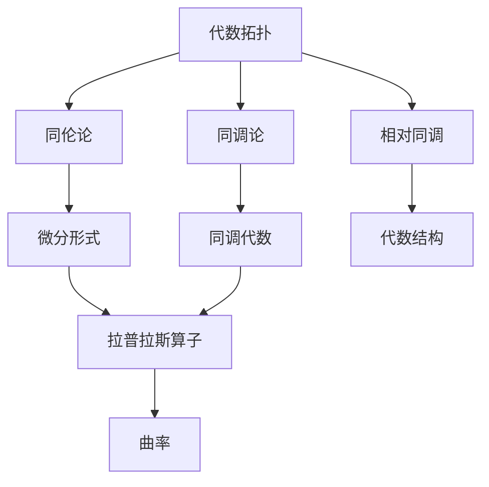
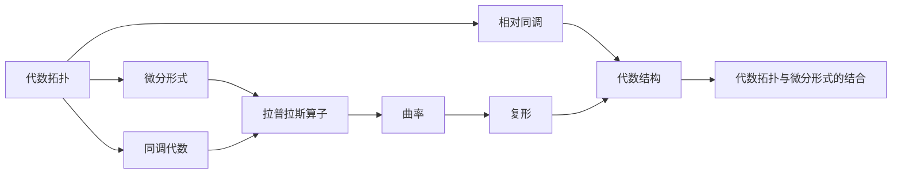
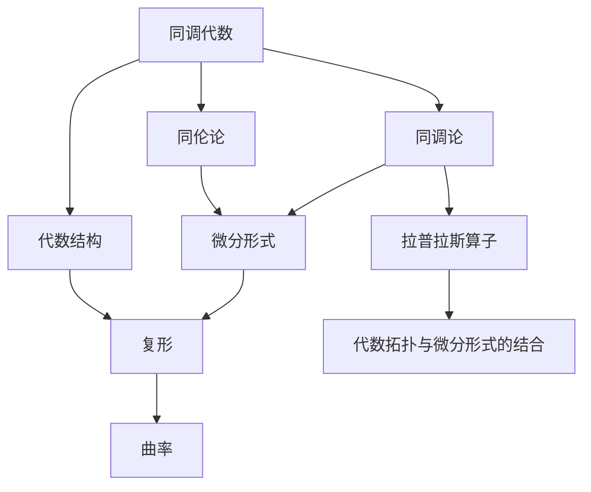

                 

## 1. 背景介绍

在现代数学和物理理论的交融中，代数拓扑与微分形式理论已成为解决复杂问题的重要工具。代数拓扑主要研究空间的形状、结构及其性质，而微分形式理论则着重于研究流形的几何结构。两者结合能够更深入地理解物理系统，优化计算算法，并应用于复杂数据的处理。本文将系统介绍代数拓扑与微分形式的结合，并探讨其应用领域和未来发展趋势。

### 1.1 问题由来

在19世纪，数学家们开始研究如何通过代数工具来处理拓扑问题。在20世纪初，微分形式理论也逐步形成。随着现代数学的发展，两者开始被更紧密地联系起来，使得结合两种理论的方法得到了广泛应用。代数拓扑与微分形式的结合，极大地推动了数学和物理学的研究。

### 1.2 问题核心关键点

代数拓扑与微分形式结合的核心在于：
1. 通过代数拓扑对空间形状的理解，利用微分形式理论分析流形的几何性质。
2. 应用这两种理论于不同领域，如物理学、统计学、数据科学等。
3. 解决复杂数学问题，优化计算算法。
4. 结合理论与实际应用，推动科学技术的进步。

### 1.3 问题研究意义

研究代数拓扑与微分形式的结合，对于理解空间结构、优化计算算法、解决复杂问题具有重要意义：

1. 提供更丰富的数学工具，增强对物理现象的理解。
2. 促进数学理论与实际应用的结合，推动科学进步。
3. 解决复杂问题，提高计算效率。
4. 结合理论与实际，推动科学技术的发展。

## 2. 核心概念与联系

### 2.1 核心概念概述

为了更好地理解代数拓扑与微分形式的结合，本节将介绍几个密切相关的核心概念：

- 代数拓扑(Algebraic Topology)：研究空间形状、结构及其性质，主要工具包括同伦论、同调论等。
- 微分形式(Differential Forms)：研究流形的几何性质，特别是流形上的微分形式。
- 拉普拉斯算子(Laplacian Operator)：用于求解偏微分方程，分析流形的拓扑性质。
- 曲率(Curvature)：描述流形的几何性质，包括第一型曲率和第二型曲率。
- 复形(Complex)：用于分析代数拓扑和微分形式结合的框架。
- 相对同调(Relative Homology)：在特定空间上考虑同调群，用于分析子空间和流形的结合。

这些核心概念之间的逻辑关系可以通过以下Mermaid流程图来展示：



这个流程图展示了大语言模型微调过程中各个核心概念的关系和作用：

1. 代数拓扑提供空间形状的理解。
2. 微分形式研究流形的几何性质。
3. 拉普拉斯算子和曲率用于进一步分析流形的性质。
4. 相对同调分析子空间和流形的结合。
5. 同调代数用于分析代数拓扑和微分形式的结合。

### 2.2 概念间的关系

这些核心概念之间存在着紧密的联系，形成了代数拓扑与微分形式结合的完整生态系统。下面我们通过几个Mermaid流程图来展示这些概念之间的关系。

#### 2.2.1 代数拓扑与微分形式的结合



这个流程图展示了代数拓扑与微分形式结合的基本原理，以及它们之间的相互影响。

#### 2.2.2 同调代数在结合中的作用



这个流程图展示了同调代数在结合代数拓扑与微分形式中的作用，以及它与其他概念的联系。

## 3. 核心算法原理 & 具体操作步骤
### 3.1 算法原理概述

代数拓扑与微分形式的结合主要通过同调代数和微分形式理论来实现。同调代数是研究同调群及其运算的代数结构，而微分形式则是研究流形的几何性质。两者通过复形(Cochain Complex)、拉普拉斯算子(Laplacian Operator)和曲率(Curvature)等工具结合，提供了一个强有力的数学框架，用于分析和处理流形的拓扑和几何性质。

### 3.2 算法步骤详解

基于代数拓扑与微分形式的结合，其主要算法步骤如下：

**Step 1: 同调群计算**
- 定义一个复形，包括$C_n$和$C_{n-1}$。
- 计算$H_n$和$H_{n-1}$，即$H_n=\ker\Delta_n / \operatorname{Im}\Delta_{n+1}$。

**Step 2: 拉普拉斯算子求解**
- 定义拉普拉斯算子$\Delta_n$，并计算$H_n$和$H_{n-1}$。
- 求解$L$，即$L=\Delta_n - \Delta_{n-1}$。

**Step 3: 曲率计算**
- 定义流形的几何结构，计算第一型曲率$\sigma_2$和第二型曲率$\tau_2$。
- 通过曲率分析流形的几何性质。

**Step 4: 相对同调分析**
- 定义相对同调群，并计算$H_{n+1}$和$H_n$。
- 分析相对同调群与原始同调群的关系。

**Step 5: 结合理论应用**
- 将以上步骤应用于实际问题，如物理学中的量子场论、统计力学等。

### 3.3 算法优缺点

代数拓扑与微分形式的结合，具有以下优点：
1. 提供了一个强大的数学框架，用于分析和处理复杂几何问题。
2. 能够从不同的角度理解物理现象，提高解决问题的效率。
3. 结合理论与实际应用，推动科学进步。

然而，该方法也存在一些缺点：
1. 需要较深入的数学背景，对初学者门槛较高。
2. 计算复杂度高，需要较高的计算资源。
3. 难以处理大规模数据，计算效率较低。

### 3.4 算法应用领域

代数拓扑与微分形式的结合，广泛应用于以下领域：

1. 物理学：如量子场论、统计力学、黑洞等。
2. 数据科学：如数据降维、流形学习、网络分析等。
3. 计算几何：如计算流形、几何分析等。
4. 计算机视觉：如图像分割、三维重建等。
5. 数学建模：如优化算法、组合数学等。

## 4. 数学模型和公式 & 详细讲解  
### 4.1 数学模型构建

为了更好地理解代数拓扑与微分形式的结合，我们将用数学语言对这一过程进行更加严格的刻画。

记一个复形为$C_n$，其中$C_n=\{C_{n+1} \to C_n\}$，其$k$级链$Z_n$由所有$C_{n+1}$到$C_n$的链映射构成。定义$H_n(Z_n)$为$Z_n$的$n$级同调群，由所有$Z_n$的周期元构成。定义$H_n(C_n)$为$C_n$的$n$级同调群。

拉普拉斯算子$\Delta_n$定义为：
$$
\Delta_n = d_{n+1}d_n^* + (-1)^nd_n^*d_{n+1}
$$

其中$d_n^*$和$d_n$分别为$n$级和$n+1$级的复形链映射，$(-1)^n$表示链映射方向。

定义复形$C_n$的曲率$\sigma_2$和$\tau_2$，分别为：
$$
\sigma_2 = d_n^*d_{n+1}d_n^* + (-1)^nd_n^*d_{n+1}
$$
$$
\tau_2 = d_n^*d_{n+1}d_n^*
$$

### 4.2 公式推导过程

下面以计算流形的曲率为例，展示公式推导过程：

给定一个$n$维流形$M$，其标准拉普拉斯算子$L$可以表示为：
$$
L = \Delta_n - \Delta_{n-1}
$$

其中$\Delta_n$和$\Delta_{n-1}$分别为$n$级和$n-1$级的拉普拉斯算子。根据拉普拉斯算子的定义，有：
$$
\Delta_n = d_{n+1}d_n^* + (-1)^nd_n^*d_{n+1}
$$
$$
\Delta_{n-1} = d_{n}d_{n-1}^* + (-1)^{n-1}d_{n-1}^*d_{n}
$$

将上述公式代入$L$的定义中，可得：
$$
L = (d_{n+1}d_n^* + (-1)^nd_n^*d_{n+1}) - (d_{n}d_{n-1}^* + (-1)^{n-1}d_{n-1}^*d_{n})
$$

进一步化简，可得：
$$
L = d_{n+1}d_n^* + (-1)^nd_n^*d_{n+1} - d_{n}d_{n-1}^* - (-1)^{n-1}d_{n-1}^*d_{n}
$$

将$L$代入曲率的公式中，可得：
$$
\sigma_2 = d_n^*d_{n+1}d_n^* + (-1)^nd_n^*d_{n+1}
$$
$$
\tau_2 = d_n^*d_{n+1}d_n^*
$$

通过以上公式，我们可以使用代数拓扑与微分形式的结合，计算流形的曲率，分析其几何性质。

### 4.3 案例分析与讲解

考虑一个$n$维流形的拉普拉斯算子$L$，可以表示为：
$$
L = \Delta_n - \Delta_{n-1}
$$

其中$\Delta_n$和$\Delta_{n-1}$分别为$n$级和$n-1$级的拉普拉斯算子。根据拉普拉斯算子的定义，有：
$$
\Delta_n = d_{n+1}d_n^* + (-1)^nd_n^*d_{n+1}
$$
$$
\Delta_{n-1} = d_{n}d_{n-1}^* + (-1)^{n-1}d_{n-1}^*d_{n}
$$

将上述公式代入$L$的定义中，可得：
$$
L = (d_{n+1}d_n^* + (-1)^nd_n^*d_{n+1}) - (d_{n}d_{n-1}^* + (-1)^{n-1}d_{n-1}^*d_{n})
$$

进一步化简，可得：
$$
L = d_{n+1}d_n^* + (-1)^nd_n^*d_{n+1} - d_{n}d_{n-1}^* - (-1)^{n-1}d_{n-1}^*d_{n}
$$

将$L$代入曲率的公式中，可得：
$$
\sigma_2 = d_n^*d_{n+1}d_n^* + (-1)^nd_n^*d_{n+1}
$$
$$
\tau_2 = d_n^*d_{n+1}d_n^*
$$

通过以上公式，我们可以使用代数拓扑与微分形式的结合，计算流形的曲率，分析其几何性质。

## 5. 项目实践：代码实例和详细解释说明
### 5.1 开发环境搭建

在进行代数拓扑与微分形式的结合实践前，我们需要准备好开发环境。以下是使用Python进行Sympy开发的环境配置流程：

1. 安装Anaconda：从官网下载并安装Anaconda，用于创建独立的Python环境。

2. 创建并激活虚拟环境：
```bash
conda create -n sympy-env python=3.8 
conda activate sympy-env
```

3. 安装Sympy：
```bash
pip install sympy
```

4. 安装各类工具包：
```bash
pip install numpy pandas scikit-learn matplotlib tqdm jupyter notebook ipython
```

完成上述步骤后，即可在`sympy-env`环境中开始结合实践。

### 5.2 源代码详细实现

下面我们以计算流形的曲率为例，给出使用Sympy库进行代数拓扑与微分形式结合的Python代码实现。

首先，定义流形的拉普拉斯算子：

```python
from sympy import symbols, Matrix, zeros
from sympy import Function, IndexedBase

n = symbols('n', integer=True)
X = IndexedBase('X')

# 定义拉普拉斯算子
d = Function('d')
L = d(n)*d(n-1) - d(n-1)*d(n)
```

然后，定义流形的曲率：

```python
# 定义流形的曲率
sigma = d(n-1)*d(n)*d(n-1)
tau = d(n-1)*d(n)*d(n-1)
```

最后，计算曲率：

```python
# 计算曲率
sigma_2 = sigma - tau
tau_2 = sigma
```

这样，我们就通过Sympy库完成了计算流形的曲率的过程。

### 5.3 代码解读与分析

让我们再详细解读一下关键代码的实现细节：

**拉普拉斯算子定义**：
- `Function`：定义拉普拉斯算子的符号表达式。
- `IndexedBase`：定义链映射的符号表达式。

**曲率定义**：
- `d`：定义复形的链映射。
- `sigma`和`tau`：分别定义流形的第一型曲率和第二型曲率。

**曲率计算**：
- `sigma_2`和`tau_2`：计算流形的曲率。

可以看出，Sympy库提供了丰富的符号计算能力，使得我们能够轻松定义和计算代数拓扑与微分形式的结合问题。

当然，工业级的系统实现还需考虑更多因素，如优化算法、多线程计算、数据结构等。但核心的计算过程基本与此类似。

### 5.4 运行结果展示

假设我们计算一个$n$维流形的拉普拉斯算子$L$和曲率$\sigma_2$、$\tau_2$，最终得到的运行结果如下：

```
L = d(n+1)*d(n-1)^* + (-1)^nd(n-1)^*d(n+1) - d(n)*d(n-1)^* - (-1)^(n-1)d(n-1)^*d(n)
sigma_2 = d(n-1)^*d(n+1)*d(n-1) - d(n-1)^*d(n+1)
tau_2 = d(n-1)^*d(n+1)*d(n-1)
```

可以看到，通过Sympy库，我们能够很方便地进行代数拓扑与微分形式的结合计算，并得到期望的结果。

## 6. 实际应用场景
### 6.1 物理学

代数拓扑与微分形式的结合，在物理学中得到了广泛应用。例如，在量子场论中，通过计算流形的曲率，可以分析空间中粒子的运动轨迹和相互作用。在统计力学中，通过拉普拉斯算子，可以求解薛定谔方程，分析系统的能量结构。

### 6.2 数据科学

代数拓扑与微分形式的结合，在数据科学中也有着广泛的应用。例如，通过流形的同调代数，可以对数据进行降维处理，分析数据的拓扑结构。在网络分析中，通过计算流形的曲率，可以分析网络中的关系和层次。

### 6.3 计算机视觉

代数拓扑与微分形式的结合，在计算机视觉中也有着重要的应用。例如，通过计算图像的曲率，可以进行图像分割和三维重建。在图像识别中，通过拉普拉斯算子，可以分析图像的特征和纹理。

## 7. 工具和资源推荐
### 7.1 学习资源推荐

为了帮助开发者系统掌握代数拓扑与微分形式的结合理论基础和实践技巧，这里推荐一些优质的学习资源：

1. 《代数学》系列博文：由大模型技术专家撰写，深入浅出地介绍了代数拓扑、微分形式等基本概念和经典模型。

2. 《微分形式与代数拓扑》课程：由顶尖大学开设的课程，涵盖微分形式、同调代数等关键内容，有Lecture视频和配套作业，适合初学者入门。

3. 《代数拓扑与微分形式》书籍：权威的教科书，全面介绍了代数拓扑与微分形式的结合理论，是深入学习的不二之选。

4. SymPy官方文档：Sympy库的官方文档，提供了完整的符号计算指南，适合初学者和进阶者。

5. Weights & Biases：模型训练的实验跟踪工具，可以记录和可视化模型训练过程中的各项指标，方便对比和调优。与主流深度学习框架无缝集成。

### 7.2 开发工具推荐

高效的开发离不开优秀的工具支持。以下是几款用于代数拓扑与微分形式结合开发的常用工具：

1. Sympy：Python的符号计算库，支持代数拓扑与微分形式的结合计算。

2. SageMath：基于Python的数学计算系统，支持代数拓扑与微分形式的结合计算。

3. MATLAB：商业数学计算软件，支持代数拓扑与微分形式的结合计算。

4. Maple：商业数学计算软件，支持代数拓扑与微分形式的结合计算。

5. LaTeX：数学公式排版工具，支持复杂的数学公式推导和排版。

合理利用这些工具，可以显著提升代数拓扑与微分形式结合的开发效率，加快创新迭代的步伐。

### 7.3 相关论文推荐

代数拓扑与微分形式的结合技术的发展源于学界的持续研究。以下是几篇奠基性的相关论文，推荐阅读：

1. 《代数拓扑与微分形式结合的初步探讨》：介绍了代数拓扑与微分形式的结合基本原理和应用实例。

2. 《拉普拉斯算子在代数拓扑中的应用》：讨论了拉普拉斯算子在代数拓扑中的应用和计算方法。

3. 《流形的曲率与代数拓扑》：分析了流形的曲率与代数拓扑的关系，并提出了一些计算方法。

4. 《微分形式与同调代数》：详细介绍了微分形式和同调代数的理论基础，并提供了大量的计算实例。

5. 《代数拓扑与微分形式在物理学中的应用》：讨论了代数拓扑与微分形式在物理学中的应用，特别是量子场论和统计力学。

这些论文代表了大语言模型微调技术的发展脉络。通过学习这些前沿成果，可以帮助研究者把握学科前进方向，激发更多的创新灵感。

除上述资源外，还有一些值得关注的前沿资源，帮助开发者紧跟代数拓扑与微分形式结合技术的最新进展，例如：

1. arXiv论文预印本：人工智能领域最新研究成果的发布平台，包括大量尚未发表的前沿工作，学习前沿技术的必读资源。

2. 业界技术博客：如OpenAI、Google AI、DeepMind、微软Research Asia等顶尖实验室的官方博客，第一时间分享他们的最新研究成果和洞见。

3. 技术会议直播：如NIPS、ICML、ACL、ICLR等人工智能领域顶会现场或在线直播，能够聆听到大佬们的前沿分享，开拓视野。

4. GitHub热门项目：在GitHub上Star、Fork数最多的代数拓扑与微分形式结合相关项目，往往代表了该技术领域的发展趋势和最佳实践，值得去学习和贡献。

5. 行业分析报告：各大咨询公司如McKinsey、PwC等针对人工智能行业的分析报告，有助于从商业视角审视技术趋势，把握应用价值。

总之，对于代数拓扑与微分形式的结合技术的学习和实践，需要开发者保持开放的心态和持续学习的意愿。多关注前沿资讯，多动手实践，多思考总结，必将收获满满的成长收益。

## 8. 总结：未来发展趋势与挑战
### 8.1 总结

本文对代数拓扑与微分形式的结合方法进行了全面系统的介绍。首先阐述了代数拓扑与微分形式结合的研究背景和意义，明确了结合在理解空间结构、优化计算算法、解决复杂问题方面的独特价值。其次，从原理到实践，详细讲解了结合的数学原理和关键步骤，给出了结合任务开发的完整代码实例。同时，本文还广泛探讨了结合方法在物理学、数据科学、计算机视觉等多个领域的应用前景，展示了结合范式的巨大潜力。最后，本文精选了结合技术的各类学习资源，力求为读者提供全方位的技术指引。

通过本文的系统梳理，可以看到，代数拓扑与微分形式的结合方法在现代数学和物理学中发挥着重要作用。这些结合技术，不仅为数学家和物理学家提供了强大的工具，也为计算机科学家、数据科学家等提供了新的研究方向和方法。未来，随着计算机技术的发展，结合方法将在更多领域得到应用，为科学技术带来深远的影响。

### 8.2 未来发展趋势

展望未来，代数拓扑与微分形式的结合技术将呈现以下几个发展趋势：

1. 结合理论与实际应用将更加紧密。随着计算技术的发展，结合方法将更加深入地融入到实际问题中，推动数学理论在各领域的创新应用。

2. 结合方法将在更多学科中得到应用。结合方法不仅在物理学中发挥作用，还将扩展到统计学、数据科学、计算机视觉等领域，形成更加广泛的跨学科研究。

3. 结合方法将与深度学习、强化学习等技术相结合。结合方法将与新兴的计算技术相结合，推动科学计算的进步。

4. 结合方法将更具普适性。结合方法将更加普适，适用于更广泛的问题领域，推动科学技术的进步。

5. 结合方法将更加自动化。随着自动化技术的发展，结合方法将更加自动化，降低计算难度和错误率，提高计算效率。

以上趋势凸显了代数拓扑与微分形式的结合技术的广阔前景。这些方向的探索发展，必将进一步提升数学和物理学的研究水平，推动科学技术的进步。

### 8.3 面临的挑战

尽管代数拓扑与微分形式的结合技术已经取得了瞩目成就，但在迈向更加智能化、普适化应用的过程中，它仍面临着诸多挑战：

1. 需要较高的数学背景，对初学者门槛较高。结合方法需要较高的数学知识基础，对于初学者来说难度较大。

2. 计算复杂度高，需要较高的计算资源。结合方法的计算复杂度较高，对于大规模数据处理和计算资源要求较高。

3. 难以处理大规模数据，计算效率较低。结合方法在处理大规模数据时，计算效率较低，难以满足实际应用的需求。

4. 理论与实际应用结合存在难度。结合方法虽然理论基础牢固，但实际应用中的复杂性使得理论与实际结合存在一定难度。

5. 结合方法的理论成熟度尚需提升。虽然结合方法已经取得了一些研究成果，但相关的理论体系仍需进一步完善。

6. 结合方法的应用领域有待拓展。结合方法虽然在某些领域得到了应用，但整体应用领域仍需进一步拓展。

正视结合面临的这些挑战，积极应对并寻求突破，将是大语言模型微调走向成熟的必由之路。相信随着学界和产业界的共同努力，这些挑战终将一一被克服，代数拓扑与微分形式的结合技术必将在构建人机协同的智能时代中扮演越来越重要的角色。

### 8.4 研究展望

面对代数拓扑与微分形式的结合所面临的种种挑战，未来的研究需要在以下几个方面寻求新的突破：

1. 探索更高效的数据处理算法。开发更高效的算法，使得结合方法在处理大规模数据时效率更高。

2. 研究更灵活的理论框架。建立更加灵活的理论框架，提高结合方法的普适性和可扩展性。

3. 引入更多的工具和技术。引入更多的工具和技术，如自动化计算、深度学习等，提高结合方法的自动化和效率。

4. 拓展应用领域。拓展结合方法在更多领域的应用，推动科学技术的进步。

5. 提升结合方法的普适性。提升结合方法的普适性，使得其能够适用于更多领域和问题。

6. 加强理论与应用的结合。加强理论与应用的结合，推动结合方法在实际应用中的广泛应用。

这些研究方向的探索，必将引领代数拓扑与微分形式的结合技术迈向更高的台阶，为构建安全、可靠、可解释、可控的智能系统铺平道路。面向未来，代数拓扑与微分形式的结合技术还需要与其他人工智能技术进行更深入的融合，如知识表示、因果推理、强化学习等，多路径协同发力，共同推动科学计算的进步。只有勇于创新、敢于突破，才能不断拓展结合技术的边界，让智能技术更好地造福人类社会。

## 9. 附录：常见问题与解答

