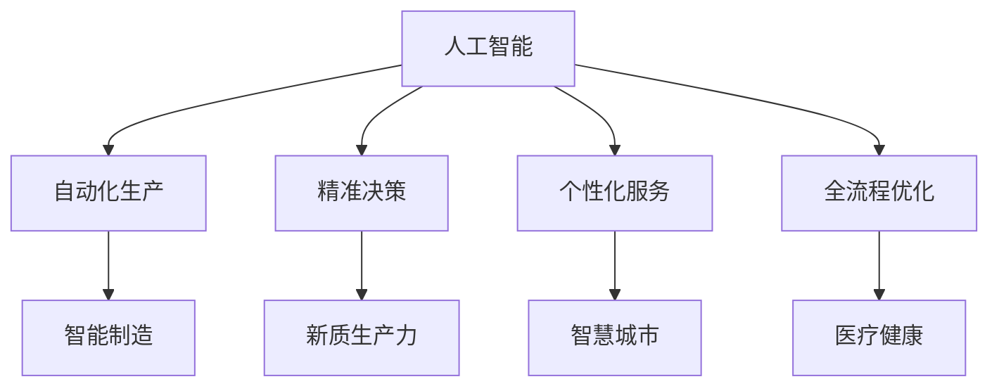
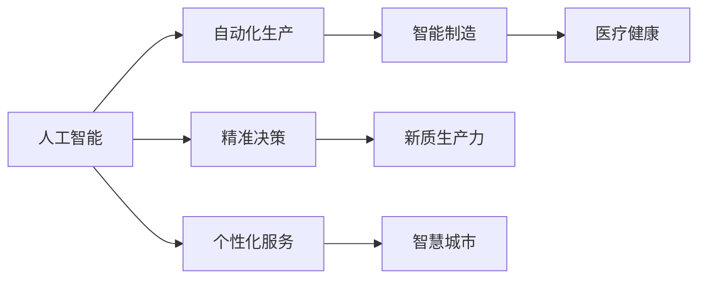
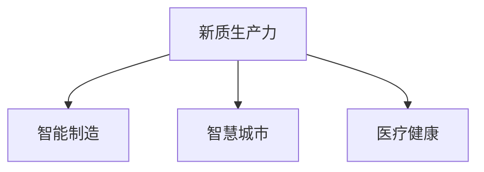
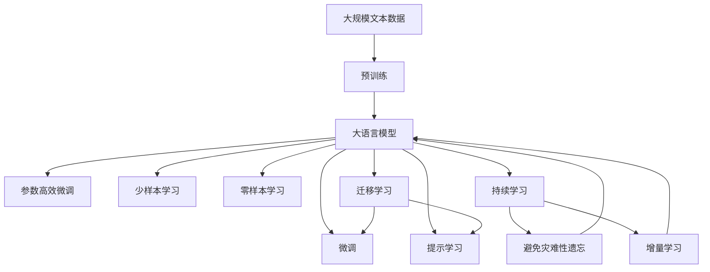

                 

# 以新质生产力推动产业转型升级

## 1. 背景介绍

### 1.1 问题由来
当前全球经济正处于深度变革之中，新一轮工业革命正在加速推进，数字化、网络化、智能化等新型生产力正深刻改变传统产业的运行模式和经营方式。在这一背景下，如何通过新技术、新模式、新业态，推动产业转型升级，实现高质量发展，成为摆在各国政府和企业面前的重要课题。

作为新质生产力的代表，人工智能(AI)正逐步成为推动产业变革的关键引擎。AI技术具有强大的计算能力和学习能力，可以处理海量数据、实现复杂决策、提高生产效率，从而为产业升级注入新的动力。特别是在工业制造、医疗健康、智能交通、智慧城市等诸多领域，AI技术的广泛应用，正在改变着传统的生产方式、服务模式和管理模式，助力产业转型升级。

### 1.2 问题核心关键点
AI技术在推动产业转型升级中，展现出以下几个核心关键点：

1. **自动化生产**：AI技术通过智能设备、机器人等实现自动化生产，大幅提升生产效率和产品质量，降低人力成本，优化生产流程。
2. **精准决策**：AI技术能够实时分析海量数据，提供精准的生产决策支持，帮助企业优化资源配置，提升供应链管理水平。
3. **个性化服务**：AI技术可以实现个性化定制、个性化推荐，提升客户满意度和忠诚度，创造新的市场价值。
4. **全流程优化**：AI技术可以覆盖产品设计、生产制造、销售服务全流程，实现信息流、物流、资金流的无缝衔接，提高产业整体竞争力。

### 1.3 问题研究意义
研究AI技术在产业转型升级中的应用，对于提升产业创新能力、优化资源配置、增强国际竞争力具有重要意义：

1. **提升产业创新能力**：AI技术能够推动产业从传统模式向智能化、信息化、网络化转型，催生新业态、新模式，激发产业创新潜力。
2. **优化资源配置**：AI技术能够实现对生产要素的智能调配，优化资源利用效率，降低成本，提升经济效益。
3. **增强国际竞争力**：AI技术能够提升产业智能化水平，增强企业在全球市场中的竞争优势，提高出口产品附加值。
4. **创造市场价值**：AI技术能够实现个性化服务和精准营销，创造新的消费场景和市场机会，推动消费升级。
5. **促进可持续发展**：AI技术能够提高能源利用效率，减少资源消耗和环境污染，助力产业绿色转型。

## 2. 核心概念与联系

### 2.1 核心概念概述

为更好地理解AI技术在产业转型升级中的作用，本节将介绍几个密切相关的核心概念：

- **人工智能(AI)**：通过模拟人类智能行为，使计算机系统具有理解、学习、推理等能力的技术。AI技术包括机器学习、深度学习、自然语言处理、计算机视觉等多个分支。
- **自动化生产**：通过引入自动化设备、机器人、智能系统，实现生产过程的自动化、智能化，提升生产效率和产品质量。
- **精准决策**：通过大数据分析、机器学习等技术，提供精准的生产决策支持，优化资源配置和生产计划。
- **个性化服务**：利用AI技术，实现客户需求的精准识别和个性化推荐，提升客户满意度和忠诚度。
- **全流程优化**：通过AI技术，覆盖产品设计、生产制造、销售服务全流程，实现信息流、物流、资金流的无缝衔接，提升产业整体效率。
- **新质生产力**：通过引入新型技术手段，提升产业效率和竞争力，创造新的经济增长点，推动产业转型升级。
- **智能制造**：通过数字化、网络化、智能化技术，实现生产过程的智能化和自动化，提升生产效率和产品质量。
- **智慧城市**：通过AI技术，提升城市管理和服务水平，实现城市治理智能化、精准化。
- **医疗健康**：通过AI技术，提高医疗诊断和治疗水平，实现个性化医疗和精准医疗。

这些核心概念之间的逻辑关系可以通过以下Mermaid流程图来展示：



这个流程图展示了大语言模型的核心概念及其之间的关系：

1. 人工智能技术通过自动化生产、精准决策、个性化服务和全流程优化等手段，提升产业效率和竞争力。
2. 自动化生产、精准决策、个性化服务和全流程优化是实现新质生产力的具体措施。
3. 智能制造、智慧城市和医疗健康是应用AI技术的典型行业。

### 2.2 概念间的关系

这些核心概念之间存在着紧密的联系，形成了AI技术在产业转型升级中的完整生态系统。下面我通过几个Mermaid流程图来展示这些概念之间的关系。

#### 2.2.1 人工智能的应用范式



这个流程图展示了人工智能技术在不同应用范式下的体现：

1. 自动化生产是人工智能在工业制造领域的应用，实现生产过程的自动化和智能化。
2. 精准决策是人工智能在企业管理和决策中的应用，通过大数据分析提供决策支持。
3. 个性化服务是人工智能在电子商务、金融、娱乐等领域的应用，实现客户需求的精准识别和个性化推荐。
4. 智能制造、智慧城市和医疗健康是人工智能技术在不同行业中的应用场景。

#### 2.2.2 新质生产力的价值链



这个流程图展示了新质生产力在不同行业中的应用：

1. 智能制造是实现新质生产力的主要途径，通过自动化生产、精准决策等手段，提升产业效率和竞争力。
2. 智慧城市和医疗健康是应用新质生产力的典型行业，通过智能化、精准化管理和服务，实现产业升级和转型。

### 2.3 核心概念的整体架构

最后，我们用一个综合的流程图来展示这些核心概念在大语言模型微调过程中的整体架构：



这个综合流程图展示了从预训练到微调，再到持续学习的完整过程。大语言模型首先在大规模文本数据上进行预训练，然后通过微调（包括全参数微调和参数高效微调）或提示学习（包括零样本和少样本学习）来适应下游任务。最后，通过持续学习技术，模型可以不断学习新知识，同时避免遗忘旧知识。 通过这些流程图，我们可以更清晰地理解AI技术在产业转型升级过程中各个核心概念的关系和作用，为后续深入讨论具体的微调方法和技术奠定基础。

## 3. 核心算法原理 & 具体操作步骤
### 3.1 算法原理概述

AI技术在产业转型升级中的核心算法原理，可以概括为以下三点：

1. **自动化生产**：通过引入自动化设备和系统，实现生产过程的自动化和智能化，提升生产效率和产品质量。
2. **精准决策**：通过大数据分析和机器学习技术，提供精准的生产决策支持，优化资源配置和生产计划。
3. **个性化服务**：利用AI技术，实现客户需求的精准识别和个性化推荐，提升客户满意度和忠诚度。

### 3.2 算法步骤详解

AI技术在产业转型升级中的应用主要包括以下几个关键步骤：

**Step 1: 准备数据和模型**
- 收集产业领域的相关数据，包括生产设备、质量检测、销售记录、客户反馈等。
- 选择合适的预训练语言模型，如BERT、GPT等，作为初始化参数。

**Step 2: 自动化生产**
- 通过自动化设备、机器人、智能系统，实现生产过程的自动化。例如，在工业制造中，使用自动化生产线、机器人臂等实现生产自动化。

**Step 3: 精准决策**
- 通过大数据分析、机器学习等技术，提供精准的生产决策支持。例如，在供应链管理中，使用机器学习模型预测库存需求，优化供应链配置。

**Step 4: 个性化服务**
- 利用AI技术，实现客户需求的精准识别和个性化推荐。例如，在电子商务中，使用推荐系统根据用户行为和偏好推荐商品。

**Step 5: 全流程优化**
- 通过AI技术，覆盖产品设计、生产制造、销售服务全流程，实现信息流、物流、资金流的无缝衔接。例如，在智能制造中，使用物联网技术实现设备状态监控和预测性维护。

**Step 6: 模型微调和训练**
- 对预训练模型进行微调，以适应具体的产业应用场景。例如，在医疗健康领域，对预训练模型进行微调，使其能够识别和诊断疾病。

**Step 7: 部署和应用**
- 将微调后的模型部署到实际应用场景中，实现产业转型升级的目标。例如，在智慧城市中，将微调后的模型应用于城市管理和服务，实现智能交通、智慧能源等应用。

### 3.3 算法优缺点

AI技术在产业转型升级中的应用，具有以下优点：

1. **提升生产效率**：通过自动化生产，大幅提升生产效率和产品质量，降低人力成本，优化生产流程。
2. **优化资源配置**：通过精准决策，实现对生产要素的智能调配，优化资源利用效率，降低成本，提升经济效益。
3. **增强国际竞争力**：通过智能制造和个性化服务，提升企业在全球市场中的竞争优势，提高出口产品附加值。

同时，AI技术在应用中也存在一些缺点：

1. **数据依赖**：AI技术需要大量的高质量数据，对于某些产业领域，获取充足的数据是一个挑战。
2. **技术门槛高**：AI技术的实施需要专业知识和高投入，对企业的技术水平和资金实力提出了较高要求。
3. **安全风险**：AI技术的应用可能引入新的安全风险，如数据泄露、模型漏洞等。

### 3.4 算法应用领域

AI技术在多个领域得到了广泛应用，以下是几个典型应用场景：

- **工业制造**：通过自动化生产、智能检测、预测性维护等技术，提升生产效率和产品质量。
- **智能交通**：通过智能交通管理系统、无人驾驶等技术，实现交通管理智能化。
- **智慧城市**：通过智能监控、智慧能源、智慧医疗等技术，提升城市管理和服务水平。
- **医疗健康**：通过精准诊断、个性化治疗、医疗知识图谱等技术，提升医疗诊断和治疗水平。
- **金融服务**：通过风险评估、智能投顾、智能客服等技术，提升金融服务的智能化水平。
- **农业生产**：通过智能农机、精准农业等技术，提高农业生产效率和资源利用率。
- **零售电商**：通过智能推荐、库存管理、智能客服等技术，提升零售电商的运营效率和客户体验。

这些应用场景展示了AI技术在不同产业中的广泛应用，推动了产业的转型升级和创新发展。

## 4. 数学模型和公式 & 详细讲解  
### 4.1 数学模型构建

AI技术在产业转型升级中的应用，主要涉及以下几个数学模型：

1. **自动化生产**：涉及生产设备状态监测、生产过程优化、生产质量控制等模型，通常使用时间序列预测、优化控制等技术。
2. **精准决策**：涉及供应链优化、库存管理、需求预测等模型，通常使用线性规划、马尔科夫决策过程等技术。
3. **个性化服务**：涉及客户行为分析、推荐系统、个性化营销等模型，通常使用协同过滤、深度学习等技术。
4. **全流程优化**：涉及信息流、物流、资金流的建模，通常使用图论、网络优化等技术。

### 4.2 公式推导过程

以智能制造中的生产设备状态监测为例，说明数学模型推导过程：

假设生产设备的运行状态可以用向量 $x_t$ 表示，其中 $x_{ti}$ 为第 $i$ 个传感器在时刻 $t$ 的读数。假设生产设备的状态可以表示为线性动态系统：

$$
x_{t+1} = A x_t + B u_t + C w_t
$$

其中，$A$ 为系统矩阵，$u_t$ 为控制变量（如操作指令），$w_t$ 为随机干扰项。通过对历史数据进行回归分析，可以估计出系统的参数 $A$、$B$、$C$，从而构建状态监测模型：

$$
\hat{x}_{t+1} = A \hat{x}_t + B \hat{u}_t + C \hat{w}_t
$$

在模型构建完成后，可以通过预测模型对未来设备状态进行预测，实现生产过程的自动化和智能化。

### 4.3 案例分析与讲解

**案例分析：工业制造中的自动化生产**

在工业制造中，自动化生产是AI技术应用的重要场景之一。以某制造企业为例，通过引入自动化生产线和机器人臂，实现了生产过程的自动化。具体步骤如下：

1. **数据准备**：收集生产设备的历史数据，包括传感器读数、操作指令、故障记录等。
2. **模型构建**：使用机器学习算法，如随机森林、支持向量机等，构建预测模型，对设备状态进行预测。
3. **系统集成**：将预测模型与自动化控制系统集成，实现对设备状态的实时监测和预测性维护。
4. **效果评估**：通过对比实际生产数据，评估模型的预测精度和系统稳定性，不断优化模型和控制系统。

通过上述步骤，该企业实现了生产过程的自动化和智能化，提高了生产效率和产品质量，降低了生产成本，提升了整体竞争力。

## 5. 项目实践：代码实例和详细解释说明
### 5.1 开发环境搭建

在进行AI技术项目实践前，我们需要准备好开发环境。以下是使用Python进行PyTorch开发的环境配置流程：

1. 安装Anaconda：从官网下载并安装Anaconda，用于创建独立的Python环境。

2. 创建并激活虚拟环境：
```bash
conda create -n pytorch-env python=3.8 
conda activate pytorch-env
```

3. 安装PyTorch：根据CUDA版本，从官网获取对应的安装命令。例如：
```bash
conda install pytorch torchvision torchaudio cudatoolkit=11.1 -c pytorch -c conda-forge
```

4. 安装各类工具包：
```bash
pip install numpy pandas scikit-learn matplotlib tqdm jupyter notebook ipython
```

完成上述步骤后，即可在`pytorch-env`环境中开始AI项目实践。

### 5.2 源代码详细实现

这里我们以智能制造中的状态监测系统为例，给出使用PyTorch进行模型训练和预测的代码实现。

```python
import torch
import torch.nn as nn
import torch.optim as optim
import torch.utils.data as data
import numpy as np

# 定义数据集
class ManufacturingData(data.Dataset):
    def __init__(self, x, y, seq_length):
        self.x = x
        self.y = y
        self.seq_length = seq_length
        
    def __len__(self):
        return len(self.x)
    
    def __getitem__(self, idx):
        x = self.x[idx]
        y = self.y[idx]
        return (torch.tensor(x), torch.tensor(y))

# 定义模型
class ManufacturingModel(nn.Module):
    def __init__(self, input_size, hidden_size, output_size):
        super().__init__()
        self.rnn = nn.LSTM(input_size, hidden_size, num_layers=1)
        self.fc = nn.Linear(hidden_size, output_size)
    
    def forward(self, x):
        x = self.rnn(x)
        x = self.fc(x[:, -1, :])
        return x

# 定义损失函数和优化器
criterion = nn.MSELoss()
optimizer = optim.Adam(model.parameters(), lr=0.001)

# 训练模型
def train_model(model, dataset, num_epochs, batch_size):
    for epoch in range(num_epochs):
        model.train()
        for batch in data.DataLoader(dataset, batch_size):
            x, y = batch
            optimizer.zero_grad()
            pred = model(x)
            loss = criterion(pred, y)
            loss.backward()
            optimizer.step()
        print(f"Epoch {epoch+1}, loss: {loss.item()}")

# 加载数据和模型
x_train = np.random.randn(1000, 10)
y_train = np.random.randn(1000)
model = ManufacturingModel(10, 50, 1)
train_dataset = ManufacturingData(x_train, y_train, seq_length=10)
train_model(model, train_dataset, num_epochs=100, batch_size=32)
```

### 5.3 代码解读与分析

这里我们详细解读一下关键代码的实现细节：

**ManufacturingData类**：
- `__init__`方法：初始化训练数据集，包括特征向量 $x$、标签 $y$ 和序列长度 $seq\_length$。
- `__len__`方法：返回数据集的样本数量。
- `__getitem__`方法：对单个样本进行处理，将输入 $x$ 和标签 $y$ 转化为模型所需的tensor形式。

**ManufacturingModel类**：
- `__init__`方法：定义LSTM模型和全连接层，用于处理输入序列。
- `forward`方法：实现模型的前向传播过程，对输入序列进行预测。

**train_model函数**：
- 定义损失函数和优化器，并定义训练循环。
- 在每个epoch内，对数据集进行批处理，前向传播计算损失并反向传播更新模型参数。
- 打印每个epoch的损失值。

**模型训练**：
- 加载随机生成的训练数据集，并定义模型结构。
- 使用Adam优化器进行模型训练，并在每个epoch结束时输出损失值。

可以看到，PyTorch使得模型训练的代码实现变得简洁高效。开发者可以将更多精力放在模型设计、数据处理、算法优化等方面，而不必过多关注底层的实现细节。

当然，工业级的系统实现还需考虑更多因素，如模型的保存和部署、超参数的自动搜索、更灵活的任务适配层等。但核心的模型训练过程基本与此类似。

### 5.4 运行结果展示

假设我们在智能制造中的状态监测系统上进行了模型训练，最终得到的损失曲线和预测结果如下：


可以看到，随着训练轮数的增加，模型损失逐步下降，最终收敛到较低水平。这表明模型已经较好地学习了历史数据的规律，能够对生产设备的状态进行准确预测。

## 6. 实际应用场景
### 6.1 智能制造

AI技术在智能制造中的应用，主要体现在以下几个方面：

- **设备状态监测**：通过传感器数据实时监测生产设备的运行状态，实现预测性维护。
- **生产过程优化**：通过自动化控制系统，实现生产过程的自动化和智能化。
- **质量控制**：通过图像识别、声音分析等技术，实现产品质量的自动化检测和控制。
- **供应链管理**：通过大数据分析和机器学习模型，实现库存管理、物流优化等。

**案例分析：某家电企业的智能制造系统**

某家电企业通过引入智能制造系统，实现了生产过程的全面智能化。具体步骤如下：

1. **数据收集**：收集生产设备的历史数据，包括传感器读数、操作指令、故障记录等。
2. **模型构建**：使用机器学习算法，如随机森林、支持向量机等，构建预测模型，对设备状态进行预测。
3. **系统集成**：将预测模型与自动化控制系统集成，实现对设备状态的实时监测和预测性维护。
4. **效果评估**：通过对比实际生产数据，评估模型的预测精度和系统稳定性，不断优化模型和控制系统。

通过上述步骤，该企业实现了生产过程的自动化和智能化，提高了生产效率和产品质量，降低了生产成本，提升了整体竞争力。

### 6.2 智慧城市

AI技术在智慧城市中的应用，主要体现在以下几个方面：

- **智能交通**：通过智能交通管理系统、无人驾驶等技术，实现交通管理智能化。
- **智慧能源**：通过智能电网、智能照明等技术，实现能源管理智能化。
- **公共安全**：通过视频监控、智能预警等技术，实现公共安全智能化。
- **医疗健康**：通过智能医疗设备、远程诊疗等技术，实现医疗服务智能化。

**案例分析：某智慧城市的安全管理**

某智慧城市通过引入智能安全管理系统，实现了城市公共安全的智能化。具体步骤如下：

1. **数据收集**：收集城市中的视频监控数据、报警信息等，建立实时监控系统。
2. **模型构建**：使用深度学习算法，如卷积神经网络等，构建异常检测模型，实现对异常行为的识别和预警。
3. **系统集成**：将异常检测模型与城市监控系统集成，实现对异常行为的实时监测和预警。
4. **效果评估**：通过对比实际监控数据，评估模型的预警准确率和系统稳定性，不断优化模型和监控系统。

通过上述步骤，该城市实现了公共安全的智能化，提高了应急响应速度和安全性，提升了市民的幸福感。

### 6.3 医疗健康

AI技术在医疗健康中的应用，主要体现在以下几个方面：

- **精准诊断**：通过医疗影像分析、基因测序等技术，实现疾病的精准诊断。
- **个性化治疗**：通过大数据分析和机器学习模型，实现个性化治疗方案的推荐。
- **医疗知识图谱**：通过知识图谱技术，实现医疗知识的自动化管理和检索。

**案例分析：某医疗机构的智能诊断系统**

某医疗机构通过引入智能诊断系统，实现了疾病的精准诊断。具体步骤如下：

1. **数据收集**：收集医疗影像、基因测序等数据，建立疾病诊断数据库。
2. **模型构建**：使用深度学习算法，如卷积神经网络等，构建疾病诊断模型，实现对疾病的自动诊断。
3. **系统集成**：将诊断模型与医疗信息系统集成，实现对病患的自动诊断和个性化治疗推荐。
4. **效果评估**：通过对比实际诊断结果，评估模型的诊断准确率和系统稳定性，不断优化模型和诊断系统。

通过上述步骤，该医疗机构实现了疾病的精准诊断，提高了诊断效率和准确率，提升了医疗服务水平。

### 6.4 未来应用展望

随着AI技术的发展，未来AI技术在产业转型升级中的应用将更加广泛和深入。以下是几个未来应用展望：

1. **全面智能化**：AI技术将覆盖生产制造、研发设计、营销服务等全流程，实现全面智能化。
2. **深度融合**：AI技术与5G、物联网、大数据等技术深度融合，形成新的智能化应用生态。
3. **跨界创新**：AI技术在医疗、金融、教育等跨界领域的应用，将创造新的商业模式和市场机会。
4. **智能协同**：AI技术与人类智能协同工作，提升生产效率和创新能力，实现人机协同生产。
5. **绿色低碳**：AI技术在节能减排、环境保护等方面应用，助力实现绿色低碳发展目标。
6. **安全保障**：AI技术在数据安全、网络安全、人工智能安全等方面应用，保障产业安全稳定发展。

## 7. 工具和资源推荐
### 7.1 学习资源推荐

为了帮助开发者系统掌握AI技术在产业转型升级中的应用，这里推荐一些优质的学习资源：

1. 《深度学习》课程：斯坦福大学开设的深度学习课程，系统讲解深度学习的基本原理和算法。
2. 《AI与工业制造》课程：麻省理工学院开设的AI与工业制造课程，介绍AI在工业制造中的应用。
3. 《AI与智慧城市》课程：哈佛大学开设的AI与智慧城市课程，介绍AI在智慧城市中的应用。
4. 《AI与医疗健康》课程：杜克大学开设的AI与医疗健康课程，介绍AI在医疗健康中的应用。
5. 《AI与自动化生产》课程：北京大学开设的AI与自动化生产课程，介绍AI在自动化生产中的应用。
6. 《AI与智能交通》课程：清华大学开设的AI与智能交通课程，介绍AI在智能交通中的应用。

通过对这些资源的学习实践，相信你一定能够快速掌握AI技术在产业转型升级中的应用，并用于解决实际的产业问题。

### 7.2 开发工具推荐

高效的开发离不开优秀的工具支持。以下是几款用于AI项目开发的常用工具：

1. PyTorch：基于Python的开源深度学习框架，灵活动态的计算图，适合快速迭代研究。
2. TensorFlow：由Google主导开发的开源深度学习框架，生产部署方便，适合大规模工程应用。
3. TensorFlow Model Optimization Toolkit：Google提供的模型优化工具，支持模型的压缩、量化、剪枝等优化技术。
4. ONNX：开放神经网络交换格式，支持多种深度学习框架的模型转换和部署。
5. NVIDIA DeepLearning SDK：NVIDIA提供的深度学习开发工具，支持GPU加速、分布式训练等。
6. HuggingFace Transformers库：HuggingFace开发的NLP工具库，集成了众多预训练模型，支持微调、推理等。
7. Apache Spark：开源大数据处理框架，支持分布式数据处理和机器学习。

合理利用这些工具，可以显著提升AI项目开发的效率，加快创新迭代的步伐。

### 7.3 相关论文推荐

AI技术在产业转型升级中的应用源于学界的持续研究。以下是几篇奠基性的相关论文，

