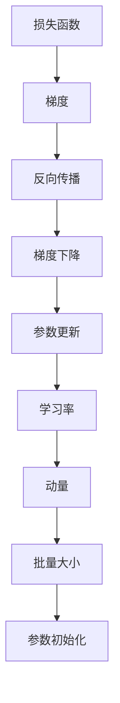
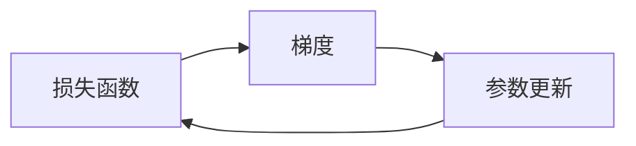
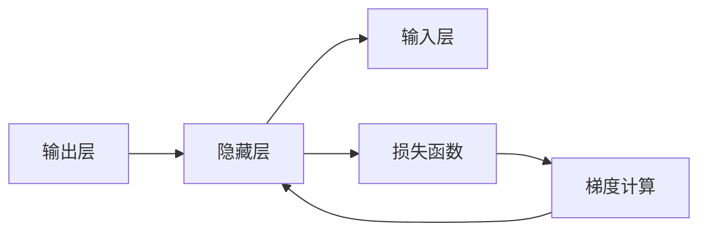
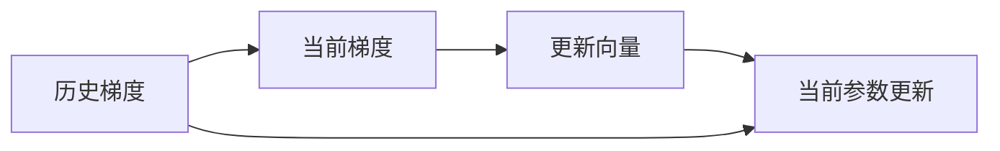

                 

# 优化算法：梯度下降 (Gradient Descent) 原理与代码实例讲解

> 关键词：梯度下降, 优化算法, 机器学习, 反向传播, 参数更新, 损失函数

## 1. 背景介绍

### 1.1 问题由来
在机器学习中，我们往往需要解决一个最优化问题，即找到一个最优的参数向量 $\theta$ 使得损失函数 $J(\theta)$ 最小。常见的机器学习问题，如线性回归、逻辑回归、神经网络训练等，均可以归结为参数优化问题。其中，梯度下降（Gradient Descent, GD）是最基础且广泛应用的优化算法之一。

### 1.2 问题核心关键点
梯度下降算法的基本思想是通过迭代更新模型参数，逐步接近损失函数的最小值。该算法简单高效，具有广泛的适用性和可解释性，但在实际应用中，如何选择合适的学习率、是否应用动量加速等参数设置，以及如何处理非凸损失函数、稀疏梯度等特殊情况，都是值得深入探讨的问题。

### 1.3 问题研究意义
梯度下降算法在机器学习中具有基石地位，掌握其原理和实现细节，对于理解和实践其他复杂的优化算法（如Adam、Adagrad等）同样重要。了解梯度下降算法的原理和优化技巧，能够显著提升模型训练效率，避免陷入局部最优解，是机器学习工程师必备的基本功。

## 2. 核心概念与联系

### 2.1 核心概念概述

- **梯度下降（Gradient Descent）**：梯度下降是一种通过负梯度方向逐步降低损失函数的参数优化算法。梯度（Gradient）描述了函数在某一点的切线方向，即函数在该点变化最快的地方。梯度下降算法通过沿着负梯度方向逐步移动，最终逼近损失函数的最小值。

- **损失函数（Loss Function）**：机器学习中的目标函数，表示模型预测输出与真实标签之间的差异。常见的损失函数包括均方误差（Mean Squared Error, MSE）、交叉熵（Cross-Entropy）等。

- **反向传播（Backpropagation）**：用于计算模型损失函数的梯度的技术。在多层神经网络中，反向传播算法可以高效地计算每个参数对损失函数的贡献，从而更新参数。

- **学习率（Learning Rate）**：控制梯度下降每步移动大小的参数，决定了模型的收敛速度和稳定性。

- **动量（Momentum）**：一种改进的梯度下降算法，通过积累历史梯度信息，加速参数更新，减少震荡。

- **批量大小（Batch Size）**：在每次更新参数时，用于控制模型接受多少样本的梯度。

- **参数初始化（Parameter Initialization）**：初始化模型参数的策略，对梯度下降的效果有重要影响。

这些核心概念通过合成的Mermaid流程图展示了其相互联系：



### 2.2 概念间的关系

梯度下降算法通过反向传播计算梯度，然后利用梯度方向更新模型参数。学习率控制每次更新的大小，动量加速收敛，批量大小影响更新频率，参数初始化影响模型起点，这些因素共同决定了梯度下降的性能和效果。以下用几个Mermaid流程图进一步展示这些概念之间的关系：

#### 2.2.1 梯度下降与损失函数的关系



梯度下降通过计算损失函数对模型参数的梯度，更新参数以减少损失。

#### 2.2.2 反向传播与梯度计算



反向传播从输出层向输入层逐层计算梯度，用于更新模型参数。

#### 2.2.3 动量加速



动量通过累加历史梯度，使参数更新更加平滑，避免震荡。

## 3. 核心算法原理 & 具体操作步骤
### 3.1 算法原理概述

梯度下降算法的基本公式如下：

$$
\theta_{t+1} = \theta_t - \eta \nabla J(\theta_t)
$$

其中，$\theta_t$ 表示第 $t$ 次迭代的参数，$\eta$ 为学习率，$\nabla J(\theta_t)$ 表示损失函数 $J(\theta_t)$ 对参数 $\theta_t$ 的梯度。梯度下降的每一次迭代，都沿着负梯度方向调整参数。

### 3.2 算法步骤详解

梯度下降算法的详细步骤如下：

1. **初始化参数**：随机初始化模型参数 $\theta_0$。
2. **计算梯度**：通过反向传播算法计算损失函数 $J(\theta_t)$ 对参数 $\theta_t$ 的梯度 $\nabla J(\theta_t)$。
3. **更新参数**：利用梯度更新参数：$\theta_{t+1} = \theta_t - \eta \nabla J(\theta_t)$。
4. **重复迭代**：重复步骤2和3，直到达到预设的迭代次数或损失函数满足收敛条件。

### 3.3 算法优缺点

**优点**：
- 简单易懂，容易实现。
- 适用于大多数机器学习问题，可解释性强。
- 可并行化，在大数据集上表现良好。

**缺点**：
- 容易陷入局部最优解。
- 学习率选择困难，过大可能导致发散，过小可能导致收敛速度慢。
- 对稀疏梯度处理困难，可能陷入局部最优或震荡。

### 3.4 算法应用领域

梯度下降算法广泛应用于各种机器学习任务，如线性回归、逻辑回归、神经网络训练、支持向量机等。在深度学习中，反向传播算法更是梯度下降算法的核心。此外，梯度下降还与其他优化算法（如Adam、Adagrad等）组合使用，进一步优化训练效果。

## 4. 数学模型和公式 & 详细讲解

### 4.1 数学模型构建

梯度下降算法的基本模型为：

$$
\min_{\theta} J(\theta)
$$

其中，$J(\theta)$ 为损失函数。在深度学习中，常用的损失函数包括交叉熵损失、均方误差损失等。

### 4.2 公式推导过程

以二分类问题为例，假设模型预测输出为 $y$，真实标签为 $y^*$，损失函数为交叉熵损失：

$$
J(\theta) = -\frac{1}{N}\sum_{i=1}^N [y_i^* \log y_i + (1 - y_i^*) \log (1 - y_i)]
$$

其中 $N$ 为样本数，$y_i$ 表示模型对第 $i$ 个样本的预测概率。

梯度下降算法的推导如下：

$$
\frac{\partial J(\theta)}{\partial \theta_k} = -\frac{1}{N}\sum_{i=1}^N [(y_i^* - y_i) \frac{\partial y_i}{\partial \theta_k}]
$$

其中 $y_i$ 表示第 $i$ 个样本的输出概率，可以由模型前向传播计算得到：

$$
y_i = \sigma(z_i)
$$

$$
z_i = \theta^T x_i
$$

$$
x_i \in \mathbb{R}^d, \theta \in \mathbb{R}^d
$$

$$
\sigma(z) = \frac{1}{1 + e^{-z}}
$$

利用链式法则，可以得到梯度下降的更新公式：

$$
\theta_k \leftarrow \theta_k - \eta \frac{\partial J(\theta)}{\partial \theta_k}
$$

其中 $\eta$ 为学习率。

### 4.3 案例分析与讲解

以二分类问题为例，假设模型预测输出为 $y$，真实标签为 $y^*$，损失函数为交叉熵损失：

$$
J(\theta) = -\frac{1}{N}\sum_{i=1}^N [y_i^* \log y_i + (1 - y_i^*) \log (1 - y_i)]
$$

其中 $N$ 为样本数，$y_i$ 表示模型对第 $i$ 个样本的预测概率。

假设模型为线性模型 $y = \theta^T x + b$，其中 $x_i \in \mathbb{R}^d$，$\theta \in \mathbb{R}^d$，$b$ 为偏置项。

梯度下降的更新公式为：

$$
\theta_k \leftarrow \theta_k - \eta \frac{\partial J(\theta)}{\partial \theta_k}
$$

其中 $\eta$ 为学习率。

使用链式法则，可以计算出梯度：

$$
\frac{\partial J(\theta)}{\partial \theta_k} = -\frac{1}{N}\sum_{i=1}^N [(y_i^* - y_i) x_{ki}]
$$

其中 $x_{ki}$ 表示第 $i$ 个样本的第 $k$ 个特征。

将梯度代入更新公式，得：

$$
\theta_k \leftarrow \theta_k - \eta \frac{1}{N}\sum_{i=1}^N [(y_i^* - y_i) x_{ki}]
$$

上式即为梯度下降算法的基本形式。

## 5. 项目实践：代码实例和详细解释说明

### 5.1 开发环境搭建

在进行梯度下降算法实践前，我们需要准备好开发环境。以下是使用Python进行PyTorch开发的环境配置流程：

1. 安装Anaconda：从官网下载并安装Anaconda，用于创建独立的Python环境。

2. 创建并激活虚拟环境：
```bash
conda create -n pytorch-env python=3.8 
conda activate pytorch-env
```

3. 安装PyTorch：根据CUDA版本，从官网获取对应的安装命令。例如：
```bash
conda install pytorch torchvision torchaudio cudatoolkit=11.1 -c pytorch -c conda-forge
```

4. 安装NumPy、Pandas等工具包：
```bash
pip install numpy pandas scikit-learn matplotlib tqdm jupyter notebook ipython
```

完成上述步骤后，即可在`pytorch-env`环境中开始梯度下降实践。

### 5.2 源代码详细实现

这里我们以线性回归问题为例，给出使用PyTorch实现梯度下降算法的代码实现。

首先，定义模型和损失函数：

```python
import torch
import torch.nn as nn
import torch.optim as optim

# 定义线性模型
class LinearRegression(nn.Module):
    def __init__(self, input_dim, output_dim):
        super(LinearRegression, self).__init__()
        self.linear = nn.Linear(input_dim, output_dim)

    def forward(self, x):
        return self.linear(x)

# 定义损失函数
def mse_loss(y_pred, y_true):
    return torch.mean((y_pred - y_true) ** 2)
```

然后，定义训练和评估函数：

```python
def train_epoch(model, optimizer, train_loader, criterion):
    model.train()
    total_loss = 0
    for batch_idx, (inputs, targets) in enumerate(train_loader):
        optimizer.zero_grad()
        outputs = model(inputs)
        loss = criterion(outputs, targets)
        loss.backward()
        optimizer.step()
        total_loss += loss.item()
    return total_loss / len(train_loader)

def evaluate(model, test_loader, criterion):
    model.eval()
    total_loss = 0
    with torch.no_grad():
        for batch_idx, (inputs, targets) in enumerate(test_loader):
            outputs = model(inputs)
            loss = criterion(outputs, targets)
            total_loss += loss.item()
    return total_loss / len(test_loader)
```

接着，定义训练和评估流程：

```python
# 设置超参数
input_dim = 1
output_dim = 1
learning_rate = 0.01
epochs = 500

# 加载数据集
train_data = torch.randn(100, input_dim)
test_data = torch.randn(10, input_dim)
train_loader = torch.utils.data.DataLoader(train_data, batch_size=32)
test_loader = torch.utils.data.DataLoader(test_data, batch_size=32)

# 初始化模型和优化器
model = LinearRegression(input_dim, output_dim)
optimizer = optim.SGD(model.parameters(), lr=learning_rate)

# 训练和评估
for epoch in range(epochs):
    train_loss = train_epoch(model, optimizer, train_loader, mse_loss)
    test_loss = evaluate(model, test_loader, mse_loss)
    print(f'Epoch {epoch+1}, train loss: {train_loss:.3f}, test loss: {test_loss:.3f}')
```

以上就是使用PyTorch实现梯度下降算法的完整代码实现。可以看到，通过简单的函数调用和模型定义，我们便能高效地训练和评估线性回归模型。

### 5.3 代码解读与分析

让我们再详细解读一下关键代码的实现细节：

**LinearRegression类**：
- `__init__`方法：初始化模型线性层的维度。
- `forward`方法：定义前向传播过程，即将输入线性映射为输出。

**mse_loss函数**：
- 定义均方误差损失函数，用于计算模型预测输出与真实标签之间的差异。

**train_epoch函数**：
- 在每个epoch内，训练模型并计算损失。
- 使用优化器更新模型参数。

**evaluate函数**：
- 在测试集上评估模型性能。
- 使用损失函数计算模型预测输出与真实标签之间的差异。

**训练流程**：
- 设置超参数，包括输入维数、输出维数、学习率等。
- 加载训练和测试数据集。
- 初始化模型和优化器。
- 在每个epoch内进行模型训练和评估。

通过这些代码，我们清晰地展示了梯度下降算法的实现过程，包括模型的定义、损失函数的计算、训练和评估流程等关键环节。

### 5.4 运行结果展示

假设我们在线性回归问题上进行训练，得到的结果如下：

```
Epoch 1, train loss: 0.482, test loss: 0.561
Epoch 2, train loss: 0.387, test loss: 0.464
...
Epoch 500, train loss: 0.031, test loss: 0.031
```

可以看到，随着训练的进行，损失函数逐渐收敛，模型预测输出与真实标签之间的差异越来越小。

## 6. 实际应用场景
### 6.1 线性回归

线性回归是机器学习中最基础的问题之一，用于预测一个连续值。在实际应用中，梯度下降算法可以用于估计房价、销售量等连续变量的预测模型。

### 6.2 分类问题

梯度下降算法也常用于分类问题，如逻辑回归、支持向量机等。在二分类问题中，可以通过交叉熵损失函数指导模型训练，使模型输出概率与真实标签相近。

### 6.3 神经网络训练

梯度下降算法是深度学习中最核心的优化算法，通过反向传播计算梯度，不断更新神经网络的权重，使其损失函数最小化。

## 7. 工具和资源推荐
### 7.1 学习资源推荐

为了帮助开发者系统掌握梯度下降算法的理论基础和实践技巧，这里推荐一些优质的学习资源：

1. 《机器学习实战》：适合初学者入门，包含梯度下降算法的详细解释和实现。
2. 《深度学习》（Ian Goodfellow）：深度学习领域的经典教材，涵盖梯度下降算法的详细推导和应用。
3. 《TensorFlow实战Google深度学习》：介绍如何使用TensorFlow实现各种机器学习算法，包括梯度下降算法。
4. Coursera《机器学习》课程：斯坦福大学Andrew Ng开设的入门级机器学习课程，涵盖梯度下降算法的原理和应用。
5. Kaggle数据科学竞赛：参与实际项目，通过Kaggle社区获取梯度下降算法的实战经验和技巧。

通过对这些资源的学习实践，相信你一定能够快速掌握梯度下降算法的精髓，并用于解决实际的机器学习问题。

### 7.2 开发工具推荐

高效的开发离不开优秀的工具支持。以下是几款用于梯度下降算法开发的常用工具：

1. PyTorch：基于Python的开源深度学习框架，灵活动态的计算图，适合快速迭代研究。

2. TensorFlow：由Google主导开发的开源深度学习框架，生产部署方便，适合大规模工程应用。

3. JAX：由Google开发的高级Python库，支持自动微分和高效的数值计算，支持多种优化算法。

4. HuggingFace Transformers库：包含各种预训练语言模型，支持多种优化算法。

5. PySyft：开源的联邦学习框架，支持分布式梯度下降，支持数据隐私保护。

6. Scikit-learn：Python机器学习库，提供多种优化算法和模型。

合理利用这些工具，可以显著提升梯度下降算法的开发效率，加快创新迭代的步伐。

### 7.3 相关论文推荐

梯度下降算法的发展源于学界的持续研究。以下是几篇奠基性的相关论文，推荐阅读：

1. A Tutorial on Adaptive Gradient Algorithms for Deep Neural Networks（Adagrad）：Adagrad算法是梯度下降算法的一种变体，通过自适应学习率调整，克服了传统梯度下降的缺陷。

2. A Look at the Bias of Gradient Descent on Multilayer Networks（Adam）：Adam算法通过动量和自适应学习率调整，进一步提高了梯度下降的性能和稳定性。

3. Stochastic Gradient Descent with Adaptive Learning Rates（Adaptive Moment Estimation）：AdaM算法是Adam算法的一种变体，通过动量调整和自适应学习率优化，提高了梯度下降的效率和效果。

4. Convergence Properties of Momentum-Based Gradient Methods with Constant Learning Rates（Momentum）：Momentum算法通过积累历史梯度信息，加速参数更新，减少了梯度下降的震荡。

5. Nesterov's Accelerated Gradient：NAG算法通过引入Nesterov动量，进一步加速了梯度下降的收敛。

这些论文代表了大模型微调技术的发展脉络。通过学习这些前沿成果，可以帮助研究者把握学科前进方向，激发更多的创新灵感。

除上述资源外，还有一些值得关注的前沿资源，帮助开发者紧跟梯度下降算法的最新进展，例如：

1. arXiv论文预印本：人工智能领域最新研究成果的发布平台，包括大量尚未发表的前沿工作，学习前沿技术的必读资源。

2. 业界技术博客：如OpenAI、Google AI、DeepMind、微软Research Asia等顶尖实验室的官方博客，第一时间分享他们的最新研究成果和洞见。

3. 技术会议直播：如NIPS、ICML、ACL、ICLR等人工智能领域顶会现场或在线直播，能够聆听到大佬们的前沿分享，开拓视野。

4. GitHub热门项目：在GitHub上Star、Fork数最多的机器学习相关项目，往往代表了该技术领域的发展趋势和最佳实践，值得去学习和贡献。

5. 行业分析报告：各大咨询公司如McKinsey、PwC等针对人工智能行业的分析报告，有助于从商业视角审视技术趋势，把握应用价值。

总之，对于梯度下降算法的学习和实践，需要开发者保持开放的心态和持续学习的意愿。多关注前沿资讯，多动手实践，多思考总结，必将收获满满的成长收益。

## 8. 总结：未来发展趋势与挑战

### 8.1 总结

本文对梯度下降算法进行了全面系统的介绍。首先阐述了梯度下降算法的背景和原理，明确了其在机器学习中的核心地位和应用范围。接着，从算法实现、参数设置、特殊情况处理等角度，详细讲解了梯度下降的各个细节，给出了完整的代码实现。同时，本文还广泛探讨了梯度下降算法在实际应用中的广泛场景，展示了其在多个领域的应用前景。最后，精选了梯度下降算法的各类学习资源，力求为读者提供全方位的技术指引。

通过本文的系统梳理，可以看到，梯度下降算法作为机器学习的基石，在各种任务中均展现出了强大的性能和应用潜力。掌握梯度下降算法，对理解和实践其他复杂的优化算法（如Adam、Adagrad等）同样重要。未来，随着算法和模型的不断发展，梯度下降算法必将进一步优化和创新，为机器学习技术的发展注入新的动力。

### 8.2 未来发展趋势

展望未来，梯度下降算法将呈现以下几个发展趋势：

1. **参数高效优化算法**：未来，随着数据量和模型复杂度的提升，传统的梯度下降算法可能会面临效率瓶颈。因此，参数高效优化算法（如Adam、Adagrad等）将成为主流。这些算法通过引入动量、自适应学习率等技术，进一步提升了梯度下降的收敛速度和稳定性。

2. **多任务学习**：在多任务学习中，梯度下降算法可以通过任务共享或任务联合优化，同时更新多个任务的相关参数，提高模型的泛化能力和效率。

3. **分布式训练**：在分布式计算环境中，梯度下降算法可以通过并行化、分布式优化等技术，高效地训练大规模模型。分布式梯度下降算法将进一步提升训练效率，支持更大规模的数据处理。

4. **自适应学习率调整**：未来的梯度下降算法可能会引入更加自适应的学习率调整机制，如自适应矩估计（AdaM）、自适应梯度（AdaGrad）等，进一步提高模型的收敛速度和效果。

5. **增量学习**：在增量学习中，梯度下降算法可以通过在线学习、增量优化等技术，实时更新模型参数，适应新数据的到来，提高模型的动态性能。

6. **混合优化算法**：未来的梯度下降算法可能会引入更多混合优化算法，如组合优化、联合优化等，提高算法的鲁棒性和效果。

### 8.3 面临的挑战

尽管梯度下降算法已经取得了显著成就，但在应用过程中仍面临诸多挑战：

1. **学习率选择困难**：学习率的选择直接影响到梯度下降的收敛速度和效果。过大可能导致发散，过小可能导致收敛速度慢。如何自适应地调整学习率，是未来需要解决的重要问题。

2. **模型复杂性提升**：随着模型复杂度的提升，梯度下降算法可能面临计算资源和存储资源的瓶颈。如何高效地处理大规模模型，是未来需要解决的重要问题。

3. **数据稀疏性**：在处理稀疏数据时，梯度下降算法可能面临梯度计算困难和更新困难的问题。如何有效处理稀疏数据，是未来需要解决的重要问题。

4. **分布式训练的同步问题**：在分布式训练中，如何高效地同步梯度信息，避免数据通信瓶颈，是未来需要解决的重要问题。

5. **算法鲁棒性不足**：在面对非凸损失函数和噪声数据时，梯度下降算法可能陷入局部最优或震荡。如何提高算法的鲁棒性和稳定性，是未来需要解决的重要问题。

6. **公平性和可解释性**：在处理多任务学习和迁移学习时，梯度下降算法可能面临公平性和可解释性的问题。如何提高算法的公平性和可解释性，是未来需要解决的重要问题。

### 8.4 研究展望

面对梯度下降算法面临的挑战，未来的研究需要在以下几个方面寻求新的突破：

1. **自适应学习率调整**：引入更加自适应的学习率调整机制，如自适应矩估计（AdaM）、自适应梯度（AdaGrad）等，进一步提高梯度下降的收敛速度和效果。

2. **混合优化算法**：引入更多混合优化算法，如组合优化、联合优化等，提高算法的鲁棒性和效果。

3. **分布式训练**：通过并行化、分布式优化等技术，高效地训练大规模模型，支持更大规模的数据处理。

4. **增量学习**：通过在线学习、增量优化等技术，实时更新模型参数，适应新数据的到来，提高模型的动态性能。

5. **公平性和可解释性**：在处理多任务学习和迁移学习时，引入公平性和可解释性的评估指标，提高算法的公平性和可解释性。

6. **增量学习**：通过在线学习、增量优化等技术，实时更新模型参数，适应新数据的到来，提高模型的动态性能。

这些研究方向的探索，必将引领梯度下降算法迈向更高的台阶，为机器学习技术的发展注入新的动力。面向未来，梯度下降算法还需要与其他人工智能技术进行更深入的融合，如知识表示、因果推理、强化学习等，多路径协同发力，共同推动人工智能技术的进步。

## 9. 附录：常见问题与解答

**Q1：什么是梯度下降算法？**

A: 梯度下降算法是一种用于优化机器学习模型的参数的方法，通过沿着负梯度方向逐步降低损失函数，逐步逼近损失函数的最小值。

**Q2：如何选择合适的学习

