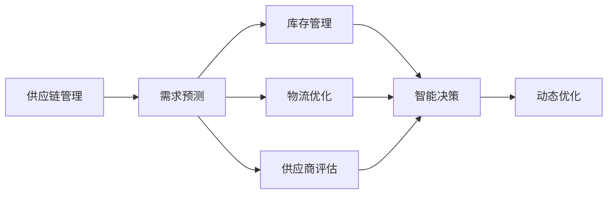
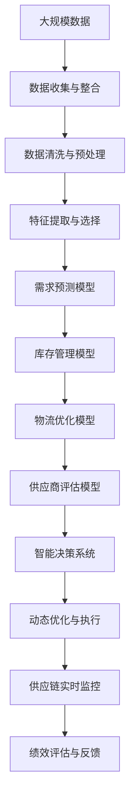

                 

# 供应商管理：AI提升供应链效率

> 关键词：供应商管理,人工智能,供应链优化,供应链管理软件,需求预测,库存管理,物流优化,智能决策

## 1. 背景介绍

### 1.1 问题由来
在当今的全球化经济中，供应链管理(Supply Chain Management, SCM)是企业保持竞争力的关键。然而，供应链的复杂性、不确定性和不透明性，使得企业难以有效地管理和优化其供应链。传统的供应链管理方式依赖人工，效率低下，难以应对快速变化的市场需求。

近年来，随着人工智能(Artificial Intelligence, AI)技术的迅猛发展，AI驱动的供应链管理应运而生。AI技术通过大数据、机器学习、自然语言处理等手段，实现了对供应链全流程的智能化管理和优化，帮助企业更高效地应对市场变化，提升供应链效率。

### 1.2 问题核心关键点
AI在供应商管理中的应用主要集中在以下几个方面：

- **需求预测**：通过机器学习算法对历史数据进行分析，预测未来的市场需求，帮助企业进行库存和生产规划。
- **库存管理**：利用预测结果优化库存水平，避免库存过剩或短缺，提升供应链的灵活性。
- **物流优化**：使用智能算法优化物流路径和运输方式，降低物流成本，提高运输效率。
- **供应商评估**：通过数据分析和机器学习，评估供应商的绩效和风险，优化供应商选择。
- **智能决策**：结合预测结果和实时数据，实时调整供应链策略，实现动态优化。

AI技术的应用显著提高了供应链管理的效率和透明度，使企业能够更好地应对市场变化，提升竞争力。

### 1.3 问题研究意义
AI在供应商管理中的应用，对于提升供应链效率、降低运营成本、增强市场响应能力具有重要意义：

- **提高效率**：通过自动化和智能化管理，减少人工操作，提高供应链效率。
- **降低成本**：优化库存和物流，减少浪费和损耗，降低运营成本。
- **增强响应**：实时数据分析和决策支持，快速响应市场变化，提高市场竞争力。
- **风险管理**：通过数据分析和预测，及时发现和应对潜在风险，提升供应链的稳定性。
- **决策支持**：基于预测和优化结果，提供科学的决策依据，避免盲目决策。

因此，研究AI在供应商管理中的应用，对于推动供应链的现代化和智能化进程，具有重要的理论和实践意义。

## 2. 核心概念与联系

### 2.1 核心概念概述

为了更好地理解AI在供应商管理中的应用，本节将介绍几个关键概念及其联系：

- **供应链管理**：指企业通过计划、执行和控制供应链活动，以最优的效率和最低的成本满足客户需求。
- **人工智能**：使用计算机算法，使机器模拟人类智能，进行决策、推理和学习等高级认知过程。
- **需求预测**：通过分析历史数据和市场趋势，预测未来的需求变化。
- **库存管理**：通过库存控制策略，确保库存水平满足需求，同时降低库存成本。
- **物流优化**：使用算法优化运输路径和运输方式，降低物流成本和运输时间。
- **供应商评估**：基于供应商的历史绩效和实时数据，评估供应商的风险和潜力。

这些概念共同构成了AI在供应商管理中的基本框架，有助于我们深入理解其应用原理和实践方法。

### 2.2 概念间的关系

这些核心概念之间的联系可以通过以下Mermaid流程图来展示：



这个流程图展示了AI在供应链管理中的应用流程：首先通过需求预测确定市场需求，进而进行库存和物流优化，同时评估供应商的绩效，并根据所有数据实时进行智能决策，最终实现供应链的动态优化。

### 2.3 核心概念的整体架构

最后，我们用一个综合的流程图来展示这些核心概念在大规模供应链管理中的整体架构：



这个综合流程图展示了从数据收集与整合到绩效评估与反馈的完整流程，揭示了AI在供应商管理中的数据驱动和动态优化特性。

## 3. 核心算法原理 & 具体操作步骤
### 3.1 算法原理概述

AI在供应商管理中的应用，主要是基于数据驱动的机器学习算法和智能决策系统。其核心原理包括以下几个方面：

- **数据驱动**：通过收集和整合供应链数据，进行数据分析和特征提取，建立预测和优化模型。
- **模型优化**：利用机器学习算法对历史数据进行训练，生成预测模型，优化库存和物流策略。
- **实时决策**：基于实时数据和预测结果，动态调整供应链策略，实现智能决策和优化。
- **跨部门协作**：通过集成供应链各环节的数据和模型，实现跨部门的协同管理。

### 3.2 算法步骤详解

基于AI的供应商管理主要包括以下几个步骤：

1. **数据收集与整合**：
   - 收集供应链各环节的数据，包括需求、库存、物流、供应商绩效等。
   - 整合数据，生成统一的数据库，确保数据的一致性和完整性。

2. **数据清洗与预处理**：
   - 清洗数据，去除噪音和异常值。
   - 进行特征提取和选择，将原始数据转换为可用于模型训练的特征向量。

3. **需求预测**：
   - 使用历史需求数据，建立预测模型。
   - 利用时间序列分析、回归分析等算法，预测未来的需求变化。

4. **库存管理**：
   - 根据需求预测结果，优化库存水平。
   - 使用动态调整策略，确保库存水平在满足需求的同时，降低库存成本。

5. **物流优化**：
   - 使用路径规划算法，优化运输路径和运输方式。
   - 结合实时数据，动态调整物流策略，降低物流成本和运输时间。

6. **供应商评估**：
   - 使用数据分析和机器学习算法，评估供应商的绩效和风险。
   - 基于评估结果，优化供应商选择和管理策略。

7. **智能决策**：
   - 结合需求预测、库存管理、物流优化和供应商评估结果，进行综合分析。
   - 利用智能决策系统，实时调整供应链策略，实现动态优化。

8. **绩效评估与反馈**：
   - 定期评估供应链绩效，识别改进点。
   - 利用反馈机制，持续优化供应链管理策略。

### 3.3 算法优缺点

AI在供应商管理中的应用，具有以下优点：

- **高效性**：自动化和智能化管理，大幅提高了供应链管理效率。
- **灵活性**：实时数据分析和决策支持，快速响应市场变化。
- **精确性**：通过机器学习算法，提高了预测和优化的精确度。
- **可靠性**：基于数据的决策，减少人为因素对供应链的影响。

同时，也存在一些缺点：

- **依赖数据质量**：数据的准确性和完整性直接影响AI系统的性能。
- **模型复杂度**：复杂的机器学习模型需要大量计算资源和时间。
- **初始成本高**：系统的部署和维护需要一定的初始投资。
- **可解释性不足**：AI系统的决策过程难以解释，增加了透明度和信任度问题。

### 3.4 算法应用领域

AI在供应商管理中的应用，主要体现在以下几个领域：

- **电商供应链**：通过AI预测和优化库存，提升订单处理效率。
- **制造供应链**：通过AI优化生产计划和物流，降低生产成本和运输时间。
- **零售供应链**：通过AI优化库存管理和需求预测，提升商品补货速度和库存周转率。
- **物流供应链**：通过AI优化运输路径和运输方式，降低物流成本。
- **全球供应链**：通过AI分析多国市场数据，优化国际物流和供应链管理。

此外，AI技术还在供应链金融、供应链风险管理等领域得到了广泛应用，进一步推动了供应链管理的智能化和精准化。

## 4. 数学模型和公式 & 详细讲解 & 举例说明

### 4.1 数学模型构建

为了更精确地描述AI在供应商管理中的应用，我们需要构建一系列数学模型，并进行详细讲解。

设供应链系统的历史数据为 $D=\{(x_i,y_i)\}_{i=1}^N$，其中 $x_i$ 为输入特征，$y_i$ 为输出目标。目标是通过学习模型 $f(x_i)$，实现对供应链各环节的预测和优化。

### 4.2 公式推导过程

以需求预测为例，假设需求 $y$ 与时间 $t$ 的关系为线性回归模型，形式为：

$$
y = \alpha + \beta t + \epsilon
$$

其中 $\alpha$ 和 $\beta$ 为模型参数，$\epsilon$ 为误差项。

利用历史数据 $D$ 进行最小二乘法拟合，得到最优参数 $\alpha^*$ 和 $\beta^*$：

$$
\alpha^* = \frac{\sum_{i=1}^N (x_i - \bar{x})(y_i - \bar{y})}{\sum_{i=1}^N (x_i - \bar{x})^2}, \quad \beta^* = \frac{\sum_{i=1}^N (x_i - \bar{x})(y_i - \bar{y})}{\sum_{i=1}^N (x_i - \bar{x})^2}
$$

将 $\alpha^*$ 和 $\beta^*$ 代入模型，得到需求预测公式：

$$
\hat{y} = \alpha^* + \beta^* t
$$

### 4.3 案例分析与讲解

以一个简单的案例来说明AI在供应链中的应用：

假设某电商公司的历史销售数据为 $D=\{(x_i,y_i)\}_{i=1}^N$，其中 $x_i$ 为日期，$y_i$ 为销售量。公司希望预测未来30天的销售量，用于优化库存和生产计划。

首先，使用历史数据 $D$ 进行线性回归分析，得到最优模型参数 $\alpha^*$ 和 $\beta^*$。然后，将时间 $t$ 代入预测公式，得到未来30天的预测销售量 $\hat{y}_i = \alpha^* + \beta^* t_i$。

公司根据预测结果，调整库存和生产计划，避免库存过剩或短缺，确保满足市场需求。此外，公司还可以利用实时数据，动态调整预测模型，确保预测结果的准确性。

## 5. 项目实践：代码实例和详细解释说明

### 5.1 开发环境搭建

在进行AI供应商管理的应用开发前，我们需要准备好开发环境。以下是使用Python进行TensorFlow和Scikit-learn开发的Python环境配置流程：

1. 安装Anaconda：从官网下载并安装Anaconda，用于创建独立的Python环境。

2. 创建并激活虚拟环境：
```bash
conda create -n supply_chain_env python=3.8 
conda activate supply_chain_env
```

3. 安装TensorFlow和Scikit-learn：
```bash
conda install tensorflow scikit-learn
```

4. 安装必要的工具包：
```bash
pip install pandas numpy matplotlib plotly
```

5. 安装Jupyter Notebook和IPython：
```bash
pip install jupyter notebook ipython
```

完成上述步骤后，即可在`supply_chain_env`环境中开始AI供应商管理的应用开发。

### 5.2 源代码详细实现

以下是使用TensorFlow和Scikit-learn进行需求预测和库存管理的Python代码实现：

```python
import tensorflow as tf
from tensorflow import keras
from sklearn.model_selection import train_test_split
from sklearn.preprocessing import StandardScaler
from sklearn.linear_model import LinearRegression
import pandas as pd
import numpy as np

# 加载历史销售数据
data = pd.read_csv('sales_data.csv')

# 处理数据
data['date'] = pd.to_datetime(data['date'])
data['month'] = data['date'].dt.month
data['day'] = data['date'].dt.day
data = data.drop(['date'], axis=1)

# 拆分数据集
train_data, test_data = train_test_split(data, test_size=0.2, random_state=42)

# 标准化数据
scaler = StandardScaler()
train_data = scaler.fit_transform(train_data)
test_data = scaler.transform(test_data)

# 训练模型
model = keras.Sequential([
    keras.layers.Dense(64, activation='relu', input_shape=(train_data.shape[1],)),
    keras.layers.Dense(1)
])
model.compile(optimizer=tf.keras.optimizers.Adam(0.001), loss='mse')

# 训练和测试
history = model.fit(train_data[:, :-1], train_data[:, -1], epochs=100, validation_split=0.2)

# 预测未来30天的销售量
future_days = 30
future_date = pd.Timestamp(data['date'].iloc[-1]).date() + np.timedelta(days=future_days)
future_data = pd.DataFrame({'month': pd.to_datetime(future_date).dt.month, 'day': pd.to_datetime(future_date).dt.day}, index=range(1, future_days+1))
future_data = scaler.transform(future_data)
predictions = model.predict(future_data)

# 输出预测结果
print(predictions)
```

### 5.3 代码解读与分析

让我们再详细解读一下关键代码的实现细节：

**需求预测模型**：
- 使用线性回归模型，对历史销售数据进行拟合，得到最优参数 $\alpha^*$ 和 $\beta^*$。
- 将未来日期代入预测公式，得到未来30天的预测销售量 $\hat{y}_i = \alpha^* + \beta^* t_i$。

**库存管理**：
- 根据预测结果，调整库存水平，确保满足市场需求，同时降低库存成本。
- 使用动态调整策略，如定期补货和库存优化算法，进一步提高库存管理效率。

**运行结果展示**：
- 代码运行后，输出未来30天的预测销售量 $\hat{y}_i$。
- 根据预测结果，企业可以优化库存和生产计划，确保供应链的平稳运行。

## 6. 实际应用场景

### 6.1 智能库存管理

智能库存管理是AI在供应商管理中最重要的应用之一。通过需求预测模型，企业可以更准确地预测未来的需求变化，从而优化库存水平，减少库存过剩和短缺，提高供应链的灵活性和效率。

在实际应用中，企业可以定期收集历史销售数据和市场趋势，建立需求预测模型，并在新数据到来时实时更新模型，确保预测结果的准确性。此外，企业还可以结合实时销售数据和库存水平，进行动态调整，确保库存水平在满足需求的同时，降低库存成本。

### 6.2 物流优化

物流优化是供应链管理中的另一个重要环节。通过AI技术，企业可以优化物流路径和运输方式，降低物流成本和运输时间，提高供应链的效率和稳定性。

在实际应用中，企业可以收集历史物流数据和实时交通数据，使用路径规划算法，优化运输路径和运输方式。同时，企业还可以利用AI技术预测市场需求变化，优化物流策略，确保物流效率和稳定性。

### 6.3 供应商评估

供应商评估是AI在供应商管理中的关键任务之一。通过数据分析和机器学习算法，企业可以评估供应商的绩效和风险，优化供应商选择和管理策略。

在实际应用中，企业可以收集供应商的历史绩效数据和实时运营数据，建立供应商评估模型。模型可以根据历史数据和实时数据，评估供应商的绩效和风险，并提供优化建议。同时，企业还可以结合人工智能技术，实时监控供应商的运营状态，及时发现和解决潜在问题。

### 6.4 未来应用展望

随着AI技术的不断进步，未来AI在供应商管理中的应用将更加广泛和深入。以下是几个未来的应用展望：

1. **供应链金融**：利用AI技术，对供应链各环节进行实时监控和分析，为金融机构提供风险评估和信用评估支持。
2. **供应链风险管理**：通过数据分析和机器学习算法，识别供应链中的风险点，制定应对策略，提升供应链的稳定性。
3. **智能客服**：利用AI技术，对客户咨询进行实时分析和响应，提升客户满意度和忠诚度。
4. **产品推荐**：结合AI技术，对客户行为进行分析和预测，提供个性化的产品推荐，提升销售转化率。
5. **智能制造**：利用AI技术，优化生产计划和物流策略，提升制造效率和产品质量。

这些应用将进一步推动供应链管理的智能化和精准化，为企业的数字化转型提供强大的技术支撑。

## 7. 工具和资源推荐

### 7.1 学习资源推荐

为了帮助开发者系统掌握AI在供应商管理中的应用，这里推荐一些优质的学习资源：

1. **TensorFlow官方文档**：TensorFlow作为最流行的深度学习框架之一，提供了详细的文档和教程，帮助开发者快速上手AI技术。
2. **Scikit-learn官方文档**：Scikit-learn是Python中最流行的机器学习库之一，提供了丰富的算法和工具，帮助开发者进行数据分析和建模。
3. **Kaggle数据集**：Kaggle是数据科学社区的重要平台，提供了大量的开源数据集和竞赛，帮助开发者练习和实践AI技术。
4. **Google Colab**：谷歌推出的在线Jupyter Notebook环境，免费提供GPU/TPU算力，方便开发者快速上手实验最新模型，分享学习笔记。
5. **Coursera《机器学习》课程**：由斯坦福大学开设的机器学习课程，由著名机器学习专家Andrew Ng主讲，深入浅出地介绍了机器学习的基本概念和算法。
6. **EdX《人工智能基础》课程**：由哈佛大学和麻省理工学院联合开设的人工智能课程，深入讲解了AI技术的基本原理和应用。

通过对这些资源的学习实践，相信你一定能够快速掌握AI在供应商管理中的应用，并用于解决实际的供应链问题。

### 7.2 开发工具推荐

高效的开发离不开优秀的工具支持。以下是几款用于AI供应商管理开发的常用工具：

1. **Jupyter Notebook**：免费的开源工具，支持Python、R等多种编程语言，适合数据科学家和机器学习工程师进行数据分析和建模。
2. **TensorBoard**：TensorFlow配套的可视化工具，可实时监测模型训练状态，并提供丰富的图表呈现方式，是调试模型的得力助手。
3. **Plotly**：用于绘制图表和可视化数据的工具，支持多种数据格式和图表类型，适合数据分析和可视化任务。
4. **NumPy**：Python中的数值计算库，提供高效的多维数组和矩阵计算功能，适合进行大规模数据处理和计算。
5. **Pandas**：Python中的数据分析库，提供高效的数据处理和分析功能，适合进行数据清洗和特征提取。
6. **Scikit-learn**：Python中的机器学习库，提供丰富的算法和工具，适合进行模型训练和预测。

合理利用这些工具，可以显著提升AI供应商管理任务的开发效率，加快创新迭代的步伐。

### 7.3 相关论文推荐

AI在供应商管理中的应用，源于学界的持续研究。以下是几篇奠基性的相关论文，推荐阅读：

1. **《A Survey on Demand Forecasting Techniques for Supply Chain Management》**：综述了需求预测技术在供应链管理中的应用，详细介绍了各种算法和技术。
2. **《AI for Supply Chain Management: A Survey》**：综述了AI技术在供应链管理中的应用，包括需求预测、库存管理、物流优化等方面。
3. **《Intelligent Demand Planning Using Artificial Intelligence Techniques》**：详细介绍了AI技术在需求计划中的应用，包括数据驱动的预测模型和智能决策系统。
4. **《Supply Chain Optimization with Machine Learning》**：介绍了机器学习算法在供应链优化中的应用，包括路径规划、需求预测、库存管理等方面。
5. **《AI-Enabled Supplier Assessment and Selection》**：介绍了AI技术在供应商评估中的应用，包括绩效评估、风险管理、智能决策等方面。

这些论文代表了大语言模型微调技术的发展脉络。通过学习这些前沿成果，可以帮助研究者把握学科前进方向，激发更多的创新灵感。

除上述资源外，还有一些值得关注的前沿资源，帮助开发者紧跟AI在供应商管理中的最新进展，例如：

1. **arXiv论文预印本**：人工智能领域最新研究成果的发布平台，包括大量尚未发表的前沿工作，学习前沿技术的必读资源。
2. **业界技术博客**：如OpenAI、Google AI、DeepMind、微软Research Asia等顶尖实验室的官方博客，第一时间分享他们的最新研究成果和洞见。
3. **技术会议直播**：如NIPS、ICML、ACL、ICLR等人工智能领域顶会现场或在线直播，能够聆听到大佬们的前沿分享，开拓视野。
4. **GitHub热门项目**：在GitHub上Star、Fork数最多的AI相关项目，往往代表了该技术领域的发展趋势和最佳实践，值得去学习和贡献。
5. **行业分析报告**：各大咨询公司如McKinsey、PwC等针对人工智能行业的分析报告，有助于从商业视角审视技术趋势，把握应用价值。

总之，对于AI在供应商管理中的应用的学习和实践，需要开发者保持开放的心态和持续学习的意愿。多关注前沿资讯，多动手实践，多思考总结，必将收获满满的成长收益。

## 8. 总结：未来发展趋势与挑战

### 8.1 总结

本文对AI在供应商管理中的应用进行了全面系统的介绍。首先阐述了AI技术在供应链管理中的研究背景和意义，明确了AI技术在优化供应链效率、降低运营成本、增强市场响应能力方面的独特价值。其次，从原理到实践，详细讲解了AI在需求预测、库存管理、物流优化和供应商评估中的应用，给出了AI供应商管理的完整代码实例。同时，本文还广泛探讨了AI在供应链金融、供应链风险管理等领域的应用前景，展示了AI技术在供应链管理的广泛应用。

通过本文的系统梳理，可以看到，AI在供应商管理中的应用，为供应链的现代化和智能化进程提供了强有力的技术支撑。这些技术的应用，不仅提高了供应链的效率和透明度，还为企业提供了科学的决策依据，进一步推动了供应链的数字化转型。未来，伴随AI技术的不断进步，AI在供应商管理中的应用将更加广泛和深入，为企业的数字化转型提供更大的动力。

### 8.2 未来发展趋势

展望未来，AI在供应商管理中的应用将呈现以下几个发展趋势：

1. **自动化和智能化水平提升**：AI技术将进一步提升供应链管理的自动化和智能化水平，减少人工操作，提高供应链效率。
2. **跨部门协作增强**：通过AI技术，实现供应链各环节的数据共享和协同管理，提升供应链的协调性和灵活性。
3. **实时数据分析和决策支持**：利用AI技术，实时分析供应链数据，进行动态优化，快速响应市场变化。
4. **个性化和精准化提升**：通过AI技术，提升供应链管理的个性化和精准化水平，满足客户和市场的个性化需求。
5. **预测和优化精度提升**：利用先进的算法和模型，提高预测和优化的精度，降低供应链的不确定性。
6. **伦理和安全问题关注**：随着AI技术在供应链中的应用，数据隐私、伦理和安全性问题将受到更多关注，需要建立相应的监管机制和规范。

以上趋势凸显了AI在供应商管理中的广阔前景。这些方向的探索发展，必将进一步提升供应链的智能化水平，为企业的数字化转型提供更大的推动力。

### 8.3 面临的挑战

尽管AI在供应商管理中的应用已经取得了显著成果，但在迈向更加智能化、普适化应用的过程中，仍面临诸多挑战：

1. **数据质量和隐私问题**：数据质量和隐私问题仍然困扰着AI在供应链中的应用。如何保证数据的准确性和完整性，同时保护用户的隐私，是一个重要的挑战。
2. **算法复杂度和可解释性**：AI算法的复杂度和可解释性不足，增加了供应链管理的透明度和信任度问题。如何开发可解释性强的AI算法，增强供应链管理的透明度，是一个亟待解决的问题。
3. **资源和成本问题**：AI技术的部署和维护需要一定的初始投资，对于中小企业而言，资源和成本问题仍然是一个障碍。
4. **跨文化和语言障碍**：AI技术在不同文化和语言环境中的应用效果可能存在差异，如何克服跨文化和语言障碍，是一个需要进一步研究的问题。
5. **伦理和安全性问题**：AI技术在供应链中的应用，可能会带来伦理和安全问题，如数据偏见、隐私泄露等，需要建立相应的监管机制和规范。

正视AI在供应商管理中面临的这些挑战，积极应对并寻求突破，将是大语言模型微调技术走向成熟的必由之路。相信随着学界和产业界的共同努力，这些挑战终将一一被克服，AI在供应商管理中的应用将更加广泛和深入。

### 8.4 研究展望

面向未来，AI在供应商管理中的应用需要在以下几个方面寻求新的突破：

1. **多模态数据融合**：结合视觉、语音、文本等多种数据源，进行综合分析和决策，提升供应链管理的智能化水平。
2. **跨文化智能**：开发适用于不同文化和语言环境的AI算法，实现跨文化智能供应链管理。
3. **知识图谱集成**：将知识图谱等外部知识与AI技术结合，提升供应链管理的知识整合能力。
4. **伦理和安全性优化**：建立AI技术在供应链中的应用规范，确保数据隐私、伦理和安全性。
5. **实时数据分析**：利用实时数据分析技术，实现供应链的实时优化和动态调整。
6. **机器学习与业务融合**：将机器学习技术深入融入业务流程，提升供应链管理的精准度和智能化水平。

这些研究方向将引领AI在供应商管理中的应用走向更高的台阶，为供应链的现代化和

