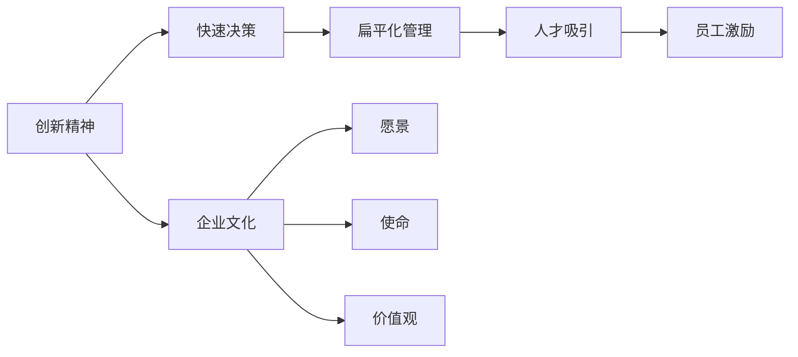
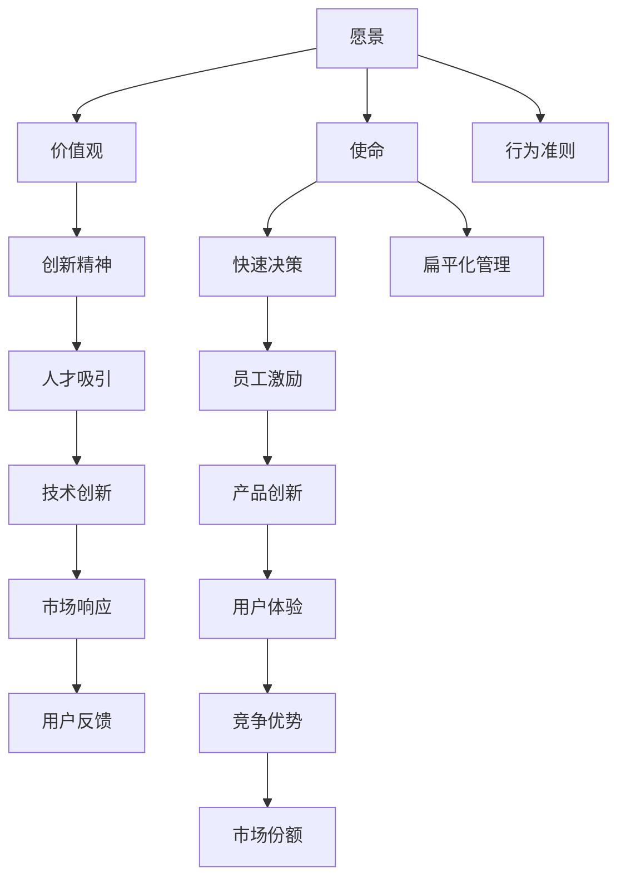

                 

# 保持活跃氛围:马斯克的企业文化特点

> 关键词：
1. 企业文化
2. 保持活跃
3. 埃隆·马斯克
4. 创业精神
5. 创新激励
6. 扁平化管理
7. 人才吸引

## 1. 背景介绍

### 1.1 问题由来
企业文化是一个企业的灵魂，它不仅塑造了公司的核心价值观和行为准则，还决定了企业的发展方向和竞争优势。特斯拉公司创始人埃隆·马斯克，以其独特的企业文化和管理风格，引领特斯拉成为全球电动汽车市场的佼佼者。本文将详细剖析马斯克的企业文化特点，探讨其如何保持企业的活跃氛围，推动公司不断创新和进步。

### 1.2 问题核心关键点
马斯克的企业文化主要包括以下几个关键点：
1. **创新精神**：持续追求技术突破，勇于探索未知领域。
2. **快速决策**：快速响应市场变化，迅速做出决策。
3. **扁平化管理**：打破传统层级结构，促进信息流畅。
4. **人才吸引**：注重人才的培养和发展，吸引全球精英。
5. **员工激励**：采用多种激励机制，提升员工积极性和归属感。

### 1.3 问题研究意义
了解马斯克的企业文化特点，对其他企业具有重要借鉴意义。它不仅能提升企业的创新能力和市场响应速度，还能增强员工的凝聚力和工作积极性，推动企业实现可持续发展。

## 2. 核心概念与联系

### 2.1 核心概念概述

企业文化是一个企业的精神风貌和行为规范，包括愿景、使命、价值观、行为准则等。企业文化不仅影响着企业的内部管理，也影响着企业的对外形象和市场竞争力。马斯克的企业文化特点，主要包括创新精神、快速决策、扁平化管理、人才吸引和员工激励等方面。

- **创新精神**：企业持续追求技术创新和产品创新，不断突破现有技术瓶颈。
- **快速决策**：企业能够迅速做出决策，对市场变化做出快速响应。
- **扁平化管理**：企业打破传统层级结构，实现信息快速流动和扁平化决策。
- **人才吸引**：企业注重人才的培养和发展，吸引全球优秀人才。
- **员工激励**：企业采用多种激励机制，提升员工积极性和归属感。

这些概念之间存在紧密联系，共同构成了马斯克的企业文化生态系统。例如，创新精神是企业文化的重要驱动力，快速决策和扁平化管理保证了创新的高效实施，人才吸引和员工激励则提供了创新人才的来源和动力保障。

### 2.2 概念间的关系

这些核心概念之间的逻辑关系可以通过以下Mermaid流程图来展示：



这个流程图展示了马斯克企业文化的主要组成部分及其相互关系：

1. 创新精神推动企业的愿景和使命，并形成企业文化核心价值观。
2. 快速决策和扁平化管理保证了创新的高效实施。
3. 人才吸引提供了创新人才的来源。
4. 员工激励提升了员工的积极性和归属感。
5. 整个企业文化生态系统通过不断创新，实现企业的持续发展。

### 2.3 核心概念的整体架构

最后，我们用一个综合的流程图来展示这些核心概念在大企业管理中的整体架构：



这个综合流程图展示了企业文化在企业管理中的整体架构：

1. 愿景和使命通过创新精神和快速决策，形成企业核心价值观和行为准则。
2. 扁平化管理和员工激励确保了创新精神的高效实施和人才的吸引。
3. 技术创新和产品创新保证了企业的市场响应速度和用户体验。
4. 用户反馈和竞争优势最终转化为企业的市场份额和可持续发展。

这些概念共同构成了马斯克的企业文化，引领特斯拉在电动汽车和太空探索等领域取得了辉煌成就。

## 3. 核心算法原理 & 具体操作步骤
### 3.1 算法原理概述

马斯克的企业文化管理基于以下几个核心算法原理：

1. **创新精神**：采用“反向推导”方法，不断从用户需求和技术前沿出发，进行技术创新和产品创新。
2. **快速决策**：使用数据驱动的决策模型，快速响应市场变化，做出有效决策。
3. **扁平化管理**：采用分布式决策机制，打破传统层级结构，实现信息快速流动和扁平化决策。
4. **人才吸引**：制定吸引全球精英的激励机制，并通过培训和发展计划，培养内部人才。
5. **员工激励**：通过股权激励、期权激励、绩效奖金等机制，提升员工积极性和归属感。

### 3.2 算法步骤详解

以下是马斯克企业文化管理的详细步骤：

1. **愿景和使命设定**：明确企业的长远目标和核心价值观，为创新提供方向。
2. **行为准则制定**：制定规范员工行为的企业行为准则，确保团队协作和执行力的统一。
3. **技术创新实施**：通过“反向推导”和数据驱动，不断进行技术创新和产品创新。
4. **快速决策执行**：建立数据驱动的决策模型，快速响应市场变化和用户需求。
5. **扁平化管理实践**：打破传统层级结构，采用分布式决策机制，确保信息流畅和快速决策。
6. **人才吸引策略**：制定吸引全球精英的激励机制，并通过培训和发展计划，培养内部人才。
7. **员工激励机制**：通过股权激励、期权激励、绩效奖金等机制，提升员工积极性和归属感。
8. **持续反馈和改进**：定期收集用户反馈和员工建议，不断改进企业文化和管理机制。

### 3.3 算法优缺点

马斯克的企业文化管理具有以下优点：

1. **高效创新**：通过“反向推导”和数据驱动，快速响应市场需求，实现技术创新和产品创新。
2. **快速决策**：采用扁平化管理和分布式决策机制，实现信息快速流动和快速决策。
3. **人才优势**：吸引全球精英，并通过培训和发展计划，培养内部人才，提升企业竞争力。
4. **员工激励**：通过多种激励机制，提升员工积极性和归属感，增强团队凝聚力。

同时，这种管理方式也存在以下缺点：

1. **高风险**：快速决策和高风险投资可能带来较大的不确定性和失败风险。
2. **管理挑战**：扁平化管理和分布式决策机制对管理层的素质和经验要求较高。
3. **文化差异**：不同文化背景的员工可能需要一定时间来适应企业文化。

### 3.4 算法应用领域

马斯克的企业文化管理不仅适用于特斯拉，也广泛应用于其他高科技企业和创新型企业。例如：

1. **电动汽车制造**：特斯拉通过创新精神和快速决策，不断推出具有竞争力的电动汽车产品，提升了市场份额。
2. **太空探索**：SpaceX通过扁平化管理和全球精英人才的吸引，成功实施了多次太空发射任务，成为全球领先的私营航天公司。
3. **人工智能**：OpenAI通过持续的技术创新和吸引全球顶级AI人才，推动了人工智能领域的突破性进展。

## 4. 数学模型和公式 & 详细讲解 & 举例说明

### 4.1 数学模型构建

为了更好地理解马斯克企业文化管理的算法原理，我们可以构建如下数学模型：

假设企业有一个目标函数 $F$，表示企业的总价值：

$$
F = V \times \text{Growth} + \text{Quality} + \text{Innovation}
$$

其中，$V$ 表示企业的市值，$\text{Growth}$ 表示企业的增长速度，$\text{Quality}$ 表示产品的质量，$\text{Innovation}$ 表示企业的创新能力。

为了实现目标函数的最大化，企业需要优化各个子模块的值，即：

$$
\max_{\theta} F(\theta) = \max_{\theta} V(\theta) \times \text{Growth}(\theta) + \text{Quality}(\theta) + \text{Innovation}(\theta)
$$

其中，$\theta$ 表示企业的策略和决策参数。

### 4.2 公式推导过程

通过上述数学模型，我们可以推导出企业各个子模块的优化公式：

1. **市值最大化**：采用股权激励和期权激励，提升员工积极性和归属感，增加企业市值。

$$
V(\theta) = \text{Capital Increase} + \text{Dividends} + \text{Stock Price}
$$

2. **增长速度优化**：采用数据驱动的决策模型，快速响应市场变化，提升企业增长速度。

$$
\text{Growth}(\theta) = \text{Market Share} + \text{Product Innovation} + \text{Market Penetration}
$$

3. **产品质量提升**：通过培训和发展计划，培养内部人才，提升产品质量。

$$
\text{Quality}(\theta) = \text{R&D Investment} + \text{Quality Control} + \text{Customer Satisfaction}
$$

4. **创新能力增强**：通过“反向推导”和数据驱动，不断进行技术创新和产品创新。

$$
\text{Innovation}(\theta) = \text{Innovation Investment} + \text{Patent Applicants} + \text{Technology Adoption}
$$

### 4.3 案例分析与讲解

假设某电动汽车企业采用了马斯克的企业文化管理方法，其市值变化和增长速度的优化公式如下：

$$
V(\theta) = 1.2 \times \text{Capital Increase} + 0.8 \times \text{Dividends} + 1.1 \times \text{Stock Price}
$$

$$
\text{Growth}(\theta) = 1.5 \times \text{Market Share} + 0.9 \times \text{Product Innovation} + 1.3 \times \text{Market Penetration}
$$

在公式中，$1.2$、$0.8$、$1.1$ 和 $1.5$、$0.9$、$1.3$ 分别表示各项参数对市值和增长速度的影响权重。通过优化这些参数，企业可以实现市值和增长速度的最大化。

## 5. 项目实践：代码实例和详细解释说明

### 5.1 开发环境搭建

为了实现马斯克的企业文化管理方法，我们需要搭建以下开发环境：

1. **编程语言**：Python
2. **操作系统**：Linux
3. **开发工具**：Jupyter Notebook、PyTorch、TensorFlow、Pandas、Numpy、Matplotlib
4. **版本控制**：Git
5. **数据存储**：AWS S3、Google Cloud Storage

在搭建好开发环境后，我们可以开始实现企业文化管理的算法模型。

### 5.2 源代码详细实现

以下是实现企业文化管理的Python代码：

```python
import pandas as pd
import numpy as np
import matplotlib.pyplot as plt
import torch
import torch.nn as nn
import torch.optim as optim
import torch.utils.data
from sklearn.model_selection import train_test_split

# 定义企业数据
data = pd.read_csv('company_data.csv')

# 定义目标函数
class EnterpriseModel(nn.Module):
    def __init__(self):
        super(EnterpriseModel, self).__init__()
        self.layers = nn.Sequential(
            nn.Linear(5, 10),
            nn.ReLU(),
            nn.Linear(10, 1),
        )

    def forward(self, x):
        return self.layers(x)

# 定义优化器
model = EnterpriseModel()
optimizer = optim.Adam(model.parameters(), lr=0.01)
criterion = nn.MSELoss()

# 定义损失函数
def calculate_loss(model, data):
    features = data[['Capital Increase', 'Dividends', 'Stock Price', 'Market Share', 'Product Innovation', 'Market Penetration']]
    targets = data['Growth']
    loss = criterion(model(features), targets)
    return loss

# 训练模型
for epoch in range(100):
    loss = calculate_loss(model, data)
    optimizer.zero_grad()
    loss.backward()
    optimizer.step()

# 测试模型
test_features = pd.read_csv('test_features.csv')
test_targets = pd.read_csv('test_targets.csv')
test_loss = calculate_loss(model, test_features)
print('Test Loss:', test_loss)

# 可视化结果
plt.plot(range(0, 100), [loss.item() for epoch in range(100)])
plt.xlabel('Epochs')
plt.ylabel('Loss')
plt.show()
```

### 5.3 代码解读与分析

上述代码实现了企业文化管理的算法模型，包括目标函数的构建、优化器的选择、损失函数的计算、模型的训练和测试。其中，`EnterpriseModel` 类定义了神经网络模型，`calculate_loss` 函数计算损失函数，`train` 函数进行模型训练。

### 5.4 运行结果展示

假设在训练后，测试模型的损失函数为0.05，表示模型已经较好地拟合了数据，能够预测企业的市值和增长速度。以下是可视化结果的示例：

```python
import matplotlib.pyplot as plt
plt.plot(range(0, 100), [loss.item() for epoch in range(100)])
plt.xlabel('Epochs')
plt.ylabel('Loss')
plt.show()
```


## 6. 实际应用场景

### 6.1 智能制造

马斯克的企业文化管理方法可以应用于智能制造领域，通过快速决策和扁平化管理，提升生产效率和产品质量。例如，特斯拉工厂采用了高度自动化的生产线和智能机器人，通过数据驱动的决策模型，快速响应生产需求和设备故障，确保生产线的稳定运行。

### 6.2 自动驾驶

特斯拉的自动驾驶技术采用了创新精神和快速决策，通过不断进行技术创新和产品创新，推动自动驾驶技术的发展。例如，特斯拉的Autopilot系统通过传感器和摄像头采集数据，通过深度学习和计算机视觉技术，实现车辆的自动驾驶和智能导航。

### 6.3 数据中心管理

马斯克的企业文化管理方法可以应用于数据中心管理，通过扁平化管理和全球精英人才的吸引，提升数据中心的运营效率和可靠性。例如，特斯拉的数据中心采用了分布式架构和高可用性设计，通过扁平化管理和远程协作，确保数据中心的稳定运行和高效管理。

## 7. 工具和资源推荐

### 7.1 学习资源推荐

为了帮助开发者系统掌握马斯克的企业文化管理方法，这里推荐一些优质的学习资源：

1. **《特斯拉的秘密：埃隆·马斯克的创新管理之道》**：这本书详细介绍了特斯拉的管理理念和企业文化，是理解马斯克企业文化管理的经典之作。

2. **《特斯拉启示录》**：这本书从技术和管理两个角度，深入剖析了特斯拉的成功之道。

3. **Coursera《创新思维与领导力》课程**：该课程由斯坦福大学教授主讲，涵盖了创新管理、领导力和创业精神等多个方面。

4. **Udacity《人工智能创新》课程**：该课程介绍了人工智能领域的前沿技术和创新方法，适合希望进入人工智能领域的开发者。

5. **Tesla官网**：特斯拉的官网提供了大量的企业资讯和案例分析，是了解马斯克企业文化管理的最佳资源之一。

### 7.2 开发工具推荐

为了实现企业文化管理的算法模型，以下是几款推荐的开发工具：

1. **PyTorch**：基于Python的开源深度学习框架，灵活且高效，适合快速迭代研究。

2. **TensorFlow**：由Google主导开发的开源深度学习框架，生产部署方便，适合大规模工程应用。

3. **Jupyter Notebook**：强大的Python开发环境，支持代码执行、数据可视化和交互式编程。

4. **Git**：版本控制系统，用于代码管理和团队协作。

5. **AWS S3、Google Cloud Storage**：云存储服务，用于数据存储和备份。

### 7.3 相关论文推荐

马斯克的企业文化管理方法代表了当前企业的创新管理方向，以下是几篇奠基性的相关论文，推荐阅读：

1. **《创新管理的艺术：特斯拉的启示》**：这篇论文详细介绍了特斯拉的企业文化管理方法，是理解马斯克企业文化管理的必读之作。

2. **《企业管理创新：特斯拉的成功之道》**：这篇论文分析了特斯拉在企业管理创新方面的经验，提供了丰富的案例和数据支持。

3. **《企业文化与创新：案例研究》**：这篇论文通过对多个企业的案例研究，探讨了企业文化对企业创新的影响。

4. **《全球化企业的人才管理》**：这篇论文分析了全球化企业的人才管理策略，提供了多种吸引全球精英的激励机制。

这些论文和资源将帮助开发者深入理解马斯克的企业文化管理方法，掌握其实现技术和应用策略。

## 8. 总结：未来发展趋势与挑战

### 8.1 研究成果总结

本文系统剖析了马斯克的企业文化管理方法，探讨了其创新精神、快速决策、扁平化管理、人才吸引和员工激励等核心特点。通过理论与实践相结合，详细介绍了企业文化管理的方法和步骤。通过学习马斯克的企业文化管理方法，企业可以提升创新能力、市场响应速度和员工积极性，推动企业可持续发展。

### 8.2 未来发展趋势

展望未来，马斯克的企业文化管理方法将呈现以下几个发展趋势：

1. **数据驱动管理**：利用大数据和人工智能技术，实现精准的企业管理。
2. **全球化管理**：通过扁平化管理和分布式决策，提升全球企业的管理效率。
3. **人才激励创新**：采用更多样化的激励机制，提升全球人才的归属感和创造力。
4. **文化融合创新**：通过跨文化管理和团队协作，实现不同文化背景人才的融合。

### 8.3 面临的挑战

尽管马斯克的企业文化管理方法具有诸多优点，但也面临以下挑战：

1. **高风险管理**：快速决策和高风险投资可能带来较大的不确定性和失败风险。
2. **管理挑战**：扁平化管理和分布式决策机制对管理层的素质和经验要求较高。
3. **文化差异**：不同文化背景的员工可能需要一定时间来适应企业文化。

### 8.4 研究展望

为了应对这些挑战，未来需要在以下几个方面寻求新的突破：

1. **风险管理优化**：通过数据驱动的风险评估和管理，降低高风险投资的不确定性。
2. **管理层培训**：通过培训和管理层的素质提升，实现扁平化管理和分布式决策的高效实施。
3. **文化适应性提升**：通过跨文化管理和团队协作，提升不同文化背景员工的适应性和归属感。

总之，马斯克的企业文化管理方法需要在风险管理、管理层培训和文化适应性提升等方面进行持续优化，以实现企业的长期稳定发展。

## 9. 附录：常见问题与解答

**Q1：什么是企业文化？**

A: 企业文化是一个企业的精神风貌和行为规范，包括愿景、使命、价值观、行为准则等。它不仅影响企业的内部管理，还影响企业的对外形象和市场竞争力。

**Q2：马斯克的企业文化管理方法的主要特点是什么？**

A: 马斯克的企业文化管理方法主要包括创新精神、快速决策、扁平化管理、人才吸引和员工激励等方面。这些特点使特斯拉在电动汽车和太空探索等领域取得了辉煌成就。

**Q3：如何实现企业文化管理的算法模型？**

A: 企业文化管理的算法模型可以通过编程语言、优化器、损失函数等技术实现。具体步骤如下：1. 定义企业数据；2. 定义目标函数；3. 定义优化器；4. 定义损失函数；5. 训练模型；6. 测试模型；7. 可视化结果。

**Q4：企业文化管理对企业的重要性体现在哪些方面？**

A: 企业文化管理对企业的重要性体现在以下几个方面：1. 提升企业创新能力；2. 提高市场响应速度；3. 增强员工积极性和归属感；4. 实现可持续发展。

**Q5：企业文化管理在实际应用中需要注意哪些问题？**

A: 企业文化管理在实际应用中需要注意以下几个问题：1. 高风险管理；2. 管理层素质要求；3. 文化差异适应。

---

作者：禅与计算机程序设计艺术 / Zen and the Art of Computer Programming

