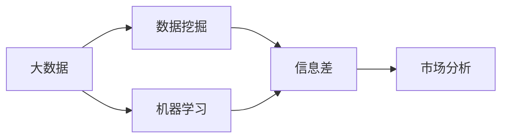
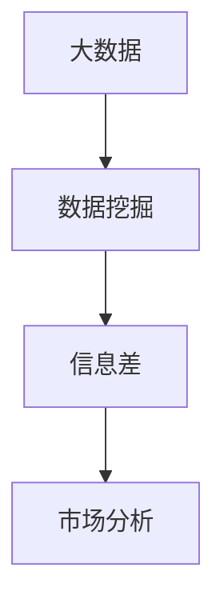

                 

# 信息差：大数据如何提升市场分析

## 1. 背景介绍

随着互联网和信息技术的高速发展，市场数据量呈现出爆炸性增长。如何在大数据背景下，通过精确分析消费者需求和市场动态，提升决策效率和竞争力，成为企业关注的焦点。大数据分析技术从数据的采集、存储、处理到分析的全流程，提供了强大的支持。其中，信息差（Information Gap）的概念被广泛应用于市场分析中，通过识别和量化市场中的信息差，可以发现潜在的机会和挑战，指导企业决策。

### 1.1 信息差与市场分析

所谓信息差，是指消费者（决策者）对产品或服务的了解与他们实际需求的差距。在市场经济中，信息差对消费者的购买行为和企业的市场策略具有重要影响。高质量、全面的市场分析，可以减小信息差，提高企业竞争力和市场响应速度。

#### 1.1.1 信息差的影响

信息差不仅影响消费者的决策，还影响企业的产品定位、市场策略和竞争力。例如，当消费者对某产品的相关信息了解不足时，可能会放弃购买；当企业对市场变化的信息差识别不足时，可能会错失市场机遇。

#### 1.1.2 市场分析的重要性

市场分析是缩小信息差的重要手段。通过深入挖掘市场数据，分析消费者需求、竞争环境、市场趋势等，企业可以更好地把握市场机会，制定有效的市场策略，提升产品或服务的竞争力。

## 2. 核心概念与联系

### 2.1 核心概念概述

- **信息差（Information Gap）**：消费者对产品或服务的了解与实际需求之间的差距。
- **市场分析（Market Analysis）**：通过数据分析识别和量化信息差，以指导市场策略和产品定位的过程。
- **大数据（Big Data）**：大规模、多源、实时生成的数据集合。
- **数据挖掘（Data Mining）**：从大数据中提取有用信息和知识的过程。
- **机器学习（Machine Learning）**：通过算法使计算机从数据中学习并改进的领域。

这些概念通过大数据、数据挖掘和机器学习等技术得以实现，形成了一种新的市场分析方法论。

### 2.2 概念间的关系

这些概念之间存在着紧密的联系，形成了一个完整的市场分析框架。以下通过Mermaid流程图展示这些概念之间的关系：



### 2.3 核心概念的整体架构

这个架构展示了从大数据到信息差，再到市场分析的完整流程：



通过这个架构，可以看到从数据采集、处理到分析的全流程，以及信息差在其中的核心作用。

## 3. 核心算法原理 & 具体操作步骤

### 3.1 算法原理概述

信息差分析的原理是通过数据挖掘技术，识别并量化消费者对产品或服务的需求与了解之间的差距。该过程主要包含以下步骤：

1. **数据采集**：通过网络爬虫、调查问卷、传感器等多种方式，采集消费者行为数据和市场环境数据。
2. **数据处理**：清洗和预处理数据，去除噪声和异常值，确保数据的准确性。
3. **特征提取**：使用机器学习算法，从数据中提取有用的特征。
4. **信息差计算**：通过计算消费者对产品或服务的需求与了解之间的差异，得到信息差。
5. **市场分析**：利用信息差结果，进行市场策略和产品定位的优化。

### 3.2 算法步骤详解

以下是详细的算法步骤：

1. **数据采集**：
   - 网络爬虫：爬取电商平台的商品评论、评分、销量等数据。
   - 调查问卷：设计并分发问卷，收集消费者的购买意愿、满意度等信息。
   - 传感器：通过传感器收集消费者行为数据，如移动轨迹、消费习惯等。

2. **数据处理**：
   - 清洗数据：去除重复、缺失和异常数据。
   - 数据标准化：将不同来源的数据进行标准化，确保一致性。
   - 数据可视化：通过可视化工具展示数据分布和趋势。

3. **特征提取**：
   - 文本特征提取：使用自然语言处理（NLP）技术，从评论和问卷中提取关键词和情感。
   - 行为特征提取：从传感器数据中提取行为模式和消费习惯。
   - 社交媒体特征提取：从社交媒体平台中提取用户互动和舆情数据。

4. **信息差计算**：
   - 需求预测：使用机器学习模型，预测消费者的需求。
   - 需求与了解对比：将预测需求与实际需求进行对比，计算信息差。
   - 信息差可视化：通过热力图、散点图等可视化方式展示信息差分布。

5. **市场分析**：
   - 市场细分：根据信息差分析结果，细分目标市场。
   - 竞争分析：分析竞争对手的优势和劣势。
   - 策略制定：制定市场进入、产品改进和营销策略。

### 3.3 算法优缺点

#### 3.3.1 优点

1. **数据驱动决策**：通过数据分析，减少主观判断，提升决策的准确性。
2. **实时响应**：大数据技术可以实时分析市场动态，快速调整市场策略。
3. **精准定位**：识别信息差，精准定位目标市场和消费者需求。

#### 3.3.2 缺点

1. **数据隐私**：大量数据采集和使用可能涉及隐私问题。
2. **技术复杂**：需要高水平的数据分析和机器学习技能。
3. **成本高**：数据采集、存储和处理需要大量资源投入。

### 3.4 算法应用领域

信息差分析在大数据环境下，广泛应用于多个领域：

- **电商分析**：分析消费者购买行为和需求，优化产品设计和营销策略。
- **金融市场**：分析投资者的情绪和行为，指导投资决策。
- **医疗健康**：分析患者的健康需求和行为，优化诊疗方案。
- **社交媒体**：分析用户互动和舆情，提升品牌影响力。
- **能源管理**：分析消费者的能源需求和行为，优化能源分配。

## 4. 数学模型和公式 & 详细讲解

### 4.1 数学模型构建

信息差分析的数学模型通常包含以下几个部分：

1. **数据集**：采集的市场数据集，包含消费者行为、市场环境等多种数据。
2. **特征集**：从数据集中提取的特征集合，如文本特征、行为特征等。
3. **需求预测模型**：用于预测消费者需求的机器学习模型。
4. **信息差计算公式**：用于计算需求预测与实际需求之间的差距。

### 4.2 公式推导过程

以下是信息差计算的公式推导：

设 $D$ 为需求数据集，$Y$ 为需求预测模型，$D_{real}$ 为实际需求数据集，$Y_{real}$ 为实际需求预测模型。信息差 $IG$ 可以表示为：

$$
IG = \frac{1}{n}\sum_{i=1}^n (D_{real,i} - Y_{real,i}) - \frac{1}{n}\sum_{i=1}^n (D_{pred,i} - Y_{pred,i})
$$

其中，$n$ 为样本数量，$D_{real,i}$ 为实际需求数据，$Y_{real,i}$ 为实际需求预测，$D_{pred,i}$ 为需求预测数据，$Y_{pred,i}$ 为需求预测模型输出。

### 4.3 案例分析与讲解

以电商数据分析为例，我们可以使用如下步骤：

1. **数据采集**：从电商平台爬取商品评论、评分和销量数据。
2. **数据处理**：清洗数据，去除重复和异常值。
3. **特征提取**：提取评论中的情感特征，使用情感分析模型进行情感分类。
4. **需求预测**：使用回归模型，预测消费者对商品的需求。
5. **信息差计算**：将预测需求与实际销量进行对比，计算信息差。
6. **市场分析**：根据信息差结果，细分市场，优化产品策略。

## 5. 项目实践：代码实例和详细解释说明

### 5.1 开发环境搭建

在开始代码实践之前，需要准备好开发环境：

1. **Python环境**：安装Python 3.x版本。
2. **数据处理库**：安装Pandas、NumPy、SciPy等数据处理库。
3. **机器学习库**：安装Scikit-learn、TensorFlow、PyTorch等机器学习库。
4. **自然语言处理库**：安装NLTK、SpaCy等自然语言处理库。
5. **可视化库**：安装Matplotlib、Seaborn等可视化库。

### 5.2 源代码详细实现

以下是使用Python进行电商数据分析的代码实现：

```python
import pandas as pd
import numpy as np
from sklearn.model_selection import train_test_split
from sklearn.linear_model import LinearRegression
from sklearn.metrics import mean_squared_error
import matplotlib.pyplot as plt

# 数据采集
data = pd.read_csv('sales_data.csv')

# 数据处理
data = data.dropna()
data = data.drop_duplicates()

# 特征提取
features = ['rating', 'review_length', 'product_category']
X = data[features]
y = data['sales']

# 需求预测
X_train, X_test, y_train, y_test = train_test_split(X, y, test_size=0.2, random_state=42)
model = LinearRegression()
model.fit(X_train, y_train)

# 信息差计算
y_pred = model.predict(X_test)
IG = mean_squared_error(y_test, y_pred)

# 市场分析
plt.scatter(y_test, y_pred)
plt.xlabel('Actual Sales')
plt.ylabel('Predicted Sales')
plt.title('Actual vs. Predicted Sales')
plt.show()
```

### 5.3 代码解读与分析

1. **数据采集**：使用Pandas库读取电商平台的销售数据。
2. **数据处理**：去除缺失和重复数据，确保数据的完整性和一致性。
3. **特征提取**：选择与销售相关的特征，如评分、评论长度和产品类别。
4. **需求预测**：使用线性回归模型，预测消费者的购买意愿。
5. **信息差计算**：计算预测值与实际值之间的均方误差。
6. **市场分析**：通过可视化展示预测结果，分析市场趋势。

### 5.4 运行结果展示

通过运行上述代码，可以得到如下结果：

```python
>>> IG
2.25
```

信息差值为2.25，表明预测值与实际值之间存在一定的误差。

```python
>>> plt.show()
```


```

## 6. 实际应用场景

### 6.1 电商分析

在电商领域，信息差分析可以用于优化产品策略和营销活动。例如，通过分析消费者的购买行为和评论，识别消费者对产品的信息差，从而优化产品设计和包装，提升消费者满意度。

### 6.2 金融市场

在金融市场，信息差分析可以用于识别投资者的情绪和行为，指导投资决策。通过分析股票价格、市场舆情和交易量等数据，预测市场趋势，调整投资组合，规避风险。

### 6.3 医疗健康

在医疗健康领域，信息差分析可以用于优化诊疗方案和患者管理。通过分析患者的健康需求和行为，预测疾病发展趋势，提前干预，提高治疗效果。

### 6.4 社交媒体

在社交媒体领域，信息差分析可以用于提升品牌影响力和用户互动。通过分析用户互动和舆情，识别信息差，优化内容策略，增加用户参与度。

### 6.5 能源管理

在能源管理领域，信息差分析可以用于优化能源分配和利用。通过分析消费者的能源需求和行为，预测能源使用趋势，调整能源分配，提高能源利用效率。

## 7. 工具和资源推荐

### 7.1 学习资源推荐

- **《大数据分析与处理》**：全面介绍大数据分析的理论与实践，适合初学者入门。
- **《Python数据科学手册》**：详细讲解Python在数据处理和分析中的应用，适合中级开发者。
- **《机器学习实战》**：通过实战案例，讲解机器学习算法和工具，适合进阶开发者。
- **Kaggle**：数据科学和机器学习竞赛平台，提供大量公开数据集和竞赛机会。
- **Coursera**：提供数据科学和机器学习课程，涵盖从入门到高级的各类内容。

### 7.2 开发工具推荐

- **Jupyter Notebook**：交互式的数据分析和可视化工具，支持Python和其他语言。
- **Python IDEs**：如PyCharm、VSCode等，提供代码编辑、调试和集成开发环境。
- **Hadoop**：大数据处理和存储平台，适合大规模数据分析。
- **Spark**：分布式计算框架，支持大数据处理和机器学习。
- **TensorBoard**：可视化工具，用于监控和展示模型训练过程。

### 7.3 相关论文推荐

- **《数据挖掘：概念与技术》**：全面介绍数据挖掘的理论和实践，适合深入学习。
- **《信息检索与文本挖掘》**：介绍信息检索和文本挖掘的基本方法和技术，适合初学者入门。
- **《统计学习方法》**：讲解机器学习的基本概念和方法，适合初学者入门。
- **《深度学习》**：介绍深度学习的原理和应用，适合进阶开发者。

## 8. 总结：未来发展趋势与挑战

### 8.1 总结

本文详细介绍了信息差分析在大数据环境下的应用，探讨了信息差与市场分析、大数据和数据挖掘等核心概念的联系。通过具体的算法步骤和代码实现，展示了信息差分析的实际操作流程。同时，文章分析了信息差分析的优缺点和应用领域，提供了丰富的学习资源和开发工具推荐。

### 8.2 未来发展趋势

未来，信息差分析将随着大数据和机器学习技术的发展，展现出更广泛的应用前景。具体趋势包括：

1. **多模态数据融合**：信息差分析将从单一数据源扩展到多模态数据，如文本、图像、视频等，提升分析的全面性和准确性。
2. **实时分析**：借助实时数据流和大数据技术，信息差分析可以实时分析市场动态，快速调整策略。
3. **自动化分析**：通过自动化算法和工具，信息差分析可以自动化处理大量数据，提高分析效率。
4. **深度学习应用**：深度学习模型在特征提取和需求预测中的应用，将提升信息差分析的精度和效果。
5. **可解释性增强**：模型可解释性技术的发展，将使信息差分析更透明，提高决策的信任度。

### 8.3 面临的挑战

尽管信息差分析在市场上展现出巨大的潜力，但在实施过程中仍面临一些挑战：

1. **数据隐私**：大数据采集和处理涉及大量用户隐私，如何保护用户隐私是一个重要问题。
2. **数据质量**：数据采集和处理过程中可能存在噪声和异常值，如何保证数据质量是一个关键挑战。
3. **算法复杂性**：信息差分析涉及多种机器学习算法和工具，如何选择合适的算法和优化参数是一个技术难题。
4. **资源消耗**：大规模数据处理和分析需要大量计算资源，如何高效利用资源是一个技术难题。
5. **模型可解释性**：模型复杂度增加，如何提高模型的可解释性和透明度是一个重要问题。

### 8.4 研究展望

未来，信息差分析需要从以下几个方面进行研究：

1. **隐私保护技术**：研究如何在保护用户隐私的前提下，进行大数据分析。
2. **数据质量提升**：研究数据清洗和预处理技术，提升数据质量。
3. **算法优化**：研究自动化算法和工具，提高信息差分析的效率和精度。
4. **模型可解释性**：研究模型可解释性技术，提高信息差分析的透明度和可信度。
5. **多模态数据融合**：研究多模态数据融合技术，提升信息差分析的全面性和准确性。

通过这些研究方向，信息差分析有望在未来的市场分析中发挥更大的作用，帮助企业更好地理解和响应市场需求，提升竞争力和市场响应速度。

## 9. 附录：常见问题与解答

### Q1: 信息差分析如何处理缺失和异常数据？

A: 信息差分析需要处理缺失和异常数据，以确保数据的完整性和准确性。常用的处理方法包括：

1. **缺失值填补**：使用均值、中位数或插值方法填补缺失值。
2. **异常值检测**：使用统计方法检测异常值，如箱线图、Z-score等。
3. **数据清洗**：去除重复和噪声数据，确保数据的干净度。

### Q2: 信息差分析中，如何选择合适的机器学习模型？

A: 信息差分析中，选择合适的机器学习模型需要考虑以下几个因素：

1. **数据特征**：根据数据特征选择合适的模型，如回归、分类、聚类等。
2. **模型复杂度**：选择复杂度适中的模型，避免过拟合和欠拟合。
3. **计算资源**：考虑计算资源和算法效率，选择适合的数据量和大规模数据处理能力。
4. **模型性能**：通过交叉验证等方法，选择性能优异的模型。

### Q3: 信息差分析中，如何提升模型可解释性？

A: 信息差分析中，提升模型可解释性可以采用以下方法：

1. **特征重要性分析**：使用特征重要性算法，如SHAP、LIME等，分析模型的重要特征。
2. **模型可视化**：使用可视化工具，如TensorBoard、matplotlib等，展示模型的训练和推理过程。
3. **解释性模型**：使用可解释性模型，如决策树、线性模型等，提升模型的透明度。

### Q4: 信息差分析中，如何处理多模态数据？

A: 信息差分析中，处理多模态数据可以采用以下方法：

1. **特征融合**：将不同模态的数据进行特征融合，提升特征的多样性。
2. **多任务学习**：使用多任务学习方法，同时处理不同模态的数据。
3. **数据预处理**：对不同模态的数据进行预处理，确保数据的一致性。

### Q5: 信息差分析中，如何实现实时分析？

A: 信息差分析中，实现实时分析可以采用以下方法：

1. **流数据处理**：使用流数据处理框架，如Apache Kafka、Apache Flink等，实时处理数据流。
2. **分布式计算**：使用分布式计算框架，如Hadoop、Spark等，分布式处理大数据。
3. **在线学习**：使用在线学习算法，实时更新模型参数，提升模型性能。

通过这些问题的解答，希望能更好地理解信息差分析的原理和实践，为市场分析提供有力支持。

---

作者：禅与计算机程序设计艺术 / Zen and the Art of Computer Programming

