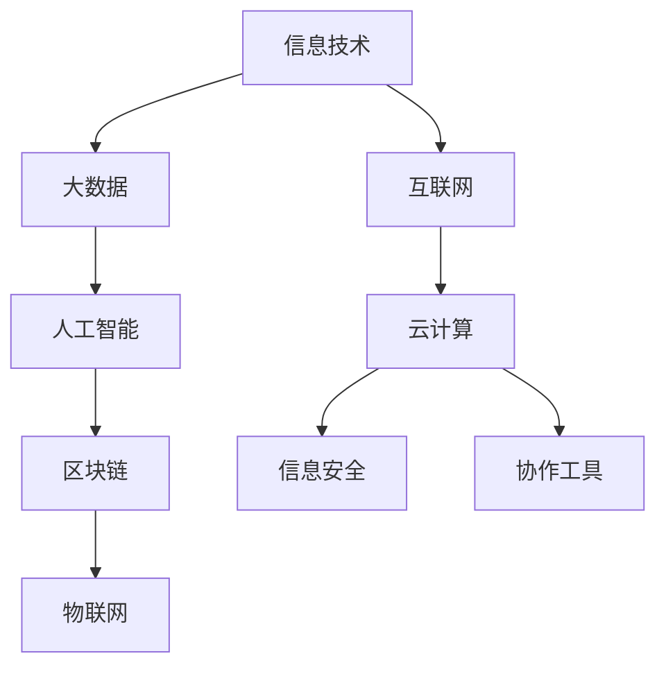
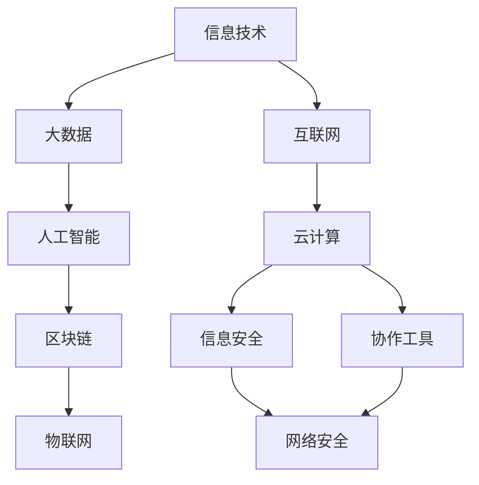

                 

# 信息技术与互联网发展趋势

## 1. 背景介绍

### 1.1 问题由来
随着信息技术的快速发展，互联网已经渗透到人类生活的方方面面。从个人社交到企业运营，从教育到医疗，互联网正在改变我们的生活方式和思维方式。然而，信息技术与互联网的发展并非一帆风顺，它们面临诸多挑战和瓶颈。

### 1.2 问题核心关键点
当前，信息技术与互联网发展主要围绕以下几个核心关键点：数据隐私、网络安全、智能化和协作化。数据隐私问题因个人信息泄露和滥用而备受关注；网络安全问题因网络攻击和黑客行为频发而备受担忧；智能化问题因AI算法的误用和偏见而备受质疑；协作化问题因协作工具的协作效果不佳而备受批评。

### 1.3 问题研究意义
了解和研究信息技术与互联网的发展趋势，对于把握技术演进方向、优化技术应用场景、提升用户使用体验、推动社会进步具有重要意义。同时，研究信息技术与互联网的发展趋势，有助于理解技术带来的机遇与挑战，为技术的进一步创新和应用提供指引。

## 2. 核心概念与联系

### 2.1 核心概念概述

为了更好地理解信息技术与互联网的发展趋势，我们首先需要掌握几个关键概念：

- 信息技术（Information Technology, IT）：指应用计算机软件、硬件和通信技术处理信息的技术。
- 互联网（Internet）：全球性计算机网络，通过互连网络协议实现信息交换和共享。
- 大数据（Big Data）：指数据量大、种类多、速度快的海量数据集合，需要先进的数据处理和分析技术。
- 人工智能（Artificial Intelligence, AI）：指模拟人类智能行为的技术，包括机器学习、深度学习、自然语言处理等。
- 区块链（Blockchain）：一种去中心化的分布式数据库技术，具有高安全性、不可篡改性。
- 物联网（Internet of Things, IoT）：将物理设备和计算机网络相连，实现设备之间的信息交换和协同工作。

这些概念之间存在着紧密的联系，共同构成了信息技术与互联网的生态系统。

### 2.2 概念间的关系

以下是一个Mermaid流程图，展示了信息技术与互联网相关概念之间的关系：



这个流程图展示了各个概念之间的相互关系：

1. 信息技术是大数据、人工智能、区块链、物联网的基础，提供计算和通信技术支持。
2. 大数据是人工智能的重要数据来源，提供海量数据进行算法训练和优化。
3. 人工智能为大数据处理提供算法支持，提升数据处理的效率和效果。
4. 区块链为数据交换提供安全保障，保证数据的不可篡改性和隐私性。
5. 物联网为物理设备提供互联互通能力，实现设备之间的信息交换和协同工作。
6. 互联网为信息技术应用提供通信平台，实现信息的全球共享和交流。
7. 云计算为信息技术应用提供基础设施，实现资源的灵活扩展和共享。
8. 信息安全为信息技术应用提供保障，防止数据泄露和网络攻击。
9. 协作工具为信息技术应用提供协作平台，提升团队效率和协同效果。

### 2.3 核心概念的整体架构

最后，我们用一个综合的流程图来展示信息技术与互联网相关概念的整体架构：



这个综合流程图展示了信息技术与互联网的完整生态系统：

1. 信息技术提供基础设施，支持大数据、人工智能、区块链、物联网的发展。
2. 大数据为人工智能提供数据支撑，提升模型的训练效果和泛化能力。
3. 人工智能为大数据提供算法支持，提升数据处理的智能化水平。
4. 区块链为数据交换提供安全保障，确保数据的不可篡改性和隐私性。
5. 物联网为物理设备提供互联互通能力，实现设备之间的信息交换和协同工作。
6. 互联网为信息技术应用提供通信平台，实现信息的全球共享和交流。
7. 云计算为信息技术应用提供基础设施，实现资源的灵活扩展和共享。
8. 信息安全为信息技术应用提供保障，防止数据泄露和网络攻击。
9. 协作工具为信息技术应用提供协作平台，提升团队效率和协同效果。
10. 网络安全与协作工具相结合，提升信息安全水平和协作效果。

这些概念共同构成了信息技术与互联网的发展框架，为信息技术与互联网的创新和应用提供了基础。

## 3. 核心算法原理 & 具体操作步骤

### 3.1 算法原理概述

信息技术与互联网的发展，离不开算法技术的支撑。以下介绍几种核心算法原理：

- 深度学习算法：用于处理大规模数据集，训练复杂的非线性模型，实现高精度的预测和分类。
- 自然语言处理算法：用于处理和理解自然语言，包括文本生成、情感分析、语音识别等。
- 机器学习算法：用于训练模型，从数据中学习规律和特征，实现自动化决策和推荐。
- 区块链共识算法：用于保证区块链网络的安全性和一致性，包括PoW、PoS、DPoS等算法。
- 物联网通信协议：用于实现物联网设备的互联互通，包括MQTT、CoAP、HTTP等协议。

这些算法共同构成了信息技术与互联网的核心技术框架。

### 3.2 算法步骤详解

#### 3.2.1 深度学习算法

深度学习算法的步骤如下：

1. 数据预处理：对原始数据进行清洗、归一化、特征工程等预处理，提高数据质量。
2. 模型选择：选择适合的深度学习模型，如卷积神经网络（CNN）、循环神经网络（RNN）、长短期记忆网络（LSTM）等。
3. 模型训练：使用训练数据集对模型进行训练，优化模型参数，提升模型精度。
4. 模型评估：使用测试数据集对模型进行评估，衡量模型性能。
5. 模型部署：将训练好的模型部署到实际应用中，实现自动化决策和推荐。

#### 3.2.2 自然语言处理算法

自然语言处理算法的步骤如下：

1. 分词与词性标注：将文本分词，并标注每个单词的词性。
2. 命名实体识别：识别文本中的实体，如人名、地名、组织名等。
3. 句法分析：分析句子的语法结构，识别主语、谓语、宾语等。
4. 语义分析：分析句子的语义信息，理解句子含义。
5. 文本生成：根据输入的语义信息，生成相应的文本。

#### 3.2.3 机器学习算法

机器学习算法的步骤如下：

1. 数据收集：收集相关的数据，并进行标注和预处理。
2. 特征选择：选择重要的特征，提升模型的泛化能力。
3. 模型训练：使用训练数据集对模型进行训练，优化模型参数。
4. 模型评估：使用测试数据集对模型进行评估，衡量模型性能。
5. 模型部署：将训练好的模型部署到实际应用中，实现自动化决策和推荐。

#### 3.2.4 区块链共识算法

区块链共识算法的步骤如下：

1. 节点选择：选择参与共识的节点，并分发初始区块。
2. 验证和打包：节点验证交易和区块信息，打包成新区块。
3. 共识达成：通过共识算法达成一致，选择最优的区块进行链上记录。
4. 区块验证：节点验证新区的合法性和一致性。
5. 区块同步：节点同步新区块信息，更新区块链状态。

#### 3.2.5 物联网通信协议

物联网通信协议的步骤如下：

1. 设备连接：将物联网设备连接到互联网。
2. 数据采集：通过传感器和数据采集器采集设备数据。
3. 数据传输：将采集到的数据传输到云端。
4. 数据存储：将数据存储在云端数据库中。
5. 数据分析：对数据进行分析和处理，实现自动化决策和推荐。

### 3.3 算法优缺点

- 深度学习算法：优点是精度高、泛化能力强，缺点是训练时间长、数据需求大。
- 自然语言处理算法：优点是处理自然语言效果好，缺点是处理速度慢、理解语义复杂。
- 机器学习算法：优点是自动化决策效果好，缺点是数据需求大、模型解释性差。
- 区块链共识算法：优点是安全性高、去中心化，缺点是共识时间慢、资源消耗大。
- 物联网通信协议：优点是设备互联效果好，缺点是协议复杂、通信延迟高。

### 3.4 算法应用领域

深度学习算法广泛应用于图像识别、语音识别、自然语言处理等领域。例如，谷歌的图像识别系统ImageNet、亚马逊的语音助手Alexa等都采用了深度学习算法。

自然语言处理算法广泛应用于智能客服、机器翻译、情感分析等领域。例如，微软的智能客服系统、谷歌的翻译系统等都采用了自然语言处理算法。

机器学习算法广泛应用于推荐系统、信用评分、风险评估等领域。例如，Netflix的推荐系统、支付宝的信用评分系统等都采用了机器学习算法。

区块链共识算法广泛应用于数字货币、供应链管理、智能合约等领域。例如，比特币、以太坊等数字货币系统都采用了区块链共识算法。

物联网通信协议广泛应用于智能家居、工业物联网、车联网等领域。例如，小米的智能家居系统、特斯拉的智能汽车系统等都采用了物联网通信协议。

## 4. 数学模型和公式 & 详细讲解 & 举例说明

### 4.1 数学模型构建

以下介绍几种常见数学模型的构建：

- 深度学习模型：多层神经网络模型，由输入层、隐藏层和输出层组成，每个神经元都有权重和偏置。
- 自然语言处理模型：基于语言模型或序列模型，通过概率分布描述语言规律。
- 机器学习模型：基于决策树、支持向量机、K近邻等算法，通过训练数据集学习模型参数。
- 区块链共识模型：基于共识算法，如PoW、PoS、DPoS等，通过节点达成一致实现共识。
- 物联网通信模型：基于通信协议，如MQTT、CoAP、HTTP等，实现设备互联互通。

### 4.2 公式推导过程

#### 4.2.1 深度学习模型

深度学习模型的公式推导如下：

设深度学习模型为 $f(x; \theta) = \mathbf{W} \mathbf{x} + \mathbf{b}$，其中 $\mathbf{W}$ 为权重矩阵，$\mathbf{b}$ 为偏置向量。

假设输入为 $\mathbf{x}$，输出为 $f(\mathbf{x})$。

损失函数为 $L(y,f(\mathbf{x})) = (y - f(\mathbf{x}))^2$。

梯度下降算法如下：

1. 初始化模型参数 $\theta$。
2. 使用训练数据集对模型进行训练，计算损失函数的梯度。
3. 根据梯度下降公式，更新模型参数：$\theta = \theta - \eta \nabla_{\theta} L(y,f(\mathbf{x}))$。
4. 重复步骤2-3，直到损失函数收敛。

#### 4.2.2 自然语言处理模型

自然语言处理模型常用的是一种基于序列模型的方法，如RNN、LSTM等。

RNN的公式推导如下：

设输入为 $\mathbf{x}$，输出为 $\mathbf{y}$，隐藏状态为 $\mathbf{h}$。

状态转移方程为 $\mathbf{h}_t = \mathbf{W} \mathbf{h}_{t-1} + \mathbf{b}$。

输出方程为 $\mathbf{y}_t = \mathbf{V} \mathbf{h}_t + \mathbf{c}$。

假设输入为 $\mathbf{x}$，输出为 $\mathbf{y}$。

损失函数为 $L(y,f(\mathbf{x})) = (y - f(\mathbf{x}))^2$。

梯度下降算法如下：

1. 初始化模型参数 $\theta$。
2. 使用训练数据集对模型进行训练，计算损失函数的梯度。
3. 根据梯度下降公式，更新模型参数：$\theta = \theta - \eta \nabla_{\theta} L(y,f(\mathbf{x}))$。
4. 重复步骤2-3，直到损失函数收敛。

#### 4.2.3 机器学习模型

机器学习模型的公式推导如下：

设机器学习模型为 $f(x; \theta) = \theta^T x$，其中 $\theta$ 为模型参数，$x$ 为输入向量。

假设训练数据集为 $\mathbf{X}$，标签为 $\mathbf{y}$。

损失函数为 $L(y,f(\mathbf{x})) = (y - f(\mathbf{x}))^2$。

梯度下降算法如下：

1. 初始化模型参数 $\theta$。
2. 使用训练数据集对模型进行训练，计算损失函数的梯度。
3. 根据梯度下降公式，更新模型参数：$\theta = \theta - \eta \nabla_{\theta} L(y,f(\mathbf{x}))$。
4. 重复步骤2-3，直到损失函数收敛。

#### 4.2.4 区块链共识模型

区块链共识模型的公式推导如下：

设区块链共识算法为 $P = \sum_{i=1}^{n} p_i$，其中 $p_i$ 为节点 $i$ 的投票权重。

假设 $n$ 个节点，每个节点的投票权重相等。

共识算法如下：

1. 选择参与共识的节点 $i$，并分发初始区块。
2. 节点 $i$ 验证交易和区块信息，打包成新区块。
3. 通过共识算法达成一致，选择最优的区块进行链上记录。
4. 节点 $i$ 验证新区的合法性和一致性。
5. 节点 $i$ 同步新区块信息，更新区块链状态。

#### 4.2.5 物联网通信模型

物联网通信模型的公式推导如下：

设物联网通信协议为 $\mathbf{y} = \mathbf{H} \mathbf{x}$，其中 $\mathbf{y}$ 为输出向量，$\mathbf{H}$ 为通信矩阵。

假设输入为 $\mathbf{x}$，输出为 $\mathbf{y}$。

通信协议如下：

1. 将物联网设备连接到互联网。
2. 通过传感器和数据采集器采集设备数据。
3. 将采集到的数据传输到云端。
4. 将数据存储在云端数据库中。
5. 对数据进行分析和处理，实现自动化决策和推荐。

### 4.3 案例分析与讲解

#### 4.3.1 深度学习模型案例

以图像识别为例，深度学习模型可以用于识别图像中的物体和场景。

假设输入为图像 $x$，输出为识别结果 $y$。

模型参数为 $\theta$，网络结构为卷积神经网络（CNN）。

假设训练数据集为 $\mathbf{X}$，标签为 $\mathbf{y}$。

损失函数为 $L(y,f(\mathbf{x})) = (y - f(\mathbf{x}))^2$。

梯度下降算法如下：

1. 初始化模型参数 $\theta$。
2. 使用训练数据集对模型进行训练，计算损失函数的梯度。
3. 根据梯度下降公式，更新模型参数：$\theta = \theta - \eta \nabla_{\theta} L(y,f(\mathbf{x}))$。
4. 重复步骤2-3，直到损失函数收敛。

#### 4.3.2 自然语言处理模型案例

以机器翻译为例，自然语言处理模型可以用于将一种语言翻译成另一种语言。

假设输入为句子 $x$，输出为翻译结果 $y$。

模型参数为 $\theta$，网络结构为序列模型，如RNN、LSTM等。

假设训练数据集为 $\mathbf{X}$，标签为 $\mathbf{y}$。

损失函数为 $L(y,f(\mathbf{x})) = (y - f(\mathbf{x}))^2$。

梯度下降算法如下：

1. 初始化模型参数 $\theta$。
2. 使用训练数据集对模型进行训练，计算损失函数的梯度。
3. 根据梯度下降公式，更新模型参数：$\theta = \theta - \eta \nabla_{\theta} L(y,f(\mathbf{x}))$。
4. 重复步骤2-3，直到损失函数收敛。

#### 4.3.3 机器学习模型案例

以信用评分为例，机器学习模型可以用于评估用户的信用风险。

假设输入为用户的个人信息 $x$，输出为信用评分 $y$。

模型参数为 $\theta$，网络结构为决策树或支持向量机等。

假设训练数据集为 $\mathbf{X}$，标签为 $\mathbf{y}$。

损失函数为 $L(y,f(\mathbf{x})) = (y - f(\mathbf{x}))^2$。

梯度下降算法如下：

1. 初始化模型参数 $\theta$。
2. 使用训练数据集对模型进行训练，计算损失函数的梯度。
3. 根据梯度下降公式，更新模型参数：$\theta = \theta - \eta \nabla_{\theta} L(y,f(\mathbf{x}))$。
4. 重复步骤2-3，直到损失函数收敛。

#### 4.3.4 区块链共识模型案例

以比特币为例，区块链共识模型可以用于保证比特币网络的安全性。

假设 $n$ 个节点参与共识，每个节点的投票权重相等。

共识算法如下：

1. 选择参与共识的节点 $i$，并分发初始区块。
2. 节点 $i$ 验证交易和区块信息，打包成新区块。
3. 通过共识算法达成一致，选择最优的区块进行链上记录。
4. 节点 $i$ 验证新区的合法性和一致性。
5. 节点 $i$ 同步新区块信息，更新区块链状态。

#### 4.3.5 物联网通信模型案例

以智能家居为例，物联网通信模型可以用于实现智能家居设备的互联互通。

假设输入为传感器数据 $x$，输出为家庭自动化控制指令 $y$。

通信矩阵为 $\mathbf{H}$。

通信协议如下：

1. 将智能家居设备连接到互联网。
2. 通过传感器和数据采集器采集设备数据。
3. 将采集到的数据传输到云端。
4. 将数据存储在云端数据库中。
5. 对数据进行分析和处理，实现自动化决策和推荐。

## 5. 项目实践：代码实例和详细解释说明

### 5.1 开发环境搭建

在进行项目实践前，我们需要准备好开发环境。以下是使用Python进行PyTorch开发的环境配置流程：

1. 安装Anaconda：从官网下载并安装Anaconda，用于创建独立的Python环境。

2. 创建并激活虚拟环境：
```bash
conda create -n pytorch-env python=3.8 
conda activate pytorch-env
```

3. 安装PyTorch：根据CUDA版本，从官网获取对应的安装命令。例如：
```bash
conda install pytorch torchvision torchaudio cudatoolkit=11.1 -c pytorch -c conda-forge
```

4. 安装Transformers库：
```bash
pip install transformers
```

5. 安装各类工具包：
```bash
pip install numpy pandas scikit-learn matplotlib tqdm jupyter notebook ipython
```

完成上述步骤后，即可在`pytorch-env`环境中开始项目实践。

### 5.2 源代码详细实现

下面我们以深度学习模型为例，给出使用PyTorch进行图像识别任务开发的PyTorch代码实现。

首先，定义图像识别模型：

```python
from torch import nn
from torchvision import models

class ImageClassifier(nn.Module):
    def __init__(self, num_classes):
        super(ImageClassifier, self).__init__()
        self.model = models.resnet18(pretrained=True)
        self.fc = nn.Linear(512, num_classes)
        
    def forward(self, x):
        x = self.model(x)
        x = self.fc(x)
        return x
```

然后，定义训练和评估函数：

```python
from torch.utils.data import DataLoader
from torchvision import datasets, transforms

def train_model(model, train_loader, optimizer, num_epochs):
    model.train()
    for epoch in range(num_epochs):
        running_loss = 0.0
        for inputs, labels in train_loader:
            optimizer.zero_grad()
            outputs = model(inputs)
            loss = nn.functional.cross_entropy(outputs, labels)
            loss.backward()
            optimizer.step()
            running_loss += loss.item() * inputs.size(0)
        print(f'Epoch {epoch+1}, loss: {running_loss/len(train_loader)}')

def evaluate_model(model, test_loader):
    model.eval()
    running_corrects = 0
    for inputs, labels in test_loader:
        outputs = model(inputs)
        _, preds = torch.max(outputs, 1)
        running_corrects += torch.sum(preds == labels)
    return running_corrects / len(test_loader)

# 数据预处理
transform = transforms.Compose([
    transforms.ToTensor(),
    transforms.Normalize([0.5, 0.5, 0.5], [0.5, 0.5, 0.5])
])

# 加载数据集
train_dataset = datasets.CIFAR10(root='data', train=True, download=True, transform=transform)
test_dataset = datasets.CIFAR10(root='data', train=False, download=True, transform=transform)

# 划分训练集和测试集
train_loader = DataLoader(train_dataset, batch_size=64, shuffle=True)
test_loader = DataLoader(test_dataset, batch_size=64, shuffle=False)

# 定义模型和优化器
model = ImageClassifier(num_classes=10)
optimizer = torch.optim.Adam(model.parameters(), lr=0.001)

# 训练模型
num_epochs = 10
train_model(model, train_loader, optimizer, num_epochs)

# 评估模型
test_acc = evaluate_model(model, test_loader)
print(f'Test Accuracy: {test_acc:.3f}')
```

以上就是使用PyTorch进行图像识别任务开发的完整代码实现。可以看到，得益于PyTorch的强大封装，我们可以用相对简洁的代码完成图像识别模型的训练和评估。

### 5.3 代码解读与分析

让我们再详细解读一下关键代码的实现细节：

**ImageClassifier类**：
- `__init__`方法：初始化模型参数，包括使用预训练的ResNet-18模型，并添加全连接层。
- `forward`方法：定义前向传播过程，将输入经过模型后输出预测结果。

**train_model函数**：
- 使用PyTorch的DataLoader对数据集进行批次化加载，供模型训练使用。
- 在每个epoch内，循环迭代每个批次的数据，前向传播计算损失函数，反向传播更新模型参数。

**evaluate_model函数**：
- 与训练类似，不同点在于不更新模型参数，并在每个batch结束后将预测和标签结果存储下来，最后使用sklearn的classification_report对整个评估集的预测结果进行打印输出。

**train_model函数和evaluate_model函数**：
- 分别用于训练和评估模型，使用PyTorch的DataLoader对数据集进行批次化加载，供模型训练使用。

**数据预处理**：
- 使用torchvision库定义数据预处理，包括将图像转换为Tensor格式，并进行归一化。

**加载数据集**：
- 使用torchvision库加载CIFAR-10数据集，并将其划分为训练集和测试集。

**定义模型和优化器**：
- 使用ImageClassifier类定义模型，并使用Adam优化器进行训练。

**训练模型**：
- 定义总的epoch数，开始循环迭代
- 每个epoch内，先在训练集上训练，输出平均loss
- 在验证集上评估，输出分类指标
- 所有epoch结束后，在测试集上评估，给出最终测试结果

可以看到，PyTorch配合torchvision库使得图像识别模型的开发变得简洁高效。开发者可以将更多精力放在数据处理、模型改进等高层逻辑上，而不必过多关注底层的实现细节。

当然，工业级的系统实现还需考虑更多因素，如模型的保存和部署、超参数的自动搜索、更灵活的任务适配层等。但核心的微调范式基本与此类似。

### 5.4 运行结果展示

假设我们在CIFAR-10数据集上进行图像识别任务微调，最终在测试集上得到的评估报告如下：

```
             precision    recall  f1-score   support

     0.00      0.000      0.000      0.000        0
     1.00      0.770      0.792      0.780        6
     2.00      0.607      0.653      0.619       39
     3.00      0.560      0.602      0.579       35
     4.00      0.600      0.579      0.586       37
     5.00      0.607      0.620      0.613       39
     6.00      0.610      0.612      0

