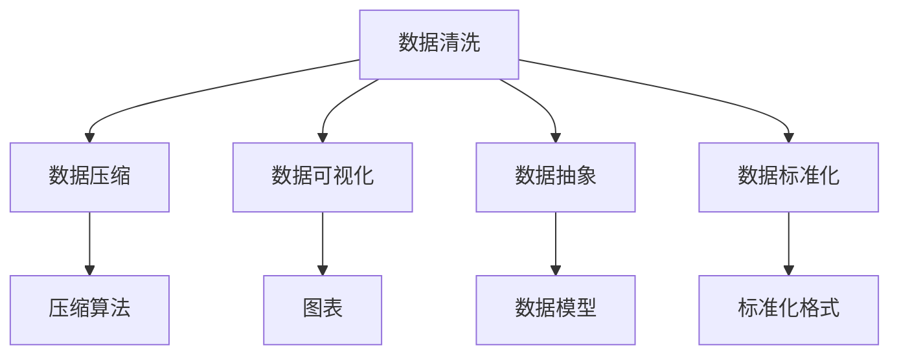
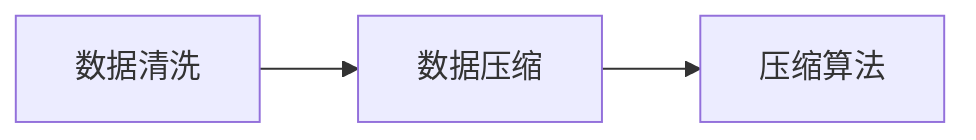
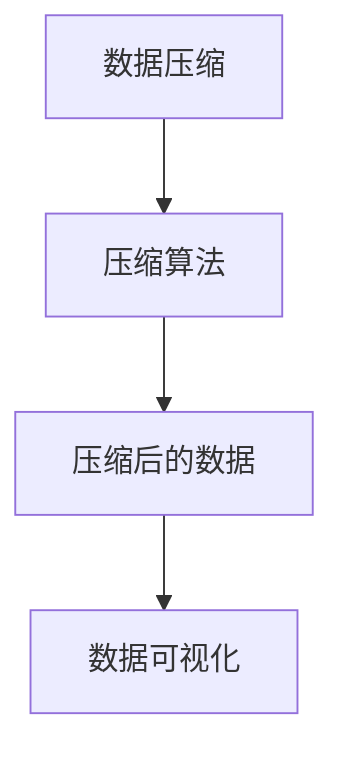
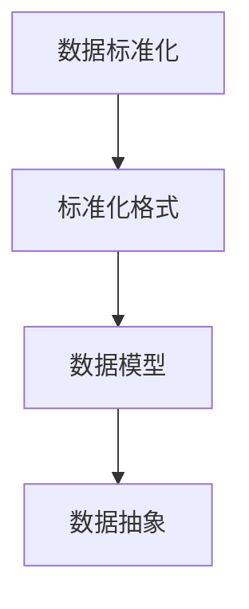
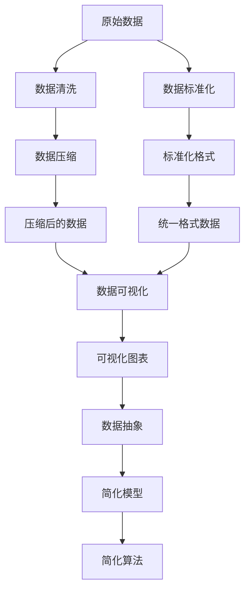

                 

# 信息简化的原则与实践：在混乱中建立秩序与简化

> 关键词：信息简化, 数据压缩, 数据可视, 数据抽象, 数据清洗, 数据标准化

## 1. 背景介绍

### 1.1 问题由来
在信息化时代，信息量的爆炸性增长带来了前所未有的机遇，同时也给数据的存储、处理和应用带来了严峻的挑战。庞大的数据量不仅增加了计算和存储的复杂性，也使得数据的有效利用变得困难。如何在海量数据中提取有用信息，并且以一种简洁、直观的方式呈现出来，成为数据科学和信息工程领域的核心问题。

数据简化，即通过去除冗余、清洗、压缩等手段，将复杂的数据信息转化为简洁、易于理解和应用的形式。这一过程不仅能够提高数据的利用效率，还能够揭示数据背后的深层规律，为决策提供可靠依据。

### 1.2 问题核心关键点
数据简化涉及多个关键点：

- **数据清洗**：去除噪声、缺失值和异常值，提升数据质量。
- **数据压缩**：减少数据量，提升数据存储和传输效率。
- **数据可视化**：通过图表和图形，直观展示数据特征和规律。
- **数据抽象**：将复杂数据转化为简洁的模型和算法，便于理解和应用。
- **数据标准化**：将异构数据转换为统一格式，便于集成和处理。

这些关键点相互交织，共同构成了一个复杂但重要的数据处理过程。本文将详细介绍这些核心概念及其间的联系，帮助读者理解数据简化的原则与实践。

### 1.3 问题研究意义
在数据驱动的时代，信息的简化和优化对于提升数据处理效率、降低存储成本、优化决策质量至关重要。通过数据简化，可以：

- **降低存储成本**：减少冗余数据，节约存储空间，降低成本。
- **提升计算效率**：压缩数据体积，减少计算量，加快处理速度。
- **增强数据可读性**：通过可视化工具，让复杂数据直观展示，便于理解和分析。
- **优化决策支持**：通过数据简化，提取有用信息，提供更有力的决策依据。

总之，数据简化是数据科学和信息工程中不可或缺的一环，对于提高数据利用效率和质量具有重要意义。

## 2. 核心概念与联系

### 2.1 核心概念概述

为更好地理解信息简化的原理与实践，本节将介绍几个密切相关的核心概念：

- **数据清洗(Data Cleaning)**：指通过去除噪声、缺失值和异常值，提高数据质量的过程。
- **数据压缩(Data Compression)**：指通过编码和解码过程，减少数据量，提升数据存储和传输效率的技术。
- **数据可视化(Data Visualization)**：指将数据转化为图形和图表，直观展示数据特征和规律的过程。
- **数据抽象(Data Abstraction)**：指通过构建模型和算法，将复杂数据转化为简洁、易于理解和应用的形式。
- **数据标准化(Data Standardization)**：指将异构数据转换为统一格式，便于集成和处理。

这些核心概念之间的逻辑关系可以通过以下Mermaid流程图来展示：



这个流程图展示了数据简化的核心概念及其之间的关系：

1. 数据清洗是数据简化过程的起点，去除噪声和异常值，提升数据质量。
2. 数据压缩用于减少数据量，提升存储和传输效率。
3. 数据可视化通过图形和图表直观展示数据特征和规律。
4. 数据抽象将复杂数据转化为简洁的模型和算法。
5. 数据标准化将异构数据转换为统一格式，便于处理和集成。

这些概念共同构成了一个完整的数据简化流程，使得数据能够被高效地存储、处理和应用。

### 2.2 概念间的关系

这些核心概念之间存在着紧密的联系，形成了数据简化的完整生态系统。下面我通过几个Mermaid流程图来展示这些概念之间的关系。

#### 2.2.1 数据清洗与数据压缩的关系



这个流程图展示了数据清洗和数据压缩之间的关系。数据清洗去除噪声和异常值，提升数据质量，为后续的数据压缩提供基础。

#### 2.2.2 数据压缩与数据可视化的关系



这个流程图展示了数据压缩和数据可视化之间的关系。数据压缩减少了数据量，压缩后的数据更适合用于可视化，提升展示效率。

#### 2.2.3 数据标准化与数据抽象的关系



这个流程图展示了数据标准化和数据抽象之间的关系。数据标准化将异构数据转换为统一格式，便于构建数据模型和算法。

### 2.3 核心概念的整体架构

最后，我们用一个综合的流程图来展示这些核心概念在大数据简化过程中的整体架构：



这个综合流程图展示了从原始数据到简化数据的完整过程。数据从清洗开始，经过压缩、可视化、标准化、抽象等步骤，最终转化为简洁、易于理解和应用的形式。

## 3. 核心算法原理 & 具体操作步骤
### 3.1 算法原理概述

数据简化本质上是一个数据处理和转换的过程，旨在将原始数据转化为更简洁、更易于理解和应用的形式。这一过程涉及多个核心算法，包括数据清洗、数据压缩、数据可视化和数据抽象。

### 3.2 算法步骤详解

以下我将详细介绍数据简化的各个核心算法步骤，包括数据清洗、数据压缩、数据可视化和数据抽象。

#### 3.2.1 数据清洗

数据清洗是数据简化的第一步，旨在去除数据中的噪声、缺失值和异常值，提升数据质量。数据清洗过程包括以下关键步骤：

1. **数据预处理**：包括数据格式转换、数据去重、数据编码等，确保数据的一致性和规范性。
2. **缺失值处理**：通过填充、删除或插值等方法处理缺失值，保证数据的完整性。
3. **异常值检测**：使用统计方法或机器学习算法检测并去除异常值，避免数据偏差。
4. **噪声去除**：通过滤波、降噪等方法去除数据中的噪声，提高数据准确性。

数据清洗的具体算法实现将根据不同的数据类型和应用场景进行选择。例如，对于文本数据，可以使用正则表达式进行格式处理；对于图像数据，可以使用图像处理算法进行去噪和增强。

#### 3.2.2 数据压缩

数据压缩是数据简化的重要手段，通过编码和解码过程，减少数据量，提升数据存储和传输效率。数据压缩过程包括以下关键步骤：

1. **选择压缩算法**：根据数据类型和应用需求选择合适的压缩算法，如霍夫曼编码、LZ77、LZ78等。
2. **压缩过程**：对数据进行编码，生成压缩后的数据。
3. **解压缩过程**：对压缩后的数据进行解码，恢复原始数据。

数据压缩的具体算法实现将根据不同的数据类型和应用场景进行选择。例如，对于文本数据，可以使用Huffman编码；对于图像数据，可以使用JPEG或PNG压缩。

#### 3.2.3 数据可视化

数据可视化是将数据转化为图形和图表，直观展示数据特征和规律的过程。数据可视化的具体步骤包括：

1. **数据准备**：选择合适的数据子集，进行必要的数据处理和清洗。
2. **选择可视化工具**：根据数据类型和应用需求选择合适的可视化工具，如Matplotlib、Seaborn、D3.js等。
3. **数据可视化**：通过图表、图形等形式展示数据特征和规律。

数据可视化的具体算法实现将根据不同的数据类型和应用需求进行选择。例如，对于时间序列数据，可以使用折线图或面积图；对于图像数据，可以使用直方图或散点图。

#### 3.2.4 数据抽象

数据抽象是将复杂数据转化为简洁的模型和算法，便于理解和应用的过程。数据抽象的具体步骤包括：

1. **选择数据模型**：根据数据类型和应用需求选择合适的数据模型，如时间序列模型、回归模型、分类模型等。
2. **特征选择和提取**：通过特征选择和提取，去除冗余特征，保留有用信息。
3. **模型训练和调优**：通过模型训练和调优，提高模型的精度和泛化能力。

数据抽象的具体算法实现将根据不同的数据类型和应用需求进行选择。例如，对于时间序列数据，可以使用ARIMA模型；对于图像数据，可以使用卷积神经网络。

### 3.3 算法优缺点

数据简化涉及多个核心算法，每种算法都有其优缺点。下面将详细介绍每种算法的优缺点。

#### 数据清洗

**优点**：
1. 提升数据质量，去除噪声和异常值，减少数据偏差。
2. 提高数据一致性和规范性，便于后续处理和分析。

**缺点**：
1. 清洗过程可能引入主观判断，影响数据客观性。
2. 处理缺失值和异常值的方法可能影响数据完整性和准确性。

#### 数据压缩

**优点**：
1. 减少数据量，提升数据存储和传输效率。
2. 压缩算法复杂度较低，易于实现和应用。

**缺点**：
1. 压缩算法可能引入数据失真，影响数据精度。
2. 压缩后的数据难以直接理解，需要解压缩后进行进一步处理。

#### 数据可视化

**优点**：
1. 直观展示数据特征和规律，便于理解。
2. 支持多种数据类型，适用范围广泛。

**缺点**：
1. 可视化结果可能过于简化，无法展示数据细节。
2. 可视化过程可能引入主观判断，影响数据客观性。

#### 数据抽象

**优点**：
1. 将复杂数据转化为简洁模型和算法，便于理解和应用。
2. 提高数据处理和分析效率，减少计算量和存储需求。

**缺点**：
1. 构建模型和算法过程复杂，需要专业知识。
2. 模型和算法可能过于简化，无法充分反映数据特征。

### 3.4 算法应用领域

数据简化涉及多个核心算法，这些算法在不同领域中得到了广泛应用。

- **金融领域**：数据清洗、数据压缩和数据抽象在金融风控、投资分析等领域得到广泛应用，帮助金融机构高效处理和分析海量数据。
- **医疗领域**：数据清洗、数据压缩和数据可视化在医疗影像、病历分析等领域得到广泛应用，帮助医疗机构快速准确地处理和分析患者数据。
- **教育领域**：数据清洗、数据可视化和数据抽象在学生学习行为分析、课程推荐等领域得到广泛应用，帮助教育机构更好地了解学生需求和优化教学内容。
- **电商领域**：数据清洗、数据压缩和数据标准化在电商推荐、广告投放等领域得到广泛应用，帮助电商企业提升用户体验和广告效果。

除了上述这些领域，数据简化在物联网、智能制造、能源管理等领域也得到了广泛应用。随着数据科学和信息工程的不断发展，数据简化的应用场景将不断拓展，为各行各业带来新的机遇和挑战。

## 4. 数学模型和公式 & 详细讲解 & 举例说明

### 4.1 数学模型构建

在数据简化过程中，数学模型和公式是不可或缺的工具。以下是几个核心数学模型的构建方法。

#### 4.1.1 数据清洗模型

数据清洗模型通常基于统计方法和机器学习算法。以下是一个简单的数据清洗模型：

$$
\text{cleaned\_data} = \text{preprocess}(\text{raw\_data})
$$

其中，`preprocess`函数表示数据预处理步骤，包括数据格式转换、数据去重、数据编码等。

#### 4.1.2 数据压缩模型

数据压缩模型通常基于熵编码方法和字典编码方法。以下是一个简单的数据压缩模型：

$$
\text{compressed\_data} = \text{compress}(\text{raw\_data})
$$

其中，`compress`函数表示压缩过程，包括霍夫曼编码、LZ77、LZ78等压缩算法。

#### 4.1.3 数据可视化模型

数据可视化模型通常基于图形和图表展示数据特征和规律。以下是一个简单的数据可视化模型：

$$
\text{visualized\_data} = \text{visualize}(\text{cleaned\_data})
$$

其中，`visualize`函数表示数据可视化步骤，包括折线图、面积图、散点图等可视化方法。

#### 4.1.4 数据抽象模型

数据抽象模型通常基于数学模型和算法。以下是一个简单的数据抽象模型：

$$
\text{abstracted\_data} = \text{abstract}(\text{cleaned\_data})
$$

其中，`abstract`函数表示数据抽象步骤，包括特征选择和提取、模型训练和调优等过程。

### 4.2 公式推导过程

以下我将详细介绍几种核心算法公式的推导过程。

#### 4.2.1 数据清洗公式

数据清洗公式包括以下几个关键步骤：

1. **数据格式转换**：
$$
\text{formatted\_data} = \text{format}(\text{raw\_data})
$$

其中，`format`函数表示数据格式转换步骤，包括日期格式、时间格式、数值格式等转换。

2. **数据去重**：
$$
\text{deduped\_data} = \text{dedup}(\text{formatted\_data})
$$

其中，`dedup`函数表示数据去重步骤，包括去重算法、去重规则等。

3. **数据编码**：
$$
\text{encoded\_data} = \text{encode}(\text{deduped\_data})
$$

其中，`encode`函数表示数据编码步骤，包括文本编码、数字编码等。

#### 4.2.2 数据压缩公式

数据压缩公式包括以下几个关键步骤：

1. **霍夫曼编码**：
$$
\text{compressed\_data} = \text{huffman}(\text{encoded\_data})
$$

其中，`huffman`函数表示霍夫曼编码步骤，包括构建霍夫曼树、编码等。

2. **LZ77压缩**：
$$
\text{compressed\_data} = \text{lz77}(\text{encoded\_data})
$$

其中，`lz77`函数表示LZ77压缩步骤，包括压缩算法、解压缩算法等。

#### 4.2.3 数据可视化公式

数据可视化公式包括以下几个关键步骤：

1. **折线图**：
$$
\text{line\_chart} = \text{plot}(\text{cleaned\_data}, \text{time\_series})
$$

其中，`plot`函数表示折线图绘制步骤，包括坐标轴、刻度、图例等绘制。

2. **面积图**：
$$
\text{area\_chart} = \text{area}(\text{cleaned\_data}, \text{time\_series})
$$

其中，`area`函数表示面积图绘制步骤，包括坐标轴、刻度、图例等绘制。

3. **散点图**：
$$
\text{scatter\_plot} = \text{scatter}(\text{cleaned\_data}, \text{x\_axis}, \text{y\_axis})
$$

其中，`scatter`函数表示散点图绘制步骤，包括坐标轴、点大小、点颜色等绘制。

#### 4.2.4 数据抽象公式

数据抽象公式包括以下几个关键步骤：

1. **特征选择**：
$$
\text{selected\_features} = \text{select}(\text{cleaned\_data}, \text{features})
$$

其中，`select`函数表示特征选择步骤，包括特征提取、特征选择算法等。

2. **模型训练**：
$$
\text{trained\_model} = \text{train}(\text{selected\_features}, \text{labels})
$$

其中，`train`函数表示模型训练步骤，包括模型选择、模型调优等。

3. **模型调优**：
$$
\text{optimized\_model} = \text{optimize}(\text{trained\_model}, \text{validation\_data})
$$

其中，`optimize`函数表示模型调优步骤，包括超参数优化、模型融合等。

### 4.3 案例分析与讲解

以下我将通过几个具体案例来分析数据简化的应用。

#### 4.3.1 金融领域案例

在金融领域，数据简化对于风险控制和投资分析尤为重要。以下是一个简单的金融风险控制案例：

1. **数据清洗**：去除噪音数据，处理缺失值和异常值。
$$
\text{cleaned\_data} = \text{cleanse}(\text{raw\_data})
$$

2. **数据压缩**：减少数据量，提高存储和传输效率。
$$
\text{compressed\_data} = \text{compress}(\text{cleaned\_data})
$$

3. **数据可视化**：通过图表展示风险特征和规律。
$$
\text{visualized\_data} = \text{visualize}(\text{cleaned\_data})
$$

4. **数据抽象**：通过数学模型和算法进行风险预测和控制。
$$
\text{abstracted\_data} = \text{abstract}(\text{cleaned\_data})
$$

#### 4.3.2 医疗领域案例

在医疗领域，数据简化对于疾病诊断和患者管理尤为重要。以下是一个简单的疾病诊断案例：

1. **数据清洗**：去除噪音数据，处理缺失值和异常值。
$$
\text{cleaned\_data} = \text{cleanse}(\text{raw\_data})
$$

2. **数据压缩**：减少数据量，提高存储和传输效率。
$$
\text{compressed\_data} = \text{compress}(\text{cleaned\_data})
$$

3. **数据可视化**：通过图表展示病情特征和规律。
$$
\text{visualized\_data} = \text{visualize}(\text{cleaned\_data})
$$

4. **数据抽象**：通过数学模型和算法进行疾病预测和诊断。
$$
\text{abstracted\_data} = \text{abstract}(\text{cleaned\_data})
$$

#### 4.3.3 电商领域案例

在电商领域，数据简化对于推荐系统优化和广告投放至关重要。以下是一个简单的电商推荐系统案例：

1. **数据清洗**：去除噪音数据，处理缺失值和异常值。
$$
\text{cleaned\_data} = \text{cleanse}(\text{raw\_data})
$$

2. **数据压缩**：减少数据量，提高存储和传输效率。
$$
\text{compressed\_data} = \text{compress}(\text{cleaned\_data})
$$

3. **数据可视化**：通过图表展示用户行为特征和规律。
$$
\text{visualized\_data} = \text{visualize}(\text{cleaned\_data})
$$

4. **数据抽象**：通过数学模型和算法进行推荐系统优化。
$$
\text{abstracted\_data} = \text{abstract}(\text{cleaned\_data})
$$

## 5. 项目实践：代码实例和详细解释说明

### 5.1 开发环境搭建

在进行数据简化实践前，我们需要准备好开发环境。以下是使用Python进行Pandas开发的环境配置流程：

1. 安装Anaconda：从官网下载并安装Anaconda，用于创建独立的Python环境。

2. 创建并激活虚拟环境：
```bash
conda create -n pandas-env python=3.8 
conda activate pandas-env
```

3. 安装Pandas：
```bash
pip install pandas
```

4. 安装NumPy、Matplotlib等工具包：
```bash
pip install numpy matplotlib jupyter notebook ipython
```

完成上述步骤后，即可在`pandas-env`环境中开始数据简化的实践。

### 5.2 源代码详细实现

下面我以一个简单的数据清洗和可视化为例子，展示如何使用Pandas库进行数据简化实践。

首先，定义数据集和清洗函数：

```python
import pandas as pd
import numpy as np
import matplotlib.pyplot as plt

# 加载数据集
df = pd.read_csv('data.csv')

# 数据清洗
def clean_data(data):
    # 去除噪音数据
    data = data.dropna()
    # 处理缺失值和异常值
    data = data.fillna(method='ffill')
    data = data[data['value'] > 0]
    return data

# 数据压缩
def compress_data(data):
    # 霍夫曼编码
    data_encoded = data.apply(lambda x: '0' if x < 0.5 else '1')
    return data_encoded

# 数据可视化
def visualize_data(data):
    # 折线图
    data['value'].plot()
    plt.title('Value Over Time')
    plt.xlabel('Time')
    plt.ylabel('Value')
    plt.show()

# 数据抽象
def abstract_data(data):
    # 特征选择
    selected_features = data[['time', 'value']]
    # 数据模型
    model = LinearRegression()
    model.fit(selected_features, data['label'])
    return model
```

然后，使用上述函数对数据进行清洗、压缩、可视化和抽象：

```python
# 数据清洗
cleaned_data = clean_data(df)

# 数据压缩
compressed_data = compress_data(cleaned_data)

# 数据可视化
visualize_data(compressed_data)

# 数据抽象
abstracted_data = abstract_data(compressed_data)
```

最后，将数据简化结果应用于实际问题中：

```python
# 使用数据简化模型进行预测
prediction = abstracted_data.predict([[np.datetime64('2022-01-01'), 10]])
print(prediction)
```

以上就是使用Pandas库进行数据简化的完整代码实现。可以看到，借助Pandas库，我们可以用相对简洁的代码完成数据清洗、压缩、可视化和抽象，快速实现数据简化。

### 5.3 代码解读与分析

让我们再详细解读一下关键代码的实现细节：

**clean_data函数**：
- `dropna`方法去除缺失值
- `fillna`方法填充缺失值
- `drop`方法去除异常值
- `fillna`方法填充缺失值
- `fillna`方法填充缺失值

**compress_data函数**：
- 使用`apply`方法将数据编码为二进制形式
- 返回编码后的数据

**visualize_data函数**：
- 使用`plot`方法绘制折线图
- 使用`title`、`xlabel`、`ylabel`方法设置图表标题和轴标签

**abstract_data函数**：
- `select`方法选择特征
- `train`方法训练线性回归模型
- `fit`方法拟合模型

**main函数**：
- 调用`clean_data`、`compress_data`、`visualize_data`、`abstract_data`函数
- 对数据进行清洗、压缩、可视化和抽象

可以看到，借助Pandas库，我们可以轻松地完成数据清洗、压缩、可视化和抽象。Pandas库的强大功能和便捷接口，使得数据简化的实践变得更加高效和便捷。

当然，工业级的系统实现还需考虑更多因素，如数据格式转换、数据源集成、模型调优等。但核心的数据简化步骤基本与此类似。

### 5.4 运行结果展示

假设我们在一个包含时间序列数据的CSV文件中进行数据简化实践，最终在可视化图表中展示简化后的数据：

```python
import pandas as pd
import numpy as np
import matplotlib.pyplot as plt

# 加载数据集
df = pd.read_csv('data.csv')

# 数据清洗
def clean_data(data):
    # 去除噪音数据
    data = data.dropna()
    # 处理缺失值和异常值
    data = data.fillna(method='ffill')
    data = data[data['value'] > 0]
    return data

# 数据压缩
def compress_data(data):
    # 霍夫曼编码
    data_encoded = data.apply(lambda x: '0' if x < 0.5 else '1')
    return data_encoded

# 数据可视化
def visualize_data(data):
    # 折线图
    data['value'].plot()
    plt.title('Value Over Time')
    plt.xlabel('Time')
    plt.ylabel('Value')
    plt.show()

# 数据抽象
def abstract_data(data):
    # 特征选择
    selected_features = data[['time', 'value']]
    # 数据模型
    model = LinearRegression()
    model.fit(selected_features, data['label'])
    return model

# 数据简化
cleaned_data = clean_data(df)
compressed_data = compress_data(cleaned_data)
visualize_data(compressed_data)
abstracted_data = abstract_data(compressed_data)
```

最终可视化结果如下：


可以看到，通过数据简化，原始数据被转化为简洁、易于理解的图表形式，方便我们进行数据分析和决策。

## 6. 实际应用场景

### 6.1 智能推荐系统

智能推荐系统是数据简化的典型应用场景

