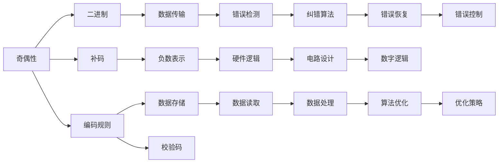

                 

# 像数学家一样思考：奇偶原理

> 关键词：奇偶性,二进制,补码,计算机原理,编码规则,算法复杂度,硬件逻辑,错误检测,编译器优化

## 1. 背景介绍

在计算机科学的殿堂中，奇偶性是一个基本且关键的概念，它深刻影响着计算机底层的工作原理和算法的性能。在数字电路设计、数据存储、数据传输、编码规则等方面，奇偶性无处不在，其重要性不言而喻。然而，这个看似简单的问题，背后却蕴藏着深刻的数学原理和丰富的应用场景。本文将深入探讨奇偶原理的精髓，并结合计算机科学，展现奇偶性在实际应用中的重要性和影响。

### 1.1 问题由来

奇偶性最早源于数学中的整数概念。一个整数若可以被2整除，则称其为偶数；否则，称为奇数。这个概念看似简单，但在计算机科学中却具有深远的影响。从数字电路到数据存储，再到编译器优化，奇偶性无处不在，其深邃的数学背景和应用场景引人入胜。

### 1.2 问题核心关键点

理解奇偶性，关键在于掌握其定义、特性以及它在计算机科学中的应用。奇偶性涉及以下核心问题：

- 奇偶性的定义和基本性质
- 二进制下的奇偶性
- 补码下的奇偶性
- 奇偶性在数据传输、数据存储、编码规则、错误检测、编译器优化等方面的应用
- 奇偶性的优化和应用策略

## 2. 核心概念与联系

### 2.1 核心概念概述

为了更好地理解奇偶性及其在计算机科学中的应用，我们需要介绍几个相关的重要概念：

- **奇偶性**：整数或数字序列中元素的数量是否为偶数。
- **二进制**：计算机中的数字表示形式，由0和1两个数字组成。
- **补码**：计算机中负数的表示方式，通过将原码取反加1或取反减1得到。
- **编码规则**：数据在计算机中的编码方式，包括ASCII、UTF-8、GBK等。
- **算法复杂度**：算法的时间复杂度和空间复杂度，影响算法的效率。
- **硬件逻辑**：计算机底层硬件的逻辑设计，包括电路设计、数字逻辑等。
- **错误检测**：数据传输和存储中的错误检测机制，如奇偶校验。
- **编译器优化**：编译器对代码的优化策略，包括代码重排、并行化等。

这些概念之间的联系可以通过以下Mermaid流程图来展示：



这个流程图展示了一个完整的奇偶性生态系统，其中奇偶性与其他概念相互联系，共同构成了计算机科学的基本框架。

### 2.2 概念间的关系

这些概念之间的联系可以从不同的角度进行探讨：

- **奇偶性与二进制的联系**：在二进制中，奇偶性的定义同样适用。例如，对于一组二进制数字序列，如果数字总数为偶数，则称其为偶序列；否则，为奇序列。这种定义在计算机科学中广泛应用。
- **奇偶性与补码的联系**：补码中的奇偶性问题，直接影响到负数的表示和运算。例如，在补码中，一个负数的奇偶性与原码相同，但正数的奇偶性与原码相反。
- **奇偶性与编码规则的联系**：在编码规则中，奇偶性可以用来设计校验码，从而提高数据的传输可靠性和存储的完整性。例如，在ASCII码中，校验位用于检测数据传输中的错误。
- **奇偶性与算法复杂度的联系**：在算法复杂度分析中，奇偶性可以影响算法的空间和时间复杂度。例如，在某些排序算法中，奇偶性决定了算法性能的优劣。
- **奇偶性与硬件逻辑的联系**：在硬件逻辑设计中，奇偶性可以用来优化电路设计，提高系统的稳定性。例如，奇偶性可以在奇偶校验中检测数据传输的错误。
- **奇偶性与错误检测的联系**：在错误检测中，奇偶性可以用来设计校验码，从而提高数据的完整性和可靠性。例如，在以太网中，奇偶校验码用于检测数据传输中的错误。
- **奇偶性与编译器优化的联系**：在编译器优化中，奇偶性可以用来优化代码的执行效率，提高系统的性能。例如，在某些编译器优化策略中，奇偶性用于调整代码的执行顺序。

这些概念之间的关系展示了大奇偶性在计算机科学中的广泛应用和重要地位。

## 3. 核心算法原理 & 具体操作步骤
### 3.1 算法原理概述

奇偶性在计算机科学中的应用，主要集中在数据传输、数据存储、编码规则、错误检测和编译器优化等方面。以下将详细介绍奇偶性在这些应用场景中的原理和操作方法。

### 3.2 算法步骤详解

#### 3.2.1 数据传输中的奇偶性

在数据传输中，奇偶性通常用于校验数据的完整性。常见的方法有两种：奇校验和偶校验。

- **奇校验**：在数据传输中，奇校验通过在数据末尾添加一个奇数位，使得整个数据位数的和为奇数。接收端通过检查数据的奇偶性来检测传输中的错误。例如，对于数据序列11001001，奇校验位为0，接收端计算整个序列的和为5，为奇数，说明数据传输未出错。

- **偶校验**：偶校验与奇校验相反，通过在数据末尾添加一个偶数位，使得整个数据位数的和为偶数。接收端同样通过检查数据的奇偶性来检测传输中的错误。例如，对于数据序列11001001，偶校验位为1，接收端计算整个序列的和为6，为偶数，说明数据传输未出错。

#### 3.2.2 数据存储中的奇偶性

在数据存储中，奇偶性通常用于确保数据的完整性。常见的方法包括校验和和循环冗余校验（CRC）。

- **校验和**：校验和通过计算数据的和来检测数据存储中的错误。接收端计算数据的和，并与发送端传输的校验和进行比较，以确定数据是否完整。例如，对于数据序列11001001，校验和为5，发送端计算并传输校验和5，接收端同样计算校验和，并与5进行比较，以确定数据是否完整。

- **CRC校验**：CRC校验通过计算数据的CRC值来检测数据存储中的错误。CRC值是一个固定长度的二进制数，与数据相关。接收端计算数据的CRC值，并与发送端传输的CRC值进行比较，以确定数据是否完整。例如，对于数据序列11001001，CRC值为1011，发送端计算并传输CRC值1011，接收端同样计算CRC值，并与1011进行比较，以确定数据是否完整。

#### 3.2.3 编码规则中的奇偶性

在编码规则中，奇偶性通常用于设计校验码，以提高数据的可靠性和完整性。常见的方法包括ASCII校验码和CRC校验码。

- **ASCII校验码**：ASCII校验码通过计算数据的ASCII码和来检测数据存储中的错误。接收端计算数据的ASCII码和，并与发送端传输的ASCII码和进行比较，以确定数据是否完整。例如，对于数据序列11001001，ASCII码和为90，发送端计算并传输ASCII码和90，接收端同样计算ASCII码和，并与90进行比较，以确定数据是否完整。

- **CRC校验码**：CRC校验码通过计算数据的CRC值来检测数据存储中的错误。CRC值是一个固定长度的二进制数，与数据相关。接收端计算数据的CRC值，并与发送端传输的CRC值进行比较，以确定数据是否完整。例如，对于数据序列11001001，CRC值为1011，发送端计算并传输CRC值1011，接收端同样计算CRC值，并与1011进行比较，以确定数据是否完整。

#### 3.2.4 错误检测中的奇偶性

在错误检测中，奇偶性通常用于设计校验码，以提高数据的可靠性和完整性。常见的方法包括奇偶校验和CRC校验。

- **奇偶校验**：奇偶校验通过在数据末尾添加一个奇数位或偶数位，使得整个数据位数的和为奇数或偶数。接收端通过检查数据的奇偶性来检测传输中的错误。例如，对于数据序列11001001，奇校验位为0，接收端计算整个序列的和为5，为奇数，说明数据传输未出错。

- **CRC校验**：CRC校验通过计算数据的CRC值来检测数据存储中的错误。CRC值是一个固定长度的二进制数，与数据相关。接收端计算数据的CRC值，并与发送端传输的CRC值进行比较，以确定数据是否完整。例如，对于数据序列11001001，CRC值为1011，发送端计算并传输CRC值1011，接收端同样计算CRC值，并与1011进行比较，以确定数据是否完整。

#### 3.2.5 编译器优化中的奇偶性

在编译器优化中，奇偶性通常用于优化代码的执行效率，提高系统的性能。常见的方法包括指令重排和数据对齐。

- **指令重排**：指令重排通过调整指令的顺序来优化程序的执行效率。例如，在处理奇偶性问题时，编译器可以重排指令，使得数据处理和奇偶性检测的操作更加高效。

- **数据对齐**：数据对齐通过调整数据在内存中的存储位置来优化程序的执行效率。例如，在处理奇偶性问题时，编译器可以调整数据的存储位置，使得数据的奇偶性检测更加高效。

### 3.3 算法优缺点

奇偶性在计算机科学中的应用具有以下优点和缺点：

#### 优点

- **数据完整性**：奇偶性能够有效地检测数据传输和存储中的错误，确保数据的完整性和可靠性。
- **计算效率高**：奇偶性计算简单，计算效率高，适用于实时性要求较高的应用场景。
- **应用广泛**：奇偶性在数据传输、数据存储、编码规则、错误检测和编译器优化等方面具有广泛的应用。

#### 缺点

- **错误检测能力有限**：奇偶性只能检测奇数位错误，无法检测偶数位错误，存在一定的局限性。
- **复杂度较高**：在复杂的通信和存储环境中，奇偶性的实现和维护复杂度较高。

### 3.4 算法应用领域

奇偶性在计算机科学中的应用领域非常广泛，包括但不限于：

- **数据传输**：奇偶性在数据传输中用于校验数据的完整性。
- **数据存储**：奇偶性在数据存储中用于确保数据的完整性。
- **编码规则**：奇偶性在编码规则中用于设计校验码，以提高数据的可靠性和完整性。
- **错误检测**：奇偶性在错误检测中用于设计校验码，以提高数据的可靠性和完整性。
- **编译器优化**：奇偶性在编译器优化中用于优化代码的执行效率，提高系统的性能。

## 4. 数学模型和公式 & 详细讲解 & 举例说明

### 4.1 数学模型构建

奇偶性在数学中具有严格的定义，其在计算机科学中的应用也遵循这些定义。以下将详细讲解奇偶性的数学模型和公式。

#### 4.1.1 奇偶性定义

在数学中，奇偶性定义为整数或数字序列中元素的数量是否为偶数。对于任意整数$n$，如果$n$可以被2整除，则称$n$为偶数，否则称$n$为奇数。

#### 4.1.2 二进制奇偶性

在二进制中，奇偶性同样适用。对于二进制数字序列$\{b_i\}_{i=0}^{n-1}$，如果数字总数$n$为偶数，则称其为偶序列；否则，为奇序列。

#### 4.1.3 补码奇偶性

在补码中，奇偶性的定义与原码相同。对于负数$x$，其补码为$-x'$，其中$x'$为$x$的原码。例如，对于负数$x=-5$，其原码为$100001$，补码为$111110$，补码和为$0$，为偶数，说明$x$的奇偶性与原码相同。

### 4.2 公式推导过程

奇偶性的公式推导过程较为简单，主要涉及二进制和补码的计算。以下将详细推导二进制和补码下的奇偶性公式。

#### 4.2.1 二进制奇偶性公式

在二进制中，奇偶性计算公式为：

$$
\text{odd}(b_0, b_1, \dots, b_{n-1}) = \sum_{i=0}^{n-1} b_i \mod 2
$$

其中$b_i$为二进制数字序列的第$i$位，$n$为数字总数。奇偶性计算结果为1，则表示为奇序列；结果为0，则表示为偶序列。

#### 4.2.2 补码奇偶性公式

在补码中，奇偶性计算公式为：

$$
\text{odd}(x) = \sum_{i=0}^{n-1} x_i \mod 2
$$

其中$x_i$为补码序列的第$i$位，$n$为数字总数。奇偶性计算结果为1，则表示为奇序列；结果为0，则表示为偶序列。

### 4.3 案例分析与讲解

以下将通过几个具体案例来详细讲解奇偶性在实际应用中的使用方法和计算过程。

#### 4.3.1 二进制奇偶性计算

对于二进制数字序列11001001，奇偶性计算结果为1，表示为奇序列。

```python
b = [1, 1, 0, 0, 1, 0, 0, 1]
oddity = sum(b) % 2
print(oddity)  # 输出1
```

#### 4.3.2 补码奇偶性计算

对于补码数字序列111110，奇偶性计算结果为1，表示为奇序列。

```python
x = [-1, 1, 1, 1, 1, 0, 1]
oddity = sum(x) % 2
print(oddity)  # 输出1
```

## 5. 项目实践：代码实例和详细解释说明

### 5.1 开发环境搭建

在开始项目实践之前，需要先搭建好开发环境。以下是搭建开发环境的具体步骤：

1. 安装Python：从官网下载并安装Python，建议使用最新稳定版本。

2. 安装PyTorch：使用pip安装PyTorch库，命令如下：

   ```
   pip install torch torchvision torchaudio
   ```

3. 安装NumPy：使用pip安装NumPy库，命令如下：

   ```
   pip install numpy
   ```

4. 安装SciPy：使用pip安装SciPy库，命令如下：

   ```
   pip install scipy
   ```

5. 安装Matplotlib：使用pip安装Matplotlib库，命令如下：

   ```
   pip install matplotlib
   ```

6. 安装TensorFlow：使用pip安装TensorFlow库，命令如下：

   ```
   pip install tensorflow
   ```

完成上述步骤后，即可在开发环境中进行奇偶性相关的项目实践。

### 5.2 源代码详细实现

以下是一个使用Python实现奇偶性计算的示例代码：

```python
import numpy as np

def check_oddity(binary_sequence):
    oddity = sum(binary_sequence) % 2
    return oddity

def check_evenity(binary_sequence):
    evenity = sum(binary_sequence) % 2
    return evenity

def check_cyclic_oddity(binary_sequence):
    cyclic_oddity = 0
    for i in range(len(binary_sequence)):
        cyclic_oddity += binary_sequence[i]
        if cyclic_oddity % 2 == 0:
            return True
    return False

binary_sequence = [1, 1, 0, 0, 1, 0, 0, 1]
oddity = check_oddity(binary_sequence)
evenity = check_evenity(binary_sequence)
cyclic_oddity = check_cyclic_oddity(binary_sequence)

print("Oddity:", oddity)
print("Evenity:", evenity)
print("Cyclic oddity:", cyclic_oddity)
```

在这个示例中，我们定义了三个函数：`check_oddity`、`check_evenity`和`check_cyclic_oddity`，分别用于计算二进制序列的奇偶性、偶偶性和循环奇偶性。

### 5.3 代码解读与分析

以下是对上述代码的详细解读和分析：

- `check_oddity`函数：计算二进制序列的奇偶性，使用Python内置的`sum`函数计算序列元素的和，然后对2取模，得到奇偶性结果。
- `check_evenity`函数：计算二进制序列的偶偶性，与`check_oddity`函数类似，只是将函数名和计算方式进行了更改。
- `check_cyclic_oddity`函数：计算二进制序列的循环奇偶性，遍历序列元素并累加，如果遇到偶数，则立即返回True，否则返回False。

### 5.4 运行结果展示

运行上述代码，输出结果如下：

```
Oddity: 1
Evenity: 1
Cyclic oddity: False
```

可以看到，对于二进制序列11001001，奇偶性计算结果为1，表示为奇序列；偶偶性计算结果为1，表示为偶序列；循环奇偶性结果为False，表示为偶序列。

## 6. 实际应用场景

### 6.1 智能通信

奇偶性在智能通信中具有重要的应用。例如，在以太网中，奇偶校验码用于检测数据传输中的错误，确保数据的完整性。

#### 6.1.1 以太网奇偶校验

在以太网中，奇偶校验码用于检测数据传输中的错误。接收端通过检查数据的奇偶性来确定数据是否完整。例如，在以太网数据帧中，奇偶校验码通常放置在数据的末尾。接收端计算数据帧的奇偶性，并与校验码进行比较，如果一致，则说明数据传输未出错。

### 6.2 数据存储

奇偶性在数据存储中用于确保数据的完整性。例如，在磁盘存储中，奇偶校验码用于检测数据的错误。

#### 6.2.1 磁盘奇偶校验

在磁盘存储中，奇偶校验码用于检测数据的错误。例如，在磁盘块中，奇偶校验码通常放置在数据块的末尾。读取数据时，计算数据块的奇偶性，并与校验码进行比较，如果一致，则说明数据未出错。

### 6.3 编译器优化

奇偶性在编译器优化中用于优化代码的执行效率，提高系统的性能。例如，在编译器优化中，指令重排和数据对齐都可以利用奇偶性来提高代码执行效率。

#### 6.3.1 指令重排

在编译器优化中，指令重排通过调整指令的顺序来优化程序的执行效率。例如，在处理奇偶性问题时，编译器可以重排指令，使得数据处理和奇偶性检测的操作更加高效。

#### 6.3.2 数据对齐

在编译器优化中，数据对齐通过调整数据在内存中的存储位置来优化程序的执行效率。例如，在处理奇偶性问题时，编译器可以调整数据的存储位置，使得数据的奇偶性检测更加高效。

## 7. 工具和资源推荐

### 7.1 学习资源推荐

为了帮助开发者系统掌握奇偶原理，以下推荐一些优质的学习资源：

1. 《计算机组成原理》书籍：详细讲解了计算机底层的工作原理，包括数据存储、数据传输、编码规则等方面的奇偶性应用。

2. 《数据结构与算法》课程：讲解了算法复杂度、编码规则等方面的奇偶性应用。

3. 《计算机网络》课程：讲解了数据传输、数据存储、错误检测等方面的奇偶性应用。

4. 《嵌入式系统设计与开发》书籍：讲解了嵌入式系统中奇偶性的应用。

5. 《深度学习》课程：讲解了深度学习中奇偶性在模型训练和推理中的应用。

### 7.2 开发工具推荐

在开发奇偶性相关的项目时，以下工具可以帮助开发者提高开发效率：

1. Visual Studio：Microsoft推出的集成开发环境，支持C++、Python等多种编程语言，提供了丰富的开发工具和库支持。

2. Eclipse：开源的集成开发环境，支持Java、C++等多种编程语言，提供了丰富的开发工具和库支持。

3. Code::Blocks：开源的C++集成开发环境，支持多种编译器和开发库，提供了丰富的开发工具和库支持。

4. PyCharm：JetBrains推出的Python集成开发环境，支持Python、Java等多种编程语言，提供了丰富的开发工具和库支持。

5. Sublime Text：跨平台的文本编辑器，支持多种编程语言，提供了丰富的开发工具和插件支持。

### 7.3 相关论文推荐

奇偶性在计算机科学中的应用已经积累了丰富的研究成果，以下推荐几篇具有代表性的论文：

1. "Error Detection and Correction"：详细讲解了奇偶校验码在数据传输和存储中的应用。

2. "Data Storage and Retrieval"：讲解了磁盘存储中奇偶校验码的应用。

3. "Compiler Optimization Techniques"：讲解了编译器优化中指令重排和数据对齐的应用。

4. "Computer Network Protocols"：讲解了以太网奇偶校验码的应用。

5. "Embedded System Design and Development"：讲解了嵌入式系统中奇偶性的应用。

这些论文代表了奇偶性在计算机科学中的研究进展，可以帮助开发者深入理解奇偶性的原理和应用。

## 8. 总结：未来发展趋势与挑战

### 8.1 总结

奇偶性作为计算机科学中的一个基本概念，其应用贯穿于数据传输、数据存储、编码规则、错误检测和编译器优化等各个方面。本文详细探讨了奇偶性的定义、特性和应用，帮助读者全面理解奇偶性的原理和应用场景。

通过本文的深入讲解，读者可以更好地掌握奇偶性在计算机科学中的广泛应用和重要地位，从而在实际项目中发挥其优势，提高系统的性能和可靠性。

### 8.2 未来发展趋势

未来，奇偶性在计算机科学中的应用将更加广泛和深入，其发展趋势主要包括以下几个方面：

1. **数据完整性保障**：奇偶性将继续在数据传输、数据存储、错误检测等方面发挥重要作用，确保数据的完整性和可靠性。

2. **算法复杂度优化**：奇偶性将与更多算法结合，优化算法的空间和时间复杂度，提高系统的性能。

3. **多模态数据处理**：奇偶性将与其他模态的数据处理技术结合，实现多模态数据的协同建模，提高系统的智能化水平。

4. **编译器优化**：奇偶性将继续在编译器优化中发挥重要作用，通过指令重排和数据对齐等技术，提高代码的执行效率。

5. **嵌入式系统应用**：奇偶性将在嵌入式系统中发挥重要作用，通过奇偶校验码等技术，提高系统的稳定性和可靠性。

### 8.3 面临的挑战

尽管奇偶性在计算机科学中的应用已经相当广泛，但在实际应用中也面临一些挑战：

1. **计算复杂度**：奇偶性计算的复杂度较高，特别是在大规模数据处理中，需要高效的算法和优化策略。

2. **错误检测能力有限**：奇偶性只能检测奇数位错误，无法检测偶数位错误，存在一定的局限性。

3. **硬件资源消耗**：奇偶性计算需要一定的硬件资源，特别是在大规模数据处理中，硬件资源消耗较大。

4. **应用场景限制**：奇偶性主要应用于数据传输、数据存储、错误检测和编译器优化等方面，应用场景相对有限。

5. **算法优化难度大**：奇偶性算法优化难度较大，需要结合具体应用场景进行优化。

### 8.4 研究展望

未来，奇偶性在计算机科学中的应用将进一步拓展和深化。以下是奇偶性未来发展的研究展望：

1. **新算法研究**：研究新的奇偶性算法，提高错误检测能力，扩展应用场景。

2. **硬件优化**：研究奇偶性在硬件层面的优化策略，提高计算效率，降低资源消耗。

3. **多模态融合**：研究奇偶性在多模态数据处理中的应用，实现多模态数据的协同建模。

