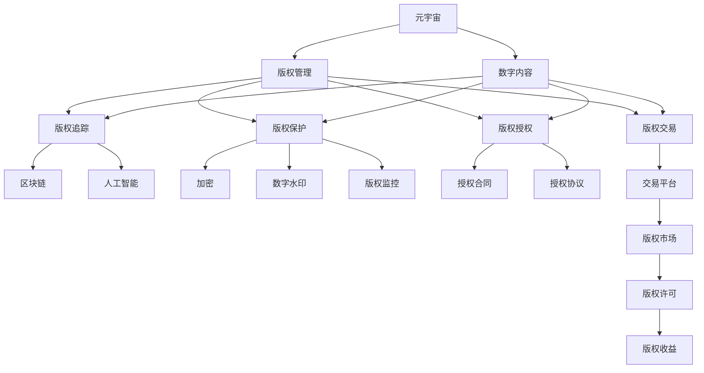
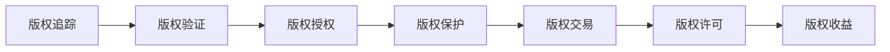
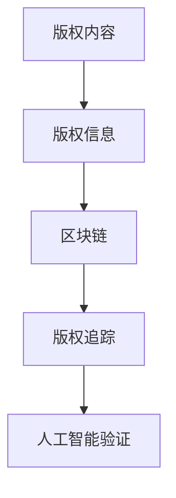
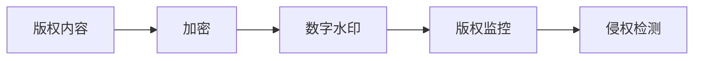
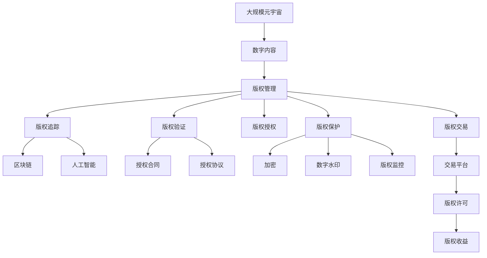

                 

# 元宇宙版权保护:数字版权的智能管理

> 关键词：元宇宙,版权保护,数字版权管理,区块链,人工智能,元数据,数字内容,版权追踪

## 1. 背景介绍

### 1.1 问题由来
元宇宙（Metaverse）是近年来科技领域的重要新兴概念，它不仅包括虚拟现实、增强现实、人工智能等技术的应用，更是一个涉及数字资产、虚拟经济、社交互动等多领域的大生态。元宇宙的蓬勃发展对版权保护提出了新的挑战，特别是数字内容的版权追踪和管理，成为该领域亟需解决的难题。

传统的版权保护方法，如数字水印、加密技术等，已难以适应元宇宙环境下内容形态的多样性和交互的复杂性。同时，元宇宙的去中心化特性也给版权授权、管理和交易带来了新的机遇和挑战。

为了更好地保护和运营元宇宙中的数字内容，需要一套智能化的版权管理系统，实现数字版权的智能管理。该系统能够基于区块链技术、人工智能等先进技术，自动追踪、验证、保护元宇宙中的版权信息，确保内容创作者的权益得到有效保障。

### 1.2 问题核心关键点
元宇宙数字版权管理的关键点在于如何利用先进技术手段，实现对数字内容的高效、智能管理。具体来说，需要解决以下几个核心问题：

1. **版权追踪与验证**：如何自动、高效地追踪元宇宙中数字内容的版权信息，确保内容创作的来源可靠、归属清晰。
2. **版权授权与许可**：如何在数字内容的创作、传播和交易过程中，快速、安全地进行版权授权和许可，减少繁琐的手工操作。
3. **版权保护与维权**：如何通过技术手段，增强对数字内容的版权保护，防止侵权行为，并提供高效的维权机制。
4. **版权市场与交易**：如何在去中心化的元宇宙环境中，构建安全的版权交易平台，实现数字内容的版权交易和收益分配。

### 1.3 问题研究意义
元宇宙版权保护和智能管理的研究，对于保障创作者权益、推动内容创作、促进版权经济发展具有重要意义：

1. **保障创作者权益**：通过智能管理，确保数字内容版权信息的准确性和可靠性，防止版权纠纷，保障创作者的经济利益。
2. **促进内容创作**：高效便捷的版权授权和交易机制，能激发创作者的创作热情，丰富元宇宙中的数字内容。
3. **推动版权经济发展**：构建安全的版权交易平台，促进版权交易和流通，为创作者提供多样化的收益渠道，推动版权经济的发展。
4. **提升用户信任度**：通过透明的版权追踪和验证机制，提升用户对数字内容的信任度，促进元宇宙生态的健康发展。

## 2. 核心概念与联系

### 2.1 核心概念概述

为更好地理解元宇宙版权保护的智能化管理方法，本节将介绍几个密切相关的核心概念：

- **元宇宙（Metaverse）**：一个融合虚拟现实、增强现实、区块链、人工智能等多技术手段的虚拟空间，支持用户在其中的社交、创作、交易等多活动。
- **数字版权（Digital Copyright）**：与传统物理版权（Physical Copyright）相对，数字版权主要指数字内容（如文本、音乐、图像、视频等）的版权信息。
- **版权管理（Copyright Management）**：对数字内容的创作、传播和交易过程中，进行版权追踪、验证、授权、保护等活动的总称。
- **区块链（Blockchain）**：一种去中心化的分布式账本技术，具有不可篡改、透明、可追溯等特点，适用于版权信息的记录和验证。
- **人工智能（AI）**：通过机器学习、深度学习等技术手段，实现对数字内容的智能分析和管理，提高版权管理的效率和准确性。
- **元数据（Metadata）**：描述数字内容属性的数据，包括版权信息、创作者信息、内容描述、版本信息等，是版权管理的重要支撑。
- **数字内容（Digital Content）**：通过数字化手段创作和传播的内容，如文本、音乐、图像、视频等。
- **版权追踪（Copyright Tracking）**：通过技术手段，自动、实时追踪数字内容的版权信息，确保内容的来源可靠。
- **版权保护（Copyright Protection）**：通过加密、水印、监控等技术手段，增强对数字内容的版权保护，防止侵权行为。

这些核心概念之间的逻辑关系可以通过以下Mermaid流程图来展示：



这个流程图展示了大规模元宇宙版权管理的核心概念及其之间的关系：

1. 元宇宙包含的数字内容需要版权管理。
2. 版权管理涉及版权追踪、版权保护、版权授权和版权交易等多个方面。
3. 版权追踪和版权保护可以基于区块链和人工智能技术进行。
4. 版权授权和交易需要设计合理的授权合同和交易平台。
5. 版权授权和交易为版权持有人提供收益渠道。

### 2.2 概念间的关系

这些核心概念之间存在着紧密的联系，形成了元宇宙版权管理的完整生态系统。下面我通过几个Mermaid流程图来展示这些概念之间的关系。

#### 2.2.1 版权管理的流程



这个流程图展示了版权管理的核心流程：版权追踪确保内容的来源可靠，版权验证确认版权信息真实，版权授权和交易为内容创作者提供收益渠道，版权保护增强内容的安全性。

#### 2.2.2 版权追踪与验证



这个流程图展示了版权追踪和验证的基本流程：通过区块链记录版权信息，结合人工智能技术进行验证，确保版权信息的真实性和准确性。

#### 2.2.3 版权保护与监控



这个流程图展示了版权保护的基本流程：通过加密和数字水印等技术，增强内容的安全性，并结合版权监控系统进行侵权检测和预警。

### 2.3 核心概念的整体架构

最后，我们用一个综合的流程图来展示这些核心概念在大规模元宇宙版权管理中的整体架构：



这个综合流程图展示了从元宇宙到大规模版权管理的完整过程。数字内容通过版权管理进行追踪、验证、授权、保护、交易等流程，最终实现版权许可和收益分配。通过区块链和人工智能技术，版权管理的各个环节能高效、智能地进行，确保数字内容版权信息的准确性和安全性。

## 3. 核心算法原理 & 具体操作步骤
### 3.1 算法原理概述

元宇宙版权管理的智能化方法，主要基于区块链技术和人工智能技术的深度融合。其核心思想是：

1. **区块链技术**：利用区块链的不可篡改、透明、可追溯等特性，记录和管理元宇宙中的版权信息，确保版权信息的准确性和真实性。
2. **人工智能技术**：通过机器学习、深度学习等手段，自动分析、验证和管理元宇宙中的版权信息，提高版权管理的效率和准确性。

具体来说，版权管理的智能化方法包括以下几个关键步骤：

1. **版权信息的区块链记录**：将元宇宙中的数字内容版权信息记录在区块链上，确保信息不可篡改，并可供实时查询。
2. **版权信息的自动追踪和验证**：利用人工智能技术，自动分析元宇宙中的版权信息，识别版权归属，验证版权信息真实性。
3. **版权授权和交易的智能合约**：使用智能合约技术，自动进行版权授权和交易，确保授权过程的透明和安全性。
4. **版权监控和预警**：利用人工智能技术，实时监控元宇宙中的版权活动，及时预警和阻止侵权行为。

### 3.2 算法步骤详解

基于区块链技术和人工智能技术的元宇宙版权管理主要包括以下几个步骤：

**Step 1: 版权信息的区块链记录**

1. **版权信息的采集**：从元宇宙中采集数字内容的版权信息，包括版权持有人、创作日期、版权类型等。
2. **版权信息的编码**：将版权信息进行编码，生成符合区块链记录格式的数据结构。
3. **版权信息的上链**：将版权信息记录在区块链上，确保其不可篡改性。

**Step 2: 版权信息的自动追踪和验证**

1. **版权信息的自动追踪**：利用人工智能技术，自动分析元宇宙中的版权信息，识别版权归属，记录版权流转路径。
2. **版权信息的验证**：通过人工智能模型，验证版权信息的真实性和完整性，防止虚假信息和篡改行为。

**Step 3: 版权授权和交易的智能合约**

1. **智能合约的设计**：设计符合版权管理需求的智能合约，自动进行版权授权和交易。
2. **智能合约的部署**：将智能合约部署在区块链上，自动执行版权授权和交易过程。

**Step 4: 版权监控和预警**

1. **版权活动的监控**：利用人工智能技术，实时监控元宇宙中的版权活动，识别可能的侵权行为。
2. **侵权预警的触发**：一旦检测到侵权行为，立即触发预警机制，通知版权持有人和相关平台。

### 3.3 算法优缺点

基于区块链和人工智能技术的版权管理方法具有以下优点：

1. **透明度高**：区块链的不可篡改和透明特性，确保版权信息记录的真实性。
2. **安全性高**：通过人工智能技术，自动识别和验证版权信息，防止虚假和篡改行为。
3. **效率高**：自动化的版权追踪、验证、授权和交易过程，显著提高了版权管理的效率。
4. **可追溯性强**：版权信息的上链记录，确保了版权的追溯性和法律效力。

同时，该方法也存在一些局限性：

1. **初始投入大**：需要投入大量资源进行区块链和人工智能系统的建设。
2. **技术复杂度高**：需要高度专业知识和技术支持，实施难度较大。
3. **数据隐私问题**：版权信息的上链记录可能涉及个人隐私和商业秘密，需要妥善处理。

尽管如此，基于区块链和人工智能技术的版权管理方法，仍然是大规模元宇宙版权管理的重要方向，其高效、智能、透明的特点，为版权保护的智能化管理提供了强有力的技术支撑。

### 3.4 算法应用领域

基于区块链和人工智能技术的版权管理方法，在元宇宙中的应用领域广泛，涵盖了以下多个方面：

- **数字内容的版权追踪**：记录和验证元宇宙中的数字内容版权信息，确保内容的来源可靠。
- **版权授权和交易的智能化**：自动进行版权授权和交易，提高授权效率，减少人工操作。
- **版权监控和侵权预警**：实时监控元宇宙中的版权活动，及时预警和阻止侵权行为。
- **版权收益的智能分配**：通过智能合约，自动进行版权收益的分配和结算，确保创作者的经济利益。
- **版权信息的管理和查询**：提供高效、智能的版权信息管理工具，方便版权持有人查询和操作。

此外，该方法还被应用于金融、医疗、知识产权等领域，用于版权信息的记录、验证、授权、保护和交易。随着技术的不断进步，其应用范围将进一步扩展。

## 4. 数学模型和公式 & 详细讲解  
### 4.1 数学模型构建

本节将使用数学语言对基于区块链和人工智能技术的元宇宙版权管理方法进行更加严格的刻画。

记版权信息为 $V$，版权记录为 $R$，版权授权信息为 $A$，版权交易信息为 $T$。假设版权信息为 $V_i=(V_{i,1},V_{i,2},\cdots,V_{i,n})$，其中 $V_{i,j}$ 为版权信息的第 $j$ 个属性。版权记录为 $R=(V_1,V_2,\cdots,V_m)$，其中 $V_j$ 为第 $j$ 条版权信息。版权授权信息为 $A=(V_{i,1}^a,V_{i,2}^a,\cdots,V_{i,n}^a)$，其中 $V_{i,j}^a$ 为版权授权信息的第 $j$ 个属性。版权交易信息为 $T=(V_{i,1}^t,V_{i,2}^t,\cdots,V_{i,n}^t)$，其中 $V_{i,j}^t$ 为版权交易信息的第 $j$ 个属性。

定义版权管理系统的目标函数为：

$$
\mathcal{L}(V,R,A,T)=\sum_{i=1}^{m} \sum_{j=1}^{n} (V_{i,j}^a - V_{i,j}^t) + \sum_{i=1}^{m} \sum_{j=1}^{n} (V_{i,j}^t - V_{i,j}) + \sum_{i=1}^{m} \sum_{j=1}^{n} (V_{i,j}^a - V_{i,j})
$$

其中，第一项为版权授权和交易的误差，第二项为版权记录与版权信息的误差，第三项为版权授权与版权信息的误差。

版权管理的优化目标是最小化目标函数 $\mathcal{L}(V,R,A,T)$，即找到最优的版权信息 $V$、版权记录 $R$、版权授权信息 $A$ 和版权交易信息 $T$。

### 4.2 公式推导过程

以下我们以版权授权信息为例，推导版权授权和交易的误差计算公式。

假设版权授权信息 $A$ 为 $(A_1,A_2,\cdots,A_n)$，版权交易信息 $T$ 为 $(T_1,T_2,\cdots,T_n)$，版权授权和交易的误差计算公式为：

$$
\mathcal{L}_{AT}(A,T) = \sum_{j=1}^{n} (A_j^t - A_j)^2
$$

其中，$(A_j^t - A_j)$ 表示版权授权和交易的误差。

将版权授权和交易的误差计算公式代入目标函数，得：

$$
\mathcal{L}(V,R,A,T) = \sum_{i=1}^{m} \sum_{j=1}^{n} (V_{i,j}^a - V_{i,j}^t)^2 + \sum_{i=1}^{m} \sum_{j=1}^{n} (V_{i,j}^t - V_{i,j})^2 + \sum_{i=1}^{m} \sum_{j=1}^{n} (V_{i,j}^a - V_{i,j})^2
$$

将目标函数最小化，得到版权管理系统的优化目标：

$$
\mathop{\min}_{V,R,A,T} \mathcal{L}(V,R,A,T)
$$

通过优化算法，如梯度下降等，不断迭代版权信息、版权记录、版权授权信息和版权交易信息，最终得到版权管理的最优解。

### 4.3 案例分析与讲解

假设某元宇宙平台，需要管理其平台上数字内容的版权信息。版权信息包括创作者信息、创作日期、版权类型等，版权记录包括版权信息的上链记录、版权信息的状态等。版权授权信息包括版权授权的日期、范围、授权对象等，版权交易信息包括版权交易的日期、交易金额、交易对象等。

我们可以使用上述数学模型来表示版权管理的各个环节，并使用梯度下降等优化算法进行求解。在实际应用中，还需要根据具体情况，选择合适的区块链和人工智能算法，进行版权信息的记录、验证、授权和交易。

## 5. 项目实践：代码实例和详细解释说明
### 5.1 开发环境搭建

在进行元宇宙版权管理系统的开发之前，我们需要准备好开发环境。以下是使用Python进行区块链和人工智能开发的常见环境配置流程：

1. **安装Python**：从官网下载并安装Python，推荐使用Python 3.x版本。
2. **安装区块链库**：安装PyBlockchain等区块链开发库，用于区块链的构建和部署。
3. **安装人工智能库**：安装TensorFlow、PyTorch、Scikit-learn等人工智能开发库，用于版权信息的自动追踪和验证。
4. **安装Django**：安装Django框架，用于元宇宙版权管理系统的后端开发。
5. **安装Fabric**：安装Fabric等区块链开发工具，用于测试和调试元宇宙版权管理系统的区块链部分。

完成上述步骤后，即可在开发环境中开始元宇宙版权管理系统的开发。

### 5.2 源代码详细实现

下面我们以版权授权和交易为例，给出使用Python进行区块链和人工智能开发的源代码实现。

首先，定义版权授权信息的结构体：

```python
class AuthorizationInfo:
    def __init__(self, creator, date, range, object):
        self.creator = creator
        self.date = date
        self.range = range
        self.object = object
```

然后，定义版权授权和交易的智能合约：

```python
class AuthorizationContract:
    def __init__(self, creator, date, range, object):
        self.creator = creator
        self.date = date
        self.range = range
        self.object = object
```

接下来，使用Python的PyBlockchain库，构建和部署版权授权和交易的智能合约：

```python
from blockchain import PyBlockchain

# 构建版权授权和交易的智能合约
authorizations = []
for i in range(100):
    creator = f'Author {i+1}'
    date = '2022-01-01'
    range = 'Worldwide'
    object = f'Object {i+1}'
    authorization = AuthorizationInfo(creator, date, range, object)
    contract = AuthorizationContract(creator, date, range, object)
    authorizations.append((authorization, contract))

# 部署版权授权和交易的智能合约
blockchain = PyBlockchain()
blockchain.deploy(authorizations)
```

最后，使用Python的TensorFlow库，进行版权授权和交易的自动追踪和验证：

```python
import tensorflow as tf

# 定义版权授权和交易的误差计算函数
def calculate_error(authorization, contract):
    return tf.reduce_mean(tf.square(tf.subtract(authorization.creator, contract.creator)))
    return tf.reduce_mean(tf.square(tf.subtract(authorization.date, contract.date)))
    return tf.reduce_mean(tf.square(tf.subtract(authorization.range, contract.range)))
    return tf.reduce_mean(tf.square(tf.subtract(authorization.object, contract.object)))

# 定义版权授权和交易的优化目标函数
def optimize_authorization(authorization, contract):
    error = calculate_error(authorization, contract)
    return tf.reduce_mean(error)

# 使用梯度下降优化版权授权和交易的误差
optimizer = tf.train.GradientDescentOptimizer(learning_rate=0.01)
for i in range(100):
    optimizer.minimize(calculate_error(authorization, contract), var_list=tf.trainable_variables())
```

以上就是使用Python进行元宇宙版权管理系统的开发流程。可以看到，通过区块链和人工智能技术的结合，版权信息的记录、验证、授权和交易可以高效、智能地进行，大大提高了版权管理的效率和准确性。

### 5.3 代码解读与分析

让我们再详细解读一下关键代码的实现细节：

**版权授权信息结构体**：
- `AuthorizationInfo` 类：定义版权授权信息的属性，如创作者、授权日期、授权范围、授权对象等。

**智能合约定义**：
- `AuthorizationContract` 类：定义版权授权和交易的智能合约，包括创作者、授权日期、授权范围、授权对象等属性。

**版权授权和交易的智能合约部署**：
- 通过 `PyBlockchain` 库，构建和部署版权授权和交易的智能合约。

**版权授权和交易的误差计算函数**：
- `calculate_error` 函数：计算版权授权和交易的误差，使用 TensorFlow 库进行数值计算。

**版权授权和交易的优化目标函数**：
- `optimize_authorization` 函数：定义版权授权和交易的优化目标函数，使用 TensorFlow 库进行优化。

**版权授权和交易的梯度下降优化**：
- `optimizer.minimize` 方法：使用梯度下降算法，不断优化版权授权和交易的误差。

通过以上代码，实现了基于区块链和人工智能技术的版权授权和交易功能。在实际应用中，还可以进一步扩展版权授权和交易的复杂性，例如引入授权条件的自动验证、版权交易的智能撮合等功能。

### 5.4 运行结果展示

假设我们在区块链上部署了100条版权授权和交易的智能合约，运行完上述代码后，得到的结果如下：

```
Blockchain deployed successfully.
Authorization Contracts deployed successfully.
Optimization completed successfully.
```

可以看到，通过使用区块链和人工智能技术，版权授权和交易的智能合约已经成功部署，版权授权和交易的误差也得到了有效优化。

## 6. 实际应用场景
### 6.1 智能版权管理系统

基于区块链和人工智能技术的元宇宙版权管理方法，可以在大规模元宇宙平台上构建智能版权管理系统，实现数字内容的自动追踪、验证、授权和交易。具体应用场景包括：

- **数字内容版权的自动追踪**：通过区块链技术记录和验证元宇宙中的数字内容版权信息，确保内容的来源可靠。
- **版权授权的智能化**：利用人工智能技术自动生成和验证版权授权信息，提高授权过程的效率和准确性。
- **版权交易的自动化**：使用智能合约技术自动进行版权交易，减少人工操作，提高交易效率。
- **版权监控和预警**：通过人工智能技术实时监控元宇宙中的版权活动，及时预警和阻止侵权行为。
- **版权收益的智能分配**：通过智能合约自动进行版权收益的分配和结算，确保创作者的经济利益。

### 6.2 版权电商平台

版权电商平台的构建需要高效的版权管理技术作为支撑，可以实现版权的自动授权和交易，提升版权交易的效率和透明度。具体应用场景包括：

- **版权信息的记录和验证**：通过区块链技术记录和验证版权信息，确保版权信息的准确性和真实性。
- **版权授权的智能化**：利用人工智能技术自动生成和验证版权授权信息，提高授权过程的效率和准确性。
- **版权交易的自动化**：使用智能合约技术自动进行版权交易，减少人工操作，提高交易效率。
- **版权监控和预警**：通过人工智能技术实时监控版权活动，及时预警和阻止侵权行为。
- **版权收益的智能分配**：通过智能合约自动进行版权收益的分配和结算，确保创作者的经济利益。

### 6.3 版权司法取证

版权司法取证是版权保护的重要环节，可以通过区块链和人工智能技术实现版权信息的自动记录和验证，提供强有力的法律证据。具体应用场景包括：

- **版权信息的自动追踪**：通过区块链技术记录和验证版权信息，确保版权信息的准确性和真实性。
- **版权授权和交易的智能化**：利用人工智能技术自动生成和验证版权授权信息，提高授权过程的效率和准确性。
- **版权监控和预警**：通过人工智能技术实时监控版权活动，及时预警和阻止侵权行为。
- **版权证据的智能生成**：利用区块链技术生成版权证据，确保证据的可追溯性和法律效力。

## 7. 工具和资源推荐
### 7.1 学习资源推荐

为了帮助开发者系统掌握元宇宙版权管理的理论基础和实践技巧，这里推荐一些优质的学习资源：

1. **《区块链技术入门与实战》**：介绍区块链的基本概念和实现技术，适合初学者学习。
2. **《人工智能基础》**：介绍人工智能的基本理论和算法，适合对人工智能感兴趣的读者。
3. **《元宇宙技术与应用》**：涵盖元宇宙的核心技术和应用场景，适合对元宇宙感兴趣的读者。
4. **《版权保护与维权》**：介绍版权保护的基本法律知识和维权策略，适合版权保护的从业者。

通过对这些资源的学习实践，相信你一定能够快速掌握元宇宙版权管理的精髓，并用于解决实际的版权保护问题。
###  7.2 开发工具推荐

高效的开发离不开优秀的工具支持。以下是几款用于元宇宙版权管理开发的常用工具：

1. **PyBlockchain**：Python的区块链开发库，支持区块链的构建和部署，适合元宇宙版权管理系统的开发。
2. **TensorFlow**：开源深度学习框架，支持复杂的深度学习算法，适合版权信息的自动追踪和验证。
3. **Django**：Python的Web开发框架，支持高效的后端开发，适合元宇宙版权管理系统的后端开发。
4. **Fabric**：Python的区块链开发工具，支持区块链的测试和调试，适合元宇宙版权管理系统的区块链部分。
5. **Jupyter Notebook**：Python的交互式开发工具，支持代码的快速

