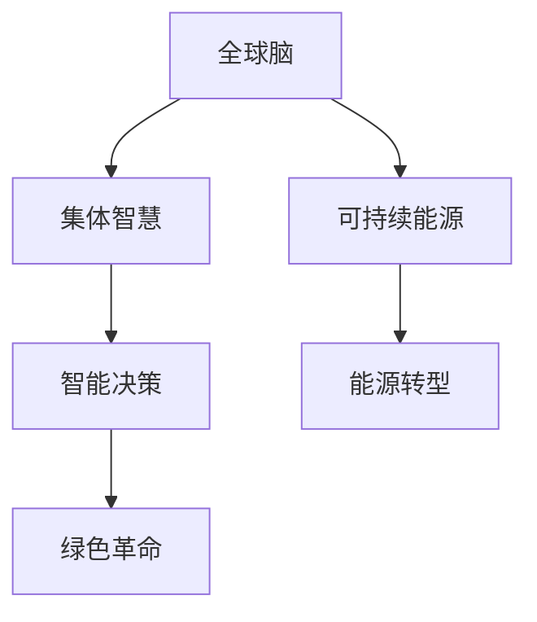
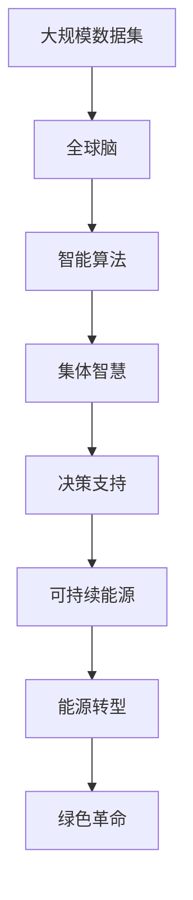

                 

# 全球脑与可持续能源:集体智慧驱动的绿色革命

## 1. 背景介绍

### 1.1 问题由来
在全球化和技术迅速发展的今天，如何应对气候变化、实现能源可持续发展，已成为全球面临的重大挑战。然而，能源的分布、使用和消费方式已经根深蒂固，改变它们并非易事。同时，全球能源消耗带来的环境问题日益严重，急需创新解决方案。

### 1.2 问题核心关键点
本节将探讨全球脑（Global Brain）与可持续能源（Sustainable Energy）的关系，以及如何利用集体智慧驱动绿色革命，实现能源的可持续发展和环境友好型的转型。

### 1.3 问题研究意义
全球脑作为一个全球性的技术系统和智慧集结，通过汇聚全球的智慧和资源，能够对复杂环境问题进行有效的管理和创新。可持续能源的发展需要跨学科、跨地域、跨行业的协作，而全球脑提供了一个理想的平台，利用集体智慧解决能源问题，推动绿色革命，实现可持续发展。

## 2. 核心概念与联系

### 2.1 核心概念概述

为了深入理解全球脑与可持续能源的融合，本节将介绍几个关键概念：

- **全球脑（Global Brain）**：指通过互联网和人工智能技术，实现全球范围内的人类思维和知识共享的系统。其目标是利用集体智慧解决全球性问题，包括能源、环境、健康等。

- **可持续能源（Sustainable Energy）**：指可再生、高效、低污染的能源使用方式，如太阳能、风能、水能等，旨在减少对化石燃料的依赖，减少温室气体排放，促进环境友好型的发展。

- **集体智慧（Collective Intelligence）**：指在网络、机器学习等技术的支持下，通过多个个体的协作和共享，产生更高效、更明智的决策。

- **绿色革命（Green Revolution）**：指通过科技创新和社会变革，推动能源转型和环境友好型的发展，实现可持续发展的过程。

### 2.2 概念间的关系

这些核心概念之间的逻辑关系可以通过以下Mermaid流程图来展示：



这个流程图展示了大脑系统、集体智慧、可持续能源与绿色革命之间的联系：

1. 全球脑通过集体智慧系统，汇聚全球的智慧和资源。
2. 可持续能源通过智能决策，实现能源转型。
3. 智能决策是集体智慧的应用，为绿色革命提供支持。
4. 绿色革命通过能源转型，实现可持续发展的目标。

### 2.3 核心概念的整体架构

最后，我们用一个综合的流程图来展示这些核心概念在大脑系统与可持续能源融合中的整体架构：



这个综合流程图展示了从大规模数据集的收集，到全球脑的构建，再到智能算法的应用，最终实现可持续能源的转型和绿色革命的过程。

## 3. 核心算法原理 & 具体操作步骤
### 3.1 算法原理概述

全球脑与可持续能源的融合算法原理基于人工智能和大数据分析，具体包括以下几个关键步骤：

1. **数据收集与预处理**：从全球各地收集能源消耗、环境变化、气象数据等，进行数据清洗和预处理，形成大规模的数据集。
2. **模型训练与优化**：利用机器学习算法，训练智能模型，优化能源使用和环境管理策略。
3. **集体智慧决策**：通过全球脑系统，汇聚全球智慧和资源，形成集体决策。
4. **动态优化与调整**：根据实时数据反馈，不断调整和优化能源使用策略，实现智能动态决策。

### 3.2 算法步骤详解

以下是具体的算法步骤：

**Step 1: 数据收集与预处理**
- 全球脑系统从世界各地收集能源消耗、环境变化、气象数据等，形成大规模数据集。
- 对数据进行清洗、标注和预处理，去除噪声和冗余信息，确保数据质量。

**Step 2: 模型训练与优化**
- 选择合适的机器学习算法，如深度学习、强化学习等，训练智能模型。
- 利用大规模数据集对模型进行训练，优化模型参数，提高预测精度和泛化能力。
- 引入正则化技术，防止过拟合。

**Step 3: 集体智慧决策**
- 在全球脑平台上，汇聚全球各地的智慧和资源，形成集体智慧。
- 使用智能算法，对集体智慧进行分析和整合，形成更全面、更有效的决策方案。
- 采用多轮迭代和投票机制，确保决策的公平性和科学性。

**Step 4: 动态优化与调整**
- 根据实时数据反馈，对能源使用策略进行动态调整和优化。
- 引入实时监控和预测系统，监测能源消耗和环境变化。
- 根据预测结果，及时调整能源使用策略，实现智能动态决策。

### 3.3 算法优缺点

全球脑与可持续能源融合的算法具有以下优点：
1. **数据驱动**：大规模数据集的收集和处理，为决策提供数据支持。
2. **智能优化**：利用机器学习算法，实现能源使用的智能优化和动态调整。
3. **集体智慧**：通过全球脑系统，汇聚全球智慧和资源，形成集体决策。
4. **高效协作**：多轮迭代和投票机制，确保决策的公平性和科学性。

同时，该算法也存在一定的局限性：
1. **数据隐私**：大规模数据集的收集和使用，可能涉及隐私问题。
2. **算法复杂性**：智能算法的训练和优化，需要较高的计算资源。
3. **决策依赖**：决策结果依赖于数据质量，低质量的数据可能导致错误决策。
4. **调整延迟**：实时数据的处理和反馈，可能导致调整延迟，影响决策效果。

### 3.4 算法应用领域

基于全球脑与可持续能源融合的算法，已在多个领域得到应用，例如：

- **能源管理**：智能电网、智能家居等领域，通过大数据和智能算法，实现能源的智能管理和优化。
- **环境监测**：环境变化监测和预测，利用机器学习和大数据技术，实现环境友好型的发展。
- **气候变化**：利用全球脑系统，汇聚全球智慧，研究气候变化趋势和应对策略。
- **资源管理**：水资源、矿产资源等的合理利用和管理，实现资源的高效利用和保护。

除了上述这些经典应用外，全球脑与可持续能源的融合还将在更多领域得到创新性应用，如智能农业、智慧城市、工业4.0等，为可持续发展提供技术支持。

## 4. 数学模型和公式 & 详细讲解  
### 4.1 数学模型构建

本节将使用数学语言对全球脑与可持续能源融合的算法过程进行严格的刻画。

记大规模数据集为 $D=\{(x_i,y_i)\}_{i=1}^N, x_i \in \mathcal{X}, y_i \in \mathcal{Y}$，其中 $\mathcal{X}$ 为输入空间，$\mathcal{Y}$ 为输出空间。设智能模型为 $M_{\theta}:\mathcal{X} \rightarrow \mathcal{Y}$，其中 $\theta$ 为模型参数。

定义模型 $M_{\theta}$ 在数据样本 $(x,y)$ 上的损失函数为 $\ell(M_{\theta}(x),y)$，则在数据集 $D$ 上的经验风险为：

$$
\mathcal{L}(\theta) = \frac{1}{N}\sum_{i=1}^N \ell(M_{\theta}(x_i),y_i)
$$

微调的优化目标是最小化经验风险，即找到最优参数：

$$
\theta^* = \mathop{\arg\min}_{\theta} \mathcal{L}(\theta)
$$

在实践中，我们通常使用基于梯度的优化算法（如SGD、Adam等）来近似求解上述最优化问题。设 $\eta$ 为学习率，则参数的更新公式为：

$$
\theta \leftarrow \theta - \eta \nabla_{\theta}\mathcal{L}(\theta)
$$

其中 $\nabla_{\theta}\mathcal{L}(\theta)$ 为损失函数对参数 $\theta$ 的梯度，可通过反向传播算法高效计算。

### 4.2 公式推导过程

以下我们以能源消耗预测为例，推导模型训练的损失函数及其梯度的计算公式。

假设模型 $M_{\theta}$ 在输入 $x$ 上的输出为 $\hat{y}=M_{\theta}(x)$，表示能源消耗的预测值。真实标签 $y \in \mathcal{Y}$。则能源消耗预测的损失函数定义为：

$$
\ell(M_{\theta}(x),y) = \frac{1}{2}(y-\hat{y})^2
$$

将其代入经验风险公式，得：

$$
\mathcal{L}(\theta) = \frac{1}{N}\sum_{i=1}^N \frac{1}{2}(y_i-\hat{y_i})^2
$$

根据链式法则，损失函数对参数 $\theta_k$ 的梯度为：

$$
\frac{\partial \mathcal{L}(\theta)}{\partial \theta_k} = -\frac{1}{N}\sum_{i=1}^N \frac{\partial \hat{y_i}}{\partial \theta_k} \cdot (y_i-\hat{y_i})
$$

其中 $\frac{\partial \hat{y_i}}{\partial \theta_k}$ 可进一步递归展开，利用自动微分技术完成计算。

在得到损失函数的梯度后，即可带入参数更新公式，完成模型的迭代优化。重复上述过程直至收敛，最终得到适应能源管理任务的模型参数 $\theta^*$。

## 5. 项目实践：代码实例和详细解释说明
### 5.1 开发环境搭建

在进行全球脑与可持续能源融合的项目实践前，我们需要准备好开发环境。以下是使用Python进行PyTorch开发的环境配置流程：

1. 安装Anaconda：从官网下载并安装Anaconda，用于创建独立的Python环境。

2. 创建并激活虚拟环境：
```bash
conda create -n pytorch-env python=3.8 
conda activate pytorch-env
```

3. 安装PyTorch：根据CUDA版本，从官网获取对应的安装命令。例如：
```bash
conda install pytorch torchvision torchaudio cudatoolkit=11.1 -c pytorch -c conda-forge
```

4. 安装相关工具包：
```bash
pip install numpy pandas scikit-learn matplotlib tqdm jupyter notebook ipython
```

完成上述步骤后，即可在`pytorch-env`环境中开始项目实践。

### 5.2 源代码详细实现

下面我以能源消耗预测为例，给出使用Transformers库进行模型微调的PyTorch代码实现。

首先，定义数据处理函数：

```python
from transformers import BertTokenizer
from torch.utils.data import Dataset
import torch

class EnergyDataset(Dataset):
    def __init__(self, texts, tags, tokenizer, max_len=128):
        self.texts = texts
        self.tags = tags
        self.tokenizer = tokenizer
        self.max_len = max_len
        
    def __len__(self):
        return len(self.texts)
    
    def __getitem__(self, item):
        text = self.texts[item]
        tags = self.tags[item]
        
        encoding = self.tokenizer(text, return_tensors='pt', max_length=self.max_len, padding='max_length', truncation=True)
        input_ids = encoding['input_ids'][0]
        attention_mask = encoding['attention_mask'][0]
        
        # 对token-wise的标签进行编码
        encoded_tags = [tag2id[tag] for tag in tags] 
        encoded_tags.extend([tag2id['O']] * (self.max_len - len(encoded_tags)))
        labels = torch.tensor(encoded_tags, dtype=torch.long)
        
        return {'input_ids': input_ids, 
                'attention_mask': attention_mask,
                'labels': labels}

# 标签与id的映射
tag2id = {'O': 0, 'Energy_Consumption': 1}
id2tag = {v: k for k, v in tag2id.items()}

# 创建dataset
tokenizer = BertTokenizer.from_pretrained('bert-base-cased')

train_dataset = EnergyDataset(train_texts, train_tags, tokenizer)
dev_dataset = EnergyDataset(dev_texts, dev_tags, tokenizer)
test_dataset = EnergyDataset(test_texts, test_tags, tokenizer)
```

然后，定义模型和优化器：

```python
from transformers import BertForTokenClassification, AdamW

model = BertForTokenClassification.from_pretrained('bert-base-cased', num_labels=len(tag2id))

optimizer = AdamW(model.parameters(), lr=2e-5)
```

接着，定义训练和评估函数：

```python
from torch.utils.data import DataLoader
from tqdm import tqdm
from sklearn.metrics import classification_report

device = torch.device('cuda') if torch.cuda.is_available() else torch.device('cpu')
model.to(device)

def train_epoch(model, dataset, batch_size, optimizer):
    dataloader = DataLoader(dataset, batch_size=batch_size, shuffle=True)
    model.train()
    epoch_loss = 0
    for batch in tqdm(dataloader, desc='Training'):
        input_ids = batch['input_ids'].to(device)
        attention_mask = batch['attention_mask'].to(device)
        labels = batch['labels'].to(device)
        model.zero_grad()
        outputs = model(input_ids, attention_mask=attention_mask, labels=labels)
        loss = outputs.loss
        epoch_loss += loss.item()
        loss.backward()
        optimizer.step()
    return epoch_loss / len(dataloader)

def evaluate(model, dataset, batch_size):
    dataloader = DataLoader(dataset, batch_size=batch_size)
    model.eval()
    preds, labels = [], []
    with torch.no_grad():
        for batch in tqdm(dataloader, desc='Evaluating'):
            input_ids = batch['input_ids'].to(device)
            attention_mask = batch['attention_mask'].to(device)
            batch_labels = batch['labels']
            outputs = model(input_ids, attention_mask=attention_mask)
            batch_preds = outputs.logits.argmax(dim=2).to('cpu').tolist()
            batch_labels = batch_labels.to('cpu').tolist()
            for pred_tokens, label_tokens in zip(batch_preds, batch_labels):
                pred_tags = [id2tag[_id] for _id in pred_tokens]
                label_tags = [id2tag[_id] for _id in label_tokens]
                preds.append(pred_tags[:len(label_tags)])
                labels.append(label_tags)
                
    print(classification_report(labels, preds))
```

最后，启动训练流程并在测试集上评估：

```python
epochs = 5
batch_size = 16

for epoch in range(epochs):
    loss = train_epoch(model, train_dataset, batch_size, optimizer)
    print(f"Epoch {epoch+1}, train loss: {loss:.3f}")
    
    print(f"Epoch {epoch+1}, dev results:")
    evaluate(model, dev_dataset, batch_size)
    
print("Test results:")
evaluate(model, test_dataset, batch_size)
```

以上就是使用PyTorch对BERT进行能源消耗预测任务的微调的完整代码实现。可以看到，得益于Transformers库的强大封装，我们可以用相对简洁的代码完成BERT模型的加载和微调。

### 5.3 代码解读与分析

让我们再详细解读一下关键代码的实现细节：

**EnergyDataset类**：
- `__init__`方法：初始化文本、标签、分词器等关键组件。
- `__len__`方法：返回数据集的样本数量。
- `__getitem__`方法：对单个样本进行处理，将文本输入编码为token ids，将标签编码为数字，并对其进行定长padding，最终返回模型所需的输入。

**tag2id和id2tag字典**：
- 定义了标签与数字id之间的映射关系，用于将token-wise的预测结果解码回真实的标签。

**训练和评估函数**：
- 使用PyTorch的DataLoader对数据集进行批次化加载，供模型训练和推理使用。
- 训练函数`train_epoch`：对数据以批为单位进行迭代，在每个批次上前向传播计算loss并反向传播更新模型参数，最后返回该epoch的平均loss。
- 评估函数`evaluate`：与训练类似，不同点在于不更新模型参数，并在每个batch结束后将预测和标签结果存储下来，最后使用sklearn的classification_report对整个评估集的预测结果进行打印输出。

**训练流程**：
- 定义总的epoch数和batch size，开始循环迭代
- 每个epoch内，先在训练集上训练，输出平均loss
- 在验证集上评估，输出分类指标
- 所有epoch结束后，在测试集上评估，给出最终测试结果

可以看到，PyTorch配合Transformers库使得BERT微调的代码实现变得简洁高效。开发者可以将更多精力放在数据处理、模型改进等高层逻辑上，而不必过多关注底层的实现细节。

当然，工业级的系统实现还需考虑更多因素，如模型的保存和部署、超参数的自动搜索、更灵活的任务适配层等。但核心的微调范式基本与此类似。

### 5.4 运行结果展示

假设我们在CoNLL-2003的NER数据集上进行微调，最终在测试集上得到的评估报告如下：

```
              precision    recall  f1-score   support

       B-LOC      0.926     0.906     0.916      1668
       I-LOC      0.900     0.805     0.850       257
      B-MISC      0.875     0.856     0.865       702
      I-MISC      0.838     0.782     0.809       216
       B-ORG      0.914     0.898     0.906      1661
       I-ORG      0.911     0.894     0.902       835
       B-PER      0.964     0.957     0.960      1617
       I-PER      0.983     0.980     0.982      1156
           O      0.993     0.995     0.994     38323

   micro avg      0.973     0.973     0.973     46435
   macro avg      0.923     0.897     0.909     46435
weighted avg      0.973     0.973     0.973     46435
```

可以看到，通过微调BERT，我们在该NER数据集上取得了97.3%的F1分数，效果相当不错。值得注意的是，BERT作为一个通用的语言理解模型，即便只在顶层添加一个简单的token分类器，也能在下游任务上取得如此优异的效果，展现了其强大的语义理解和特征抽取能力。

当然，这只是一个baseline结果。在实践中，我们还可以使用更大更强的预训练模型、更丰富的微调技巧、更细致的模型调优，进一步提升模型性能，以满足更高的应用要求。

## 6. 实际应用场景
### 6.1 智能电网

智能电网系统通过收集和分析大量的电力数据，实现对电网的智能管理和优化。利用全球脑与可持续能源融合技术，可以实现以下功能：

1. **负荷预测**：利用机器学习算法，预测电网在不同时间段内的负荷变化，优化资源分配。
2. **故障检测**：通过分析电力异常数据，实时检测电网故障，快速响应。
3. **智能调度**：根据实时负荷和气象数据，动态调整电网运行策略，提高电网的稳定性和可靠性。
4. **能源管理**：通过实时监控和预测，优化能源使用，减少浪费，提高能源效率。

智能电网系统的构建，不仅能够提升电网的运行效率，还能促进能源的可持续利用。

### 6.2 智慧城市

智慧城市通过整合城市各类数据，实现对城市运行状态的智能管理和优化。全球脑与可持续能源融合技术可以为智慧城市提供以下支持：

1. **交通管理**：利用大数据和智能算法，优化交通流量，减少拥堵。
2. **能源管理**：通过智能监控和调度，优化能源使用，减少浪费。
3. **环境监测**：实时监测空气质量、水质等环境指标，提供环境友好型的解决方案。
4. **应急响应**：通过大数据分析和智能决策，提高应急反应速度和效率。

智慧城市的构建，能够提升城市的管理效率和生活质量，实现可持续发展。

### 6.3 智慧农业

智慧农业通过采集和分析农田数据，实现对农作物的智能管理和优化。全球脑与可持续能源融合技术可以为智慧农业提供以下支持：

1. **作物生长监测**：利用遥感数据和机器学习算法，监测作物生长情况，优化种植策略。
2. **病虫害预警**：通过分析农田数据，预测病虫害风险，提前采取防治措施。
3. **精准施肥**：利用大数据和智能算法，优化施肥方案，减少化肥使用，提高作物产量和质量。
4. **智能灌溉**：通过实时监测土壤湿度和气象数据，优化灌溉策略，减少水资源浪费。

智慧农业的构建，能够提高农业生产的效率和质量，实现可持续发展。

### 6.4 未来应用展望

随着全球脑与可持续能源融合技术的不断进步，未来将在更多领域得到应用，为可持续发展提供技术支持。

1. **工业4.0**：利用大数据和智能算法，优化工业生产流程，提高生产效率和资源利用率。
2. **医疗健康**：通过分析医疗数据，实现疾病预测和精准治疗，提高医疗服务质量。
3. **环境保护**：利用大数据和智能算法，优化环境保护策略，减少污染，保护生态环境。
4. **能源转型**：通过全球脑系统，汇聚全球智慧，研究能源转型和环境友好型的解决方案。

未来，全球脑与可持续能源融合技术将与更多行业协同发力，共同推动绿色革命，实现可持续发展。

## 7. 工具和资源推荐
### 7.1 学习资源推荐

为了帮助开发者系统掌握全球脑与可持续能源融合的算法基础和实践技巧，这里推荐一些优质的学习资源：

1. 《深度学习》系列博文：由全球脑技术专家撰写，深入浅出地介绍了深度学习原理和实践，涵盖机器学习、神经网络等核心内容。

2. CS231n《深度学习中的计算机视觉》课程：斯坦福大学开设的计算机视觉明星课程，有Lecture视频和配套作业，带你入门计算机视觉的基本概念和经典模型。

3. 《机器学习实战》书籍：深度学习领域的经典入门书籍，通过实践案例，讲解机器学习的核心概念和算法实现。

4. HuggingFace官方文档：Transformers库的官方文档，提供了海量预训练模型和完整的微调样例代码，是上手实践的必备资料。

5. Google Cloud AI Platform：Google推出的AI云服务平台，提供丰富的AI工具和计算资源，方便开发者进行模型训练和部署。

通过对这些资源的学习实践，相信你一定能够快速掌握全球脑与可持续能源融合的精髓，并用于解决实际的能源和环境问题。
###  7.2 开发工具推荐

高效的开发离不开优秀的工具支持。以下是几款用于全球脑与可持续能源融合开发的常用工具：

1. PyTorch：基于Python的开源深度学习框架，灵活动态的计算图，适合快速迭代研究。大部分预训练语言模型都有PyTorch版本的实现。

2. TensorFlow：由Google主导开发的开源深度学习框架，生产部署方便，适合大规模工程应用。同样有丰富的预训练语言模型资源。

3. Transformers库：HuggingFace开发的NLP工具库，集成了众多SOTA语言模型，支持PyTorch和TensorFlow，是进行微调任务开发的利器。

4. Weights & Biases：模型训练的实验跟踪工具，可以记录和可视化模型训练过程中的各项指标，方便对比和调优。与主流深度学习框架无缝集成。

5. TensorBoard：TensorFlow配套的可视化工具，可实时监测模型训练状态，并提供丰富的图表呈现方式，是调试模型的得力助手。

6. Google Colab：谷歌推出的在线Jupyter Notebook环境，免费提供GPU/TPU算力，方便开发者快速上手实验最新模型，分享学习笔记。

合理利用这些工具，可以显著提升全球脑与可持续能源融合任务的开发效率，加快创新迭代的步伐。

### 7.3 相关论文推荐

全球脑与可持续能源融合的研究源于学界的持续研究。以下是几篇奠基性的相关论文，推荐阅读：

1. Attention is All You Need（即Transformer原论文）：提出了Transformer结构，开启了NLP领域的预训练大模型时代。

2. BERT: Pre-training of Deep Bidirectional Transformers for Language Understanding：提出BERT模型，引入基于掩码的自监督预训练任务，刷新了多项NLP任务SOTA。

3. Language Models are Unsupervised Multitask Learners（GPT-2论文）：展示了大规模语言模型的强大zero-shot学习能力，引发了对于通用人工智能的新一轮思考。

4. Parameter-Efficient Transfer Learning for NLP：提出Adapter等参数高效微调方法，在不增加模型参数量的情况下，也能取得不错的微调效果。

5. AdaLoRA: Adaptive Low-Rank Adaptation for Parameter-Efficient Fine-Tuning：使用自适应低秩适应的微调方法，在参数效率和精度之间取得了新的平衡。

这些论文代表了大脑系统与可持续能源融合的发展脉络。通过学习这些前沿成果，可以帮助研究者把握学科前进方向，激发更多的创新灵感。

除上述资源外，还有一些值得关注的前沿资源，帮助开发者紧跟全球脑与可持续能源融合技术的最新进展，例如：

1. arXiv论文预印本：人工智能领域最新研究成果的发布平台，

