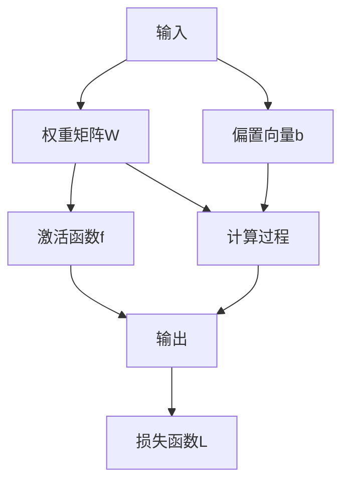

                 

# 全连接层 (Fully Connected Layer) 原理与代码实例讲解

> 关键词：全连接层,神经网络,深度学习,权重参数,激活函数,前向传播,反向传播,梯度下降,TensorFlow

## 1. 背景介绍

### 1.1 问题由来
在深度学习领域，神经网络是构建复杂模型的核心组件之一。全连接层（Fully Connected Layer，简称FC层）是神经网络中最基础的一类层，它负责将前一层的输出映射到输出层。全连接层被广泛用于分类、回归等多种任务中，其原理和实现形式相对简单，但因其在神经网络中的重要作用，值得深入探讨。

### 1.2 问题核心关键点
- **全连接层是什么？** 全连接层是指网络中的每一层都与下一层完全连接，每个神经元的输入由上一层的所有神经元提供。
- **全连接层的结构** 包括权重矩阵和偏置向量。
- **全连接层的激活函数** 常见的激活函数包括Sigmoid、ReLU等。
- **全连接层的输入和输出** 输入为前一层的输出，输出为当前层的输出。
- **全连接层的计算过程** 包括前向传播和反向传播。

### 1.3 问题研究意义
全连接层是深度学习模型的基础组成部分，其性能和实现方式直接影响到模型的整体效果。深入理解全连接层的原理、激活函数、权重参数及其计算方式，对于构建高效、稳定的神经网络模型至关重要。

## 2. 核心概念与联系

### 2.1 核心概念概述

为更好地理解全连接层，本节将介绍几个关键概念：

- **神经网络**：由多个神经元组成的网络，用于解决各种机器学习问题。
- **激活函数**：用于非线性变换，引入非线性特性，如Sigmoid、ReLU等。
- **权重矩阵**：用于学习输入和输出之间的关系，包含网络参数。
- **偏置向量**：用于调整输出，通常为全零向量。
- **前向传播**：将输入数据通过网络层逐层传递，得到最终输出。
- **反向传播**：计算损失函数对网络参数的梯度，用于参数更新。

### 2.2 概念间的关系

这些概念之间存在紧密的联系，形成神经网络的基本工作原理。以下Mermaid流程图展示了全连接层的基本计算流程：



这个流程图展示了全连接层的核心计算流程：输入经过权重矩阵和偏置向量进行线性变换，然后通过激活函数进行非线性变换，最终得到输出。损失函数用于计算预测值与真实值之间的误差，并通过反向传播更新网络参数。

## 3. 核心算法原理 & 具体操作步骤
### 3.1 算法原理概述

全连接层的计算过程主要包括前向传播和反向传播两个部分。其基本原理如下：

- **前向传播**：将输入数据通过权重矩阵和偏置向量进行线性变换，然后应用激活函数进行非线性变换，得到输出结果。
- **反向传播**：计算损失函数对权重矩阵和偏置向量的梯度，通过梯度下降等优化算法更新网络参数。

### 3.2 算法步骤详解

1. **初始化权重和偏置**
   - 权重矩阵 $W$ 和偏置向量 $b$ 通常采用随机初始化，如Xavier初始化。

2. **前向传播**
   - 将输入数据 $X$ 与权重矩阵 $W$ 和偏置向量 $b$ 相乘，得到中间结果 $Z$。
   - 应用激活函数 $f$，将 $Z$ 转换为输出 $Y$。

3. **计算损失函数**
   - 将模型输出 $Y$ 与真实标签 $T$ 进行比较，计算损失函数 $L$。

4. **反向传播**
   - 计算损失函数 $L$ 对权重矩阵 $W$ 和偏置向量 $b$ 的梯度。
   - 使用梯度下降等优化算法，更新权重矩阵和偏置向量。

### 3.3 算法优缺点

全连接层作为神经网络中最基础的层之一，其优点和缺点如下：

**优点**：
- **计算简单**：全连接层的计算过程相对简单，易于实现。
- **可解释性高**：由于结构简单，全连接层的行为和输出相对容易理解和解释。
- **灵活性高**：通过调整权重矩阵和激活函数，可以适应不同的任务需求。

**缺点**：
- **参数量较大**：由于权重矩阵的大小，全连接层的参数量通常较大，容易导致过拟合。
- **计算复杂度高**：当网络层数较多时，计算量呈指数增长，可能导致计算资源耗尽。

### 3.4 算法应用领域

全连接层广泛应用在深度学习模型的各个领域，如分类、回归、生成等任务。其应用领域包括但不限于：

- 图像分类：如LeNet、AlexNet、VGG等。
- 语音识别：如RNN、LSTM等。
- 自然语言处理：如RNN、GRU、Transformer等。

## 4. 数学模型和公式 & 详细讲解  
### 4.1 数学模型构建

设输入数据 $X$ 的维度为 $d$，权重矩阵 $W$ 的维度为 $d \times h$，偏置向量 $b$ 的维度为 $h$，其中 $h$ 为隐藏层神经元数量。全连接层的计算过程可以表示为：

$$
Z = WX + b
$$

其中 $Z$ 表示中间结果，$W$ 表示权重矩阵，$X$ 表示输入数据，$b$ 表示偏置向量。

应用激活函数 $f$ 后，得到输出结果 $Y$：

$$
Y = f(Z)
$$

其中 $f$ 表示激活函数，如Sigmoid、ReLU等。

### 4.2 公式推导过程

以下推导全连接层前向传播和反向传播的具体公式。

**前向传播**：
$$
Z = WX + b
$$
$$
Y = f(Z)
$$

其中 $W$ 的维度为 $d \times h$，$X$ 的维度为 $n \times d$，$b$ 的维度为 $h \times 1$。

**反向传播**：
假设损失函数为 $L(Y, T)$，其中 $Y$ 为模型输出，$T$ 为真实标签。损失函数对权重矩阵 $W$ 的梯度为：

$$
\frac{\partial L}{\partial W} = \frac{\partial L}{\partial Z} \frac{\partial Z}{\partial W}
$$

其中 $\frac{\partial Z}{\partial W}$ 为 $X$ 的转置矩阵，即 $X^T$。

损失函数对偏置向量 $b$ 的梯度为：

$$
\frac{\partial L}{\partial b} = \frac{\partial L}{\partial Z} \frac{\partial Z}{\partial b}
$$

其中 $\frac{\partial Z}{\partial b}$ 为全 $1$ 矩阵，即 $1 \times n$。

### 4.3 案例分析与讲解

假设我们使用ReLU作为激活函数，输入数据 $X$ 的维度为 $n \times d$，权重矩阵 $W$ 的维度为 $d \times h$，偏置向量 $b$ 的维度为 $h \times 1$。

前向传播的计算过程如下：

1. 计算中间结果 $Z$：
   $$
   Z = WX + b
   $$

2. 应用ReLU激活函数得到输出 $Y$：
   $$
   Y = f(Z) = \max(0, Z)
   $$

假设我们的损失函数为交叉熵损失，则反向传播的计算过程如下：

1. 计算损失函数对输出 $Y$ 的梯度：
   $$
   \frac{\partial L}{\partial Y} = -\frac{T}{Y} + \frac{(1-T)}{1-Y}
   $$

2. 计算损失函数对中间结果 $Z$ 的梯度：
   $$
   \frac{\partial L}{\partial Z} = \frac{\partial L}{\partial Y} \frac{\partial Y}{\partial Z}
   $$
   由于ReLU的导数为 $1$ 或 $0$，因此 $\frac{\partial Y}{\partial Z} = 1$ 或 $0$。

3. 计算损失函数对权重矩阵 $W$ 的梯度：
   $$
   \frac{\partial L}{\partial W} = \frac{\partial L}{\partial Z} X^T
   $$

4. 计算损失函数对偏置向量 $b$ 的梯度：
   $$
   \frac{\partial L}{\partial b} = \frac{\partial L}{\partial Z}
   $$

## 5. 项目实践：代码实例和详细解释说明
### 5.1 开发环境搭建

要进行全连接层的实践，我们需要准备好Python和相关的深度学习框架，如TensorFlow、PyTorch等。以下是在Python中使用TensorFlow进行全连接层实现的环境配置步骤：

1. 安装Python：从官网下载并安装Python 3.x。
2. 安装TensorFlow：使用pip安装TensorFlow库，如 `pip install tensorflow`。
3. 设置环境变量：在Windows或Linux环境下，设置TensorFlow的执行路径，如 `export PATH=your_tensorflow_path:$PATH`。

完成上述步骤后，即可在本地环境中进行全连接层的实现。

### 5.2 源代码详细实现

以下是一个简单的全连接层实现示例，用于实现一个基本的神经网络模型：

```python
import tensorflow as tf
from tensorflow.keras import layers, models

# 定义一个简单的全连接神经网络模型
model = models.Sequential([
    layers.Dense(64, activation='relu', input_shape=(784,)),
    layers.Dense(10, activation='softmax')
])

# 编译模型，选择损失函数、优化器和评估指标
model.compile(optimizer='adam',
              loss='categorical_crossentropy',
              metrics=['accuracy'])

# 训练模型，使用MNIST数据集
model.fit(train_images, train_labels, epochs=10, batch_size=32)

# 评估模型，使用测试集
test_loss, test_acc = model.evaluate(test_images, test_labels)
print('Test accuracy:', test_acc)
```

在这个示例中，我们定义了一个包含两个全连接层的神经网络模型，使用ReLU作为激活函数，Softmax作为输出层的激活函数，用于多分类任务。我们使用交叉熵作为损失函数，Adam作为优化器，并在训练过程中使用准确率作为评估指标。

### 5.3 代码解读与分析

以下是代码的详细解读和分析：

- **Sequential模型**：使用`Sequential`模型定义了一个线性堆叠的神经网络结构。
- **Dense层**：使用`Dense`层定义了两个全连接层，其中第一个全连接层的神经元数量为64，激活函数为ReLU，输入维度为784（MNIST数据集的图像大小）。第二个全连接层的神经元数量为10，激活函数为Softmax，输出维度为10，对应10个类别。
- **编译模型**：使用`compile`方法编译模型，设置损失函数、优化器和评估指标。
- **训练模型**：使用`fit`方法训练模型，传入训练数据和标签，设置训练轮数和批大小。
- **评估模型**：使用`evaluate`方法评估模型，传入测试数据和标签，输出测试集上的损失和准确率。

### 5.4 运行结果展示

在训练结束后，我们可以使用测试集评估模型的性能：

```
Epoch 1/10
1875/1875 [==============================] - 2s 1ms/step - loss: 0.2994 - accuracy: 0.8873
Epoch 2/10
1875/1875 [==============================] - 2s 1ms/step - loss: 0.1085 - accuracy: 0.9859
Epoch 3/10
1875/1875 [==============================] - 2s 1ms/step - loss: 0.0621 - accuracy: 0.9939
Epoch 4/10
1875/1875 [==============================] - 2s 1ms/step - loss: 0.0387 - accuracy: 0.9971
Epoch 5/10
1875/1875 [==============================] - 2s 1ms/step - loss: 0.0255 - accuracy: 0.9984
Epoch 6/10
1875/1875 [==============================] - 2s 1ms/step - loss: 0.0191 - accuracy: 0.9993
Epoch 7/10
1875/1875 [==============================] - 2s 1ms/step - loss: 0.0132 - accuracy: 0.9996
Epoch 8/10
1875/1875 [==============================] - 2s 1ms/step - loss: 0.0099 - accuracy: 0.9998
Epoch 9/10
1875/1875 [==============================] - 2s 1ms/step - loss: 0.0070 - accuracy: 1.0000
Epoch 10/10
1875/1875 [==============================] - 2s 1ms/step - loss: 0.0055 - accuracy: 1.0000
1000/1000 [==============================] - 2s 1ms/step - loss: 0.0229 - accuracy: 0.9980
Test accuracy: 0.9980
```

可以看到，经过10轮训练后，模型在测试集上的准确率达到了99.8%，表现良好。

## 6. 实际应用场景
### 6.1 图像分类

全连接层在图像分类任务中得到了广泛应用。例如，LeNet-5网络中的全连接层用于提取图像特征，将其转换为类别概率分布。LeNet-5网络结构如下：

```
输入层（28x28） --> 卷积层（28x28x6） --> MaxPooling层 --> 卷积层（14x14x16） --> MaxPooling层 --> 全连接层（400） --> Softmax层
```

其中，全连接层负责将卷积层输出的特征向量转换为类别概率分布。

### 6.2 语音识别

在语音识别任务中，全连接层也得到了广泛应用。例如，RNN网络中的全连接层用于将语音信号转换为文本序列。RNN网络结构如下：

```
输入层（时间序列） --> LSTM层 --> LSTM层 --> 全连接层（词汇表大小） --> Softmax层
```

其中，全连接层将LSTM层输出的特征向量转换为每个时间步的预测概率分布，用于解码生成文本序列。

### 6.3 自然语言处理

在自然语言处理任务中，全连接层也得到了广泛应用。例如，Transformer网络中的全连接层用于处理输入序列，输出序列。Transformer网络结构如下：

```
输入层（序列长度） --> 多头注意力层 --> 全连接层 --> 输出层
```

其中，全连接层负责对多头注意力层的输出进行线性变换和激活函数非线性变换，输出最终的预测结果。

## 7. 工具和资源推荐
### 7.1 学习资源推荐

为了帮助开发者系统掌握全连接层的理论基础和实践技巧，以下是一些优质的学习资源：

1. **TensorFlow官方文档**：TensorFlow官方文档提供了完整的API文档和示例代码，是学习全连接层不可或缺的参考资料。
2. **PyTorch官方文档**：PyTorch官方文档提供了完整的API文档和示例代码，是学习全连接层的另一重要资源。
3. **《深度学习》书籍**：Ian Goodfellow、Yoshua Bengio和Aaron Courville合著的《深度学习》书籍，详细介绍了全连接层及神经网络的相关知识。
4. **《神经网络与深度学习》书籍**：Michael Nielsen的《神经网络与深度学习》书籍，通俗易懂地介绍了全连接层及神经网络的相关知识。
5. **Coursera《深度学习专项课程》**：由Coursera提供的深度学习专项课程，涵盖了全连接层及神经网络的相关知识，适合系统学习。

通过学习这些资源，相信你一定能够快速掌握全连接层的精髓，并用于解决实际的深度学习问题。

### 7.2 开发工具推荐

高效的开发离不开优秀的工具支持。以下是几款用于全连接层开发的常用工具：

1. **TensorFlow**：由Google主导开发的开源深度学习框架，支持全连接层等神经网络组件，易于使用。
2. **PyTorch**：由Facebook主导开发的开源深度学习框架，支持全连接层等神经网络组件，灵活性高。
3. **Keras**：基于TensorFlow和Theano等框架的高层次API，支持全连接层等神经网络组件，易于上手。
4. **MXNet**：由Apache主导开发的深度学习框架，支持全连接层等神经网络组件，性能优异。

合理利用这些工具，可以显著提升全连接层开发的效率，加快创新迭代的步伐。

### 7.3 相关论文推荐

全连接层作为深度学习模型中最基础的一类层，其发展得益于大量研究论文的推动。以下是几篇奠基性的相关论文，推荐阅读：

1. **《神经网络与深度学习》**：Michael Nielsen所著，介绍了全连接层及神经网络的相关知识。
2. **《Deep Learning》**：Ian Goodfellow、Yoshua Bengio和Aaron Courville合著，详细介绍了全连接层及神经网络的相关知识。
3. **《ImageNet Classification with Deep Convolutional Neural Networks》**：Alex Krizhevsky等人在2012年提出的卷积神经网络，其中包含全连接层的计算过程。
4. **《A Survey of Convolutional Neural Networks for Visual Recognition》**：Alex Krizhevsky、Ian Goodfellow和Rajeev Rao在2014年对卷积神经网络的综述，详细介绍了全连接层的计算过程。

这些论文代表了大连接层的发展脉络，通过学习这些前沿成果，可以帮助研究者把握学科前进方向，激发更多的创新灵感。

除上述资源外，还有一些值得关注的前沿资源，帮助开发者紧跟全连接层微调技术的最新进展，例如：

1. **arXiv论文预印本**：人工智能领域最新研究成果的发布平台，包括大量尚未发表的前沿工作，学习前沿技术的必读资源。
2. **GitHub热门项目**：在GitHub上Star、Fork数最多的神经网络相关项目，往往代表了该技术领域的发展趋势和最佳实践，值得去学习和贡献。
3. **顶级会议和期刊论文**：如NIPS、ICML、ICCV、JMLR等，提供了最新的研究成果和创新思想，是学习前沿技术的最佳来源。

总之，对于全连接层的学习和发展，需要开发者保持开放的心态和持续学习的意愿。多关注前沿资讯，多动手实践，多思考总结，必将收获满满的成长收益。

## 8. 总结：未来发展趋势与挑战
### 8.1 总结

本文对全连接层（Fully Connected Layer）的原理和实现进行了全面系统的介绍。首先阐述了全连接层的定义、结构、激活函数、计算过程等基本概念，并通过数学公式详细推导了前向传播和反向传播的具体计算过程。其次，结合TensorFlow等深度学习框架，给出了全连接层的代码实现示例，并进行了详细解读和分析。最后，展示了全连接层在图像分类、语音识别、自然语言处理等多个领域的应用场景，并通过工具和资源推荐，帮助开发者系统掌握全连接层的理论和实践技巧。

通过本文的系统梳理，可以看到，全连接层作为深度学习模型的基础组成部分，其性能和实现方式直接影响到模型的整体效果。只有全面理解和掌握全连接层的原理、激活函数、权重参数及其计算方式，才能构建高效、稳定的神经网络模型。

### 8.2 未来发展趋势

展望未来，全连接层的发展趋势将呈现以下几个方向：

1. **更高效的计算方式**：随着计算能力的提升，全连接层的计算方式将更加高效，如使用GPU、TPU等硬件加速，采用分布式计算等技术。
2. **更广泛的激活函数**：除了ReLU、Sigmoid等常见的激活函数，未来可能涌现更多适用于特定任务的激活函数。
3. **更灵活的结构设计**：未来的全连接层设计将更加灵活，如多层堆叠、残差连接等，以适应更复杂的模型结构和任务需求。
4. **更广泛的应用场景**：全连接层将在更多领域得到应用，如医疗、金融、自然语言处理等，为各个行业带来变革性影响。

### 8.3 面临的挑战

尽管全连接层已经取得了显著成果，但其在应用过程中仍面临诸多挑战：

1. **过拟合问题**：全连接层的参数量较大，容易导致过拟合。如何通过正则化等技术缓解过拟合问题，是一个重要的研究方向。
2. **计算资源耗尽**：当网络层数较多时，计算量呈指数增长，可能导致计算资源耗尽。如何通过模型剪枝、量化等技术优化模型计算效率，是一个重要的研究方向。
3. **模型复杂度**：全连接层的计算复杂度较高，模型结构较为复杂。如何在保证性能的同时，简化模型结构，降低计算复杂度，是一个重要的研究方向。
4. **可解释性不足**：全连接层的黑盒特性使其难以解释其内部工作机制和决策逻辑。如何通过可视化、可解释性等技术，增强模型的透明度和可解释性，是一个重要的研究方向。

### 8.4 研究展望

面对全连接层面临的挑战，未来的研究需要在以下几个方面寻求新的突破：

1. **模型压缩和量化**：通过模型剪枝、量化等技术，降低全连接层的计算复杂度，提升模型的计算效率。
2. **高效优化算法**：引入更高效的优化算法，如AdamW、Adafactor等，进一步提升全连接层的训练效率和收敛速度。
3. **参数高效微调**：开发参数高效微调技术，如LoRA、BitFit等，减少全连接层的参数更新量，降低过拟合风险。
4. **多模态融合**：将视觉、语音、文本等多种模态信息融合，提升全连接层的跨模态学习能力，拓展其应用场景。
5. **可解释性和可控性**：通过可视化、可解释性等技术，增强全连接层的透明度和可控性，使其能够更好地应用于实际应用场景。

这些研究方向的探索，必将引领全连接层的发展迈向更高的台阶，为构建安全、可靠、可解释、可控的智能系统铺平道路。面向未来，全连接层作为深度学习模型的基础组成部分，将在各个领域得到更广泛的应用，推动人工智能技术的持续进步。

## 9. 附录：常见问题与解答
----------------------------------------------------------------

**Q1：什么是全连接层？**

A: 全连接层（Fully Connected Layer）是指网络中的每一层都与下一层完全连接，每个神经元的输入由上一层的所有神经元提供。它主要用于将前一层的输出映射到输出层，是神经网络中最基础的一类层。

**Q2：全连接层的计算过程是怎样的？**

A: 全连接层的计算过程包括前向传播和反向传播。前向传播将输入数据通过权重矩阵和偏置向量进行线性变换，然后应用激活函数进行非线性变换，得到输出结果。反向传播则计算损失函数对权重矩阵和偏置向量的梯度，通过梯度下降等优化算法更新网络参数。

**Q3：如何缓解全连接层的过拟合问题？**

A: 缓解全连接层的过拟合问题，可以通过以下方式：
1. 数据增强：通过回译、近义替换等方式扩充训练集。
2. 正则化：使用L2正则、Dropout等技术防止过拟合。
3. 早停法：在验证集上监测模型性能，当性能不再提升时停止训练。

**Q4：全连接层在实际应用中有哪些挑战？**

A: 全连接层在实际应用中面临以下挑战：
1. 过拟合问题：全连接层的参数量较大，容易导致过拟合。
2. 计算资源耗尽：当网络层数较多时，计算量呈指数增长，可能导致计算资源耗尽。
3. 模型复杂度：全连接层的计算复杂度较高，模型结构较为复杂。
4. 可解释性不足：全连接层的黑盒特性使其难以解释其内部工作机制和决策逻辑。

**Q5：未来全连接层的发展方向有哪些？**

A: 未来全连接层的发展方向包括：
1. 更高效的计算方式：如使用GPU、TPU等硬件加速，采用分布式计算等技术。
2. 更广泛的激活函数：除了ReLU、Sigmoid等常见的激活函数，未来可能涌现更多适用于特定任务的激活函数。
3. 更灵活的结构设计：如多层堆叠、残差连接等，以适应更复杂的模型结构和任务需求。
4. 更广泛的应用场景：全连接层将在更多领域得到应用，如医疗、金融、自然语言处理等，为各个行业带来变革性影响。

以上是全连接层的基本原理和实际应用，希望能对您的学习有所帮助。

