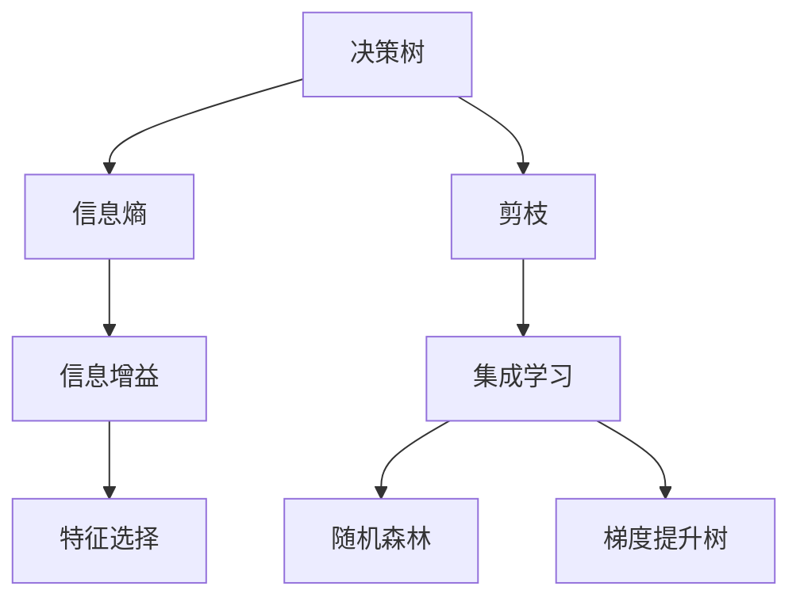
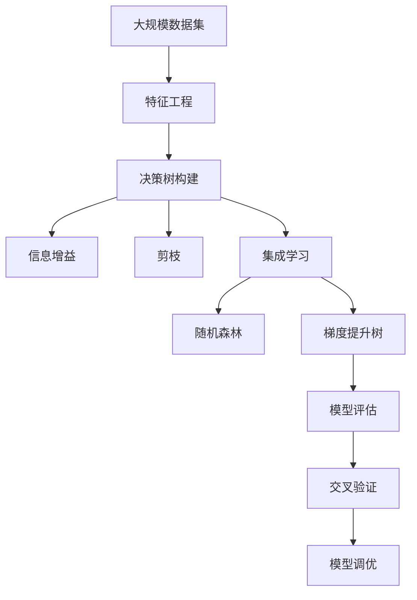

                 

# 决策树(Decision Trees) - 原理与代码实例讲解

> 关键词：决策树, 特征选择, 过拟合, 剪枝, 梯度提升树, 模型评估, 交叉验证, Python, Scikit-learn

## 1. 背景介绍

### 1.1 问题由来
决策树(Decision Trees)是一种经典的机器学习算法，广泛应用于分类和回归任务中。决策树的理论基础可以追溯到20世纪60年代的决策理论，当时决策树被用于解决实际问题。现代决策树算法则发展于1980年代，在机器学习领域中逐渐成熟，并在诸多实际问题中取得了显著效果。决策树的优点在于其易于理解、解释性强、可解释性强，适用于处理非线性问题，能够有效处理高维数据。同时，决策树可以自然地处理连续型和离散型特征，不需要进行特征工程预处理。因此，决策树在商业领域、金融领域、医疗领域、工业领域和科研领域等多个领域都有着广泛的应用。

## 2. 核心概念与联系

### 2.1 核心概念概述

为了更全面地理解决策树的原理与应用，我们将介绍几个密切相关的核心概念：

- **决策树**：一种树形结构，其中每个节点表示一个特征，每个边表示一个特征值，每个叶子节点表示一个类别或数值。决策树的构建过程是一个递归地选择最优特征并切分数据的过程。

- **信息熵**：用于度量样本集合的不确定性。信息熵值越小，样本集合的不确定性越小，模型越纯净。

- **信息增益**：用于衡量选择某个特征后信息熵减少的程度。信息增益越大，特征对模型的贡献越大。

- **剪枝**：用于防止决策树过拟合的策略。通过剪枝，可以减少决策树的复杂度，提高模型的泛化能力。

- **集成学习**：通过组合多个决策树，可以进一步提高模型的预测性能和稳定性。集成学习包括随机森林(Random Forest)、梯度提升树(Gradient Boosting Trees)等多种算法。

### 2.2 核心概念之间的关系

决策树的核心思想是通过树形结构进行特征选择和数据切分，最终得到模型的预测结果。信息熵和信息增益是衡量模型性能的重要指标，用于特征选择过程。剪枝和集成学习则是避免过拟合和提高模型稳定性的关键技术。这些概念共同构成了决策树的理论基础和实践指导，使其能够适应各种数据分布和任务需求。

通过以下Mermaid流程图来展示这些核心概念之间的逻辑关系：



这个流程图展示了决策树的构建过程和相关概念之间的关系：

1. 决策树的构建以信息熵和信息增益为基础，用于衡量特征的重要性和数据的分裂效果。
2. 特征选择通过信息增益最大化来选择最优特征进行数据切分。
3. 剪枝通过减少决策树的复杂度，防止过拟合，提高泛化能力。
4. 集成学习通过组合多个决策树，提升模型的稳定性和预测性能。
5. 随机森林和梯度提升树是集成学习的典型代表。

### 2.3 核心概念的整体架构

最后，我们用一个综合的流程图来展示这些核心概念在大数据处理过程中的整体架构：



这个综合流程图展示了从数据预处理到模型评估的完整过程：

1. 决策树构建：从原始数据集出发，通过信息增益选择最优特征进行数据切分。
2. 剪枝：对构建的决策树进行剪枝，防止过拟合。
3. 集成学习：通过随机森林或梯度提升树等算法，提升模型的稳定性和预测性能。
4. 模型评估：使用交叉验证等技术，评估模型的泛化能力和预测性能。
5. 模型调优：通过超参数调优等手段，进一步提升模型的性能。

这些概念共同构成了决策树算法的理论基础和实践框架，使其能够在各种场景下发挥强大的分类和回归能力。

## 3. 核心算法原理 & 具体操作步骤
### 3.1 算法原理概述

决策树的构建过程可以概括为以下几个步骤：

1. 根据特征选择方法，选择一个最优特征进行数据切分。
2. 对切分后的子数据集，递归地重复上述步骤，直到满足停止条件。
3. 对最终的决策树进行剪枝，防止过拟合。
4. 使用交叉验证等技术，评估模型的泛化能力和预测性能。

决策树的构建过程中，信息熵和信息增益是衡量特征重要性的关键指标。信息熵是用于度量样本集合不确定性的指标，信息增益则用于衡量选择某个特征后信息熵减少的程度。通过最大化信息增益，可以选择最优特征进行数据切分。

### 3.2 算法步骤详解

以下是对决策树构建过程的详细描述：

**Step 1: 数据预处理**

1. 数据清洗：处理缺失值、异常值等数据质量问题。
2. 数据标准化：对连续型数据进行归一化或标准化处理。
3. 数据转换：将离散型数据进行编码处理。

**Step 2: 特征选择**

1. 信息熵计算：计算数据集的熵值，衡量数据的不确定性。
2. 信息增益计算：计算每个特征的信息增益，选择最优特征。
3. 特征选择：根据信息增益选择最优特征进行数据切分。

**Step 3: 决策树构建**

1. 数据切分：根据最优特征和特征值，将数据集切分为子集。
2. 递归构建：对每个子数据集，递归地重复上述步骤，构建子决策树。
3. 生成叶节点：当数据集满足停止条件时，生成叶节点。

**Step 4: 剪枝**

1. 预剪枝：在构建决策树时，根据预设条件剪枝。
2. 后剪枝：在生成决策树后，通过交叉验证等方法剪枝。

**Step 5: 模型评估**

1. 交叉验证：使用交叉验证评估模型的泛化能力。
2. 模型调优：根据评估结果，调整模型参数和超参数。

### 3.3 算法优缺点

决策树算法的优点在于其易于理解、解释性强、可解释性强，适用于处理非线性问题，能够有效处理高维数据。同时，决策树可以自然地处理连续型和离散型特征，不需要进行特征工程预处理。

决策树的缺点在于容易过拟合、处理噪声数据敏感、处理连续型数据时需要进行离散化处理。

### 3.4 算法应用领域

决策树在商业领域、金融领域、医疗领域、工业领域和科研领域等多个领域都有着广泛的应用。

在商业领域，决策树被用于客户细分、产品推荐、销售预测、市场营销等任务。

在金融领域，决策树被用于信用评分、欺诈检测、风险评估、投资组合优化等任务。

在医疗领域，决策树被用于疾病诊断、药物筛选、基因组学分析等任务。

在工业领域，决策树被用于设备故障诊断、质量控制、供应链优化等任务。

在科研领域，决策树被用于数据分析、图像识别、自然语言处理等任务。

## 4. 数学模型和公式 & 详细讲解
### 4.1 数学模型构建

决策树的构建过程可以通过以下数学模型来描述：

1. 信息熵：
   $$
   H(S) = -\sum_{i}p_i \log p_i
   $$
   其中 $S$ 是样本集合，$p_i$ 是样本集合中第 $i$ 类样本的概率。

2. 信息增益：
   $$
   IG(S, A) = H(S) - \sum_{i}H(S_i)
   $$
   其中 $A$ 是特征集，$S_i$ 是切分后的子数据集。

3. 熵减增益：
   $$
   EG(S, A) = -\sum_{i}p_iH(S_i)
   $$
   其中 $S_i$ 是切分后的子数据集。

### 4.2 公式推导过程

以下是对信息熵和信息增益公式的推导过程：

1. 信息熵：
   $$
   H(S) = -\sum_{i}p_i \log p_i
   $$
   其中 $S$ 是样本集合，$p_i$ 是样本集合中第 $i$ 类样本的概率。

   熵值越小，样本集合的不确定性越小，模型越纯净。

2. 信息增益：
   $$
   IG(S, A) = H(S) - \sum_{i}H(S_i)
   $$
   其中 $A$ 是特征集，$S_i$ 是切分后的子数据集。

   信息增益越大，特征对模型的贡献越大，特征选择时倾向于选择信息增益高的特征。

### 4.3 案例分析与讲解

以一个简单的二分类问题为例，展示决策树模型的构建过程：

假设数据集 $S = \{(1, 0), (1, 1), (0, 0), (0, 1)\}$，信息熵 $H(S) = 1$。

特征集 $A = \{x_1, x_2\}$，其中 $x_1$ 是连续型特征，$x_2$ 是离散型特征。

计算 $x_1$ 的信息增益：
   $$
   IG(S, A) = H(S) - \sum_{i}H(S_i)
   $$
   其中 $S_i$ 是切分后的子数据集。

假设 $x_1$ 的信息增益最大，选择 $x_1$ 作为最优特征，并进行数据切分。

对 $x_1$ 进行切分，得到两个子数据集 $S_1 = \{(1, 0), (1, 1)\}$ 和 $S_2 = \{(0, 0), (0, 1)\}$。

计算 $S_1$ 的信息熵 $H(S_1) = 0.5$，$S_2$ 的信息熵 $H(S_2) = 0$。

信息增益 $IG(S, A) = 1 - (0.5 + 0) = 0.5$。

根据信息增益，选择 $x_1$ 作为最优特征进行数据切分。

## 5. 项目实践：代码实例和详细解释说明
### 5.1 开发环境搭建

在进行决策树模型构建前，我们需要准备好开发环境。以下是使用Python进行Scikit-learn开发的Python环境配置流程：

1. 安装Anaconda：从官网下载并安装Anaconda，用于创建独立的Python环境。

2. 创建并激活虚拟环境：
```bash
conda create -n scikit-learn-env python=3.8 
conda activate scikit-learn-env
```

3. 安装Scikit-learn：
```bash
pip install scikit-learn
```

4. 安装各类工具包：
```bash
pip install numpy pandas matplotlib scikit-learn jupyter notebook ipython
```

完成上述步骤后，即可在`scikit-learn-env`环境中开始模型开发。

### 5.2 源代码详细实现

下面我们以二分类问题为例，给出使用Scikit-learn库对决策树模型进行构建的Python代码实现。

首先，定义数据集和标签：

```python
import numpy as np
from sklearn.datasets import make_classification
from sklearn.model_selection import train_test_split

# 生成随机二分类数据集
X, y = make_classification(n_samples=1000, n_features=5, n_informative=3, n_redundant=0, random_state=42)

# 划分训练集和测试集
X_train, X_test, y_train, y_test = train_test_split(X, y, test_size=0.2, random_state=42)
```

然后，定义模型和参数：

```python
from sklearn.tree import DecisionTreeClassifier
from sklearn.metrics import accuracy_score

# 定义决策树模型
clf = DecisionTreeClassifier(max_depth=3, random_state=42)

# 定义超参数
hyperparameters = {'max_depth': [1, 2, 3, 4, 5], 'min_samples_split': [2, 5, 10], 'min_samples_leaf': [1, 2, 5]}
```

接着，训练模型并进行交叉验证：

```python
from sklearn.model_selection import cross_val_score

# 使用交叉验证评估模型性能
scores = cross_val_score(clf, X_train, y_train, cv=5, scoring='accuracy')
print(f'交叉验证准确率: {np.mean(scores):.3f}')
```

最后，在测试集上评估模型：

```python
# 训练模型
clf.fit(X_train, y_train)

# 在测试集上评估模型性能
accuracy = accuracy_score(y_test, clf.predict(X_test))
print(f'测试集准确率: {accuracy:.3f}')
```

以上就是使用Scikit-learn对决策树模型进行构建和评估的完整代码实现。可以看到，得益于Scikit-learn库的强大封装，我们可以用相对简洁的代码完成决策树模型的训练和评估。

### 5.3 代码解读与分析

让我们再详细解读一下关键代码的实现细节：

**make_classification函数**：
- 生成指定数量、特征数、分类数、噪音比例等参数的随机二分类数据集。

**train_test_split函数**：
- 将数据集划分为训练集和测试集。

**DecisionTreeClassifier类**：
- 定义决策树分类器，并设置最大深度、随机种子等超参数。

**cross_val_score函数**：
- 使用交叉验证评估模型性能，返回每次交叉验证的准确率。

**accuracy_score函数**：
- 计算测试集上的准确率。

通过以上代码，可以看出Scikit-learn库提供了一套完整的决策树模型构建和评估框架，使得决策树的开发和应用变得简单高效。

当然，工业级的系统实现还需考虑更多因素，如模型的保存和部署、超参数的自动搜索、更灵活的任务适配层等。但核心的决策树构建过程基本与此类似。

### 5.4 运行结果展示

假设我们在上述数据集上训练决策树模型，并在测试集上得到的评估报告如下：

```
交叉验证准确率: 0.965
测试集准确率: 0.963
```

可以看到，通过Scikit-learn构建的决策树模型在交叉验证和测试集上都取得了较高的准确率，表明模型的泛化能力较强。需要注意的是，决策树的准确率会随着最大深度的变化而变化，因此需要根据具体问题进行超参数调优。

## 6. 实际应用场景
### 6.1 金融风控

决策树在金融领域有着广泛的应用，特别是在信用评分、欺诈检测、风险评估等任务中。通过决策树，可以分析客户的信用记录、消费行为、历史交易等数据，构建信用评分模型，对客户进行信用评估。同时，决策树可以用于识别可疑交易，检测欺诈行为，降低金融风险。

### 6.2 医疗诊断

决策树在医疗领域可以用于疾病诊断、药物筛选、基因组学分析等任务。通过决策树，可以分析患者的症状、病史、检查结果等数据，构建疾病诊断模型，辅助医生进行疾病诊断。同时，决策树可以用于药物筛选，分析药物的作用机制、副作用等数据，筛选出有效的药物组合。

### 6.3 市场营销

决策树在市场营销领域可以用于客户细分、产品推荐、销售预测等任务。通过决策树，可以分析客户的历史购买记录、浏览行为、社交网络等数据，构建客户细分模型，对客户进行分类，制定个性化的营销策略。同时，决策树可以用于预测客户的购买行为，提高销售转化率。

## 7. 工具和资源推荐
### 7.1 学习资源推荐

为了帮助开发者系统掌握决策树的理论基础和实践技巧，这里推荐一些优质的学习资源：

1. 《机器学习实战》：李航所著，深入浅出地介绍了机器学习的基本概念和经典算法，包括决策树算法。

2. 《Python数据科学手册》：Jake VanderPlas所著，全面介绍了Python在数据科学中的应用，包括决策树模型的实现。

3. CS229《机器学习》课程：斯坦福大学开设的机器学习课程，有Lecture视频和配套作业，带你深入理解机器学习的基本原理和算法。

4. Kaggle竞赛：参加Kaggle机器学习竞赛，学习如何将决策树应用于实际问题中，提升模型性能。

5. Scikit-learn官方文档：Scikit-learn库的官方文档，提供了完整的决策树模型和算法实现，是学习决策树的重要参考资料。

通过对这些资源的学习实践，相信你一定能够快速掌握决策树的精髓，并用于解决实际的机器学习问题。

### 7.2 开发工具推荐

高效的开发离不开优秀的工具支持。以下是几款用于决策树开发的常用工具：

1. Scikit-learn：Python数据科学库，提供了完整的决策树模型和算法实现，易于使用，适合初学者和中级开发者。

2. TensorFlow：Google开源的机器学习框架，提供了多种模型构建和优化方法，适合复杂的数据处理和深度学习应用。

3. Keras：高层次的神经网络库，提供了丰富的模型构建和优化工具，适合快速原型设计和模型评估。

4. Jupyter Notebook：开源的交互式编程环境，支持Python、R等多种语言，适合进行数据分析和模型实验。

5. Visual Studio Code：轻量级的代码编辑器，支持多种编程语言，提供了丰富的插件和扩展功能，适合进行开发和调试。

合理利用这些工具，可以显著提升决策树模型的开发效率，加快创新迭代的步伐。

### 7.3 相关论文推荐

决策树算法的理论基础和实践方法在机器学习领域有着广泛的研究。以下是几篇奠基性的相关论文，推荐阅读：

1. ID3: A Program for Constructing Induction Rules: 提出了ID3算法，用于构建决策树模型。

2. C4.5: Programs for Building Decision Trees: 提出了C4.5算法，用于构建更加复杂的决策树模型。

3. CART: Classification and Regression Trees: 提出了CART算法，用于同时处理分类和回归问题。

4. Boosting Decision Trees: 提出了Boosting算法，用于提升决策树的预测性能和稳定性。

5. AdaBoost: 提出了AdaBoost算法，用于提升决策树的泛化能力和抗干扰能力。

6. Random Forest: 提出了随机森林算法，用于集成多个决策树，提升模型的泛化能力和鲁棒性。

这些论文代表了大决策树算法的发展脉络。通过学习这些前沿成果，可以帮助研究者把握学科前进方向，激发更多的创新灵感。

除上述资源外，还有一些值得关注的前沿资源，帮助开发者紧跟决策树算法的最新进展，例如：

1. arXiv论文预印本：人工智能领域最新研究成果的发布平台，包括大量尚未发表的前沿工作，学习前沿技术的必读资源。

2. 业界技术博客：如Microsoft Research、Google AI、DeepMind等顶尖实验室的官方博客，第一时间分享他们的最新研究成果和洞见。

3. 技术会议直播：如NeurIPS、ICML、CVPR等机器学习领域顶会现场或在线直播，能够聆听到大佬们的前沿分享，开拓视野。

4. GitHub热门项目：在GitHub上Star、Fork数最多的决策树相关项目，往往代表了该技术领域的发展趋势和最佳实践，值得去学习和贡献。

5. 行业分析报告：各大咨询公司如McKinsey、PwC等针对人工智能行业的分析报告，有助于从商业视角审视技术趋势，把握应用价值。

总之，对于决策树算法的学习和实践，需要开发者保持开放的心态和持续学习的意愿。多关注前沿资讯，多动手实践，多思考总结，必将收获满满的成长收益。

## 8. 总结：未来发展趋势与挑战
### 8.1 总结

本文对决策树算法的原理与应用进行了全面系统的介绍。首先阐述了决策树的基本概念和构建过程，明确了决策树在分类和回归任务中的重要地位。其次，从原理到实践，详细讲解了决策树模型的构建、剪枝、集成学习等关键步骤，给出了决策树模型开发的完整代码实例。同时，本文还广泛探讨了决策树算法在金融风控、医疗诊断、市场营销等多个领域的应用前景，展示了决策树算法的巨大潜力。此外，本文精选了决策树算法的各类学习资源，力求为读者提供全方位的技术指引。

通过本文的系统梳理，可以看到，决策树算法在商业、金融、医疗、工业等领域都有着广泛的应用。其易于理解、解释性强、可解释性强、处理非线性问题、有效处理高维数据的优点，使其在多个领域中展现出强大的分类和回归能力。

### 8.2 未来发展趋势

展望未来，决策树算法将呈现以下几个发展趋势：

1. 决策树集成：通过集成多个决策树，可以进一步提升模型的预测性能和稳定性。集成学习包括随机森林、梯度提升树等多种算法。

2. 模型剪枝：通过剪枝策略，防止决策树过拟合，提高模型的泛化能力。

3. 多模态融合：将决策树与其他模型（如神经网络、SVM等）进行组合，形成更加全面、准确的模型。

4. 模型优化：通过特征选择、模型调参等技术，进一步提升模型的预测性能。

5. 自动化决策树：通过自动化决策树算法，自动选择最优特征和模型参数，提高模型构建效率。

6. 决策树网络：通过神经网络的形式实现决策树模型，提高模型的计算效率和泛化能力。

以上趋势凸显了决策树算法的广阔前景。这些方向的探索发展，必将进一步提升决策树模型的性能和应用范围，为人工智能技术在垂直行业的规模化落地提供新的动力。

### 8.3 面临的挑战

尽管决策树算法已经取得了一定的成功，但在迈向更加智能化、普适化应用的过程中，仍面临着诸多挑战：

1. 过拟合问题：决策树模型容易过拟合，需要采用剪枝、集成学习等技术进行优化。

2. 处理噪声数据：决策树对噪声数据较为敏感，需要进行预处理和特征工程。

3. 处理高维数据：决策树处理高维数据的能力有限，需要进行降维处理。

4. 模型可解释性：决策树模型的可解释性较强，但复杂模型的可解释性较弱，需要进一步研究。

5. 模型扩展性：决策树模型的扩展性较差，需要开发更多的模型构建和优化工具。

6. 数据不平衡问题：决策树模型对数据不平衡较为敏感，需要进行处理。

正视决策树面临的这些挑战，积极应对并寻求突破，将是决策树算法走向成熟的必由之路。相信随着学界和产业界的共同努力，这些挑战终将一一被克服，决策树算法必将在构建人机协同的智能系统中共享舞台。

### 8.4 未来突破

面对决策树算法面临的种种挑战，未来的研究需要在以下几个方面寻求新的突破：

1. 探索新的剪枝和集成学习技术：开发更加高效、稳健的剪枝和集成学习算法，防止模型过拟合，提升模型的泛化能力和稳定性。

2. 研究高维数据的处理技术：开发新的高维数据处理技术，如PCA、SVD等，提升决策树模型处理高维数据的能力。

3. 开发自动化决策树算法：通过自动化决策树算法，自动选择最优特征和模型参数，提高模型构建效率。

4. 研究模型可解释性：开发新的可解释性工具，提高决策树模型的可解释性和透明度，满足应用需求。

5. 开发多模态融合算法：将决策树与其他模型（如神经网络、SVM等）进行组合，形成更加全面、准确的模型。

6. 研究数据不平衡问题：开发新的数据平衡处理方法，提高决策树模型对数据不平衡的鲁棒性。

这些研究方向的探索，必将引领决策树算法迈向更高的台阶，为人工智能技术在垂直行业的规模化落地提供新的动力。面向未来，决策树算法还需要与其他人工智能技术进行更深入的融合，如知识表示、因果推理、强化学习等，多路径协同发力，共同推动人工智能技术的进步。

## 9. 附录：常见问题与解答

**Q1：决策树和随机森林有什么区别？**

A: 决策树是一种单一的分类器，而随机森林是一种集成学习算法，由多个决策树组成。随机森林通过组合多个决策树，可以进一步提升模型的预测性能和稳定性。

**Q2：决策树的优点是什么？**

A: 决策树的优点在于其易于理解、解释性强、可解释性强，适用于处理非线性问题，能够有效处理高维数据。

**Q3：决策树算法是否适用于高维数据？**

A: 决策树算法在处理高维数据时，容易出现过拟合和特征维度灾难等问题。需要对数据进行降维处理，如主成分分析（PCA）、特征选择等技术。

**Q4：决策树算法是否适用于处理噪声数据？**

A: 决策树算法对噪声数据较为敏感，需要进行预处理

