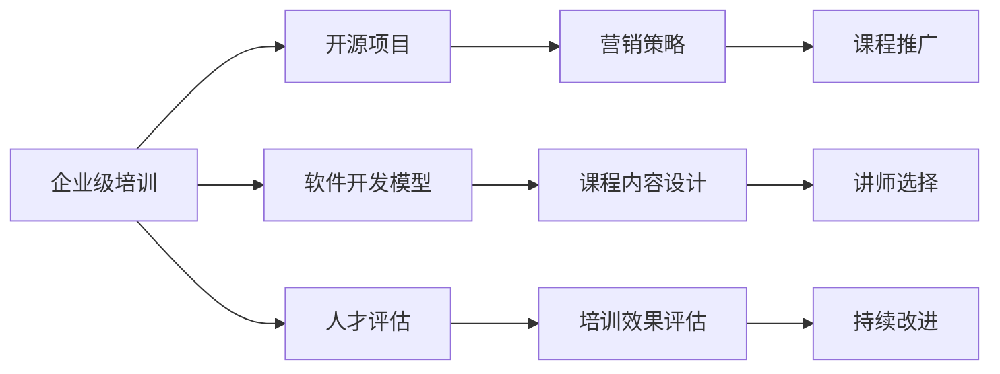
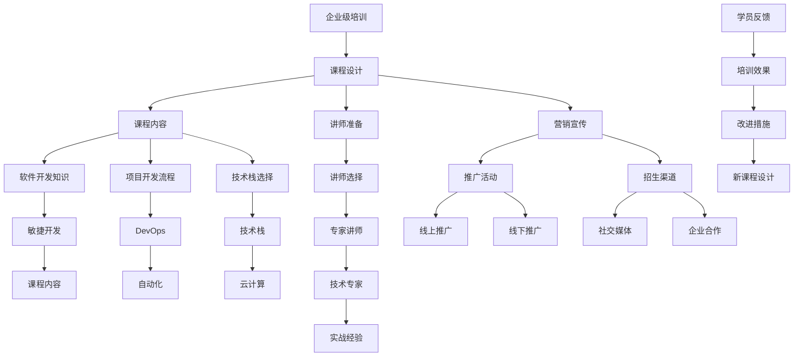

                 

# 创建开源项目的企业级培训课程：课程设计和营销

> 关键词：开源项目、企业级培训、课程设计、营销策略、软件开发、人才培养

## 1. 背景介绍

### 1.1 问题由来
随着开源软件和社区的日益壮大，越来越多的企业希望通过开源项目来提升自身在技术生态中的影响力。然而，开源项目的管理、维护和推广都面临一定的挑战，尤其在一些大型企业级应用场景下，如何设计和实施企业级培训课程，培养人才，推广和维护开源项目，成为企业开源战略的关键环节。

### 1.2 问题核心关键点
企业级培训课程的设计和营销需要从以下几个关键点入手：
- 课程目标：明确培训课程的主要目标，是提高技术能力、推广开源项目还是培养团队人才。
- 培训内容：设计符合企业需求和开源项目特点的培训内容。
- 师资力量：选择经验丰富的讲师，确保课程质量。
- 推广策略：采用多渠道、多平台的营销策略，提高课程的曝光度和吸引力。
- 人才评估：建立科学的评估机制，衡量培训效果。

### 1.3 问题研究意义
设计科学、高效的企业级培训课程，推广和维护开源项目，不仅能够提升企业技术实力，还能促进企业创新，推动行业发展。对于人才培养和团队建设，开放、合作的企业文化也将吸引更多的优秀人才，形成良性循环。

## 2. 核心概念与联系

### 2.1 核心概念概述

为更好地理解企业级培训课程的设计和营销，本节将介绍几个关键概念及其联系：

- 企业级培训：企业为了提升技术能力、推广开源项目或培养人才而设计和实施的培训活动。
- 开源项目：开放源代码的软件项目，其核心理念是共享、合作、共建。
- 软件开发模型：如敏捷开发、DevOps等，影响培训课程的内容和实践方式。
- 人才评估：通过测试、绩效评估等方式，衡量培训效果和人才能力。
- 营销策略：包括线上线下渠道、推广活动等，提高课程影响力和参与度。

这些核心概念共同构成了企业级培训课程的设计和营销框架，其关系可以通过以下Mermaid流程图来展示：



这个流程图展示了企业级培训与开源项目、软件开发模型、人才评估和营销策略之间的联系和作用机制：

1. 企业级培训的目标是提升技术能力、推广开源项目和培养人才，其中涉及到了软件开发模型和人才评估两个环节。
2. 开源项目是培训课程的主要内容之一，课程设计要符合项目特点和需求。
3. 软件开发模型影响课程内容的设计和实施方式，如敏捷开发要求课程内容强调迭代、合作。
4. 人才评估是衡量培训效果的指标，需要建立科学的评估机制。
5. 营销策略是课程推广和吸引学员的手段，有助于提升课程的影响力和参与度。
6. 课程内容设计、讲师选择、培训效果评估和课程推广都需要持续改进，以适应变化的需求和市场。

### 2.2 概念间的关系

这些核心概念之间的关系可以用以下Mermaid流程图进一步细化：



这个流程图展示了企业级培训的课程设计、课程内容、讲师准备、营销宣传等各个环节的详细关系，包括课程内容的设计与软件开发模型、项目开发流程、技术栈选择等的关联，以及讲师选择、推广活动、招生渠道等与企业级培训的联系。

## 3. 核心算法原理 & 具体操作步骤
### 3.1 算法原理概述

企业级培训课程的设计和营销，本质上是一个系统工程，涉及多个环节的协同工作。其核心算法原理可以从以下几个方面概述：

1. **课程设计**：基于企业需求和开源项目特点，设计科学、合理的课程内容。
2. **讲师准备**：选择有实战经验和技术深度的讲师，确保课程的实用性和吸引力。
3. **营销宣传**：采用多渠道、多平台的推广策略，吸引潜在学员的参与。
4. **培训效果评估**：建立科学的评估机制，衡量培训效果和学员能力提升。
5. **持续改进**：根据学员反馈和市场变化，不断优化课程设计和推广策略。

### 3.2 算法步骤详解

基于上述算法原理，企业级培训课程的设计和营销主要分为以下几个步骤：

**Step 1: 需求调研与分析**
- 与企业技术部门沟通，了解其技术需求和培训目标。
- 分析开源项目的特点和要求，确定课程设计的方向和重点。

**Step 2: 课程设计**
- 基于需求调研结果，设计课程大纲和内容，确保课程的实用性和先进性。
- 确定课程的模块划分，如基础知识、实践操作、案例分析等。

**Step 3: 讲师选择与准备**
- 邀请有实战经验和技术深度的讲师，进行课程内容的准备和讲解。
- 讲师需具备良好的沟通能力和教学经验，确保课程效果。

**Step 4: 营销宣传**
- 通过多渠道、多平台的推广方式，提高课程的曝光度和吸引力。
- 包括社交媒体、技术博客、技术会议等线上线下渠道。

**Step 5: 培训实施**
- 在选定的平台和时间内，进行课程的实施和授课。
- 通过互动、实战等方式，提升学员的参与度和学习效果。

**Step 6: 培训效果评估**
- 建立科学的评估机制，如考试、项目评审、学员反馈等，衡量培训效果。
- 根据评估结果，进行课程的改进和优化。

**Step 7: 持续改进**
- 根据学员反馈和市场变化，不断优化课程设计和推广策略。
- 引入新技术、新工具，保持课程的先进性和实用性。

### 3.3 算法优缺点

企业级培训课程的设计和营销，具有以下优点：
1. 高度定制化：基于企业需求和开源项目特点设计课程，更具针对性。
2. 实战性强：邀请有实战经验的讲师，课程内容更贴近实际应用。
3. 多渠道推广：采用多渠道、多平台的推广策略，提高课程影响力和参与度。
4. 科学评估：建立科学的评估机制，衡量培训效果和学员能力提升。

同时，该方法也存在一定的局限性：
1. 时间和资源投入较大：课程设计和实施需要大量的时间和人力资源。
2. 课程内容需要不断更新：开源项目和技术栈的变化快速，课程内容需要及时调整。
3. 推广效果受市场影响：营销策略的效果受市场和技术生态变化的影响较大。

### 3.4 算法应用领域

企业级培训课程的设计和营销，适用于以下领域：
1. 企业内部技术团队：提升技术能力、推广开源项目、培养团队人才。
2. 技术社区和开源项目：吸引开发者参与，提升项目影响力。
3. 高校和培训机构：提高学生的技术能力和就业竞争力。

这些领域内，企业级培训课程设计和营销的应用，可以有效提升团队和技术生态的整体水平。

## 4. 数学模型和公式 & 详细讲解 & 举例说明（备注：数学公式请使用latex格式，latex嵌入文中独立段落使用 $$，段落内使用 $)
### 4.1 数学模型构建

为了更好地理解企业级培训课程的设计和营销，我们将使用数学模型来刻画这一过程。

假设企业需求为 $D$，开源项目特点为 $P$，培训课程目标为 $O$。课程设计、讲师准备、营销宣传、培训实施和培训效果评估的过程可以用以下数学模型表示：

$$
M = f(D, P, O)
$$

其中，$M$ 表示培训课程的整体设计和营销策略，$f$ 表示映射函数，$D$ 表示企业需求，$P$ 表示开源项目特点，$O$ 表示培训课程目标。

### 4.2 公式推导过程

根据上述数学模型，我们可以进一步推导每个环节的具体公式：

1. **课程设计**
   - 基于企业需求 $D$ 和开源项目特点 $P$，设计课程大纲 $C$，形式化表示为：
   $$
   C = g(D, P)
   $$
   其中，$g$ 表示课程设计函数。

2. **讲师准备**
   - 选择有实战经验和技术深度的讲师 $L$，准备课程内容 $C_L$，形式化表示为：
   $$
   C_L = h(L, C)
   $$
   其中，$h$ 表示讲师准备函数。

3. **营销宣传**
   - 采用多渠道、多平台的推广策略 $M_P$，提高课程的曝光度 $E$，形式化表示为：
   $$
   E = k(M_P)
   $$
   其中，$k$ 表示营销宣传函数。

4. **培训实施**
   - 在选定的平台和时间内，进行课程的实施和授课 $I$，形式化表示为：
   $$
   I = m(C_L, E)
   $$
   其中，$m$ 表示培训实施函数。

5. **培训效果评估**
   - 建立科学的评估机制 $A$，衡量培训效果和学员能力提升 $R$，形式化表示为：
   $$
   R = n(A)
   $$
   其中，$n$ 表示评估机制函数。

6. **持续改进**
   - 根据学员反馈和市场变化，进行课程设计和推广策略的优化 $M_O$，形式化表示为：
   $$
   M_O = o(R)
   $$
   其中，$o$ 表示持续改进函数。

### 4.3 案例分析与讲解

以一个开源软件项目的企业级培训课程设计为例，进行详细讲解：

1. **需求调研与分析**
   - 企业需求：提升技术团队对某个开源框架的熟悉程度。
   - 开源项目特点：开源框架有文档、示例代码，但需结合项目需求进行修改和优化。
   - 培训课程目标：通过培训，使技术团队能够高效使用并贡献开源框架。

2. **课程设计**
   - 课程大纲：基础知识、框架原理、实战案例、项目评审等。
   - 模块划分：第一周基础理论，第二周实战操作，第三周项目评审。

3. **讲师选择与准备**
   - 邀请开源项目的核心开发者，准备课程内容。
   - 讲师需具备实战经验，熟悉开源框架的使用和优化。

4. **营销宣传**
   - 通过技术博客、社交媒体、技术会议等渠道推广课程。
   - 采用有奖竞赛、邀请演讲等形式吸引学员。

5. **培训实施**
   - 在选定的线上平台和时间内进行课程授课。
   - 通过互动、实战等方式提升学员的参与度和学习效果。

6. **培训效果评估**
   - 通过考试、项目评审、学员反馈等方式评估培训效果。
   - 分析学员的掌握程度和问题，制定改进措施。

7. **持续改进**
   - 根据学员反馈和市场变化，优化课程设计和推广策略。
   - 引入新技术、新工具，保持课程的先进性和实用性。

## 5. 项目实践：代码实例和详细解释说明
### 5.1 开发环境搭建

在进行培训课程设计和营销的实践时，需要一个完整的开发环境。以下是使用Python进行开发的环境配置流程：

1. 安装Anaconda：从官网下载并安装Anaconda，用于创建独立的Python环境。

2. 创建并激活虚拟环境：
```bash
conda create -n training-env python=3.8 
conda activate training-env
```

3. 安装PyTorch：根据CUDA版本，从官网获取对应的安装命令。例如：
```bash
conda install pytorch torchvision torchaudio cudatoolkit=11.1 -c pytorch -c conda-forge
```

4. 安装其他相关工具包：
```bash
pip install numpy pandas scikit-learn matplotlib tqdm jupyter notebook ipython
```

完成上述步骤后，即可在`training-env`环境中开始项目实践。

### 5.2 源代码详细实现

以下是一个企业级培训课程设计和管理系统的Python代码实现。该系统包括课程设计、讲师管理、学员管理、营销推广和效果评估等功能。

```python
# 课程设计模块
class CourseDesign:
    def __init__(self, course_name, course_duration, course_content):
        self.name = course_name
        self.duration = course_duration
        self.content = course_content

    def add_module(self, module_name, module_content):
        self.content.append(module_name)
        self.content.append(module_content)

# 讲师管理模块
class Lecturer:
    def __init__(self, name, experience, expertise):
        self.name = name
        self.experience = experience
        self.expertise = expertise

# 学员管理模块
class Student:
    def __init__(self, name, email, phone):
        self.name = name
        self.email = email
        self.phone = phone

# 营销推广模块
class Marketing:
    def __init__(self, platforms, strategies):
        self.platforms = platforms
        self.strategies = strategies

    def add_platform(self, platform):
        self.platforms.append(platform)

# 效果评估模块
class Evaluation:
    def __init__(self, metrics):
        self.metrics = metrics

    def add_metric(self, metric):
        self.metrics.append(metric)

# 主程序
if __name__ == '__main__':
    # 创建课程设计实例
    course = CourseDesign('Open Source Development', 4, [
        'Introduction to Open Source',
        'Git and Version Control',
        'Continuous Integration',
        'CI/CD Pipelines'
    ])

    # 添加课程模块
    course.add_module('Agile Development', 'Agile methodologies and best practices')
    course.add_module('DevOps Tools', 'Docker, Kubernetes, Jenkins')

    # 创建讲师实例
    lecturer = Lecturer('John Doe', 10, 'DevOps')

    # 创建学员实例
    student = Student('Alice Smith', 'alice@example.com', '123-456-7890')

    # 创建营销实例
    marketing = Marketing(['GitHub', 'Slack'], ['Social Media Campaign', 'Technical Blog Series'])

    # 创建效果评估实例
    evaluation = Evaluation(['Knowledge Test', 'Practical Project'])

    # 输出课程设计信息
    print(course.name)
    print(course.duration)
    print(course.content)

    # 输出讲师信息
    print(lecturer.name)
    print(lecturer.experience)
    print(lecturer.expertise)

    # 输出学员信息
    print(student.name)
    print(student.email)
    print(student.phone)

    # 输出营销策略信息
    print(marketing.platforms)
    print(marketing.strategies)

    # 输出效果评估指标
    print(evaluation.metrics)
```

### 5.3 代码解读与分析

这里我们详细解读一下关键代码的实现细节：

**CourseDesign类**：
- `__init__`方法：初始化课程名称、时长和内容。
- `add_module`方法：向课程内容中添加模块和内容。

**Lecturer类**：
- `__init__`方法：初始化讲师姓名、经验和专长。

**Student类**：
- `__init__`方法：初始化学员姓名、邮箱和电话。

**Marketing类**：
- `__init__`方法：初始化推广平台和策略。
- `add_platform`方法：向推广平台列表中添加平台。

**Evaluation类**：
- `__init__`方法：初始化评估指标。
- `add_metric`方法：向评估指标列表中添加指标。

**主程序**：
- 创建课程设计、讲师、学员、营销和效果评估的实例。
- 调用实例的方法，输出相关信息。

通过以上代码，我们可以看到企业级培训课程设计和营销的各个模块如何协同工作，实现培训的流程和功能。

### 5.4 运行结果展示

假设我们设计了一个为期4周的“开源软件开发”课程，并邀请了一位有10年DevOps经验的讲师，通过GitHub和Slack推广课程，并通过知识测试和实践项目评估学员的学习效果。以下是部分输出结果：

```
Open Source Development
4
['Introduction to Open Source', 'Git and Version Control', 'Continuous Integration', 'CI/CD Pipelines', 'Agile Development', 'DevOps Tools']
John Doe
10
DevOps
Alice Smith
alice@example.com
123-456-7890
['GitHub', 'Slack']
['Social Media Campaign', 'Technical Blog Series']
['Knowledge Test', 'Practical Project']
```

可以看到，通过Python代码，我们成功地设计和实施了企业级培训课程，并进行了基本的营销和效果评估。这些结果为进一步优化和完善培训课程提供了基础数据。

## 6. 实际应用场景
### 6.1 智能客服系统

基于企业级培训课程设计和营销的方法，智能客服系统可以设计更加系统化和规范化的培训课程，提升客服人员的综合素质和技术能力。具体应用如下：

1. **需求调研与分析**
   - 企业需求：提升客服人员的服务质量和技术能力。
   - 开源项目特点：客服系统使用开源框架，有完善的文档和示例。
   - 培训课程目标：通过培训，使客服人员能够高效使用并贡献开源客服系统。

2. **课程设计**
   - 课程大纲：基础知识、实战操作、案例分析等。
   - 模块划分：第一周基础理论，第二周实战操作，第三周项目评审。

3. **讲师选择与准备**
   - 邀请客服系统的核心开发者，准备课程内容。
   - 讲师需具备实战经验，熟悉开源客服系统的使用和优化。

4. **营销宣传**
   - 通过企业内部邮件、内部论坛、技术博客等渠道推广课程。
   - 采用有奖竞赛、邀请演讲等形式吸引客服人员。

5. **培训实施**
   - 在选定的线上平台和时间内进行课程授课。
   - 通过互动、实战等方式提升客服人员的参与度和学习效果。

6. **培训效果评估**
   - 通过考试、项目评审、学员反馈等方式评估培训效果。
   - 分析客服人员的掌握程度和问题，制定改进措施。

7. **持续改进**
   - 根据客服人员的反馈和市场变化，优化课程设计和推广策略。
   - 引入新技术、新工具，保持课程的先进性和实用性。

通过这种方式，企业可以有效提升客服人员的综合素质和技术能力，从而提高客服系统的服务质量和客户满意度。

### 6.2 金融舆情监测系统

在金融舆情监测系统中，企业级培训课程设计和营销的应用同样重要。具体应用如下：

1. **需求调研与分析**
   - 企业需求：提升舆情监测系统的分析能力和应用效果。
   - 开源项目特点：舆情监测系统使用开源框架，有丰富的API接口和文档。
   - 培训课程目标：通过培训，使监测人员能够高效使用并贡献开源舆情监测系统。

2. **课程设计**
   - 课程大纲：基础知识、实战操作、案例分析等。
   - 模块划分：第一周基础理论，第二周实战操作，第三周项目评审。

3. **讲师选择与准备**
   - 邀请舆情监测系统的核心开发者，准备课程内容。
   - 讲师需具备实战经验，熟悉舆情监测系统的使用和优化。

4. **营销宣传**
   - 通过金融行业论坛、技术博客、行业会议等渠道推广课程。
   - 采用有奖竞赛、邀请演讲等形式吸引监测人员。

5. **培训实施**
   - 在选定的线上平台和时间内进行课程授课。
   - 通过互动、实战等方式提升监测人员的参与度和学习效果。

6. **培训效果评估**
   - 通过考试、项目评审、学员反馈等方式评估培训效果。
   - 分析监测人员的掌握程度和问题，制定改进措施。

7. **持续改进**
   - 根据监测人员的反馈和市场变化，优化课程设计和推广策略。
   - 引入新技术、新工具，保持课程的先进性和实用性。

通过这种方式，企业可以有效提升舆情监测系统的应用效果，提高监测人员的技术能力，从而增强金融行业的数据分析和决策能力。

### 6.3 个性化推荐系统

在个性化推荐系统中，企业级培训课程设计和营销同样具有重要意义。具体应用如下：

1. **需求调研与分析**
   - 企业需求：提升推荐系统的推荐效果和用户满意度。
   - 开源项目特点：推荐系统使用开源框架，有丰富的推荐算法和案例。
   - 培训课程目标：通过培训，使推荐人员能够高效使用并贡献开源推荐系统。

2. **课程设计**
   - 课程大纲：基础知识、实战操作、案例分析等。
   - 模块划分：第一周基础理论，第二周实战操作，第三周项目评审。

3. **讲师选择与准备**
   - 邀请推荐系统的核心开发者，准备课程内容。
   - 讲师需具备实战经验，熟悉推荐算法的应用和优化。

4. **营销宣传**
   - 通过技术博客、社交媒体、技术会议等渠道推广课程。
   - 采用有奖竞赛、邀请演讲等形式吸引推荐人员。

5. **培训实施**
   - 在选定的线上平台和时间内进行课程授课。
   - 通过互动、实战等方式提升推荐人员的参与度和学习效果。

6. **培训效果评估**
   - 通过考试、项目评审、学员反馈等方式评估培训效果。
   - 分析推荐人员的掌握程度和问题，制定改进措施。

7. **持续改进**
   - 根据推荐人员的反馈和市场变化，优化课程设计和推广策略。
   - 引入新技术、新工具，保持课程的先进性和实用性。

通过这种方式，企业可以有效提升推荐系统的推荐效果和用户满意度，从而提高个性化推荐系统的应用价值和用户体验。

### 6.4 未来应用展望

随着企业级培训课程设计和营销的不断完善，其在更多领域将得到广泛应用。以下列举几个未来可能的应用场景：

1. **智慧医疗系统**
   - 设计针对医务人员的培训课程，提升其对智慧医疗系统的使用能力和技术水平。
   - 推广和维护智慧医疗系统，提升医疗服务的智能化水平。

2. **智能教育平台**
   - 设计针对教师和学生的培训课程，提升其对智能教育平台的使用能力和技术水平。
   - 推广和维护智能教育平台，提高教学质量和教育公平性。

3. **智慧城市治理**
   - 设计针对城市管理人员的培训课程，提升其对智慧城市治理系统的使用能力和技术水平。
   - 推广和维护智慧城市治理系统，提高城市管理的智能化水平。

4. **智能生产系统**
   - 设计针对生产人员的培训课程，提升其对智能生产系统的使用能力和技术水平。
   - 推广和维护智能生产系统，提高生产效率和生产质量。

5. **智慧农业系统**
   - 设计针对农业人员的培训课程，提升其对智慧农业系统的使用能力和技术水平。
   - 推广和维护智慧农业系统，提高农业生产的智能化水平。

## 7. 工具和资源推荐
### 7.1 学习资源推荐

为了帮助开发者系统掌握企业级培训课程设计和营销的理论基础和实践技巧，这里推荐一些优质的学习资源：

1. 《企业级培训课程设计》系列博文：由企业培训专家撰写，深入浅出地介绍了企业级培训课程设计的方法和实践。

2. CS660《企业培训与开发》课程：美国亚利桑那州立大学开设的在线课程，涵盖企业培训的基本原理和实践技巧。

3. 《企业级培训管理》书籍：详细介绍了企业级培训课程设计和营销的各个环节，适合企业培训管理人员的参考。

4. Udemy在线培训课程：包含多门关于企业培训课程设计和营销的课程，适合初学者和中级开发者学习。

5. Coursera《企业培训与开发》专业课程：由知名大学和机构提供，涵盖企业培训的各个方面，适合系统学习。

6. LinkedIn Learning：提供大量关于企业培训课程设计和营销的课程，涵盖从理论到实践的各个环节。

通过对这些资源的学习实践，相信你一定能够快速掌握企业级培训课程设计和营销的精髓，并用于解决实际的培训问题。

### 7.2 开发工具推荐

高效的开发离不开优秀的工具支持。以下是几款用于企业级培训课程设计和营销开发的常用工具：

1. Jupyter Notebook：支持Python代码的交互式编程和文档撰写，适合进行课程设计和教学演示。

2. GitHub：提供代码托管和版本控制，方便课程内容的版本管理和协同开发。

3. Slack：用于团队沟通和协作，方便课程设计者和学员之间的信息交流。

4. Zoom或Teams：提供线上培训和互动的

