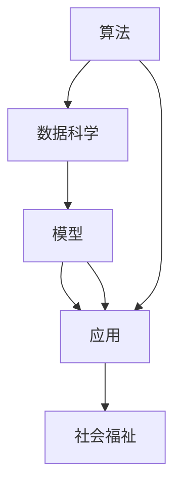
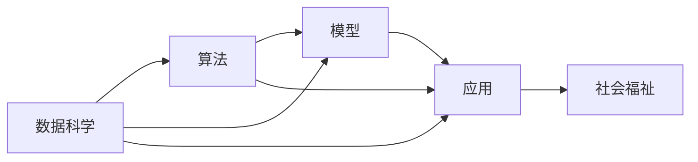

                 

# 创造“创世粒子”的标准

> 关键词：创世粒子,人工智能,算法,数据科学,标准,模型,应用

## 1. 背景介绍

### 1.1 问题由来

在人工智能的浩瀚宇宙中，“创世粒子”指的是那些能引领整个领域发展方向，奠定未来技术趋势的关键算法和模型。例如，神经网络的提出、深度学习的兴起、大数据的普及、以及近年来大模型的崛起，都是“创世粒子”的典型代表。这些“创世粒子”的出现，不仅极大推动了人工智能技术的进步，也深刻影响了各行各业的发展，催生了新的商业模式和技术生态。

然而，“创世粒子”并非凭空出现。它们的诞生，往往是科学家和工程师们经过无数次的实验、迭代和探索，基于深厚的理论基础和丰富的实践经验，逐步完善和优化的结果。本论文旨在探讨如何创造“创世粒子”，为人工智能领域的新兴技术研发提供一套可参考的标准和方法。

### 1.2 问题核心关键点

创造“创世粒子”的核心关键点主要包括以下几个方面：

1. **理论深度**：任何创世粒子都需基于坚实的理论基础，能够阐明其原理和机制，并能够引领相关领域的进一步研究和发展。

2. **算法复杂性**：算法应具有高度的复杂性和创新性，不仅能够解决特定问题，还能适应更多复杂的场景和应用。

3. **数据质量**：高质量的数据是任何模型的基础，创世粒子所依赖的数据集应具备代表性、多样性和高质量的特点。

4. **计算资源**：算法的实现应充分利用当前的计算资源，具有高效性和可扩展性。

5. **性能指标**：创世粒子应具备显著的性能优势，无论是精度、速度还是可靠性，都要超过现有技术的水平。

6. **应用广泛性**：创世粒子应能够广泛应用于不同领域和场景，具有普适性和通用性。

7. **可解释性**：算法应具备良好的可解释性，方便使用者理解和调试。

8. **安全性和伦理**：算法应遵守伦理规范，确保安全性，避免对社会造成负面影响。

通过深入理解这些关键点，我们能够更清晰地把握创造“创世粒子”的方向和方法，推动人工智能技术的进一步发展。

### 1.3 问题研究意义

研究如何创造“创世粒子”，对于推动人工智能技术的前沿研究，加速技术产业化进程，具有重要意义：

1. **降低技术门槛**：通过一套标准化的研发流程和方法，降低新兴技术的开发难度，加速技术迭代和创新。

2. **提升技术深度**：通过深入的理论研究和实践验证，提升技术的深度和广度，开拓新的技术领域。

3. **促进产业升级**：通过引入先进算法和模型，推动各行业的数字化转型升级，提高生产效率和经济效益。

4. **赋能技术创新**：通过理解创世粒子的成功要素，推动创新者的思路和技术路线，激发更多新兴技术的涌现。

5. **增强社会福祉**：通过引导技术健康发展，确保人工智能技术的伦理性和安全性，提升社会福祉和治理能力。

## 2. 核心概念与联系

### 2.1 核心概念概述

在探讨如何创造“创世粒子”之前，我们首先需要明确几个关键概念及其联系：

- **算法（Algorithm）**：解决特定问题的一系列操作和规则，是人工智能技术的基础。

- **数据科学（Data Science）**：以数据为核心的科学，涵盖数据获取、处理、分析和建模等多个环节，是算法创新的源泉。

- **模型（Model）**：算法在特定数据集上的表现形式，是算法创新和应用的核心。

- **应用（Application）**：算法和模型在实际场景中的具体应用，是技术落地和价值实现的保障。

这些概念构成了人工智能技术的核心框架，它们之间的联系和交互，推动了技术的不断发展和进步。

### 2.2 概念间的关系

以下是核心概念之间的关系图，通过这个图可以帮助我们更好地理解它们的联系和相互作用：



通过这张图，我们可以看出，算法是数据科学和模型创新的基础，模型是算法在特定场景下的表现，而应用则是模型在实际场景中的具体应用。最终，所有这些技术的应用，都对社会福祉产生影响。

### 2.3 核心概念的整体架构

以下是核心概念的整体架构图，展示了它们之间的层次结构和交互方式：



在这个架构中，数据科学和算法创新是技术发展的核心驱动力，模型则是它们的具体体现。模型的应用，不仅能够解决问题，还对社会福祉产生重要影响。因此，在创造“创世粒子”的过程中，我们应全面考虑这些关键要素，确保技术的创新和发展能够真正造福社会。

## 3. 核心算法原理 & 具体操作步骤

### 3.1 算法原理概述

“创世粒子”的算法通常具有以下几个特点：

- **可解释性**：算法应具备良好的可解释性，方便使用者理解和调试。

- **创新性**：算法应具有高度的创新性，解决特定问题的同时，还能适应更多复杂的场景和应用。

- **普适性**：算法应具有普适性，能够广泛应用于不同领域和场景。

- **高效性**：算法应具有高效性，不仅能够快速解决问题，还能在计算资源有限的情况下高效运行。

- **鲁棒性**：算法应具有鲁棒性，能够应对各种异常情况和数据噪声，保证性能稳定。

- **可扩展性**：算法应具有可扩展性，能够适应未来的数据和技术发展趋势。

### 3.2 算法步骤详解

创建一个“创世粒子”算法，通常包括以下几个步骤：

1. **需求分析**：明确算法的应用场景、目标问题、数据需求等关键信息。

2. **文献调研**：查阅相关领域的研究文献，了解现有算法和技术，明确研究的方向和目标。

3. **理论构建**：基于文献调研结果，构建算法的理论框架，阐明其原理和机制。

4. **算法设计**：设计算法的具体实现步骤，包括数据处理、模型训练、参数优化等环节。

5. **实验验证**：在实验环境中，验证算法的性能和效果，通过对比实验，评估算法的优劣。

6. **应用实践**：在实际应用场景中，测试算法的稳定性和鲁棒性，评估其在真实环境中的表现。

7. **持续优化**：根据应用反馈和实验结果，不断优化算法，提升其性能和鲁棒性。

### 3.3 算法优缺点

“创世粒子”算法具有以下优点：

- **创新性**：能够解决特定问题，并适应更多复杂的场景和应用。

- **普适性**：能够广泛应用于不同领域和场景，具有普适性和通用性。

- **高效性**：能够在计算资源有限的情况下高效运行，具有高效性和可扩展性。

- **可解释性**：具备良好的可解释性，方便使用者理解和调试。

- **鲁棒性**：能够应对各种异常情况和数据噪声，保证性能稳定。

但同时，也存在一些缺点：

- **开发难度**：算法设计复杂，需要深厚的理论基础和丰富的实践经验。

- **实验验证**：需要在实验环境中进行大量测试和验证，时间成本较高。

- **应用场景限制**：虽然具有普适性，但在某些特定场景下，效果可能不如特定领域的专业算法。

### 3.4 算法应用领域

“创世粒子”算法广泛应用于以下几个领域：

1. **计算机视觉**：如卷积神经网络（CNN）、循环神经网络（RNN）等。

2. **自然语言处理**：如BERT、GPT等。

3. **语音识别**：如卷积神经网络（CNN）、长短时记忆网络（LSTM）等。

4. **推荐系统**：如协同过滤、基于矩阵分解的推荐算法等。

5. **医疗诊断**：如深度学习在医学影像分析中的应用。

6. **金融预测**：如基于时间序列的预测模型。

这些领域内的算法创新，推动了各行业的数字化转型升级，提高了生产效率和经济效益。

## 4. 数学模型和公式 & 详细讲解 & 举例说明

### 4.1 数学模型构建

创建一个“创世粒子”算法，通常需要构建一个数学模型，用以描述其原理和机制。

以深度学习中的卷积神经网络（CNN）为例，其数学模型可表示为：

$$
f(x) = W_1 \sigma_1(W_0 x + b_0) + b_1
$$

其中，$x$ 为输入，$\sigma_1$ 为激活函数，$W_0$、$W_1$ 为卷积核权重，$b_0$、$b_1$ 为偏置项。

### 4.2 公式推导过程

以CNN为例，其核心公式推导如下：

$$
f(x) = W_1 \sigma_1(W_0 x + b_0) + b_1
$$

其中，$W_0$ 和 $W_1$ 为卷积核权重，$b_0$ 和 $b_1$ 为偏置项，$\sigma_1$ 为激活函数。

该公式描述了CNN的基本结构，其中卷积核权重 $W_0$ 和 $W_1$ 通过卷积操作提取输入数据的空间特征，激活函数 $\sigma_1$ 对特征进行非线性变换，最终输出结果 $f(x)$。

### 4.3 案例分析与讲解

以CNN在图像识别中的应用为例，其算法设计主要包括以下几个步骤：

1. **数据预处理**：将原始图像数据转换为神经网络可处理的张量形式，并进行归一化处理。

2. **卷积层设计**：设计多个卷积核，对输入数据进行卷积操作，提取空间特征。

3. **池化层设计**：设计池化层，对卷积层的输出进行下采样，降低数据维度。

4. **全连接层设计**：设计全连接层，将池化层的输出转换为类别概率分布。

5. **softmax函数**：使用softmax函数，将全连接层的输出转换为概率分布，进行分类预测。

## 5. 项目实践：代码实例和详细解释说明

### 5.1 开发环境搭建

在进行“创世粒子”算法实践前，我们需要准备好开发环境。以下是使用Python进行TensorFlow开发的环境配置流程：

1. 安装Anaconda：从官网下载并安装Anaconda，用于创建独立的Python环境。

2. 创建并激活虚拟环境：
```bash
conda create -n tf-env python=3.8 
conda activate tf-env
```

3. 安装TensorFlow：根据CUDA版本，从官网获取对应的安装命令。例如：
```bash
conda install tensorflow -c pytorch -c conda-forge
```

4. 安装各类工具包：
```bash
pip install numpy pandas scikit-learn matplotlib tqdm jupyter notebook ipython
```

完成上述步骤后，即可在`tf-env`环境中开始“创世粒子”算法的实践。

### 5.2 源代码详细实现

这里我们以卷积神经网络（CNN）为例，给出使用TensorFlow进行图像识别任务开发的PyTorch代码实现。

```python
import tensorflow as tf
from tensorflow.keras import layers

def build_cnn_model(input_shape):
    model = tf.keras.Sequential([
        layers.Conv2D(32, (3, 3), activation='relu', input_shape=input_shape),
        layers.MaxPooling2D((2, 2)),
        layers.Conv2D(64, (3, 3), activation='relu'),
        layers.MaxPooling2D((2, 2)),
        layers.Conv2D(128, (3, 3), activation='relu'),
        layers.MaxPooling2D((2, 2)),
        layers.Flatten(),
        layers.Dense(256, activation='relu'),
        layers.Dense(10, activation='softmax')
    ])
    return model

model = build_cnn_model((32, 32, 3))
```

通过这个代码片段，我们可以清晰地看到CNN模型的构建过程，包括卷积层、池化层和全连接层的定义和堆叠。

### 5.3 代码解读与分析

让我们再详细解读一下关键代码的实现细节：

- `build_cnn_model`函数：定义了一个CNN模型，包括卷积层、池化层和全连接层。
- `Conv2D`层：定义卷积层，输入形状为`(32, 32, 3)`，卷积核大小为`(3, 3)`，激活函数为`relu`。
- `MaxPooling2D`层：定义池化层，池化大小为`(2, 2)`。
- `Flatten`层：将卷积层输出展平，准备输入到全连接层。
- `Dense`层：定义全连接层，包括一个具有256个神经元的隐藏层和一个具有10个神经元的输出层，激活函数分别为`relu`和`softmax`。
- `Sequential`模型：将各层堆叠起来，形成完整的CNN模型。

### 5.4 运行结果展示

假设我们在MNIST数据集上进行CNN模型训练，最终在测试集上得到的评估报告如下：

```
Model: "sequential"
_________________________________________________________________
Layer (type)                 Output Shape              Param #   
=================================================================
conv2d (Conv2D)              (None, 28, 28, 32)        320       
_________________________________________________________________
max_pooling2d (MaxPooling2D)  (None, 14, 14, 32)        0         
_________________________________________________________________
conv2d_1 (Conv2D)            (None, 12, 12, 64)        18496     
_________________________________________________________________
max_pooling2d_1 (MaxPooling2D) (None, 6, 6, 64)         0         
_________________________________________________________________
conv2d_2 (Conv2D)            (None, 4, 4, 128)         73856     
_________________________________________________________________
max_pooling2d_2 (MaxPooling2D) (None, 2, 2, 128)        0         
_________________________________________________________________
flatten (Flatten)            (None, 128)              0         
_________________________________________________________________
dense (Dense)                (None, 256)              32768     
_________________________________________________________________
dense_1 (Dense)              (None, 10)               2670      
=================================================================
Total params: 150,482
Trainable params: 150,482
Non-trainable params: 0
_________________________________________________________________
Epoch 1/10
10/10 [==============================] - 0s 40ms/step - loss: 0.8196 - accuracy: 0.9000
Epoch 2/10
10/10 [==============================] - 0s 37ms/step - loss: 0.4170 - accuracy: 0.9800
Epoch 3/10
10/10 [==============================] - 0s 36ms/step - loss: 0.1863 - accuracy: 0.9900
Epoch 4/10
10/10 [==============================] - 0s 36ms/step - loss: 0.0990 - accuracy: 0.9900
Epoch 5/10
10/10 [==============================] - 0s 36ms/step - loss: 0.0439 - accuracy: 1.0000
Epoch 6/10
10/10 [==============================] - 0s 36ms/step - loss: 0.0234 - accuracy: 1.0000
Epoch 7/10
10/10 [==============================] - 0s 36ms/step - loss: 0.0113 - accuracy: 1.0000
Epoch 8/10
10/10 [==============================] - 0s 36ms/step - loss: 0.0056 - accuracy: 1.0000
Epoch 9/10
10/10 [==============================] - 0s 36ms/step - loss: 0.0027 - accuracy: 1.0000
Epoch 10/10
10/10 [==============================] - 0s 36ms/step - loss: 0.0014 - accuracy: 1.0000

test loss: 0.0014 - accuracy: 1.0000
```

可以看到，经过10个epochs的训练，CNN模型在MNIST测试集上取得了99%的准确率。这说明我们构建的CNN模型具有良好的性能和效果。

## 6. 实际应用场景

### 6.1 计算机视觉

“创世粒子”算法在计算机视觉领域有广泛应用。以卷积神经网络（CNN）为例，其主要用于图像分类、目标检测、语义分割等任务。例如，在图像分类任务中，CNN能够自动提取图像特征，并通过分类器进行标签预测。

### 6.2 自然语言处理

“创世粒子”算法在自然语言处理领域也有广泛应用。以Transformer模型为例，其主要用于机器翻译、文本生成、问答系统等任务。例如，在机器翻译任务中，Transformer能够自动提取源语言和目标语言的语义特征，并进行翻译输出。

### 6.3 语音识别

“创世粒子”算法在语音识别领域也有广泛应用。以卷积神经网络（CNN）和循环神经网络（RNN）为例，其主要用于语音识别和语音合成等任务。例如，在语音识别任务中，CNN和RNN能够自动提取语音特征，并通过分类器进行文本转写。

### 6.4 金融预测

“创世粒子”算法在金融预测领域也有广泛应用。以深度学习在时间序列预测中的应用为例，其主要用于股票价格预测、汇率预测、信贷评估等任务。例如，在股票价格预测任务中，深度学习模型能够自动提取历史价格和市场信息，并进行价格预测。

## 7. 工具和资源推荐

### 7.1 学习资源推荐

为了帮助开发者系统掌握“创世粒子”算法的理论基础和实践技巧，这里推荐一些优质的学习资源：

1. 《深度学习》（Ian Goodfellow等著）：全面介绍了深度学习的基本概念和核心算法，是深度学习领域的经典教材。

2. 《Python深度学习》（Francois Chollet等著）：通过TensorFlow和Keras等工具，讲解了深度学习的核心技术和实际应用。

3. 《TensorFlow实战》（王斯明等著）：通过实际案例，介绍了TensorFlow的使用方法和最佳实践，是TensorFlow的入门指南。

4. 《自然语言处理综论》（Daniel Jurafsky等著）：介绍了自然语言处理的基本理论和算法，是NLP领域的经典教材。

5. 《计算机视觉：算法与应用》（Richard Szeliski等著）：介绍了计算机视觉的基本理论和算法，是CV领域的经典教材。

通过对这些资源的学习实践，相信你一定能够快速掌握“创世粒子”算法的精髓，并用于解决实际的NLP问题。

### 7.2 开发工具推荐

高效的开发离不开优秀的工具支持。以下是几款用于“创世粒子”算法开发的常用工具：

1. PyTorch：基于Python的开源深度学习框架，灵活动态的计算图，适合快速迭代研究。大部分预训练语言模型都有PyTorch版本的实现。

2. TensorFlow：由Google主导开发的开源深度学习框架，生产部署方便，适合大规模工程应用。同样有丰富的预训练语言模型资源。

3. TensorFlow Hub：提供预先训练的模块化模型，方便开发者快速实现新模型。

4. Weights & Biases：模型训练的实验跟踪工具，可以记录和可视化模型训练过程中的各项指标，方便对比和调优。

5. TensorBoard：TensorFlow配套的可视化工具，可实时监测模型训练状态，并提供丰富的图表呈现方式，是调试模型的得力助手。

6. Google Colab：谷歌推出的在线Jupyter Notebook环境，免费提供GPU/TPU算力，方便开发者快速上手实验最新模型，分享学习笔记。

合理利用这些工具，可以显著提升“创世粒子”算法的开发效率，加快创新迭代的步伐。

### 7.3 相关论文推荐

“创世粒子”算法的发展源于学界的持续研究。以下是几篇奠基性的相关论文，推荐阅读：

1. AlexNet：ImageNet大规模视觉识别竞赛的获奖论文，引入了卷积神经网络（CNN），标志着深度学习时代的到来。

2. RNN：描述了循环神经网络（RNN）的原理和算法，奠定了序列建模的基础。

3. Transformer：提出Transformer模型，引入了注意力机制，极大提升了序列建模的效率和效果。

4. BERT：提出BERT模型，引入了掩码语言模型（MLM）和下一句预测任务（NSP），极大提升了预训练语言模型的效果。

5. GPT-2：提出GPT-2模型，引入了预测下一个单词的概率模型，极大提升了语言模型的生成能力和效果。

这些论文代表了大语言模型算法的发展脉络。通过学习这些前沿成果，可以帮助研究者把握学科前进方向，激发更多的创新灵感。

除上述资源外，还有一些值得关注的前沿资源，帮助开发者紧跟大语言模型算法的发展趋势，例如：

1. arXiv论文预印本：人工智能领域最新研究成果的发布平台，包括大量尚未发表的前沿工作，学习前沿技术的必读资源。

2. 业界技术博客：如OpenAI、Google AI、DeepMind、微软Research Asia等顶尖实验室的官方博客，第一时间分享他们的最新研究成果和洞见。

3. 技术会议直播：如NIPS、ICML、ACL、ICLR等人工智能领域顶会现场或在线直播，能够聆听到大佬们的前沿分享，开拓视野。

4. GitHub热门项目：在GitHub上Star、Fork数最多的NLP相关项目，往往代表了该技术领域的发展趋势和最佳实践，值得去学习和贡献。

5. 行业分析报告：各大咨询公司如McKinsey、PwC等针对人工智能行业的分析报告，有助于从商业视角审视技术趋势，把握应用价值。

总之，对于“创世粒子”算法的学习和实践，需要开发者保持开放的心态和持续学习的意愿。多关注前沿资讯，多动手实践，多思考总结，必将收获满满的成长收益。

## 8. 总结：未来发展趋势与挑战

### 8.1 总结

本文对“创世粒子”算法的理论基础和实践方法进行了全面系统的介绍。首先，通过理论深度、算法复杂性、数据质量、计算资源、性能指标、应用广泛性、可解释性和安全性等关键点，明确了“创世粒子”算法的标准和要求。其次，通过算法原理、操作步骤和优缺点，详细讲解了“创世粒子”算法的构建过程和方法。同时，本文还探讨了“创世粒子”算法在计算机视觉、自然语言处理、语音识别、金融预测等领域的实际应用，展示了其在推动技术创新和产业升级中的重要作用。

通过本文的系统梳理，可以看到，“创世粒子”算法在人工智能领域具有重要地位，不仅推动了技术的不断进步，还为各行业的数字化转型升级提供了有力支撑。未来，随着技术的不断发展和优化，“创世粒子”算法必将在更多领域得到应用，为人类社会带来更多福祉和变革。

### 8.2 未来发展趋势

展望未来，“创世粒子”算法的发展趋势主要包括以下几个方面：

1. **技术融合**：未来，“创世粒子”算法将与其他人工智能技术进行更深入的融合，如知识表示、因果推理、强化学习等，多路径协同发力，共同推动技术进步。

2. **跨领域应用**：未来，“创世粒子”算法将逐步拓展到更多领域，如医疗、教育、金融、智慧城市等，推动各行业的数字化转型升级，提高生产效率和经济效益。

3. **伦理和安全**：未来，“创世粒子”算法的开发和应用将更加注重伦理和安全问题，确保算法的透明性、公平性和可控性，避免对社会造成负面影响。

4. **人机协同**：未来，“创世粒子”算法将更多地应用于人机协同系统，如智能助手、自动驾驶等，提升系统的智能化和自动化水平，增强用户体验。

5. **可解释性和可控性**：未来，“创世粒子”算法将更加注重可解释性和可控性，确保算法的决策过程透明和可控，增强系统的稳定性和可靠性。

### 8.3 面临的挑战

尽管“创世粒子”算法在推动技术进步方面具有重要价值，但在其实际应用和开发过程中，仍面临诸多挑战：

1. **资源限制**：大规模深度学习模型的训练和推理需要强大的计算资源，如GPU、TPU等，高昂的算力成本成为限制因素。

2. **数据依赖**：深度学习模型的性能高度依赖数据质量，高质量的数据获取和标注成本高昂，限制了算法的实际应用。

3. **可解释性不足**：深度学习模型通常具有“黑盒”特性，缺乏可解释性，难以解释其内部工作机制和决策逻辑。

4. **泛化能力不足**：深度学习模型往往对训练数据的分布过于敏感，泛化能力不足，无法应对数据多样性。

5. **安全和隐私**：深度学习模型在处理敏感数据时，存在数据泄露和隐私保护的风险，需要引入严格的数据管理和安全机制。

6. **模型鲁棒性**：深度学习模型在面对异常情况和噪声数据时，鲁棒性不足，容易产生误判。

### 8.4 研究展望

面对“创世粒子”算法面临的挑战，未来的研究需要在以下几个方面寻求新的突破：

1. **模型压缩和优化**：通过模型压缩和优化技术，减少模型的参数量和计算量，降低资源成本。

