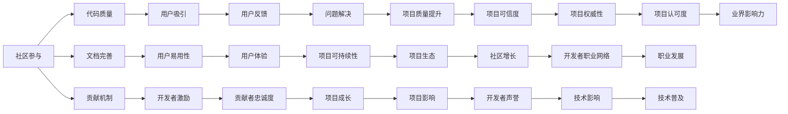

                 

# 利用开源项目构建个人影响力

## 1. 背景介绍

在当今这个技术迅猛发展的时代，开源项目已经成为技术交流和创新的重要平台。无论是初创公司的工程师，还是大公司资深架构师，甚至于独立开发者，开源项目都是建立个人影响力、展示技术实力的最佳途径。开源不仅代表了一种技术合作的精神，更是一种价值观和商业模式。本文将从背景、核心概念以及具体的操作实践等多个方面，深入探讨如何利用开源项目构建个人影响力。

## 2. 核心概念与联系

### 2.1 核心概念概述

开源项目的核心价值在于其开放性和协作性，它不仅是一个代码共享的平台，更是一个社区和文化的载体。通过参与开源项目，开发者可以：

- 积累代码实践经验
- 学习新技术和工具
- 提升技术协作和沟通能力
- 建立技术声誉和社区影响力
- 构建个人职业网络

### 2.2 核心概念间的关系

开源项目的成功，离不开以下几个关键因素：

1. **社区参与**：社区的活跃度和参与度是项目能否成功的关键。
2. **代码质量**：高质量、可维护的代码是开源项目吸引用户的基础。
3. **文档完善**：清晰的文档和使用说明，有助于开发者理解和使用项目。
4. **贡献机制**：明确的贡献指南和激励机制，鼓励开发者参与贡献。

这些因素相互影响，共同构成了开源项目的生态系统。下图展示了这些因素之间的关系：

通过这些因素的相互促进，开源项目能够持续成长，开发者也能在其中找到属于自己的位置，构建个人影响力。

## 3. 核心算法原理 & 具体操作步骤

### 3.1 算法原理概述

开源项目的贡献方式多种多样，主要包括代码提交、文档编写、测试用例编写、问题解决等。这些贡献通常遵循开源社区的规范和流程，需要开发者理解并遵循这些规则，才能有效进行贡献。

### 3.2 算法步骤详解

以下是利用开源项目构建个人影响力的一般步骤：

**Step 1: 选择合适的开源项目**
- 确定自己的技术方向和兴趣领域，选择与自己技术栈和职业目标相符的开源项目。
- 研究项目的社区生态、贡献规范和活跃度，选择一个符合自身发展方向的项目。

**Step 2: 深入理解项目**
- 阅读项目的文档、源代码和社区讨论，了解项目的工作流程、架构设计、代码规范等。
- 参与项目的Issue讨论，了解社区的需求和问题，为后续贡献积累基础。

**Step 3: 贡献代码**
- 按照项目的贡献指南，编写高质量的代码，遵循代码风格和命名规范。
- 定期提交代码，参与社区的Code Review，根据反馈进行修改。

**Step 4: 编写文档**
- 参与项目文档的编写，如编写API文档、用户指南、贡献指南等。
- 提升项目的文档质量和易用性，为其他开发者提供更好的使用体验。

**Step 5: 解决问题**
- 关注项目的Issue，主动解决遇到的问题。
- 在解决过程中积累经验，提升技术能力和问题解决能力。

**Step 6: 参与社区**
- 积极参与社区的讨论和活动，如Meetup、Conference等。
- 建立与社区成员的联系，提升在社区中的影响力。

**Step 7: 持续学习**
- 在参与开源项目的过程中，不断学习新技术和工具。
- 将学习到的知识应用到实际工作中，提升个人技术水平。

### 3.3 算法优缺点

开源项目的影响力构建具有以下优点：

- **提升技术能力**：通过贡献代码和解决问题，不断提升编程能力和问题解决能力。
- **建立社区声誉**：高质量的贡献和积极的社区参与，有助于提升个人在社区中的声誉。
- **扩展职业网络**：与全球技术社区的交流和合作，有助于扩展职业网络。
- **技术积累**：积累丰富的技术实践和项目经验，为个人职业发展提供坚实基础。

同时，开源项目也存在以下挑战：

- **时间管理**：开源项目的参与需要投入大量时间，需要合理管理时间和精力。
- **社区文化**：需要适应不同的社区文化和贡献规范，初期可能会面临不适应的问题。
- **贡献质量**：高质量的贡献需要具备扎实的技术基础和良好的代码习惯。
- **社区反馈**：需要具备良好的沟通能力和问题解决能力，及时回应社区反馈。

### 3.4 算法应用领域

开源项目的影响力构建不仅限于技术领域，还广泛应用在以下领域：

- **技术研究**：参与开源项目的技术研究，推动技术发展。
- **教育培训**：通过开源项目进行教育培训，提升教学质量。
- **企业合作**：利用开源项目促进企业间的技术合作和知识共享。
- **社会公益**：通过开源项目参与社会公益项目，提升社会影响力。

## 4. 数学模型和公式 & 详细讲解 & 举例说明

本节将通过数学模型和公式，对开源项目的贡献过程进行更详细的讲解。

**假设有一个开源项目X，其中有$n$个开发者，每个开发者$i$贡献了$w_i$个代码补丁。贡献的代码质量可以用$v_i$来表示，即$v_i$越高，代码质量越好。**

**模型构建**：

$$
\text{影响力} = \sum_{i=1}^{n}w_i \times v_i
$$

其中$w_i$代表开发者$i$对项目的贡献度，$v_i$代表代码质量。

**公式推导**：

通过这个模型，我们可以理解，开发者的影响力与其贡献的代码数量和质量直接相关。高质量的代码和持续的贡献，将显著提升开发者的影响力。

**案例分析**：

假设开发者A和B贡献了相同数量的代码，但开发者A的代码质量更高，即$v_A > v_B$。此时，开发者A的影响力明显高于开发者B。

## 5. 项目实践：代码实例和详细解释说明

### 5.1 开发环境搭建

**Step 1: 安装开发环境**
- 安装Linux系统（如Ubuntu）。
- 安装版本控制工具（如Git）。
- 安装代码编辑器（如VSCode）。
- 安装CI工具（如Jenkins）。

**Step 2: 创建Git仓库**
- 在GitHub上创建一个新的仓库。
- 将本地代码仓库与GitHub仓库进行同步。

### 5.2 源代码详细实现

**Step 1: 编写代码**
- 遵循项目规范，编写高质量的代码。
- 使用git提交代码，并遵循代码提交规范。

**Step 2: 编写文档**
- 编写API文档和用户指南，使用Markdown格式。
- 使用git提交文档，并遵循文档提交规范。

**Step 3: 解决问题**
- 关注项目的Issue，主动解决遇到的问题。
- 使用git提交修复代码，并附上修复说明。

### 5.3 代码解读与分析

**Step 1: 代码提交规范**
- 遵循项目规范，如代码风格、命名规范等。
- 使用commit message描述提交内容，清晰明了。

**Step 2: 代码审查**
- 参与Code Review，确保代码质量。
- 根据反馈进行修改，提升代码质量。

**Step 3: 版本管理**
- 使用git进行版本控制，管理代码变更。
- 使用git标签记录重要的版本变更。

### 5.4 运行结果展示

**Step 1: 提交成功**
- 在GitHub上提交代码，成功合并到主分支。

**Step 2: 文档编写**
- 在GitHub上提交文档，成功合并到主分支。

**Step 3: 问题解决**
- 在GitHub上提交修复代码，成功合并到主分支。

## 6. 实际应用场景

### 6.1 个人项目
- 利用开源项目提升技术能力，构建技术声誉。
- 通过技术贡献展示个人实力，吸引技术企业和招聘者关注。

### 6.2 企业应用
- 通过开源项目提升企业技术实力，提升企业品牌。
- 通过开源项目促进企业技术交流和合作，推动技术创新。

### 6.3 教育培训
- 通过开源项目进行技术教学，提升教学质量。
- 通过开源项目进行社区交流，提升教育影响力。

### 6.4 未来应用展望

未来，开源项目将进一步扩展其影响力，应用在更多领域。如医疗、金融、教育等行业，通过开源项目推动技术进步和行业创新。

## 7. 工具和资源推荐

### 7.1 学习资源推荐

1. **《开源项目的贡献与维护》**：介绍了开源项目的基本概念和贡献流程。
2. **《Git与GitHub教程》**：系统讲解了Git和GitHub的基本操作。
3. **《开源社区入门》**：介绍了开源社区的基本文化和参与规则。
4. **《Jenkins教程》**：讲解了如何使用Jenkins进行CI集成。

### 7.2 开发工具推荐

1. **VSCode**：功能强大的代码编辑器，支持Git、CI等多种功能。
2. **GitHub**：开源项目托管平台，支持代码提交、Issue讨论等功能。
3. **Jenkins**：开源CI工具，支持自动化构建、测试和部署。

### 7.3 相关论文推荐

1. **《开源项目的影响力分析》**：研究开源项目对技术发展和社会影响。
2. **《开源社区的文化研究》**：分析开源社区的文化特征和社区行为。
3. **《开源项目的贡献机制研究》**：探讨开源项目的贡献激励机制。

## 8. 总结：未来发展趋势与挑战

### 8.1 研究成果总结

通过参与开源项目，开发者不仅能够提升技术能力，还能在技术社区中建立声誉，扩展职业网络。开源项目已经成为技术人才展示技术实力和影响力的重要平台。

### 8.2 未来发展趋势

未来开源项目将继续快速发展，应用范围不断扩大，成为推动技术创新和行业进步的重要力量。开源项目也将进一步融合多模态数据，拓展应用领域。

### 8.3 面临的挑战

开源项目在发展过程中，也面临着一些挑战，如代码质量保障、社区文化差异、贡献者激励等。这些挑战需要开源社区和开发者共同努力，才能实现可持续发展。

### 8.4 研究展望

未来开源项目的研究将更加注重社区生态建设、代码质量保障和贡献者激励机制。通过技术创新和社区文化建设，实现开源项目的可持续发展。

## 9. 附录：常见问题与解答

**Q1: 如何选择合适的开源项目？**

A: 选择开源项目时，需要考虑以下几个方面：
1. 项目的技术栈和应用领域是否与自己的技术背景和职业目标相符。
2. 项目的社区生态和活跃度，选择有活跃社区和清晰贡献规范的项目。
3. 项目的贡献机制和激励政策，选择提供明确贡献指南和激励机制的项目。

**Q2: 如何提升开源项目的代码质量？**

A: 提升代码质量需要从以下几个方面入手：
1. 遵循代码规范和命名规范，提升代码可读性。
2. 使用单元测试和集成测试，确保代码质量。
3. 定期进行Code Review，提升代码质量。

**Q3: 如何高效参与开源项目？**

A: 高效参与开源项目需要从以下几个方面入手：
1. 熟悉项目文档和贡献规范，避免重复劳动。
2. 及时响应社区反馈，积极参与讨论。
3. 合理管理时间，合理安排工作和生活。

通过合理参与开源项目，能够有效提升技术能力和社区声誉，为个人职业发展奠定坚实基础。

---

作者：禅与计算机程序设计艺术 / Zen and the Art of Computer Programming

