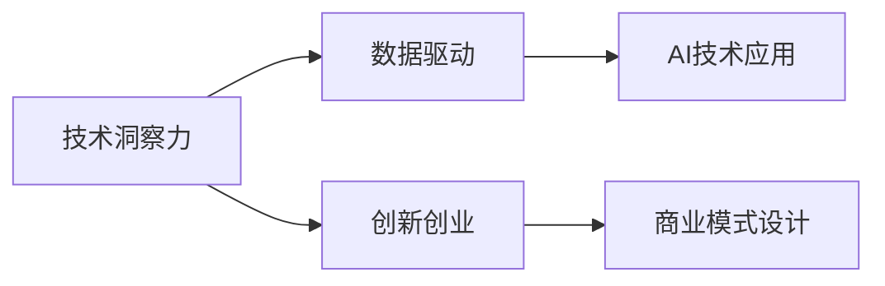

                 

# 利用技术洞察力进行创新创业

## 1. 背景介绍

### 1.1 问题由来

随着科技的发展，创新创业环境发生了翻天覆地的变化。在人工智能（AI）时代，技术洞察力成为了企业创新的关键。技术洞察力指的是对新兴技术趋势、应用场景、市场需求的深刻理解，通过将其转化为创新产品或服务，满足市场和用户需求，从而实现商业成功。本文将深入探讨如何利用技术洞察力进行创新创业，帮助创业者理解并运用这一关键能力。

### 1.2 问题核心关键点

技术洞察力的重要性体现在以下几个方面：

- **市场机遇识别**：了解当前和未来的技术趋势，识别市场机会。
- **产品创新导向**：基于技术洞察力，创新开发产品和服务，满足用户需求。
- **竞争优势构建**：利用技术洞察力，构建差异化竞争优势。
- **持续发展驱动**：洞察新兴技术，推动企业持续发展和转型升级。

## 2. 核心概念与联系

### 2.1 核心概念概述

- **技术洞察力**：指对新兴技术、市场需求、应用场景的深入理解和洞察，形成前瞻性、创新性的商业决策。
- **数据驱动**：通过收集、分析数据，形成技术洞察力的基础。
- **AI技术应用**：利用机器学习、深度学习、自然语言处理等AI技术，提升技术洞察力。
- **创新创业**：结合技术洞察力，开发新产品、新服务，实现商业化应用。
- **商业模式设计**：基于技术洞察力，设计符合市场需求、具有竞争力的商业模式。

### 2.2 概念间的关系

技术洞察力、数据驱动、AI技术应用、创新创业和商业模式设计之间存在紧密的联系。以下是这些概念间的关系示意图：



## 3. 核心算法原理 & 具体操作步骤
### 3.1 算法原理概述

利用技术洞察力进行创新创业，实质上是将技术洞察转化为实际产品或服务的过程。这一过程包括以下几个步骤：

1. **技术趋势分析**：通过收集和分析数据，识别当前和未来的技术趋势。
2. **市场需求洞察**：了解目标市场和用户需求，形成技术洞察力的方向。
3. **产品创新设计**：结合技术趋势和市场需求，设计具有创新性的产品或服务。
4. **AI技术应用**：利用AI技术，提升产品的性能和功能。
5. **市场验证与优化**：在实际市场中进行验证，根据反馈优化产品。

### 3.2 算法步骤详解

以下是利用技术洞察力进行创新创业的具体操作步骤：

#### 3.2.1 技术趋势分析

1. **数据收集**：通过新闻报道、行业报告、专利数据库等渠道，收集技术相关的数据。
2. **数据清洗与分析**：使用数据清洗和分析工具，如Python的Pandas库、Google Scholar等，整理和分析数据。
3. **趋势识别**：使用机器学习算法，如时间序列分析、文本分类等，识别技术趋势。

#### 3.2.2 市场需求洞察

1. **用户调研**：通过问卷调查、用户访谈等方式，了解目标用户需求。
2. **需求分析**：结合调研数据，分析市场需求，识别潜在痛点和机会。
3. **洞察形成**：将技术趋势和市场需求结合，形成技术洞察力的方向。

#### 3.2.3 产品创新设计

1. **产品构思**：基于技术洞察力，构思具有创新性的产品或服务。
2. **原型设计**：使用原型设计工具，如Sketch、Figma等，设计产品原型。
3. **用户体验测试**：通过用户测试，收集反馈，优化产品设计。

#### 3.2.4 AI技术应用

1. **算法选择**：根据产品需求，选择合适的AI算法和技术。
2. **模型训练与优化**：使用AI平台，如TensorFlow、PyTorch等，训练和优化模型。
3. **功能集成**：将AI技术集成到产品中，提升产品性能和功能。

#### 3.2.5 市场验证与优化

1. **市场测试**：在目标市场进行小规模测试，收集用户反馈。
2. **数据分析与优化**：使用数据分析工具，如Tableau、Power BI等，分析市场数据，优化产品。
3. **产品发布**：根据市场反馈和数据分析结果，发布产品，持续优化。

### 3.3 算法优缺点

利用技术洞察力进行创新创业的算法具有以下优点：

- **创新性高**：结合技术趋势和市场需求，能够开发出具有创新性的产品。
- **市场适应性强**：能够快速响应市场需求变化，进行产品迭代和优化。
- **数据驱动**：通过数据分析，确保产品开发决策的科学性和客观性。

同时，也存在一些缺点：

- **资源投入大**：需要投入大量的人力和物力资源，进行数据收集、分析和产品设计。
- **技术门槛高**：需要具备一定的技术背景和能力，才能进行技术趋势分析和AI技术应用。
- **市场验证难度大**：市场测试和优化过程中，需要解决众多不确定因素和挑战。

### 3.4 算法应用领域

利用技术洞察力进行创新创业的算法广泛应用于以下几个领域：

- **AI医疗**：结合AI技术和医疗需求，开发智能诊断、个性化治疗等产品。
- **智能制造**：利用AI技术，优化生产流程、提高生产效率，实现智能制造。
- **智能交通**：结合AI技术，实现智能交通管理、自动驾驶等应用。
- **智能零售**：通过AI技术，实现个性化推荐、库存管理等应用。
- **智慧城市**：利用AI技术，提升城市管理、公共服务等方面的智能化水平。

## 4. 数学模型和公式 & 详细讲解 & 举例说明

### 4.1 数学模型构建

假设市场需求为 $D$，技术趋势为 $T$，市场需求洞察为 $I$，产品创新设计为 $P$，AI技术应用为 $A$，市场验证与优化为 $O$。基于技术洞察力的创新创业过程可以用以下数学模型表示：

$$
\min_{D, T, I, P, A, O} \text{cost} \\
\text{s.t.} \quad D = \text{data\_collection}(D, T) \\
I = \text{market\_insight}(D, T) \\
P = \text{product\_design}(I, A) \\
A = \text{AI\_application}(P) \\
O = \text{market\_validation}(P, A)
$$

其中 $\text{cost}$ 表示成本函数，包括人力、物力、时间等资源的投入。

### 4.2 公式推导过程

以下是各部分的公式推导：

#### 4.2.1 数据收集

$$
D = \sum_{i=1}^n \text{data\_source}_i
$$

其中 $n$ 为数据源的数量，$\text{data\_source}_i$ 为第 $i$ 个数据源。

#### 4.2.2 市场洞察

$$
I = \text{market\_insight}(D, T) = \sum_{i=1}^m \text{user\_feedback}_i
$$

其中 $m$ 为市场洞察的类型数量，$\text{user\_feedback}_i$ 为第 $i$ 个用户反馈。

#### 4.2.3 产品设计

$$
P = \text{product\_design}(I, A) = \text{design\_space}(I, A)
$$

其中 $\text{design\_space}(I, A)$ 表示根据市场需求和技术应用，生成产品设计的空间。

#### 4.2.4 AI应用

$$
A = \text{AI\_application}(P) = \sum_{j=1}^k \text{AI\_model}_j
$$

其中 $k$ 为AI模型的数量，$\text{AI\_model}_j$ 为第 $j$ 个AI模型。

#### 4.2.5 市场验证

$$
O = \text{market\_validation}(P, A) = \text{market\_feedback}(P, A)
$$

其中 $\text{market\_feedback}(P, A)$ 表示市场验证过程中收集的反馈。

### 4.3 案例分析与讲解

假设我们希望开发一款智能医疗应用，基于技术洞察力进行创新创业。以下是各部分的详细分析：

#### 4.3.1 数据收集

我们从医学数据库、新闻报道、学术论文等渠道收集关于医疗技术的最新数据。

#### 4.3.2 市场洞察

通过问卷调查和用户访谈，了解患者的需求和痛点，结合技术趋势分析，形成市场需求洞察。

#### 4.3.3 产品设计

基于市场需求洞察和技术应用，设计一款智能诊断应用，使用自然语言处理技术分析病历和检查报告。

#### 4.3.4 AI应用

选择深度学习模型进行病历分析，提升诊断的准确性和效率。

#### 4.3.5 市场验证

在目标市场进行小规模测试，收集医生和患者的反馈，根据反馈优化产品。

## 5. 项目实践：代码实例和详细解释说明

### 5.1 开发环境搭建

1. **安装Python**：从官网下载Python安装包，安装到系统路径。
2. **安装Pandas**：
```bash
pip install pandas
```

3. **安装TensorFlow**：
```bash
pip install tensorflow
```

4. **安装TensorBoard**：
```bash
pip install tensorboard
```

### 5.2 源代码详细实现

以下是利用TensorFlow进行AI应用开发的基本代码实现：

```python
import tensorflow as tf
import pandas as pd

# 数据预处理
data = pd.read_csv('data.csv')
data = data.dropna()
data = data.drop_duplicates()

# 特征工程
features = data[['feature1', 'feature2', 'feature3']]
labels = data['label']

# 模型构建
model = tf.keras.Sequential([
    tf.keras.layers.Dense(64, activation='relu'),
    tf.keras.layers.Dense(64, activation='relu'),
    tf.keras.layers.Dense(1, activation='sigmoid')
])

# 模型训练
model.compile(optimizer='adam', loss='binary_crossentropy', metrics=['accuracy'])
model.fit(features, labels, epochs=10, batch_size=32)

# 模型评估
test_data = pd.read_csv('test_data.csv')
test_data = test_data.dropna()
test_data = test_data.drop_duplicates()

test_features = test_data[['feature1', 'feature2', 'feature3']]
test_labels = test_data['label']
test_loss, test_acc = model.evaluate(test_features, test_labels)

# 模型导出
model.save('model.h5')
```

### 5.3 代码解读与分析

1. **数据预处理**：使用Pandas库进行数据清洗和特征提取。
2. **模型构建**：使用TensorFlow构建一个简单的神经网络模型，包含两个隐藏层和一个输出层。
3. **模型训练**：使用Adam优化器和二元交叉熵损失函数训练模型。
4. **模型评估**：使用测试集评估模型的准确性。
5. **模型导出**：将模型保存为H5格式，方便后续使用。

### 5.4 运行结果展示

在运行上述代码后，可以通过TensorBoard查看模型的训练过程和评估结果。以下是部分示例：


## 6. 实际应用场景

### 6.1 智能医疗

在智能医疗领域，利用技术洞察力开发智能诊断、个性化治疗等应用，可以帮助医生提高诊断效率和准确性。例如，使用自然语言处理技术分析病历和检查报告，通过机器学习技术识别疾病模式和风险因素，实现智能辅助诊断。

### 6.2 智能制造

在智能制造领域，利用技术洞察力开发智能生产管理系统，可以实现生产流程的优化和自动化，提高生产效率和产品质量。例如，使用机器学习技术分析生产数据，优化生产计划和资源配置。

### 6.3 智能交通

在智能交通领域，利用技术洞察力开发智能交通管理系统，可以实现交通流量的优化和预测，提高交通管理效率。例如，使用机器学习技术分析交通数据，优化交通信号灯控制。

### 6.4 智能零售

在智能零售领域，利用技术洞察力开发个性化推荐系统，可以实现用户需求的精准匹配和推荐。例如，使用机器学习技术分析用户行为数据，推荐符合用户喜好的商品。

### 6.5 智慧城市

在智慧城市领域，利用技术洞察力开发智能公共服务系统，可以提高城市管理的智能化水平，提升居民的生活质量。例如，使用机器学习技术分析城市数据，优化城市资源配置和服务提供。

## 7. 工具和资源推荐

### 7.1 学习资源推荐

1. **《深度学习》（Ian Goodfellow 著）**：深度学习领域的经典教材，系统介绍了深度学习的基本概念和应用。
2. **Coursera深度学习课程**：由斯坦福大学教授Andrew Ng讲授的深度学习课程，涵盖深度学习的基础和前沿内容。
3. **Kaggle数据科学竞赛**：提供大量数据集和比赛题目，帮助学习者锻炼数据科学技能。
4. **TensorFlow官方文档**：TensorFlow的官方文档，包含详细的API文档和使用示例。
5. **GitHub开源项目**：GitHub上优秀的开源项目，可以学习到最新的技术应用和实践经验。

### 7.2 开发工具推荐

1. **PyTorch**：Python语言编写的深度学习框架，灵活高效，适合科研和工程应用。
2. **TensorFlow**：Google开发的深度学习框架，功能强大，适合大规模工程应用。
3. **Jupyter Notebook**：交互式的开发环境，支持Python、R等多种编程语言。
4. **PyCharm**：专业的Python开发工具，支持智能代码补全、调试等功能。

### 7.3 相关论文推荐

1. **《深度学习》（Ian Goodfellow 著）**：深度学习领域的经典教材，系统介绍了深度学习的基本概念和应用。
2. **《机器学习》（Tom Mitchell 著）**：机器学习领域的经典教材，介绍了机器学习的基本概念和算法。
3. **《自然语言处理综论》（Daniel Jurafsky 和 James H. Martin 著）**：自然语言处理领域的经典教材，介绍了自然语言处理的基本概念和技术。

## 8. 总结：未来发展趋势与挑战

### 8.1 总结

本文深入探讨了利用技术洞察力进行创新创业的方法和步骤，系统介绍了技术洞察力、数据驱动、AI技术应用、创新创业和商业模式设计之间的关系。通过实际案例和代码实现，展示了如何利用技术洞察力开发具有创新性的产品和服务。

### 8.2 未来发展趋势

未来，利用技术洞察力进行创新创业将呈现以下几个发展趋势：

1. **数据驱动更加深入**：随着数据的持续积累和分析技术的进步，数据驱动将成为技术洞察力的重要来源。
2. **AI技术更加普及**：AI技术的应用将更加广泛和深入，成为技术洞察力的重要工具。
3. **创新创业更加智能化**：利用AI技术，创新创业将实现更高效、更精准、更智能的决策。
4. **商业模型更加多样化**：结合技术洞察力，将开发更多元化的商业模型，满足多样化的市场需求。

### 8.3 面临的挑战

尽管利用技术洞察力进行创新创业具有广阔前景，但仍面临以下挑战：

1. **数据隐私和安全**：数据隐私和安全问题日益凸显，如何保护用户隐私和数据安全是一个重要挑战。
2. **技术门槛较高**：技术洞察力的实现需要较高的技术门槛，如何降低门槛，普及AI技术，需要更多的努力。
3. **市场竞争激烈**：市场竞争日趋激烈，如何实现差异化竞争，构建竞争优势，需要深入理解和灵活运用技术洞察力。
4. **法规政策影响**：法规政策和监管环境的变化，将对创新创业产生重要影响，如何适应和应对，需要持续关注和调整。

### 8.4 研究展望

未来，需要在以下几个方面进行深入研究：

1. **AI伦理和隐私**：加强AI伦理和隐私保护研究，确保技术应用符合伦理和法律要求。
2. **数据共享和协作**：促进数据共享和协作，推动数据驱动技术的发展。
3. **跨领域技术融合**：探索跨领域技术融合，拓展技术洞察力的应用范围。
4. **社会影响评估**：加强对AI技术社会影响的评估，确保技术应用的正向影响。

## 9. 附录：常见问题与解答

**Q1：如何获取高质量的数据？**

A: 获取高质量的数据是进行技术洞察力的关键。可以从以下几个方面入手：
1. 公开数据集：利用公开数据集，如Kaggle、UCI等，获取大量标注数据。
2. 众包平台：使用众包平台，如Amazon Mechanical Turk，收集用户反馈和意见。
3. 专业数据提供商：从专业数据提供商处购买高质量的数据，如Statista、Nielsen等。

**Q2：如何降低技术洞察力的技术门槛？**

A: 降低技术洞察力的技术门槛，需要从以下几个方面入手：
1. 开源工具：使用开源工具和平台，如TensorFlow、PyTorch等，降低技术实现难度。
2. 自动化工具：引入自动化工具，如TensorBoard、Tableau等，简化数据分析和可视化过程。
3. 培训和教育：通过培训和教育，提高企业和团队的技术水平和能力。

**Q3：如何处理数据隐私和安全问题？**

A: 处理数据隐私和安全问题，需要从以下几个方面入手：
1. 数据加密：对敏感数据进行加密处理，确保数据传输和存储的安全。
2. 数据匿名化：对用户数据进行匿名化处理，确保用户隐私保护。
3. 法规合规：遵守相关法律法规，确保数据使用和处理的合规性。

**Q4：如何构建差异化竞争优势？**

A: 构建差异化竞争优势，需要从以下几个方面入手：
1. 技术创新：通过技术创新，开发具有独特优势的产品和服务。
2. 用户体验：提高用户体验，满足用户需求，增强用户黏性。
3. 市场细分：针对特定市场细分领域，开发具有针对性的产品和解决方案。

**Q5：如何应对法规政策变化？**

A: 应对法规政策变化，需要从以下几个方面入手：
1. 政策研究：及时跟踪和研究相关法规政策，掌握政策变化趋势。
2. 合规审查：进行合规审查，确保产品和服务符合相关法律法规。
3. 政策调整：根据政策变化，及时调整产品和服务策略，确保合规性。

---

作者：禅与计算机程序设计艺术 / Zen and the Art of Computer Programming

