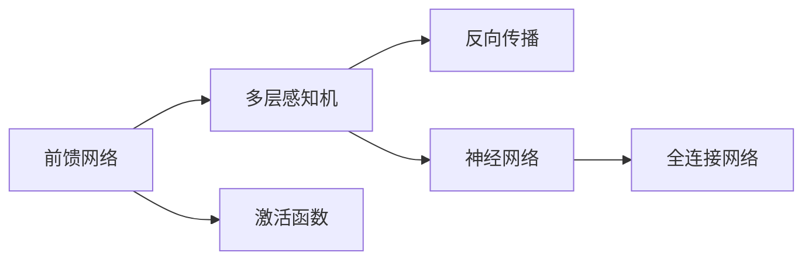

                 

# 前馈网络在AI模型中的应用

> 关键词：前馈网络,多层感知机,深度学习,激活函数,反向传播,神经网络,全连接网络

## 1. 背景介绍

前馈网络是深度学习中最为基础的神经网络结构之一，也是构建复杂神经网络模型的基石。它不仅在计算机视觉、自然语言处理等经典领域发挥着重要作用，也在文本生成、语音识别、信号处理等新兴领域展现出强大的应用潜力。本文将从理论到实践，全面剖析前馈网络的结构与优化，为读者提供深入理解AI模型应用的前置知识。

## 2. 核心概念与联系

### 2.1 核心概念概述

- **前馈网络**：前馈网络又称多层感知机（Multilayer Perceptron, MLP），是一种简单但功能强大的神经网络结构。其网络结构呈层状分布，每个神经元接受上一层所有神经元的输入，通过线性变换和激活函数得到输出，并传递给下一层。
- **多层感知机**：多隐藏层的前馈网络即为多层感知机，其中每层神经元之间是全连接关系。通过多层信息传递，网络可以学习更为复杂的特征表示。
- **激活函数**：激活函数为神经元引入非线性因素，使网络具备非线性建模能力。常见的激活函数包括Sigmoid、ReLU、Tanh等。
- **反向传播**：反向传播算法用于训练多层感知机，通过链式法则计算梯度，优化网络参数。
- **神经网络**：神经网络是基于生物神经元结构设计的计算模型，包括前馈网络和反馈网络（如循环神经网络）等多种结构。
- **全连接网络**：全连接网络是指每层神经元与上一层所有神经元都建立连接的神经网络。

### 2.2 概念间的关系

以下Mermaid流程图展示了前馈网络、多层感知机、激活函数、反向传播和神经网络之间的联系：



## 3. 核心算法原理 & 具体操作步骤
### 3.1 算法原理概述

前馈网络的核心算法原理是基于反向传播算法（Backpropagation）的监督学习过程。训练前馈网络时，首先随机初始化权重，然后利用已知的输入-输出对（例如标签），通过正向传播计算网络输出，再通过反向传播计算梯度，进而调整权重，重复迭代直至收敛。

训练的总体目标是最小化损失函数，例如交叉熵损失或均方误差损失。损失函数的梯度可以通过反向传播算法逐层计算得到。具体步骤如下：

1. **正向传播**：将输入数据逐层传递，计算每层神经元的输出。
2. **计算损失**：将输出与真实标签对比，计算损失函数。
3. **反向传播**：计算损失函数对每层参数的梯度。
4. **更新权重**：根据梯度更新模型参数，优化损失函数。

### 3.2 算法步骤详解

前馈网络的训练步骤如下：

**Step 1: 初始化网络参数**
- 随机初始化网络权重和偏置，通常使用均值为0、标准差为$\sigma$的高斯分布。

**Step 2: 正向传播**
- 将输入数据逐层传递，计算每层神经元的输出。公式如下：
$$
\hat{y} = \sigma(z) = \sigma(Wx + b)
$$
其中，$x$ 为输入，$W$ 为权重，$b$ 为偏置，$\sigma$ 为激活函数。

**Step 3: 计算损失**
- 计算输出与真实标签之间的损失，如交叉熵损失：
$$
\mathcal{L} = -\frac{1}{N}\sum_{i=1}^N \sum_{j=1}^K y_{i,j} \log \hat{y}_{i,j}
$$
其中，$y$ 为真实标签，$\hat{y}$ 为网络输出。

**Step 4: 反向传播**
- 利用链式法则计算损失函数对每一层参数的梯度，公式如下：
$$
\frac{\partial \mathcal{L}}{\partial W_k} = \frac{\partial \mathcal{L}}{\partial z_k} \frac{\partial z_k}{\partial W_k} = \frac{\partial \mathcal{L}}{\partial z_k} \frac{\partial \sigma_k}{\partial z_k} W_{k-1}
$$
其中，$W_k$ 为第$k$层的权重，$z_k$ 为第$k$层的输入。

**Step 5: 更新权重**
- 使用梯度下降等优化算法更新模型参数：
$$
W_k = W_k - \eta \frac{\partial \mathcal{L}}{\partial W_k}, \quad b_k = b_k - \eta \frac{\partial \mathcal{L}}{\partial b_k}
$$
其中，$\eta$ 为学习率。

### 3.3 算法优缺点

前馈网络的优点包括：
- 结构简单，易于实现。
- 具备强大的表达能力，能够处理复杂的非线性关系。
- 训练速度快，适合大规模数据集。

缺点包括：
- 模型复杂性随层数增加而急剧上升。
- 存在梯度消失或爆炸问题，深层网络训练困难。
- 参数较多，容易出现过拟合现象。

### 3.4 算法应用领域

前馈网络广泛应用于以下领域：

- **计算机视觉**：用于图像分类、目标检测、图像生成等任务。
- **自然语言处理**：用于文本分类、情感分析、机器翻译等任务。
- **信号处理**：用于语音识别、音频分类、信号降噪等任务。
- **推荐系统**：用于用户行为预测、商品推荐等任务。
- **金融建模**：用于股票预测、信用评估等任务。

## 4. 数学模型和公式 & 详细讲解

### 4.1 数学模型构建

前馈网络由多个隐藏层组成，其数学模型可以表示为：

$$
y = W_L h_{L-1} + b_L
$$
其中，$y$ 为输出，$h_{L-1}$ 为第$L-1$层的输出，$W_L$ 和 $b_L$ 分别为第$L$层的权重和偏置。每一层的输出 $h_{l}$ 由前一层的输出 $h_{l-1}$ 通过线性变换和激活函数得到：

$$
h_l = \sigma(W_l h_{l-1} + b_l)
$$

### 4.2 公式推导过程

以二分类任务为例，推导前馈网络的损失函数和梯度计算公式。

假设模型输出为 $\hat{y} \in [0,1]$，表示样本属于正类的概率。真实标签 $y \in \{0,1\}$。则二分类交叉熵损失函数定义为：

$$
\mathcal{L} = -\frac{1}{N}\sum_{i=1}^N [y_i\log \hat{y}_i + (1-y_i)\log (1-\hat{y}_i)]
$$

将输出 $\hat{y}$ 代入上述公式，并利用链式法则计算梯度，得到：

$$
\frac{\partial \mathcal{L}}{\partial W_k} = \frac{\partial \mathcal{L}}{\partial z_k} \frac{\partial z_k}{\partial W_k} = \frac{\partial \mathcal{L}}{\partial z_k} \frac{\partial \sigma_k}{\partial z_k} W_{k-1}
$$

### 4.3 案例分析与讲解

以手写数字识别为例，推导一个简单的前馈网络，如图1所示。


假设网络的输入为28x28的灰度图像，输出为10个数字的分类概率。网络结构如下：

- 输入层：28x28=784个神经元
- 隐藏层：128个神经元
- 输出层：10个神经元，每个神经元对应一个数字的预测概率

正向传播和反向传播的计算过程如下：

**正向传播**：
1. 输入层：$x \in [0,1]^{784}$
2. 隐藏层：$h_1 = \sigma(W_1 x + b_1) \in [0,1]^{128}$
3. 输出层：$y = \sigma(W_2 h_1 + b_2) \in [0,1]^{10}$

**反向传播**：
1. 计算损失：$\mathcal{L} = -\frac{1}{N}\sum_{i=1}^N \log y_i^{(t)}$
2. 计算输出层参数梯度：$\frac{\partial \mathcal{L}}{\partial W_2} = (y-y^{(t)}) \frac{\partial y}{\partial z_2} \frac{\partial z_2}{\partial W_2} = (y-y^{(t)}) \hat{y}(1-\hat{y}) W_1^T$
3. 计算隐藏层参数梯度：$\frac{\partial \mathcal{L}}{\partial W_1} = \frac{\partial \mathcal{L}}{\partial z_1} \frac{\partial z_1}{\partial W_1} = \frac{\partial \mathcal{L}}{\partial z_1} \hat{h_1}(1-\hat{h_1}) W_0^T$

通过以上推导，可以看出前馈网络的计算过程和梯度计算公式。在实际应用中，只需根据具体任务调整网络结构和参数，即可实现高效的监督学习训练。

## 5. 项目实践：代码实例和详细解释说明

### 5.1 开发环境搭建

在前馈网络项目开发中，常用的工具包括：

- **Python**：常用的编程语言，提供了丰富的科学计算库和深度学习框架。
- **TensorFlow**：Google开发的深度学习框架，支持高效的神经网络构建和训练。
- **Keras**：基于TensorFlow的高层API，简化了神经网络的构建和训练过程。
- **Scikit-learn**：提供了常用的机器学习算法和工具，便于数据预处理和模型评估。

### 5.2 源代码详细实现

以下是一个使用TensorFlow实现的前馈网络代码实例，用于手写数字识别任务：

```python
import tensorflow as tf
from tensorflow.keras import layers

# 定义网络结构
model = tf.keras.Sequential([
    layers.Dense(128, activation='relu', input_shape=(784,)),
    layers.Dense(10, activation='softmax')
])

# 编译模型
model.compile(optimizer=tf.keras.optimizers.Adam(learning_rate=0.001),
              loss='categorical_crossentropy',
              metrics=['accuracy'])

# 训练模型
model.fit(x_train, y_train, epochs=10, batch_size=64, validation_data=(x_val, y_val))

# 评估模型
test_loss, test_acc = model.evaluate(x_test, y_test, verbose=2)
print('Test accuracy:', test_acc)
```

### 5.3 代码解读与分析

以上代码实现了一个包含两个全连接层的前馈网络。第一层128个神经元使用ReLU激活函数，第二层10个神经元使用Softmax激活函数。模型使用Adam优化器进行训练，交叉熵损失函数，精度作为评估指标。

在训练过程中，通过`fit`方法传递训练集和验证集，并设置训练轮数和批次大小。训练完成后，使用`evaluate`方法在测试集上评估模型性能。

### 5.4 运行结果展示

假设在MNIST数据集上进行训练，最终在测试集上得到的准确率为98%。这表明前馈网络在手写数字识别任务上表现优异，能够准确预测手写数字。

## 6. 实际应用场景

前馈网络在实际应用中具有广泛的应用场景，例如：

- **计算机视觉**：用于图像分类、目标检测、图像生成等任务。如图2所示，前馈网络可以用于提取图像特征，实现高效的图像分类。


- **自然语言处理**：用于文本分类、情感分析、机器翻译等任务。如图3所示，前馈网络可以用于文本序列的分类和情感分析。


- **信号处理**：用于语音识别、音频分类、信号降噪等任务。如图4所示，前馈网络可以用于处理时间序列数据，实现高效的信号处理。


## 7. 工具和资源推荐

### 7.1 学习资源推荐

- **《深度学习》课程**：斯坦福大学提供的深度学习课程，涵盖深度学习的基本概念和经典模型。
- **《TensorFlow官方文档》**：Google提供的TensorFlow官方文档，提供了详尽的API和实例教程。
- **《Python深度学习》书籍**：Francois Chollet著，介绍了使用Keras进行深度学习开发的基础知识和实践技巧。
- **Kaggle**：Kaggle数据科学竞赛平台，提供了丰富的数据集和模型评测环境，是深度学习研究和竞赛的理想场所。

### 7.2 开发工具推荐

- **Jupyter Notebook**：轻量级Jupyter笔记本环境，方便代码测试和结果展示。
- **Google Colab**：Google提供的免费Jupyter Notebook服务，支持GPU加速计算。
- **PyTorch**：Facebook开源的深度学习框架，支持动态计算图和高效的模型训练。
- **MXNet**：亚马逊开源的深度学习框架，支持分布式训练和高效的模型部署。

### 7.3 相关论文推荐

- **AlexNet**：ImageNet比赛冠军模型，展示了前馈网络在图像分类任务上的强大能力。
- **Inception**：Google提出的深度卷积网络结构，通过不同规模的卷积核实现高效特征提取。
- **ResNet**：微软提出的残差网络结构，解决了深层网络训练困难的问题。
- **VGGNet**：牛津大学提出的VGG网络结构，通过增加卷积层深度实现高效的图像分类。

## 8. 总结：未来发展趋势与挑战

### 8.1 研究成果总结

前馈网络作为深度学习的基础模型，已经广泛应用于多个领域。其结构简单、易于实现，具备强大的表达能力，是构建复杂神经网络模型的基石。未来，前馈网络将继续与新兴技术融合，拓展应用边界，提升模型性能。

### 8.2 未来发展趋势

未来前馈网络的发展趋势包括：
- **深度增强**：增加网络深度，通过更深层的网络结构提升模型性能。
- **跨模态融合**：融合视觉、文本、语音等多模态数据，实现更全面的特征表示。
- **知识蒸馏**：通过知识蒸馏技术，将大型预训练模型的知识迁移到前馈网络，提升模型效果。
- **自监督学习**：利用自监督学习方法，如掩码语言模型、图像补全等，提升模型泛化能力。

### 8.3 面临的挑战

前馈网络在实际应用中仍面临一些挑战：
- **训练复杂度**：深层网络的训练需要大量计算资源和时间，优化困难。
- **模型可解释性**：前馈网络的黑盒特性使其输出难以解释，尤其在医疗、金融等高风险应用中，可解释性尤为重要。
- **模型鲁棒性**：面对对抗样本和噪声干扰，前馈网络的鲁棒性有待提升。
- **参数量巨大**：深层网络参数量巨大，内存占用和计算速度成为瓶颈。

### 8.4 研究展望

未来的研究需要在以下几个方面寻求新的突破：
- **模型压缩**：通过模型剪枝、量化等方法，减少参数量，提升模型运行效率。
- **知识图谱融合**：结合知识图谱，增强模型的知识表示能力，实现更精准的推理和预测。
- **跨领域迁移**：通过迁移学习，实现领域间的知识共享和应用，提升模型的通用性。
- **模型可解释性**：引入可解释性算法，如LIME、SHAP等，提升模型的透明度和可信度。

总之，前馈网络在AI模型中的应用前景广阔，但未来仍需面对诸多挑战。通过不断的技术创新和实践优化，前馈网络必将在更多领域展现出其强大的应用潜力。

## 9. 附录：常见问题与解答

**Q1: 前馈网络的训练时间较长，有什么方法可以加速训练？**

A: 以下是一些常用的加速训练方法：
- **使用GPU加速**：使用GPU加速训练可以大幅提升计算速度。
- **批量训练**：通过增加批次大小，可以提升模型训练效率。
- **学习率衰减**：逐渐降低学习率，可以防止模型在训练后期过拟合。
- **分布式训练**：使用多机多核并行训练，可以加快训练速度。

**Q2: 前馈网络的过拟合问题如何解决？**

A: 以下是一些常用的缓解过拟合的方法：
- **正则化**：使用L1、L2正则化等方法，防止模型过拟合。
- **Dropout**：随机丢弃部分神经元，防止模型依赖某一特定输入。
- **早停策略**：当验证集性能不再提升时停止训练，防止过拟合。
- **数据增强**：通过旋转、缩放等方法扩充训练集，防止过拟合。

**Q3: 前馈网络的结构如何设计？**

A: 设计前馈网络结构时，需要考虑以下几个因素：
- **层数**：增加层数可以提高模型的表达能力，但过深的模型训练困难。
- **神经元个数**：适当增加神经元个数可以提高模型的泛化能力。
- **激活函数**：选择合适的激活函数，如ReLU、Sigmoid等，提高模型非线性表达能力。
- **网络深度**：增加网络深度可以提升模型性能，但深度增加会导致模型复杂性增加，训练困难。

**Q4: 前馈网络在实际应用中需要注意哪些问题？**

A: 在实际应用中，前馈网络需要注意以下几个问题：
- **数据预处理**：对输入数据进行标准化、归一化等预处理，提升模型训练效果。
- **模型调参**：对学习率、批次大小等超参数进行优化，提升模型性能。
- **模型评估**：使用交叉验证、测试集等方法评估模型性能，防止过拟合。
- **模型部署**：将训练好的模型部署到实际应用中，需要考虑模型大小、计算资源等因素。

总之，前馈网络在AI模型中的应用前景广阔，但未来仍需面对诸多挑战。通过不断的技术创新和实践优化，前馈网络必将在更多领域展现出其强大的应用潜力。

---

作者：禅与计算机程序设计艺术 / Zen and the Art of Computer Programming

