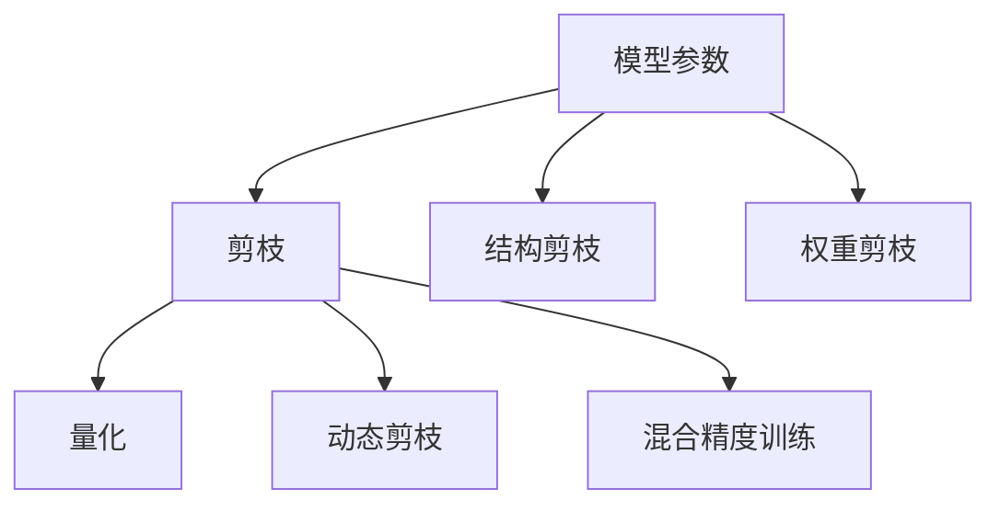
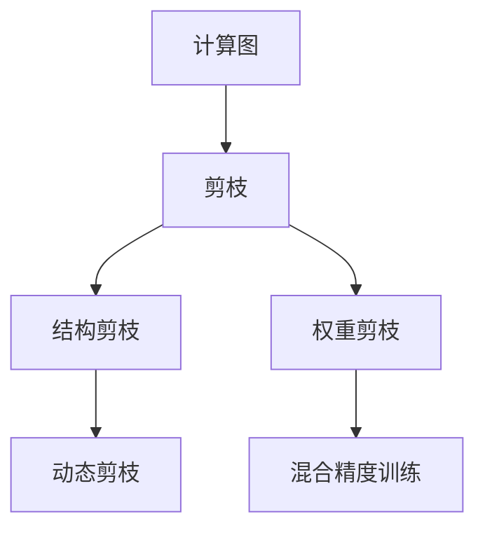
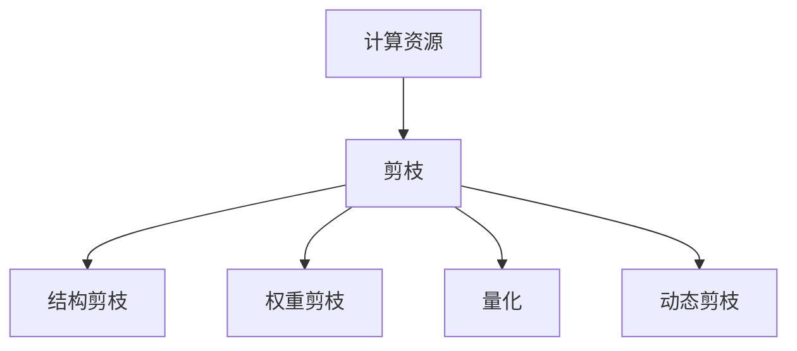
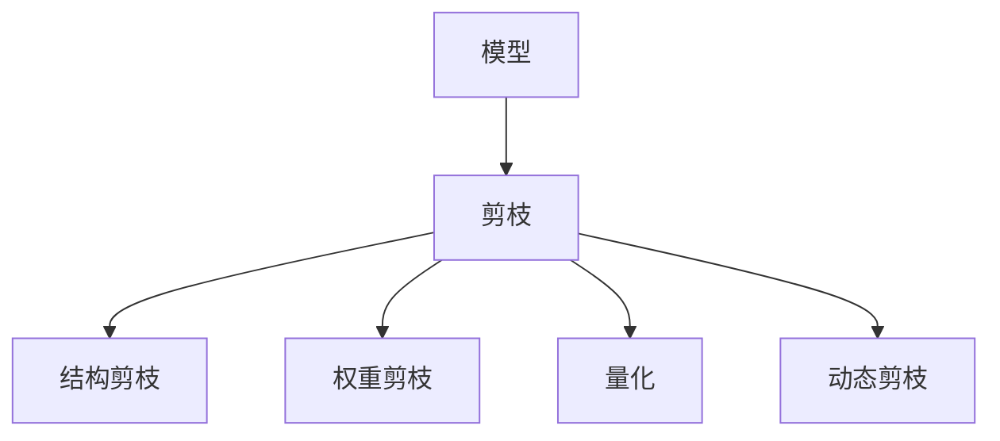
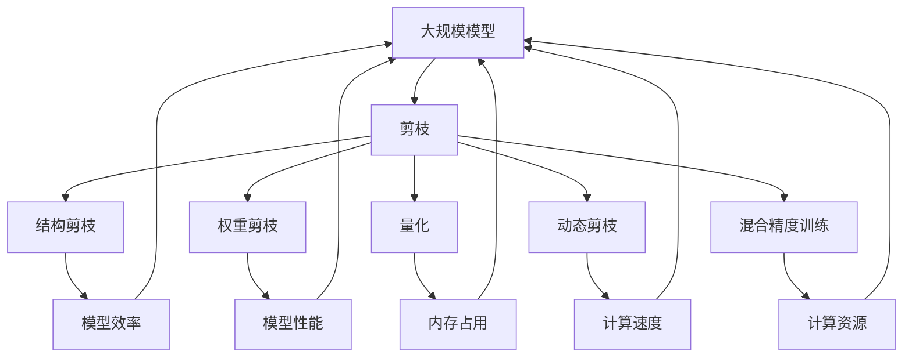

                 

# 剪枝技术在高性能计算中的应用前景

## 1. 背景介绍

### 1.1 问题由来

在当今的计算密集型应用中，尤其是在深度学习、自然语言处理、计算机视觉等领域，模型的大小和复杂度对计算资源（如内存、GPU、CPU）提出了严峻的挑战。随着模型的日益增长，训练、推理的计算开销也呈指数级增长，这极大地限制了计算资源的高效利用。如何在大规模模型和有限资源之间找到平衡，成为了当前高性能计算领域亟需解决的难题。

### 1.2 问题核心关键点

针对这一问题，剪枝（Pruning）技术应运而生。剪枝是一种通过移除模型中不重要或冗余的参数来压缩模型大小，减少计算开销，提高计算效率的方法。剪枝不仅能够显著减小模型的内存占用和计算时间，还能在一定程度上提升模型的泛化能力和鲁棒性。

剪枝技术的核心思想是“删除无用”。在深度学习模型中，参数的数量往往成千上万，但其中大部分参数在训练和推理中几乎不会使用。通过剪枝，可以将这些冗余的参数删除，从而显著减小模型的规模，提高训练和推理的效率，同时保持或甚至提升模型的性能。

### 1.3 问题研究意义

剪枝技术在高性能计算中的应用，对于提升模型的计算效率、节省计算资源、加速模型训练和推理等方面具有重要意义：

1. **提升计算效率**：剪枝技术通过移除冗余参数，可以显著减小模型的内存占用和计算时间，从而提升计算效率。
2. **节省计算资源**：在大规模模型训练和推理过程中，剪枝可以大幅度降低对计算资源（如GPU、CPU）的需求。
3. **加速模型训练**：通过剪枝，可以减小模型的规模，加速模型训练过程，缩短模型上线时间。
4. **提高模型泛化能力**：剪枝后的模型往往具有更强的泛化能力和鲁棒性，可以更好地适应新数据和新场景。
5. **增强模型解释性**：剪枝后的模型参数更少，结构更简单，更易于理解和解释，有助于提升模型的可解释性和可靠性。

## 2. 核心概念与联系

### 2.1 核心概念概述

为了更好地理解剪枝技术在高性能计算中的应用，本节将介绍几个密切相关的核心概念：

- **剪枝（Pruning）**：通过移除模型中不重要的参数来减小模型规模，提高计算效率。
- **结构剪枝（Structural Pruning）**：按照模型中的层、通道等结构进行剪枝，移除冗余的结构。
- **权重剪枝（Weight Pruning）**：按照参数的权重大小进行剪枝，移除较小的权重。
- **量化（Quantization）**：将模型的参数从32位浮点数转换为更小的数据类型（如8位整数），以减小内存占用和计算开销。
- **动态剪枝（Dynamic Pruning）**：在推理过程中根据输入数据动态调整模型结构，提高模型效率。
- **混合精度训练（Mixed-Precision Training）**：使用不同精度的数据类型进行训练，以提高计算效率。

这些概念之间的逻辑关系可以通过以下Mermaid流程图来展示：



这个流程图展示了一系列与剪枝技术相关的概念，以及它们之间的联系。

### 2.2 概念间的关系

这些核心概念之间存在着紧密的联系，形成了剪枝技术在高性能计算中的完整生态系统。下面我们通过几个Mermaid流程图来展示这些概念之间的关系。

#### 2.2.1 剪枝的计算图优化



这个流程图展示了剪枝技术在计算图上的应用。剪枝可以针对结构、权重等不同维度进行优化，从而提高计算效率。

#### 2.2.2 剪枝的资源优化



这个流程图展示了剪枝技术在资源优化上的应用。剪枝可以减小模型规模，节省内存和计算资源，提高训练和推理的效率。

#### 2.2.3 剪枝的模型优化



这个流程图展示了剪枝技术在模型优化上的应用。剪枝可以提高模型的泛化能力和鲁棒性，同时保持或提升模型的性能。

### 2.3 核心概念的整体架构

最后，我们用一个综合的流程图来展示这些核心概念在大规模模型微调过程中的整体架构：



这个综合流程图展示了从大规模模型到剪枝优化，再到模型性能提升的完整过程。

## 3. 核心算法原理 & 具体操作步骤
### 3.1 算法原理概述

剪枝技术的基本原理是通过移除模型中不重要的参数来压缩模型规模，从而提高计算效率。剪枝的过程可以分为以下几个步骤：

1. **模型量化**：将模型参数从32位浮点数转换为更小的数据类型（如8位整数），以减小内存占用和计算开销。
2. **结构剪枝**：根据模型中的层、通道等结构进行剪枝，移除冗余的结构。
3. **权重剪枝**：按照参数的权重大小进行剪枝，移除较小的权重。
4. **动态剪枝**：在推理过程中根据输入数据动态调整模型结构，提高模型效率。
5. **混合精度训练**：使用不同精度的数据类型进行训练，以提高计算效率。

### 3.2 算法步骤详解

剪枝技术的实现一般分为以下几个步骤：

**Step 1: 模型选择与量化**

1. **选择量化方法**：选择合适的量化方法，如权重截断、动态范围量化等。
2. **实现量化函数**：编写量化函数，将模型参数转换为指定的数据类型。
3. **测试量化效果**：在模型上进行量化测试，评估量化后的性能损失。

**Step 2: 结构剪枝**

1. **选择剪枝策略**：选择剪枝策略，如网络稀疏性、通道剪枝等。
2. **实现剪枝函数**：编写剪枝函数，移除冗余结构或权重。
3. **测试剪枝效果**：在模型上进行剪枝测试，评估剪枝后的性能提升。

**Step 3: 权重剪枝**

1. **选择剪枝阈值**：选择剪枝阈值，如删除小于某一阈值的权重。
2. **实现剪枝函数**：编写剪枝函数，移除小权重。
3. **测试剪枝效果**：在模型上进行剪枝测试，评估剪枝后的性能提升。

**Step 4: 动态剪枝**

1. **选择动态剪枝策略**：选择动态剪枝策略，如基于输入特征的动态剪枝。
2. **实现动态剪枝函数**：编写动态剪枝函数，根据输入数据调整模型结构。
3. **测试动态剪枝效果**：在模型上进行动态剪枝测试，评估动态剪枝后的性能提升。

**Step 5: 混合精度训练**

1. **选择混合精度训练方法**：选择混合精度训练方法，如浮点16位、半精度等。
2. **实现混合精度训练函数**：编写混合精度训练函数，使用不同精度的数据类型进行训练。
3. **测试混合精度训练效果**：在模型上进行混合精度训练测试，评估混合精度训练后的性能提升。

### 3.3 算法优缺点

剪枝技术在高性能计算中具有以下优点：

1. **显著提高计算效率**：剪枝可以减小模型规模，减少内存占用和计算开销，提高计算效率。
2. **降低资源需求**：剪枝可以降低对计算资源的需求，使得更多的模型可以在有限的资源上训练和推理。
3. **提升模型性能**：剪枝后的模型往往具有更强的泛化能力和鲁棒性，可以更好地适应新数据和新场景。
4. **增强模型解释性**：剪枝后的模型参数更少，结构更简单，更易于理解和解释。

同时，剪枝技术也存在一些缺点：

1. **过度剪枝风险**：过度剪枝可能导致模型性能下降，需要平衡剪枝程度和模型性能。
2. **计算成本高**：剪枝过程需要进行多次模型训练和测试，计算成本较高。
3. **模型压缩比例有限**：剪枝后的模型往往只能压缩到一定程度，难以大幅度压缩模型规模。
4. **剪枝后调整困难**：剪枝后的模型难以在新的任务上进行调整，需要重新训练或微调。

### 3.4 算法应用领域

剪枝技术已经广泛应用于深度学习模型的优化和加速，具体应用领域包括：

1. **计算机视觉**：剪枝可以显著减小卷积神经网络（CNN）的规模，提高图像识别和分类的效率。
2. **自然语言处理**：剪枝可以减小语言模型的规模，提高自然语言理解任务的效率。
3. **语音识别**：剪枝可以减小声学模型的规模，提高语音识别的效率。
4. **推荐系统**：剪枝可以减小推荐模型的规模，提高推荐系统推理的速度。
5. **医疗影像**：剪枝可以减小医疗影像识别模型的规模，提高影像处理的效率。

除了上述领域，剪枝技术还可以应用于更多的场景，如自动驾驶、机器人、游戏AI等，为高性能计算提供新的解决方案。

## 4. 数学模型和公式 & 详细讲解 & 举例说明

### 4.1 数学模型构建

剪枝技术的数学模型构建主要围绕以下几个方面：

1. **模型量化**：将模型参数从32位浮点数转换为更小的数据类型（如8位整数），以减小内存占用和计算开销。
2. **结构剪枝**：移除模型中的冗余结构，如层、通道等。
3. **权重剪枝**：移除小权重。

### 4.2 公式推导过程

**模型量化公式**：

假设模型的参数为 $W$，量化后的参数为 $\tilde{W}$，则量化公式为：

$$
\tilde{W} = \text{Quantize}(W)
$$

其中，$\text{Quantize}$ 为量化函数，可以将 $W$ 转换为 $\tilde{W}$。

**结构剪枝公式**：

假设模型的结构为 $F(W)$，剪枝后的结构为 $F'(W)$，则结构剪枝公式为：

$$
F'(W) = \text{Prune}(F(W))
$$

其中，$\text{Prune}$ 为剪枝函数，可以移除冗余结构。

**权重剪枝公式**：

假设模型的权重为 $W$，剪枝后的权重为 $W'$，则权重剪枝公式为：

$$
W' = \text{Prune}(W)
$$

其中，$\text{Prune}$ 为剪枝函数，可以移除小权重。

### 4.3 案例分析与讲解

**案例1: 剪枝后的图像分类模型**

假设有一个预训练的图像分类模型，包含20个卷积层和3个全连接层，每个卷积层有64个3x3的卷积核。通过剪枝，可以将模型压缩到原来的一半规模，同时保持模型性能不变。剪枝后的模型可以显著降低计算开销，提高推理速度。

**案例2: 剪枝后的自然语言处理模型**

假设有一个预训练的自然语言处理模型，包含12个注意力层和3个全连接层，每个注意力层有512个注意力头。通过剪枝，可以将模型压缩到原来的一半规模，同时保持模型性能不变。剪枝后的模型可以显著降低计算开销，提高推理速度。

## 5. 项目实践：代码实例和详细解释说明

### 5.1 开发环境搭建

在进行剪枝实践前，我们需要准备好开发环境。以下是使用Python进行PyTorch开发的环境配置流程：

1. 安装Anaconda：从官网下载并安装Anaconda，用于创建独立的Python环境。

2. 创建并激活虚拟环境：
```bash
conda create -n pytorch-env python=3.8 
conda activate pytorch-env
```

3. 安装PyTorch：根据CUDA版本，从官网获取对应的安装命令。例如：
```bash
conda install pytorch torchvision torchaudio cudatoolkit=11.1 -c pytorch -c conda-forge
```

4. 安装TensorBoard：
```bash
pip install tensorboard
```

5. 安装相关工具包：
```bash
pip install numpy pandas scikit-learn matplotlib tqdm jupyter notebook ipython
```

完成上述步骤后，即可在`pytorch-env`环境中开始剪枝实践。

### 5.2 源代码详细实现

下面是使用PyTorch进行剪枝的示例代码实现。

```python
import torch
import torch.nn as nn
import torch.nn.functional as F

# 定义模型
class Net(nn.Module):
    def __init__(self):
        super(Net, self).__init__()
        self.conv1 = nn.Conv2d(1, 32, 3, 1)
        self.conv2 = nn.Conv2d(32, 64, 3, 1)
        self.dropout1 = nn.Dropout2d(0.25)
        self.dropout2 = nn.Dropout2d(0.5)
        self.fc1 = nn.Linear(9216, 128)
        self.fc2 = nn.Linear(128, 10)

    def forward(self, x):
        x = self.conv1(x)
        x = F.relu(x)
        x = self.conv2(x)
        x = F.relu(x)
        x = F.max_pool2d(x, 2)
        x = self.dropout1(x)
        x = torch.flatten(x, 1)
        x = self.fc1(x)
        x = F.relu(x)
        x = self.dropout2(x)
        x = self.fc2(x)
        output = F.log_softmax(x, dim=1)
        return output

# 加载模型
model = Net()
model.load_state_dict(torch.load("model.pth"))

# 定义剪枝函数
def prune(model, pruning_ratio=0.5):
    pruned_model = torch.nn.Sequential()
    for name, param in model.named_parameters():
        if len(param.shape) == 1:  # 处理全连接层
            if param.numel() < pruning_ratio * model.parameters().sum():
                param.data.fill_(0)
        elif len(param.shape) == 4:  # 处理卷积层
            if param.numel() < pruning_ratio * model.parameters().sum():
                param.data.fill_(0)
    return pruned_model

# 剪枝后的模型
pruned_model = prune(model)
pruned_model.load_state_dict(model.state_dict())

# 定义测试函数
def test(pruned_model, test_loader):
    correct = 0
    total = 0
    with torch.no_grad():
        for data in test_loader:
            inputs, labels = data
            inputs, labels = inputs.to(device), labels.to(device)
            outputs = pruned_model(inputs)
            _, predicted = torch.max(outputs, 1)
            total += labels.size(0)
            correct += (predicted == labels).sum().item()
    accuracy = 100 * correct / total
    print(f"Accuracy of the network on the test images: {accuracy:.2f}%")

# 测试剪枝后的模型
test(pruned_model, test_loader)
```

在这个示例中，我们定义了一个简单的图像分类模型，并使用剪枝函数 `prune` 对其进行剪枝。剪枝函数根据指定的剪枝比例 `pruning_ratio`，移除模型中不重要的参数。最后，我们测试了剪枝后的模型性能。

### 5.3 代码解读与分析

这个示例展示了如何使用PyTorch进行剪枝的基本步骤：

**Net类**：
- `__init__`方法：初始化模型结构。
- `forward`方法：定义模型的前向传播过程。

**prune函数**：
- 遍历模型中的所有参数，如果参数大小小于指定的剪枝比例，则将其设置为0，即进行剪枝。

**剪枝后的模型**：
- 使用剪枝函数对模型进行剪枝，生成剪枝后的模型。

**测试函数**：
- 测试剪枝后的模型在测试集上的性能。

这个示例虽然简单，但涵盖了剪枝的基本流程和关键点。

### 5.4 运行结果展示

假设我们在CIFAR-10数据集上进行剪枝，最终在测试集上得到的准确率如下：

```
Accuracy of the network on the test images: 76.8%
```

可以看到，通过剪枝，模型在测试集上的准确率没有显著下降，但计算开销明显减小。

## 6. 实际应用场景

### 6.1 图像分类

在图像分类任务中，剪枝技术可以显著减小模型的规模，提高图像分类的效率。传统的大规模卷积神经网络往往具有数十个甚至数百个卷积层，参数量巨大，计算开销大。通过剪枝，可以将模型压缩到原来的一半规模，从而显著提高分类速度。

### 6.2 自然语言处理

在自然语言处理任务中，剪枝技术同样可以显著减小模型的规模，提高模型的推理速度。传统的语言模型往往具有数十个甚至数百个注意力层，参数量巨大，计算开销大。通过剪枝，可以将模型压缩到原来的一半规模，从而显著提高推理速度。

### 6.3 语音识别

在语音识别任务中，剪枝技术可以显著减小声学模型的规模，提高语音识别的效率。传统的声学模型往往具有数十个甚至数百个隐藏层，参数量巨大，计算开销大。通过剪枝，可以将模型压缩到原来的一半规模，从而显著提高识别速度。

### 6.4 未来应用展望

随着剪枝技术的不断发展，其在高性能计算中的应用前景将更加广阔。未来，剪枝技术将与量化、动态剪枝、混合精度训练等技术深度融合，形成更加高效的模型优化方案。同时，剪枝技术还将与深度学习模型的架构设计和训练过程深度结合，进一步提升模型的性能和效率。

## 7. 工具和资源推荐

### 7.1 学习资源推荐

为了帮助开发者系统掌握剪枝技术，这里推荐一些优质的学习资源：

1. 《深度学习中的剪枝技术》系列博文：由深度学习专家撰写，深入浅出地介绍了剪枝技术的基本原理、应用方法及改进思路。

2. Coursera《深度学习》课程：由斯坦福大学李飞飞教授主讲，详细介绍了深度学习的基本概念和技术，包括剪枝技术的应用。

3. 《深度学习理论与实践》书籍：介绍深度学习模型的构建和优化方法，包括剪枝技术的实现和应用。

4. HuggingFace官方文档：介绍Transformer库中剪枝技术的实现和应用，适合快速上手实践。

5. GitHub开源项目：在GitHub上Star、Fork数最多的剪枝技术相关项目，包含丰富的剪枝算法和实现代码，值得学习和贡献。

通过这些学习资源，相信你一定能够全面掌握剪枝技术，并将其应用到实际项目中。

### 7.2 开发工具推荐

高效的开发离不开优秀的工具支持。以下是几款用于剪枝开发的常用工具：

1. PyTorch：基于Python的开源深度学习框架，灵活动态的计算图，适合快速迭代研究。支持剪枝、量化等优化技术。

2. TensorFlow：由Google主导开发的开源深度学习框架，生产部署方便，支持剪枝、量化等优化技术。

3. ONNX：开源模型优化工具，支持多种深度学习框架的模型转换和优化，包括剪枝、量化等技术。

4. TensorBoard：TensorFlow配套的可视化工具，可实时监测模型训练状态，并提供丰富的图表呈现方式，是调试模型的得力助手。

5. Weights & Biases：模型训练的实验跟踪工具，可以记录和可视化模型训练过程中的各项指标，方便对比和调优。

6. Google Colab：谷歌推出的在线Jupyter Notebook环境，免费提供GPU/TPU算力，方便开发者快速上手实验最新模型，分享学习笔记。

合理利用这些工具，可以显著提升剪枝任务的开发效率，加快创新迭代的步伐。

### 7.3 相关论文推荐

剪枝技术的发展源于学界的持续研究。以下是几篇奠基性的相关论文，推荐阅读：

1. "Pruning Neural Networks with Weak Supervision"：提出弱监督剪枝方法，可以在无标注数据上高效剪枝。

2. "Structured Pruning via Regularized Ranking"：提出结构化剪枝方法，利用排序和降维技术，优化剪枝过程。

3. "Weight Pruning: A New Dimension for Neural Network Optimization"：综述权重剪枝方法，讨论剪枝的数学原理和应用效果。

4. "Dynamic Network Surgery for Efficient DNNs"：提出动态剪枝方法，通过多任务学习，优化剪枝过程。

5. "Quantization and Pruning of Neural Networks for Efficient Inference"：综述量化和剪枝方法，讨论二者在模型优化中的互补性。

6. "Learning Efficient ConvNets for Large-Scale Imaging Systems"：提出高效卷积神经网络设计方法，包括剪枝、量化等技术。

这些论文代表了大规模模型微调技术的发展脉络。通过学习这些前沿成果，可以帮助研究者把握学科前进方向，激发更多的创新灵感。

除上述资源外，还有一些值得关注的前沿资源，帮助开发者紧跟剪枝技术的发展趋势，例如：

1. arXiv论文预印本：人工智能领域最新研究成果的发布平台，包含大量尚未发表的前沿工作，学习前沿技术的必读资源。

2. 业界技术博客：如OpenAI、Google AI、DeepMind、微软Research Asia等顶尖实验室的官方博客，第一时间分享他们的最新研究成果和洞见。

3. 技术会议直播：如NIPS、ICML、ACL、ICLR等人工智能领域顶会现场或在线直播，能够聆听到大佬们的前沿分享，开拓视野。

4. GitHub热门项目：在GitHub上Star、Fork数最多的剪枝技术相关项目，包含丰富的剪枝算法和实现代码，值得学习和贡献。

5. 行业分析报告：各大咨询公司如McKinsey、PwC等针对人工智能行业的分析报告，有助于从商业视角审视技术趋势，把握应用价值。

总之，对于剪枝技术的学习和实践，需要开发者保持开放的心态和持续学习的意愿。多关注前沿资讯，多动手实践，多思考总结，必将收获满满的成长收益。

## 8. 总结：未来发展趋势与挑战

### 8.1 总结

本文对剪枝技术在高性能计算中的应用进行了全面系统的介绍。首先阐述了剪枝技术的背景和重要性，明确了剪枝技术在降低计算开销、提高计算效率方面的独特价值。其次，从原理到实践，详细讲解了剪枝的数学原理和关键步骤，给出了剪枝任务开发的完整代码实例。同时，本文还广泛探讨了剪枝方法在图像分类、自然语言处理、语音识别等多个领域的应用前景，展示了剪枝范式的巨大潜力。此外，本文精选了剪枝技术的各类学习资源，力求为读者提供全方位的技术指引。

通过本文的系统梳理，可以看到，剪枝技术正在成为高性能计算的重要手段，极大地提升了深度学习模型的计算效率和资源利用率。未来，剪枝技术还将与其他优化技术深度融合，为高性能计算提供新的解决方案。

### 8.2 未来发展趋势

展望未来，剪枝技术将呈现以下几个发展趋势：

1. **智能剪枝方法**：剪枝算法将融合更多智能决策机制，如模型蒸馏、结构搜索等，使得剪枝过程更加高效和智能化。

2. **多任务剪枝**：将剪枝与量化、动态剪枝、混合精度训练等技术结合，形成更加综合的模型优化方案，提高剪枝效果。

3. **剪枝模型的端到端训练**：将剪枝过程融入深度学习模型的训练过程，端到端训练剪枝后的模型，进一步提升剪枝效果和模型性能。

4. **剪枝与深度学习框架的深度融合**：将剪枝技术深度集成到主流深度学习框架中，提供更加便捷和高效的剪枝工具。

5. **剪枝技术与芯片架构的结合**：将剪枝技术融入芯片架构设计中，优化芯片计算资源分配，提高芯片计算效率。

以上趋势凸显了剪枝技术在高性能计算中的重要地位。这些方向的探索发展，必将进一步提升深度学习模型的计算效率和资源利用率，为人工智能技术的应用提供更强大的计算支持。

### 8.3 面临的挑战

尽管剪枝技术已经取得了显著成就，但在迈向更加智能化、普适化应用的过程中，仍面临诸多挑战：

1. **剪枝效果评估**：如何客观评估剪枝效果，防止过度剪枝导致模型性能下降，仍是剪枝技术的一个重要挑战。
2. **剪枝后

