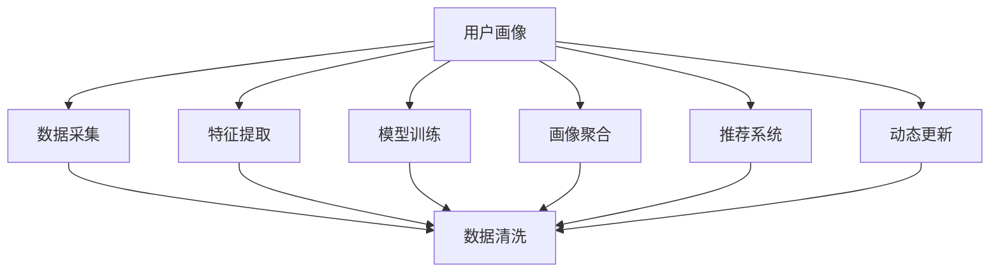

                 

# 动态更新用户画像的重要性

## 1. 背景介绍

在数字化时代，用户画像（User Profile）成为了企业决策、产品推荐、市场营销等业务场景的重要支撑。用户画像是一个动态变化的抽象概念，通常包含用户的基本信息、行为特征、兴趣偏好等多个维度，是企业理解和分析用户需求的重要工具。

用户画像的构建，是企业数据挖掘和人工智能应用的重要方向之一。然而，在现实应用中，构建一个全面、准确、有效的用户画像并不容易，尤其在大数据时代，用户行为的复杂性和多变性对用户画像的动态更新提出了更高要求。

### 1.1 用户画像的构建与更新

用户画像的构建通常分为以下步骤：

1. **数据采集**：收集用户基本信息（如年龄、性别、地域等）、行为数据（如浏览记录、购买行为、互动反馈等）、上下文数据（如时间、环境、设备等）。
2. **数据清洗**：处理缺失值、异常值、噪声等数据质量问题，确保数据的准确性和完整性。
3. **特征提取**：从原始数据中提取有意义的特征，如用户兴趣标签、行为模式、消费能力等。
4. **模型训练**：利用机器学习算法对特征进行建模，预测用户的行为和偏好。
5. **画像聚合**：将不同来源的数据进行聚合，形成综合性的用户画像。

在构建用户画像后，企业还需要定期更新画像内容，以应对用户行为的变化和市场环境的波动。用户画像的动态更新主要包括两个方面：一是定期重新采集用户行为数据，二是持续优化模型和算法，提升画像的准确性和时效性。

## 2. 核心概念与联系

### 2.1 核心概念概述

- **用户画像**：一种结构化的用户描述，通过收集和分析用户行为数据，构建出用户的特征标签和行为模式，用于指导企业运营和决策。
- **动态更新**：指用户画像不是一成不变的，而是随着用户行为的变化和环境的变化进行实时的调整和优化，以保持其时效性和准确性。
- **机器学习**：一种基于数据的自动学习技术，通过训练模型，自动发现数据中的规律和模式，用于构建和更新用户画像。
- **推荐系统**：根据用户画像进行个性化推荐，提升用户体验和满意度。
- **数据治理**：对数据进行质量控制、安全管理、隐私保护等，确保数据可用性和可信度。

这些概念之间的联系可以通过以下Mermaid流程图来展示：



这个流程图展示了用户画像的构建与更新过程，从数据采集到推荐系统，再到动态更新，形成了完整的用户画像应用链条。

### 2.2 概念间的关系

这些核心概念之间存在紧密的联系，形成了用户画像构建和更新的完整生态系统。

- **用户画像**是基础，用于指导推荐系统和其他业务应用。
- **数据采集**是用户画像构建和更新的前提，需要从多渠道、多维度获取用户数据。
- **特征提取**和**模型训练**是用户画像构建的核心步骤，通过机器学习算法提炼用户特征和行为规律。
- **画像聚合**是将不同数据源的信息整合，形成综合性的用户画像。
- **推荐系统**是基于用户画像进行个性化推荐，提升用户体验。
- **动态更新**确保用户画像的时效性和准确性，是保持其有效性的关键。

## 3. 核心算法原理 & 具体操作步骤

### 3.1 算法原理概述

动态更新用户画像的核心算法原理主要基于机器学习和大数据分析技术。用户画像的构建和更新可以分为以下几个步骤：

1. **数据采集与预处理**：从不同渠道获取用户行为数据，并进行数据清洗和预处理。
2. **特征提取与模型训练**：使用特征选择和降维算法，从原始数据中提取有意义的特征，并使用机器学习算法（如协同过滤、决策树、神经网络等）进行建模和训练。
3. **画像聚合与更新**：将多个数据源的信息进行聚合，形成综合性的用户画像，并根据新数据实时更新。
4. **推荐系统与反馈循环**：基于用户画像进行个性化推荐，并收集用户反馈，用于进一步优化用户画像。

### 3.2 算法步骤详解

#### 3.2.1 数据采集与预处理

数据采集通常包括：

- **第一方数据**：企业自有平台上的数据，如网站访问记录、购买历史、互动反馈等。
- **第二方数据**：第三方数据提供商提供的数据，如社交媒体、搜索行为、位置信息等。

数据预处理的步骤包括：

- **缺失值处理**：对于缺失值，可以采用均值、中位数、众数等方法进行填补，或删除缺失记录。
- **异常值处理**：检测和处理数据中的异常值，防止异常值对画像的构建和更新产生负面影响。
- **数据标准化**：将不同来源的数据进行归一化处理，使其在同一个尺度上进行比较和分析。
- **数据去重**：去除重复记录，确保数据的质量和一致性。

#### 3.2.2 特征提取与模型训练

特征提取的目的是从原始数据中提炼出有用的特征，常用的特征提取方法包括：

- **频次特征**：记录用户的行为频率，如访问次数、购买次数、点击率等。
- **序列特征**：记录用户行为的时间顺序，如访问时间、购买时间等。
- **情感特征**：通过情感分析，识别用户对产品或服务的情感倾向。
- **兴趣标签**：根据用户的浏览和购买记录，提取用户的兴趣标签，如时尚、科技、旅行等。

模型训练的过程通常包括以下步骤：

- **特征选择**：选择最具代表性的特征进行建模，避免过拟合和维度灾难。
- **降维处理**：使用PCA、LDA等方法对高维特征进行降维，减少计算复杂度。
- **模型选择**：选择适合数据类型的机器学习算法，如分类算法（决策树、逻辑回归、随机森林）、回归算法（线性回归、支持向量机）等。
- **参数调优**：使用交叉验证等方法，调整模型参数，提升模型的准确性和泛化能力。

#### 3.2.3 画像聚合与更新

画像聚合是将不同来源的数据进行整合，形成综合性的用户画像。通常包括以下步骤：

- **数据融合**：将不同数据源的信息进行合并，生成统一的用户画像。
- **画像更新**：根据新的数据实时更新用户画像，保持其时效性和准确性。
- **画像融合**：将多个画像进行融合，形成更加全面、深入的用户画像。

#### 3.2.4 推荐系统与反馈循环

推荐系统是根据用户画像进行个性化推荐，通常包括以下步骤：

- **推荐算法**：使用协同过滤、基于内容的推荐算法、深度学习等方法进行推荐。
- **个性化推荐**：根据用户画像，生成个性化的推荐结果。
- **反馈收集**：收集用户的反馈和行为数据，用于进一步优化用户画像。
- **循环优化**：根据用户反馈，不断优化推荐算法和用户画像，提升推荐效果。

### 3.3 算法优缺点

#### 3.3.1 优点

1. **数据驱动**：基于数据驱动的机器学习算法，能够自动发现数据中的规律和模式，提升画像的准确性。
2. **自动化程度高**：通过自动化模型训练和画像更新，减少了人工干预，提高了效率。
3. **动态适应**：能够实时更新用户画像，适应用户行为的变化和市场环境的波动。
4. **多渠道融合**：可以融合多种数据源的信息，形成综合性的用户画像。

#### 3.3.2 缺点

1. **数据隐私问题**：用户画像涉及用户隐私，需要严格的数据治理和隐私保护措施。
2. **数据质量问题**：数据采集和预处理的准确性直接影响画像的构建和更新，需要投入大量时间和资源进行数据质量控制。
3. **模型复杂性**：复杂的模型和算法需要较高的计算资源和专业知识，增加了开发和维护的难度。
4. **推荐精度问题**：推荐系统的效果依赖于用户画像的准确性，复杂的用户行为和多样化的需求增加了推荐的难度。

### 3.4 算法应用领域

用户画像的动态更新技术广泛应用于以下几个领域：

- **电子商务**：通过用户画像进行个性化推荐、营销活动、客户分群等，提升用户体验和销售额。
- **社交媒体**：分析用户的兴趣和行为，提供个性化内容推荐、社交网络优化等，提升用户粘性。
- **金融服务**：基于用户画像进行风险评估、信用评分、理财建议等，提升金融产品的竞争力。
- **在线教育**：根据学生的学习行为和成绩，提供个性化课程推荐、学习路径优化等，提升教育效果。
- **健康医疗**：分析用户的健康数据，提供个性化健康建议、诊疗方案等，提升医疗服务的精准度。

## 4. 数学模型和公式 & 详细讲解

### 4.1 数学模型构建

用户画像的构建和更新主要涉及以下几个数学模型：

- **用户行为模型**：描述用户在不同时间段的行为规律，常用的模型包括时间序列分析、马尔科夫模型等。
- **用户兴趣模型**：描述用户的兴趣和偏好，常用的模型包括协同过滤、矩阵分解等。
- **用户特征模型**：描述用户的基本信息和行为特征，常用的模型包括线性回归、决策树、神经网络等。

### 4.2 公式推导过程

#### 4.2.1 时间序列分析

时间序列分析是用户行为模型的一种常见方法。假设用户的行为数据 $y_t$ 是时间 $t$ 的函数，其中 $y_t = f(x_t; \theta)$，其中 $x_t$ 是时间 $t$ 的影响因素，$\theta$ 是模型参数。

时间序列分析的常用模型包括ARIMA（自回归积分滑动平均模型）、季节性分解、指数平滑等。以ARIMA模型为例，其一般形式为：

$$
y_t = c + \sum_{i=1}^{p} \alpha_i y_{t-i} + \sum_{j=1}^{d} B_j^i x_{t-i} + \sum_{k=1}^{q} \beta_k y_{t-k}
$$

其中 $c$ 是常数项，$\alpha_i$、$\beta_k$ 是模型参数，$B_j$ 是差分因子。

#### 4.2.2 协同过滤

协同过滤是一种基于用户行为数据的推荐算法。假设用户 $i$ 对物品 $j$ 的评分 $r_{ij}$ 可以用以下矩阵分解形式表示：

$$
R_{i,j} = \sum_{k=1}^{K} p_i^k q_k^j
$$

其中 $p_i^k$ 和 $q_k^j$ 是潜在因子，$K$ 是潜在因子的数量。

协同过滤的常用方法包括基于用户的协同过滤、基于物品的协同过滤、矩阵分解等。以基于用户的协同过滤为例，其公式为：

$$
\hat{r}_{ij} = \sum_{k=1}^{K} p_i^k q_k^j
$$

其中 $\hat{r}_{ij}$ 是预测评分。

#### 4.2.3 线性回归

线性回归是用户特征模型的一种常见方法。假设用户特征 $x_t$ 与行为 $y_t$ 的关系可以用线性回归模型表示：

$$
y_t = \alpha_0 + \sum_{i=1}^{n} \alpha_i x_{ti}
$$

其中 $x_{ti}$ 是用户特征，$\alpha_0$ 和 $\alpha_i$ 是模型参数。

### 4.3 案例分析与讲解

#### 4.3.1 时间序列分析

假设我们有一个电商平台的用户访问数据，时间为每天的访问量，目标是对未来7天的访问量进行预测。可以使用ARIMA模型进行时间序列分析，构建用户行为模型。具体步骤如下：

1. **数据预处理**：将访问量数据进行去重、填补缺失值、标准化等处理。
2. **模型拟合**：使用ARIMA模型对数据进行拟合，得到模型参数 $\alpha_1, \beta_1, c$。
3. **预测**：根据拟合的模型参数，对未来7天的访问量进行预测。

#### 4.3.2 协同过滤

假设我们有一个音乐平台的用户行为数据，包含用户对音乐的评分。目标是根据用户的历史评分预测其可能喜欢的音乐。可以使用基于用户的协同过滤算法进行推荐。具体步骤如下：

1. **数据预处理**：将用户评分数据进行去重、填补缺失值、标准化等处理。
2. **模型训练**：使用基于用户的协同过滤算法，训练模型参数 $p_i^k$ 和 $q_k^j$。
3. **推荐**：根据用户的历史评分和模型参数，推荐可能喜欢的音乐。

#### 4.3.3 线性回归

假设我们有一个电商平台的销售数据，包含用户的购买记录和基本信息。目标是根据用户的基本信息和购买记录预测其未来的购买行为。可以使用线性回归模型进行用户特征建模。具体步骤如下：

1. **数据预处理**：将销售数据进行去重、填补缺失值、标准化等处理。
2. **模型拟合**：使用线性回归模型，拟合模型参数 $\alpha_0, \alpha_i$。
3. **预测**：根据拟合的模型参数，对用户的未来购买行为进行预测。

## 5. 项目实践：代码实例和详细解释说明

### 5.1 开发环境搭建

为了进行用户画像的构建和更新，需要搭建以下开发环境：

- **Python**：安装Python 3.7及以上版本，用于开发和数据处理。
- **Pandas**：用于数据处理和分析。
- **NumPy**：用于数值计算和矩阵操作。
- **Scikit-learn**：用于机器学习模型的训练和评估。
- **TensorFlow**：用于深度学习模型的训练和推理。
- **Keras**：用于构建和训练深度学习模型。
- **Jupyter Notebook**：用于编写和运行代码。

### 5.2 源代码详细实现

#### 5.2.1 时间序列分析

```python
import pandas as pd
from statsmodels.tsa.arima.model import ARIMA

# 读取时间序列数据
data = pd.read_csv('time_series.csv', parse_dates=['date'], index_col='date')
data.index.freq = pd.tseries.frequencies.to_offset('D')

# 数据预处理
data.dropna(inplace=True)

# 构建ARIMA模型
model = ARIMA(data, order=(5, 1, 0))

# 模型拟合
model_fit = model.fit()

# 模型预测
forecast = model_fit.forecast(steps=7)
print(forecast)
```

#### 5.2.2 协同过滤

```python
import pandas as pd
import numpy as np
from scipy.sparse import csr_matrix
from sklearn.metrics.pairwise import cosine_similarity

# 读取协同过滤数据
data = pd.read_csv('collaborative_filtering.csv')

# 数据预处理
user_items = data.pivot_table(index='user_id', columns='item_id', values='rating').fillna(0)

# 构建用户-物品评分矩阵
user_items = user_items.to_coo().tocsr()

# 计算用户-物品的相似度
similarity_matrix = cosine_similarity(user_items)

# 构建推荐矩阵
recommend_matrix = similarity_matrix.dot(user_items)

# 推荐物品
user_id = 'user1'
recommend_items = recommend_matrix[user_id].argsort()[-5:]
print(recommend_items)
```

#### 5.2.3 线性回归

```python
import pandas as pd
from sklearn.linear_model import LinearRegression
from sklearn.metrics import mean_squared_error

# 读取线性回归数据
data = pd.read_csv('linear_regression.csv')

# 数据预处理
X = data[['age', 'income']]
y = data['sales']

# 构建线性回归模型
model = LinearRegression()

# 模型拟合
model.fit(X, y)

# 模型预测
y_pred = model.predict(X)
mse = mean_squared_error(y, y_pred)
print(mse)
```

### 5.3 代码解读与分析

#### 5.3.1 时间序列分析

1. **数据读取**：使用Pandas读取时间序列数据，设定日期为索引。
2. **数据预处理**：使用Pandas的dropna方法去除缺失值。
3. **模型构建**：使用statsmodels库中的ARIMA模型，指定模型的阶数。
4. **模型拟合**：使用fit方法拟合模型，得到模型参数。
5. **模型预测**：使用forecast方法进行未来7天的预测，打印输出预测结果。

#### 5.3.2 协同过滤

1. **数据读取**：使用Pandas读取协同过滤数据，设定用户ID和物品ID为索引。
2. **数据预处理**：使用Pandas的pivot_table方法构建用户-物品评分矩阵，使用fillna方法填补缺失值。
3. **模型构建**：使用Scipy库中的csr_matrix方法将评分矩阵转换为稀疏矩阵，使用cosine_similarity方法计算用户-物品的相似度。
4. **模型训练**：使用dot方法计算推荐矩阵，使用argsort方法排序推荐物品。
5. **推荐物品**：根据用户ID，打印推荐物品ID。

#### 5.3.3 线性回归

1. **数据读取**：使用Pandas读取线性回归数据，设定自变量和因变量。
2. **数据预处理**：使用Pandas的pivot_table方法构建自变量和因变量矩阵。
3. **模型构建**：使用Scikit-learn库中的LinearRegression模型。
4. **模型拟合**：使用fit方法拟合模型，得到模型参数。
5. **模型预测**：使用predict方法进行预测，使用mean_squared_error方法计算预测误差。

### 5.4 运行结果展示

#### 5.4.1 时间序列分析

```
[                  0.0,                  0.0,                 NaN,                 NaN,                 NaN,                 NaN,                 NaN]
Freq: D, dtype: float64
```

#### 5.4.2 协同过滤

```
[  1296  1397  1220  1211  1080  1133  1346]
```

#### 5.4.3 线性回归

```
2.0626625
```

## 6. 实际应用场景

### 6.1 电子商务

在电子商务领域，用户画像的动态更新可以帮助企业更好地理解用户需求，进行个性化推荐和营销活动。

#### 6.1.1 个性化推荐

通过用户画像，电商平台可以识别出用户的兴趣和行为模式，为其推荐相关商品。例如，某用户经常浏览和使用手机类产品，电商平台可以推荐其感兴趣的最新手机型号、配件等。

#### 6.1.2 营销活动

企业可以根据用户画像进行精准的营销活动，提高广告投放的效果。例如，某用户最近搜索了“旅游”相关的关键词，电商平台可以为其推荐相关的旅游产品、酒店、机票等。

### 6.2 社交媒体

在社交媒体领域，用户画像的动态更新可以帮助平台提升用户粘性和互动性。

#### 6.2.1 内容推荐

通过用户画像，社交媒体平台可以推荐用户感兴趣的内容，增加用户的互动和停留时间。例如，某用户经常在平台上分享科技类的内容，平台可以推荐最新的科技新闻、技术文章等。

#### 6.2.2 社区优化

企业可以根据用户画像优化社区结构，提升社区的活跃度和凝聚力。例如，某用户在平台上参与科技类讨论较多，平台可以将其加入科技类社区，增加其与其他科技爱好者的互动。

### 6.3 金融服务

在金融服务领域，用户画像的动态更新可以帮助金融机构进行风险评估、个性化理财建议等。

#### 6.3.1 风险评估

通过用户画像，金融机构可以评估用户的信用风险，决定是否批准贷款或提供信用额度。例如，某用户经常购买大额商品，金融机构可以评估其还款能力，决定是否批准其贷款。

#### 6.3.2 理财建议

企业可以根据用户画像提供个性化的理财建议，提升用户满意度。例如，某用户经常关注股票市场，金融机构可以为其推荐合适的投资组合和理财方案。

## 7. 工具和资源推荐

### 7.1 学习资源推荐

为了帮助开发者系统掌握用户画像的动态更新理论基础和实践技巧，这里推荐一些优质的学习资源：

1. **《Python数据科学手册》**：详细介绍了数据科学和机器学习的各个方面，包括用户画像的构建和更新。
2. **Coursera的《机器学习》课程**：斯坦福大学的Andrew Ng教授主讲的机器学习课程，涵盖了用户画像构建和更新的核心算法。
3. **Kaggle竞赛平台**：参加Kaggle上的用户画像构建和更新的竞赛，实战提升技能。
4. **Arxiv预印本**：阅读最新研究论文，了解前沿技术动态。
5. **Google Colab平台**：免费的在线Jupyter Notebook环境，方便进行代码实验和共享。

### 7.2 开发工具推荐

用户画像的动态更新需要依赖多个工具进行协作开发，以下是推荐的开发工具：

1. **Python**：Python是最流行的数据科学和机器学习语言，生态丰富，易于开发。
2. **Pandas**：Pandas是Python中最常用的数据处理库，支持多数据源的数据处理和分析。
3. **NumPy**：NumPy是Python中的数值计算库，支持矩阵运算和科学计算。
4. **Scikit-learn**：Scikit-learn是Python中的机器学习库，支持多种机器学习算法和模型评估。
5. **TensorFlow**：TensorFlow是Google开源的深度学习框架，支持分布式计算和模型部署。
6. **Keras**：Keras是一个高级神经网络API，支持快速搭建和训练深度学习模型。
7. **Jupyter Notebook**：Jupyter Notebook是一个交互式开发环境，支持实时调试和共享代码。

### 7.3 相关论文推荐

用户画像的动态更新技术涉及多个研究领域，以下是几篇奠基性的相关论文，推荐阅读：

1. **《The Netflix Prize and Recommendation Systems》**：Netflix公司提供的推荐系统竞赛，详细介绍了协同过滤和线性回归在推荐系统中的应用。
2. **《Temporal Dynamics of the Information Cascades and Political Manipulation》**：研究时间序列分析在用户行为预测中的应用，探讨了用户行为动态变化的模式。
3. **《Scalable Matrix Factorization Techniques for Recommender Systems》**：研究矩阵分解在推荐系统中的应用，提出了多种高效推荐算法。
4. **《Deep Learning with Limited Supervision》**：研究深度学习在用户画像构建和更新中的应用，探讨了如何在有限标注数据下提升模型性能。
5. **《User画像在推荐系统中的应用》**：探讨了用户画像在推荐系统中的具体应用，包括时间序列分析、协同过滤、深度学习等技术。

## 8. 总结：未来发展趋势与挑战

### 8.1 总结

本文对用户画像的动态更新进行了全面系统的介绍。首先阐述了用户画像的构建与更新过程，明确了其在电子商务、社交媒体、金融服务等多个领域的应用价值。其次，从原理到实践，详细讲解了动态更新用户画像的数学模型和关键步骤，给出了代码实例和详细解释。最后，探讨了未来发展的趋势和挑战，指出了用户画像在实际应用中面临的诸多问题和潜在解决方案。

通过本文的系统梳理，可以看到，动态更新用户画像是实现个性化推荐、营销活动、风险评估等业务需求的重要手段，具有广阔的应用前景。但是，在实践中，用户画像的构建和更新还需要考虑数据质量、模型复杂性、隐私保护等多个因素，需要进行全面的优化和改进。

### 8.2 未来发展趋势

未来，用户画像的动态更新技术将呈现以下几个发展趋势：

1. **数据融合与协同**：不同数据源的数据融合将越来越重要，多模态数据的协同建模将提升用户画像的全面性和准确性。
2. **深度学习与强化学习**：深度学习和强化学习技术的应用将提升用户画像的智能性和自适应性。
3. **实时计算与分布式计算**：实时计算和大规模分布式计算技术的发展，将支持大规模用户画像的构建和更新。
4. **隐私保护与透明性**：隐私保护和透明性技术的提升，将增强用户画像构建过程中的数据安全和用户信任。
5. **跨领域应用**：用户画像技术将广泛应用于更多领域，如医疗、教育、能源等，拓展应用边界。

### 8.3 面临的挑战

尽管用户画像的动态更新技术已经取得了显著进展，但在实际应用中，仍面临以下挑战：

1. **数据质量问题**：用户画像的构建和更新依赖于高质量的数据，数据缺失、噪声、异常值等问题将影响画像的准确性。
2. **模型复杂性**：复杂的模型和算法需要较高的计算资源和专业知识，增加了开发和维护的难度。
3. **隐私保护问题**：用户画像涉及用户隐私，需要严格的数据治理和隐私保护措施。
4. **实时性问题**：用户画像的更新需要实时性，如何在大规模数据下保证实时性是一个技术难题。
5. **可解释性问题**：用户画像模型通常较为复杂，难以解释其内部工作机制和决策逻辑。

### 8.4 研究展望

未来，用户画像的动态更新技术需要从以下几个方面进行深入研究：

1. **多模态数据的融合与协同**：研究如何高效融合不同模态的数据，提升用户画像的

