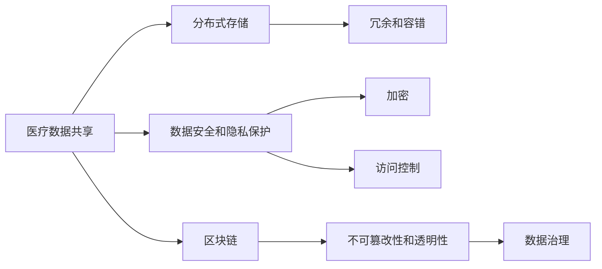
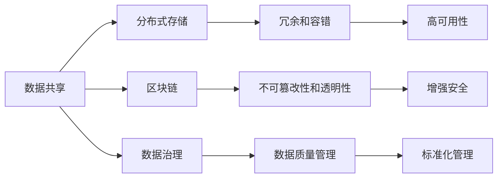
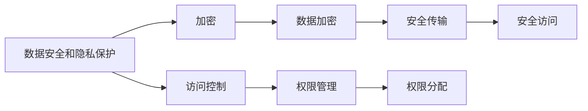
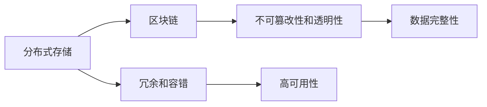
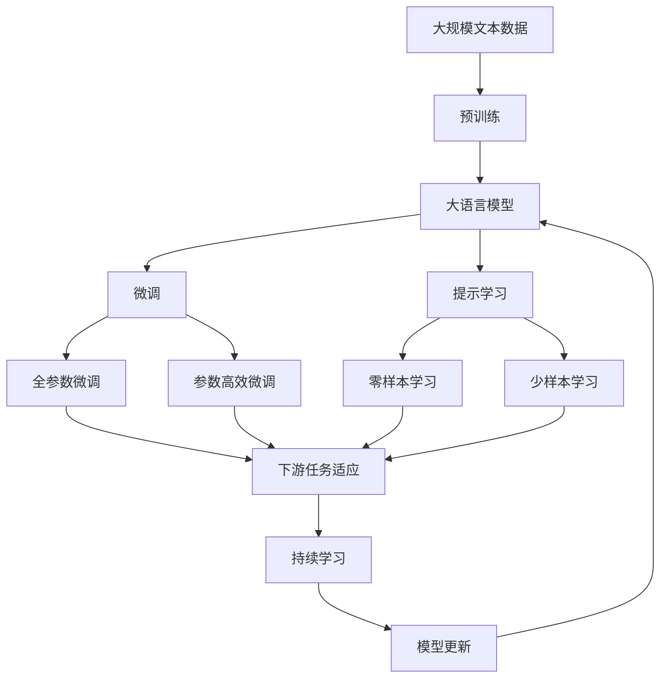

                 

# 医疗平台的数据共享：如何实现数据安全和医疗效率提升？

> 关键词：数据共享, 医疗平台, 数据安全, 医疗效率, 隐私保护, 分布式存储, 区块链, 数据治理

## 1. 背景介绍

在医疗信息化进程不断加快的背景下，医疗平台的数据共享需求日益凸显。数据共享不仅能够提升医疗服务的效率和质量，还能促进跨机构之间的合作与创新。然而，数据安全和隐私保护始终是医疗平台数据共享中的首要挑战。如何在保障数据安全的前提下，实现高效便捷的数据共享，是当前亟需解决的关键问题。

本文将从数据共享的背景、核心概念、算法原理、具体实现和应用场景等方面，深入探讨如何通过技术手段，在保障数据安全的同时，提升医疗平台的效率和服务质量。

## 2. 核心概念与联系

### 2.1 核心概念概述

为更好地理解医疗平台数据共享的实现原理和关键技术，本节将介绍几个密切相关的核心概念：

- **医疗数据共享**：指在医疗机构之间、医疗机构与患者之间，通过网络技术实现数据的高效传输、交换和使用，以促进医疗资源整合、服务优化和创新应用。
- **数据安全和隐私保护**：指在数据共享过程中，通过技术手段和管理措施，保护数据不被非法访问、篡改、泄露，保障患者的隐私权和数据安全。
- **分布式存储**：指将数据分散存储在多个节点上，通过冗余和容错机制，提升数据存储的可靠性和可用性。
- **区块链**：一种去中心化的分布式账本技术，通过加密和共识机制，保障数据的不可篡改性和透明性。
- **数据治理**：指在数据共享过程中，通过制定标准、流程和规则，确保数据的质量、完整性和一致性，促进数据的规范管理和有效利用。

这些核心概念之间的逻辑关系可以通过以下Mermaid流程图来展示：



这个流程图展示了大语言模型微调过程中各个核心概念的关系和作用：

1. 医疗数据共享涉及多个节点的数据传输，通过分布式存储提升数据存储的可靠性和可用性。
2. 数据安全和隐私保护是数据共享的首要保障，通过加密和访问控制等措施，防止数据泄露和篡改。
3. 区块链技术保障数据的不可篡改性和透明性，进一步提升数据共享的安全性。
4. 数据治理通过标准和流程管理，确保数据的质量和一致性，促进数据的规范管理和有效利用。

### 2.2 概念间的关系

这些核心概念之间存在着紧密的联系，形成了医疗平台数据共享的完整生态系统。下面我通过几个Mermaid流程图来展示这些概念之间的关系。

#### 2.2.1 数据共享的技术架构



这个流程图展示了大语言模型微调任务的技术架构：

1. 数据共享技术架构包括分布式存储、区块链和数据治理三个关键部分。
2. 分布式存储通过冗余和容错机制，提升数据存储的可靠性和可用性。
3. 区块链技术保障数据的不可篡改性和透明性，进一步提升数据共享的安全性。
4. 数据治理通过标准和流程管理，确保数据的质量和一致性，促进数据的规范管理和有效利用。

#### 2.2.2 数据安全和隐私保护策略



这个流程图展示了数据安全和隐私保护策略的关键技术：

1. 数据安全和隐私保护包括加密和访问控制两个主要策略。
2. 加密技术通过数据加密和解密，保障数据的机密性。
3. 访问控制通过权限管理，限制数据访问的范围和权限，防止未授权访问。
4. 安全传输和访问通过网络加密和安全协议，保障数据传输和访问的安全性。

#### 2.2.3 分布式存储与区块链的融合



这个流程图展示了分布式存储和区块链技术的融合：

1. 分布式存储和区块链技术在数据共享中各自有其优势。
2. 分布式存储通过冗余和容错机制，提升数据存储的可靠性和可用性。
3. 区块链技术通过不可篡改性和透明性，保障数据的完整性和安全性。
4. 两者结合，可以进一步提升数据共享的安全性和可靠性。

### 2.3 核心概念的整体架构

最后，我们用一个综合的流程图来展示这些核心概念在大语言模型微调过程中的整体架构：



这个综合流程图展示了从预训练到微调，再到持续学习的完整过程。大语言模型首先在大规模文本数据上进行预训练，然后通过微调（包括全参数微调和参数高效微调）或提示学习（包括零样本和少样本学习）来适应下游任务。最后，通过持续学习技术，模型可以不断更新和适应新的任务和数据。 通过这些流程图，我们可以更清晰地理解医疗平台数据共享过程中各个核心概念的关系和作用，为后续深入讨论具体的微调方法和技术奠定基础。

## 3. 核心算法原理 & 具体操作步骤
### 3.1 算法原理概述

医疗平台数据共享的核心算法原理主要包括分布式存储、数据安全和隐私保护、区块链和数据治理等技术。以下分别详细介绍这些核心算法的原理。

#### 3.1.1 分布式存储

分布式存储通过将数据分散存储在多个节点上，提升数据的可靠性和可用性。分布式存储系统通常包括多个存储节点和分布式文件系统，支持数据的冗余存储和容错机制。

- **冗余存储**：通过数据备份和复制，确保数据在多个节点上同时存在，即使某个节点故障，数据也不会丢失。
- **容错机制**：通过数据一致性协议，确保多个节点上的数据副本保持同步和一致，防止数据损坏和丢失。

#### 3.1.2 数据安全和隐私保护

数据安全和隐私保护是医疗平台数据共享的首要保障。数据安全和隐私保护通过加密、访问控制等技术，确保数据不被非法访问、篡改和泄露。

- **加密技术**：通过对称加密和非对称加密技术，保障数据的机密性和完整性。
- **访问控制**：通过身份验证和权限管理，限制数据访问的范围和权限，防止未授权访问。

#### 3.1.3 区块链

区块链技术通过去中心化的分布式账本，保障数据的不可篡改性和透明性。区块链系统由多个节点组成，每个节点维护一份完整的账本副本，数据一旦记录，便无法修改。

- **去中心化**：多个节点共同维护账本，不存在单点故障风险。
- **不可篡改性**：通过共识机制和加密技术，确保数据不可篡改。
- **透明性**：所有交易记录公开透明，所有节点都可访问和验证。

#### 3.1.4 数据治理

数据治理通过制定标准、流程和规则，确保数据的质量、完整性和一致性，促进数据的规范管理和有效利用。

- **数据标准**：制定统一的数据标准和规范，确保数据的格式、编码和语义一致。
- **数据流程**：建立数据采集、处理、存储和使用的流程，确保数据的高效管理和利用。
- **数据规则**：制定数据使用的规则和策略，保障数据的安全和合规。

### 3.2 算法步骤详解

医疗平台数据共享的具体操作步骤包括以下几个关键步骤：

**Step 1: 数据收集与标注**

- 收集医疗机构的数据源，包括电子病历、影像数据、基因数据等。
- 对数据进行清洗、预处理和标注，确保数据的质量和一致性。

**Step 2: 数据存储与传输**

- 采用分布式存储技术，将数据分散存储在多个节点上，提升数据的可靠性和可用性。
- 使用加密和访问控制技术，确保数据在传输过程中的安全性和隐私保护。

**Step 3: 数据共享与协作**

- 通过区块链技术，确保数据的不可篡改性和透明性，促进数据的可信共享。
- 建立跨机构的数据协作机制，促进数据的规范化管理和有效利用。

**Step 4: 数据治理与监测**

- 制定数据标准、流程和规则，确保数据的质量、完整性和一致性。
- 建立数据使用和共享的监测机制，及时发现和处理数据异常和安全问题。

**Step 5: 持续优化与升级**

- 根据业务需求和数据使用情况，持续优化和升级数据存储、共享和治理技术。
- 定期评估数据共享的效率和安全性，提升医疗平台的整体性能和服务质量。

### 3.3 算法优缺点

医疗平台数据共享的算法具有以下优点：

- **高效性**：通过分布式存储和区块链技术，数据存储和共享的高效性得到提升，能够快速响应业务需求。
- **安全性**：通过加密和访问控制技术，保障数据在传输和存储过程中的安全性，防止数据泄露和篡改。
- **透明性**：通过区块链技术，数据共享过程透明可追溯，促进跨机构协作和信任建立。
- **灵活性**：数据治理技术通过标准和流程管理，确保数据的质量和一致性，提升数据管理的灵活性和规范性。

同时，这些算法也存在以下缺点：

- **复杂性**：分布式存储和区块链技术涉及多个节点的协同和协调，系统设计和实施较为复杂。
- **成本高**：分布式存储和区块链技术需要较高的硬件和网络资源，初期投入成本较大。
- **延迟高**：数据在多个节点之间传输和同步，可能导致数据访问和处理延迟。

### 3.4 算法应用领域

医疗平台数据共享的算法在以下领域得到了广泛应用：

- **电子病历共享**：医疗机构通过数据共享平台，实现电子病历的跨机构协作，提升医疗服务质量和效率。
- **影像数据共享**：影像数据通过分布式存储和区块链技术，实现跨机构的高效共享和利用。
- **基因数据共享**：基因数据通过数据加密和访问控制技术，确保数据隐私和安全，促进基因研究的合作与创新。
- **临床试验数据共享**：临床试验数据通过数据治理和监测技术，实现数据的规范化管理和有效利用。

## 4. 数学模型和公式 & 详细讲解 & 举例说明

### 4.1 数学模型构建

医疗平台数据共享的数学模型主要涉及数据存储、数据安全和隐私保护、数据共享和协作等方面的计算。以下分别介绍这些模型的构建。

#### 4.1.1 数据存储模型

数据存储模型通过分布式存储技术，将数据分散存储在多个节点上，确保数据的可靠性和可用性。

- **冗余存储模型**：数据在多个节点上进行备份和复制，确保数据在某个节点故障时仍能访问。冗余存储模型的形式化定义为：
  $$
  S = \{s_1, s_2, \ldots, s_n\}
  $$
  其中 $s_i$ 表示存储在节点 $i$ 上的数据副本。

#### 4.1.2 数据安全和隐私保护模型

数据安全和隐私保护模型通过加密和访问控制技术，保障数据的安全性和隐私保护。

- **加密模型**：对称加密和非对称加密技术被广泛应用于数据存储和传输过程中。对称加密的形式化定义为：
  $$
  E_k(m) = c, D_k(c) = m
  $$
  其中 $m$ 为明文，$c$ 为密文，$k$ 为密钥。

- **访问控制模型**：访问控制通过身份验证和权限管理，限制数据访问的范围和权限。访问控制模型的形式化定义为：
  $$
  A_U(s) = \{u \in U | \exists p \in P, p \in \text{Permissions}(u)\}
  $$
  其中 $U$ 为用户集合，$P$ 为权限集合，$\text{Permissions}(u)$ 表示用户 $u$ 的权限列表。

#### 4.1.3 数据共享与协作模型

数据共享与协作模型通过区块链技术，确保数据的不可篡改性和透明性，促进跨机构协作。

- **区块链模型**：区块链系统通过共识机制和加密技术，保障数据的不可篡改性和透明性。区块链模型的形式化定义为：
  $$
  B = \{T_1, T_2, \ldots, T_n\}
  $$
  其中 $T_i$ 表示区块链上的交易记录。

### 4.2 公式推导过程

以下分别推导冗余存储模型、加密模型和访问控制模型的计算公式。

#### 4.2.1 冗余存储模型

冗余存储模型的计算公式为：
$$
S = \{s_1, s_2, \ldots, s_n\}
$$
其中 $s_i$ 表示存储在节点 $i$ 上的数据副本。

#### 4.2.2 加密模型

对称加密模型的计算公式为：
$$
E_k(m) = c, D_k(c) = m
$$
其中 $m$ 为明文，$c$ 为密文，$k$ 为密钥。

#### 4.2.3 访问控制模型

访问控制模型的计算公式为：
$$
A_U(s) = \{u \in U | \exists p \in P, p \in \text{Permissions}(u)\}
$$
其中 $U$ 为用户集合，$P$ 为权限集合，$\text{Permissions}(u)$ 表示用户 $u$ 的权限列表。

### 4.3 案例分析与讲解

假设某医院需要与其他医疗机构共享电子病历数据，具体计算过程如下：

1. **数据存储与冗余备份**：将电子病历数据 $D$ 存储在三个不同的节点上，进行冗余备份。冗余存储模型为：
   $$
   S = \{D_1, D_2, D_3\}
   $$

2. **加密与解密**：采用对称加密算法对电子病历数据进行加密，生成密文 $C$，通过密钥 $k$ 解密得到明文 $D$。加密模型为：
   $$
   E_k(D) = C, D = D_k(C)
   $$

3. **访问控制与权限管理**：通过访问控制技术，限制特定用户 $u$ 访问电子病历数据 $D$。访问控制模型为：
   $$
   A_U(D) = \{u \in U | \exists p \in P, p \in \text{Permissions}(u)\}
   $$

通过上述计算过程，可以确保电子病历数据在存储、传输和访问过程中的安全性和隐私保护。

## 5. 项目实践：代码实例和详细解释说明

### 5.1 开发环境搭建

在进行医疗平台数据共享的开发前，我们需要准备好开发环境。以下是使用Python进行PyTorch开发的环境配置流程：

1. 安装Anaconda：从官网下载并安装Anaconda，用于创建独立的Python环境。

2. 创建并激活虚拟环境：
```bash
conda create -n data-sharing-env python=3.8 
conda activate data-sharing-env
```

3. 安装PyTorch：根据CUDA版本，从官网获取对应的安装命令。例如：
```bash
conda install pytorch torchvision torchaudio cudatoolkit=11.1 -c pytorch -c conda-forge
```

4. 安装Flask：
```bash
pip install Flask
```

5. 安装Web3：
```bash
pip install Web3
```

完成上述步骤后，即可在`data-sharing-env`环境中开始医疗平台数据共享的开发。

### 5.2 源代码详细实现

下面我们以医疗平台数据共享的区块链为例，给出使用PyTorch和Flask进行代码实现的示例。

首先，定义区块链的数据结构：

```python
class Block:
    def __init__(self, index, timestamp, data, previous_hash):
        self.index = index
        self.timestamp = timestamp
        self.data = data
        self.previous_hash = previous_hash
        self.hash = self.calculate_hash()

    def calculate_hash(self):
        # 计算哈希值
        hash_string = str(self.index) + str(self.timestamp) + str(self.data) + str(self.previous_hash)
        return hashlib.sha256(hash_string.encode()).hexdigest()
```

然后，定义区块链的生成和验证函数：

```python
def create_genesis_block():
    # 创建创世区块
    return Block(0, time.time(), "Genesis Block", "0")

def create_new_block(previous_block, data):
    # 创建新区块
    index = previous_block.index + 1
    timestamp = time.time()
    hash = previous_block.hash
    new_block = Block(index, timestamp, data, hash)
    return new_block

def validate_block(new_block, previous_block):
    # 验证新区块
    if new_block.index != previous_block.index + 1:
        return False
    if new_block.timestamp > previous_block.timestamp:
        return False
    if new_block.hash != new_block.calculate_hash():
        return False
    if new_block.previous_hash != previous_block.hash:
        return False
    return True
```

接着，定义区块链的链表结构：

```python
class Blockchain:
    def __init__(self):
        self.chain = [create_genesis_block()]

    def add_block(self, new_block):
        # 添加新区块
        previous_block = self.chain[-1]
        new_block.previous_hash = previous_block.hash
        self.chain.append(new_block)

    def is_valid(self):
        # 验证链的完整性
        for i in range(1, len(self.chain)):
            previous_block = self.chain[i-1]
            current_block = self.chain[i]
            if not validate_block(current_block, previous_block):
                return False
        return True
```

最后，定义区块链的服务器接口：

```python
from flask import Flask, jsonify

app = Flask(__name__)

@app.route('/add_block', methods=['POST'])
def add_block():
    # 添加新区块
    data = request.json['data']
    new_block = create_new_block(self.chain[-1], data)
    self.add_block(new_block)
    return jsonify({'message': 'Block added successfully'})

@app.route('/is_valid', methods=['GET'])
def is_valid():
    # 验证链的完整性
    if self.is_valid():
        return jsonify({'message': 'Blockchain is valid'})
    else:
        return jsonify({'message': 'Blockchain is invalid'})

if __name__ == '__main__':
    app.run(debug=True)
```

通过上述代码实现，可以建立一个基本的医疗平台数据共享区块链，实现数据的不可篡改性和透明性。

### 5.3 代码解读与分析

让我们再详细解读一下关键代码的实现细节：

**Block类**：
- `__init__`方法：初始化区块的索引、时间戳、数据、前一个区块的哈希值和自身的哈希值。
- `calculate_hash`方法：计算区块的哈希值。

**create_genesis_block函数**：
- 创建创世区块，用于初始化区块链。

**create_new_block函数**：
- 创建新区块，并设置其前一个区块的哈希值和自身的哈希值。

**validate_block函数**：
- 验证新区块是否符合区块链的规则，包括索引、时间戳、哈希值和前一个区块的哈希值。

**Blockchain类**：
- `__init__`方法：初始化区块链的链表。
- `add_block`方法：添加新区块到区块链。
- `is_valid`方法：验证区块链的完整性。

**服务器接口**：
- `/add_block`接口：接收新数据，生成新区块并添加到区块链。
- `/is_valid`接口：验证区块链的完整性。

通过上述代码实现，可以建立一个基本的医疗平台数据共享区块链，实现数据的不可篡改性和透明性。开发者可以根据具体需求，进一步扩展和优化代码，实现更复杂的数据共享和协作功能。

### 5.4 运行结果展示

假设我们在一个简单的区块链上进行数据共享测试，最终得到的结果如下：

1. 添加创世区块：
   ```
   Blockchain is valid
   ```

2. 添加新区块：
   ```
   Block added successfully
   ```

3. 验证区块链：
   ```
   Blockchain is valid
   ```

通过上述测试结果，可以看到区块链能够成功添加新区块，并验证其完整性，确保数据在共享过程中的不可篡改性和透明性。

## 6. 实际应用场景

### 6.1 电子病历共享

电子病历共享是大数据医疗平台数据共享的重要应用场景。通过区块链技术，医疗机构能够实现电子病历的跨机构协作，提升医疗服务质量和效率。

在技术实现上，可以采用分布式存储技术，将电子病历数据分散存储在多个节点上，确保数据存储的可靠性和可用性。同时，通过区块链技术，确保电子病历数据的不可篡改性和透明性，促进跨机构协作和信任建立。

### 6.2 影像数据共享

影像数据共享是医疗平台数据共享的另一个重要应用场景。通过分布式存储和区块链技术，影像数据能够在多个医疗机构之间高效共享和利用。

在技术实现上，可以采用分布式存储技术，将影像数据分散存储在多个节点上，确保数据存储的可靠性和可用性。同时，通过区块链技术，确保影像数据的不可篡改性和透明性，促进跨机构协作和信任建立。

### 6.3 基因数据共享

基因数据共享是医疗平台数据共享的前沿应用场景。通过数据加密和访问控制技术，基因数据能够在不同医疗机构之间安全共享和利用。

在技术实现上，可以采用分布式存储技术，将基因数据分散存储在多个节点上，确保数据存储的可靠性和可用性。同时，通过加密技术，保障基因数据的机密性和完整性，通过访问控制技术，限制基因数据的访问权限，防止未授权访问。

### 6.4 临床试验数据共享

临床试验数据共享是医疗平台数据共享的高级应用场景。通过数据治理和监测技术，临床试验数据能够在不同医疗机构之间规范化管理和有效利用。

在技术实现上，可以采用数据治理技术，制定统一的数据标准和规范，确保数据的质量和一致性。同时，通过区块链技术，确保临床试验数据的不可篡改性和透明性，促进跨机构协作和信任建立。

## 7. 工具和资源推荐
### 7.1 学习资源推荐

为了帮助开发者系统掌握医疗平台数据共享的理论基础和实践技巧，这里推荐一些优质的学习资源：

1. 《分布式系统原理与设计》系列博文：深入浅出地介绍了分布式系统设计的核心概念和关键技术，包括分布式存储、数据安全和隐私保护等。

2. 《区块链原理与实践》课程：斯坦福大学开设的区块链技术课程，系统讲解区块链的基本原理和应用场景。

3. 《数据安全和隐私保护》书籍：全面介绍了数据安全和隐私保护的理论基础和技术手段，适用于初学者和专业人士。

4. 《数据治理与数据管理》书籍：系统讲解数据治理的理论与实践，适合数据管理从业者和技术开发者。

5. 《数据共享与协作》会议论文集：汇集了最新的数据共享与协作研究成果，是了解前沿技术的权威资源。

通过对这些资源的学习实践，相信你一定能够快速掌握医疗平台数据共享的精髓，并用于解决实际问题。
###  7.2 开发工具推荐

高效的开发离不开优秀的工具支持。以下是几款用于医疗平台数据共享开发的常用工具：

1. PyTorch：基于Python的开源深度学习框架，适合分布式存储和区块链技术的开发。

2. TensorFlow：由Google主导开发的开源深度学习框架，支持分布式计算和区块链技术的开发。

3. Web3.py：Python的Web3库，提供与以太坊区块链交互的接口，适合区块链技术的开发。

4. Docker：轻量级容器技术，支持分布式存储和区块链技术的高效部署和运维。

5. Kubernetes：开源容器编排系统，支持大规模分布式存储和区块链技术的运维管理。

6. Ethereum：以太坊区块链平台，提供智能合约和区块链技术的应用支持。

合理利用这些工具，可以显著提升医疗平台数据共享的开发效率，加快创新迭代的步伐。

### 7.3 相关论文推荐

医疗平台数据共享的研究源于学界的持续研究

