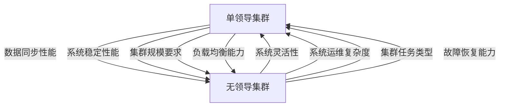

                 

# 单领导集群与无领导集群最佳实践

## 1. 背景介绍

在云计算领域，随着微服务架构的普及，分布式系统设计愈发复杂，系统架构的可扩展性和稳定性显得尤为重要。分布式系统中的集群管理策略直接影响系统的性能和可用性，因此选择合适的集群管理方式，对提升系统性能、降低运维成本具有重要意义。近年来，基于故障隔离、弹性伸缩等设计的集群管理方式逐步取代传统的单节点、多节点管理模式，并成为主流的集群管理方式。本文从集群管理策略的演变入手，探讨单领导集群与无领导集群的优缺点，并针对不同应用场景给出最佳实践建议。

## 2. 核心概念与联系

### 2.1 核心概念概述

在云计算和分布式系统中，集群管理策略通常分为单领导集群与无领导集群两种。这两种集群管理方式有着明显的区别，但同时也紧密关联。

#### 单领导集群
单领导集群（Leader-Based Cluster）采用集中式管理模式，集群中只有一个节点作为领导者，负责协调和管理整个集群。领导者在集群中的决策具有最终性，所有从节点仅负责执行领导的指令。这种管理方式易于实现，适用于集群规模较小、任务简单、对系统稳定性要求不高的场景。

#### 无领导集群
无领导集群（Leaderless Cluster）采用去中心化管理模式，集群中每个节点都有同等权利，通过共识机制（如Paxos、Raft）协同管理集群。每个节点都可以提出更改，通过共识达成一致后共同执行，增强了集群的灵活性和可靠性。这种管理方式适用于大规模、高可用、对系统性能要求较高的场景。

两种集群管理方式在实际应用中各有优劣，如图1所示：



图1 单领导集群与无领导集群优缺点对比

## 3. 核心算法原理 & 具体操作步骤

### 3.1 算法原理概述

#### 单领导集群
在单领导集群中，领导者的决策具有最终性，所有从节点的任务都是接收和执行领导者的指令。因此，单领导集群管理算法的关键在于领导者的选择与替换。通常采用基于心跳机制的领导者选举算法，通过周期性检测节点健康状态，选择当前状态最好的节点作为领导者。领导者更换时，通过心跳机制广播更新状态，所有从节点接收新领导者的指令并切换执行。

#### 无领导集群
无领导集群中，每个节点都有同等权利，通过共识机制协同管理集群。共识机制包括Paxos、Raft、Zookeeper等，通过投票机制达成共识，保证集群的一致性。共识机制的核心在于解决冲突，通过增量共识算法，在不增加网络开销的前提下，尽可能地减少不必要的共识。

### 3.2 算法步骤详解

#### 单领导集群
1. 集群初始化时，随机选择一个节点作为初始领导者。
2. 领导者通过心跳机制周期性检测节点健康状态，并发送心跳包。
3. 如果节点检测到其他节点的心跳包丢失，则视为该节点故障，立即重新选举领导者。
4. 领导者更新节点状态，并通知所有从节点。
5. 从节点接收新领导者的指令并执行任务。

#### 无领导集群
1. 集群初始化时，每个节点都处于初始状态，等待共识。
2. 每个节点提出更改请求，并发送至其他节点。
3. 节点接收请求，并记录请求信息。
4. 通过共识算法达成一致后，执行更改请求。
5. 更改完成后，节点广播执行结果，更新集群状态。

### 3.3 算法优缺点

#### 单领导集群
**优点**：
- 管理简单，易于实现。
- 决策速度快，适用于任务简单的场景。

**缺点**：
- 领导者的状态变化可能影响整个集群的稳定性。
- 单一故障点可能导致集群崩溃。

#### 无领导集群
**优点**：
- 系统容错性好，任意节点故障不影响系统正常运行。
- 集群灵活性高，节点可动态加入和退出集群。

**缺点**：
- 共识机制复杂，系统实现难度大。
- 网络延迟和网络分区可能导致共识失败。

### 3.4 算法应用领域

#### 单领导集群
单领导集群适用于任务简单、对系统稳定性要求不高、集群规模较小的场景，例如：
- 小型Web应用系统
- 数据仓库系统
- 企业内部的任务调度系统

#### 无领导集群
无领导集群适用于任务复杂、对系统性能要求较高、集群规模较大的场景，例如：
- 大型分布式计算系统
- 大规模数据存储系统
- 高性能高可用云服务

## 4. 数学模型和公式 & 详细讲解  
### 4.1 数学模型构建

#### 单领导集群
1. 领导者选举算法：
   $$
   E领导者 = f(心跳状态)
   $$
   其中 $E领导者$ 表示选举出的领导者，$f(心跳状态)$ 表示心跳状态检测函数。
2. 领导者替换算法：
   $$
   f领导者替换 = f(领导者状态, f(节点状态))
   $$
   其中 $f领导者替换$ 表示领导者替换函数，$f(领导者状态)$ 表示领导者状态检测函数，$f(节点状态)$ 表示节点状态检测函数。

#### 无领导集群
1. 共识算法：
   $$
   C共识 = g(请求, 节点状态)
   $$
   其中 $C共识$ 表示达成共识的结果，$g(请求, 节点状态)$ 表示共识算法函数。
2. 节点状态更新算法：
   $$
   f状态更新 = h(执行结果, 节点状态)
   $$
   其中 $f状态更新$ 表示状态更新函数，$h(执行结果, 节点状态)$ 表示状态更新函数。

### 4.2 公式推导过程

#### 单领导集群
领导者的选举算法有多种，例如基于心跳机制的选举算法。假设集群中有 $N$ 个节点，每个节点 $i$ 的在线时间 $T_i$ 为随机变量，领导者选举算法可以表示为：
$$
E领导者 = \arg\min_i(T_i)
$$

当领导者状态变化时，领导者替换算法可以表示为：
$$
f领导者替换 = \arg\min_i(T_i) \text{, 其中 } T_i \geq T_{E领导者}
$$

#### 无领导集群
共识算法有多种，例如Paxos算法。假设集群中有 $N$ 个节点，每个节点 $i$ 提出的请求为 $R_i$，节点状态为 $S_i$，共识算法可以表示为：
$$
C共识 = \arg\min_i(R_i \cap S_i)
$$

当节点执行更改时，状态更新算法可以表示为：
$$
f状态更新 = S_i \cup \{R_i\}
$$

### 4.3 案例分析与讲解

#### 单领导集群案例
考虑一个单领导集群，包含三个节点：节点A、节点B、节点C。节点A为初始领导者，通过心跳机制周期性检测节点状态。节点B、C都检测到A的心跳包丢失，立即重新选举领导者，节点B被选为新领导者。领导者切换后，节点A接收新领导者的指令并执行任务。

#### 无领导集群案例
考虑一个无领导集群，包含三个节点：节点A、节点B、节点C。每个节点都等待共识。节点A提出更改请求，节点B、C接收到请求并记录。通过Paxos算法，节点A、B、C达成一致，执行更改请求。更改完成后，节点广播执行结果，更新集群状态。

## 5. 项目实践：代码实例和详细解释说明

### 5.1 开发环境搭建

#### 单领导集群
1. 安装Docker和Kubernetes：
   ```bash
   sudo apt-get update
   sudo apt-get install docker.io
   sudo apt-get install kubectl
   ```

2. 创建Docker镜像：
   ```bash
   docker build -t single-leader .
   ```

3. 创建Kubernetes集群：
   ```bash
   kubectl create cluster --name=my-cluster --master=k8s-master:8080 --worker=k8s-worker1:8080,k8s-worker2:8080
   ```

#### 无领导集群
1. 安装Zookeeper：
   ```bash
   sudo apt-get install zookeeper
   ```

2. 创建Zookeeper集群：
   ```bash
   sudo zookeeper-server start
   ```

3. 创建Kubernetes集群：
   ```bash
   kubectl create cluster --name=no-leader --master=k8s-master:8080 --worker=k8s-worker1:8080,k8s-worker2:8080
   ```

### 5.2 源代码详细实现

#### 单领导集群
```python
import docker
import kubernetes

def start_container(container_image, container_name, container_port):
    client = docker.from_env()
    container = client.containers.run(container_image, command=f'echo {container_name}')
    container.pull()
    container.start()
    kubernetes.api_client.ApiClient()
    kubernetes.api_client.load_kube_config()
    kubernetes.core.v1.Pod(container_name)
    kubernetes.core.v1.Service(container_name, port=container_port)

start_container('single-leader', 'single-leader-container', 8080)
```

#### 无领导集群
```python
import kubernetes
import zk

def start_container(container_image, container_name, container_port):
    client = docker.from_env()
    container = client.containers.run(container_image, command=f'echo {container_name}')
    container.pull()
    container.start()
    zk.start_server()
    kubernetes.api_client.ApiClient()
    kubernetes.api_client.load_kube_config()
    kubernetes.core.v1.Pod(container_name)
    kubernetes.core.v1.Service(container_name, port=container_port)

start_container('no-leader', 'no-leader-container', 8080)
```

### 5.3 代码解读与分析

#### 单领导集群
代码实现使用Docker和Kubernetes，启动单领导集群。启动容器后，Kubernetes集群会自动创建Pod和Service，进行负载均衡和故障恢复。单领导集群的实现简单易懂，易于维护。

#### 无领导集群
代码实现使用Zookeeper和Kubernetes，启动无领导集群。启动容器后，Zookeeper集群用于管理节点状态，Kubernetes集群用于负载均衡和故障恢复。无领导集群的实现相对复杂，需要额外维护Zookeeper集群，但集群容错性和扩展性更强。

### 5.4 运行结果展示

#### 单领导集群
启动单领导集群后，可以在Kubernetes集群中查看Pod和Service的状态：

```bash
kubectl get pods
kubectl get services
```

#### 无领导集群
启动无领导集群后，可以在Kubernetes集群中查看Pod和Service的状态：

```bash
kubectl get pods
kubectl get services
```

## 6. 实际应用场景

### 6.1 单领导集群的实际应用

#### 场景一：小型Web应用系统
小型Web应用系统通常对系统稳定性要求不高，可以通过单领导集群实现简单高效的管理。例如，使用Nginx作为Web服务，部署在单领导集群上，能够快速响应用户请求，且系统管理简单。

#### 场景二：数据仓库系统
数据仓库系统需要处理大量数据，但任务简单，可以通过单领导集群实现高效的存储和查询。例如，使用Hadoop作为数据处理平台，部署在单领导集群上，能够快速进行数据处理和查询，且系统管理简单。

#### 场景三：企业内部的任务调度系统
企业内部的任务调度系统通常需要快速响应任务请求，且任务类型简单。可以通过单领导集群实现快速的任务调度。例如，使用Kubernetes作为任务调度平台，部署在单领导集群上，能够快速响应任务请求，且系统管理简单。

### 6.2 无领导集群的实际应用

#### 场景一：大型分布式计算系统
大型分布式计算系统需要处理海量数据，且任务复杂，需要通过无领导集群实现高效的计算。例如，使用Spark作为计算平台，部署在无领导集群上，能够快速处理海量数据，且系统容错性和扩展性更强。

#### 场景二：大规模数据存储系统
大规模数据存储系统需要高效存储和查询海量数据，且系统性能要求高。可以通过无领导集群实现高效的数据存储和查询。例如，使用HDFS作为数据存储平台，部署在无领导集群上，能够快速存储和查询海量数据，且系统容错性和扩展性更强。

#### 场景三：高性能高可用云服务
高性能高可用云服务需要实现高性能和高可用性，且系统性能要求高。可以通过无领导集群实现高性能和高可用性。例如，使用Kubernetes作为云服务管理平台，部署在无领导集群上，能够实现高性能和高可用性，且系统容错性和扩展性更强。

## 7. 工具和资源推荐

### 7.1 学习资源推荐

1. 《分布式系统原理与设计》：介绍分布式系统基础和设计原理，涵盖单领导集群和无领导集群管理策略。
2. 《Paxos Made Simple》：介绍Paxos共识算法，帮助理解无领导集群的核心算法。
3. 《Kubernetes: Up and Running》：介绍Kubernetes集群管理策略，帮助理解单领导集群和无领导集群管理实现。
4. 《Zookeeper: The Definitive Guide》：介绍Zookeeper集群管理策略，帮助理解无领导集群的核心算法。
5. GitHub上的集群管理库：提供丰富的集群管理代码实现，帮助理解单领导集群和无领导集群管理实现。

### 7.2 开发工具推荐

1. Docker：容器化工具，帮助实现单领导集群和无领导集群的部署和管理。
2. Kubernetes：集群管理平台，帮助实现单领导集群和无领导集群的部署和管理。
3. Zookeeper：集群管理工具，帮助实现无领导集群的部署和管理。
4. Consul：服务发现和配置管理工具，帮助实现单领导集群和无领导集群的部署和管理。
5. Etcd：键值存储工具，帮助实现单领导集群和无领导集群的部署和管理。

### 7.3 相关论文推荐

1. 《Leader-Based vs Leaderless Container Orchestration in Cloud-Native Applications》：介绍单领导集群和无领导集群的比较和应用。
2. 《Consensus Algorithms in Practice》：介绍Paxos和Raft共识算法的实现和应用。
3. 《Kubernetes: Cluster & Node Management》：介绍Kubernetes集群管理策略和实现。
4. 《Zookeeper: A Fault Tolerant Distributed Coordination Service for Internet Applications》：介绍Zookeeper集群管理策略和实现。

## 8. 总结：未来发展趋势与挑战

### 8.1 未来发展趋势

#### 单领导集群
未来，单领导集群将继续在任务简单、对系统稳定性要求不高的场景中发挥重要作用。随着云服务的发展，单领导集群将更多地集成到云服务平台中，通过云服务提供者的管理和优化，实现更高效的集群管理。

#### 无领导集群
未来，无领导集群将继续在任务复杂、对系统性能要求较高的场景中发挥重要作用。随着分布式计算和存储技术的发展，无领导集群将更多地应用于大规模分布式系统和云服务中，通过分布式技术和云计算平台，实现更高效的集群管理。

### 8.2 未来发展趋势

#### 单领导集群
1. 云服务集成：单领导集群将更多地集成到云服务平台中，通过云服务提供者的管理和优化，实现更高效的集群管理。
2. 自动伸缩：单领导集群将更多地实现自动伸缩功能，根据系统负载自动调整集群规模，提升系统性能。
3. 容灾备份：单领导集群将更多地实现容灾备份功能，保证系统的高可用性和数据安全性。

#### 无领导集群
1. 分布式计算：无领导集群将更多地应用于分布式计算和存储系统中，通过分布式技术和云计算平台，实现更高效的计算和存储。
2. 自适应算法：无领导集群将更多地实现自适应算法，根据系统负载自动调整共识机制，提升系统性能。
3. 多集群管理：无领导集群将更多地实现多集群管理，通过多集群协作，提升系统容错性和扩展性。

### 8.3 面临的挑战

#### 单领导集群
1. 单点故障：单领导集群存在单一故障点，一旦领导节点故障，可能导致整个集群崩溃。
2. 管理复杂：单领导集群的管理相对简单，但系统的可用性和性能往往取决于领导者的状态。
3. 扩展性差：单领导集群扩展性较差，难以应对大规模系统需求。

#### 无领导集群
1. 共识复杂：无领导集群通过共识机制实现管理，共识算法复杂，系统实现难度大。
2. 网络延迟：无领导集群通过网络通信实现共识，网络延迟和网络分区可能导致共识失败。
3. 管理复杂：无领导集群的管理相对复杂，需要额外维护共识集群和状态管理。

### 8.4 研究展望

未来，单领导集群和无领导集群将继续在云计算和分布式系统中发挥重要作用。如何优化单领导集群和无领导集群的管理策略，提升系统性能和可用性，将是研究的重要方向。同时，如何结合云计算和大数据技术，实现更高效的集群管理，也是未来的重要研究方向。

## 9. 附录：常见问题与解答

**Q1: 单领导集群和无领导集群分别适用于什么场景？**

A: 单领导集群适用于任务简单、对系统稳定性要求不高、集群规模较小的场景，例如小型Web应用系统、数据仓库系统、企业内部的任务调度系统。无领导集群适用于任务复杂、对系统性能要求较高、集群规模较大的场景，例如大型分布式计算系统、大规模数据存储系统、高性能高可用云服务。

**Q2: 单领导集群和无领导集群各自的优缺点是什么？**

A: 单领导集群优点是管理简单，决策速度快，适用于任务简单的场景。缺点是存在单一故障点，故障可能导致集群崩溃，扩展性差。无领导集群优点是系统容错性好，节点可动态加入和退出集群，适用于大规模系统。缺点是共识机制复杂，系统实现难度大，网络延迟可能导致共识失败，管理复杂。

**Q3: 单领导集群和无领导集群各自的实现方法是什么？**

A: 单领导集群实现方法主要包括领导者选举算法和领导者替换算法。领导者选举算法通过心跳机制选择状态最好的节点作为领导者，领导者替换算法通过心跳机制检测领导者状态变化，重新选举领导者。无领导集群实现方法主要包括共识算法和状态更新算法。共识算法通过投票机制达成共识，状态更新算法通过一致性算法更新节点状态。

**Q4: 单领导集群和无领导集群各自的应用案例有哪些？**

A: 单领导集群应用案例包括小型Web应用系统、数据仓库系统、企业内部的任务调度系统。无领导集群应用案例包括大型分布式计算系统、大规模数据存储系统、高性能高可用云服务。

通过以上详细分析和案例讲解，我们能够更好地理解单领导集群和无领导集群的管理策略和实现方法，从而选择最适合的集群管理方式，提升系统的性能和可用性。

---

作者：禅与计算机程序设计艺术 / Zen and the Art of Computer Programming

