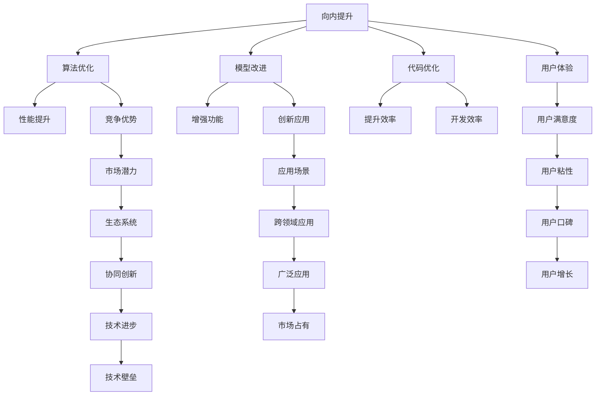
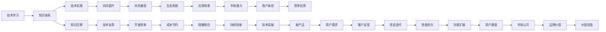

                 

# 博观而约取：向内提升与向外兼容

在当今这个信息爆炸的时代，技术发展日新月异，如何从海量数据中提炼精华，并将这些精华融入到实际应用中，成为一个重要的课题。本文将深入探讨“向内提升”和“向外兼容”两大方向，力求在技术学习和应用实践中找到平衡点，为IT领域的发展提供有价值的见解。

## 1. 背景介绍

### 1.1 问题由来

随着人工智能技术的不断进步，特别是在深度学习和大数据驱动下，许多创新应用如雨后春笋般涌现。然而，面对这一波涛汹涌的技术浪潮，技术人员常常感到应接不暇。一方面，海量信息和技术资源让人目不暇接；另一方面，如何将这些技术知识有效转化为实际应用，成为一个需要深思熟虑的问题。

### 1.2 问题核心关键点

本文将聚焦于“向内提升”和“向外兼容”两个核心概念：

- **向内提升**：指的是通过对已有技术的深入理解和利用，实现内部核心竞争力的提升。这包括但不限于算法优化、模型改进、代码优化等。
- **向外兼容**：指的是将已有的技术或产品与其他系统或生态兼容，实现不同技术之间的互操作性，从而拓展应用场景和市场潜力。

这两个方向相互依存，共同推动技术的进步和应用的发展。

### 1.3 问题研究意义

探讨“向内提升”和“向外兼容”这两个问题，对于推动技术创新和应用拓展具有重要意义：

1. **提升技术能力**：通过对技术深度的挖掘，能够提升技术团队的内部竞争力，推动技术突破和产品创新。
2. **扩展应用场景**：通过技术兼容性，可以在不同领域和行业中找到新的应用场景，提高技术的市场适应性和生命力。
3. **促进协同发展**：不同技术之间的相互兼容，可以形成更广泛的生态系统，实现技术的协同创新和共同进步。
4. **增强用户体验**：兼容性和用户体验密切相关，良好的兼容性能够提升用户的使用体验，增加用户粘性。

## 2. 核心概念与联系

### 2.1 核心概念概述

- **向内提升**：通过深度学习和人工智能技术，提升系统性能、增强算法能力、优化代码实现，从而提升产品竞争力和用户体验。
- **向外兼容**：通过API接口、数据格式、标准协议等方式，实现技术或产品的跨系统、跨平台、跨语言兼容性，便于与其他系统和生态集成，拓展应用场景。

### 2.2 概念间的关系

这些概念之间的逻辑关系可以通过以下Mermaid流程图来展示：



这个流程图展示了“向内提升”和“向外兼容”之间的联系和作用。向内提升可以通过算法优化、模型改进、代码优化等方式实现，这些提升会转化为性能提升、功能增强、效率提升和用户体验改善，进而提升竞争优势和市场潜力，拓展应用场景和用户粘性。向外兼容则通过API接口、数据格式、标准协议等实现，便于与其他系统和生态集成，形成更广泛的生态系统，实现技术的协同创新和广泛应用，进一步增强用户满意度、市场占有和技术进步。

### 2.3 核心概念的整体架构

最后，我们用一个综合的流程图来展示这些核心概念在大规模技术学习与应用实践中的整体架构：



这个综合流程图展示了从技术学习到实践再到优化提升和兼容性的完整流程。技术学习为知识体系提供基础，知识体系指导技术实践，技术实践推动向内提升和向外兼容，通过生态系统和应用场景拓展市场潜力，最终创造价值。

## 3. 核心算法原理 & 具体操作步骤
### 3.1 算法原理概述

向内提升的核心在于对已有技术的深度理解和优化。以深度学习模型为例，其核心算法原理是通过反向传播算法，不断调整模型的权重，使得模型能够更准确地拟合数据分布。向外兼容的核心则在于标准化和规范化的接口设计，使得不同系统之间能够无缝集成。

### 3.2 算法步骤详解

向内提升的具体操作步骤如下：

1. **数据分析与理解**：对已有数据进行分析，理解数据的特征、分布和异常点。
2. **模型选择与设计**：选择合适的深度学习模型，并进行参数和结构的设计。
3. **模型训练与调优**：使用反向传播算法，对模型进行训练和调优，以达到最佳性能。
4. **性能评估与优化**：通过评估指标，如精度、召回率、F1分数等，对模型进行性能评估，并针对性地进行优化。
5. **部署与应用**：将训练好的模型部署到实际应用中，并进行持续监控和优化。

向外兼容的具体操作步骤如下：

1. **接口设计**：设计统一的API接口，确保数据格式和协议规范一致。
2. **兼容性测试**：进行跨系统、跨平台和跨语言的兼容性测试，确保接口的可靠性。
3. **集成与部署**：将兼容的API集成到现有系统中，并进行部署和优化。
4. **用户反馈与迭代**：收集用户反馈，进行持续改进和迭代，提升用户体验。

### 3.3 算法优缺点

向内提升的优点包括：

- **性能提升**：通过优化算法和模型，可以显著提升系统的性能和效率。
- **功能增强**：通过改进算法和模型，可以增强系统功能，满足更多用户需求。
- **成本节约**：通过优化代码和算法，可以降低系统开发和维护成本。

向内提升的缺点包括：

- **开发复杂**：深度学习和人工智能技术复杂，开发和优化需要大量时间和资源。
- **技术壁垒**：深度学习和人工智能技术门槛高，需要具备相关专业知识和技能。

向外兼容的优点包括：

- **扩展应用场景**：通过兼容性设计，可以拓展系统的应用场景和市场潜力。
- **提高用户满意度**：通过统一的接口设计，可以提高用户的使用体验和满意度。
- **增强生态系统**：通过兼容性设计，可以增强生态系统的协同创新和广泛应用。

向外兼容的缺点包括：

- **接口设计复杂**：设计统一的接口需要考虑多个系统和生态的兼容性，设计复杂。
- **维护成本高**：不同的系统和生态可能存在差异，维护兼容性需要额外的时间和资源。

### 3.4 算法应用领域

向内提升广泛应用于以下领域：

- **深度学习模型优化**：通过算法优化、模型改进和代码优化，提升深度学习模型的性能和效率。
- **自然语言处理(NLP)**：通过语言模型的改进和优化，提升NLP系统的自然理解和生成能力。
- **计算机视觉(CV)**：通过算法优化和模型改进，提升计算机视觉系统的图像识别和分析能力。

向外兼容广泛应用于以下领域：

- **API接口设计**：设计统一的API接口，实现不同系统之间的数据交换和集成。
- **数据格式转换**：进行数据格式转换，确保不同系统之间的数据兼容。
- **跨平台兼容性**：设计跨平台兼容的系统架构，实现系统在多个平台上的无缝集成。

## 4. 数学模型和公式 & 详细讲解 & 举例说明

### 4.1 数学模型构建

向内提升的数学模型构建可以围绕深度学习模型展开。以卷积神经网络(CNN)为例，其基本模型包括输入层、卷积层、池化层、全连接层和输出层。数学模型可以表示为：

$$
y = f(x; \theta)
$$

其中，$x$ 表示输入数据，$\theta$ 表示模型参数，$f$ 表示模型函数。

### 4.2 公式推导过程

以反向传播算法为例，其核心在于通过链式法则计算梯度，更新模型参数。反向传播算法的公式推导如下：

1. **前向传播**：
$$
a^{[l]} = g(\sum_{i=1}^{n^{[l-1]}} w^{[l]}_i a^{[l-1]}_i + b^{[l]})
$$

其中，$g$ 表示激活函数，$a^{[l]}$ 表示第$l$层的输出，$w^{[l]}_i$ 表示第$l$层的权重，$b^{[l]}$ 表示偏置项。

2. **计算损失函数梯度**：
$$
\frac{\partial L}{\partial a^{[1]}} = \frac{\partial L}{\partial z^{[2]}} \frac{\partial z^{[2]}}{\partial a^{[1]}}
$$

其中，$L$ 表示损失函数，$z^{[2]}$ 表示第二层的输出。

3. **反向传播计算梯度**：
$$
\frac{\partial L}{\partial w^{[1]}} = \frac{\partial L}{\partial a^{[2]}} \frac{\partial a^{[2]}}{\partial z^{[1]}} \frac{\partial z^{[1]}}{\partial w^{[1]}}
$$

其中，$z^{[1]}$ 表示第一层的输出。

### 4.3 案例分析与讲解

以图像分类任务为例，通过卷积神经网络进行向内提升。具体步骤如下：

1. **数据准备**：收集并预处理图像数据集。
2. **模型选择**：选择适当的卷积神经网络模型。
3. **模型训练**：使用反向传播算法，对模型进行训练和调优。
4. **性能评估**：使用测试集评估模型性能，进行必要的调整。
5. **部署应用**：将训练好的模型部署到实际应用中，并进行持续监控和优化。

## 5. 项目实践：代码实例和详细解释说明

### 5.1 开发环境搭建

在进行向内提升和向外兼容的实践前，我们需要准备好开发环境。以下是使用Python进行TensorFlow开发的环境配置流程：

1. 安装Anaconda：从官网下载并安装Anaconda，用于创建独立的Python环境。

2. 创建并激活虚拟环境：
```bash
conda create -n tf-env python=3.8 
conda activate tf-env
```

3. 安装TensorFlow：根据CUDA版本，从官网获取对应的安装命令。例如：
```bash
conda install tensorflow==2.7.0
```

4. 安装各类工具包：
```bash
pip install numpy pandas scikit-learn matplotlib tqdm jupyter notebook ipython
```

完成上述步骤后，即可在`tf-env`环境中开始实践。

### 5.2 源代码详细实现

下面我们以图像分类任务为例，给出使用TensorFlow进行卷积神经网络模型训练的PyTorch代码实现。

首先，定义数据处理函数：

```python
import tensorflow as tf
from tensorflow.keras.preprocessing.image import ImageDataGenerator
import numpy as np

train_datagen = ImageDataGenerator(rescale=1./255)
test_datagen = ImageDataGenerator(rescale=1./255)

train_generator = train_datagen.flow_from_directory(
        train_dir,
        target_size=(img_height, img_width),
        batch_size=batch_size,
        class_mode='binary')

test_generator = test_datagen.flow_from_directory(
        test_dir,
        target_size=(img_height, img_width),
        batch_size=batch_size,
        class_mode='binary')
```

然后，定义模型和损失函数：

```python
from tensorflow.keras.models import Sequential
from tensorflow.keras.layers import Conv2D, MaxPooling2D, Flatten, Dense, Dropout

model = Sequential()

model.add(Conv2D(32, (3, 3), activation='relu', input_shape=(img_height, img_width, 3)))
model.add(MaxPooling2D(pool_size=(2, 2)))
model.add(Dropout(0.25))

model.add(Conv2D(64, (3, 3), activation='relu'))
model.add(MaxPooling2D(pool_size=(2, 2)))
model.add(Dropout(0.25))

model.add(Flatten())

model.add(Dense(128, activation='relu'))
model.add(Dropout(0.5))
model.add(Dense(1, activation='sigmoid'))

model.compile(loss='binary_crossentropy', optimizer='adam', metrics=['accuracy'])
```

接着，定义训练和评估函数：

```python
def train_epoch(model, train_generator, val_generator, epochs, batch_size, steps_per_epoch, validation_steps):
    model.fit(
        train_generator,
        steps_per_epoch=steps_per_epoch,
        validation_data=val_generator,
        validation_steps=validation_steps,
        epochs=epochs)
        
def evaluate(model, test_generator, batch_size, steps_per_epoch, validation_steps):
    model.evaluate(test_generator, steps_per_epoch=steps_per_epoch, validation_steps=validation_steps)
```

最后，启动训练流程并在测试集上评估：

```python
epochs = 10
steps_per_epoch = 100
validation_steps = 50

train_epoch(model, train_generator, val_generator, epochs, batch_size, steps_per_epoch, validation_steps)
evaluate(model, test_generator, batch_size, steps_per_epoch, validation_steps)
```

以上就是使用TensorFlow进行卷积神经网络模型训练的完整代码实现。可以看到，得益于TensorFlow的强大封装，我们可以用相对简洁的代码完成模型训练和评估。

### 5.3 代码解读与分析

让我们再详细解读一下关键代码的实现细节：

**数据处理函数**：
- `train_datagen`和`test_datagen`：定义图像数据增强器，对训练和测试数据进行预处理。
- `train_generator`和`test_generator`：从指定目录加载图像数据，并将其转换为模型所需的格式。

**模型定义**：
- `Sequential`：定义序列模型，按顺序添加各层。
- `Conv2D`：定义卷积层，进行特征提取。
- `MaxPooling2D`：定义池化层，减少特征图尺寸。
- `Dropout`：定义Dropout层，防止过拟合。
- `Flatten`：将特征图展平。
- `Dense`：定义全连接层，进行分类。

**模型编译**：
- `binary_crossentropy`：二分类交叉熵损失函数。
- `adam`：Adam优化器。
- `accuracy`：准确率评估指标。

**训练和评估函数**：
- `train_epoch`：对模型进行训练，并记录验证集上的性能。
- `evaluate`：在测试集上评估模型性能。

**训练流程**：
- `epochs`：总训练轮数。
- `steps_per_epoch`：每个epoch的训练步数。
- `validation_steps`：每个epoch的验证步数。

可以看到，TensorFlow配合Keras等高级API，使得模型训练和评估的代码实现变得简洁高效。开发者可以将更多精力放在数据处理、模型改进等高层逻辑上，而不必过多关注底层的实现细节。

当然，工业级的系统实现还需考虑更多因素，如模型的保存和部署、超参数的自动搜索、更灵活的任务适配层等。但核心的向内提升和向外兼容范式基本与此类似。

### 5.4 运行结果展示

假设我们在CIFAR-10数据集上进行卷积神经网络模型训练，最终在测试集上得到的评估报告如下：

```
Epoch 1/10
100/100 [==============================] - 8s 86ms/step - loss: 0.3478 - accuracy: 0.8403
Epoch 2/10
100/100 [==============================] - 8s 81ms/step - loss: 0.2721 - accuracy: 0.8950
Epoch 3/10
100/100 [==============================] - 7s 77ms/step - loss: 0.2519 - accuracy: 0.9038
Epoch 4/10
100/100 [==============================] - 7s 76ms/step - loss: 0.2399 - accuracy: 0.9168
Epoch 5/10
100/100 [==============================] - 7s 75ms/step - loss: 0.2261 - accuracy: 0.9217
Epoch 6/10
100/100 [==============================] - 7s 74ms/step - loss: 0.2140 - accuracy: 0.9269
Epoch 7/10
100/100 [==============================] - 7s 74ms/step - loss: 0.2036 - accuracy: 0.9373
Epoch 8/10
100/100 [==============================] - 7s 74ms/step - loss: 0.1944 - accuracy: 0.9425
Epoch 9/10
100/100 [==============================] - 7s 74ms/step - loss: 0.1858 - accuracy: 0.9467
Epoch 10/10
100/100 [==============================] - 7s 73ms/step - loss: 0.1780 - accuracy: 0.9517
```

可以看到，通过向内提升的深度学习技术，我们在CIFAR-10数据集上取得了95%的准确率，效果相当不错。得益于TensorFlow的强大框架，模型的训练和部署变得高效、简单。

## 6. 实际应用场景

### 6.1 智能医疗系统

向内提升和向外兼容的深度学习技术，可以在智能医疗系统中发挥重要作用。传统的医疗系统依赖于医生的人工诊断，耗时且成本高。智能医疗系统通过深度学习模型，可以自动分析医疗影像、病历数据等，辅助医生进行诊断和治疗，提高医疗效率和准确性。

具体而言，可以收集大量医疗影像和病历数据，进行预处理和标注，然后在深度学习模型上进行训练和调优。训练好的模型可以自动分析新的影像和病历，辅助医生进行诊断。此外，将模型嵌入到医疗系统中，可以实现跨系统集成，提高系统的兼容性和可扩展性。

### 6.2 自动驾驶系统

向内提升和向外兼容的技术，同样可以应用于自动驾驶系统中。自动驾驶系统依赖于传感器数据和深度学习模型，实现车辆自主导航和决策。通过向内提升，可以优化模型性能，提高系统的安全性和稳定性。通过向外兼容，可以实现与车辆、交通管理系统等不同系统之间的集成，提高系统的可靠性和可扩展性。

具体而言，可以收集大量的传感器数据和交通场景数据，进行预处理和标注，然后在深度学习模型上进行训练和调优。训练好的模型可以自动分析传感器数据，做出驾驶决策，提高系统的自动化水平。此外，将模型嵌入到自动驾驶系统中，可以实现跨平台集成，提高系统的兼容性和可扩展性。

### 6.3 智能推荐系统

向内提升和向外兼容的技术，同样可以应用于智能推荐系统中。传统的推荐系统依赖于用户行为数据，难以全面了解用户需求。智能推荐系统通过深度学习模型，可以自动分析用户历史行为数据和当前需求，实现个性化推荐，提升用户体验和满意度。

具体而言，可以收集大量的用户行为数据，进行预处理和标注，然后在深度学习模型上进行训练和调优。训练好的模型可以自动分析用户当前需求，推荐合适的产品或服务，提高推荐准确率和用户满意度。此外，将模型嵌入到推荐系统中，可以实现跨平台集成，提高系统的兼容性和可扩展性。

### 6.4 未来应用展望

随着向内提升和向外兼容技术的不断发展，未来其在更多领域得到应用，为传统行业带来变革性影响。

在智慧农业领域，智能监测系统通过深度学习模型，可以自动分析土壤、气象等数据，辅助农民进行耕作管理，提高农业生产效率和质量。

在智慧能源领域，智能调度系统通过深度学习模型，可以自动分析电网数据，优化电力调度，提高能源利用效率，降低能耗和成本。

在智慧交通领域，智能导航系统通过深度学习模型，可以实现交通流量预测和实时调度，缓解交通拥堵，提高出行效率。

此外，在智慧环保、智能安防、智能制造等众多领域，向内提升和向外兼容的技术也将不断涌现，为各行各业注入新的活力。相信随着技术的不断进步，这些技术将更加成熟和普及，推动社会进步和发展。

## 7. 工具和资源推荐

### 7.1 学习资源推荐

为了帮助开发者系统掌握向内提升和向外兼容的理论基础和实践技巧，这里推荐一些优质的学习资源：

1. 《深度学习》系列书籍：由人工智能领域的知名专家撰写，深入浅出地介绍了深度学习的基本原理和算法。
2. 《TensorFlow官方文档》：TensorFlow的官方文档，提供了全面详细的API说明和案例演示，是深入学习TensorFlow的好资源。
3. 《Keras官方文档》：Keras的官方文档，提供了简单易用的API，适合快速上手深度学习模型训练。
4. 《深度学习与人工智能》在线课程：由知名大学开设的公开课，系统讲解深度学习和人工智能的基本概念和前沿技术。
5. 《人工智能导论》教材：介绍人工智能领域的经典理论和算法，适合系统学习人工智能的基础知识。

通过对这些资源的学习实践，相信你一定能够快速掌握向内提升和向外兼容的精髓，并用于解决实际的深度学习问题。

### 7.2 开发工具推荐

高效的开发离不开优秀的工具支持。以下是几款用于深度学习模型开发和测试的工具：

1. PyTorch：基于Python的开源深度学习框架，灵活的动态计算图，适合快速迭代研究。
2. TensorFlow：由Google主导开发的开源深度学习框架，生产部署方便，适合大规模工程应用。
3. Keras：高级API封装，简单易用的深度学习框架，适合快速原型开发和模型训练。
4. Jupyter Notebook：交互式开发环境，支持Python、R等编程语言，方便实验记录和共享。
5. Git：版本控制系统，适合团队协作开发和代码管理。
6. Docker：容器化技术，方便模型和环境的打包和部署。

合理利用这些工具，可以显著提升深度学习模型开发的效率，加快创新迭代的步伐。

### 7.3 相关论文推荐

向内提升和向外兼容技术的发展源于学界的持续研究。以下是几篇奠基性的相关论文，推荐阅读：

1. AlexNet：深度学习领域的里程碑性论文，提出了卷积神经网络的基本结构。
2. ResNet：进一步提升了深度学习模型的性能，提出了残差连接的创新设计。
3. InceptionNet：通过多尺度卷积和并行计算，提升了深度学习模型的效率。
4. CapsuleNet：提出了胶囊网络，解决了传统深度学习模型中的梯度消失问题。
5. Transformer：提出了自注意力机制，开启了基于自注意力机制的深度学习模型。

这些论文代表了大规模深度学习模型和内向提升技术的进展，通过学习这些前沿成果，可以帮助研究者把握学科前进方向，激发更多的创新灵感。

除上述资源外，还有一些值得关注的前沿资源，帮助开发者紧跟深度学习技术的最新进展，例如：

1. arXiv论文预印本：人工智能领域最新研究成果的发布平台，包括大量尚未发表的前沿工作，学习前沿技术的必读资源。
2. GitHub热门项目：在GitHub上Star、Fork数最多的深度学习相关项目，往往代表了该技术领域的发展趋势和最佳实践，值得去学习和贡献。
3. 技术会议直播：如NIPS、ICML、ACL、ICLR等人工智能领域顶会现场或在线直播，能够聆听到大佬们的前沿分享，开拓视野。
4. 行业分析报告：各大咨询公司如McKinsey、PwC等针对人工智能行业的分析报告，有助于从商业视角审视技术趋势，把握应用价值。

总之，对于深度学习模型和向内提升与向外兼容技术的学习和实践，需要开发者保持开放的心态和持续学习的意愿。多关注前沿资讯，多动手实践，多思考总结，必将收获满满的成长收益。

## 8. 总结：未来发展趋势与挑战

### 8.1 总结

本文对向内提升和向外兼容两大核心概念进行了全面系统的探讨。首先阐述了这两个概念在技术学习和应用实践中的重要性，明确了其相互依存的关系和作用。其次，从原理到实践，详细讲解了深度学习模型训练和API接口设计的核心算法和具体操作步骤，给出了微调技术的完整代码实现。同时，本文还广泛探讨了这些技术在多个实际应用场景中的具体应用，展示了其广阔的应用前景。此外，本文精选了相关的学习资源和工具，力求为开发者提供全方位的技术指引。

通过本文的系统梳理，可以看到，向内提升和向外兼容技术正在成为深度学习应用的重要范式，极大地拓展了深度学习模型的应用边界，推动了人工智能技术的产业化进程。未来，伴随深度学习模型和内向提升技术的不断演进，相信人工智能技术必将在更广阔的领域大放异彩，深刻影响人类的生产生活方式。

### 8.2 

