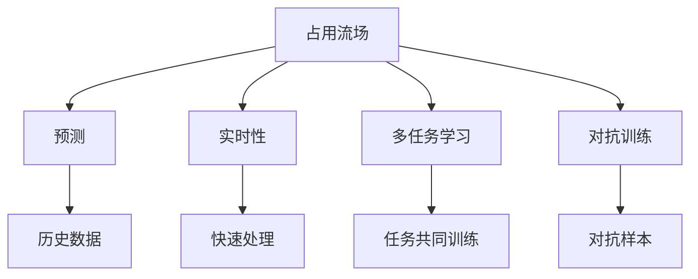
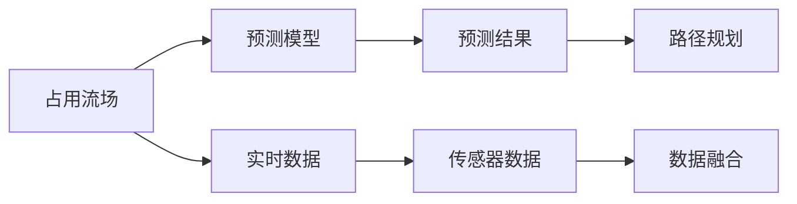
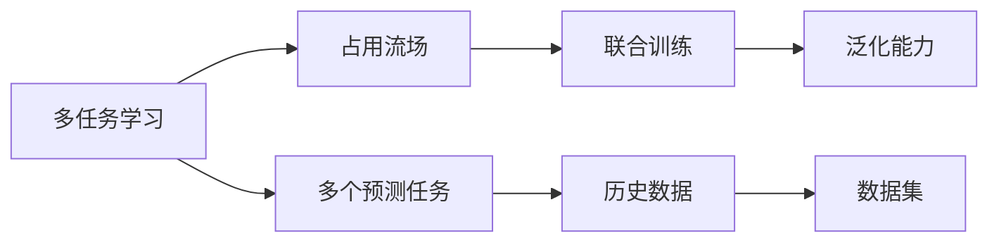
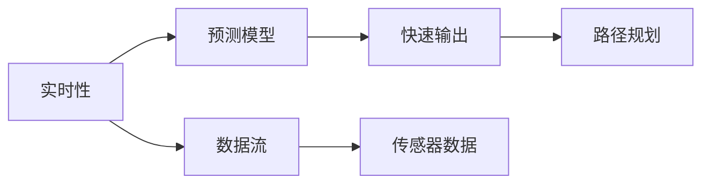
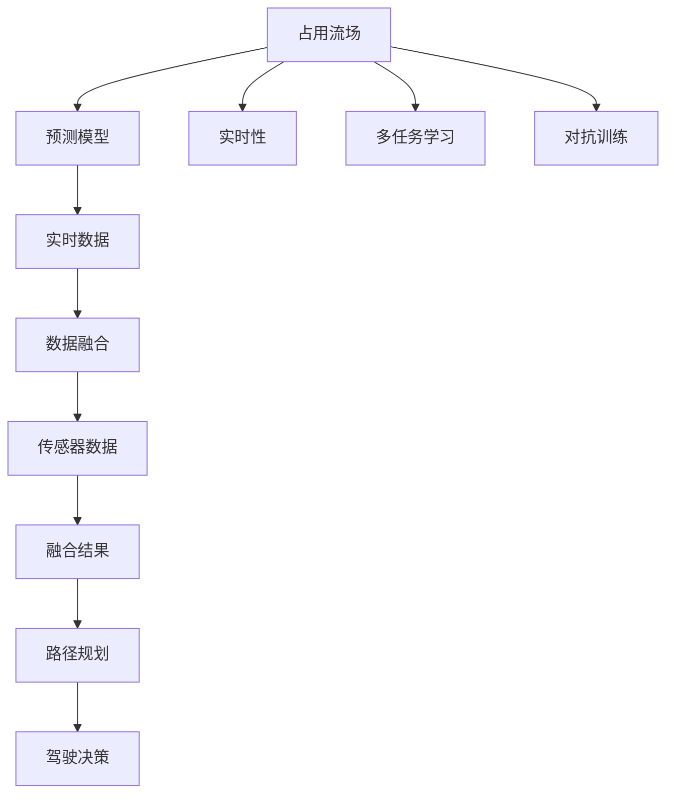

                 

# 占用流场开启自动驾驶环境预测新时代的技术革新

## 1. 背景介绍

随着自动驾驶技术的发展，如何高效、准确地预测动态环境中的占用流场，成为了自动驾驶系统性能提升的关键。传统的基于历史数据的预测方法，难以适应复杂多变的道路交通环境，且计算复杂度高，难以实时应用。为了解决这一问题，本文将介绍一种新的技术——占用流场预测（Occupancy Flow Prediction, OFP），旨在提升自动驾驶环境预测的准确性和实时性。

### 1.1 问题由来
现代城市交通状况日趋复杂，车辆、行人和其他交通元素的动态变化对自动驾驶提出了更高的要求。传统的基于历史数据的预测方法，如GPS浮标监测、交通摄像头监测等，虽然可以获取较为精确的历史数据，但对于动态变化的预测能力较弱。为了适应未来交通环境，需要一种能够实时预测占用流场的新方法。

### 1.2 问题核心关键点
占用流场预测（OFP）的核心思想是通过对当前交通环境实时数据的学习，预测未来一段时间内各交通元素的占用情况。OFP的创新点在于：
- **实时性**：能够快速处理并输出预测结果，适应动态变化。
- **准确性**：利用机器学习算法，从大量历史数据中提取有用的信息，预测未来交通状况。
- **普适性**：适用于各种交通场景，无需依赖特定的交通设施。
- **高效率**：算法简单高效，计算复杂度低，便于大规模部署。

### 1.3 问题研究意义
OFP技术对于提升自动驾驶系统的性能具有重要意义：
- **安全保障**：通过预测未来交通状况，提前采取避障措施，减少交通事故发生。
- **效率提升**：优化路径规划，减少交通拥堵，提高通行效率。
- **节能减排**：合理调度交通流量，降低能耗和排放。
- **用户体验**：提升驾驶体验，使驾驶过程更加舒适、平稳。

## 2. 核心概念与联系

### 2.1 核心概念概述

为更好地理解OFP技术的原理和应用，本节将介绍几个关键概念：

- **占用流场（Occupancy Flow）**：指交通网络中每个路段上车辆、行人和其他交通元素的实时占用情况，通常用概率分布表示。
- **预测（Prediction）**：通过算法模型学习历史数据，预测未来占用流场的概率分布。
- **实时性（Real-time）**：在交通环境动态变化时，能够快速处理并输出预测结果。
- **多任务学习（Multi-task Learning）**：将多个相关预测任务共同训练，提升模型泛化能力。
- **对抗训练（Adversarial Training）**：通过引入对抗样本，提高模型鲁棒性和泛化能力。

这些核心概念之间的逻辑关系可以通过以下Mermaid流程图来展示：

这个流程图展示了大语言模型微调过程中各个核心概念之间的关系：

1. 占用流场作为预测模型的输入。
2. 通过预测模型学习历史数据，预测未来占用流场。
3. 实时性要求模型能够快速处理并输出预测结果。
4. 多任务学习通过同时训练多个相关预测任务，提升模型泛化能力。
5. 对抗训练通过引入对抗样本，提高模型鲁棒性和泛化能力。

### 2.2 概念间的关系

这些核心概念之间存在着紧密的联系，形成了占用流场预测的完整生态系统。下面我们通过几个Mermaid流程图来展示这些概念之间的关系。

#### 2.2.1 占用流场预测的流程

这个流程图展示了占用流场预测的完整流程：

1. 占用流场通过传感器数据实时获取。
2. 实时数据经过数据融合，输入到预测模型中。
3. 预测模型学习历史数据，输出未来占用流场的预测结果。
4. 路径规划系统根据预测结果进行驾驶决策。

#### 2.2.2 多任务学习和对抗训练的关系

这个流程图展示了多任务学习和对抗训练在占用流场预测中的应用：

1. 多任务学习通过联合训练多个相关预测任务，提升模型的泛化能力。
2. 对抗训练通过引入对抗样本，提高模型鲁棒性。

#### 2.2.3 实时性与预测模型的关系

这个流程图展示了实时性在占用流场预测中的作用：

1. 实时性要求预测模型能够快速处理并输出预测结果。
2. 传感器数据不断输入，预测模型实时更新预测结果。
3. 路径规划系统根据最新预测结果进行驾驶决策。

### 2.3 核心概念的整体架构

最后，我们用一个综合的流程图来展示这些核心概念在占用流场预测中的整体架构：

这个综合流程图展示了从传感器数据到路径规划的完整预测流程：

1. 占用流场通过传感器数据实时获取。
2. 实时数据经过数据融合，输入到预测模型中。
3. 预测模型学习历史数据，输出未来占用流场的预测结果。
4. 路径规划系统根据预测结果进行驾驶决策。
5. 实时性要求模型能够快速处理并输出预测结果。
6. 多任务学习通过联合训练多个相关预测任务，提升模型泛化能力。
7. 对抗训练通过引入对抗样本，提高模型鲁棒性和泛化能力。

## 3. 核心算法原理 & 具体操作步骤
### 3.1 算法原理概述

占用流场预测（OFP）通过深度学习模型学习历史数据，预测未来占用流场的概率分布。其核心算法包括：

- **历史数据处理**：将历史数据进行清洗、标注，生成训练集。
- **预测模型训练**：通过多层神经网络模型学习历史数据，预测未来占用流场。
- **实时性优化**：采用高效的数据处理和模型推理方法，确保模型能够实时输出预测结果。
- **多任务学习和对抗训练**：通过联合训练多个相关预测任务和引入对抗样本，提升模型泛化能力和鲁棒性。

### 3.2 算法步骤详解

#### 3.2.1 历史数据处理

1. **数据采集**：通过传感器数据、摄像头数据、GPS数据等采集交通环境实时数据。
2. **数据清洗**：对采集数据进行去噪、归一化处理，去除无效数据。
3. **数据标注**：将清洗后的数据标注为占用流场（即车辆、行人的概率分布）。

#### 3.2.2 预测模型训练

1. **模型选择**：选择适合的深度学习模型，如卷积神经网络（CNN）、循环神经网络（RNN）或变分自编码器（VAE）。
2. **模型训练**：使用历史数据训练预测模型，最小化预测误差。
3. **模型调优**：通过交叉验证等方法调整模型超参数，提高预测准确性。

#### 3.2.3 实时性优化

1. **并行计算**：采用并行计算方法，如GPU、TPU，加速模型推理。
2. **数据流优化**：优化数据流处理，减少数据传输和计算时间。
3. **模型压缩**：压缩模型参数，减小计算复杂度。

#### 3.2.4 多任务学习和对抗训练

1. **多任务学习**：将多个相关预测任务共同训练，如占用流场预测、车速预测、路径规划等，提升模型泛化能力。
2. **对抗训练**：通过引入对抗样本，如噪声干扰、异常行为等，提高模型鲁棒性。

### 3.3 算法优缺点

#### 3.3.1 优点

1. **实时性**：能够快速处理并输出预测结果，适应动态变化。
2. **准确性**：利用机器学习算法，从大量历史数据中提取有用的信息，预测未来交通状况。
3. **普适性**：适用于各种交通场景，无需依赖特定的交通设施。
4. **高效率**：算法简单高效，计算复杂度低，便于大规模部署。

#### 3.3.2 缺点

1. **数据依赖**：对历史数据的质量和数量要求较高，数据不足会影响预测准确性。
2. **模型复杂**：深度学习模型训练复杂，需要大量计算资源和时间。
3. **模型解释性差**：黑盒模型难以解释其内部工作机制和决策逻辑。

### 3.4 算法应用领域

OFP技术在自动驾驶领域具有广泛的应用前景，可以用于：

- **路径规划**：通过预测未来占用流场，优化路径规划，避免交通拥堵。
- **避障决策**：实时预测动态环境中的占用流场，提前采取避障措施，减少交通事故。
- **交通流量控制**：通过预测占用流场，优化交通流量，提高通行效率。
- **智能信号控制**：根据预测结果调整信号灯周期，提高道路通行能力。
- **安全监控**：实时监测交通动态，预警异常行为，保障交通安全。

## 4. 数学模型和公式 & 详细讲解 & 举例说明

### 4.1 数学模型构建

#### 4.1.1 占用流场概率分布

假设占用流场为二维随机变量 $X=[x,y]$，其中 $x$ 表示车辆在路段上的概率分布，$y$ 表示车辆速度的概率分布。占用流场 $X$ 的概率分布 $P(X)$ 可以通过历史数据训练得到。

### 4.2 公式推导过程

#### 4.2.1 多任务学习公式

假设有 $N$ 个相关预测任务，$N$ 个预测模型的损失函数为 $L_i$，则多任务学习的总损失函数为：

$$
L_{\text{total}} = \sum_{i=1}^{N} \alpha_i L_i
$$

其中 $\alpha_i$ 为权重，调整每个任务的贡献。

#### 4.2.2 对抗训练公式

假设模型的预测结果为 $\hat{Y}$，对抗样本为 $Y$，则对抗训练的损失函数为：

$$
L_{\text{adv}} = \sum_{i=1}^{N} \beta_i L_i + \lambda \|Y - \hat{Y}\|
$$

其中 $\beta_i$ 为权重，调整对抗样本的贡献，$\lambda$ 为正则化系数，$\|Y - \hat{Y}\|$ 表示对抗样本与预测结果的差异。

### 4.3 案例分析与讲解

#### 4.3.1 示例1：占用流场预测

假设有一个路段 $A$，采集到当前占用流场为 $X_A=[x_A,y_A]$。通过历史数据训练得到占用流场模型 $P(X)$，预测未来 $T$ 秒的占用流场为 $X_A^t=[x_A^t,y_A^t]$。

采用卷积神经网络（CNN）模型，定义特征提取层和分类层，训练得到占用流场预测模型。通过传感器数据实时获取占用流场 $X_A$，输入到模型中，得到预测结果 $X_A^t$。

#### 4.3.2 示例2：路径规划

假设自动驾驶车辆在路段 $A$ 上行驶，通过占用流场预测模型 $P(X)$ 预测未来 $T$ 秒的占用流场为 $X_A^t=[x_A^t,y_A^t]$。根据预测结果，优化路径规划，选择最佳行驶路线。

## 5. 项目实践：代码实例和详细解释说明

### 5.1 开发环境搭建

在进行占用流场预测的开发实践前，我们需要准备好开发环境。以下是使用Python进行TensorFlow开发的环

