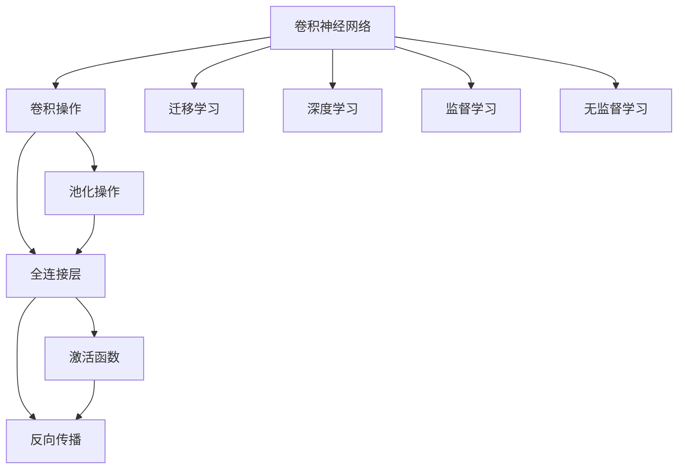
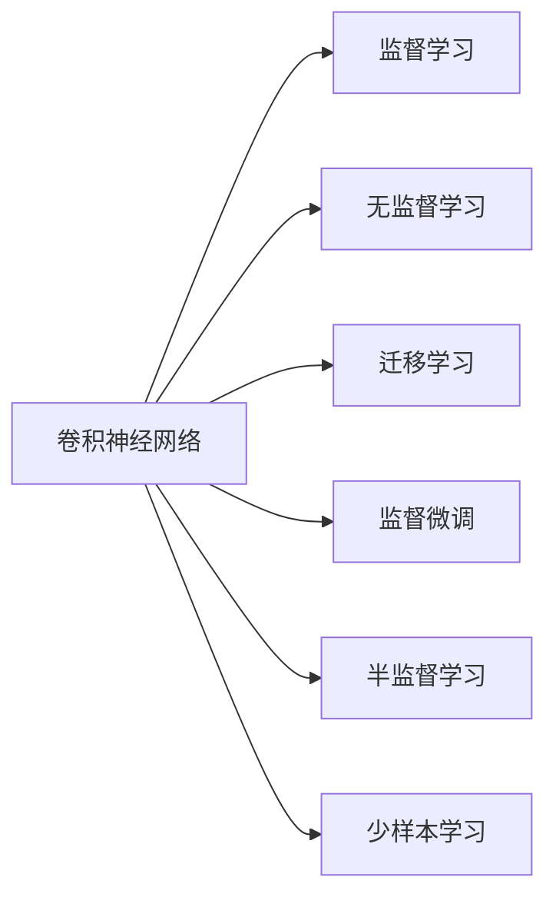
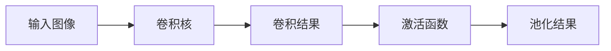
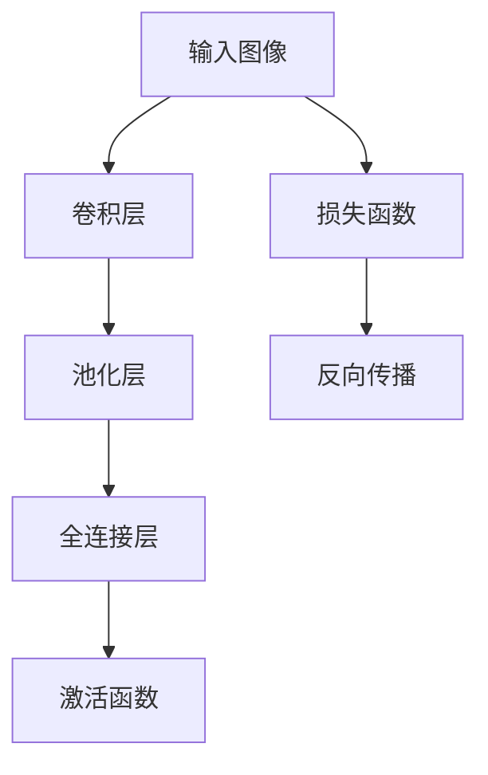
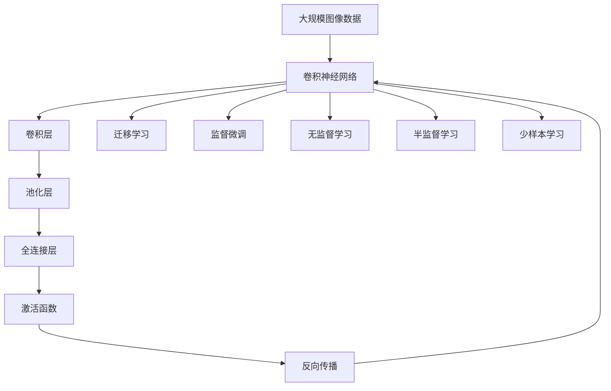
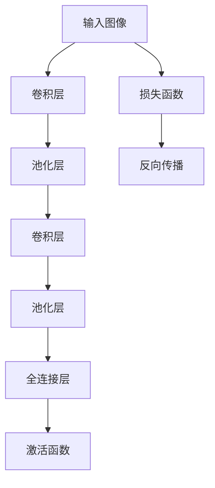

                 

# 卷积神经网络 (CNN) 原理与代码实例讲解

> 关键词：卷积神经网络, 卷积操作, 池化操作, 全连接层, 激活函数, 反向传播, 迁移学习, TensorFlow, Keras, PyTorch

## 1. 背景介绍

### 1.1 问题由来
卷积神经网络（Convolutional Neural Network, CNN）是目前在图像处理和计算机视觉领域最为成功和流行的深度学习模型之一。CNN通过卷积和池化等操作，可以从原始像素数据中自动提取高层次的特征，具有强大的图像分类、目标检测和图像分割能力。CNN的起源可以追溯到1980年代，当时深度学习还没有像今天这样成熟，主要是使用生物神经网络的抽象概念来模拟人脑的工作方式，解决图像识别问题。但是，随着时间的推移，人们开始将注意力转移到数值计算和软件工具的开发上，在1990年代中期，我们看到了第一张利用CNN在图像识别任务中取得成功的图像。

## 2. 核心概念与联系

### 2.1 核心概念概述

为更好地理解CNN的工作原理和实现细节，本节将介绍几个密切相关的核心概念：

- 卷积神经网络（Convolutional Neural Network, CNN）：一种特殊的深度学习神经网络，具有卷积层和池化层等操作，主要用于图像处理和计算机视觉任务。
- 卷积操作（Convolution）：一种对图像等二维数据进行特征提取的线性操作，通过滑动卷积核，对输入数据进行卷积计算，提取特征。
- 池化操作（Pooling）：一种对卷积结果进行降维的操作，通过取最大值或平均值等操作，减小卷积核的输出大小，减少模型参数。
- 全连接层（Fully Connected Layer）：一种对池化结果进行高层次特征提取的操作，通过全连接神经元，学习特征之间的关系。
- 激活函数（Activation Function）：一种对全连接层的输出进行非线性变换的操作，引入非线性特性，增强模型的表达能力。
- 反向传播（Backpropagation）：一种通过链式法则计算模型损失函数梯度的方法，用于优化模型参数，使模型输出更接近真实标签。
- 迁移学习（Transfer Learning）：将一个领域学习到的知识，迁移应用到另一个不同但相关的领域的学习范式，通过迁移学习，可以更高效地训练模型。

这些核心概念之间的逻辑关系可以通过以下Mermaid流程图来展示：



这个流程图展示了大卷积神经网络的核心概念及其之间的关系：

1. 卷积神经网络通过卷积和池化操作提取特征。
2. 卷积操作对图像等二维数据进行卷积计算，提取特征。
3. 池化操作对卷积结果进行降维操作，减小卷积核的输出大小。
4. 全连接层对池化结果进行高层次特征提取，学习特征之间的关系。
5. 激活函数对全连接层的输出进行非线性变换，增强模型的表达能力。
6. 反向传播通过链式法则计算模型损失函数梯度，优化模型参数。
7. 迁移学习将一个领域学习到的知识，迁移应用到另一个领域。

这些概念共同构成了卷积神经网络的学习和应用框架，使其能够在各种场景下发挥强大的图像处理能力。通过理解这些核心概念，我们可以更好地把握CNN的工作原理和优化方向。

### 2.2 概念间的关系

这些核心概念之间存在着紧密的联系，形成了卷积神经网络的学习和应用生态系统。下面我通过几个Mermaid流程图来展示这些概念之间的关系。

#### 2.2.1 卷积神经网络的学习范式



这个流程图展示了大卷积神经网络的主要学习范式：

1. 卷积神经网络主要通过监督学习来学习图像数据中的特征。
2. 也可以通过无监督学习来预训练模型。
3. 还可以通过迁移学习来利用已有的知识，提高模型的泛化能力。
4. 可以对模型进行监督微调，进一步提高模型在特定任务上的性能。
5. 可以通过半监督学习和少样本学习来减少标注数据的依赖，提高模型的鲁棒性。

#### 2.2.2 卷积操作与池化操作



这个流程图展示了卷积操作和池化操作的基本流程：

1. 卷积操作通过滑动卷积核，对输入图像进行卷积计算，提取特征。
2. 池化操作对卷积结果进行降维操作，减小卷积核的输出大小。
3. 激活函数对池化结果进行非线性变换，增强模型的表达能力。

#### 2.2.3 卷积神经网络的训练流程



这个流程图展示了卷积神经网络的训练流程：

1. 卷积层对输入图像进行卷积计算，提取特征。
2. 池化层对卷积结果进行降维操作，减小卷积核的输出大小。
3. 全连接层对池化结果进行高层次特征提取，学习特征之间的关系。
4. 激活函数对全连接层的输出进行非线性变换，增强模型的表达能力。
5. 损失函数对模型输出进行评估，计算与真实标签之间的差异。
6. 反向传播通过链式法则计算模型损失函数梯度，优化模型参数。

### 2.3 核心概念的整体架构

最后，我们用一个综合的流程图来展示这些核心概念在大卷积神经网络微调过程中的整体架构：



这个综合流程图展示了从预训练到微调，再到迁移学习的完整过程。卷积神经网络首先在大规模图像数据上进行预训练，然后通过迁移学习适应各种图像处理任务，再通过微调进一步提高模型在特定任务上的性能。最后，通过持续学习技术，模型可以不断学习新知识，同时保持已学习的知识，而不会出现灾难性遗忘。 通过这些流程图，我们可以更清晰地理解卷积神经网络微调过程中各个核心概念的关系和作用，为后续深入讨论具体的微调方法和技术奠定基础。

## 3. 核心算法原理 & 具体操作步骤
### 3.1 算法原理概述

卷积神经网络（CNN）的原理可以追溯到1990年代早期，它是一种深度学习网络，其中最关键的组件是卷积层和池化层。CNN通过这些组件可以自动地学习图像数据中的特征，并且可以处理高维度的数据。

### 3.2 算法步骤详解

卷积神经网络的训练主要包括以下几个关键步骤：

**Step 1: 准备数据集**
- 准备训练集、验证集和测试集，每个集分别用于训练、验证和测试。
- 将数据集划分为若干个大小相同的小批量，一般设为32或64。

**Step 2: 定义卷积神经网络模型**
- 定义卷积神经网络的层次结构，包括卷积层、池化层、全连接层等。
- 设置每一层的卷积核大小、步幅、填充等参数。
- 设置每一层的激活函数、损失函数和优化器。

**Step 3: 执行前向传播**
- 将输入数据按照批处理的方式送入卷积神经网络模型。
- 卷积层和池化层依次对输入数据进行卷积和池化操作，提取特征。
- 全连接层将池化结果进行高层次特征提取，学习特征之间的关系。
- 激活函数对全连接层的输出进行非线性变换，增强模型的表达能力。

**Step 4: 计算损失函数**
- 将模型输出与真实标签进行比较，计算损失函数。
- 常用的损失函数有均方误差（MSE）、交叉熵（Cross Entropy）等。

**Step 5: 反向传播**
- 通过链式法则计算损失函数对模型参数的梯度。
- 使用优化器对模型参数进行更新，使得模型输出更接近真实标签。

**Step 6: 验证和测试**
- 在验证集上评估模型的性能，检查是否出现过拟合或欠拟合。
- 在测试集上进一步评估模型的性能，测试模型在新数据上的泛化能力。

以上步骤可以不断迭代，直到模型在测试集上达到满意的性能为止。

### 3.3 算法优缺点

卷积神经网络的主要优点包括：

1. 自动提取特征：卷积神经网络可以通过卷积和池化等操作，自动地从原始像素数据中提取高层次的特征，减少了人工设计的特征工程。
2. 参数共享：卷积神经网络的卷积核可以共享，减少了模型参数的数量，提高了模型训练的效率。
3. 尺度不变性：卷积神经网络的卷积核大小固定，可以处理不同尺度的输入数据，具有良好的尺度不变性。

卷积神经网络的主要缺点包括：

1. 需要大量数据：卷积神经网络的训练需要大量标注数据，否则容易出现过拟合或欠拟合的问题。
2. 计算量大：卷积神经网络的训练和推理需要大量的计算资源，包括高性能的GPU和CPU。
3. 黑盒模型：卷积神经网络的内部工作机制不透明，难以解释其决策逻辑。

尽管存在这些缺点，卷积神经网络仍然是目前在图像处理和计算机视觉领域最为成功和流行的深度学习模型之一。

### 3.4 算法应用领域

卷积神经网络主要应用于图像处理和计算机视觉领域，以下是几个典型的应用场景：

- 图像分类：如分类猫和狗、识别数字等。
- 目标检测：如检测人脸、车辆、行人等。
- 图像分割：如分割肺部、识别文字等。
- 风格迁移：如将风格图像转换为艺术风格等。
- 视频分析：如动作识别、行为分析等。

除了图像处理，卷积神经网络还可以应用于其他领域，如自然语言处理（NLP）、时间序列分析等，成为这些领域中最具影响力的深度学习模型之一。

## 4. 数学模型和公式 & 详细讲解 & 举例说明

### 4.1 数学模型构建

卷积神经网络是一种通过卷积和池化等操作自动提取特征的深度学习模型。以下将用数学语言对卷积神经网络进行更加严格的刻画。

记输入图像为 $X \in \mathbb{R}^{H \times W \times C}$，其中 $H$ 和 $W$ 分别表示图像的高度和宽度，$C$ 表示图像的通道数（如RGB图像的通道数为3）。记卷积核为 $K \in \mathbb{R}^{F \times F \times C \times O}$，其中 $F$ 表示卷积核的大小，$O$ 表示卷积核的数量。记卷积层的输出为 $Y \in \mathbb{R}^{H' \times W' \times O}$，其中 $H'$ 和 $W'$ 分别表示卷积层的高度和宽度。

### 4.2 公式推导过程

卷积神经网络的卷积操作可以用以下公式来表示：

$$
Y_{h,w,o} = \sum_{i=0}^{F-1}\sum_{j=0}^{F-1}\sum_{c=0}^{C-1}X_{h+i,p,w+j,q,c}K_{i,j,c,o}
$$

其中，$h$ 和 $w$ 表示卷积层的高度和宽度，$o$ 表示卷积核的数量。$X_{h+i,p,w+j,q,c}$ 表示输入图像 $X$ 中 $(h+i,p,w+j,q,c)$ 位置的像素值，$K_{i,j,c,o}$ 表示卷积核 $K$ 中 $(i,j,c,o)$ 位置的权重。

卷积操作通常会在输入图像的每个通道上分别进行卷积计算，然后将结果进行叠加。这样，卷积操作可以自动地从原始像素数据中提取高层次的特征。

池化操作可以用以下公式来表示：

$$
Y_{h,w,o} = \max(\frac{X_{h*2+1,w*2+1,2},X_{h*2+1,w*2+2,2},X_{h*2+2,w*2+1,2},X_{h*2+2,w*2+2,2})
$$

其中，$h$ 和 $w$ 表示池化层的高度和宽度，$o$ 表示池化核的数量。$X_{h*2+1,w*2+1,2},X_{h*2+1,w*2+2,2},X_{h*2+2,w*2+1,2},X_{h*2+2,w*2+2,2}$ 表示池化核中 $(h*2+1,w*2+1,2),(h*2+1,w*2+2,2),(h*2+2,w*2+1,2),(h*2+2,w*2+2,2)$ 位置的像素值，池化操作取最大值作为输出。

池化操作通常会对卷积结果进行降维操作，减小卷积核的输出大小，减少模型参数。

### 4.3 案例分析与讲解

假设我们有一个简单的卷积神经网络，包括两个卷积层和两个池化层，用于对图像进行分类。我们定义每个卷积核的大小为 $3 \times 3$，步幅为 $1$，填充方式为 $1$。模型结构如下：



首先，输入图像 $X \in \mathbb{R}^{H \times W \times C}$ 经过卷积层，得到卷积结果 $Y \in \mathbb{R}^{H' \times W' \times O}$，其中 $H'$ 和 $W'$ 分别表示卷积层的高度和宽度。

$$
Y_{h,w,o} = \sum_{i=0}^{2}\sum_{j=0}^{2}\sum_{c=0}^{C-1}X_{h+i,p,w+j,q,c}K_{i,j,c,o}
$$

其中，$K_{i,j,c,o}$ 表示卷积核 $K$ 中 $(i,j,c,o)$ 位置的权重。

然后，卷积结果 $Y \in \mathbb{R}^{H' \times W' \times O}$ 经过池化层，得到池化结果 $Z \in \mathbb{R}^{H'' \times W'' \times O'}$，其中 $H''$ 和 $W''$ 分别表示池化层的高度和宽度，$O'$ 表示池化核的数量。

$$
Z_{h,w,o} = \max(\frac{Y_{h*2+1,w*2+1,2},Y_{h*2+1,w*2+2,2},Y_{h*2+2,w*2+1,2},Y_{h*2+2,w*2+2,2})
$$

其中，$Y_{h*2+1,w*2+1,2},Y_{h*2+1,w*2+2,2},Y_{h*2+2,w*2+1,2},Y_{h*2+2,w*2+2,2}$ 表示池化核中 $(h*2+1,w*2+1,2),(h*2+1,w*2+2,2),(h*2+2,w*2+1,2),(h*2+2,w*2+2,2)$ 位置的像素值，池化操作取最大值作为输出。

最后，池化结果 $Z \in \mathbb{R}^{H'' \times W'' \times O'}$ 经过全连接层，得到全连接结果 $U \in \mathbb{R}^{1 \times 1 \times D}$，其中 $D$ 表示全连接层的神经元数量。

$$
U = ZW
$$

其中，$W$ 表示全连接层的权重矩阵。

全连接结果 $U \in \mathbb{R}^{1 \times 1 \times D}$ 经过激活函数，得到输出结果 $V \in \mathbb{R}^{D}$，然后通过损失函数计算输出结果与真实标签之间的差异。

$$
V = \sigma(U)
$$

其中，$\sigma$ 表示激活函数，常用的激活函数有ReLU、Sigmoid等。

通过反向传播算法计算损失函数对模型参数的梯度，优化模型参数，使得模型输出更接近真实标签。

$$
\frac{\partial L}{\partial W} = \frac{\partial L}{\partial V}\frac{\partial V}{\partial U}\frac{\partial U}{\partial W}
$$

其中，$L$ 表示损失函数，$V$ 表示输出结果，$U$ 表示全连接结果，$W$ 表示全连接层的权重矩阵。

## 5. 项目实践：代码实例和详细解释说明
### 5.1 开发环境搭建

在进行卷积神经网络（CNN）的实践前，我们需要准备好开发环境。以下是使用Python进行TensorFlow和Keras开发的环境配置流程：

1. 安装Anaconda：从官网下载并安装Anaconda，用于创建独立的Python环境。

2. 创建并激活虚拟环境：
```bash
conda create -n cnn-env python=3.8 
conda activate cnn-env
```

3. 安装TensorFlow和Keras：根据CUDA版本，从官网获取对应的安装命令。例如：
```bash
conda install tensorflow==2.7.0 
conda install keras==2.7.0
```

4. 安装各类工具包：
```bash
pip install numpy pandas scikit-learn matplotlib tqdm jupyter notebook ipython
```

完成上述步骤后，即可在`cnn-env`环境中开始CNN的实践。

### 5.2 源代码详细实现

下面我们以手写数字识别（MNIST）任务为例，给出使用TensorFlow和Keras对CNN模型进行训练的代码实现。

首先，定义CNN模型的结构：

```python
from tensorflow.keras.models import Sequential
from tensorflow.keras.layers import Conv2D, MaxPooling2D, Flatten, Dense, Dropout

model = Sequential()
model.add(Conv2D(32, (3, 3), activation='relu', input_shape=(28, 28, 1)))
model.add(MaxPooling2D((2, 2)))
model.add(Conv2D(64, (3, 3), activation='relu'))
model.add(MaxPooling2D((2, 2)))
model.add(Flatten())
model.add(Dense(64, activation='relu'))
model.add(Dropout(0.5))
model.add(Dense(10, activation='softmax'))
```

然后，定义模型编译的超参数：

```python
model.compile(optimizer='adam', loss='sparse_categorical_crossentropy', metrics=['accuracy'])
```

接着，加载数据集并进行预处理：

```python
from tensorflow.keras.datasets import mnist

(x_train, y_train), (x_test, y_test) = mnist.load_data()

x_train = x_train.reshape(-1, 28, 28, 1) / 255.0
x_test = x_test.reshape(-1, 28, 28, 1) / 255.0

y_train = y_train.reshape(-1, 1)
y_test = y_test.reshape(-1, 1)
```

最后，启动模型训练：

```python
model.fit(x_train, y_train, epochs=5, batch_size=128, validation_data=(x_test, y_test))
```

这就是使用TensorFlow和Keras对CNN模型进行训练的完整代码实现。可以看到，得益于Keras的强大封装，我们可以用相对简洁的代码完成CNN模型的加载和训练。

### 5.3 代码解读与分析

让我们再详细解读一下关键代码的实现细节：

**Sequential模型**：
- 使用Keras的Sequential模型，可以方便地构建卷积神经网络。

**Conv2D层**：
- 添加卷积层，设置卷积核的数量、大小、激活函数等参数。

**MaxPooling2D层**：
- 添加池化层，设置池化核的大小、步幅等参数。

**Flatten层**：
- 将卷积结果展开成向量，方便全连接层的输入。

**Dense层**：
- 添加全连接层，设置神经元数量、激活函数等参数。

**Dropout层**：
- 添加Dropout层，防止过拟合，随机丢弃一部分神经元。

**模型编译**：
- 设置优化器、损失函数、评价指标等超参数。

**数据预处理**：
- 将图像数据进行归一化，并将标签进行重塑，使其符合模型输入要求。

**模型训练**：
- 使用fit方法进行模型训练，设置训练轮数、批次大小等参数。

**模型评估**：
- 在测试集上评估模型性能，使用测试集进行验证。

以上代码实现了手写数字识别任务的CNN模型训练，展示了卷积神经网络的构建过程和模型训练的详细步骤。

## 6. 实际应用场景

卷积神经网络（CNN）主要应用于图像处理和计算机视觉领域，以下是几个典型的应用场景：

- **图像分类**：如分类猫和狗、识别数字等。
- **目标检测**：如检测人脸、车辆、行人等。
- **图像分割**：如分割肺部、识别文字等。
- **风格迁移**：如将风格图像转换为艺术风格等。
- **视频分析**：如动作识别、行为分析等。

除了图像处理，卷积神经网络还可以应用于其他领域，如自然语言处理（NLP）、时间序列分析等，成为这些领域中最具影响力的深度学习模型之一。

## 7. 工具和资源推荐
### 7.1 学习资源推荐

为了帮助开发者系统掌握卷积神经网络（CNN）的理论基础和实践技巧，这里推荐一些优质的学习资源：

1. 《深度学习》（Ian Goodfellow等著）：这是一本经典深度学习教材，涵盖了卷积神经网络的基础理论、实现细节和应用案例。

2. CS231n《卷积神经网络》课程：斯坦福大学开设的计算机视觉课程，详细介绍了卷积神经网络的基本原理和实现方法，并提供了大量实践代码和实验环境。

3. 《Deep Learning with Python》（Francois Chollet等著）：这是一本介绍TensorFlow和Keras的实用教程，包含了卷积神经网络等深度学习模型的实践案例。

4. Kaggle竞赛平台：Kaggle是一个开源数据科学竞赛平台，提供了大量卷积神经网络的实战案例和开源代码，适合进阶学习。

5. Coursera《深度学习》课程：Coursera开设的深度学习课程，涵盖了卷积神经网络等深度学习模型的基本原理和应用。

通过对这些资源的学习实践，相信你一定能够快速掌握卷积神经网络（CNN）的精髓，并用于解决实际的图像处理问题。

### 7.2 开发工具推荐

高效的开发离不开优秀的工具支持。以下是几款用于卷积神经网络（CNN）开发的常用工具：

1. TensorFlow：由Google主导开发的开源深度学习框架，生产部署方便，适合大规模工程应用。提供了丰富的卷积神经网络（CNN）模型和优化器。

2. Keras：由Francois Chollet主导开发的深度学习框架，提供了简单易用的API接口，适合快速原型开发。

3. PyTorch：由Facebook主导开发的深度学习框架，灵活动态的计算图，适合快速迭代研究。提供了丰富的卷积神经网络（CNN）模型和优化器。

4. OpenCV：开源计算机视觉库，提供了大量的图像处理和计算机视觉算法，适合在卷积神经网络（CNN）应用中提取和处理图像数据。

5. ImageNet：大规模图像数据集，包含了数百万张图像和标签，是训练卷积神经网络（CNN）模型的理想数据源。

6. NVIDIA GPU：高性能GPU设备，提供了强大的计算能力，适合训练大型的卷积神经网络（CNN）模型。

合理利用这些工具，可以显著

