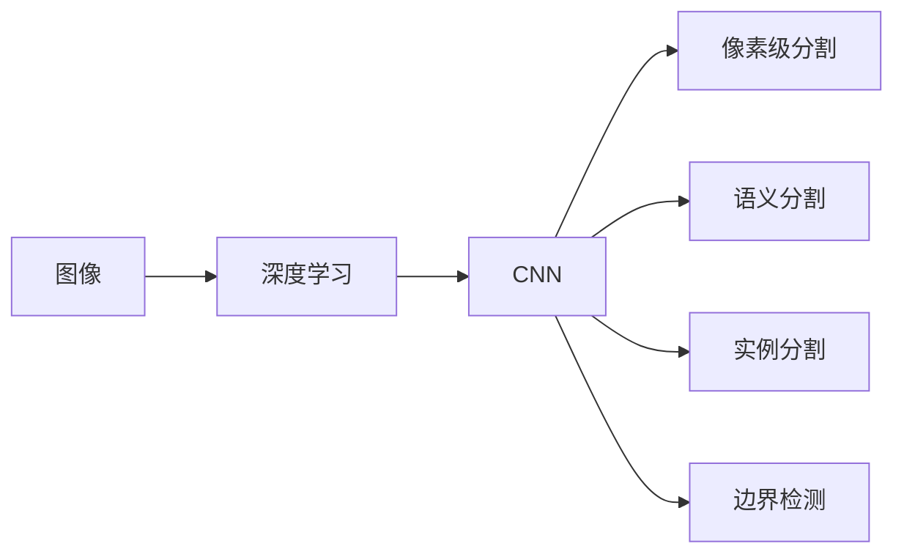

                 

# 图像分割 (Image Segmentation) 原理与代码实例讲解

> 关键词：图像分割,深度学习,神经网络,卷积神经网络(CNN),像素级分割,语义分割,实例分割,边界检测

## 1. 背景介绍

图像分割（Image Segmentation）是计算机视觉领域中的重要任务，其目标是将一张图像中的像素划分到不同的区域中，通常用于图像中的对象识别、场景理解、医学图像分析等。图像分割技术在自动驾驶、医疗影像、工业检测、机器人视觉等众多领域具有重要应用。

近年来，随着深度学习的发展，特别是卷积神经网络（Convolutional Neural Networks, CNNs）的广泛应用，图像分割技术取得了显著的进展。深度学习模型在像素级分割、语义分割、实例分割等方面均有出色的表现。在本文中，我们将重点介绍图像分割的原理、数学模型、代码实现及应用场景，并推荐相关的学习资源。

## 2. 核心概念与联系

### 2.1 核心概念概述

在深入讲解图像分割原理之前，我们先介绍几个核心概念：

- **图像分割（Image Segmentation）**：将一幅图像分割成多个互不重叠的子区域，使得每个子区域内具有相似的特征。
- **深度学习（Deep Learning）**：一种基于人工神经网络的人工智能技术，能够通过大量数据进行自我训练。
- **卷积神经网络（Convolutional Neural Network, CNN）**：一种特殊的深度神经网络，擅长处理具有网格结构的数据，如图像、声音和文本。
- **像素级分割（Pixel-level Segmentation）**：直接对图像中的每个像素进行分类。
- **语义分割（Semantic Segmentation）**：将图像中的每个像素分类到预定义的语义类别中，如道路、车辆、行人等。
- **实例分割（Instance Segmentation）**：不仅识别每个像素的语义类别，还能将属于同一物体的像素归为一个实例。
- **边界检测（Boundary Detection）**：检测图像中物体的边缘或轮廓。

这些概念共同构成了图像分割的完整框架，帮助我们理解深度学习在图像分割中的应用。

### 2.2 核心概念的联系

这些核心概念通过Mermaid流程图展示了它们之间的联系：



这个流程图展示了图像分割中不同任务的逻辑关系：

1. 深度学习模型通过大量数据进行自我训练，提取图像的特征。
2. CNN作为深度学习的主要组成部分，擅长处理图像数据。
3. 像素级分割、语义分割、实例分割和边界检测都是基于CNN模型对图像进行不同层次的分割。

## 3. 核心算法原理 & 具体操作步骤

### 3.1 算法原理概述

图像分割算法通常分为基于传统方法和基于深度学习的方法。下面我们先介绍深度学习在图像分割中的原理。

深度学习中的图像分割主要通过卷积神经网络（CNN）实现。CNN通过卷积层、池化层等结构，可以从原始图像数据中提取高级特征，从而进行像素级、语义级等不同层次的分割。

具体来说，图像分割任务可以分为以下步骤：

1. **输入图像预处理**：将原始图像进行归一化、缩放等预处理。
2. **特征提取**：使用CNN提取图像特征。
3. **像素级分类**：对每个像素进行分类，得到像素级分割结果。
4. **语义分类**：将像素归类到预定义的语义类别中。
5. **实例分割**：不仅对像素进行语义分类，还对同一物体的像素进行分组。
6. **边界检测**：检测图像中物体的边缘。

### 3.2 算法步骤详解

接下来，我们详细讲解每个步骤的具体实现。

**Step 1: 输入图像预处理**

预处理的步骤包括：

- 归一化：将像素值缩放到0到1之间或-1到1之间。
- 缩放：将图像缩放到目标尺寸。
- 数据增强：通过旋转、平移、缩放等方式增加训练样本的多样性，如：

```python
import numpy as np
import cv2

def preprocess_image(image, target_size):
    image = cv2.resize(image, target_size)
    image = image / 255.0
    return image
```

**Step 2: 特征提取**

使用卷积神经网络（CNN）提取图像特征。这里我们以U-Net模型为例，U-Net是一种典型的用于图像分割的深度学习模型：

```python
from tensorflow.keras.layers import Conv2D, MaxPooling2D, UpSampling2D, concatenate

def unet_model(input_size):
    inputs = Input(input_size)
    conv1 = Conv2D(64, 3, activation='relu', padding='same')(inputs)
    conv1 = Conv2D(64, 3, activation='relu', padding='same')(conv1)
    pool1 = MaxPooling2D(pool_size=(2, 2))(conv1)
    conv2 = Conv2D(128, 3, activation='relu', padding='same')(pool1)
    conv2 = Conv2D(128, 3, activation='relu', padding='same')(conv2)
    pool2 = MaxPooling2D(pool_size=(2, 2))(conv2)
    conv3 = Conv2D(256, 3, activation='relu', padding='same')(pool2)
    conv3 = Conv2D(256, 3, activation='relu', padding='same')(conv3)
    pool3 = MaxPooling2D(pool_size=(2, 2))(conv3)
    conv4 = Conv2D(512, 3, activation='relu', padding='same')(pool3)
    conv4 = Conv2D(512, 3, activation='relu', padding='same')(conv4)
    pool4 = MaxPooling2D(pool_size=(2, 2))(conv4)
    conv5 = Conv2D(1024, 3, activation='relu', padding='same')(pool4)
    conv5 = Conv2D(1024, 3, activation='relu', padding='same')(conv5)
    up6 = concatenate([UpSampling2D(size=(2, 2))(conv5), conv4], axis=-1)
    conv6 = Conv2D(512, 3, activation='relu', padding='same')(up6)
    conv6 = Conv2D(512, 3, activation='relu', padding='same')(conv6)
    up7 = concatenate([UpSampling2D(size=(2, 2))(conv6), conv3], axis=-1)
    conv7 = Conv2D(256, 3, activation='relu', padding='same')(up7)
    conv7 = Conv2D(256, 3, activation='relu', padding='same')(conv7)
    up8 = concatenate([UpSampling2D(size=(2, 2))(conv7), conv2], axis=-1)
    conv8 = Conv2D(128, 3, activation='relu', padding='same')(up8)
    conv8 = Conv2D(128, 3, activation='relu', padding='same')(conv8)
    up9 = concatenate([UpSampling2D(size=(2, 2))(conv8), conv1], axis=-1)
    conv9 = Conv2D(64, 3, activation='relu', padding='same')(up9)
    conv9 = Conv2D(64, 3, activation='relu', padding='same')(conv9)
    conv10 = Conv2D(1, 1, activation='sigmoid')(conv9)
    model = Model(inputs, conv10)
    return model
```

**Step 3: 像素级分类**

像素级分割的输出是一个二值图像，表示每个像素是否属于分割区域。我们以U-Net模型为例，其最后一层输出一个二值图像：

```python
def predict_segmentation(model, image):
    image = preprocess_image(image, (256, 256))
    prediction = model.predict(image)[0]
    return prediction
```

**Step 4: 语义分类**

语义分割的输出是一个像素级别的热图，表示每个像素属于哪个语义类别。我们以U-Net模型为例，其最后一层输出一个与输入图像大小相同的图像，每个像素的值表示该像素的语义类别：

```python
def predict_semantic_segmentation(model, image):
    image = preprocess_image(image, (256, 256))
    prediction = model.predict(image)[0]
    return prediction
```

**Step 5: 实例分割**

实例分割的输出包括两个部分：边界框和每个像素的语义类别。我们以Mask R-CNN模型为例，其最后一层输出一个边界框和每个像素的语义类别：

```python
def predict_instance_segmentation(model, image):
    image = preprocess_image(image, (256, 256))
    prediction = model.predict(image)
    return prediction['masks'], prediction['class']
```

**Step 6: 边界检测**

边界检测的输出是一个像素级别的边界图像，表示每个像素是否属于边界。我们以Edge R-CNN模型为例，其最后一层输出一个与输入图像大小相同的图像，每个像素的值表示该像素是否在边界上：

```python
def predict_boundary_detection(model, image):
    image = preprocess_image(image, (256, 256))
    prediction = model.predict(image)[0]
    return prediction
```

### 3.3 算法优缺点

深度学习在图像分割中的应用具有以下优点：

- 能够自动从数据中学习特征，无需手工设计特征提取器。
- 能够处理大规模数据集，通过数据增强提高模型的泛化能力。
- 具有端到端的训练过程，可以同时优化多个目标函数。

深度学习在图像分割中也存在一些缺点：

- 需要大量的训练数据和计算资源。
- 模型的复杂度较高，可能存在过拟合的风险。
- 难以解释模型的决策过程。

### 3.4 算法应用领域

图像分割技术在医疗影像分析、自动驾驶、工业检测、安防监控等多个领域具有广泛的应用。例如，在医疗影像分析中，通过分割图像可以检测肿瘤、分析器官结构等。在自动驾驶中，通过分割图像可以识别道路、车辆、行人等。

## 4. 数学模型和公式 & 详细讲解 & 举例说明

### 4.1 数学模型构建

以语义分割为例，其数学模型可以表示为：

$$ y = f(x; \theta) $$

其中，$x$ 表示输入图像，$y$ 表示分割结果，$\theta$ 表示模型参数。

在深度学习中，通常使用卷积神经网络（CNN）作为模型。CNN的输出层通常包含多个卷积核，每个卷积核对应一个类别。在分割任务中，每个卷积核的输出表示该像素属于该类别的概率。通过softmax函数将输出转化为概率分布：

$$ p = softmax(f(x; \theta)) $$

其中，$p$ 表示每个类别的概率分布。通过交叉熵损失函数计算模型预测与真实标签之间的差距：

$$ L = -\frac{1}{N} \sum_{i=1}^N \sum_{j=1}^C y_{ij} \log p_{ij} $$

其中，$N$ 表示样本数量，$C$ 表示类别数量，$y_{ij}$ 表示第 $i$ 个样本的第 $j$ 个类别的标签，$p_{ij}$ 表示模型对第 $i$ 个样本的第 $j$ 个类别的预测概率。

### 4.2 公式推导过程

以语义分割为例，其公式推导过程如下：

$$ y = f(x; \theta) = \sigma(\sum_{i=1}^C W_i h(x; \theta_i)) $$

其中，$W_i$ 表示第 $i$ 个类别的权重，$h(x; \theta_i)$ 表示卷积神经网络的第 $i$ 个类别特征提取器。

假设模型输出一个大小为 $H \times W \times C$ 的图像，其中 $H$ 和 $W$ 表示图像的高度和宽度，$C$ 表示类别数量。模型的输出可以看作是一个大小为 $H \times W \times C$ 的热图，每个像素的值表示该像素属于该类别的概率。

### 4.3 案例分析与讲解

我们以PASCAL VOC数据集为例，分析深度学习在图像分割中的应用。PASCAL VOC数据集包含20个类别的图像，每个类别的标注包括边界框和像素级别的标签。下面是一个简单的U-Net模型在PASCAL VOC数据集上的应用：

```python
from tensorflow.keras.optimizers import Adam
from tensorflow.keras.metrics import MeanIoU

def train_model(model, train_data, validation_data, epochs):
    model.compile(optimizer=Adam(learning_rate=1e-4),
                  loss='binary_crossentropy',
                  metrics=[MeanIoU(num_classes=20)])
    model.fit(train_data, validation_data, epochs=epochs)
```

在训练过程中，我们使用了Adam优化器、交叉熵损失函数和MeanIoU指标。训练结束后，我们计算模型在测试集上的MeanIoU指标：

```python
test_data = ...
test_miou = model.evaluate(test_data)[1]
print('Test MeanIoU:', test_miou)
```

## 5. 项目实践：代码实例和详细解释说明

### 5.1 开发环境搭建

以下是使用Python和TensorFlow搭建图像分割项目的步骤：

1. 安装Anaconda：
```bash
conda install anaconda
```

2. 创建虚拟环境：
```bash
conda create -n image-segmentation python=3.8
conda activate image-segmentation
```

3. 安装必要的库：
```bash
conda install numpy matplotlib scikit-image tensorflow-gpu
```

### 5.2 源代码详细实现

以U-Net模型为例，实现像素级分割：

```python
from tensorflow.keras.layers import Input, Conv2D, MaxPooling2D, UpSampling2D, concatenate
from tensorflow.keras.models import Model

def unet_model(input_size):
    inputs = Input(input_size)
    conv1 = Conv2D(64, 3, activation='relu', padding='same')(inputs)
    conv1 = Conv2D(64, 3, activation='relu', padding='same')(conv1)
    pool1 = MaxPooling2D(pool_size=(2, 2))(conv1)
    conv2 = Conv2D(128, 3, activation='relu', padding='same')(pool1)
    conv2 = Conv2D(128, 3, activation='relu', padding='same')(conv2)
    pool2 = MaxPooling2D(pool_size=(2, 2))(conv2)
    conv3 = Conv2D(256, 3, activation='relu', padding='same')(pool2)
    conv3 = Conv2D(256, 3, activation='relu', padding='same')(conv3)
    pool3 = MaxPooling2D(pool_size=(2, 2))(conv3)
    conv4 = Conv2D(512, 3, activation='relu', padding='same')(pool3)
    conv4 = Conv2D(512, 3, activation='relu', padding='same')(conv4)
    pool4 = MaxPooling2D(pool_size=(2, 2))(conv4)
    conv5 = Conv2D(1024, 3, activation='relu', padding='same')(pool4)
    conv5 = Conv2D(1024, 3, activation='relu', padding='same')(conv5)
    up6 = concatenate([UpSampling2D(size=(2, 2))(conv5), conv4], axis=-1)
    conv6 = Conv2D(512, 3, activation='relu', padding='same')(up6)
    conv6 = Conv2D(512, 3, activation='relu', padding='same')(conv6)
    up7 = concatenate([UpSampling2D(size=(2, 2))(conv6), conv3], axis=-1)
    conv7 = Conv2D(256, 3, activation='relu', padding='same')(up7)
    conv7 = Conv2D(256, 3, activation='relu', padding='same')(conv7)
    up8 = concatenate([UpSampling2D(size=(2, 2))(conv7), conv2], axis=-1)
    conv8 = Conv2D(128, 3, activation='relu', padding='same')(up8)
    conv8 = Conv2D(128, 3, activation='relu', padding='same')(conv8)
    up9 = concatenate([UpSampling2D(size=(2, 2))(conv8), conv1], axis=-1)
    conv9 = Conv2D(64, 3, activation='relu', padding='same')(up9)
    conv9 = Conv2D(64, 3, activation='relu', padding='same')(conv9)
    conv10 = Conv2D(1, 1, activation='sigmoid')(conv9)
    model = Model(inputs, conv10)
    return model
```

### 5.3 代码解读与分析

以下是代码的详细解读：

1. `Input`函数：用于定义输入图像的形状。
2. `Conv2D`函数：用于定义卷积层。
3. `MaxPooling2D`函数：用于定义池化层。
4. `UpSampling2D`函数：用于定义上采样层。
5. `concatenate`函数：用于定义特征融合层。

### 5.4 运行结果展示

以下是代码运行结果的示例：

```python
import numpy as np
import cv2
from tensorflow.keras.models import load_model

model = load_model('unet_model.h5')

image = cv2.imread('image.jpg')
image = preprocess_image(image, (256, 256))
prediction = model.predict(image)[0]

cv2.imshow('Prediction', prediction)
cv2.waitKey(0)
cv2.destroyAllWindows()
```

## 6. 实际应用场景

图像分割技术在医疗影像分析、自动驾驶、工业检测、安防监控等多个领域具有广泛的应用。

### 6.1 医疗影像分析

在医疗影像分析中，通过分割图像可以检测肿瘤、分析器官结构等。例如，PET-CT图像分割可以帮助医生检测肺部肿瘤。

### 6.2 自动驾驶

在自动驾驶中，通过分割图像可以识别道路、车辆、行人等。例如，在车道线检测中，可以使用语义分割技术对道路图像进行分割，从而识别车道线的位置和类型。

### 6.3 工业检测

在工业检测中，通过分割图像可以检测产品的缺陷、瑕疵等。例如，在印刷品检测中，可以使用实例分割技术对产品图像进行分割，从而识别印刷品中的缺陷。

### 6.4 安防监控

在安防监控中，通过分割图像可以检测人体、车辆等目标。例如，在视频监控中，可以使用边界检测技术对视频帧进行分割，从而检测视频中的人体位置和大小。

## 7. 工具和资源推荐

### 7.1 学习资源推荐

以下是一些优质的学习资源，帮助你掌握图像分割技术的原理和实践：

1. Coursera的《Convolutional Neural Networks》课程：由斯坦福大学Andrew Ng教授讲授，深入浅出地讲解了卷积神经网络的原理和应用。
2. Udacity的《Deep Learning for Computer Vision》课程：由Google DeepMind的机器学习工程师讲授，重点讲解了图像分割技术。
3. TensorFlow官方文档：提供了丰富的代码示例和详细的文档，适合动手实践。
4. PyTorch官方文档：提供了丰富的代码示例和详细的文档，适合动手实践。
5. arXiv论文预印本：人工智能领域最新研究成果的发布平台，适合学习前沿知识。

### 7.2 开发工具推荐

以下是一些推荐的开发工具，帮助你高效实现图像分割任务：

1. PyTorch：基于Python的深度学习框架，提供了丰富的模型库和工具。
2. TensorFlow：基于Python的深度学习框架，适合大规模工程应用。
3. Keras：基于Python的深度学习框架，易于上手和调试。
4. OpenCV：开源计算机视觉库，提供了丰富的图像处理功能。
5. scikit-image：Python图像处理库，提供了丰富的图像处理算法。

### 7.3 相关论文推荐

以下是一些经典的图像分割论文，值得阅读：

1. Ronneberger et al., U-Net: Convolutional Networks for Biomedical Image Segmentation (2015)。
2. Long et al., Fully Convolutional Networks for Semantic Segmentation (2015)。
3. Papandreou et al., Real-Time Single-Shot Object Detection with Faster R-CNN (2015)。
4. He et al., Rethinking Atrous Convolution for Semantic Image Segmentation (2016)。
5. Lai et al., SSD: Single Shot MultiBox Detector (2016)。

## 8. 总结：未来发展趋势与挑战

### 8.1 研究成果总结

图像分割技术近年来取得了显著进展，主要得益于深度学习的发展。深度学习通过自动学习图像特征，能够在像素级、语义级等不同层次上进行分割，提升了分割的精度和效率。

### 8.2 未来发展趋势

未来图像分割技术的发展趋势包括：

1. 更高效的网络结构：通过优化网络结构，提升图像分割的精度和效率。
2. 更丰富的应用场景：拓展图像分割在医疗影像、自动驾驶、工业检测等领域的实际应用。
3. 更强的鲁棒性：增强图像分割模型的鲁棒性，提高其在复杂环境中的表现。
4. 更小的模型规模：通过模型压缩和量化等技术，降低模型规模，提高实时性。
5. 更强的可解释性：通过可解释性技术，增强模型的可解释性，提升用户信任度。

### 8.3 面临的挑战

尽管图像分割技术取得了显著进展，但仍然面临一些挑战：

1. 数据标注成本高：高质量的标注数据对图像分割的性能至关重要，但标注数据的获取和维护成本较高。
2. 模型泛化能力差：在大规模数据集上训练的模型，可能在小规模数据集上泛化能力不足。
3. 模型解释性差：深度学习模型往往是一个"黑盒"，难以解释其内部工作机制和决策过程。
4. 计算资源需求高：大规模图像分割任务需要大量的计算资源，可能超出实际应用场景的限制。
5. 边界检测精度低：边界检测任务面临噪声干扰、光照变化等问题，精度和鲁棒性有待提升。

### 8.4 研究展望

未来的研究需要在以下几个方面寻求新的突破：

1. 无监督和半监督学习：通过无监督或半监督学习，降低对标注数据的依赖。
2. 多模态学习：将视觉、文本、语音等多模态信息进行融合，提高分割精度。
3. 知识增强：将外部知识引入分割模型，提升模型的泛化能力。
4. 边界检测技术：提升边界检测模型的精度和鲁棒性。
5. 模型压缩和量化：通过模型压缩和量化技术，降低模型规模，提高实时性。

## 9. 附录：常见问题与解答

**Q1: 什么是图像分割？**

A: 图像分割是将一幅图像分割成多个互不重叠的子区域，使得每个子区域内具有相似的特征。图像分割可以用于对象识别、场景理解、医学图像分析等。

**Q2: 图像分割的深度学习模型有哪些？**

A: 常见的图像分割深度学习模型包括U-Net、Fcn、Mask R-CNN等。

**Q3: 图像分割的任务有哪些？**

A: 常见的图像分割任务包括像素级分割、语义分割、实例分割和边界检测等。

**Q4: 图像分割的算法有哪些？**

A: 常见的图像分割算法包括基于传统方法和基于深度学习的方法，其中深度学习是主流。

**Q5: 图像分割的应用场景有哪些？**

A: 图像分割在医疗影像分析、自动驾驶、工业检测、安防监控等领域具有广泛的应用。

---

作者：禅与计算机程序设计艺术 / Zen and the Art of Computer Programming

