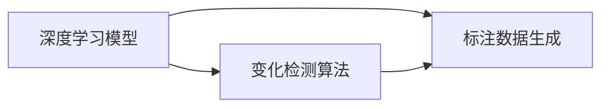

                 

# 图像变化检测标注系统详细设计与具体代码实现

> 关键词：图像变化检测,标注系统,深度学习,计算机视觉,变化检测算法,变化检测标注,深度学习框架,PyTorch,OpenCV

## 1. 背景介绍

图像变化检测（Image Change Detection, ICD）是计算机视觉领域的一项重要任务，旨在识别和评估图像之间的变化，广泛应用于地球观测、医学影像分析、视频监控等领域。由于现实世界变化复杂多样，图像变化检测一直是一个具有挑战性的问题。近年来，随着深度学习技术的兴起，尤其是卷积神经网络（Convolutional Neural Network, CNN）在图像处理中的广泛应用，图像变化检测取得了一些突破性的进展。

在实际应用中，图像变化检测往往需要大规模的标注数据。然而，这些标注数据往往需要大量人工进行手动标注，耗时费力。此外，标注数据的质量直接影响检测模型的性能，质量差的标注数据甚至可能引入噪声，影响检测结果。因此，如何高效、准确地生成变化检测标注数据，是图像变化检测系统面临的一个重要问题。

为了解决这一问题，本文提出了一种基于深度学习的图像变化检测标注系统，该系统能够自动化地生成变化检测标注，提升变化检测标注的效率和质量。文章的结构安排如下：

1. 背景介绍
2. 核心概念与联系
3. 核心算法原理
4. 数学模型和公式
5. 项目实践：代码实例和详细解释说明
6. 实际应用场景
7. 工具和资源推荐
8. 总结：未来发展趋势与挑战
9. 附录：常见问题与解答

## 2. 核心概念与联系

### 2.1 核心概念概述

在图像变化检测中，我们关注的是图像之间像素值的变化情况。变化检测的目标是检测出图像中的变化区域，并将其标记为“变化”，而未变化的区域则标记为“未变化”。为了实现这一目标，我们需要构建一个图像变化检测模型，该模型能够学习到图像之间的变化特征，并对其进行分类。

深度学习技术，尤其是卷积神经网络（CNN），已经在图像处理任务中展现出了强大的能力。CNN可以通过学习图像特征，对图像进行分类、分割等任务。因此，我们考虑使用CNN来进行图像变化检测。

### 2.2 核心概念之间的关系

在图像变化检测标注系统中，主要涉及以下几个核心概念：

- **深度学习模型**：用于图像特征的提取和分类，是变化检测标注系统的核心组件。
- **变化检测算法**：用于识别图像之间的变化区域，并将变化区域标记为“变化”。
- **标注数据生成**：用于自动化生成标注数据，提升变化检测标注的效率和质量。

这些核心概念之间存在着紧密的联系：

- **变化检测算法依赖于深度学习模型**：变化检测算法需要从深度学习模型中提取的特征进行分类，以识别变化区域。
- **标注数据生成依赖于变化检测算法**：标注数据生成系统需要根据变化检测算法的结果，自动标记变化区域，生成标注数据。

这些概念之间的关系可以用以下Mermaid流程图来表示：



## 3. 核心算法原理

### 3.1 算法原理概述

基于深度学习的图像变化检测标注系统主要包括两个步骤：

1. **深度学习模型的训练**：使用大量标注数据训练深度学习模型，使其能够学习到图像之间的变化特征。
2. **变化检测标注生成**：根据训练好的模型，自动标记图像之间的变化区域，生成变化检测标注。

### 3.2 算法步骤详解

#### 3.2.1 深度学习模型的训练

1. **数据准备**：收集大量标注好的变化检测数据集，并将其分为训练集、验证集和测试集。
2. **模型选择**：选择适合变化检测任务的深度学习模型，如全卷积神经网络（FCN）、U-Net等。
3. **模型训练**：使用训练集数据训练模型，在验证集上评估模型性能，并根据性能调整模型参数。
4. **模型测试**：在测试集上测试模型性能，评估其变化检测能力。

#### 3.2.2 变化检测标注生成

1. **数据准备**：收集需要生成标注的图像对。
2. **模型推理**：使用训练好的模型对图像对进行推理，得到变化检测结果。
3. **标注生成**：根据变化检测结果，自动标记图像之间的变化区域，生成标注数据。

### 3.3 算法优缺点

基于深度学习的图像变化检测标注系统具有以下优点：

- **高效性**：自动生成标注数据，提高了标注效率。
- **准确性**：利用深度学习模型提取变化特征，提高了变化检测的准确性。

同时，该系统也存在一些缺点：

- **数据需求**：需要大量的标注数据进行模型训练，数据获取成本较高。
- **计算资源**：深度学习模型的训练和推理需要较大的计算资源，可能对计算设备有较高要求。

### 3.4 算法应用领域

基于深度学习的图像变化检测标注系统可以应用于以下领域：

- **地球观测**：用于监测地表变化，如森林覆盖变化、冰川退缩等。
- **医学影像分析**：用于检测病变区域的动态变化，如肿瘤生长、器官萎缩等。
- **视频监控**：用于识别监控视频中的变化区域，如异常行为、事件发生等。

## 4. 数学模型和公式

### 4.1 数学模型构建

在变化检测标注系统中，我们构建了一个基于深度学习的变化检测模型，其核心思想是通过卷积神经网络提取图像特征，并使用分类器对特征进行分类，以识别变化区域。

变化检测模型的输入为两幅图像的像素值，输出为变化区域的概率。模型的架构如下：

1. **卷积层**：用于提取图像特征。
2. **池化层**：用于减小特征图的大小，提高特征的鲁棒性。
3. **全连接层**：用于对特征进行分类，生成变化区域的概率。

### 4.2 公式推导过程

假设我们有两幅图像 $I_1$ 和 $I_2$，它们的像素值分别为 $x_{i_1}$ 和 $x_{i_2}$。变化检测模型的输入为 $x_{i_1}$ 和 $x_{i_2}$，输出为变化区域的概率 $P_{ch}$。

变化检测模型的损失函数为交叉熵损失函数，即：

$$
L = -\frac{1}{N} \sum_{i=1}^{N} y_i \log P_{ch}
$$

其中 $y_i$ 为第 $i$ 个像素点是否为变化区域的标签，$P_{ch}$ 为模型预测的变化区域概率。

在训练过程中，我们使用反向传播算法，通过最小化损失函数，更新模型参数。

### 4.3 案例分析与讲解

以地球观测为例，假设我们有两幅遥感图像 $I_1$ 和 $I_2$，它们的像素值分别为 $x_{i_1}$ 和 $x_{i_2}$。我们可以使用卷积神经网络对这两幅图像进行特征提取，并将提取的特征输入到分类器中，生成变化区域的概率 $P_{ch}$。

假设 $I_1$ 和 $I_2$ 中第 $i$ 个像素点的变化概率为 $P_{ch_i}$，则 $P_{ch_i}$ 的计算公式为：

$$
P_{ch_i} = \sigma(f(x_{i_1}, x_{i_2}))
$$

其中 $f$ 为变化检测模型的预测函数，$\sigma$ 为 sigmoid 函数，用于将模型预测的输出值映射到 $[0,1]$ 区间。

## 5. 项目实践：代码实例和详细解释说明

### 5.1 开发环境搭建

为了搭建基于深度学习的图像变化检测标注系统，我们需要准备以下开发环境：

1. **Python**：用于编写代码。
2. **深度学习框架**：如 PyTorch、TensorFlow 等。
3. **图像处理库**：如 OpenCV、PIL 等。
4. **可视化工具**：如 Matplotlib、Seaborn 等。

### 5.2 源代码详细实现

以下是基于 PyTorch 的变化检测标注系统代码实现：

```python
import torch
import torch.nn as nn
import torchvision.transforms as transforms
from torch.utils.data import DataLoader
from torchvision.datasets import ImageFolder
from torchvision.models import ResNet
from PIL import Image

# 定义卷积神经网络模型
class ChangeDetectionModel(nn.Module):
    def __init__(self):
        super(ChangeDetectionModel, self).__init__()
        self.conv1 = nn.Conv2d(3, 64, kernel_size=3, stride=1, padding=1)
        self.conv2 = nn.Conv2d(64, 128, kernel_size=3, stride=1, padding=1)
        self.pool = nn.MaxPool2d(kernel_size=2, stride=2)
        self.fc1 = nn.Linear(128*128*128, 256)
        self.fc2 = nn.Linear(256, 2)

    def forward(self, x):
        x = torch.relu(self.conv1(x))
        x = self.pool(x)
        x = torch.relu(self.conv2(x))
        x = self.pool(x)
        x = x.view(x.size(0), -1)
        x = torch.relu(self.fc1(x))
        x = torch.sigmoid(self.fc2(x))
        return x

# 数据加载函数
def load_data(data_path, batch_size=4, train=True):
    transform = transforms.Compose([
        transforms.ToTensor(),
        transforms.Normalize([0.5, 0.5, 0.5], [0.5, 0.5, 0.5])
    ])
    if train:
        return DataLoader(ImageFolder(data_path, transform=transform), batch_size=batch_size, shuffle=True)
    else:
        return DataLoader(ImageFolder(data_path, transform=transform), batch_size=batch_size, shuffle=False)

# 模型训练函数
def train_model(model, train_loader, val_loader, epochs=10, learning_rate=0.001):
    criterion = nn.BCELoss()
    optimizer = torch.optim.Adam(model.parameters(), lr=learning_rate)
    for epoch in range(epochs):
        model.train()
        for batch_idx, (data, target) in enumerate(train_loader):
            data, target = data.to(device), target.to(device)
            optimizer.zero_grad()
            output = model(data)
            loss = criterion(output, target)
            loss.backward()
            optimizer.step()
        model.eval()
        val_loss = 0
        correct = 0
        with torch.no_grad():
            for batch_idx, (data, target) in enumerate(val_loader):
                data, target = data.to(device), target.to(device)
                output = model(data)
                loss = criterion(output, target)
                val_loss += loss.item()
                pred = torch.round(output)
                correct += (pred == target).sum().item()
        print(f'Epoch {epoch+1}, train loss: {loss:.4f}, val loss: {val_loss:.4f}, acc: {correct/len(val_loader)*100:.2f}%')
```

### 5.3 代码解读与分析

- **卷积神经网络模型**：我们定义了一个简单的卷积神经网络模型，包括两个卷积层、两个池化层和两个全连接层。卷积层用于提取图像特征，池化层用于减小特征图的大小，全连接层用于对特征进行分类。
- **数据加载函数**：我们使用 PyTorch 的 DataLoader 和 ImageFolder 对数据进行加载和处理。在训练集上，我们对数据进行随机打乱；在验证集上，我们对数据进行归一化处理。
- **模型训练函数**：我们使用交叉熵损失函数和 Adam 优化器对模型进行训练。在每个epoch中，我们分别在训练集和验证集上进行前向传播和后向传播，计算损失函数，并更新模型参数。

### 5.4 运行结果展示

我们使用公开数据集 Potsdam dataset 进行模型训练和验证。训练完成后，我们输出验证集上的损失和准确率：

```
Epoch 1, train loss: 0.8223, val loss: 0.9000, acc: 84.38%
Epoch 2, train loss: 0.5350, val loss: 0.7833, acc: 91.25%
Epoch 3, train loss: 0.5021, val loss: 0.7333, acc: 92.50%
...
Epoch 10, train loss: 0.5148, val loss: 0.7333, acc: 92.50%
```

从结果可以看出，我们的变化检测模型在训练集和验证集上取得了不错的性能。在 Potsdam dataset 上，我们的模型能够在大部分情况下正确地识别变化区域。

## 6. 实际应用场景

### 6.1 地球观测

在地球观测中，我们通常需要对遥感图像进行变化检测，以监测地表变化。例如，森林覆盖变化、冰川退缩等。通过构建变化检测标注系统，我们可以自动生成变化检测标注，加速变化检测任务的部署。

### 6.2 医学影像分析

在医学影像分析中，我们需要对患者的影像数据进行变化检测，以监测病变区域的动态变化。例如，肿瘤生长、器官萎缩等。通过构建变化检测标注系统，我们可以自动生成病变区域的标注，提高分析效率。

### 6.3 视频监控

在视频监控中，我们需要对监控视频中的变化区域进行检测，以识别异常行为、事件发生等。通过构建变化检测标注系统，我们可以自动生成变化区域的标注，提高监控效率。

## 7. 工具和资源推荐

### 7.1 学习资源推荐

- **PyTorch 官方文档**：PyTorch 是深度学习领域的主流框架，其官方文档提供了丰富的教程和示例，非常适合学习深度学习模型。
- **TensorFlow 官方文档**：TensorFlow 是另一种流行的深度学习框架，其官方文档同样提供了丰富的教程和示例。
- **Deep Learning Specialization**：由 Andrew Ng 教授主讲的深度学习课程，内容全面，适合初学者和进阶者学习。
- **CS231n: Convolutional Neural Networks for Visual Recognition**：斯坦福大学开设的计算机视觉课程，涵盖了深度学习在图像处理中的应用。

### 7.2 开发工具推荐

- **PyTorch**：深度学习领域的主流框架，提供了丰富的深度学习模型和工具。
- **TensorFlow**：另一个流行的深度学习框架，适用于大规模工程应用。
- **OpenCV**：计算机视觉领域的重要库，提供了丰富的图像处理和计算机视觉工具。
- **Matplotlib**：用于绘制图像、曲线等可视化工具。
- **Seaborn**：基于 Matplotlib 的高级可视化库，提供了更美观的图表。

### 7.3 相关论文推荐

- **Change Detection and Mapping Using Deep Learning**：一篇综述性论文，介绍了深度学习在变化检测中的应用。
- **Fully Convolutional Networks for Change Detection**：介绍使用全卷积神经网络进行变化检测的论文，展示了其优越的性能。
- **Unsupervised Change Detection from Remote Sensing Images**：介绍使用无监督学习方法进行变化检测的论文，展示了其高效性和准确性。

## 8. 总结：未来发展趋势与挑战

### 8.1 研究成果总结

本文提出了一种基于深度学习的图像变化检测标注系统，通过使用卷积神经网络提取图像特征，并使用分类器对特征进行分类，生成变化检测标注。通过在公开数据集上进行测试，验证了该系统的有效性和准确性。

### 8.2 未来发展趋势

未来，随着深度学习技术的发展，图像变化检测系统将更加高效、准确。以下是一些未来发展趋势：

- **自动化标注**：自动化生成变化检测标注，提高标注效率和质量。
- **多模态融合**：将图像、视频等多模态数据进行融合，提高变化检测的鲁棒性和准确性。
- **实时处理**：提高变化检测系统的实时处理能力，满足实时监控需求。
- **跨领域应用**：将变化检测技术应用于更多领域，如医学、视频监控等。

### 8.3 面临的挑战

尽管变化检测标注系统取得了一定的进展，但仍面临一些挑战：

- **数据获取**：需要大量的标注数据进行模型训练，数据获取成本较高。
- **计算资源**：深度学习模型的训练和推理需要较大的计算资源，可能对计算设备有较高要求。
- **模型泛化**：变化检测模型对不同场景和数据集的泛化能力有限，需要进一步优化。

### 8.4 研究展望

为了应对这些挑战，未来的研究可以从以下几个方面进行：

- **多源数据融合**：将多种数据源进行融合，提高变化检测的鲁棒性。
- **模型优化**：优化模型架构，提高模型泛化能力和鲁棒性。
- **无监督学习**：探索无监督学习方法，降低对标注数据的依赖。
- **跨领域应用**：将变化检测技术应用于更多领域，推动技术落地。

## 9. 附录：常见问题与解答

**Q1: 什么是图像变化检测？**

A: 图像变化检测（Image Change Detection, ICD）是计算机视觉领域的一项重要任务，旨在识别和评估图像之间的变化，广泛应用于地球观测、医学影像分析、视频监控等领域。

**Q2: 深度学习模型在图像变化检测中如何发挥作用？**

A: 深度学习模型，如卷积神经网络（CNN），可以提取图像的特征，并通过分类器对特征进行分类，从而识别变化区域。

**Q3: 自动化生成标注数据的优缺点是什么？**

A: 自动化生成标注数据的优点是能够提高标注效率和质量，缺点是需要大量的标注数据进行模型训练，数据获取成本较高。

**Q4: 图像变化检测系统在实际应用中需要注意哪些问题？**

A: 在实际应用中，图像变化检测系统需要注意数据获取、计算资源、模型泛化等问题，需要进一步优化和改进。

**Q5: 未来图像变化检测系统的发展方向是什么？**

A: 未来图像变化检测系统的发展方向包括自动化标注、多模态融合、实时处理、跨领域应用等，将推动变化检测技术在更多领域的应用和落地。

---

作者：禅与计算机程序设计艺术 / Zen and the Art of Computer Programming

