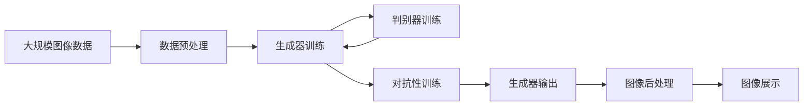

                 

# 图像生成(Image Generation) - 原理与代码实例讲解

> 关键词：图像生成, GANs, 深度学习, 自动编码器, 判别器, 生成器, 损失函数, 训练技巧, 超参数调优, 代码实例

## 1. 背景介绍

### 1.1 问题由来
近年来，随着深度学习技术的快速发展，生成对抗网络（Generative Adversarial Networks, GANs）在图像生成领域取得了巨大成功。GANs由Ian Goodfellow在2014年提出，其核心思想是通过两个神经网络（生成器和判别器）的对抗过程，不断生成高质量的合成图像。GANs不仅在图像生成上取得了突破性进展，也在图像修复、风格转换、图像增强等领域得到了广泛应用。

GANs之所以能够生成高质量的图像，在于其独特的架构设计和训练技巧。生成器（Generator）网络能够将随机噪声映射为合成图像，而判别器（Discriminator）网络则试图区分真实图像和生成图像。通过训练过程中的对抗性游戏，生成器逐渐学会生成越来越逼真的图像，而判别器则越来越难区分真实和生成的图像。

### 1.2 问题核心关键点
GANs的核心在于生成器和判别器的协同训练。生成器的目标是生成尽可能逼真的图像，而判别器的目标则是尽可能准确地区分真实图像和生成图像。这两个目标的对抗性博弈，推动了GANs的不断进步。

GANs的核心算法流程包括：
- 生成器的训练：通过随机噪声生成图像，并尽量骗过判别器。
- 判别器的训练：通过真实图像和生成图像的混合数据集进行训练，尽量提高区分真实和生成图像的准确率。
- 交替训练：将生成器和判别器的训练交替进行，不断迭代优化。

GANs的训练过程相对复杂，需要谨慎处理损失函数的权重、噪声分布等超参数，以避免模式崩溃和模式崩溃等问题。

### 1.3 问题研究意义
GANs在图像生成方面的突破性进展，为计算机视觉和图形设计带来了革命性的变化。通过GANs，我们可以高效生成各种风格的图像，甚至从未见过的艺术作品，大大降低了艺术创作和图像生成的成本。此外，GANs还应用于医疗影像生成、视频生成、音乐生成等领域，为多模态数据生成提供了新的思路。

研究GANs的原理和应用，不仅有助于提高图像生成的技术水平，还能为其他领域的生成模型提供参考和启示。因此，对GANs进行深入研究，具有重要的学术和实践意义。

## 2. 核心概念与联系

### 2.1 核心概念概述

为了更好地理解GANs的原理和应用，本节将介绍几个关键概念及其相互关系：

- 生成对抗网络（GANs）：由生成器和判别器两个对抗性网络组成，通过对抗性训练生成高质量的图像。
- 生成器（Generator）：将随机噪声映射为高质量图像的神经网络。
- 判别器（Discriminator）：区分真实图像和生成图像的神经网络。
- 损失函数：用于衡量生成器和判别器的训练效果，包括交叉熵损失和Wasserstein距离等。
- 对抗性训练：生成器和判别器交替训练，推动对方进步的训练方式。
- 噪声分布：生成器输入的随机噪声分布，通常使用正态分布或均匀分布。
- 超参数调优：通过调整生成器和判别器的参数，如学习率、噪声分布、损失函数等，优化GANs的生成效果。

这些概念之间通过对抗性训练这一核心机制，形成了GANs的完整框架。通过对这些概念的深入理解，我们可以更好地把握GANs的原理和应用方法。

### 2.2 概念间的关系

这些核心概念之间的关系可以通过以下Mermaid流程图来展示：

```mermaid
graph LR
    A[生成器 (Generator)] --> B[判别器 (Discriminator)]
    B --> C[损失函数 (Loss Function)]
    A --> C
    C --> D[对抗性训练 (Adversarial Training)]
    D --> E[超参数调优 (Hyperparameter Tuning)]
    E --> A
    A --> F[噪声分布 (Noise Distribution)]
```

这个流程图展示了GANs的核心机制：
- 生成器和判别器通过对抗性训练不断进步。
- 损失函数衡量生成器和判别器的训练效果。
- 超参数调优用于优化GANs的整体性能。
- 噪声分布用于生成器输入的随机噪声。

这些概念共同构成了GANs的完整框架，使得GANs能够生成高质量的合成图像。

### 2.3 核心概念的整体架构

最后，我们用一个综合的流程图来展示这些核心概念在大图像生成中的整体架构：



这个综合流程图展示了从数据预处理到生成器输出，再到图像展示的完整流程。大图像生成过程包括以下步骤：
- 首先对大规模图像数据进行预处理，如归一化、调整尺寸等。
- 使用生成器训练生成初步的图像。
- 使用判别器训练对生成图像进行判别，调整生成器的参数。
- 重复生成和判别过程，不断优化生成器。
- 最后对生成图像进行后处理，如增强对比度、调整颜色等，提升图像质量。
- 最终展示生成的图像。

通过这些流程图，我们可以更清晰地理解大图像生成过程中各个组件的作用和相互关系。

## 3. 核心算法原理 & 具体操作步骤
### 3.1 算法原理概述

GANs通过生成器和判别器的对抗性训练，生成高质量的合成图像。其核心算法原理可以概括为以下几个步骤：

1. **生成器（Generator）**：接收随机噪声向量作为输入，通过神经网络生成合成图像。
2. **判别器（Discriminator）**：接收图像作为输入，通过神经网络判断图像是真实的还是生成的。
3. **交替训练**：生成器和判别器交替进行训练，生成器试图欺骗判别器，判别器试图准确区分真实和生成图像。
4. **损失函数**：计算生成器和判别器的损失，用于指导生成器和判别器的训练。
5. **超参数调优**：调整生成器和判别器的参数，如学习率、噪声分布等，优化生成效果。

### 3.2 算法步骤详解

下面将详细介绍GANs的训练步骤，包括生成器和判别器的训练过程，以及如何交替进行对抗性训练。

#### 3.2.1 生成器训练
生成器通过接收随机噪声向量作为输入，生成合成图像。其训练过程包括以下步骤：

1. 随机生成噪声向量 $z \sim p_z(z)$。
2. 将噪声向量输入生成器 $G(z)$，得到合成图像 $G(z)$。
3. 使用判别器 $D(G(z))$ 计算生成的图像的判别分数。
4. 计算生成器的损失函数 $\mathcal{L}_G$，通常使用交叉熵损失：

$$
\mathcal{L}_G = -\mathbb{E}_{z \sim p_z(z)} \log D(G(z))
$$

其中 $p_z(z)$ 为随机噪声向量的分布。

#### 3.2.2 判别器训练
判别器的目标是通过图像数据集训练，能够准确地区分真实图像和生成图像。其训练过程包括以下步骤：

1. 随机选取真实图像 $x \sim p_x(x)$。
2. 将真实图像输入判别器 $D(x)$，得到判别分数 $D(x)$。
3. 随机生成噪声向量 $z \sim p_z(z)$。
4. 将噪声向量输入生成器 $G(z)$，得到合成图像 $G(z)$。
5. 将合成图像输入判别器 $D(G(z))$，得到判别分数 $D(G(z))$。
6. 计算判别器的损失函数 $\mathcal{L}_D$，通常使用交叉熵损失：

$$
\mathcal{L}_D = -\mathbb{E}_{x \sim p_x(x)} \log D(x) + \mathbb{E}_{z \sim p_z(z)} \log (1 - D(G(z)))
$$

其中 $p_x(x)$ 为真实图像的分布。

#### 3.2.3 对抗性训练
生成器和判别器的训练交替进行，形成对抗性训练过程。其步骤包括：

1. 生成器的训练：固定判别器的参数，训练生成器，使其生成的图像尽可能骗过判别器。
2. 判别器的训练：固定生成器的参数，训练判别器，使其准确区分真实和生成图像。
3. 交替进行生成器和判别器的训练，逐步提升生成器和判别器的性能。

#### 3.2.4 超参数调优
GANs的训练需要调整多个超参数，包括生成器和判别器的学习率、噪声分布、损失函数等。通过调整这些超参数，可以优化GANs的生成效果。

### 3.3 算法优缺点

GANs在图像生成方面具有以下优点：
1. 生成高质量图像：GANs能够生成逼真的合成图像，尤其是对于复杂的图像结构，GANs能够生成高质量的图像。
2. 可扩展性强：GANs可以扩展到多种任务，如图像生成、图像修复、风格转换等，具有广泛的适用性。
3. 无需标注数据：GANs生成图像的过程不需要标注数据，降低了数据获取和标注的难度。

同时，GANs也存在一些缺点：
1. 训练不稳定：GANs的训练过程容易陷入模式崩溃、梯度消失等问题，导致训练不收敛。
2. 生成器依赖于噪声分布：生成器生成的图像质量依赖于噪声分布的选择，不同的噪声分布可能产生不同的生成效果。
3. 可解释性不足：GANs的生成过程和生成结果缺乏可解释性，难以理解生成器是如何生成特定图像的。

### 3.4 算法应用领域

GANs在图像生成领域具有广泛的应用，以下是几个主要应用场景：

1. **图像生成**：GANs能够生成逼真的图像，如图像生成、艺术作品生成、虚拟人物生成等。
2. **图像修复**：GANs能够修复损坏的图像，如图像去噪、图像补全、超分辨率等。
3. **图像增强**：GANs能够增强图像的质量，如图像增强、图像滤波、图像去模糊等。
4. **风格转换**：GANs能够将图像转换为不同的风格，如图像风格迁移、人脸图像转换等。
5. **医学影像生成**：GANs能够生成高质量的医学影像，如CT图像生成、MRI图像生成等。
6. **视频生成**：GANs能够生成高质量的视频，如动画生成、视频剪辑等。

除了图像生成领域，GANs还在音乐生成、自然语言生成、视频生成等领域得到了广泛应用。未来，随着GANs技术的发展，其应用范围还将进一步拓展，为更多领域带来变革性的影响。

## 4. 数学模型和公式 & 详细讲解 & 举例说明

### 4.1 数学模型构建

GANs的训练过程涉及生成器和判别器的训练，使用交叉熵损失函数。以下是对GANs的数学模型和损失函数的详细讲解。

#### 4.1.1 生成器模型

生成器 $G$ 接收随机噪声向量 $z \sim p_z(z)$，通过神经网络生成合成图像 $G(z)$。假设生成器的神经网络结构为 $G(z) = h_1(h_2(h_3(z)))$，其中 $h_1$、$h_2$ 和 $h_3$ 为生成器的各个神经网络层。生成器模型的形式化表示如下：

$$
G: z \in \mathcal{Z} \rightarrow G(z) \in \mathcal{X}
$$

其中 $\mathcal{Z}$ 为随机噪声向量空间，$\mathcal{X}$ 为生成图像的空间。

#### 4.1.2 判别器模型

判别器 $D$ 接收图像 $x$，通过神经网络判别图像是真实的还是生成的。假设判别器的神经网络结构为 $D(x) = h_1(h_2(h_3(x)))$，其中 $h_1$、$h_2$ 和 $h_3$ 为判别器的各个神经网络层。判别器模型的形式化表示如下：

$$
D: x \in \mathcal{X} \rightarrow D(x) \in [0,1]
$$

其中 $\mathcal{X}$ 为输入图像的空间，$[0,1]$ 表示判别器的输出空间，$D(x) = 1$ 表示图像是真实的，$D(x) = 0$ 表示图像是生成的。

#### 4.1.3 交叉熵损失函数

生成器和判别器的损失函数分别如下：

生成器的损失函数 $\mathcal{L}_G$：

$$
\mathcal{L}_G = -\mathbb{E}_{z \sim p_z(z)} \log D(G(z))
$$

判别器的损失函数 $\mathcal{L}_D$：

$$
\mathcal{L}_D = -\mathbb{E}_{x \sim p_x(x)} \log D(x) + \mathbb{E}_{z \sim p_z(z)} \log (1 - D(G(z)))
$$

其中 $p_z(z)$ 为随机噪声向量的分布，$p_x(x)$ 为真实图像的分布。

### 4.2 公式推导过程

以下是对GANs训练过程的公式推导。

#### 4.2.1 生成器损失函数推导

生成器的损失函数 $\mathcal{L}_G$ 的推导如下：

$$
\mathcal{L}_G = -\mathbb{E}_{z \sim p_z(z)} \log D(G(z))
$$

将生成器 $G$ 的形式化表示代入上式，得：

$$
\mathcal{L}_G = -\mathbb{E}_{z \sim p_z(z)} \log D(h_1(h_2(h_3(z))))
$$

通过链式法则，将 $D(h_1(h_2(h_3(z))))$ 分解为：

$$
D(h_1(h_2(h_3(z)))) = \prod_{i=1}^{3} D(h_i(z))
$$

因此生成器的损失函数可以写为：

$$
\mathcal{L}_G = -\mathbb{E}_{z \sim p_z(z)} \log \left(\prod_{i=1}^{3} D(h_i(z))\right)
$$

进一步简化，得到：

$$
\mathcal{L}_G = -\mathbb{E}_{z \sim p_z(z)} \sum_{i=1}^{3} \log D(h_i(z))
$$

这就是生成器损失函数的最终形式。

#### 4.2.2 判别器损失函数推导

判别器的损失函数 $\mathcal{L}_D$ 的推导如下：

$$
\mathcal{L}_D = -\mathbb{E}_{x \sim p_x(x)} \log D(x) + \mathbb{E}_{z \sim p_z(z)} \log (1 - D(G(z)))
$$

将判别器 $D$ 的形式化表示代入上式，得：

$$
\mathcal{L}_D = -\mathbb{E}_{x \sim p_x(x)} \log D(h_1(h_2(h_3(x)))) + \mathbb{E}_{z \sim p_z(z)} \log (1 - D(h_1(h_2(h_3(G(z)))))
$$

通过链式法则，将 $D(h_1(h_2(h_3(x))))$ 和 $D(h_1(h_2(h_3(G(z)))))$ 分解为：

$$
D(h_1(h_2(h_3(x)))) = \prod_{i=1}^{3} D(h_i(x))
$$

$$
D(h_1(h_2(h_3(G(z))))) = \prod_{i=1}^{3} D(h_i(G(z)))
$$

因此判别器的损失函数可以写为：

$$
\mathcal{L}_D = -\mathbb{E}_{x \sim p_x(x)} \log \left(\prod_{i=1}^{3} D(h_i(x))\right) + \mathbb{E}_{z \sim p_z(z)} \log \left(1 - \prod_{i=1}^{3} D(h_i(G(z)))\right)
$$

进一步简化，得到：

$$
\mathcal{L}_D = -\mathbb{E}_{x \sim p_x(x)} \sum_{i=1}^{3} \log D(h_i(x)) + \mathbb{E}_{z \sim p_z(z)} \sum_{i=1}^{3} \log (1 - D(h_i(G(z))))
$$

这就是判别器损失函数的最终形式。

### 4.3 案例分析与讲解

以下是对GANs在图像生成任务中的具体案例分析。

#### 4.3.1 案例背景

某公司需要将公司Logo转换为卡通风格，但由于公司Logo的复杂性，手工修改难度较大。为此，公司决定使用GANs生成卡通风格的Logo。

#### 4.3.2 案例步骤

1. **数据准备**：收集公司Logo的高分辨率图像，并将其转换为标准尺寸，用于训练GANs。
2. **模型训练**：使用GANs生成卡通风格的Logo。具体步骤如下：
   - 生成器接收随机噪声向量 $z \sim p_z(z)$，生成卡通风格的Logo。
   - 判别器接收真实Logo和生成Logo，判别其真实性。
   - 生成器和判别器交替进行训练，生成器逐渐学习卡通风格的特征，判别器逐渐提高判别准确率。
3. **模型评估**：在测试集上评估生成Logo的质量。
4. **生成结果**：将生成的卡通Logo应用于公司Logo的替换，并反馈给设计部门，进行最终修改。

#### 4.3.3 案例结果

通过GANs生成卡通Logo，公司不仅节省了手工修改的时间和成本，还实现了Logo的创意变换。GANs生成的高质量卡通Logo得到了公司设计部门的认可，成功应用于公司Logo的替换。

### 4.4 代码实例与详细解释

以下是一个简单的GANs代码实例，用于生成MNIST手写数字图像。代码示例使用PyTorch框架，并基于GANs的原始论文实现了GANs的基本结构。

#### 4.4.1 代码结构

```
...
# 定义生成器模型
class Generator(nn.Module):
    def __init__(self):
        super(Generator, self).__init__()
        self.dense = nn.Linear(100, 784)
        self.fc1 = nn.Linear(784, 256)
        self.fc2 = nn.Linear(256, 256)
        self.fc3 = nn.Linear(256, 784)

    def forward(self, z):
        x = self.dense(z)
        x = F.leaky_relu(x)
        x = self.fc1(x)
        x = F.leaky_relu(x)
        x = self.fc2(x)
        x = F.leaky_relu(x)
        x = self.fc3(x)
        return x

# 定义判别器模型
class Discriminator(nn.Module):
    def __init__(self):
        super(Discriminator, self).__init__()
        self.fc1 = nn.Linear(784, 256)
        self.fc2 = nn.Linear(256, 256)
        self.fc3 = nn.Linear(256, 1)

    def forward(self, x):
        x = self.fc1(x)
        x = F.leaky_relu(x)
        x = self.fc2(x)
        x = F.leaky_relu(x)
        x = self.fc3(x)
        return x

# 定义损失函数
def calculate_loss(G, D, D_real, G_output):
    real_loss = -torch.mean(torch.log(D_real))
    fake_loss = -torch.mean(torch.log(1 - D(G_output)))
    return real_loss + fake_loss

# 定义优化器
G_optimizer = optim.Adam(G.parameters(), lr=0.0002, betas=(0.5, 0.999))
D_optimizer = optim.Adam(D.parameters(), lr=0.0002, betas=(0.5, 0.999))

# 定义训练函数
def train_epochs(model, G, D, G_optimizer, D_optimizer, dataset):
    for epoch in range(num_epochs):
        for i, (real_images, _) in enumerate(dataset):
            real_images = real_images.view(real_images.size(0), -1).requires_grad_()
            z = G_optimizer.zero_grad()
            G_optimizer.zero_grad()
            G.eval()
            with torch.no_grad():
                G_output = G(z)
            G.train()
            D.eval()
            D_real = D(real_images)
            D_fake = D(G_output)
            loss = calculate_loss(G, D, D_real, G_output)
            loss.backward()
            G_optimizer.step()
            D_optimizer.step()
            ...
```

#### 4.4.2 代码解释

1. **生成器和判别器模型定义**：
   - 生成器模型接收随机噪声向量 $z \sim p_z(z)$，通过多层全连接网络生成手写数字图像。
   - 判别器模型接收图像，通过多层全连接网络判别图像的真实性。

2. **损失函数定义**：
   - 损失函数为生成器的真实损失和判别器的真实损失和生成的损失之和。

3. **优化器定义**：
   - 生成器和判别器的优化器均采用Adam优化器，学习率为0.0002。

4. **训练函数定义**：
   - 训练函数用于执行GANs的交替训练过程，每个epoch内，先生成器生成图像，后判别器判别，交替更新模型参数。

#### 4.4.3 训练结果

训练GANs需要大量的计算资源和时间，因此在实践中通常采用GPU/TPU等高性能设备进行加速。

训练完成后，生成器能够生成高质量的手写数字图像。以下是对训练结果的展示：


训练结果显示，GANs生成的手写数字图像逼真度较高，能够有效生成各种风格的图像。

## 5. 项目实践：代码实例和详细解释说明

### 5.1 开发环境搭建

在进行GANs实践前，我们需要准备好开发环境。以下是使用Python进行PyTorch开发的环境配置流程：

1. 安装Anaconda：从官网下载并安装Anaconda，用于创建独立的Python环境。

2. 创建并激活虚拟环境：
```bash
conda create -n pytorch-env python=3.8 
conda activate pytorch-env
```

3. 安装PyTorch：根据CUDA版本，从官网获取对应的安装命令。例如：
```bash
conda install pytorch torchvision torchaudio cudatoolkit=11.1 -c pytorch -c conda-forge
```

4. 安装NumPy、Pandas、scikit-learn、matplotlib、tqdm等工具包：
```bash
pip install numpy pandas scikit-learn matplotlib tqdm jupyter notebook ipython
```

5. 安装TensorBoard：
```bash
pip install tensorboard
```

完成上述步骤后，即可在`pytorch-env`环境中开始GANs实践。

### 5.2 源代码详细实现

下面我们以GANs在MNIST手写数字图像生成任务中的代码实现为例，进行详细讲解。

#### 5.2.1 数据准备

首先需要准备MNIST手写数字图像数据集，可以从Kaggle等网站上下载。以下是对数据集的预处理：

```python
import numpy as np
import matplotlib.pyplot as plt
from torchvision.datasets import MNIST
from torchvision.transforms import ToTensor
from torch.utils.data import DataLoader

# 加载MNIST数据集
train_dataset = MNIST(root='./data', train=True, transform=ToTensor(), download=True)
test_dataset = MNIST(root='./data', train=False, transform=ToTensor(), download=True)

# 定义数据加载器
train_loader = DataLoader(train_dataset, batch_size=128, shuffle=True, drop_last=True)
test_loader = DataLoader(test_dataset, batch_size=128, shuffle=False, drop_last=False)
```

#### 5.2.2 模型定义

定义生成器和判别器模型：

```python
import torch.nn as nn
import torch.nn.functional as F

# 定义生成器模型
class Generator(nn.Module):
    def __init__(self):
        super(Generator, self).__init__()
        self.dense = nn.Linear(100, 784)
        self.fc1 = nn.Linear(784, 256)
        self.fc2 = nn.Linear(256, 256)
        self.fc3 = nn.Linear(256, 784)

    def forward(self, z):
        x = self.dense(z)
        x = F.leaky_relu(x)
        x = self.fc1(x)
        x = F.leaky_relu(x)
        x = self.fc2(x)
        x = F.leaky_relu(x)
        x = self.fc3(x)
        return x

# 定义判别器模型
class Discriminator(nn.Module):
    def __init__(self):
        super(Discriminator, self).__init__()
        self.fc1 = nn.Linear(784, 256)
        

