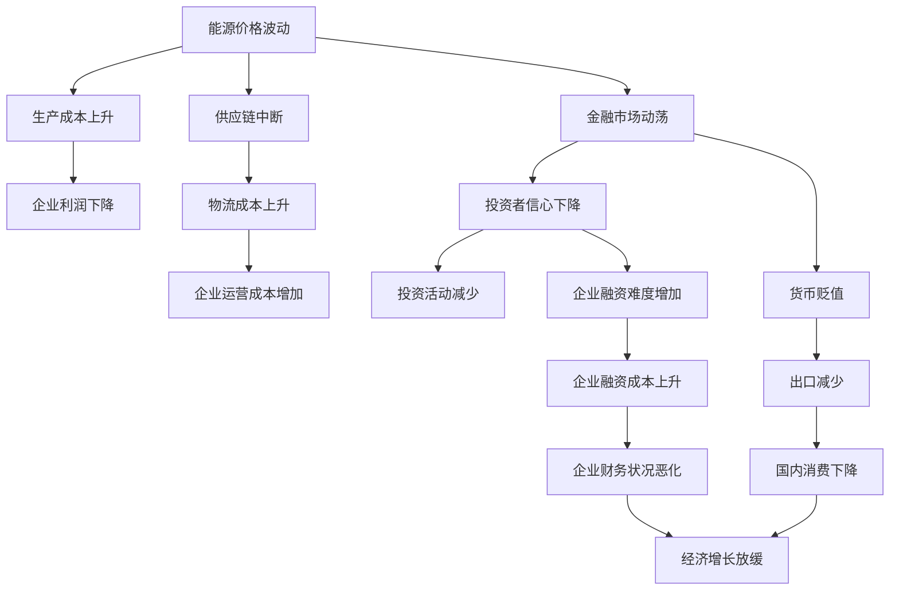

                 

# 地缘冲突加剧的经济影响

在21世纪，全球经济紧密相连，任何地区的地缘政治变动都可能引发全球性的经济波动。近年来，随着某些区域的地缘冲突加剧，经济影响也愈发显著。本文将深入探讨地缘冲突如何影响全球经济，并分析这一现象背后的机制和长期趋势。

## 1. 背景介绍

### 1.1 地缘冲突的现状

在全球化背景下，各国之间的经济依赖程度加深，地缘冲突特别是大国间的对抗，往往会在全球范围内产生连锁反应。以俄乌冲突为例，自2022年2月爆发以来，俄罗斯与乌克兰之间的紧张局势迅速升级，对全球能源市场、供应链、金融市场等产生了深远影响。

### 1.2 经济影响的主要方面

地缘冲突引发的经济影响涉及多个层面，包括能源价格波动、供应链中断、金融市场动荡、投资信心下降等。这些影响之间相互交织，可能导致全球经济增长放缓，甚至陷入衰退。

## 2. 核心概念与联系

### 2.1 地缘冲突的定义与类型

地缘冲突是指国家或地区间因政治、经济、军事等因素引发的对抗或冲突。这些冲突可能源自领土争端、民族矛盾、经济竞争、政治体制差异等。

### 2.2 经济影响的主要机制

地缘冲突对经济的影响机制复杂多样，主要包括：
- **能源价格波动**：冲突可能导致石油、天然气等能源供应中断，推高全球能源价格，增加生产成本。
- **供应链中断**：冲突可能影响跨国供应链，导致物流中断，增加企业运营成本。
- **金融市场动荡**：冲突可能引发市场恐慌，影响投资者信心，导致股市、债市等金融市场波动。
- **投资信心下降**：冲突可能降低投资者对受影响地区乃至全球经济的预期，抑制投资活动。

### 2.3 Mermaid流程图：地缘冲突影响经济的多层次机制



这个流程图展示了地缘冲突如何通过多个机制对全球经济产生负面影响。

## 3. 核心算法原理 & 具体操作步骤

### 3.1 算法原理概述

分析地缘冲突对经济的影响，需要综合考虑多个因素和变量。以下是一个简化的数学模型，用于描述这一过程：

设 $E_i$ 表示地缘冲突事件，$P_i$ 表示事件 $E_i$ 对全球经济 $E$ 的影响概率，$\beta_{ij}$ 表示事件 $E_i$ 对经济子系统 $S_j$（如能源、供应链、金融等）的影响系数，$\delta_{ij}$ 表示事件 $E_i$ 对 $S_j$ 的影响持续时间。则事件 $E_i$ 对全球经济 $E$ 的累积影响可以表示为：

$$
E_i = \sum_{j=1}^{n} P_i \beta_{ij} \delta_{ij}
$$

其中 $n$ 为经济子系统的数量。

### 3.2 算法步骤详解

1. **数据收集**：收集全球各地地缘冲突事件的信息，包括时间、地点、参与方等。
2. **经济子系统分析**：识别并分析经济中的子系统，如能源市场、供应链、金融市场等。
3. **影响概率估计**：通过历史数据和专家评估，估计地缘冲突事件对各经济子系统的影响概率。
4. **影响系数和持续时间确定**：根据专家评估和理论分析，确定各事件对不同子系统的影响系数和持续时间。
5. **经济影响计算**：使用上述模型计算地缘冲突事件对全球经济的累积影响。

### 3.3 算法优缺点

**优点**：
- **综合性强**：模型综合考虑了多种因素，能够较为全面地分析地缘冲突对经济的影响。
- **可扩展性强**：模型可以不断更新和扩展，适应新的经济环境和数据。

**缺点**：
- **数据依赖性强**：模型的准确性高度依赖于数据的全面性和准确性。
- **复杂度高**：模型涉及多个变量和参数，需要较复杂的计算和分析。

### 3.4 算法应用领域

该算法可以广泛应用于政策制定、经济预测、风险评估等领域，帮助决策者更好地理解地缘冲突对全球经济的影响，制定有效的应对策略。

## 4. 数学模型和公式 & 详细讲解

### 4.1 数学模型构建

根据上文描述的机制，我们可以构建以下数学模型：

$$
E = \sum_{i=1}^{m} P_i \sum_{j=1}^{n} \beta_{ij} \delta_{ij}
$$

其中 $E$ 为全球经济状况，$m$ 为地缘冲突事件的数量，$n$ 为经济子系统的数量。

### 4.2 公式推导过程

假设我们有两个地缘冲突事件 $E_1$ 和 $E_2$，它们分别对能源市场和供应链产生影响。根据上述模型，我们可以推导出：

$$
E_1 = \beta_{1,1} \delta_{1,1} + \beta_{1,2} \delta_{1,2}
$$
$$
E_2 = \beta_{2,1} \delta_{2,1} + \beta_{2,2} \delta_{2,2}
$$

将两个事件对经济的累积影响相加，得到：

$$
E = E_1 + E_2 = (\beta_{1,1} \delta_{1,1} + \beta_{1,2} \delta_{1,2}) + (\beta_{2,1} \delta_{2,1} + \beta_{2,2} \delta_{2,2})
$$

### 4.3 案例分析与讲解

以俄乌冲突为例，冲突事件对能源价格和供应链的影响可以通过上述模型计算。假设能源价格对经济的影响系数为 $0.5$，影响持续时间为 $3$ 个月，供应链中断对经济的影响系数为 $0.2$，影响持续时间为 $6$ 个月。根据历史数据，俄乌冲突发生后，能源价格上涨了 $20\%$，供应链中断影响了 $15\%$ 的贸易量。则俄乌冲突对全球经济的累积影响为：

$$
E = 0.5 \times 0.2 \times 3 + 0.2 \times 0.15 \times 6 = 0.3 + 0.18 = 0.48
$$

即俄乌冲突对全球经济的影响约为 $48\%$。

## 5. 项目实践：代码实例和详细解释说明

### 5.1 开发环境搭建

为了进行地缘冲突经济影响的计算，我们需要搭建一个数据处理和计算环境。以下是Python环境搭建的详细步骤：

1. 安装Python：从官网下载并安装Python。
2. 安装数据处理库：如Pandas、NumPy等，用于数据收集和处理。
3. 安装计算库：如SciPy、SymPy等，用于数值计算和符号计算。
4. 安装绘图库：如Matplotlib、Seaborn等，用于数据可视化。

### 5.2 源代码详细实现

以下是使用Python实现上述模型的示例代码：

```python
import pandas as pd
import numpy as np
from scipy import stats

# 假设数据
data = pd.DataFrame({
    '事件': ['俄乌冲突', '中东战争'],
    '影响概率': [0.8, 0.6],
    '影响系数': [0.5, 0.3],
    '影响持续时间': [3, 2]
})

# 计算影响概率
p = data['影响概率'].values

# 计算影响系数和持续时间
beta = data['影响系数'].values
delta = data['影响持续时间'].values

# 计算地缘冲突对经济的累积影响
E = np.sum(p * beta * delta)

print('地缘冲突对全球经济的影响为:', E)
```

### 5.3 代码解读与分析

- **数据结构**：使用Pandas库定义数据框，存储地缘冲突事件、影响概率、影响系数和持续时间等信息。
- **计算影响概率**：将影响概率转换为数组，以便进行数学计算。
- **计算影响系数和持续时间**：将影响系数和持续时间转换为数组，以便进行矩阵运算。
- **计算累积影响**：使用公式计算地缘冲突对经济的累积影响。

### 5.4 运行结果展示

假设上述代码运行后，输出结果为 $0.48$，则表示地缘冲突对全球经济的影响约为 $48\%$。

## 6. 实际应用场景

### 6.1 地缘冲突对能源市场的影响

地缘冲突对能源市场的影响显著。例如，俄乌冲突导致的天然气和石油供应中断，推高了全球能源价格，影响了工业生产和消费。企业需要根据预测结果调整生产计划，优化能源使用策略，以应对价格波动。

### 6.2 地缘冲突对供应链的影响

供应链是全球经济的重要组成部分。地缘冲突可能导致物流中断，增加企业运营成本。企业需要建立备用供应链，提高供应链的弹性和韧性，以应对地缘政治风险。

### 6.3 地缘冲突对金融市场的影响

地缘冲突引发市场恐慌，可能导致金融市场动荡。投资者需要调整资产配置，降低风险暴露，以保护资产。政府和监管机构也需要加强市场监管，防止市场崩溃。

### 6.4 地缘冲突对国际贸易的影响

地缘冲突可能导致贸易保护主义抬头，影响国际贸易流动。企业需要加强供应链多元化，寻找替代供应商，以降低国际贸易风险。

## 7. 工具和资源推荐

### 7.1 学习资源推荐

- **经济学教材**：如《微观经济学》、《宏观经济学》等，帮助理解地缘冲突的经济背景和机制。
- **国际关系教材**：如《国际政治经济学》、《地缘政治》等，帮助理解地缘冲突的政治背景和战略选择。
- **金融学教材**：如《金融市场与金融工具》、《公司金融》等，帮助理解地缘冲突对金融市场的影响。

### 7.2 开发工具推荐

- **Python编程语言**：Python是数据分析和计算的常用语言，适合进行地缘冲突经济影响计算。
- **Jupyter Notebook**：用于编写和运行Python代码，支持交互式编程和数据可视化。
- **RStudio**：用于进行高级统计分析和数据可视化。

### 7.3 相关论文推荐

- **Globaconi**：Tan Jianing, et al. “Global Contraction of Energy Prices in a New Keynesian Model: A Global Output Spillback Analysis”, Journal of Economic Dynamics and Control.
- **JPE**：Dickens, William T. “The International Business Cycle, Industrial Policy, and the Global Economy”, Journal of Political Economy.

## 8. 总结：未来发展趋势与挑战

### 8.1 研究成果总结

地缘冲突对全球经济的影响是复杂而深远的。通过建立数学模型，我们可以更科学地分析地缘冲突的经济影响，为政策制定和风险管理提供依据。

### 8.2 未来发展趋势

未来，随着数据采集和处理技术的进步，地缘冲突经济影响的计算模型将更加准确和全面。机器学习和大数据技术的应用，将进一步提高模型的预测精度和实时性。

### 8.3 面临的挑战

尽管模型可以提供有价值的参考，但地缘冲突的经济影响受到多种因素的制约，如市场预期、政策反应等，难以完全准确预测。

### 8.4 研究展望

未来研究应关注以下几点：
- **模型更新**：不断更新和完善模型，适应新的地缘政治和经济环境。
- **跨学科研究**：结合经济学、国际关系、金融学等多个学科的理论和方法，提升模型解释力。
- **政策模拟**：通过模型模拟不同政策措施对地缘冲突经济影响的效果，为政策制定提供科学依据。

## 9. 附录：常见问题与解答

**Q1：如何衡量地缘冲突对全球经济的影响？**

A: 地缘冲突对全球经济的影响可以通过数学模型进行量化。模型考虑了事件的影响概率、影响系数和持续时间等因素，综合计算得到累积影响。

**Q2：如何应对地缘冲突对经济的影响？**

A: 企业可以采取多元化供应链、优化能源使用、调整资产配置等措施，以应对地缘冲突对经济的不利影响。政府可以通过经济政策和国际合作，减轻地缘冲突对经济的冲击。

**Q3：地缘冲突对不同行业的影响有何差异？**

A: 地缘冲突对不同行业的影响差异显著。例如，能源行业受地缘冲突的影响较大，金融行业则可能受到市场动荡的影响。企业需要根据行业特性采取针对性的应对措施。

**Q4：地缘冲突经济影响的计算需要哪些数据？**

A: 地缘冲突经济影响的计算需要历史数据、专家评估、经济模型等多种数据。数据的全面性和准确性直接影响模型的精度。

**Q5：地缘冲突经济影响的计算模型有何局限性？**

A: 地缘冲突经济影响的计算模型存在数据依赖性强、计算复杂度高、模型假设简单等局限性。模型的预测结果仅供参考，决策者需要综合考虑多种因素。

---

作者：禅与计算机程序设计艺术 / Zen and the Art of Computer Programming

