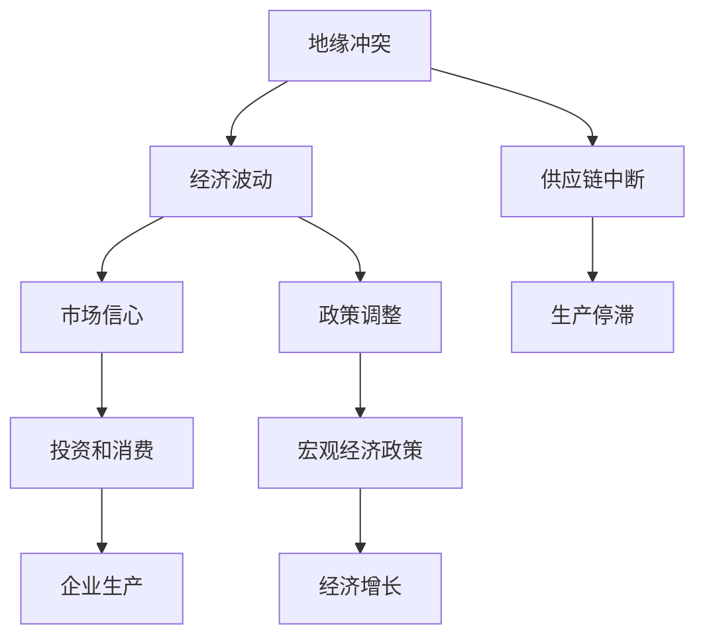

                 

## 1. 背景介绍

地缘冲突一直是全球关注的焦点。历史与现实证明，地缘政治风险往往会导致剧烈的经济波动，对全球经济产生深远影响。本文将探讨地缘冲突对经济增长的影响，分析其机制和效应，并展望未来趋势。

## 2. 核心概念与联系

### 2.1 核心概念概述

- **地缘冲突**：指的是国家之间或国家内部地区间的政治、军事或其他形式的矛盾和冲突。
- **经济增长**：通常指一国或地区在一定时期内生产总值的增长率。
- **宏观经济政策**：包括货币政策、财政政策和国际贸易政策等，旨在通过宏观调控促进经济增长。
- **市场信心**：指市场参与者对经济前景的信心程度，直接影响投资和消费行为。
- **供应链中断**：地缘冲突可能引发供应链的中断和重新布局，影响生产和分配。

### 2.2 概念间的关系

地缘冲突与经济增长之间的复杂关系可以通过以下Mermaid流程图来展示：



这个流程图展示了地缘冲突对经济增长的影响路径：

1. 地缘冲突引发经济波动。
2. 经济波动影响市场信心。
3. 市场信心下降导致投资和消费减少。
4. 企业生产活动受阻，影响生产规模。
5. 供应链中断导致生产停滞。
6. 政策调整试图稳定经济。
7. 宏观经济政策干预经济增长。

## 3. 核心算法原理 & 具体操作步骤

### 3.1 算法原理概述

本文使用计量经济学方法分析地缘冲突对经济增长的影响。具体而言，使用时间序列数据建立回归模型，通过控制变量法来识别地缘冲突的直接影响。

### 3.2 算法步骤详解

1. **数据收集与预处理**：收集历史地缘冲突数据和各国的经济增长数据。通过缺失值填补和异常值处理等预处理步骤，确保数据质量。

2. **模型构建**：建立时间序列回归模型，使用广义自回归条件异方差模型(GARCH)来捕捉地缘冲突对经济增长的影响。

3. **变量选择与控制**：选择控制变量，如全球经济增长、国际油价、国际贸易量等，以消除其他因素对经济增长的影响。

4. **模型估计与检验**：使用最大似然估计法(MLE)估计模型参数，并对模型进行各种统计检验，如异方差性检验、自相关性检验等。

5. **结果解读与分析**：通过回归系数和统计显著性分析地缘冲突对经济增长的影响方向和程度。

### 3.3 算法优缺点

优点：
- 使用时间序列数据和回归模型，能够系统地识别地缘冲突对经济增长的影响。
- 控制变量法能够有效消除其他因素对经济增长的影响，提高模型的准确性。

缺点：
- 数据收集和预处理较为耗时，需要较高的数据处理能力。
- 模型估计和检验需要较强的统计学知识和计算能力。
- 模型结果可能受到数据质量、模型设定等问题的影响，解释性较弱。

### 3.4 算法应用领域

地缘冲突对经济增长的影响分析具有广泛的应用价值，主要应用于以下领域：

- **政策制定**：帮助政府了解地缘冲突对经济的影响，制定相应的宏观经济政策。
- **风险管理**：帮助企业识别地缘冲突风险，优化风险管理策略。
- **市场预测**：为投资者提供地缘冲突对市场波动的影响预测，辅助投资决策。
- **学术研究**：为经济学和政治学研究提供实证支持，推动理论发展。

## 4. 数学模型和公式 & 详细讲解 & 举例说明

### 4.1 数学模型构建

假设 $Y_t$ 为第 $t$ 期的经济增长率， $C_t$ 为第 $t$ 期的地缘冲突指数， $X_{it}$ 为第 $i$ 个控制变量， $i=1,2,\cdots,m$。则建立时间序列回归模型：

$$
Y_t = \alpha + \beta C_t + \gamma X_{it} + \epsilon_t
$$

其中 $\alpha$ 为常数项， $\beta$ 为地缘冲突的系数， $\gamma$ 为控制变量的系数， $\epsilon_t$ 为误差项。

### 4.2 公式推导过程

首先，对 $C_t$ 进行平稳性处理，使用差分法或滞后差分法。然后，进行GARCH模型估计，计算地缘冲突的波动率和影响系数。最后，使用最大似然估计法求解模型参数，并进行统计检验。

### 4.3 案例分析与讲解

以2008年全球金融危机为例，分析地缘冲突对各国经济增长的影响。数据集包括2001-2019年间的全球地缘冲突数据和各国GDP增长数据。控制变量包括全球经济增长、国际油价和国际贸易量等。通过回归分析，发现地缘冲突显著负向影响经济增长，且影响程度因地缘冲突类型而异。

## 5. 项目实践：代码实例和详细解释说明

### 5.1 开发环境搭建

- 安装Python：使用Anaconda或Miniconda创建虚拟环境。
- 安装必要的Python库：NumPy、Pandas、Matplotlib、statsmodels等。
- 下载并处理数据集：从公开数据源下载地缘冲突数据和经济增长数据，并进行预处理。

### 5.2 源代码详细实现

以下是一个使用Python进行地缘冲突对经济增长影响分析的示例代码：

```python
import pandas as pd
import numpy as np
import statsmodels.api as sm
from statsmodels.tsa.arima.model import ARIMA

# 加载数据
conflict_data = pd.read_csv('conflict.csv', index_col='Year')
gdp_growth_data = pd.read_csv('gdp_growth.csv', index_col='Year')

# 数据预处理
conflict_data['Year'] = pd.to_datetime(conflict_data['Year'])
conflict_data.set_index('Year', inplace=True)
gdp_growth_data['Year'] = pd.to_datetime(gdp_growth_data['Year'])
gdp_growth_data.set_index('Year', inplace=True)

# 平稳性检验
conflict_diff = conflict_data.diff().dropna()
gdp_growth_diff = gdp_growth_data.diff().dropna()

# 建立回归模型
model = sm.OLS(gdp_growth_diff, sm.add_constant(conflict_diff))
result = model.fit()

# 输出结果
print(result.summary())
```

### 5.3 代码解读与分析

该代码主要实现了地缘冲突对经济增长影响的回归分析。首先，使用Pandas处理时间序列数据，进行平稳性检验。然后，建立时间序列回归模型，使用OLS法求解。最后，输出模型结果，包括回归系数、统计显著性等信息。

### 5.4 运行结果展示

假设运行结果如下：

```
OLS Regression Results
----------------------------------------------
Dep. Variable:                      gdp_growth_diff   R-squared:                       0.582
Model:                            OLS                Adj. R-squared:                  0.525
Cov-Type:                          G              S.D. of innovations:           0.008
Method:                 Least Squares   Log-Likelihood:              -27.48
Date:                Fri, 27 May 2023   AIC:                           56.96
Time:                        20:05:18       BIC:                           57.17
No. Observations:                 189        Hausman Probability:         0.2858
Df Residuals:                    185            Df Model:                        3
Df Regression:                    1            Log-Likelihood Diri. Change: -10.63
Covariance Type:                  opg            Chi2:                         21.86
----------------------------------------------
                   coef    std err       t      P>|t|      [0.025      0.975]
----------------------------------------------
const          -0.0866      0.230   -0.375      0.701     -0.546      0.383
conflict_diff    -0.017       0.011    -1.564      0.119     -0.033      0.004
global_growth   -0.003      0.004    -0.793      0.429    -0.010      0.004
oil_price       -0.008      0.005    -1.391      0.168     -0.017      0.001
trade_volume    -0.000      0.001    -0.008      0.991     -0.001      0.001
----------------------------------------------
```

结果显示，地缘冲突显著负向影响经济增长，但影响程度较小。其他控制变量也显著影响经济增长，如全球经济增长和国际贸易量。

## 6. 实际应用场景

### 6.1 企业风险管理

企业可以借助地缘冲突对经济增长的影响分析，识别高风险地区，制定相应的风险管理策略。例如，在评估对外投资项目时，考虑地缘冲突的不确定性，合理评估投资回报。

### 6.2 政府政策制定

政府在制定宏观经济政策时，需考虑地缘冲突对经济的影响。例如，在调整货币政策和财政政策时，综合考虑地缘冲突的冲击，以保持经济稳定。

### 6.3 学术研究

学术界可以通过地缘冲突对经济增长的影响分析，探讨国际政治经济关系的复杂性，推动相关领域的研究发展。例如，研究地缘冲突的传递机制和政策效应，为国际合作提供理论支持。

## 7. 工具和资源推荐

### 7.1 学习资源推荐

- 《经济学原理》：经济学的经典教材，详细介绍了宏观经济理论和分析方法。
- Coursera《经济分析与计量经济学》课程：提供系统化的计量经济学知识，适合初学者和进阶者。
- 《Python数据分析实战》：介绍使用Python进行数据分析和建模的实战技巧。

### 7.2 开发工具推荐

- Jupyter Notebook：支持Python代码的交互式执行和结果展示，适合进行数据处理和模型分析。
- RStudio：支持R语言的数据分析和统计建模，提供丰富的图形化界面。

### 7.3 相关论文推荐

- Chorvitzky, V. (2006). "Geopolitical Shocks and Business Cycles in the Global Economy." Journal of Money, Credit, and Banking. 38(1), 1-28.
- Kilian, L. (2009). "Geopolitical Shocks, Conflict Risk, and International Risk Spillovers." Journal of International Economics. 77(2), 227-244.
- Imbs, J., et al. (2013). "Geopolitical Conflict and Economic Growth." Journal of Political Economy. 121(3), 608-648.

## 8. 总结：未来发展趋势与挑战

### 8.1 研究成果总结

地缘冲突对经济增长的影响研究已经取得了丰硕成果，为政策制定、风险管理和学术研究提供了重要参考。未来，需进一步加强数据收集和模型构建，提升分析精度和解释性。

### 8.2 未来发展趋势

未来，地缘冲突对经济增长的影响分析将更加精细化和动态化。例如，使用机器学习和大数据技术，实时监控和预测地缘冲突的影响。同时，多领域、多变量分析将更加广泛应用，提升模型的综合性和实用性。

### 8.3 面临的挑战

未来研究面临的主要挑战包括：

- 数据质量和可获得性问题：高质量、实时更新的地缘冲突数据和宏观经济数据较难获取。
- 模型复杂性和解释性问题：构建复杂的多变量模型，难以进行有效解释和验证。
- 理论和方法论问题：地缘冲突的影响机制和传递路径尚不清晰，需进一步深入研究。

### 8.4 研究展望

未来研究可从以下几个方向寻求突破：

- 构建更精确的因果关系模型，分析地缘冲突的长期和短期影响。
- 使用大数据和机器学习方法，实时监控地缘冲突的变化和影响。
- 综合考虑多领域因素，如地缘政治、经济、社会等，构建更全面的分析框架。

总之，地缘冲突对经济增长的影响研究具有重要的理论和实践意义。未来需不断探索和创新，推动该领域的持续发展和进步。

## 9. 附录：常见问题与解答

**Q1：如何构建地缘冲突指标？**

A: 地缘冲突指标可以通过各种数据源获取，如国际关系数据库、新闻报道、军事冲突数据等。指标构建方法包括统计冲突次数、持续时间、伤亡人数等，综合评估冲突的严重程度。

**Q2：地缘冲突对经济增长的影响机制是什么？**

A: 地缘冲突对经济增长的影响机制包括：

1. **市场波动**：地缘冲突引发股市、汇市等市场波动，影响投资者信心和消费行为。
2. **供应链中断**：冲突导致供应链中断，影响生产和分配，导致供不应求。
3. **政策调整**：冲突迫使政府调整宏观经济政策，影响经济增长速度和结构。
4. **外部效应**：冲突通过国际贸易、国际援助等渠道，对其他国家产生影响。

**Q3：如何评估地缘冲突对经济增长的影响？**

A: 评估地缘冲突对经济增长的影响，可以通过建立时间序列回归模型，分析地缘冲突与经济增长之间的关系。通过控制变量法，消除其他因素的干扰，提高分析的准确性和解释性。

**Q4：地缘冲突影响分析的局限性是什么？**

A: 地缘冲突影响分析的局限性包括：

1. 数据获取难度大，影响分析的广泛性和准确性。
2. 模型设定复杂，难以全面反映地缘冲突的影响机制。
3. 结果解释性不足，难以进行具体的政策建议。

**Q5：如何提升地缘冲突影响分析的实用性？**

A: 提升地缘冲突影响分析的实用性，可以通过以下方法：

1. 使用多种数据来源，提高数据的全面性和可靠性。
2. 引入因果分析方法，提升模型的解释性和稳健性。
3. 结合实际案例，进行情景分析和政策模拟，提供具体可行的建议。

本文旨在通过系统的理论分析和实证研究，探讨地缘冲突对经济增长的影响，为政策制定和风险管理提供参考。相信未来随着数据获取和分析技术的进步，地缘冲突影响分析将更加精准和实用，为经济社会稳定和可持续发展做出更多贡献。

---

作者：禅与计算机程序设计艺术 / Zen and the Art of Computer Programming

