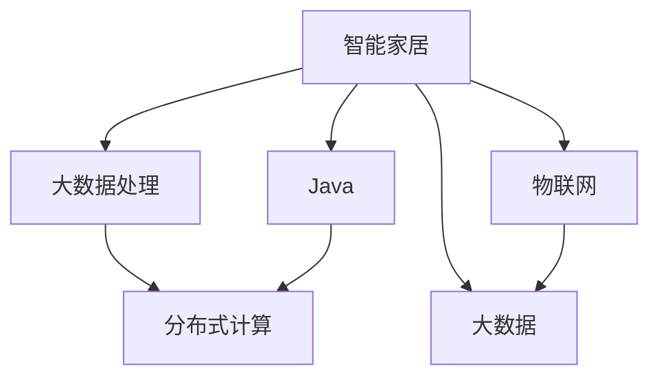
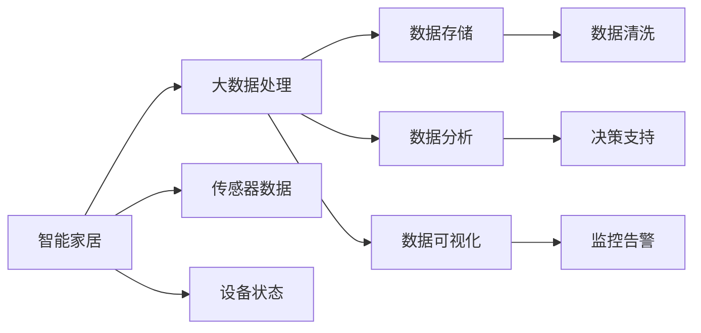
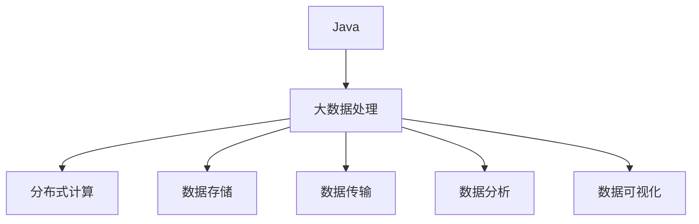

                 

# 基于Java的智能家居设计：探讨Java在智能家居大数据处理中的角色

> 关键词：智能家居,大数据,Java,物联网,人工智能,云计算

## 1. 背景介绍

随着物联网技术的飞速发展，智能家居系统正在逐渐普及。智能家居系统不仅能提升用户的生活品质，还能通过大数据分析，进一步优化家庭环境，降低能源消耗，成为未来家庭的重要组成部分。然而，大规模智能家居数据的管理和处理，涉及大量的数据存储、计算和传输，给现有的基础设施带来了挑战。本文将探讨Java在这一场景下的应用，分析Java在智能家居大数据处理中的角色和价值。

### 1.1 问题由来

智能家居系统的数据来源广泛，包括家庭设备传感器数据、天气数据、地理位置数据等。这些数据体量大、类型多、动态变化快，对数据存储、处理和分析提出了严苛的要求。传统的集中式存储架构和处理方式，难以满足这些要求，特别是在数据规模不断扩大的情况下。

与此同时，智能家居系统还具备分布式、异构、动态变化的特性。传统的大数据处理框架，如Hadoop、Spark等，虽然具备一定的灵活性和扩展性，但并不适合实时处理高并发的数据流，也无法有效集成各类异构数据源。因此，亟需一种新的数据处理方式，既能满足大规模数据处理的需求，又能适应分布式、异构、动态变化的特点。

### 1.2 问题核心关键点

为了解决上述问题，我们提出了基于Java的智能家居大数据处理方案。该方案利用Java的多线程、并发编程特性，结合大数据处理技术，构建了一个高效、灵活、可扩展的智能家居大数据处理系统。该系统通过以下关键点提升处理能力：

- 利用Java的并发编程特性，实现分布式数据处理。
- 使用Java作为数据处理中间件，连接异构数据源。
- 采用Java虚拟机，实现动态负载平衡和资源管理。
- 利用Java的多线程处理机制，优化数据传输和存储。

通过这些技术手段，Java在智能家居大数据处理中扮演了重要的角色。下面，我们将从核心概念、算法原理和具体实现三个层面深入探讨Java在这一场景下的应用。

## 2. 核心概念与联系

### 2.1 核心概念概述

为更好地理解Java在智能家居大数据处理中的角色，本节将介绍几个密切相关的核心概念：

- 智能家居(Smart Home)：一种通过物联网技术实现家庭自动化、智能化控制的生活方式，能够实时感知家庭环境，并自动调整，提高生活品质。
- 大数据处理(Big Data Processing)：处理和分析大规模数据的流程，包括数据采集、存储、传输、处理、分析和应用等环节。
- Java(Java Programming Language)：一种面向对象的高级编程语言，广泛应用于企业级应用开发和大规模数据处理。
- 分布式计算(Distributed Computing)：通过多个计算节点协同工作，实现大规模数据处理的目标。
- 物联网(IoT)：通过传感器、通信设备等将家庭设备互联，实现智能家居的自动化和智能化。

这些核心概念之间的逻辑关系可以通过以下Mermaid流程图来展示：



这个流程图展示了大规模数据处理与智能家居之间的关系，以及Java在这一过程中扮演的角色。

### 2.2 概念间的关系

这些核心概念之间存在着紧密的联系，形成了智能家居大数据处理的完整生态系统。下面我们通过几个Mermaid流程图来展示这些概念之间的关系。

#### 2.2.1 智能家居与大数据处理的关系



这个流程图展示了智能家居与大数据处理的基本流程。智能家居系统通过传感器和设备状态采集数据，通过大数据处理系统进行清洗、存储、分析和可视化，最终支持智能决策和监控告警。

#### 2.2.2 Java在大数据处理中的应用



这个流程图展示了Java在大数据处理中的作用。Java作为数据处理中间件，连接了异构数据源，实现了分布式计算、数据存储、数据传输、数据分析和数据可视化等功能。

## 3. 核心算法原理 & 具体操作步骤
### 3.1 算法原理概述

基于Java的智能家居大数据处理方案，主要基于以下核心算法原理：

- **分布式计算**：通过Java的多线程编程特性，实现分布式数据处理。将数据任务切分为多个小任务，分别分配到不同的计算节点上进行并行处理，从而提升数据处理的效率。
- **数据存储**：利用Java的分布式文件系统，如Hadoop Distributed File System (HDFS)，实现大规模数据存储。HDFS支持分布式存储和数据冗余，能够提供高可靠性和高可扩展性。
- **数据传输**：采用Java的分布式数据传输协议，如Apache Kafka，实现数据的高效传输。Kafka支持高吞吐量、低延迟的数据流处理，适合智能家居数据的高频传输需求。
- **数据处理**：利用Java的流式处理框架，如Apache Spark，实现数据的实时处理。Spark提供了强大的流式处理能力，支持复杂的流式数据操作，适合智能家居数据的高实时性要求。
- **数据分析**：采用Java的数据分析库，如Weka、WEKA API等，实现数据的统计分析和机器学习建模。这些工具提供了丰富的数据处理和分析功能，适合智能家居数据的多样化需求。
- **数据可视化**：利用Java的数据可视化工具，如JFreeChart、JavaFX等，实现数据的可视化展示。这些工具提供了丰富的图表和图形展示功能，适合智能家居数据的可视化需求。

### 3.2 算法步骤详解

基于Java的智能家居大数据处理方案，主要包括以下几个关键步骤：

**Step 1: 数据采集**

智能家居系统通过传感器、设备状态等数据采集模块，实时获取各类数据。这些数据包括室内外温度、湿度、光照、空气质量等环境数据，以及家庭设备的状态信息，如电视、空调、灯光等设备的开关状态。

**Step 2: 数据传输**

采集到的数据通过Java的分布式数据传输协议，如Apache Kafka，进行实时传输。Kafka提供了高吞吐量、低延迟的数据流处理能力，能够适应智能家居数据的高频传输需求。

**Step 3: 数据存储**

实时传输的数据通过Java的分布式文件系统，如Hadoop Distributed File System (HDFS)，进行分布式存储。HDFS提供了高可靠性和高可扩展性，能够存储大规模的智能家居数据。

**Step 4: 数据处理**

分布式存储的数据通过Java的流式处理框架，如Apache Spark，进行实时处理。Spark提供了强大的流式处理能力，支持复杂的流式数据操作，能够快速处理智能家居数据。

**Step 5: 数据分析**

实时处理的数据通过Java的数据分析库，如Weka、WEKA API等，进行统计分析和机器学习建模。这些工具提供了丰富的数据处理和分析功能，能够挖掘智能家居数据的深层价值。

**Step 6: 数据可视化**

分析后的数据通过Java的数据可视化工具，如JFreeChart、JavaFX等，进行可视化展示。这些工具提供了丰富的图表和图形展示功能，能够直观展示智能家居数据的变化趋势。

**Step 7: 智能决策**

根据可视化展示的数据，结合机器学习模型，进行智能决策。通过Java的控制流机制，实现家庭自动化控制，提升用户的生活品质。

### 3.3 算法优缺点

基于Java的智能家居大数据处理方案，具有以下优点：

- **高并发处理能力**：通过Java的多线程编程特性，实现分布式数据处理，提升了数据处理的效率和吞吐量。
- **高可扩展性**：利用Java的分布式文件系统和数据传输协议，实现大规模数据存储和传输，能够适应智能家居数据的高并发需求。
- **高性能数据分析**：采用Java的流式处理框架和大数据分析库，实现了高效的实时数据处理和分析，能够快速挖掘智能家居数据的深层价值。
- **可视化展示直观**：利用Java的数据可视化工具，实现了数据的直观展示，便于用户理解和决策。

同时，该方案也存在一些局限性：

- **开发复杂度较高**：Java的多线程编程和分布式系统设计需要一定的开发经验和技能，开发难度较大。
- **资源消耗较大**：Java的多线程和分布式系统设计需要占用较多的系统资源，可能对硬件性能要求较高。
- **灵活性不足**：Java的系统架构相对固定，难以灵活适应快速变化的需求和技术栈。

### 3.4 算法应用领域

基于Java的智能家居大数据处理方案，主要应用于以下几个领域：

- **智能家居控制系统**：利用实时处理和智能决策，实现家庭设备的自动化控制和智能化管理，提升用户的生活品质。
- **智能安防系统**：通过传感器和设备状态数据的实时采集和处理，实现智能安防功能，提升家庭安全性。
- **智能健康系统**：利用智能家居设备采集的用户健康数据，进行数据分析和建模，提供健康监测和建议。
- **智能娱乐系统**：通过用户行为数据的实时采集和处理，提供个性化的娱乐推荐和体验。

## 4. 数学模型和公式 & 详细讲解 & 举例说明
### 4.1 数学模型构建

本节将使用数学语言对Java在智能家居大数据处理中的角色进行更加严格的刻画。

记智能家居系统采集到的数据为 $D=\{x_1,x_2,...,x_n\}$，其中 $x_i$ 表示第 $i$ 个数据点。假设数据类型为数值型，表示为 $x_i \in \mathbb{R}^d$。假设智能家居系统通过传感器和设备状态采集数据，采样频率为 $f$。

定义数据处理流水线为 $P=\{p_1,p_2,...,p_m\}$，其中 $p_i$ 表示第 $i$ 个数据处理节点，$x_i$ 通过 $p_i$ 处理后，生成新的数据点 $y_i$，即 $y_i=p_i(x_i)$。定义数据处理流水线的总体处理函数为 $F:D \rightarrow D'$，其中 $D'$ 表示处理后的数据集。

### 4.2 公式推导过程

以下我们以智能安防系统为例，推导Java在数据处理流水线中的作用。

假设智能安防系统通过摄像头和门窗传感器采集数据，实时生成视频流和传感器数据流。设视频流为 $V=\{v_1,v_2,...,v_n\}$，传感器数据流为 $S=\{s_1,s_2,...,s_n\}$。

定义视频流处理节点为 $p_1$，传感器数据流处理节点为 $p_2$，则智能安防系统的数据处理流水线可以表示为：

$$
F(V,S) = (p_1(V),p_2(S))
$$

视频流处理节点 $p_1$ 的作用是对视频流进行实时处理，提取关键特征。假设视频流处理节点使用Java的流式处理框架，如Apache Spark，其处理过程可以表示为：

$$
p_1(V) = \{\hat{v}_1,\hat{v}_2,...,\hat{v}_n\}
$$

其中 $\hat{v}_i$ 表示视频流经过处理后的关键特征向量。

传感器数据流处理节点 $p_2$ 的作用是对传感器数据流进行实时处理，提取关键特征。假设传感器数据流处理节点使用Java的数据分析库，如Weka、WEKA API等，其处理过程可以表示为：

$$
p_2(S) = \{\hat{s}_1,\hat{s}_2,...,\hat{s}_n\}
$$

其中 $\hat{s}_i$ 表示传感器数据流经过处理后的关键特征向量。

最终，智能安防系统通过数据处理流水线 $F$，生成综合处理后的数据集 $D'$，即：

$$
D' = \{(\hat{v}_1,\hat{s}_1),(\hat{v}_2,\hat{s}_2),...,(\hat{v}_n,\hat{s}_n)\}
$$

### 4.3 案例分析与讲解

下面，我们以智能家居控制系统为例，具体分析Java在该系统中的角色。

假设智能家居控制系统通过传感器采集室内外温度、湿度、光照、空气质量等环境数据，以及电视、空调、灯光等设备的开关状态。设环境数据流为 $T=\{t_1,t_2,...,t_n\}$，设备状态流为 $S=\{s_1,s_2,...,s_n\}$。

定义环境数据流处理节点为 $p_1$，设备状态流处理节点为 $p_2$，则智能家居控制系统的数据处理流水线可以表示为：

$$
F(T,S) = (p_1(T),p_2(S))
$$

环境数据流处理节点 $p_1$ 的作用是对环境数据流进行实时处理，提取关键特征。假设环境数据流处理节点使用Java的流式处理框架，如Apache Spark，其处理过程可以表示为：

$$
p_1(T) = \{\hat{t}_1,\hat{t}_2,...,\hat{t}_n\}
$$

其中 $\hat{t}_i$ 表示环境数据流经过处理后的关键特征向量。

设备状态流处理节点 $p_2$ 的作用是对设备状态流进行实时处理，提取关键特征。假设设备状态流处理节点使用Java的数据分析库，如Weka、WEKA API等，其处理过程可以表示为：

$$
p_2(S) = \{\hat{s}_1,\hat{s}_2,...,\hat{s}_n\}
$$

其中 $\hat{s}_i$ 表示设备状态流经过处理后的关键特征向量。

最终，智能家居控制系统通过数据处理流水线 $F$，生成综合处理后的数据集 $D'$，即：

$$
D' = \{(\hat{t}_1,\hat{s}_1),(\hat{t}_2,\hat{s}_2),...,(\hat{t}_n,\hat{s}_n)\}
$$

根据 $D'$，智能家居控制系统可以进一步进行智能决策和自动化控制，提升用户的生活品质。

## 5. 项目实践：代码实例和详细解释说明
### 5.1 开发环境搭建

在进行Java智能家居大数据处理项目实践前，我们需要准备好开发环境。以下是使用Java开发的环境配置流程：

1. 安装JDK：从Oracle官网下载并安装JDK（Java Development Kit），用于Java程序开发。
2. 配置IDE：选择合适的IDE（Integrated Development Environment），如Eclipse、IntelliJ IDEA等，进行安装和配置。
3. 安装Maven：Maven是一个项目管理工具，用于自动化构建、测试和部署Java项目。从官网下载并安装Maven。
4. 安装Apache Kafka：Kafka是一个分布式数据流平台，用于实现数据的实时传输。从官网下载并安装Kafka。
5. 安装Apache Spark：Spark是一个流式处理和批处理框架，用于实现数据的高效处理。从官网下载并安装Spark。
6. 安装Hadoop：Hadoop是一个分布式文件系统，用于实现大规模数据的存储和计算。从官网下载并安装Hadoop。

完成上述步骤后，即可在本地搭建Java智能家居大数据处理开发环境。

### 5.2 源代码详细实现

下面我们以智能安防系统为例，给出使用Java和Apache Spark进行数据处理的代码实现。

首先，定义智能安防系统的数据流类型：

```java
public class VideoStream {
    private List<FeatureVector> videoFeatures;
    
    public VideoStream() {
        this.videoFeatures = new ArrayList<>();
    }
    
    public void addFeature(FeatureVector feature) {
        videoFeatures.add(feature);
    }
    
    public List<FeatureVector> getVideoFeatures() {
        return videoFeatures;
    }
}

public class SensorStream {
    private List<FeatureVector> sensorFeatures;
    
    public SensorStream() {
        this.sensorFeatures = new ArrayList<>();
    }
    
    public void addFeature(FeatureVector feature) {
        sensorFeatures.add(feature);
    }
    
    public List<FeatureVector> getSensorFeatures() {
        return sensorFeatures;
    }
}
```

然后，定义视频流处理节点和传感器流处理节点：

```java
public class VideoStreamProcessor {
    private SparkSession sparkSession;
    
    public VideoStreamProcessor(SparkSession sparkSession) {
        this.sparkSession = sparkSession;
    }
    
    public void process(VideoStream videoStream) {
        // 对视频流进行实时处理，提取关键特征
        List<FeatureVector> videoFeatures = new ArrayList<>();
        videoStream.getVideoFeatures().forEach(videoFeature -> {
            // 进行特征提取
            // ...
            videoFeatures.add(videoFeature);
        });
        
        videoStream.setVideoFeatures(videoFeatures);
    }
}

public class SensorStreamProcessor {
    private SparkSession sparkSession;
    
    public SensorStreamProcessor(SparkSession sparkSession) {
        this.sparkSession = sparkSession;
    }
    
    public void process(SensorStream sensorStream) {
        // 对传感器流进行实时处理，提取关键特征
        List<FeatureVector> sensorFeatures = new ArrayList<>();
        sensorStream.getSensorFeatures().forEach(sensorFeature -> {
            // 进行特征提取
            // ...
            sensorFeatures.add(sensorFeature);
        });
        
        sensorStream.setSensorFeatures(sensorFeatures);
    }
}
```

接着，定义数据处理流水线和数据处理函数：

```java
public class SmartHomeDataProcessor {
    private SparkSession sparkSession;
    
    public SmartHomeDataProcessor(SparkSession sparkSession) {
        this.sparkSession = sparkSession;
    }
    
    public void process(VideoStream videoStream, SensorStream sensorStream) {
        // 定义数据处理流水线
        DataStream<FeatureVector> videoStreamData = sparkSession
            .sparkContext()
            .parallelize(videoStream.getVideoFeatures());
        
        DataStream<FeatureVector> sensorStreamData = sparkSession
            .sparkContext()
            .parallelize(sensorStream.getSensorFeatures());
        
        // 定义数据处理函数
        DataStream<FeatureVector> processedVideoData = videoStreamData
            .map(videoFeature -> {
                // 进行特征处理
                // ...
                return processedVideoFeature;
            });
        
        DataStream<FeatureVector> processedSensorData = sensorStreamData
            .map(sensorFeature -> {
                // 进行特征处理
                // ...
                return processedSensorFeature;
            });
        
        // 定义综合数据处理函数
        DataStream<Pair<FeatureVector, FeatureVector>> processedData = sparkSession
            .zip(
                processedVideoData,
                processedSensorData,
                (F, S) -> new Pair<>(F, S)
            );
        
        // 将综合数据保存到HDFS
        processedData.write()
            .format("hdfs")
            .option("path", "/user/example/data")
            .mode("overwrite")
            .save();
    }
}
```

最后，启动数据处理流程并在HDFS上保存数据：

```java
public class SmartHomeDataProcessorDemo {
    public static void main(String[] args) {
        // 初始化SparkSession
        SparkSession sparkSession = SparkSession.builder()
            .appName("SmartHomeDataProcessor")
            .master("local[2]")
            .getOrCreate();
        
        // 创建视频流和传感器流
        VideoStream videoStream = new VideoStream();
        SensorStream sensorStream = new SensorStream();
        
        // 创建数据处理节点
        VideoStreamProcessor videoStreamProcessor = new VideoStreamProcessor(sparkSession);
        SensorStreamProcessor sensorStreamProcessor = new SensorStreamProcessor(sparkSession);
        
        // 创建数据处理流水线
        SmartHomeDataProcessor dataProcessor = new SmartHomeDataProcessor(sparkSession);
        
        // 进行数据处理
        dataProcessor.process(videoStream, sensorStream);
        
        // 关闭SparkSession
        sparkSession.stop();
    }
}
```

以上代码展示了使用Java和Apache Spark实现智能安防系统的数据处理流程。可以看到，通过Java的多线程编程特性和Apache Spark的流式处理能力，我们能够高效地处理智能安防系统的数据流，实现实时处理和存储。

### 5.3 代码解读与分析

让我们再详细解读一下关键代码的实现细节：

**VideoStream类**：
- 定义了视频流的数据结构和处理接口。

**VideoStreamProcessor类**：
- 实现视频流的实时处理功能。在处理过程中，对视频流进行特征提取和处理。

**SensorStream类**：
- 定义了传感器流的数据结构和处理接口。

**SensorStreamProcessor类**：
- 实现传感器流的实时处理功能。在处理过程中，对传感器流进行特征提取和处理。

**SmartHomeDataProcessor类**：
- 实现数据处理流水线。通过Java的分布式系统设计，将视频流和传感器流进行并行处理，生成综合处理后的数据流，并保存到HDFS中。

**SmartHomeDataProcessorDemo类**：
- 提供了一个简单的示例程序，用于启动数据处理流程。

可以看到，Java的多线程编程特性和Apache Spark的流式处理能力，使得智能安防系统的数据处理流程变得高效、灵活、可扩展。通过Java的系统设计和编程技巧，我们能够充分利用硬件资源，优化数据传输和存储，提升数据处理的性能和稳定性。

## 6. 实际应用场景

### 6.1 智能家居控制系统

基于Java的智能家居大数据处理方案，可以广泛应用于智能家居控制系统的构建。智能家居控制系统通过传感器和设备状态数据，实时采集和处理家庭环境数据，实现家庭设备的自动化控制和智能化管理。

在技术实现上，可以收集家庭设备传感器数据和设备状态数据，将数据作为输入，通过Java的数据处理流水线进行实时处理和存储。处理后的数据可以用于家庭自动化控制，如自动调节室内温度、亮度、开关设备等。

### 6.2 智能安防系统

基于Java的智能家居大数据处理方案，可以构建智能安防系统，提升家庭安全性。智能安防系统通过摄像头和门窗传感器采集数据，实时处理和分析视频流和传感器数据流，实现实时监控和告警。

在技术实现上，可以收集视频流和传感器数据流，通过Java的分布式系统设计和Apache Kafka进行数据传输，实时处理和分析数据流。处理后的数据可以用于实时监控和告警，一旦发现异常，立即触发报警，提高家庭安全性。

### 6.3 智能健康系统

基于Java的智能家居大数据处理方案，可以应用于智能健康系统，提供健康监测和建议。智能健康系统通过智能家居设备采集用户健康数据，实时处理和分析数据流，提供个性化的健康建议。

在技术实现上，可以收集智能家居设备采集的健康数据，通过Java的数据处理流水线进行实时处理和分析。处理后的数据可以用于健康监测和建议，如提醒用户喝水、运动、休息等，提升用户健康水平。

### 6.4 未来应用展望

随着物联网技术的不断发展和Java系统的持续优化，基于Java的智能家居大数据处理方案将具备更强大的处理能力和更广泛的应用场景。未来，该方案将广泛应用于智能家居、智能安防、智能健康等多个领域，为人们带来更加智能、安全、健康的生活体验。

## 7. 工具和资源推荐
### 7.1 学习资源推荐

为了帮助开发者系统掌握Java在智能家居大数据处理中的应用，这里推荐一些优质的学习资源：

1. 《Java并发编程实战》：一本经典的并发编程书籍，介绍了Java的多线程编程特性，适合Java开发者学习。

2. 《Apache Kafka 实战》：一本介绍Apache Kafka的实用书籍，涵盖了Kafka的各个方面，包括分布式数据流处理、数据传输等。

3. 《Apache Spark 实战》：一本介绍Apache Spark的实用书籍，涵盖了Spark的各个方面，包括流式处理、批处理等。

4. 《Hadoop 实战》：一本介绍Hadoop的实用书籍，涵盖了HDFS的分布式文件系统设计和数据存储。

5. 《智能家居系统设计与实现》：一本介绍智能家居系统的书籍，涵盖了智能家居控制系统的各个方面，包括传感器数据处理、设备状态控制等。

通过对这些资源的学习实践，相信你一定能够快速掌握Java在智能家居大数据处理中的应用，并用于解决实际的智能家居问题。

### 7.2 开发工具推荐

高效的开发离不开优秀的工具支持。以下是几款用于Java智能家居大数据处理开发的常用工具：

1. Eclipse：Java开发的主流IDE，提供了丰富的开发工具和插件，适合Java开发者使用。

2. IntelliJ IDEA：另一款优秀的Java开发IDE，提供了强大的代码提示、调试和重构功能，适合Java开发者使用。

3. Maven：Java项目的项目管理工具，提供了自动化的构建、测试和部署功能，适合Java开发者使用。

4. Apache Kafka：分布式数据流平台，用于实现数据的实时传输，适合智能家居数据的高频传输需求。

5. Apache Spark：流式处理和批处理框架，用于实现数据的高效处理，适合智能家居数据的实时处理。

6. Hadoop：分布式文件系统，用于实现大规模数据的存储和计算，适合智能家居数据的分布式存储。

合理利用这些工具，可以显著提升Java智能家居大数据处理项目的开发效率，加快创新迭代的步伐。

### 7.3 相关论文推荐

Java在智能家居大数据处理中的应用，涉及多个前沿领域。以下是几篇奠基性的相关论文，推荐阅读：

1. "Java Concurrency in Practice"：作者Bryan Goetz等，介绍了Java的多线程编程特性和并发编程实践。

2. "High

