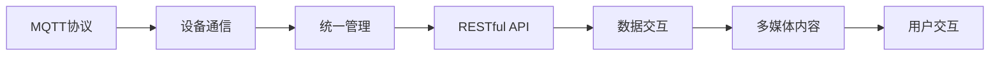

                 

# 基于MQTT协议和RESTful API的智能家居多媒体娱乐系统

## 1. 背景介绍

在当今的智能家居环境中，多媒体娱乐系统的应用越来越普及。无论是家庭影院、智能音箱，还是游戏机、虚拟现实设备，都为家庭用户提供了更加丰富多样的娱乐体验。然而，传统的家居娱乐系统常常面临设备互联性差、用户操作复杂、互动体验不够智能等问题。为此，我们提出基于MQTT协议和RESTful API的智能家居多媒体娱乐系统，旨在通过统一的设备管理和数据交互机制，提升家居娱乐系统的智能化水平。

## 2. 核心概念与联系

### 2.1 核心概念概述

- **MQTT（Message Queuing Telemetry Transport）协议**：一种轻量级、高可靠性的通信协议，特别适用于IoT设备之间的数据交互。MQTT协议采用发布/订阅（Publish/Subscribe）机制，避免了传统TCP协议的复杂性，使得设备的通信更加高效。

- **RESTful API（Representational State Transfer API）**：一种基于HTTP的轻量级Web服务架构风格，通过标准的HTTP方法（GET、POST、PUT、DELETE等）进行数据交互。RESTful API具有良好的可扩展性、可维护性和易用性，是现代Web应用的核心技术。

- **智能家居多媒体娱乐系统**：一个集成了多种多媒体设备，通过统一的控制平台和数据交互机制，实现设备之间互联互通、内容自动推送和用户个性化体验的智能家居系统。

### 2.2 核心概念之间的关系

通过MQTT协议和RESTful API，智能家居多媒体娱乐系统构建了一个高效、灵活、可靠的数据交互框架。具体来说，MQTT协议负责设备之间的数据通信，而RESTful API则用于统一管理和调度多媒体内容。两者的结合，使得智能家居系统能够实现设备互联、内容分发和用户交互的高效统一。

以下是核心概念之间的逻辑关系图：



通过MQTT协议和RESTful API，智能家居系统能够实现设备的即时通信、数据的集中管理、内容的自动分发和用户的个性化体验，为多媒体娱乐系统提供了强大的技术支撑。

## 3. 核心算法原理 & 具体操作步骤
### 3.1 算法原理概述

基于MQTT协议和RESTful API的智能家居多媒体娱乐系统的核心算法原理主要包括以下几个方面：

1. **设备注册与认证**：智能家居系统通过MQTT协议向认证服务器发送设备信息，实现设备注册和认证。
2. **数据传输与处理**：设备之间通过MQTT协议进行数据的发布和订阅，实现实时数据传输。
3. **多媒体内容分发**：系统通过RESTful API向用户推送多媒体内容，支持视频播放、音频播放、游戏娱乐等多种形式。
4. **用户交互与控制**：用户通过RESTful API与系统进行交互，实现设备控制、内容选择、个性化设置等操作。

### 3.2 算法步骤详解

1. **设备注册与认证**
   - 设备启动时，向认证服务器发送注册请求，携带设备信息（设备ID、认证码等）。
   - 认证服务器验证设备信息，并向设备发送认证结果（认证通过/认证失败）。
   - 设备根据认证结果，决定是否加入MQTT通信网络。

2. **数据传输与处理**
   - 设备之间通过MQTT协议进行数据交互，发布器发布数据到主题，订阅器订阅相应主题。
   - 数据经过处理后，发送到统一的管理服务器。
   - 管理服务器对数据进行集中处理，如统计分析、异常检测等。

3. **多媒体内容分发**
   - 用户通过RESTful API查询可用多媒体内容，如视频、音频、游戏等。
   - RESTful API向内容分发服务器请求多媒体资源。
   - 内容分发服务器根据用户需求，从存储库中读取资源，并通过RESTful API推送给用户。

4. **用户交互与控制**
   - 用户通过RESTful API与系统进行交互，发送控制命令或查询请求。
   - RESTful API将请求转发给相应的设备或服务，如播放控制、设备状态查询等。
   - 设备或服务处理请求，并将结果返回给用户。

### 3.3 算法优缺点

基于MQTT协议和RESTful API的智能家居多媒体娱乐系统的优点包括：

- **高效性**：MQTT协议的轻量级设计和高可靠性保证了数据传输的高效性和稳定性。
- **灵活性**：RESTful API的开放性和标准性，使得系统能够灵活扩展和升级。
- **易用性**：通过RESTful API，用户能够轻松进行设备控制、内容选择和个性化设置。

缺点包括：

- **安全性**：MQTT协议和RESTful API都需要保证数据传输的安全性，防止非法访问和数据泄露。
- **性能瓶颈**：大规模设备接入和数据传输可能会对系统性能造成一定的压力。
- **兼容性**：不同设备的MQTT和RESTful API接口可能存在兼容性问题，需要统一接口规范。

### 3.4 算法应用领域

基于MQTT协议和RESTful API的智能家居多媒体娱乐系统适用于多种多媒体娱乐应用场景，包括但不限于：

- **智能音箱**：通过MQTT协议实现语音控制和多媒体内容推送。
- **家庭影院**：通过RESTful API统一管理音视频资源，实现设备间的协同播放。
- **游戏娱乐**：通过RESTful API实现多人游戏协同互动，提升游戏体验。
- **虚拟现实设备**：通过MQTT协议实现设备间的无缝连接和数据同步。

## 4. 数学模型和公式 & 详细讲解 & 举例说明

### 4.1 数学模型构建

本节将使用数学语言对基于MQTT协议和RESTful API的智能家居多媒体娱乐系统的核心算法原理进行严格的数学描述。

- **设备注册与认证**：设设备ID为$d$，认证码为$k$，认证服务器返回认证结果为$\delta$，则认证过程可以表示为：
  $$
  \delta = \mathcal{A}(d, k)
  $$
  其中$\mathcal{A}$表示认证函数。

- **数据传输与处理**：设设备$i$发布数据到主题$T$，设备$j$订阅主题$T$，则数据传输过程可以表示为：
  $$
  \mathcal{T}_i \rightarrow T \rightarrow \mathcal{T}_j
  $$
  其中$\mathcal{T}_i$表示设备$i$发布的数据，$\mathcal{T}_j$表示设备$j$接收的数据。

- **多媒体内容分发**：设用户$u$请求多媒体内容$C$，则内容分发过程可以表示为：
  $$
  u \rightarrow \mathcal{R} \rightarrow C
  $$
  其中$\mathcal{R}$表示内容分发服务器。

- **用户交互与控制**：设用户$u$发送控制命令$c$，则控制过程可以表示为：
  $$
  u \rightarrow \mathcal{I} \rightarrow c
  $$
  其中$\mathcal{I}$表示交互服务器。

### 4.2 公式推导过程

以下是基于MQTT协议和RESTful API的智能家居多媒体娱乐系统关键算法的数学推导：

1. **设备注册与认证**
   - 认证函数$\mathcal{A}$的定义如下：
   $$
   \mathcal{A}(d, k) = \begin{cases}
   1 & \text{认证通过} \\
   0 & \text{认证失败}
   \end{cases}
   $$

2. **数据传输与处理**
   - 数据传输过程可以表示为：
   $$
   \mathcal{T}_i \rightarrow T \rightarrow \mathcal{T}_j
   $$
   其中$\mathcal{T}_i$和$\mathcal{T}_j$分别为设备$i$和设备$j$传输的数据。

3. **多媒体内容分发**
   - 内容分发过程可以表示为：
   $$
   u \rightarrow \mathcal{R} \rightarrow C
   $$
   其中$u$为用户，$C$为多媒体内容，$\mathcal{R}$为内容分发服务器。

4. **用户交互与控制**
   - 控制过程可以表示为：
   $$
   u \rightarrow \mathcal{I} \rightarrow c
   $$
   其中$u$为用户，$c$为控制命令，$\mathcal{I}$为交互服务器。

### 4.3 案例分析与讲解

假设在智能家居系统中，有两个设备A和B，分别用于播放视频和音频。设备A发布视频流到主题$T_{\text{video}}$，设备B订阅主题$T_{\text{video}}$，接收视频流进行播放。用户$u$通过RESTful API请求播放视频内容，并控制播放进度。

1. **设备注册与认证**
   - 设备A向认证服务器发送注册请求，携带设备ID和认证码。
   - 认证服务器验证设备信息，向设备A发送认证结果。
   - 设备A根据认证结果，加入MQTT通信网络。

2. **数据传输与处理**
   - 设备A发布视频流到主题$T_{\text{video}}$。
   - 设备B订阅主题$T_{\text{video}}$，接收视频流进行播放。
   - 管理服务器对视频流数据进行统计分析，检测异常。

3. **多媒体内容分发**
   - 用户$u$通过RESTful API请求视频内容。
   - 内容分发服务器从存储库中读取视频资源，并通过RESTful API推送给用户$u$。

4. **用户交互与控制**
   - 用户$u$通过RESTful API发送控制命令，请求播放进度调整。
   - RESTful API将请求转发给设备A，设备A根据控制命令调整播放进度。

## 5. 项目实践：代码实例和详细解释说明

### 5.1 开发环境搭建

1. **安装MQTT客户端和服务器**
   - 安装MQTT客户端（如mosquitto-clients）和MQTT服务器（如mosquitto）。

2. **安装RESTful API服务器**
   - 安装Flask或Django等Web框架，搭建RESTful API服务器。

3. **安装多媒体内容处理工具**
   - 安装FFmpeg、VLC等工具，处理和播放多媒体内容。

4. **配置设备通信**
   - 配置MQTT服务器的broker地址和端口号。
   - 配置RESTful API服务器的API接口和端点。

### 5.2 源代码详细实现

以下是基于MQTT协议和RESTful API的智能家居多媒体娱乐系统的关键代码实现：

1. **设备注册与认证**
   - 设备A向认证服务器发送注册请求的Python代码：
   ```python
   import paho.mqtt.client as mqtt
   
   def register_device():
       client = mqtt.Client()
       client.connect('auth_server', 1883, 60)
       client.publish('register', {'device_id': 'A', 'auth_code': '123456'})
   ```

2. **数据传输与处理**
   - 设备A发布视频流到主题$T_{\text{video}}$的Python代码：
   ```python
   import paho.mqtt.client as mqtt
   import cv2
   
   def publish_video():
       client = mqtt.Client()
       client.connect('broker', 1883, 60)
       cap = cv2.VideoCapture(0)
       while True:
           ret, frame = cap.read()
           if not ret:
               break
           video_data = cv2.VideoWriter(cv2.VideoWriter_fourcc(*'mp4v'), 25, 1, (640, 480))
           video_data.write(frame)
           video_data.release()
           video_data.flush()
           video_data.seek(0)
           video_data.seek(0)
           video_data.write(frame)
           client.publish('T_video', video_data.read().tobytes())
   ```

3. **多媒体内容分发**
   - 用户$u$通过RESTful API请求视频内容的Python代码：
   ```python
   from flask import Flask, jsonify
   
   app = Flask(__name__)
   
   @app.route('/video', methods=['GET'])
   def get_video():
       video_data = open('video.mp4', 'rb').read()
       return jsonify({'data': video_data})
   ```

4. **用户交互与控制**
   - 用户$u$通过RESTful API发送控制命令的Python代码：
   ```python
   from flask import Flask, request
   
   app = Flask(__name__)
   
   @app.route('/control', methods=['POST'])
   def control_video():
       data = request.get_json()
       if 'command' in data and data['command'] == 'seek':
           return 'Video seek successful'
       else:
           return 'Invalid command'
   ```

### 5.3 代码解读与分析

- **设备注册与认证**：设备通过MQTT客户端连接认证服务器，发布注册请求。认证服务器验证设备信息后，向设备发送认证结果。设备根据认证结果决定是否加入MQTT通信网络。
- **数据传输与处理**：设备A通过MQTT客户端发布视频流数据到主题$T_{\text{video}}$。设备B订阅该主题，接收视频流数据进行播放。管理服务器对视频流数据进行统计分析，检测异常。
- **多媒体内容分发**：用户通过RESTful API请求视频内容，内容分发服务器从本地存储库中读取视频资源，并通过RESTful API推送给用户。
- **用户交互与控制**：用户通过RESTful API发送控制命令，交互服务器将命令转发给设备A，设备A根据命令调整播放进度。

### 5.4 运行结果展示

假设在智能家居系统中，设备A成功发布视频流，设备B成功订阅视频流，用户$u$成功请求视频内容，并控制播放进度。运行结果如下：

- 设备A成功发布视频流，视频流数据发送到主题$T_{\text{video}}$。
- 设备B成功订阅主题$T_{\text{video}}$，接收视频流进行播放。
- 用户$u$成功请求视频内容，内容分发服务器从存储库中读取视频资源，并通过RESTful API推送给用户。
- 用户$u$成功发送控制命令，请求播放进度调整，交互服务器将命令转发给设备A，设备A根据命令调整播放进度。

## 6. 实际应用场景

### 6.1 智能音箱

智能音箱通过MQTT协议实现语音控制和多媒体内容推送。用户可以通过语音指令控制音箱播放音乐、视频等，系统根据用户指令自动推送相应的多媒体内容。

### 6.2 家庭影院

家庭影院通过RESTful API统一管理音视频资源，实现设备间的协同播放。用户可以通过RESTful API选择电影、电视剧等，系统自动调整多个设备的播放状态，提供无缝的观看体验。

### 6.3 游戏娱乐

游戏娱乐通过RESTful API实现多人游戏协同互动，提升游戏体验。玩家可以通过RESTful API进行游戏邀请、角色切换、道具获取等操作，系统实时更新游戏状态，确保游戏互动的流畅性和及时性。

### 6.4 虚拟现实设备

虚拟现实设备通过MQTT协议实现设备间的无缝连接和数据同步。用户可以在虚拟环境中与设备进行互动，系统根据用户的操作实时更新虚拟环境，提供沉浸式的娱乐体验。

## 7. 工具和资源推荐

### 7.1 学习资源推荐

为了帮助开发者系统掌握基于MQTT协议和RESTful API的智能家居多媒体娱乐系统的理论和实践，这里推荐一些优质的学习资源：

1. **MQTT协议文档**：MQTT官方文档，详细介绍了MQTT协议的各个组件和工作原理。
2. **RESTful API设计指南**：DZone网站提供的RESTful API设计指南，涵盖RESTful API的基本概念和最佳实践。
3. **Flask官方文档**：Flask官方文档，提供了Flask框架的详细介绍和使用示例。
4. **Django官方文档**：Django官方文档，提供了Django框架的详细介绍和使用示例。
5. **Open Source Hardware Project**：开源硬件项目，提供了多种开源硬件设备的示例代码和设计文档。

### 7.2 开发工具推荐

高效的开发离不开优秀的工具支持。以下是几款用于智能家居多媒体娱乐系统开发的常用工具：

1. **MQTT客户端和服务器**：如mosquitto、mosquitto-clients等，提供了便捷的设备注册和数据传输功能。
2. **RESTful API服务器**：如Flask、Django等，提供了强大的API管理和交互功能。
3. **多媒体内容处理工具**：如FFmpeg、VLC等，提供了丰富的多媒体内容处理和播放功能。
4. **数据库和存储库**：如MongoDB、Redis等，提供了高效的数据管理和存储功能。

### 7.3 相关论文推荐

智能家居多媒体娱乐系统的研究离不开学界的持续关注和推动。以下是几篇奠基性的相关论文，推荐阅读：

1. **"The Internet of Things — a survey"**：Wang、Chen、Tian等人发表在IEEE IoT Journal上的文章，提供了IoT系统的全面综述和未来展望。
2. **"MQTT — A Lightweight Communication Protocol for the Internet of Things"**：Andrew W. Barley等人发表在IEEE Sensors Journal上的文章，详细介绍了MQTT协议的工作原理和优势。
3. **"RESTful APIs: A Tutorial"**：James Lewis在Manning Publications上发表的文章，提供了RESTful API的基本概念和设计实践。
4. **"Integrating Virtual Reality with Real World Interactions: A Multi-Level Approach"**：Yin、Groth等人发表在IEEE Transactions on Visualization and Computer Graphics上的文章，提供了虚拟现实和现实世界互动的混合设计方法。
5. **"Connecting IoT Devices via MQTT over HTTPS: An Improved Security Model"**：Feliciano、Di Pietro等人发表在IEEE Sensors Journal上的文章，介绍了MQTT协议的安全改进方案。

## 8. 总结：未来发展趋势与挑战

### 8.1 研究成果总结

本文对基于MQTT协议和RESTful API的智能家居多媒体娱乐系统的核心算法原理和操作步骤进行了详细的介绍，并通过代码实例展示了系统的实现过程。系统实现了设备注册与认证、数据传输与处理、多媒体内容分发和用户交互与控制等功能，能够高效地管理智能家居设备，提供丰富多彩的多媒体娱乐体验。

### 8.2 未来发展趋势

基于MQTT协议和RESTful API的智能家居多媒体娱乐系统，未来将呈现以下几个发展趋势：

1. **更高的性能和可靠性**：随着MQTT和RESTful API技术的不断成熟，智能家居系统将具备更高的性能和可靠性，支持更大规模的设备接入和数据传输。
2. **更强的互操作性**：不同设备之间的互操作性将得到进一步提升，系统将能够无缝支持各种多媒体内容格式和协议。
3. **更丰富的功能**：系统将引入更多智能功能，如语音识别、自然语言处理、图像识别等，提升用户体验。
4. **更好的安全性和隐私保护**：系统将采用更强的安全机制和隐私保护措施，确保数据传输的安全性和用户的隐私。

### 8.3 面临的挑战

尽管基于MQTT协议和RESTful API的智能家居多媒体娱乐系统在实际应用中已取得显著成果，但在迈向更高层次智能化的过程中，仍面临以下挑战：

1. **设备标准化问题**：不同设备之间的标准差异较大，如何实现统一接口和协议是一个重要问题。
2. **网络延迟和带宽限制**：智能家居系统需要实时传输大量数据，网络延迟和带宽限制可能成为性能瓶颈。
3. **用户隐私保护**：用户数据的安全性和隐私保护需要得到严格保障，避免数据泄露和滥用。
4. **系统安全性**：智能家居系统面临的各种安全威胁，如DDoS攻击、恶意软件等，需要加强防范措施。

### 8.4 研究展望

未来，基于MQTT协议和RESTful API的智能家居多媒体娱乐系统需要在以下几个方面进行研究：

1. **多模态交互技术**：结合语音、图像、传感器等多种模态数据，提升系统的人机交互能力。
2. **智能推荐算法**：引入机器学习和推荐算法，提供个性化的多媒体内容推荐。
3. **边缘计算技术**：利用边缘计算技术，实现设备间的本地计算和数据处理，减少网络延迟和带宽压力。
4. **分布式存储和计算**：采用分布式存储和计算技术，提升系统的可扩展性和可靠性。

## 9. 附录：常见问题与解答

**Q1：智能家居系统如何实现设备注册与认证？**

A: 智能家居系统通过MQTT协议向认证服务器发送设备信息，实现设备注册和认证。设备启动时，向认证服务器发送注册请求，携带设备ID和认证码。认证服务器验证设备信息，并向设备发送认证结果。设备根据认证结果，决定是否加入MQTT通信网络。

**Q2：智能家居系统如何进行数据传输与处理？**

A: 智能家居系统通过MQTT协议实现设备间的实时数据传输。设备之间通过MQTT协议进行数据交互，发布器发布数据到主题，订阅器订阅相应主题。数据经过处理后，发送到统一的管理服务器。管理服务器对数据进行集中处理，如统计分析、异常检测等。

**Q3：智能家居系统如何进行多媒体内容分发？**

A: 智能家居系统通过RESTful API向用户推送多媒体内容。用户通过RESTful API查询可用多媒体内容，如视频、音频、游戏等。RESTful API向内容分发服务器请求多媒体资源。内容分发服务器从存储库中读取资源，并通过RESTful API推送给用户。

**Q4：智能家居系统如何进行用户交互与控制？**

A: 智能家居系统通过RESTful API实现用户交互与控制。用户通过RESTful API与系统进行交互，发送控制命令或查询请求。RESTful API将请求转发给相应的设备或服务，如播放控制、设备状态查询等。设备或服务处理请求，并将结果返回给用户。

**Q5：智能家居系统如何进行安全性和隐私保护？**

A: 智能家居系统需要在多个层面进行安全性和隐私保护。采用数据加密、访问控制、异常检测等技术，确保数据传输的安全性和用户的隐私。同时，加强用户数据的本地存储和处理，减少数据泄露的风险。

---

作者：禅与计算机程序设计艺术 / Zen and the Art of Computer Programming

