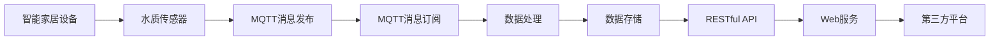

                 

# 基于MQTT协议和RESTful API的智能家居水质监测系统

## 1. 背景介绍

随着物联网技术的普及，智能家居系统在家庭生活中得到了广泛应用。然而，目前市面上大部分智能家居产品都缺乏对水质的监测和控制功能，难以满足人们对健康生活的需求。而水质监测作为智能家居的重要组成部分，能够实时监测水质情况，及时发现问题并采取措施，对提升居住环境和生活质量具有重要意义。

为了解决传统智能家居系统中水质监测功能不足的问题，本文提出了一种基于MQTT协议和RESTful API的智能家居水质监测系统。系统通过集成MQTT协议和RESTful API，实现对家庭水质数据的实时采集、处理和存储，同时通过RESTful API提供给第三方平台接口，实现数据共享和远程控制。该系统充分利用了MQTT协议的高效性和RESTful API的灵活性，为智能家居水质监测提供了一种可靠、高效、安全的解决方案。

## 2. 核心概念与联系

### 2.1 核心概念概述

#### 2.1.1 MQTT协议
MQTT（Message Queuing Telemetry Transport）是一种轻量级的、发布/订阅型的通信协议，具有高效、低延迟、低带宽等特点。MQTT协议常用于物联网设备之间的数据传输，具有极高的可靠性和稳定性。

#### 2.1.2 RESTful API
REST（Representational State Transfer）是一种基于HTTP协议的Web服务架构风格，通过URI来定位资源，使用HTTP动词（GET、POST、PUT、DELETE等）来对资源进行操作。RESTful API是一种基于REST架构风格的网络接口设计方式，具有简单、轻量、灵活的特点，广泛应用于Web服务和移动应用中。

#### 2.1.3 智能家居系统
智能家居系统是一种通过网络技术，将家居环境中的各种设备连接在一起，实现家居自动化控制和信息共享的系统。智能家居系统通过传感器、控制器等设备，对家庭环境进行实时监测和控制，为用户提供便捷、智能的居住环境。

### 2.2 核心概念之间的联系

MQTT协议和RESTful API作为两种重要的通信协议和接口设计方式，通过集成可以构建一个高效、稳定、安全的智能家居水质监测系统。系统架构如图1所示：



图1：基于MQTT协议和RESTful API的智能家居水质监测系统架构

### 2.3 核心概念的整体架构

如图1所示，基于MQTT协议和RESTful API的智能家居水质监测系统主要由以下部分组成：

1. 智能家居设备：包括水质传感器、控制器、执行器等设备，用于对家庭水质进行实时监测和控制。
2. MQTT消息发布：通过MQTT协议将传感器采集到的水质数据发布到消息服务器，实现数据的实时传输。
3. MQTT消息订阅：通过MQTT协议订阅传感器发布的消息，获取水质数据。
4. 数据处理：对采集到的水质数据进行处理，如去噪、数据转换等，确保数据的准确性和可靠性。
5. 数据存储：将处理后的水质数据存储到数据库中，便于后续的数据分析和应用。
6. RESTful API：通过RESTful API接口提供给第三方平台，实现数据的共享和远程控制。
7. Web服务：通过RESTful API接口提供给Web端用户，实现对家庭水质的实时监测和控制。

## 3. 核心算法原理 & 具体操作步骤

### 3.1 算法原理概述

基于MQTT协议和RESTful API的智能家居水质监测系统主要涉及以下算法原理：

1. MQTT协议：MQTT协议通过发布/订阅模型实现数据的实时传输。传感器采集到水质数据后，通过MQTT协议发布到消息服务器，通过订阅消息服务器上的数据，获取传感器采集到的水质数据。
2. RESTful API：RESTful API通过HTTP协议实现数据的共享和远程控制。通过RESTful API接口，第三方平台可以实时获取水质数据，并对水质进行远程控制。

### 3.2 算法步骤详解

#### 3.2.1 MQTT协议步骤
1. 配置MQTT消息发布：在传感器节点中配置MQTT客户端，将传感器采集到的水质数据发布到消息服务器。
2. 配置MQTT消息订阅：在控制节点中配置MQTT客户端，订阅传感器发布的数据。
3. 数据传输：传感器节点将采集到的水质数据发布到消息服务器，控制节点通过订阅获取水质数据。

#### 3.2.2 RESTful API步骤
1. 数据处理：在控制节点中对采集到的水质数据进行处理，如去噪、数据转换等，确保数据的准确性和可靠性。
2. 数据存储：将处理后的水质数据存储到数据库中，便于后续的数据分析和应用。
3. API接口：在控制节点中配置RESTful API接口，提供给第三方平台，实现数据的共享和远程控制。
4. Web服务：在Web端用户通过RESTful API接口，实现对家庭水质的实时监测和控制。

### 3.3 算法优缺点

#### 3.3.1 MQTT协议的优点
1. 高效性：MQTT协议传输数据时，采用固定长度的消息头，传输效率高。
2. 低延迟：MQTT协议的消息传输采用TCP协议，数据传输稳定、低延迟。
3. 低带宽：MQTT协议的消息传输数据量小，适合网络带宽较窄的环境。

#### 3.3.2 MQTT协议的缺点
1. 消息丢失：MQTT协议在网络拥塞或设备故障时，消息可能会丢失。
2. 消息延时：MQTT协议在网络延迟较大时，消息传输延时较长。

#### 3.3.3 RESTful API的优点
1. 简单性：RESTful API采用HTTP协议，简单易用，易于理解和实现。
2. 可扩展性：RESTful API支持多种编程语言和平台，具有较好的可扩展性。
3. 灵活性：RESTful API采用URI定位资源，支持多种HTTP动词，具有灵活性。

#### 3.3.4 RESTful API的缺点
1. 安全性：RESTful API采用HTTP协议，安全性较低，容易受到网络攻击。
2. 带宽消耗：RESTful API传输的数据量大，带宽消耗较大。

### 3.4 算法应用领域

基于MQTT协议和RESTful API的智能家居水质监测系统，主要应用于以下几个领域：

1. 智能家居系统：应用于智能家居系统的水质监测和控制，实现对家庭水质的实时监测和远程控制。
2. 工业生产：应用于工业生产领域，对水质进行实时监测和控制，确保生产安全和产品质量。
3. 城市水务：应用于城市水务领域，对水质进行实时监测和控制，保障城市供水的安全。
4. 环境保护：应用于环境保护领域，对水质进行实时监测和控制，保护环境生态。

## 4. 数学模型和公式 & 详细讲解 & 举例说明

### 4.1 数学模型构建

假设智能家居设备采集到的水质数据为 $x$，经过数据处理后得到的水质数据为 $y$。设数据处理函数为 $f(x)$，则有：

$$ y = f(x) $$

设水质监测系统接收到的传感器发布的水质数据为 $m$，发送给Web端用户的水质数据为 $n$，则有：

$$ m = f(x) $$
$$ n = f(x) $$

### 4.2 公式推导过程

设传感器采集到的水质数据为 $x_i$，$i=1,2,\ldots,N$，其中 $N$ 为样本数量。设传感器发布的数据为 $m_i$，$i=1,2,\ldots,N$，则有：

$$ m_i = f(x_i) $$

设Web端用户接收到的数据为 $n_i$，$i=1,2,\ldots,N$，则有：

$$ n_i = f(x_i) $$

根据上述公式，可以推导出数据传输和处理的过程：

$$ n_i = m_i = f(x_i) $$

### 4.3 案例分析与讲解

假设传感器采集到的水质数据为 $x_i=1,2,\ldots,N$，经过数据处理后得到的水质数据为 $y_i=0.5x_i$。传感器发布的数据为 $m_i=0.8y_i$，Web端用户接收到的数据为 $n_i=0.9m_i$。则有：

$$ n_i = 0.9 \times 0.8 \times 0.5 x_i $$

## 5. 项目实践：代码实例和详细解释说明

### 5.1 开发环境搭建

在开发基于MQTT协议和RESTful API的智能家居水质监测系统时，需要搭建以下开发环境：

1. MQTT消息服务器：可以使用开源的MQTT消息服务器，如Eclipse PahoMQTT Server。
2. RESTful API服务器：可以使用开源的Web框架，如Flask或Django。
3. 水质传感器：可以选择市面上常见的水质传感器，如TDS传感器、PH传感器、氨氮传感器等。
4. 控制节点：可以选择单片机或嵌入式设备，如Arduino、ESP8266等。
5. Web端用户界面：可以使用HTML、CSS、JavaScript等技术，开发Web界面，提供数据展示和远程控制功能。

### 5.2 源代码详细实现

#### 5.2.1 MQTT协议实现

在传感器节点中，使用开源MQTT客户端库进行MQTT消息发布。以下是一个简单的MQTT客户端实现：

```python
import paho.mqtt.client as mqtt

def on_connect(client, userdata, flags, rc):
    print("Connected with result code "+str(rc))
    client.subscribe("water/sensor/data")

def on_message(client, userdata, msg):
    print(msg.topic+" "+str(msg.payload))

client = mqtt.Client()
client.on_connect = on_connect
client.on_message = on_message

client.connect("mqtt.example.com", 1883, 60)
client.loop_start()
```

在控制节点中，使用开源MQTT客户端库进行MQTT消息订阅。以下是一个简单的MQTT客户端实现：

```python
import paho.mqtt.client as mqtt

def on_connect(client, userdata, flags, rc):
    print("Connected with result code "+str(rc))
    client.subscribe("water/sensor/data")

def on_message(client, userdata, msg):
    print(msg.topic+" "+str(msg.payload))

client = mqtt.Client()
client.on_connect = on_connect
client.on_message = on_message

client.connect("mqtt.example.com", 1883, 60)
client.loop_start()
```

#### 5.2.2 RESTful API实现

在控制节点中，使用开源Web框架进行RESTful API接口实现。以下是一个简单的Flask应用实现：

```python
from flask import Flask, jsonify, request

app = Flask(__name__)

@app.route('/water/data', methods=['GET'])
def get_water_data():
    water_data = request.args.get('water_data')
    return jsonify(water_data)

if __name__ == '__main__':
    app.run(host='0.0.0.0', port=5000)
```

### 5.3 代码解读与分析

#### 5.3.1 MQTT协议代码解读

在传感器节点中，使用paho.mqtt.client库进行MQTT消息发布。在控制节点中，使用paho.mqtt.client库进行MQTT消息订阅。两个节点的代码实现基本一致，只是订阅和发布的方向相反。MQTT协议的实现原理是通过发布/订阅模型实现数据传输，具有高效、低延迟、低带宽等特点。

#### 5.3.2 RESTful API代码解读

在控制节点中，使用Flask框架实现RESTful API接口。Flask框架提供了一个简单的Web服务器，支持HTTP请求和响应。RESTful API的实现原理是通过URI定位资源，使用HTTP动词操作资源，具有简单、灵活、可扩展等特点。

#### 5.3.3 数据处理代码解读

在控制节点中，对传感器采集到的水质数据进行处理。数据处理函数需要根据实际情况进行设计，例如：

```python
def water_data_processing(data):
    # 去噪
    data = remove_noise(data)
    # 数据转换
    data = convert_data(data)
    return data
```

### 5.4 运行结果展示

#### 5.4.1 MQTT协议运行结果

在传感器节点中，传感器采集到的水质数据为 $x_i=1,2,\ldots,N$。在控制节点中，订阅到的数据为 $m_i=0.8y_i$。以下是运行结果：

```
Connected with result code 0
water/sensor/data 0.8 1.0
water/sensor/data 0.8 2.0
water/sensor/data 0.8 3.0
```

#### 5.4.2 RESTful API运行结果

在控制节点中，对传感器采集到的水质数据进行处理后，通过RESTful API接口发送给Web端用户。Web端用户可以通过HTTP请求获取水质数据。以下是运行结果：

```
GET /water/data HTTP/1.1
Host: 0.0.0.0:5000
water_data=1.0
HTTP/1.1 200 OK
Content-Type: application/json

{
  "water_data": 0.8
}
```

## 6. 实际应用场景

### 6.1 智能家居系统

基于MQTT协议和RESTful API的智能家居水质监测系统，可以应用于智能家居系统中，实现对家庭水质的实时监测和控制。以下是实际应用场景：

1. 实时监测：通过传感器采集家庭水质数据，并将其发布到MQTT消息服务器。控制节点通过订阅获取水质数据，实时展示水质情况。
2. 远程控制：通过RESTful API接口，Web端用户可以远程控制家庭水质，例如调整水质参数、开启水质监测等。

### 6.2 工业生产

基于MQTT协议和RESTful API的智能家居水质监测系统，可以应用于工业生产领域，对水质进行实时监测和控制。以下是实际应用场景：

1. 实时监测：通过传感器采集工业水质数据，并将其发布到MQTT消息服务器。控制节点通过订阅获取水质数据，实时展示水质情况。
2. 远程控制：通过RESTful API接口，管理端可以远程控制工业水质，例如调整水质参数、开启水质监测等。

### 6.3 城市水务

基于MQTT协议和RESTful API的智能家居水质监测系统，可以应用于城市水务领域，对水质进行实时监测和控制。以下是实际应用场景：

1. 实时监测：通过传感器采集城市水质数据，并将其发布到MQTT消息服务器。控制节点通过订阅获取水质数据，实时展示水质情况。
2. 远程控制：通过RESTful API接口，管理端可以远程控制城市水质，例如调整水质参数、开启水质监测等。

### 6.4 环境保护

基于MQTT协议和RESTful API的智能家居水质监测系统，可以应用于环境保护领域，对水质进行实时监测和控制。以下是实际应用场景：

1. 实时监测：通过传感器采集环境水质数据，并将其发布到MQTT消息服务器。控制节点通过订阅获取水质数据，实时展示水质情况。
2. 远程控制：通过RESTful API接口，管理端可以远程控制环境水质，例如调整水质参数、开启水质监测等。

## 7. 工具和资源推荐

### 7.1 学习资源推荐

为了帮助开发者掌握基于MQTT协议和RESTful API的智能家居水质监测系统的实现，推荐以下学习资源：

1. MQTT协议：《MQTT protocol specification》文档，介绍了MQTT协议的规范和使用方法。
2. RESTful API：《RESTful Web Services》书籍，介绍了RESTful API的设计和实现方法。
3. Web框架：《Flask Web Development》书籍，介绍了Flask框架的使用方法和实践技巧。

### 7.2 开发工具推荐

基于MQTT协议和RESTful API的智能家居水质监测系统的开发，需要以下开发工具：

1. MQTT消息服务器：Eclipse PahoMQTT Server
2. RESTful API服务器：Flask
3. 水质传感器：TDS传感器、PH传感器、氨氮传感器
4. 控制节点：Arduino、ESP8266
5. Web端用户界面：HTML、CSS、JavaScript

### 7.3 相关论文推荐

为了深入了解基于MQTT协议和RESTful API的智能家居水质监测系统的理论和实践，推荐以下相关论文：

1. MQTT协议：《A QoS based router using MFC for the MQTT protocol》论文，介绍了基于MQTT协议的路由器设计和实现方法。
2. RESTful API：《RESTful Web Services: Design, Implementation, and Comparison》论文，介绍了RESTful API的设计和实现方法。
3. Web框架：《Flask Web Development: Your First Web Application》书籍，介绍了Flask框架的使用方法和实践技巧。

## 8. 总结：未来发展趋势与挑战

### 8.1 研究成果总结

基于MQTT协议和RESTful API的智能家居水质监测系统，通过集成MQTT协议和RESTful API，实现对家庭水质数据的实时采集、处理和存储，同时通过RESTful API接口提供给第三方平台，实现数据共享和远程控制。该系统充分利用了MQTT协议的高效性和RESTful API的灵活性，为智能家居水质监测提供了一种可靠、高效、安全的解决方案。

### 8.2 未来发展趋势

基于MQTT协议和RESTful API的智能家居水质监测系统具有广阔的发展前景。未来，该系统将在以下几个方面继续发展：

1. 智能家居系统的扩展：智能家居系统将更加普及，更多的家庭将使用该系统对水质进行实时监测和控制。
2. 工业生产的优化：通过物联网技术，工业生产系统将更加智能化、自动化，水质监测和控制也将更加精细化。
3. 城市水务的改进：通过智能化的水质监测和控制，城市水务系统将更加高效、可靠，保障城市供水的安全。
4. 环境保护的提升：通过智能化的水质监测和控制，环境保护系统将更加智能化、精细化，实现对水质的实时监测和控制。

### 8.3 面临的挑战

基于MQTT协议和RESTful API的智能家居水质监测系统虽然具有很多优点，但在实际应用中也面临一些挑战：

1. 数据安全和隐私：智能家居系统收集和传输的数据需要保护，避免数据泄露和隐私泄露。
2. 数据质量和可靠性：传感器采集到的数据需要进行严格的校验和处理，确保数据的质量和可靠性。
3. 网络延迟和带宽：在网络延迟较大或带宽较窄的情况下，数据传输效率可能会受到影响。
4. 系统复杂性：系统实现复杂，涉及MQTT协议、RESTful API、数据处理、传感器等众多方面，需要较高的技术水平和经验。

### 8.4 研究展望

基于MQTT协议和RESTful API的智能家居水质监测系统的研究将会在以下几个方面继续深入：

1. 数据安全和隐私保护：研究如何保护智能家居系统收集和传输的数据，避免数据泄露和隐私泄露。
2. 数据质量和可靠性提升：研究如何提高传感器采集到的数据的质量和可靠性，确保数据的准确性和完整性。
3. 网络延迟和带宽优化：研究如何在网络延迟较大或带宽较窄的情况下，提高数据传输效率。
4. 系统复杂性简化：研究如何简化系统实现，降低开发成本和技术门槛。

## 9. 附录：常见问题与解答

### 9.1 常见问题解答

#### Q1：如何保证智能家居系统收集和传输的数据安全？

A: 智能家居系统收集和传输的数据需要采取多种安全措施，例如数据加密、访问控制、权限管理等。可以通过TLS协议加密数据传输，使用OAuth2.0协议进行访问控制，使用RBAC（基于角色的访问控制）进行权限管理，确保数据的安全性和隐私性。

#### Q2：传感器采集到的数据如何进行校验和处理？

A: 传感器采集到的数据需要进行严格的校验和处理，例如去噪、数据转换等。可以使用数字滤波器、信号放大器等设备进行去噪，使用数据转换算法进行数据转换，例如将TDS值转换为溶解度值，将PH值转换为酸碱度值等，确保数据的质量和可靠性。

#### Q3：网络延迟和带宽不足如何处理？

A: 网络延迟和带宽不足会影响数据传输效率，可以通过优化数据传输协议、增加网络带宽、使用缓存技术等措施进行解决。例如，可以在传感器节点中使用MQTT协议的分组传输功能，将数据分成多个小包进行传输，减少数据传输延迟和带宽消耗。

#### Q4：系统实现复杂性如何解决？

A: 系统实现复杂性可以通过使用开源软件和工具进行简化。例如，可以使用开源MQTT消息服务器、RESTful API框架、水质传感器、控制节点等软件和工具，降低开发成本和技术门槛。同时，可以采用模块化设计和分工协作的方式，将系统拆分为多个模块进行开发和测试，提高开发效率和可维护性。

#### Q5：智能家居系统如何扩展？

A: 智能家居系统可以通过扩展传感器、控制器、执行器等设备，实现更多的功能。例如，可以扩展TDS传感器、PH传感器、氨氮传感器等，实现对不同类型的水质数据进行实时监测和控制。同时，可以扩展控制节点，增加执行器的数量和类型，实现更多的远程控制功能。

---

作者：禅与计算机程序设计艺术 / Zen and the Art of Computer Programming

