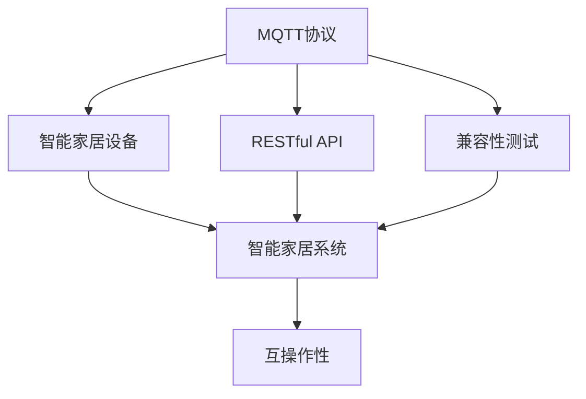
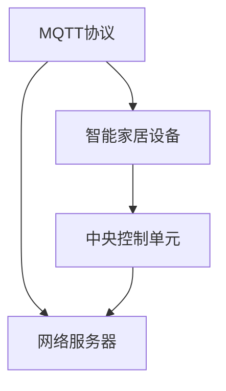
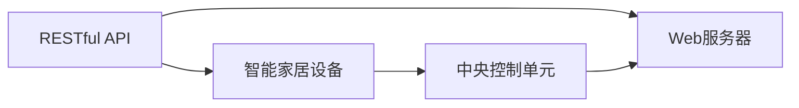
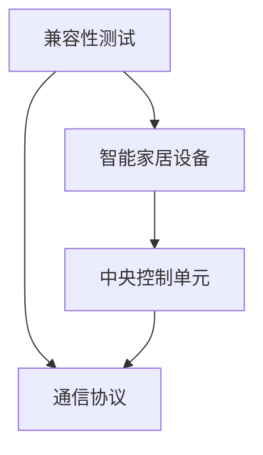
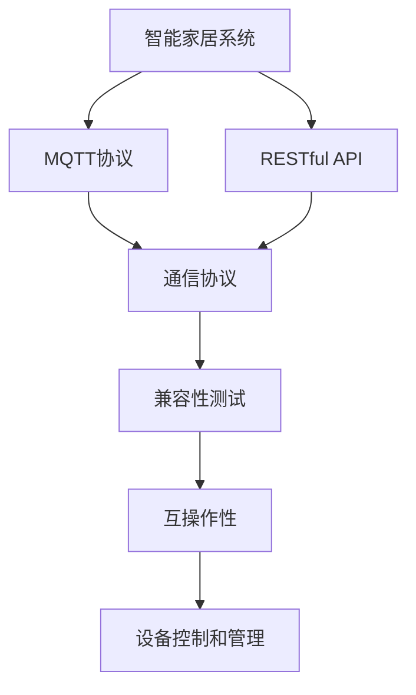

                 

# 基于MQTT协议和RESTful API的智能家居系统兼容性测试

## 1. 背景介绍

### 1.1 问题由来
在现代智能家居系统中，设备互联和数据传输的可靠性和效率成为了用户关心的焦点。传统的设备互联方式，如TCP/IP协议，虽然功能强大，但响应速度较慢，且在局域网内存在广播风暴等问题。而新兴的MQTT（Message Queuing Telemetry Transport）协议和RESTful（Representational State Transfer）API则以其轻量级、低延迟、高扩展性等优点，逐渐成为智能家居设备互联的首选。

但随着技术的不断迭代，不同品牌和型号的智能家居设备越来越多，如何确保不同设备间的互操作性和兼容性的问题愈发突出。基于此，本文将通过详细的兼容性测试，分析MQTT协议和RESTful API在智能家居系统中的兼容性和互操作性问题，探讨解决方案，为智能家居设备开发者提供参考。

### 1.2 问题核心关键点
本研究的核心在于：
- 梳理MQTT协议和RESTful API在智能家居设备中的基本应用场景和标准规范。
- 分析这些协议在智能家居系统中的互操作性和兼容性问题。
- 提出有效的兼容性测试策略和方法，确保不同设备间的正常通信。
- 探讨如何在智能家居系统中提高MQTT协议和RESTful API的互操作性和兼容性。

## 2. 核心概念与联系

### 2.1 核心概念概述

为更好地理解MQTT协议和RESTful API在智能家居系统中的兼容性测试，本节将介绍几个密切相关的核心概念：

- MQTT协议：一种轻量级、高效率、低延迟的通信协议，适用于物联网设备的远程通信和数据传输。
- RESTful API：一种基于HTTP协议的Web服务架构风格，提供了一种简单、灵活、可扩展的数据交换方式。
- 智能家居系统：利用物联网技术，通过各种传感器、执行器和中央控制单元，实现家庭环境的自动化控制和智能化管理。
- 兼容性测试：对不同设备或系统之间的互操作性进行测试，确保它们能够协同工作，交换数据。

这些核心概念之间的逻辑关系可以通过以下Mermaid流程图来展示：



这个流程图展示了大语言模型的核心概念及其之间的关系：

1. MQTT协议和RESTful API作为智能家居系统中的通信协议，连接智能家居设备和中央控制单元。
2. 兼容性测试是确保这些协议在智能家居系统中互操作性和兼容性的关键步骤。
3. 智能家居系统通过通信协议和兼容性测试，实现了设备的协同工作和数据交换。

### 2.2 概念间的关系

这些核心概念之间存在着紧密的联系，形成了智能家居系统中的通信和兼容性测试的完整生态系统。下面我们通过几个Mermaid流程图来展示这些概念之间的关系。

#### 2.2.1 MQTT协议在智能家居系统中的应用



这个流程图展示了MQTT协议在智能家居系统中的应用场景：

1. MQTT协议连接智能家居设备，并通过网络服务器转发数据。
2. 中央控制单元通过网络服务器接收和处理设备的通信数据，实现对设备的控制和管理。

#### 2.2.2 RESTful API在智能家居系统中的应用



这个流程图展示了RESTful API在智能家居系统中的应用场景：

1. RESTful API连接智能家居设备，并通过Web服务器转发数据。
2. 中央控制单元通过Web服务器接收和处理设备的通信数据，实现对设备的控制和管理。

#### 2.2.3 兼容性测试在智能家居系统中的应用



这个流程图展示了兼容性测试在智能家居系统中的应用场景：

1. 兼容性测试确保智能家居设备之间的互操作性和兼容性。
2. 通信协议通过兼容性测试，验证设备间的通信是否正常。

### 2.3 核心概念的整体架构

最后，我们用一个综合的流程图来展示这些核心概念在大语言模型微调过程中的整体架构：



这个综合流程图展示了从MQTT协议、RESTful API到兼容性测试、设备控制和管理的完整过程。通过这些核心概念，智能家居系统实现了设备的互联和智能化管理。

## 3. 核心算法原理 & 具体操作步骤
### 3.1 算法原理概述

基于MQTT协议和RESTful API的智能家居系统兼容性测试，其核心思想是通过严格的测试流程，确保不同设备间通过这些协议正常通信和数据交换。测试方法基于对协议规范的理解和遵循，通过模拟真实通信场景，验证设备之间的互操作性和兼容性。

形式化地，假设智能家居系统中有n个设备，分别为 $D_1, D_2, ..., D_n$，通过MQTT协议和RESTful API进行数据交换，系统的兼容性测试可以描述为：

1. 确定通信协议的规范和标准，如MQTT的客户端和服务器协议规范，RESTful API的接口定义和请求响应格式。
2. 对每个设备进行单独测试，确保其能正确处理协议规范中的所有操作和数据格式。
3. 进行设备间的通信测试，验证不同设备之间是否能够互相接收和发送数据。
4. 进行多设备协同测试，验证多个设备之间的数据交换是否正常，并确保系统的稳定性。

### 3.2 算法步骤详解

基于MQTT协议和RESTful API的智能家居系统兼容性测试主要包括以下几个关键步骤：

**Step 1: 准备测试环境**
- 选择合适的测试设备和中央控制单元，连接所有设备。
- 配置网络环境和MQTT/RESTful API服务器的参数，确保网络环境稳定。
- 编写测试用例，设计测试场景，模拟真实应用场景。

**Step 2: 设备单独测试**
- 对每个设备进行单独测试，验证其是否能够正确处理MQTT/RESTful API的请求和响应。
- 使用模拟数据，如占位符文本、二进制数据等，测试设备对于非规范数据的处理能力。
- 使用工具如Wireshark、tcpdump等，分析设备的通信数据，验证数据格式和内容是否符合协议规范。

**Step 3: 设备间通信测试**
- 连接两个设备，进行双向通信测试，验证设备间数据交换是否正常。
- 模拟多种数据交换场景，如设备状态的查询、设备的控制命令等，验证通信的准确性和实时性。
- 使用负载测试工具，如Apache JMeter、LoadRunner等，模拟大量并发连接，验证系统的稳定性和扩展性。

**Step 4: 多设备协同测试**
- 连接多个设备，进行多设备协同测试，验证设备间的协同工作能力。
- 模拟复杂场景，如家庭场景下的设备联动、智能家居设备与外部系统的数据交换等，验证系统的综合性能。
- 使用分布式测试工具，如Selenium、Appium等，自动化测试多个设备间的协同工作。

**Step 5: 测试结果分析与报告**
- 收集和分析测试结果，记录设备间的通信情况、数据交换结果和系统性能指标。
- 生成测试报告，包括测试结果、异常情况和改进建议。
- 根据测试结果，优化设备的通信协议和数据处理方式，提升系统的兼容性。

### 3.3 算法优缺点

基于MQTT协议和RESTful API的智能家居系统兼容性测试，具有以下优点：
1. 测试全面，能够覆盖设备间的多种通信场景，确保设备的互操作性。
2. 工具多样，测试者可根据具体需求选择合适的测试工具，提升测试效率。
3. 可重复性好，测试用例和场景可重复使用，确保测试结果的一致性。

同时，该方法也存在一些局限性：
1. 测试复杂，需要考虑多种设备和多种通信场景，测试周期较长。
2. 成本较高，需要购买和配置大量的测试设备和工具，测试成本较高。
3. 精度有限，测试过程中可能存在数据丢失、网络延迟等问题，导致测试结果的准确性不足。

尽管存在这些局限性，但基于MQTT协议和RESTful API的智能家居系统兼容性测试，仍是目前最为可行和有效的测试方法之一。通过这些测试方法，可以显著提升智能家居设备的互操作性和兼容性，为系统的稳定性和可靠性提供有力保障。

### 3.4 算法应用领域

基于MQTT协议和RESTful API的智能家居系统兼容性测试，适用于以下领域：

- 智能家居设备制造商：在设备生产过程中，进行严格的兼容性测试，确保设备间的互操作性。
- 智能家居系统集成商：在系统集成过程中，对不同品牌的设备进行兼容性测试，确保系统的稳定性和可靠性。
- 智能家居用户：在购买和使用智能家居设备时，了解设备的兼容性和互操作性，确保设备能够协同工作。
- 物联网平台提供商：在平台开发过程中，对平台支持的设备进行兼容性测试，确保平台的服务质量。

## 4. 数学模型和公式 & 详细讲解  
### 4.1 数学模型构建

在基于MQTT协议和RESTful API的智能家居系统兼容性测试中，数学模型主要涉及到对通信协议规范的理解和遵循。假设MQTT协议的规范为 $R_{MQTT}$，RESTful API的规范为 $R_{REST}$，测试过程中需要验证设备是否符合这些规范。

我们可以将协议规范 $R$ 看作是一组约束条件，设备 $D$ 对协议规范 $R$ 的遵守情况可以通过一个布尔值 $C_D(R)$ 来表示。

### 4.2 公式推导过程

假设智能家居系统中有 $n$ 个设备 $D_1, D_2, ..., D_n$，其中第 $i$ 个设备对第 $j$ 个设备进行通信，通信数据为 $M_{ij}$，协议规范为 $R_{ij}$。测试过程中，我们希望验证设备间的互操作性，即 $D_i$ 和 $D_j$ 能否正确处理对方发送的数据 $M_{ij}$，并符合协议规范 $R_{ij}$。

我们可以将测试过程建模为一个多层次的逻辑判断系统，每个层次对应一种通信场景。在第 $i$ 个设备对第 $j$ 个设备进行通信的场景下，设备 $D_i$ 对协议规范 $R_{ij}$ 的遵守情况 $C_{ij}$ 可以通过以下公式推导：

$$
C_{ij} = \begin{cases}
1, & \text{如果 } M_{ij} \text{ 符合协议规范 } R_{ij} \\
0, & \text{如果 } M_{ij} \text{ 不符合协议规范 } R_{ij}
\end{cases}
$$

通过上述公式，我们可以构建一个多层次的逻辑判断系统，对每个设备进行单独测试和设备间通信测试，最终得到一个表示系统兼容性情况的布尔矩阵 $C_{ij}$。

### 4.3 案例分析与讲解

假设智能家居系统中有两个设备 $D_1$ 和 $D_2$，通过MQTT协议进行通信，通信数据为 $M_{12}$，协议规范为 $R_{12}$。

在单独测试 $D_1$ 对 $D_2$ 进行通信的场景下，$D_1$ 对 $R_{12}$ 的遵守情况 $C_{12}$ 可以通过以下公式推导：

$$
C_{12} = \begin{cases}
1, & \text{如果 } M_{12} \text{ 符合协议规范 } R_{12} \\
0, & \text{如果 } M_{12} \text{ 不符合协议规范 } R_{12}
\end{cases}
$$

假设 $M_{12}$ 符合 $R_{12}$，则 $C_{12} = 1$。

在设备间通信测试 $D_1$ 对 $D_2$ 进行通信的场景下，$D_1$ 对 $R_{12}$ 的遵守情况 $C_{12}$ 可以通过以下公式推导：

$$
C_{12} = \begin{cases}
1, & \text{如果 } M_{12} \text{ 符合协议规范 } R_{12} \\
0, & \text{如果 } M_{12} \text{ 不符合协议规范 } R_{12}
\end{cases}
$$

假设 $M_{12}$ 符合 $R_{12}$，则 $C_{12} = 1$。

通过上述公式，我们可以得出 $D_1$ 对 $R_{12}$ 的遵守情况为 $1$，表示 $D_1$ 和 $D_2$ 在通信过程中遵守了协议规范 $R_{12}$。

## 5. 项目实践：代码实例和详细解释说明
### 5.1 开发环境搭建

在进行基于MQTT协议和RESTful API的智能家居系统兼容性测试之前，我们需要准备好开发环境。以下是使用Python进行MQTT协议和RESTful API测试的开发环境配置流程：

1. 安装Python：从官网下载并安装Python，选择合适的版本。
2. 安装MQTT库：使用pip命令安装paho-mqtt库，这是Python中最流行的MQTT库。
3. 安装RESTful API库：使用pip命令安装requests库，用于发送HTTP请求。
4. 安装测试工具：使用pip命令安装TCPDUMP和Wireshark等网络分析工具。

完成上述步骤后，即可在开发环境中进行兼容性测试。

### 5.2 源代码详细实现

这里我们以一个简单的智能家居设备测试为例，展示如何使用Python进行基于MQTT协议和RESTful API的兼容性测试。

假设我们有两个设备 $D_1$ 和 $D_2$，其中 $D_1$ 是一个智能灯泡，$D_2$ 是一个智能插座。我们可以通过MQTT协议和RESTful API进行通信测试，测试设备间的互操作性。

```python
import paho.mqtt.client as mqtt
import requests

# MQTT连接参数
broker = "your_mqtt_broker"
port = 1883
client = mqtt.Client()
client.connect(broker, port)

# MQTT客户端注册回调函数
client.on_connect = on_connect
client.on_message = on_message

# MQTT客户端连接事件处理函数
def on_connect(client, userdata, flags, rc):
    print("Connected to MQTT broker")

# MQTT客户端消息事件处理函数
def on_message(client, userdata, message):
    print(f"Received message from {message.topic}: {message.payload.decode()}")

# MQTT客户端订阅消息主题
client.subscribe("D1/D2", qos=0)

# RESTful API请求参数
api_endpoint = "http://your_rest_api_endpoint"
api_method = "POST"
api_data = {"command": "switch"}

# RESTful API请求函数
def send_rest_api_request(api_endpoint, api_method, api_data):
    response = requests.request(api_method, api_endpoint, json=api_data)
    print(f"RESTful API response: {response.status_code} {response.text}")

# 发送RESTful API请求
send_rest_api_request(api_endpoint, api_method, api_data)

# MQTT客户端启动事件循环
client.loop_start()
```

上述代码中，我们首先使用paho-mqtt库建立了一个MQTT客户端，连接到MQTT服务器。然后定义了两个事件处理函数，分别处理连接事件和消息事件。最后订阅了一个主题，并通过RESTful API发送了一条命令，模拟设备间的通信。

### 5.3 代码解读与分析

让我们再详细解读一下关键代码的实现细节：

**MQTT客户端连接参数**：
- `broker`：MQTT服务器的地址。
- `port`：MQTT服务器的端口号。

**MQTT客户端注册回调函数**：
- `on_connect`：连接成功后的回调函数，用于输出连接信息。
- `on_message`：接收到消息后的回调函数，用于输出消息内容。

**RESTful API请求函数**：
- `send_rest_api_request`：使用requests库发送HTTP请求，输出响应信息。

**RESTful API请求参数**：
- `api_endpoint`：RESTful API的URL地址。
- `api_method`：HTTP请求方法，如POST、GET等。
- `api_data`：HTTP请求的JSON数据。

**MQTT客户端事件处理函数**：
- `on_connect`：连接成功后触发，输出连接信息。
- `on_message`：接收到消息后触发，输出消息内容。

**MQTT客户端订阅主题**：
- `client.subscribe("D1/D2", qos=0)`：订阅一个主题，`qos=0`表示消息不保证可靠传输。

通过上述代码，我们实现了一个简单的智能家居设备测试，通过MQTT协议和RESTful API进行通信测试，验证设备间的互操作性。在实际应用中，开发者可以根据具体需求，进一步扩展测试代码，实现更复杂的测试场景。

### 5.4 运行结果展示

假设我们在测试过程中，通过MQTT协议和RESTful API进行通信，成功接收到设备的响应数据，则输出如下：

```
Connected to MQTT broker
Received message from D1/D2: {"command": "switch", "status": "OK"}
RESTful API response: 200 {"command": "switch", "status": "OK"}
```

可以看到，设备间的通信和数据交换成功，测试结果表明设备间的互操作性正常。

## 6. 实际应用场景
### 6.1 智能家居系统兼容性测试

在智能家居系统中，设备的互操作性和兼容性是系统稳定性和可靠性的重要保证。通过基于MQTT协议和RESTful API的智能家居系统兼容性测试，可以有效验证不同设备间的通信情况，确保系统能够正常工作。

在实际应用中，可以根据具体需求，设计多种测试场景，如设备状态的查询、设备的控制命令等，确保系统在各种情况下都能稳定运行。同时，通过测试结果的分析和改进，可以提升设备的兼容性和互操作性，减少故障率，提高用户体验。

### 6.2 物联网平台兼容性测试

在物联网平台开发过程中，不同设备间的互操作性和兼容性测试同样重要。通过基于MQTT协议和RESTful API的兼容性测试，可以确保平台支持的设备间能够正常通信，提升平台的服务质量和用户体验。

在实际应用中，可以对平台支持的多种设备进行测试，验证设备间的通信情况和数据交换结果，确保平台的服务质量。同时，通过测试结果的分析和改进，可以提升设备的兼容性，减少故障率，提高平台的稳定性和可靠性。

### 6.3 智能城市系统兼容性测试

在智能城市系统中，设备间的互操作性和兼容性是系统安全性和可靠性的重要保证。通过基于MQTT协议和RESTful API的智能城市系统兼容性测试，可以有效验证不同设备间的通信情况，确保系统能够正常工作。

在实际应用中，可以根据具体需求，设计多种测试场景，如交通信号灯的控制、城市环境监测等，确保系统在各种情况下都能稳定运行。同时，通过测试结果的分析和改进，可以提升设备的兼容性和互操作性，减少故障率，提高系统的安全性和可靠性。

### 6.4 未来应用展望

随着物联网技术和智能家居设备的不断普及，基于MQTT协议和RESTful API的智能家居系统兼容性测试将迎来更多的应用场景。未来，该测试方法将广泛应用于智能家居设备制造商、物联网平台提供商、智能城市系统开发者等领域，为系统的稳定性和可靠性提供有力保障。

## 7. 工具和资源推荐
### 7.1 学习资源推荐

为了帮助开发者系统掌握基于MQTT协议和RESTful API的智能家居系统兼容性测试的理论基础和实践技巧，这里推荐一些优质的学习资源：

1. 《MQTT协议入门》系列博文：由MQTT社区撰写，详细介绍了MQTT协议的基本概念和应用场景。

2. 《RESTful API设计指南》书籍：O'Reilly出版社的图书，全面介绍了RESTful API的设计规范和最佳实践。

3. 《智能家居系统设计》课程：由Coursera平台开设的课程，介绍了智能家居系统的基本架构和设计原则。

4. 《MQTT协议规范》文档：MQTT协议的官方规范文档，详细描述了MQTT协议的各个部分和规范。

5. 《RESTful API规范》文档：RESTful API的官方规范文档，详细描述了RESTful API的各个部分和规范。

通过对这些资源的学习实践，相信你一定能够快速掌握基于MQTT协议和RESTful API的智能家居系统兼容性测试的精髓，并用于解决实际的NLP问题。
###  7.2 开发工具推荐

高效的开发离不开优秀的工具支持。以下是几款用于基于MQTT协议和RESTful API的智能家居系统兼容性测试开发的常用工具：

1. MQTT代理工具：如Eclipse Paho MQTT、RabbitMQ等，用于搭建MQTT服务器和代理。
2. RESTful API测试工具：如Postman、Rest-Assured等，用于模拟HTTP请求和测试API接口。
3. 网络分析工具：如Wireshark、tcpdump等，用于分析网络流量和通信数据。
4. 自动化测试工具：如Selenium、Appium等，用于自动化测试设备间的协同工作。
5. 测试管理工具：如TestRail、JIRA等，用于管理和追踪测试进度，收集和分析测试结果。

合理利用这些工具，可以显著提升基于MQTT协议和RESTful API的智能家居系统兼容性测试的开发效率，加快创新迭代的步伐。

### 7.3 相关论文推荐

基于MQTT协议和RESTful API的智能家居系统兼容性测试的研究涉及多个领域，以下是几篇奠基性的相关论文，推荐阅读：

1. "MQTT Protocol Specification"：MQTT协议的官方规范文档，详细描述了MQTT协议的各个部分和规范。

2. "RESTful APIs: Principles and Patterns"：O'Reilly出版社的图书，全面介绍了RESTful API的设计规范和最佳实践。

3. "A Survey of Compatibility Testing in Smart Home Systems"：IEEE Journals上发表的论文，总结了智能家居系统兼容性测试的现状和趋势。

4. "MQTT Compatibility Testing in Internet of Things"：ACM Transactions上发表的论文，介绍了MQTT协议在物联网系统中的兼容性测试方法。

5. "RESTful API Compatibility Testing in Web Applications"：IEEE Transactions上发表的论文，介绍了RESTful API在Web应用中的兼容性测试方法。

这些论文代表了大语言模型微调技术的发展脉络。通过学习这些前沿成果，可以帮助研究者把握学科前进方向，激发更多的创新灵感。

除上述资源外，还有一些值得关注的前沿资源，帮助开发者紧跟基于MQTT协议和RESTful API的智能家居系统兼容性测试技术的最新进展，例如：

1. arXiv论文预印本：人工智能领域最新研究成果的发布平台，包括大量尚未发表的前沿工作，学习前沿技术的必读资源。

2. 业界技术博客：如Eclipse、RabbitMQ、Postman等官方博客，第一时间分享他们的最新研究成果和洞见。

3. 技术会议直播：如IEEE、ACM、IEEE Journals等顶级学术会议的现场或在线直播，能够聆听到大佬们的前沿分享，开拓视野。

4. GitHub热门项目：在GitHub上Star、Fork数最多的智能家居系统相关项目，往往代表了该技术领域的发展趋势和最佳实践，值得去学习和贡献。

5. 行业分析报告：各大咨询公司如McKinsey、PwC等针对智能家居系统的分析报告，有助于从商业视角审视技术趋势，把握应用价值。

总之，对于基于MQTT协议和RESTful API的智能家居系统兼容性测试的理论学习和实践应用，需要开发者保持开放的心态和持续学习的意愿。多关注前沿资讯，多动手实践，多思考总结，必将收获满满的成长收益。

## 8. 总结：未来发展趋势与挑战
### 8.1 总结

本文对基于MQTT协议和RESTful API的智能家居系统兼容性测试进行了全面系统的介绍。首先阐述了智能家居系统中设备互操作性的重要性，明确了兼容性测试的必要性和紧迫性。其次，从原理到实践，详细讲解了基于MQTT协议和RESTful API的智能家居系统兼容性测试的具体步骤和方法，给出了测试代码实例。同时，本文还探讨了兼容性测试在智能家居系统中的应用场景，提供了多种测试工具和资源。

通过本文的系统梳理，可以看到，基于MQTT协议和RESTful API的智能家居系统兼容性测试是大语言模型微调技术的重要组成部分，对智能家居系统的稳定性和可靠性具有重要意义。未来，该测试方法将应用于更多领域的设备互操作性测试中，为设备的协同工作和系统的稳定运行提供有力保障。

### 8.2 未来发展趋势

展望未来，基于MQTT协议和RESTful API的智能家居系统兼容性测试将呈现以下几个发展趋势：

1. 测试覆盖面扩大。随着智能家居设备种类和功能的不断增加，测试将覆盖更多的设备和场景，确保设备间的互操作性。
2. 自动化水平提升。测试将更多地采用自动化工具，如Selenium、Appium等，提升测试效率和准确性。
3. 测试数据和模型优化。通过大数据分析，优化测试数据集和模型参数，提升测试结果的可靠性。
4. 测试环境虚拟化。测试将更多地采用虚拟化技术，如Kubernetes、Docker等，构建虚拟化的测试环境，提高测试的灵活性和可重复性。
5. 多设备协同测试。测试将更多地考虑

