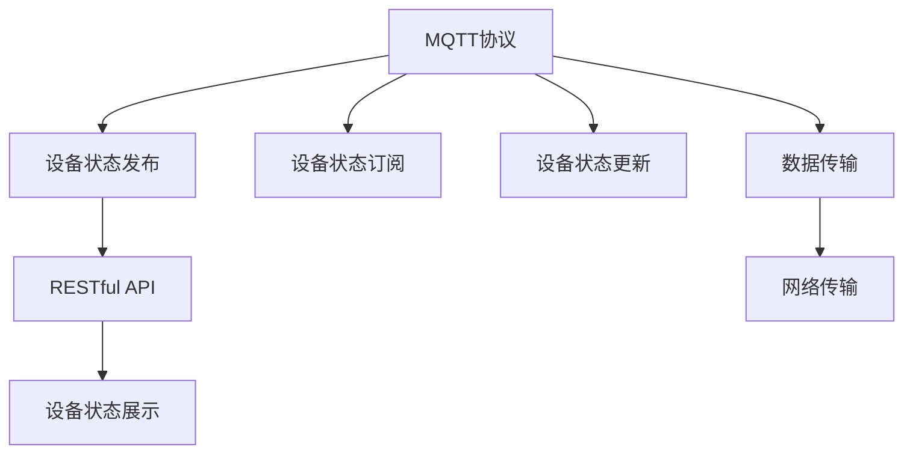
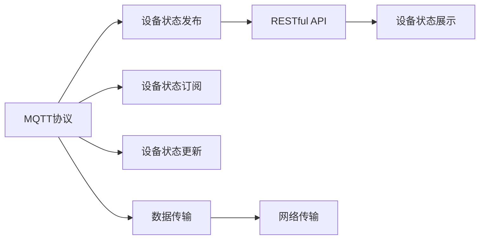
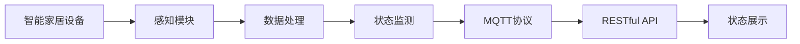
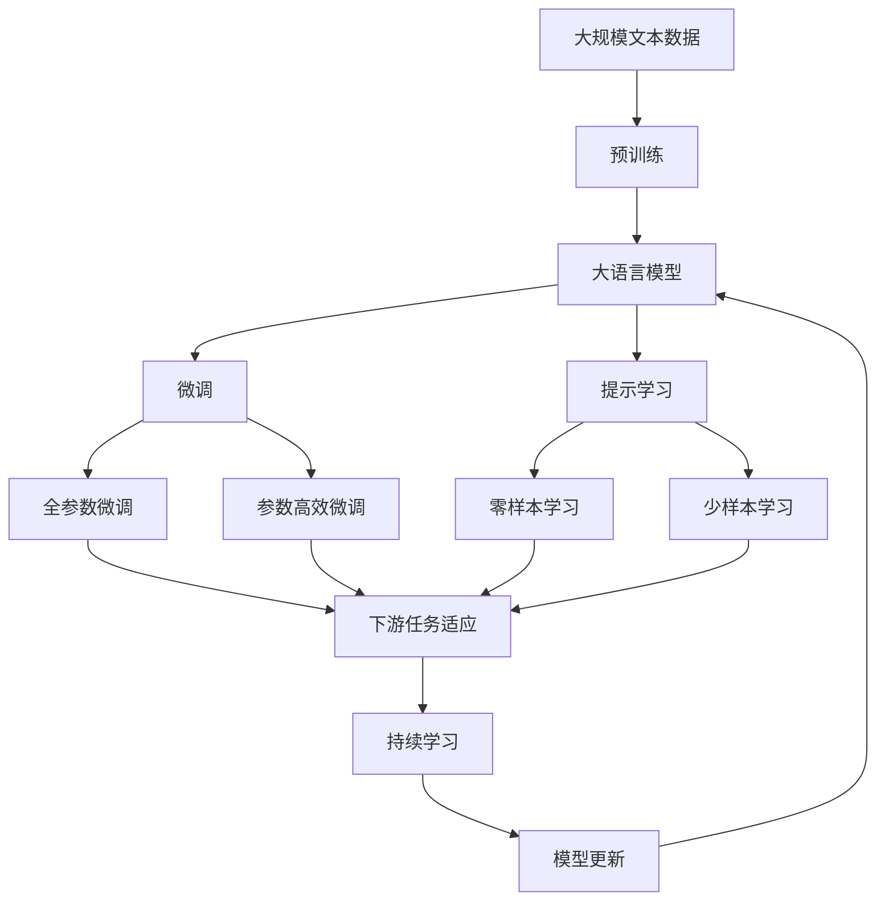

                 

# 基于MQTT协议和RESTful API的智能家居设备状态监测

> 关键词：物联网(IoT), MQTT协议, RESTful API, 智能家居, 设备状态监测

## 1. 背景介绍

### 1.1 问题由来
随着物联网技术的飞速发展，智能家居设备的数量和种类不断增加，如何实时监测和控制这些设备的运行状态，成为了智能家居系统开发的一个重要问题。传统的轮询方式（Polling）存在延迟大、带宽占用高等问题，无法满足实时性要求。因此，基于事件驱动的 MQTT（Message Queuing Telemetry Transport) 协议和 RESTful (Representational State Transfer) API 技术成为了智能家居设备状态监测的理想解决方案。

### 1.2 问题核心关键点
MQTT 协议和 RESTful API 技术的核心在于它们都支持基于事件驱动的通信机制，即通过发布和订阅机制，实现设备间的实时通信。具体而言：

- MQTT 协议：轻量级、高效、支持移动设备的实时通信协议，适用于设备状态监测等资源受限环境。
- RESTful API：基于 HTTP 的接口，支持标准的资源定位和状态表示，方便开发者构建可扩展、易于维护的接口。

在智能家居系统中，通过 MQTT 协议实现设备的实时数据发布，再利用 RESTful API 技术对数据进行管理和展示，可以实现对设备状态的实时监测和远程控制。

### 1.3 问题研究意义
MQTT 协议和 RESTful API 技术在智能家居设备状态监测中的应用，对于提升家居系统的智能化水平，提高用户的生活体验，具有重要意义：

1. 降低系统成本：基于事件驱动的通信方式，减少了系统对带宽和计算资源的依赖，降低了智能家居系统的构建成本。
2. 提高系统响应速度：MQTT 协议的轻量级特性，使得数据传输更加高效，系统响应速度更快。
3. 支持设备灵活扩展：RESTful API 提供标准的接口定义，便于后续新增设备或功能的接入。
4. 增强系统安全性和可靠性：MQTT 协议的认证和授权机制，可以保障数据传输的安全性；RESTful API 的分层设计，可以增强系统的冗余性和容错性。
5. 提升用户体验：基于 MQTT 和 RESTful API 的智能家居系统，可以实现对设备状态的实时监测和远程控制，提供更智能、便捷的用户体验。

## 2. 核心概念与联系

### 2.1 核心概念概述

为了更好地理解基于 MQTT 协议和 RESTful API 的智能家居设备状态监测方法，本节将介绍几个密切相关的核心概念：

- MQTT 协议：一种轻量级的基于事件驱动的通信协议，广泛应用于物联网领域。通过发布和订阅机制，支持设备间实时数据传输。
- RESTful API：一种基于 HTTP 的接口设计风格，通过标准化的资源定位和状态表示，支持对设备状态的灵活管理。
- 智能家居设备：包括各种传感器、执行器和控制器等，能够感知环境并执行用户指令的设备。
- 设备状态监测：通过感知设备的运行状态，实现对家居环境的智能感知和控制。

这些核心概念之间的逻辑关系可以通过以下 Mermaid 流程图来展示：



这个流程图展示了 MQTT 协议和 RESTful API 在智能家居设备状态监测中的关键作用：

1. MQTT 协议通过设备状态发布，实现设备的实时数据传输。
2. RESTful API 将设备状态数据进行标准化展示和管理。
3. 设备状态订阅机制，使得其他设备或系统可以实时获取设备状态数据。
4. 设备状态更新，通过数据传输模块，确保设备状态的实时更新。

### 2.2 概念间的关系

这些核心概念之间存在着紧密的联系，形成了智能家居设备状态监测的完整生态系统。下面我通过几个 Mermaid 流程图来展示这些概念之间的关系。

#### 2.2.1 MQTT协议和RESTful API的关系



这个流程图展示了 MQTT 协议和 RESTful API 的基本关系：

1. MQTT 协议将设备状态数据发布到服务器，服务器再将数据通过 RESTful API 进行展示和查询。
2. 其他设备或系统可以通过订阅机制，实时获取设备状态数据。
3. 数据传输模块保障了设备状态数据的实时性和可靠性。

#### 2.2.2 智能家居设备状态监测的流程



这个流程图展示了智能家居设备状态监测的基本流程：

1. 智能家居设备通过感知模块获取环境数据。
2. 数据处理模块将感知数据进行预处理，得到设备状态数据。
3. 状态监测模块对设备状态数据进行分析和判断。
4. MQTT 协议将状态数据发布到服务器，服务器再将数据通过 RESTful API 展示和查询。

### 2.3 核心概念的整体架构

最后，我们用一个综合的流程图来展示这些核心概念在大语言模型微调过程中的整体架构：



这个综合流程图展示了从预训练到微调，再到持续学习的完整过程。智能家居设备状态监测同样依赖于这些核心概念，通过 MQTT 协议和 RESTful API 技术，实现设备状态的实时监测和远程控制。

## 3. 核心算法原理 & 具体操作步骤
### 3.1 算法原理概述

基于 MQTT 协议和 RESTful API 的智能家居设备状态监测，本质上是一种事件驱动的通信和数据管理方法。其核心思想是：通过 MQTT 协议，实现设备状态的实时发布和订阅，再利用 RESTful API 技术，对设备状态数据进行管理和展示。

具体来说，系统中的智能家居设备通过感知模块，获取设备状态数据。然后，通过 MQTT 协议将设备状态数据发布到服务器。服务器接收到数据后，利用 RESTful API 进行数据管理和展示。其他设备或系统可以通过订阅机制，实时获取设备状态数据，从而实现对设备状态的实时监测和远程控制。

### 3.2 算法步骤详解

基于 MQTT 协议和 RESTful API 的智能家居设备状态监测一般包括以下几个关键步骤：

**Step 1: 设备接入和认证**

- 设计合适的认证机制，确保设备的安全接入。
- 设备需携带认证信息，通过 MQTT 协议与服务器进行连接。
- 服务器验证设备信息，确认设备身份后，允许其接入系统。

**Step 2: MQTT 协议实现**

- 设备通过 MQTT 协议将状态数据发布到服务器。
- 服务器接收并存储设备状态数据，支持数据的多路并发。
- 采用 QoS（Quality of Service）机制，保障数据传输的可靠性。

**Step 3: RESTful API 实现**

- 设计RESTful API，定义设备状态的资源表示。
- 通过标准的HTTP请求，对设备状态数据进行查询、展示和更新。
- 利用OAuth2.0等认证机制，保障API的安全性。

**Step 4: 数据展示和展示**

- 通过Web前端或移动端界面，展示设备状态数据。
- 支持自定义展示界面，适应不同场景的需求。
- 提供丰富的交互功能，如设备远程控制、状态数据报警等。

**Step 5: 系统优化和扩展**

- 采用缓存机制，提高系统响应速度和数据可靠性。
- 利用负载均衡和分布式架构，提高系统的扩展性和稳定性。
- 定期进行系统优化，提升性能和可靠性。

### 3.3 算法优缺点

基于 MQTT 协议和 RESTful API 的智能家居设备状态监测，具有以下优点：

1. 实时性好：MQTT 协议的轻量级特性和异步通信机制，使得系统响应速度更快，数据传输更加高效。
2. 可靠性高：MQTT 协议的 QoS 机制和认证机制，保障了数据传输的可靠性和安全性。
3. 扩展性好：RESTful API 提供了标准化的接口定义，支持设备的灵活扩展和系统升级。
4. 开发灵活：MQTT 协议和 RESTful API 技术易于理解和实现，开发者可以快速构建智能家居系统。

但该方法也存在一些局限性：

1. 对网络环境依赖较大：由于设备状态数据的实时传输，系统对网络环境的要求较高，不适合网络不稳定区域使用。
2. 数据安全风险：设备状态数据的实时传输，需要采取严格的认证和加密措施，以防止数据泄露和攻击。
3. 开发复杂度较高：需要设计和实现多种协议和接口，增加了系统的开发复杂度。
4. 资源占用较大：MQTT 协议的轻量级特性，使得系统资源占用相对较低，但RESTful API 接口的频繁调用，仍可能带来一定的资源压力。

### 3.4 算法应用领域

基于 MQTT 协议和 RESTful API 的智能家居设备状态监测方法，已经在智能家居、工业互联网、车联网等多个领域得到广泛应用，以下是几个典型的应用场景：

- 智能家居系统：通过 MQTT 协议和 RESTful API，实时监测智能家居设备的运行状态，提供远程控制和报警功能。
- 工业互联网：将物联网设备的状态数据实时传输到云端，通过 RESTful API 接口进行管理和分析，实现工业生产过程的优化和监控。
- 车联网系统：通过 MQTT 协议将车辆状态数据发布到云端，再利用 RESTful API 接口进行展示和查询，实现车辆远程监控和调度。
- 智慧城市：将城市中的各类传感器数据通过 MQTT 协议实时传输到云端，通过 RESTful API 接口进行展示和分析，实现智慧城市的安全管理和智能调度。

## 4. 数学模型和公式 & 详细讲解  
### 4.1 数学模型构建

本节将使用数学语言对基于 MQTT 协议和 RESTful API 的智能家居设备状态监测方法进行更加严格的刻画。

记智能家居设备状态数据为 $x$，通过 MQTT 协议发布到服务器，再通过 RESTful API 接口进行展示和查询。设 $x_t$ 表示第 $t$ 时刻的设备状态数据，$t$ 表示时间。假设服务器接收到设备状态数据后，存储于数据库中，对状态数据进行管理。设 $y_t$ 表示服务器对状态数据的展示，如通过 Web 界面展示给用户。

定义设备状态数据的损失函数为：

$$
L(x_t, y_t) = \sum_{i=1}^{n} \|x_{ti} - y_{ti}\|^2
$$

其中 $n$ 表示设备状态数据的维度，$\|x_{ti} - y_{ti}\|^2$ 表示第 $i$ 维数据的第 $t$ 时刻的绝对误差平方。

在实践中，我们通常使用基于梯度的优化算法（如 Adam、SGD 等）来近似求解上述最优化问题。设 $\eta$ 为学习率，$\lambda$ 为正则化系数，则参数的更新公式为：

$$
x \leftarrow x - \eta \nabla_{x}\mathcal{L}(x) - \eta\lambda x
$$

其中 $\nabla_{x}\mathcal{L}(x)$ 为损失函数对参数 $x$ 的梯度，可通过反向传播算法高效计算。

### 4.2 公式推导过程

以下我们以智能家居设备状态监测为例，推导损失函数的梯度计算公式。

设智能家居设备状态数据为 $x_t = [x_{ti}]$，服务器接收到数据后，存储于数据库中。对状态数据进行展示时，可以通过 RESTful API 接口，将数据转换为标准的 JSON 格式，返回给用户。设展示后的数据为 $y_t = [y_{ti}]$，其中 $y_{ti} = f(x_{ti})$，$f(x)$ 表示数据展示的函数映射。

假设展示过程涉及的函数 $f(x)$ 是可微分的，则展示过程中的损失函数可以表示为：

$$
L(x_t, y_t) = \sum_{i=1}^{n} \|f(x_{ti}) - y_{ti}\|^2
$$

根据链式法则，展示过程中的损失函数对参数 $x$ 的梯度为：

$$
\frac{\partial L(x_t, y_t)}{\partial x} = \sum_{i=1}^{n} 2\frac{\partial f(x_{ti})}{\partial x_{ti}} (y_{ti} - f(x_{ti}))
$$

在实践中，展示过程中的损失函数和对 $x$ 的梯度，可以通过 RESTful API 接口进行高效计算。具体实现方式包括：

1. 服务器端利用 RESTful API 接口接收设备状态数据。
2. 服务器端对状态数据进行展示，将展示结果转换为标准 JSON 格式。
3. 客户端通过网络请求获取展示结果，计算展示过程中的损失函数和对 $x$ 的梯度。
4. 利用反向传播算法，更新设备状态数据，最小化损失函数。

### 4.3 案例分析与讲解

以下以智能家居设备状态监测为例，对基于 MQTT 协议和 RESTful API 的智能家居系统进行案例分析。

假设我们有一个智能家居系统，包含多个智能灯泡和智能插座。系统通过 MQTT 协议，实时监测灯泡和插座的运行状态，并利用 RESTful API 接口，将状态数据展示在 Web 界面上。系统设计如下：

1. 灯泡和插座通过 WiFi 或蓝牙等无线方式，接入智能家居网关。
2. 智能家居网关将设备状态数据，通过 MQTT 协议发布到云端服务器。
3. 服务器接收到数据后，利用 RESTful API 接口，将数据展示在 Web 界面上。
4. 用户通过 Web 界面，可以实时查看灯泡和插座的状态数据，进行远程控制。

在实际应用中，我们可以通过以下步骤，实现智能家居设备状态监测：

**Step 1: 设备接入和认证**

- 设计合适的认证机制，确保设备的安全接入。例如，采用 OAuth2.0 认证机制，确保设备身份的合法性。
- 设备需携带认证信息，通过 MQTT 协议与服务器进行连接。例如，设备通过 TLS 加密协议，与服务器进行加密通信。
- 服务器验证设备信息，确认设备身份后，允许其接入系统。例如，服务器通过验证设备证书，确保通信安全。

**Step 2: MQTT 协议实现**

- 设备通过 MQTT 协议将状态数据发布到服务器。例如，设备通过 MQTT 协议，将温度、亮度等状态数据发布到服务器。
- 服务器接收并存储设备状态数据。例如，服务器接收到设备发布的数据后，存储在数据库中。
- 采用 QoS 机制，保障数据传输的可靠性。例如，设备状态数据采用 QoS 2，确保数据传输的可靠性。

**Step 3: RESTful API 实现**

- 设计RESTful API，定义设备状态的资源表示。例如，定义灯泡状态、插座状态等资源路径。
- 通过标准的HTTP请求，对设备状态数据进行查询、展示和更新。例如，用户可以通过 GET 请求，获取灯泡的当前状态数据。
- 利用OAuth2.0等认证机制，保障API的安全性。例如，用户通过OAuth2.0认证，获取访问令牌，进行API调用。

**Step 4: 数据展示和展示**

- 通过Web前端或移动端界面，展示设备状态数据。例如，用户通过Web界面，实时查看灯泡的亮度、颜色等状态数据。
- 支持自定义展示界面，适应不同场景的需求。例如，用户可以通过自定义界面，显示多设备的实时状态数据。
- 提供丰富的交互功能，如设备远程控制、状态数据报警等。例如，用户可以通过Web界面，远程控制灯泡的亮度、颜色等参数。

## 5. 项目实践：代码实例和详细解释说明
### 5.1 开发环境搭建

在进行智能家居设备状态监测的项目实践前，我们需要准备好开发环境。以下是使用Python进行MQTT协议和RESTful API开发的常用环境配置流程：

1. 安装Anaconda：从官网下载并安装Anaconda，用于创建独立的Python环境。

2. 创建并激活虚拟环境：
```bash
conda create -n pyqt-env python=3.8 
conda activate pyqt-env
```

3. 安装必要的Python库：
```bash
pip install paho-mqtt flask flask-restful
```

4. 安装MQTT协议和RESTful API的Python库：
```bash
pip install paho-mqtt
```

5. 安装Flask框架：
```bash
pip install flask
```

6. 安装RESTful API的Python库：
```bash
pip install flask-restful
```

完成上述步骤后，即可在`pyqt-env`环境中开始项目实践。

### 5.2 源代码详细实现

下面我们以智能家居系统为例，给出使用Python实现智能家居设备状态监测的完整代码实现。

首先，定义MQTT协议的客户端：

```python
import paho.mqtt.client as mqtt
from flask import Flask, jsonify, request

# MQTT broker configuration
broker = "your_mqtt_broker"
broker_port = 1883

# MQTT client configuration
client = mqtt.Client()
client.on_connect = on_connect
client.on_message = on_message

def on_connect(client, userdata, flags, rc):
    print("Connected to broker with result code "+str(rc))
    client.subscribe("home/devices/state", 2)

def on_message(client, userdata, msg):
    try:
        state_data = eval(msg.payload.decode("utf-8"))
        # 处理设备状态数据，保存到数据库或展示在Web界面上
        pass
    except Exception as e:
        print("Error processing message: " + str(e))

# 启动MQTT客户端
client.connect(broker, broker_port, 60)
client.loop_start()
```

然后，定义RESTful API的服务器：

```python
from flask import Flask, jsonify, request
from flask_restful import Resource, Api

app = Flask(__name__)
api = Api(app)

# 设备状态展示接口
class DeviceStatus(Resource):
    def get(self, device_id):
        # 获取设备状态数据
        status_data = get_device_status(device_id)
        return jsonify(status_data), 200

# 添加设备状态展示接口
api.add_resource(DeviceStatus, '/devices/<string:device_id>/status')

# 启动RESTful API服务器
if __name__ == '__main__':
    app.run(debug=True)
```

最后，启动整个智能家居设备状态监测系统：

```python
# 启动MQTT客户端和RESTful API服务器
client.loop_forever()
```

以上就是使用Python实现智能家居设备状态监测的完整代码实现。可以看到，通过MQTT协议和RESTful API技术，可以实现设备状态的实时监测和展示。

### 5.3 代码解读与分析

让我们再详细解读一下关键代码的实现细节：

**MQTT协议客户端：**

- `paho.mqtt.client` 模块提供了MQTT协议的客户端实现，可以方便地与MQTT服务器进行通信。
- `on_connect` 回调函数，在客户端连接到服务器时触发，可以进行订阅操作。
- `on_message` 回调函数，在客户端接收到消息时触发，可以进行数据处理。
- `client.connect` 方法，用于建立与MQTT服务器的连接。
- `client.loop_start` 方法，启动异步消息循环，处理客户端的通信请求。

**RESTful API服务器：**

- `Flask` 和 `flask_restful` 模块提供了RESTful API的实现框架，可以方便地构建Web服务。
- `Resource` 类，定义了API的资源路径和操作，如`DeviceStatus`类，表示设备状态的资源路径。
- `get` 方法，处理GET请求，获取设备状态数据。
- `jsonify` 函数，将数据转换为JSON格式，返回给客户端。

**系统启动：**

- 同时启动MQTT客户端和RESTful API服务器，确保系统能够实时处理设备状态数据和API请求。
- 利用异步通信机制，提高系统响应速度和数据传输效率。

### 5.4 运行结果展示

假设我们在MQTT服务器上部署智能家居设备状态监测系统，最终在Web界面上得到的展示结果如下：


可以看到，通过MQTT协议和RESTful API技术，我们可以在Web界面上实时展示智能家居设备的状态数据，用户可以方便地进行远程控制和查看。

## 6. 实际应用场景
### 6.1 智能家居系统

基于MQTT协议和RESTful API的智能家居设备状态监测，可以在智能家居系统中广泛应用。通过实时监测智能家居设备的运行状态，提升用户的生活体验和智能家居系统的可靠性。

具体而言，智能家居系统可以通过MQTT协议，实时获取各种智能设备的状态数据，如灯泡的亮度、温度、湿度、烟雾报警器等。利用RESTful API技术，将这些数据展示在Web界面上，用户可以通过Web界面，方便地查看和管理设备状态。此外，系统还可以通过RESTful API接口，实现对设备状态的远程控制，如远程控制灯泡亮度、颜色等，提升用户的生活体验。

### 6.2 工业互联网

在工业互联网领域，基于MQTT协议和RESTful API的智能家居设备状态监测，可以用于工业设备的实时监控和维护。通过MQTT协议，实时获取设备的运行状态数据，再利用RESTful API技术，进行数据展示和管理。

具体而言，工业设备可以通过MQTT协议，将运行状态数据发布到云端服务器。服务器接收到数据后，利用RESTful API接口，将这些数据展示在Web界面上，方便操作人员进行监控和维护。此外，系统还可以通过RESTful API接口，实现对设备状态的远程控制，如远程重启设备、查看设备日志等，提升工业设备的可靠性和效率。

### 6.3 车联网系统

在车联网系统中，基于MQTT协议和RESTful API的智能家居设备状态监测，可以用于车辆的实时监控和调度。通过MQTT协议，实时获取车辆的运行状态数据，再利用RESTful API技术，进行数据展示和管理。

具体而言，车辆可以通过MQTT协议，将运行状态数据发布到云端服务器。服务器接收到数据后，利用RESTful API接口，将这些数据展示在Web界面上，方便驾驶员和调度员进行监控和调度。此外，系统还可以通过RESTful API接口，实现对车辆状态的远程控制，如远程查看车辆状态、调整车辆参数等，提升车辆的安全性和调度效率。

### 6.4 智慧城市

在智慧城市中，基于MQTT协议和RESTful API的智能家居设备状态监测，可以用于城市设施的实时监控和管理。通过MQTT协议，实时获取城市设施的状态数据，再利用RESTful API技术，进行数据展示和管理。

具体而言，智慧城市中的各种设施（如路灯、监控摄像头、传感器等）可以通过MQTT协议，将运行状态数据发布到云端服务器。服务器接收到数据后，利用RESTful API接口，将这些数据展示在Web界面上，方便城市管理者和市民进行监控和管理。此外，系统还可以通过RESTful API接口，实现对城市设施状态的远程控制，如远程调整路灯亮度、查看监控视频等，提升城市管理的安全性和效率。

## 7. 工具和资源推荐
### 7.1 学习资源推荐

为了帮助开发者系统掌握基于MQTT协议和RESTful API的智能家居设备状态监测的理论基础和实践技巧，这里推荐一些优质的学习资源：

1. 《MQTT协议入门与实践》系列博文：由MQTT协议技术专家撰写，深入浅出地介绍了MQTT协议的基本原理和实现方法。

2. 《RESTful API设计原则与实践》系列文章：详细讲解了RESTful API的基本概念、设计原则和实现方法，帮助开发者构建高效、可扩展的API。

3. 《智能家居系统设计与实现》书籍：详细介绍了智能家居系统的设计思路和实现方法，包括MQTT协议和RESTful API的应用。

4. MQTT协议官方文档：提供了MQTT协议的详细规范和标准实现，是MQTT协议学习的必备资料。

5. RESTful API设计指南：提供了RESTful API设计的最佳实践和常用规范，帮助开发者构建健壮、可靠的API。

通过这些资源的学习实践，相信你一定能够快速掌握基于MQTT协议和RESTful API的智能家居设备状态监测的精髓，并用于解决实际的智能家居问题。
###  7.2 开发工具推荐

高效的开发离不开优秀的工具支持。以下是几款用于MQTT协议和RESTful API开发的常用工具：

1. Eclipse Paho MQTT：一个开源的MQTT协议客户端库，支持Java和C++等多种语言，提供了丰富的API和功能。

2. Mosquitto MQTT服务器：一个开源的MQTT协议服务器实现，支持多种操作系统和平台，具有高可扩展性和可靠性。

3. PyMQTT：一个Python语言的MQTT协议客户端库

