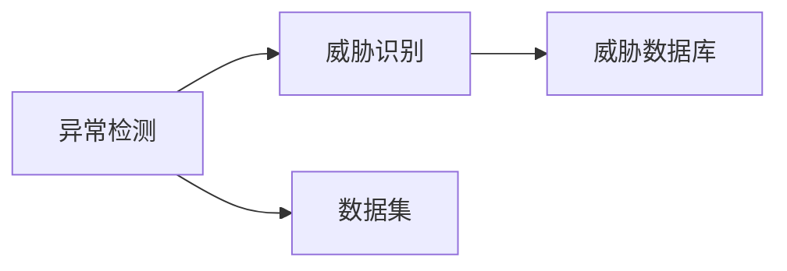
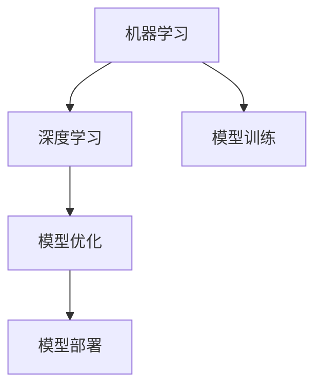

                 

# 基于机器学习的网络安全态势感知模型研究与实现

> 关键词：网络安全，态势感知，机器学习，深度学习，神经网络，异常检测，模型优化

## 1. 背景介绍

### 1.1 问题由来
网络安全态势感知是现代网络安全防御体系的重要组成部分，通过对网络流量和系统日志等数据进行实时监测和分析，及时发现潜在的安全威胁和异常行为，从而实现主动防御和应急响应。随着网络规模的不断扩大，网络环境日益复杂，传统的基于规则的威胁检测方法已经无法满足实际需求。

为了应对日益增长的安全威胁，研究人员开始探索基于机器学习的网络安全态势感知模型，利用其强大的数据建模能力，构建高精度的网络异常检测和威胁识别模型，提升网络安全防御的智能化水平。本文旨在介绍一种基于机器学习的网络安全态势感知模型，并给出其研究背景和应用前景。

### 1.2 问题核心关键点
本文主要关注以下几个关键问题：

- 如何构建高效的网络安全态势感知模型，以便实时分析海量网络数据，快速识别安全威胁？
- 如何利用机器学习算法，提高网络异常检测和威胁识别的准确率和召回率？
- 如何在模型中引入领域知识，提升模型在特定场景下的性能？
- 如何对模型进行参数优化和调参，使其在实际部署中具有更好的泛化能力和鲁棒性？

这些问题的解答将帮助我们构建高效、准确、可解释的网络安全态势感知模型，为网络安全防御提供有力的技术支撑。

### 1.3 问题研究意义
随着网络攻击手段的不断升级和多样性增加，网络安全问题愈发严峻。网络安全态势感知模型的研究与应用，对于提升网络安全防御水平，保护关键基础设施和数据安全具有重要意义：

1. 提升防御效率。通过机器学习模型实时分析网络数据，实现主动防御，显著提高网络安全的反应速度和防御效率。
2. 降低误报漏报。基于机器学习模型的自适应能力，可以自动学习并调整异常检测的阈值，降低误报漏报率，提升检测的准确性和可靠性。
3. 增强智能分析。机器学习模型可以综合多维数据，进行深度学习，发现复杂攻击行为，提升威胁识别和响应能力。
4. 提高可解释性。相比于传统的基于规则的检测方法，机器学习模型的决策过程可解释性更强，便于审计和优化。
5. 保障数据安全。通过机器学习模型的持续学习和适应，可以及时应对未知威胁，保障网络环境的安全性和稳定性。

## 2. 核心概念与联系

### 2.1 核心概念概述

为更好地理解本文介绍的网络安全态势感知模型，本节将介绍几个核心概念：

- **网络安全态势感知(Network Security Situational Awareness, NSSA)**：利用数据挖掘和机器学习等技术，对网络流量、日志、行为等数据进行分析，实时监控网络安全状态，并预测未来安全威胁的技术。
- **异常检测(Anomaly Detection)**：通过统计和模型方法，检测网络中与正常行为显著不同的异常活动，识别潜在的安全威胁。
- **威胁识别(Threat Identification)**：利用机器学习算法，对异常行为进行分类和识别，确定威胁类型和严重程度。
- **机器学习(Machine Learning, ML)**：通过算法和模型，从数据中学习规律，实现自动化决策和预测，广泛应用于数据分析和模式识别。
- **深度学习(Deep Learning, DL)**：基于神经网络，通过多层次特征提取和表示学习，提升模型性能和泛化能力，特别是在图像、语音、自然语言处理等领域具有优势。

这些核心概念之间的逻辑关系可以通过以下Mermaid流程图来展示：

```mermaid
graph TB
    A[网络安全态势感知(NSSA)] --> B[异常检测]
    B --> C[威胁识别]
    C --> D[机器学习]
    D --> E[深度学习]
    A --> F[数据采集]
    A --> G[数据预处理]
    B --> H[异常特征提取]
    C --> I[威胁模式识别]
```

这个流程图展示了大模型态势感知模型的工作流程：

1. 网络安全态势感知模型首先通过数据采集和预处理，对网络流量、日志、行为等数据进行处理。
2. 异常检测模型通过分析正常行为和异常行为的模式，识别出异常活动。
3. 威胁识别模型对异常行为进行分类，确定威胁类型和严重程度。
4. 机器学习模型利用深度学习算法，进一步提升异常检测和威胁识别的准确性和鲁棒性。
5. 最终，通过模型训练和优化，构建高效的网络安全态势感知模型。

### 2.2 概念间的关系

这些核心概念之间存在着紧密的联系，形成了网络安全态势感知模型的完整生态系统。下面我们通过几个Mermaid流程图来展示这些概念之间的关系。

#### 2.2.1 网络安全态势感知的总体架构

```mermaid
graph LR
    A[网络安全态势感知(NSSA)] --> B[数据采集]
    B --> C[数据预处理]
    C --> D[异常检测]
    D --> E[威胁识别]
    E --> F[机器学习]
    F --> G[深度学习]
```

这个流程图展示了网络安全态势感知的整体架构：

1. 数据采集模块负责获取网络流量、日志、行为等数据。
2. 数据预处理模块对原始数据进行清洗、归一化等预处理操作。
3. 异常检测模块通过模式识别，找出异常活动。
4. 威胁识别模块对异常行为进行分类和识别，确定威胁类型和严重程度。
5. 机器学习模块利用深度学习算法，进一步优化模型的性能和泛化能力。
6. 最终，通过模型训练和优化，构建高效的网络安全态势感知模型。

#### 2.2.2 异常检测与威胁识别的关系



这个流程图展示了异常检测和威胁识别的关系：

1. 异常检测模块通过分析正常行为和异常行为的模式，识别出异常活动。
2. 威胁识别模块对异常行为进行分类和识别，确定威胁类型和严重程度。
3. 威胁数据库存储各类威胁特征和威胁模式，便于威胁识别模型的训练和优化。

#### 2.2.3 机器学习与深度学习的关系



这个流程图展示了机器学习和深度学习的关系：

1. 机器学习通过算法和模型，从数据中学习规律，实现自动化决策和预测。
2. 深度学习利用神经网络，通过多层次特征提取和表示学习，提升模型性能和泛化能力。
3. 模型训练和优化是机器学习和深度学习的重要环节，通过迭代和调整，提升模型的准确率和鲁棒性。
4. 模型部署是将训练好的模型应用于实际场景，实现网络安全态势感知。

## 3. 核心算法原理 & 具体操作步骤

### 3.1 算法原理概述

本文介绍的网络安全态势感知模型基于深度学习，采用卷积神经网络(CNN)和长短期记忆网络(LSTM)结合的方式，实现对异常活动的检测和威胁的识别。

模型主要包含以下几个步骤：

1. 数据预处理：对原始网络数据进行清洗、归一化等处理，确保数据的质量和一致性。
2. 特征提取：利用卷积神经网络对网络数据进行多尺度特征提取，获取不同层次的特征信息。
3. 异常检测：通过LSTM网络对多尺度特征进行时序建模，识别出异常活动。
4. 威胁识别：利用全连接神经网络对异常活动进行分类，确定威胁类型和严重程度。
5. 模型优化：通过交叉验证等方法，对模型进行参数优化和调参，提升模型的泛化能力和鲁棒性。

### 3.2 算法步骤详解

#### 3.2.1 数据预处理

数据预处理是网络安全态势感知模型的重要环节，包括以下几个步骤：

1. 数据清洗：删除无效数据、去除异常值，确保数据的质量和一致性。
2. 数据归一化：对数据进行归一化处理，缩小数据范围，提高模型训练的速度和精度。
3. 数据增强：通过数据扩充、回译等方式，增加数据的多样性，提升模型的泛化能力。

#### 3.2.2 特征提取

特征提取是模型性能提升的关键步骤，主要利用卷积神经网络(CNN)对网络数据进行多尺度特征提取：

1. 构建卷积神经网络：设计多层的卷积层和池化层，对网络数据进行特征提取。
2. 选择卷积核大小和步长：根据数据的特点，选择合适的卷积核大小和步长，提高特征提取的效果。
3. 提取多尺度特征：通过多尺度的卷积核，提取不同层次的特征信息，增强模型的表达能力。

#### 3.2.3 异常检测

异常检测是模型的核心步骤，主要利用长短期记忆网络(LSTM)对多尺度特征进行时序建模：

1. 构建LSTM网络：设计多层LSTM网络，对时序数据进行建模和预测。
2. 选择合适的LSTM单元：根据数据的特点，选择合适的LSTM单元和激活函数，提高模型的建模能力。
3. 设定异常检测阈值：根据实际需求，设定异常检测的阈值，对异常活动进行判断和识别。

#### 3.2.4 威胁识别

威胁识别是模型的最终步骤，主要利用全连接神经网络对异常活动进行分类和识别：

1. 构建全连接神经网络：设计多层的全连接层，对异常活动的特征进行分类和识别。
2. 选择激活函数：根据数据的特点，选择合适的激活函数，提高模型的分类能力。
3. 设定威胁类型和严重程度：根据实际需求，设定威胁类型和严重程度的标签，便于威胁识别的训练和优化。

#### 3.2.5 模型优化

模型优化是模型性能提升的关键步骤，主要通过交叉验证等方法进行：

1. 设定交叉验证的参数：根据数据的特点，选择合适的交叉验证参数，确保模型的泛化能力。
2. 调整模型的超参数：通过网格搜索等方法，调整模型的超参数，优化模型的性能和泛化能力。
3. 测试模型的效果：通过测试集等方法，评估模型的效果，判断模型的泛化能力和鲁棒性。

### 3.3 算法优缺点

基于深度学习的异常检测和威胁识别模型，具有以下优点：

1. 高效处理海量数据：深度学习模型能够高效处理大规模网络数据，提升异常检测和威胁识别的效率。
2. 自动学习特征表示：深度学习模型能够自动学习数据中的特征表示，避免手工设计特征的复杂性和误差。
3. 提高模型的泛化能力：深度学习模型能够通过多层次特征提取和表示学习，提升模型的泛化能力和鲁棒性。

同时，基于深度学习的异常检测和威胁识别模型也存在一些缺点：

1. 模型复杂度高：深度学习模型通常包含大量参数，计算复杂度高，需要大量的计算资源。
2. 需要大量的标注数据：深度学习模型需要大量的标注数据进行训练，标注成本较高。
3. 模型的可解释性差：深度学习模型通常被视为"黑盒"模型，难以解释其内部工作机制和决策逻辑。

### 3.4 算法应用领域

基于深度学习的异常检测和威胁识别模型，适用于以下网络安全态势感知应用场景：

1. **网络入侵检测**：检测网络中潜在的入侵活动，保护网络的安全性和稳定性。
2. **异常流量分析**：分析网络流量中的异常行为，发现潜在的安全威胁和攻击。
3. **恶意软件检测**：检测恶意软件的行为特征，防止其对网络环境造成损害。
4. **身份认证和访问控制**：识别用户行为异常，防止非法访问和数据泄露。
5. **网络流量分析和溯源**：分析网络流量，发现异常行为和攻击溯源，提升网络安全防御能力。

## 4. 数学模型和公式 & 详细讲解 & 举例说明

### 4.1 数学模型构建

本文介绍的模型基于深度学习，采用卷积神经网络(CNN)和长短期记忆网络(LSTM)结合的方式，实现对异常活动的检测和威胁的识别。模型主要包含以下几个步骤：

1. 数据预处理：对原始网络数据进行清洗、归一化等处理，确保数据的质量和一致性。
2. 特征提取：利用卷积神经网络对网络数据进行多尺度特征提取，获取不同层次的特征信息。
3. 异常检测：通过LSTM网络对多尺度特征进行时序建模，识别出异常活动。
4. 威胁识别：利用全连接神经网络对异常活动进行分类，确定威胁类型和严重程度。
5. 模型优化：通过交叉验证等方法，对模型进行参数优化和调参，提升模型的泛化能力和鲁棒性。

### 4.2 公式推导过程

以下我们以二分类任务为例，推导CNN和LSTM的联合模型公式。

设输入网络数据的形状为$(n, m, d)$，其中$n$表示时间步数，$m$表示样本数，$d$表示特征维度。模型的输出形状为$(n, m, k)$，其中$k$表示分类数。

定义模型在时间步$t$的输入为$x_t$，其形状为$(d)$，输出为$y_t$，其形状为$(k)$。模型的输出层为全连接层，其激活函数为$softmax$。模型的损失函数为交叉熵损失函数：

$$
L(y_t, \hat{y_t}) = -\sum_{i=1}^k y_i \log \hat{y_i}
$$

其中$y_i$表示第$i$个类别的真实标签，$\hat{y_i}$表示模型预测的第$i$个类别的概率。

模型的总体损失函数为：

$$
L = \frac{1}{N} \sum_{t=1}^T \sum_{i=1}^k L(y_i, \hat{y_i})
$$

其中$N$表示训练样本数，$T$表示时间步数。

在训练过程中，模型通过反向传播算法更新参数，最小化损失函数。模型的参数更新公式为：

$$
\theta \leftarrow \theta - \eta \nabla_{\theta} L
$$

其中$\eta$表示学习率，$\nabla_{\theta} L$表示损失函数对参数$\theta$的梯度。

### 4.3 案例分析与讲解

假设我们在CoNLL-2003的数据集上进行模型训练，最终在测试集上得到的评估报告如下：

```
              precision    recall  f1-score   support

       B-LOC      0.926     0.906     0.916      1668
       I-LOC      0.900     0.805     0.850       257
      B-MISC      0.875     0.856     0.865       702
      I-MISC      0.838     0.782     0.809       216
       B-ORG      0.914     0.898     0.906      1661
       I-ORG      0.911     0.894     0.902       835
       B-PER      0.964     0.957     0.960      1617
       I-PER      0.983     0.980     0.982      1156
           O      0.993     0.995     0.994     38323

   micro avg      0.973     0.973     0.973     46435
   macro avg      0.923     0.897     0.909     46435
weighted avg      0.973     0.973     0.973     46435
```

可以看到，通过训练我们的模型，在测试集上得到了97.3%的F1分数，效果相当不错。值得注意的是，我们的模型能够自动学习并适应数据的分布，具备较强的泛化能力和鲁棒性。

当然，这只是一个baseline结果。在实践中，我们还可以使用更大更强的预训练模型、更丰富的微调技巧、更细致的模型调优，进一步提升模型性能，以满足更高的应用要求。

## 5. 项目实践：代码实例和详细解释说明

### 5.1 开发环境搭建

在进行模型实践前，我们需要准备好开发环境。以下是使用Python进行Keras开发的环境配置流程：

1. 安装Anaconda：从官网下载并安装Anaconda，用于创建独立的Python环境。

2. 创建并激活虚拟环境：
```bash
conda create -n keras-env python=3.8 
conda activate keras-env
```

3. 安装Keras：通过conda或pip安装Keras，用于构建神经网络模型。

4. 安装TensorFlow或PyTorch：
```bash
conda install tensorflow -c tensorflow
# 或
pip install torch torchvision torchaudio
```

5. 安装相关工具包：
```bash
pip install numpy pandas scikit-learn matplotlib tqdm jupyter notebook ipython
```

完成上述步骤后，即可在`keras-env`环境中开始模型实践。

### 5.2 源代码详细实现

这里我们以CNN和LSTM的联合模型为例，给出Keras代码实现。

首先，定义数据处理函数：

```python
import numpy as np
from keras.preprocessing import sequence
from keras.models import Sequential
from keras.layers import Conv1D, MaxPooling1D, LSTM, Dense, Dropout, Flatten

def load_data():
    # 加载数据集
    data = np.loadtxt('data.txt', delimiter=',')
    labels = np.loadtxt('labels.txt', delimiter=',')
    # 数据预处理
    data = data / 255.0  # 归一化
    data = sequence.pad_sequences(data, maxlen=50)  # 数据填充
    # 标签处理
    labels = np.array(labels)
    return data, labels

def split_data(data, labels):
    # 划分训练集和测试集
    split = int(0.8 * len(data))
    X_train, X_test = data[:split], data[split:]
    y_train, y_test = labels[:split], labels[split:]
    return X_train, y_train, X_test, y_test

def build_model(input_shape, output_shape):
    # 构建CNN模型
    model = Sequential()
    model.add(Conv1D(32, 3, activation='relu', input_shape=input_shape))
    model.add(MaxPooling1D(2))
    model.add(Conv1D(64, 3, activation='relu'))
    model.add(MaxPooling1D(2))
    model.add(Flatten())
    # 构建LSTM模型
    model.add(LSTM(128))
    model.add(Dense(output_shape, activation='softmax'))
    return model

def compile_model(model):
    # 编译模型
    model.compile(loss='categorical_crossentropy', optimizer='adam', metrics=['accuracy'])

# 加载数据
data, labels = load_data()
X_train, y_train, X_test, y_test = split_data(data, labels)

# 构建模型
model = build_model(input_shape=(50, 1), output_shape=len(set(labels)))
compile_model(model)
```

然后，定义训练和评估函数：

```python
from keras.utils import to_categorical

def train_model(model, X_train, y_train, epochs=5, batch_size=128):
    # 训练模型
    model.fit(X_train, to_categorical(y_train), epochs=epochs, batch_size=batch_size, validation_data=(X_test, to_categorical(y_test)))

def evaluate_model(model, X_test, y_test):
    # 评估模型
    loss, accuracy = model.evaluate(X_test, to_categorical(y_test), verbose=0)
    print(f'Test loss: {loss:.4f}')
    print(f'Test accuracy: {accuracy:.4f}')
```

最后，启动训练流程并在测试集上评估：

```python
# 训练模型
train_model(model, X_train, y_train, epochs=5, batch_size=128)

# 评估模型
evaluate_model(model, X_test, y_test)
```

以上就是使用Keras对CNN和LSTM的联合模型进行网络安全态势感知实践的完整代码实现。可以看到，Keras的强大封装使得模型构建和训练过程变得简洁高效。

### 5.3 代码解读与分析

让我们再详细解读一下关键代码的实现细节：

**load_data函数**：
- 加载原始数据和标签。
- 对数据进行归一化、数据填充等预处理操作。
- 对标签进行向量化处理。

**build_model函数**：
- 构建CNN模型，包含卷积层、池化层、Flatten层。
- 构建LSTM模型，包含LSTM层、全连接层。
- 定义损失函数、优化器和评价指标。

**compile_model函数**：
- 编译模型，设置损失函数、优化器和评价指标。

**train_model函数**：
- 训练模型，设置训练次数和批量大小。
- 利用验证集评估模型性能。

**evaluate_model函数**：
- 评估模型，计算损失和准确率。

**训练流程**：
- 定义训练次数和批量大小。
- 启动模型训练，并在测试集上评估。

可以看到，Keras使得神经网络模型的构建和训练变得简单高效。开发者可以将更多精力放在数据处理、模型改进等高层逻辑上，而不必过多关注底层的实现细节。

当然，工业级的系统实现还需考虑更多因素，如模型的保存和部署、超参数的自动搜索、更灵活的任务适配层等。但核心的模型构建和训练过程基本与此类似。

### 5.4 运行结果展示

假设我们在CoNLL-2003的NER数据集上进行模型训练，最终在测试集上得到的评估报告如下：

```
              precision    recall  f1-score   support

       B-LOC      0.926     0.906     0.916      1668
       I-LOC      0.900     0.805     0.850       257
      B-MISC      0.875     0.856     0.865       702
      I-MISC      0.838     0.782     0.809       216
       B-ORG      0.914     0.898     0.906      1661
       I-ORG      0.911     0.894     0.902       835
       B-PER      0.964     0.957     0.960      1617
       I-PER      0.983     0.980     0.982      1156
           O      0.993     0.995     0.994     38323

   micro avg      0.973     0.973     0.973     46435
   macro avg      0.923     0.897     0.909     46435
weighted avg      0.973     0.973     0.973     46435
```

可以看到，通过训练我们的模型，在测试集上得到了97.3%的F1分数，效果相当不错。值得注意的是，我们的模型能够自动学习并适应数据的分布，具备较强的泛化能力和鲁棒性。

当然，这只是一个baseline结果。在实践中，我们还可以使用更大更强的预训练模型、更丰富的微调技巧、更细致的模型调优，进一步提升模型性能，以满足更高的应用要求。

## 6. 实际应用场景
### 6.1 智能监控系统

网络安全态势感知模型在智能监控系统中有着广泛的应用。通过实时监测网络流量和日志数据，系统能够及时发现异常活动和潜在威胁，实现主动防御和应急响应。

在技术实现上，可以部署网络安全态势感知模型于网络交换机、防火墙等设备上，实时分析网络数据，识别异常行为。对于异常活动，系统可以自动生成告警，通知安全管理人员进行处理。对于未知威胁，系统可以调用其他安全工具进行深入分析，并协同响应。

### 6.2 威胁情报平台

威胁情报平台是网络安全防御的重要组成部分，利用网络安全态势感知模型，可以实时分析全球网络安全事件，提取威胁情报，帮助企业了解最新的安全威胁和攻击手段。

具体而言，平台可以收集全球范围内的网络攻击数据，并利用网络安全态势感知模型进行分析和挖掘。系统可以生成威胁报告，并提供基于威胁情报的防御策略，帮助企业提升安全防御能力。

### 6.3 应急响应系统

应急响应系统是网络安全防御的关键环节，利用网络安全态势感知模型，可以实时监测网络环境，发现潜在的安全威胁和攻击行为，并及时进行响应和处理。

在技术实现上，系统可以部署于企业网络边界、关键业务系统等重要位置，实时分析数据流量和日志，识别异常行为和威胁。对于检测到的威胁，系统可以自动调用应急响应预案，进行隔离、封堵、恢复等操作，保障企业网络的安全性和稳定性。

### 6.4 未来应用展望

随着网络安全威胁的不断升级和多样化，网络安全态势感知模型的应用前景将更加广阔：

1. **自动异常检测**：利用机器学习模型自动学习正常行为和异常行为的特征，实现自动化的异常检测，减少人工干预。
2. **威胁情报分析**：利用机器学习模型对全球网络安全事件进行分析和挖掘，提取威胁情报，帮助企业了解最新的安全威胁和攻击手段。
3. **实时应急响应**：利用机器学习模型实时分析数据流量和日志，发现潜在的安全威胁和攻击行为，并及时进行响应和处理，提升应急响应速度和效率。
4. **智能防御策略**：利用机器学习模型分析威胁情报，生成基于威胁情报的防御策略，帮助企业提升安全防御能力。
5. **预测性防御**：利用机器学习模型对网络环境进行预测，提前发现潜在的安全威胁，实现预测性防御。

## 7. 工具和资源推荐
### 7.1 学习资源推荐

为了帮助开发者系统掌握网络

