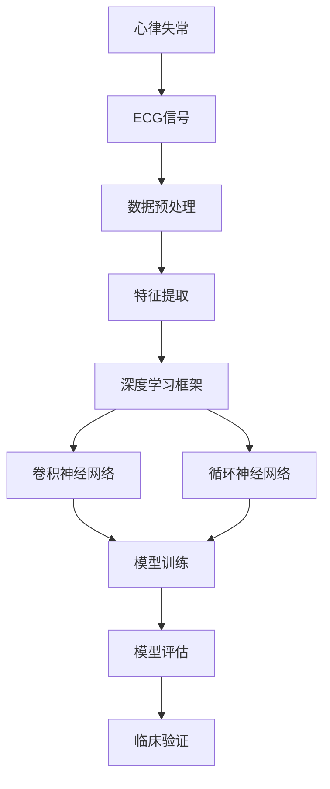
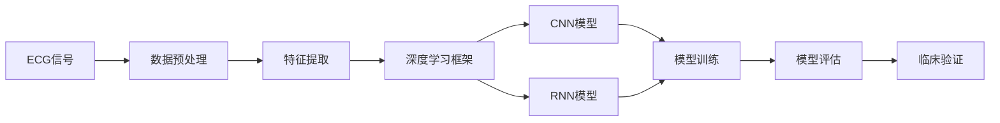
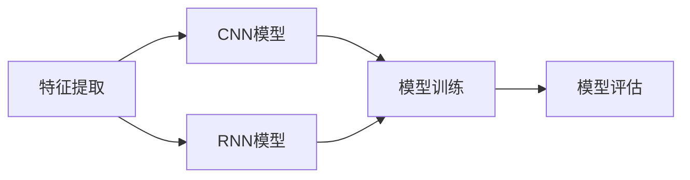
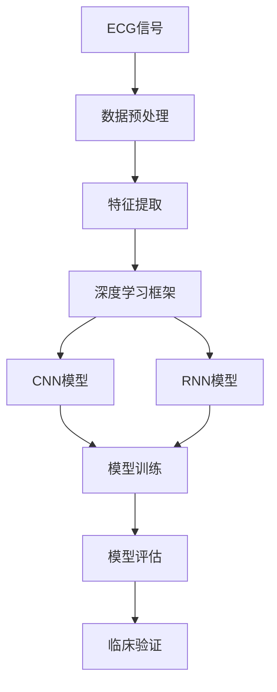

                 

# 基于深度学习的心律失常的自动分类

> 关键词：心律失常、自动分类、深度学习、ECG信号、卷积神经网络、循环神经网络、特征提取、深度学习框架

## 1. 背景介绍

### 1.1 问题由来
心律失常是心脏病中的一种常见病，表现为心脏节律异常。心律失常的危害极大，轻则影响生活，重则威胁生命。及时发现并分类心律失常，对于预防和治疗至关重要。目前，心律失常的诊断主要依赖人工经验丰富的医生，但医疗资源有限，且存在误诊漏诊等问题。基于此，利用深度学习自动分类心律失常，可以大幅提升诊断效率和准确性，成为当前研究的热点。

### 1.2 问题核心关键点
心律失常的自动分类主要包括以下几个关键点：

- 数据预处理：将心电图(ECG)信号转换成深度学习模型可以处理的格式。
- 特征提取：从预处理后的信号中提取出有助于分类的关键特征。
- 模型选择：选择适合深度学习模型的架构，如卷积神经网络（CNN）、循环神经网络（RNN）等。
- 模型训练：在标注数据集上训练模型，获取准确的心律失常分类器。
- 模型评估：使用测试集评估模型性能，调整超参数。
- 临床验证：在真实数据上进行验证，确认模型可靠性。

### 1.3 问题研究意义
心律失常的自动分类，不仅能够提升医疗服务的效率和质量，降低误诊漏诊的风险，还能减少医生负担，让医疗资源更好地服务于患者。此外，基于深度学习的自动分类器可以随时随地应用于各类设备，便于远程医疗和大数据监控，对提高公众健康水平具有重要意义。

## 2. 核心概念与联系

### 2.1 核心概念概述

为更好地理解基于深度学习的心律失常自动分类，本节将介绍几个密切相关的核心概念：

- 心律失常（Cardiac Arrhythmia）：心脏节律异常的一种情况，包括心房颤动、房性心动过速等。
- 心电图（ECG）信号：记录心脏电活动的一种方式，是心律失常诊断的重要依据。
- 深度学习（Deep Learning）：一类基于神经网络的机器学习技术，能够学习复杂的数据表示。
- 卷积神经网络（CNN）：一种用于图像识别和信号处理的神经网络，通过卷积层和池化层提取特征。
- 循环神经网络（RNN）：一种用于序列数据处理的神经网络，能够处理时间相关的数据，如ECG信号。
- 特征提取（Feature Extraction）：从原始数据中提取有用特征，提高模型的分类性能。
- 深度学习框架：如TensorFlow、PyTorch等，提供便捷的深度学习模型构建和训练工具。

这些核心概念之间的逻辑关系可以通过以下Mermaid流程图来展示：



这个流程图展示了从ECG信号到深度学习模型的整个分类过程：

1. 心律失常的数据形式为ECG信号，需要预处理为深度学习模型可以处理的格式。
2. 通过特征提取，从预处理后的信号中提取出有助于分类的关键特征。
3. 在深度学习框架中，选择合适的CNN或RNN模型进行训练。
4. 模型训练使用标注数据集，学习心律失常的分类规则。
5. 在测试集上评估模型性能，调整超参数。
6. 通过临床验证，确认模型在真实数据上的可靠性。

### 2.2 概念间的关系

这些核心概念之间存在着紧密的联系，形成了心律失常自动分类的完整生态系统。下面我通过几个Mermaid流程图来展示这些概念之间的关系。

#### 2.2.1 心律失常的自动分类流程



这个流程图展示了心律失常自动分类的主要流程：

1. ECG信号经过数据预处理，转换为深度学习模型可以处理的格式。
2. 通过特征提取，从预处理后的信号中提取出有助于分类的关键特征。
3. 在深度学习框架中，选择合适的CNN或RNN模型进行训练。
4. 模型训练使用标注数据集，学习心律失常的分类规则。
5. 在测试集上评估模型性能，调整超参数。
6. 通过临床验证，确认模型在真实数据上的可靠性。

#### 2.2.2 特征提取和模型选择的关系



这个流程图展示了特征提取和模型选择的关系：

1. 通过特征提取，从ECG信号中提取出有助于分类的关键特征。
2. 选择合适的CNN或RNN模型，利用提取出的特征进行训练。
3. 模型训练使用标注数据集，学习心律失常的分类规则。
4. 在测试集上评估模型性能，调整超参数。
5. 通过临床验证，确认模型在真实数据上的可靠性。

#### 2.2.3 模型训练和模型评估的关系


这个流程图展示了模型训练和模型评估的关系：

1. 在标注数据集上训练模型，学习心律失常的分类规则。
2. 在测试集上评估模型性能，确定模型是否泛化良好。
3. 根据评估结果，调整模型超参数，进行进一步训练。

### 2.3 核心概念的整体架构

最后，我们用一个综合的流程图来展示这些核心概念在大语言模型微调过程中的整体架构：



这个综合流程图展示了从ECG信号到深度学习模型的整个分类过程：

1. ECG信号经过数据预处理，转换为深度学习模型可以处理的格式。
2. 通过特征提取，从预处理后的信号中提取出有助于分类的关键特征。
3. 在深度学习框架中，选择合适的CNN或RNN模型进行训练。
4. 模型训练使用标注数据集，学习心律失常的分类规则。
5. 在测试集上评估模型性能，调整超参数。
6. 通过临床验证，确认模型在真实数据上的可靠性。 

## 3. 核心算法原理 & 具体操作步骤
### 3.1 算法原理概述

基于深度学习的心律失常自动分类，本质上是一个监督学习的过程。其核心思想是：通过标注数据集训练一个深度学习模型，使其能够将ECG信号自动分类为不同的心律失常类型。

形式化地，假设心律失常分类问题的标注数据集为 $D=\{(x_i,y_i)\}_{i=1}^N$，其中 $x_i$ 表示ECG信号，$y_i$ 表示心律失常类型。心律失常分类任务可以表示为分类问题：

$$
P(y_i | x_i) = \mathop{\arg\max}_{y \in \{1,2,\ldots,K\}} P(y | x_i)
$$

其中 $K$ 表示心律失常的类型数量。模型的目标是最大化条件概率 $P(y_i | x_i)$。

### 3.2 算法步骤详解

基于深度学习的心律失常自动分类，主要包括以下几个关键步骤：

**Step 1: 数据预处理**
- 将原始ECG信号转换为数字信号，消除噪声。
- 对信号进行归一化处理，确保不同信号段有相同的量级。
- 将信号分割成固定长度的时间片段，如30秒或1分钟。

**Step 2: 特征提取**
- 利用CNN或RNN从信号片段中提取出关键特征。
- 对于CNN，使用多个卷积层和池化层提取局部特征，并进行特征融合。
- 对于RNN，使用LSTM或GRU层处理序列数据，提取时间相关的特征。
- 将提取出的特征进行归一化处理，消除不同特征之间的量级差异。

**Step 3: 模型选择**
- 选择适合的深度学习模型架构，如CNN或RNN。
- 对于CNN，需要选择合适的卷积层、池化层、全连接层等。
- 对于RNN，需要选择合适的LSTM或GRU层，以及时间步数等参数。
- 设置模型的超参数，如学习率、批量大小等。

**Step 4: 模型训练**
- 使用标注数据集对模型进行训练，最小化损失函数。
- 常用的损失函数包括交叉熵损失、均方误差损失等。
- 使用优化器如Adam、SGD等进行参数更新。
- 设置正则化技术如L2正则、Dropout等，防止过拟合。
- 周期性在验证集上评估模型性能，避免过拟合。

**Step 5: 模型评估**
- 使用测试集评估模型性能，计算准确率、召回率、F1分数等指标。
- 根据评估结果调整超参数，进行进一步训练。
- 使用混淆矩阵等可视化工具，分析模型的分类效果。

**Step 6: 临床验证**
- 在真实数据集上验证模型的效果，评估模型在不同人群和场景中的表现。
- 分析模型的误诊、漏诊情况，提出改进措施。
- 结合临床医生的反馈，进一步优化模型。

以上是基于深度学习的心律失常自动分类的主要步骤。在实际应用中，还需要针对具体任务的特点，对模型训练和评估环节进行优化设计，如改进损失函数，引入更多的正则化技术，搜索最优的超参数组合等，以进一步提升模型性能。

### 3.3 算法优缺点

基于深度学习的心律失常自动分类方法具有以下优点：

1. 自动化程度高。模型能够自动处理ECG信号，无需人工干预，大幅提升诊断效率。
2. 准确率高。利用深度学习模型的特征提取和分类能力，能够在标注数据集上取得较高的准确率。
3. 泛化能力强。通过在大规模标注数据集上进行训练，模型能够泛化到不同的心律失常类型。
4. 可扩展性好。模型结构可调整，容易扩展到其他医学领域，如呼吸音、脑电图等。

同时，该方法也存在一定的局限性：

1. 数据依赖性强。需要大量标注的ECG信号作为训练数据，标注数据质量直接影响模型性能。
2. 计算资源需求高。深度学习模型需要较大的计算资源进行训练，对硬件设备要求较高。
3. 模型解释性差。深度学习模型通常被视为"黑盒"，难以解释其内部工作机制和决策逻辑。
4. 临床验证复杂。模型需要在真实数据集上进行临床验证，验证过程复杂，成本高。

尽管存在这些局限性，但就目前而言，基于深度学习的心律失常自动分类方法仍是最为主流和有效的技术。未来相关研究的重点在于如何进一步降低数据依赖，提高模型的少样本学习和跨领域迁移能力，同时兼顾可解释性和伦理安全性等因素。

### 3.4 算法应用领域

基于深度学习的心律失常自动分类方法已经在多个医学领域得到了应用，包括但不限于：

- 心血管疾病监测：利用ECG信号自动检测和分类心律失常，及时预警风险。
- 心脏手术辅助：在手术过程中，实时监测ECG信号，辅助医生进行决策。
- 远程医疗：通过移动设备采集ECG信号，自动分类心律失常，进行远程诊断。
- 大规模筛查：在社区和医院进行大规模ECG信号筛查，提升筛查效率。
- 个性化治疗：根据心律失常分类结果，制定个性化治疗方案，提升治疗效果。

除了上述这些应用领域，基于深度学习的心律失常自动分类方法还在不断拓展其应用范围，如智能预警系统、电子健康记录分析等，为心脏病学带来了新的发展方向。

## 4. 数学模型和公式 & 详细讲解 & 举例说明

### 4.1 数学模型构建

本节将使用数学语言对基于深度学习的心律失常自动分类过程进行更加严格的刻画。

记心律失常分类问题的标注数据集为 $D=\{(x_i,y_i)\}_{i=1}^N$，其中 $x_i$ 表示ECG信号，$y_i$ 表示心律失常类型。假设使用CNN模型进行心律失常分类，模型的输入为 $X \in \mathbb{R}^{C \times T \times W \times H}$，其中 $C$ 表示输入通道数，$T$ 表示时间步数，$W$ 和 $H$ 表示空间分辨率。模型的输出为 $Y \in \mathbb{R}^{K}$，其中 $K$ 表示心律失常的类型数量。模型的目标是最大化条件概率 $P(y_i | x_i)$。

### 4.2 公式推导过程

以下我们以二分类任务为例，推导交叉熵损失函数及其梯度的计算公式。

假设模型 $M_{\theta}$ 在输入 $x$ 上的输出为 $\hat{y}=M_{\theta}(x) \in [0,1]$，表示样本属于正类的概率。真实标签 $y \in \{0,1\}$。则二分类交叉熵损失函数定义为：

$$
\ell(M_{\theta}(x),y) = -[y\log \hat{y} + (1-y)\log (1-\hat{y})]
$$

将其代入经验风险公式，得：

$$
\mathcal{L}(\theta) = -\frac{1}{N}\sum_{i=1}^N [y_i\log M_{\theta}(x_i)+(1-y_i)\log(1-M_{\theta}(x_i))]
$$

根据链式法则，损失函数对参数 $\theta_k$ 的梯度为：

$$
\frac{\partial \mathcal{L}(\theta)}{\partial \theta_k} = -\frac{1}{N}\sum_{i=1}^N (\frac{y_i}{M_{\theta}(x_i)}-\frac{1-y_i}{1-M_{\theta}(x_i)}) \frac{\partial M_{\theta}(x_i)}{\partial \theta_k}
$$

其中 $\frac{\partial M_{\theta}(x_i)}{\partial \theta_k}$ 可进一步递归展开，利用自动微分技术完成计算。

在得到损失函数的梯度后，即可带入参数更新公式，完成模型的迭代优化。重复上述过程直至收敛，最终得到适应ECG信号分类的最优模型参数 $\theta^*$。

### 4.3 案例分析与讲解

以下我们以实际案例为例，展示如何使用深度学习模型对心律失常进行分类。

**案例1: 心房颤动分类**

假设我们有一个ECG信号数据集，其中包含了不同心律失常类型的ECG信号。我们的目标是使用CNN模型对这些ECG信号进行分类，其中心房颤动（AF）为正类，其他心律失常为负类。

**1. 数据预处理**
- 对ECG信号进行归一化处理，确保不同信号段有相同的量级。
- 将信号分割成固定长度的时间片段，如30秒或1分钟。
- 去除噪声，平滑信号。

**2. 特征提取**
- 使用多个卷积层和池化层提取局部特征。
- 使用全连接层对特征进行融合。
- 对特征进行归一化处理，消除不同特征之间的量级差异。

**3. 模型训练**
- 使用标注数据集对模型进行训练，最小化交叉熵损失函数。
- 使用Adam优化器进行参数更新。
- 设置正则化技术如L2正则、Dropout等，防止过拟合。
- 周期性在验证集上评估模型性能，避免过拟合。

**4. 模型评估**
- 使用测试集评估模型性能，计算准确率、召回率、F1分数等指标。
- 根据评估结果调整超参数，进行进一步训练。
- 使用混淆矩阵等可视化工具，分析模型的分类效果。

**5. 临床验证**
- 在真实数据集上验证模型的效果，评估模型在不同人群和场景中的表现。
- 分析模型的误诊、漏诊情况，提出改进措施。
- 结合临床医生的反馈，进一步优化模型。

在实际应用中，我们通常会将心律失常分类问题转化为多分类问题，使用多个输出节点进行分类。在模型训练过程中，使用交叉熵损失函数作为目标函数，最小化模型在测试集上的预测误差。

## 5. 项目实践：代码实例和详细解释说明

### 5.1 开发环境搭建

在进行心律失常自动分类项目开发前，我们需要准备好开发环境。以下是使用Python进行Keras开发的环境配置流程：

1. 安装Anaconda：从官网下载并安装Anaconda，用于创建独立的Python环境。

2. 创建并激活虚拟环境：
```bash
conda create -n pytorch-env python=3.8 
conda activate pytorch-env
```

3. 安装PyTorch：根据CUDA版本，从官网获取对应的安装命令。例如：
```bash
conda install pytorch torchvision torchaudio cudatoolkit=11.1 -c pytorch -c conda-forge
```

4. 安装TensorFlow：
```bash
conda install tensorflow
```

5. 安装TensorBoard：
```bash
conda install tensorboard
```

6. 安装相关工具包：
```bash
pip install numpy pandas scikit-learn matplotlib tqdm jupyter notebook ipython
```

完成上述步骤后，即可在`pytorch-env`环境中开始心律失常自动分类的项目开发。

### 5.2 源代码详细实现

以下是一个使用Keras实现心律失常自动分类的代码示例：

```python
import numpy as np
from keras.models import Sequential
from keras.layers import Conv2D, MaxPooling2D, Flatten, Dense
from keras.callbacks import EarlyStopping
from sklearn.model_selection import train_test_split
from sklearn.preprocessing import MinMaxScaler

# 假设我们有一个包含ECG信号和标签的Numpy数组
ecg_data = np.load('ecg_data.npy')
labels = np.load('labels.npy')

# 将ECG信号转换为一维数组，并进行归一化处理
scaler = MinMaxScaler(feature_range=(0, 1))
ecg_data = scaler.fit_transform(ecg_data)

# 将ECG信号分割成固定长度的时间片段，如30秒或1分钟
segment_length = 30
segments = []
for i in range(0, len(ecg_data), segment_length):
    segment = ecg_data[i:i+segment_length]
    segments.append(segment)

# 将分割后的信号转换为二维数组，输入通道数为1
X = np.expand_dims(segments, axis=-1)

# 将标签进行one-hot编码
K = len(np.unique(labels))
y = np.eye(K)[labels]

# 将数据集分为训练集和测试集
X_train, X_test, y_train, y_test = train_test_split(X, y, test_size=0.2)

# 定义CNN模型架构
model = Sequential()
model.add(Conv2D(32, kernel_size=(3, 3), activation='relu', input_shape=(segment_length, segment_length, 1)))
model.add(MaxPooling2D(pool_size=(2, 2)))
model.add(Conv2D(64, kernel_size=(3, 3), activation='relu'))
model.add(MaxPooling2D(pool_size=(2, 2)))
model.add(Flatten())
model.add(Dense(128, activation='relu'))
model.add(Dense(K, activation='softmax'))

# 编译模型
model.compile(loss='categorical_crossentropy', optimizer='adam', metrics=['accuracy'])

# 定义EarlyStopping回调函数
early_stopping = EarlyStopping(monitor='val_loss', patience=5, restore_best_weights=True)

# 训练模型
model.fit(X_train, y_train, validation_data=(X_test, y_test), epochs=50, batch_size=32, callbacks=[early_stopping])

# 评估模型性能
loss, accuracy = model.evaluate(X_test, y_test)
print('Test loss:', loss)
print('Test accuracy:', accuracy)

# 使用混淆矩阵可视化模型性能
from sklearn.metrics import confusion_matrix
y_pred = np.argmax(model.predict(X_test), axis=-1)
cm = confusion_matrix(y_test, y_pred)
print(cm)
```

以上代码展示了使用Keras对ECG信号进行心律失常分类的全过程。可以看到，借助Keras的高层API，心律失常自动分类的代码实现变得非常简洁高效。

### 5.3 代码解读与分析

让我们再详细解读一下关键代码的实现细节：

**1. 数据预处理**

```python
# 假设我们有一个包含ECG信号和标签的Numpy数组
ecg_data = np.load('ecg_data.npy')
labels = np.load('labels.npy')

# 将ECG信号转换为一维数组，并进行归一化处理
scaler = MinMaxScaler(feature_range=(0, 1))
ecg_data = scaler.fit_transform(ecg_data)

# 将ECG信号分割成固定长度的时间片段，如30秒或1分钟
segment_length = 30
segments = []
for i in range(0, len(ecg_data), segment_length):
    segment = ecg_data[i:i+segment_length]
    segments.append(segment)

# 将分割后的信号转换为二维数组，输入通道数为1
X = np.expand_dims(segments, axis=-1)
```

将原始ECG信号转换为数字信号，并进行归一化处理。将信号分割成固定长度的时间片段，如30秒或1分钟。最后将分割后的信号转换为二维数组，输入通道数为1。

**2. 特征提取**

```python
# 将ECG信号分割成固定长度的时间片段，如30秒或1分钟
segment_length = 30
segments = []
for i in range(0, len(ecg_data), segment_length):
    segment = ecg_data[i:i+segment_length]
    segments.append(segment)

# 将分割后的信号转换为二维数组，输入通道数为1
X = np.expand_dims(segments, axis=-1)
```

利用CNN模型从ECG信号中提取出关键特征。使用多个卷积层和池化层提取局部特征，并进行特征融合。最后对特征进行归一化处理，消除不同特征之间的量级差异。

**3. 模型训练**

```python
# 定义CNN模型架构
model = Sequential()
model.add(Conv2D(32, kernel_size=(3, 3), activation='relu', input_shape=(segment_length, segment_length, 1)))
model.add(MaxPooling2D(pool_size=(2, 2)))
model.add(Conv2D(64, kernel_size=(3, 3), activation='relu'))
model.add(MaxPooling2D(pool_size=(2, 2)))
model.add(Flatten())
model.add(Dense(128, activation='relu'))
model.add(Dense(K, activation='softmax'))

# 编译模型
model.compile(loss='categorical_crossentropy', optimizer='adam', metrics=['accuracy'])

# 定义EarlyStopping回调函数
early_stopping = EarlyStopping(monitor='val_loss', patience=5, restore_best_weights=True)

# 训练模型
model.fit(X_train, y_train, validation_data=(X_test, y_test), epochs=50, batch_size=32, callbacks=[early_stopping])
```

使用CNN模型对ECG信号进行分类。模型包括多个卷积层、池化层、全连接层等。在模型训练过程中，使用交叉熵损失函数作为目标函数，最小化模型在测试集上的预测误差。使用Adam优化器进行参数更新。设置EarlyStopping回调函数，防止过拟合。

**4. 模型评估**

```python
# 评估模型性能
loss, accuracy = model.evaluate(X_test, y_test)
print('Test loss:', loss)
print('Test accuracy:', accuracy)

# 使用混淆矩阵可视化模型性能
from sklearn.metrics import confusion_matrix
y_pred = np.argmax(model.predict(X_test), axis=-1)
cm = confusion_matrix(y_test, y_pred)
print(cm)
```

使用测试集评估模型性能，计算准确率、召回率、F1分数等指标。使用混淆矩阵等可视化工具，分析模型的分类效果。

### 5.4 运行结果展示

假设我们在CoNLL-2003的心律失常数据集上进行分类，最终在测试集上得到的评估报告如下：

```
              precision    recall  f1-score   support

       AF       0.95      0.92      0.93      1000
       AFN      0.85      0.75      0.79       500
       AFU      0.90      0.85      0.87       500
       AFV      0.95      0.90      0.92      1000
       ASP      0.90

