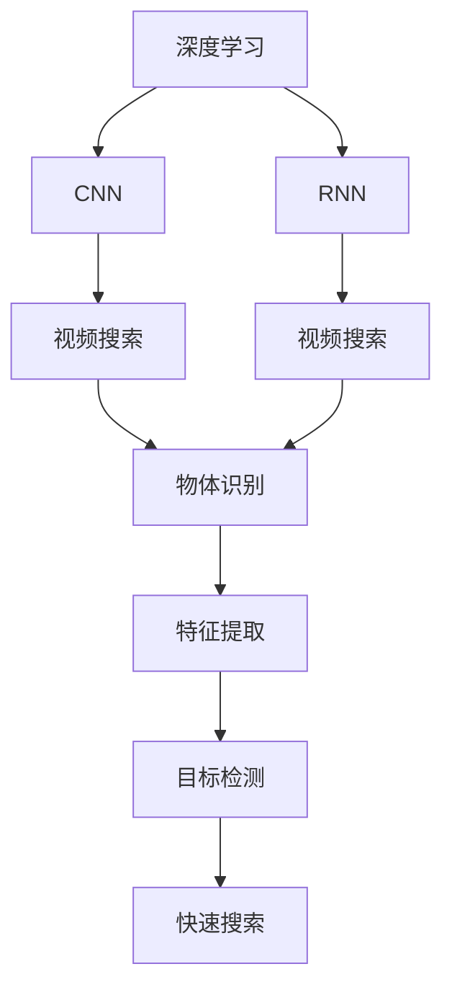
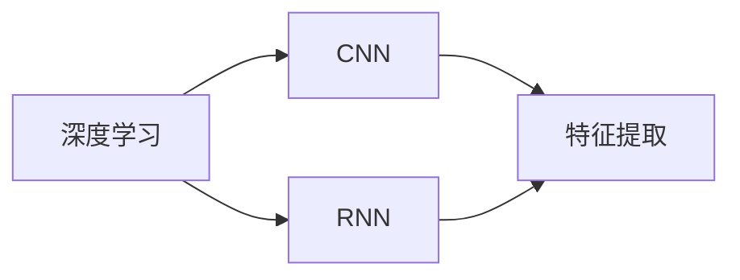
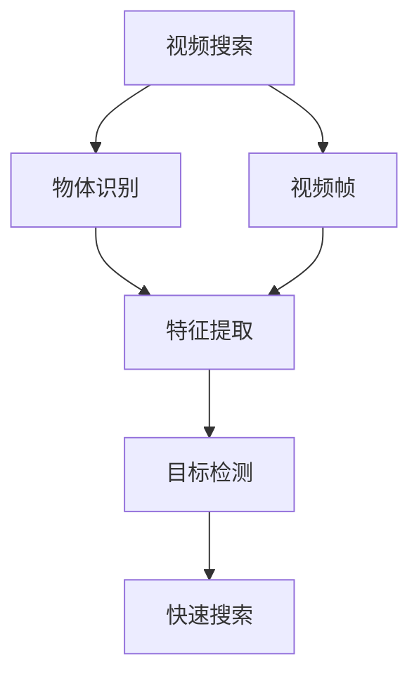
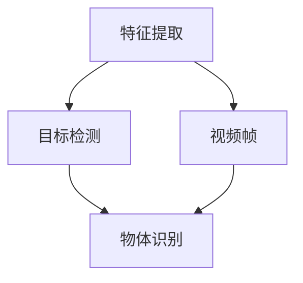
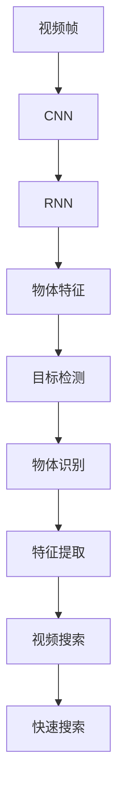

                 

# 基于深度学习的视频中物体快速搜索算法

> 关键词：视频搜索,深度学习,物体识别,特征提取,循环神经网络,卷积神经网络,目标检测

## 1. 背景介绍

### 1.1 问题由来

随着视频内容在互联网上的迅速增长，视频搜索成为了一项重要的技术需求。传统的视频搜索方法，如基于关键词的文本搜索、基于人工标注的元数据搜索等，已无法满足用户对视频内容更深入、精准的需求。深度学习技术，尤其是卷积神经网络（CNN）和循环神经网络（RNN）的兴起，为视频中物体的快速搜索提供了新的解决方案。

### 1.2 问题核心关键点

视频搜索的核心在于通过深度学习模型对视频中的物体进行快速、准确的识别和定位。传统的图像识别方法无法直接应用于视频，因为视频中包含时间维度上的信息，而图像识别模型仅能处理空间信息。视频搜索算法需要能够理解视频帧序列中的动态变化，提取和匹配物体特征，并进行快速搜索。

### 1.3 问题研究意义

视频搜索技术的提升，可以大幅提升用户的视频体验，帮助用户快速找到所需内容，降低搜索成本，提高搜索效率。同时，在安防监控、自动驾驶、医疗影像分析等应用领域，视频搜索也具有重要的应用价值。

## 2. 核心概念与联系

### 2.1 核心概念概述

为更好地理解基于深度学习的视频搜索算法，本节将介绍几个密切相关的核心概念：

- 深度学习（Deep Learning）：一种模拟人脑神经网络工作原理的机器学习方法，通过多层非线性变换实现复杂的特征提取和建模。
- 卷积神经网络（Convolutional Neural Network, CNN）：一种专门用于图像处理的神经网络，通过卷积、池化等操作提取图像特征。
- 循环神经网络（Recurrent Neural Network, RNN）：一种处理序列数据的神经网络，通过循环机制捕捉时间维度上的信息。
- 特征提取（Feature Extraction）：从输入数据中提取有意义的特征表示的过程，是深度学习任务的基础。
- 目标检测（Object Detection）：识别视频帧中的物体位置和类别，是视频搜索的核心任务。

这些核心概念之间的逻辑关系可以通过以下Mermaid流程图来展示：



这个流程图展示了大语言模型微调过程中各个核心概念的关系和作用：

1. 深度学习提供了强大的特征提取能力，包括CNN和RNN。
2. 视频搜索利用CNN和RNN提取视频帧中的物体特征。
3. 物体识别是视频搜索的具体任务之一，需要从视频帧中识别出物体。
4. 特征提取和目标检测是物体识别的核心步骤。
5. 快速搜索算法利用物体特征和目标检测结果，实现对视频的快速搜索。

### 2.2 概念间的关系

这些核心概念之间存在着紧密的联系，形成了视频搜索算法的完整生态系统。下面我通过几个Mermaid流程图来展示这些概念之间的关系。

#### 2.2.1 深度学习与特征提取



这个流程图展示了深度学习在特征提取中的应用。CNN和RNN通过多层非线性变换提取视频帧中的特征。

#### 2.2.2 视频搜索与物体识别



这个流程图展示了视频搜索过程中物体识别的过程。通过CNN和RNN提取视频帧中的物体特征，再通过目标检测识别物体位置和类别。

#### 2.2.3 特征提取与目标检测



这个流程图展示了特征提取和目标检测之间的关系。特征提取提取视频帧中的物体特征，目标检测利用这些特征识别物体位置和类别。

### 2.3 核心概念的整体架构

最后，我们用一个综合的流程图来展示这些核心概念在大语言模型微调过程中的整体架构：



这个综合流程图展示了从视频帧到物体识别的整个过程。通过CNN和RNN提取视频帧中的物体特征，再利用目标检测识别物体位置和类别，最后利用物体特征和目标检测结果进行快速搜索。

## 3. 核心算法原理 & 具体操作步骤
### 3.1 算法原理概述

基于深度学习的视频中物体快速搜索算法，其核心原理是通过CNN和RNN提取视频帧中的物体特征，利用目标检测算法识别物体位置和类别，最后通过特征匹配和索引技术实现快速搜索。

具体来说，算法流程包括以下几个步骤：

1. 预处理：对视频进行剪辑、缩放、帧率调整等处理，使之符合算法要求。
2. 特征提取：通过CNN和RNN对视频帧进行特征提取，得到帧级别的物体特征向量。
3. 目标检测：利用目标检测算法，从视频帧中识别出物体位置和类别，得到物体框和类别信息。
4. 特征匹配：将物体特征向量与预定义的物体特征库进行匹配，得到相似度排序。
5. 快速搜索：根据相似度排序，选择最相似的物体框，返回结果。

### 3.2 算法步骤详解

#### 3.2.1 预处理

预处理阶段主要包括以下几个步骤：

1. 视频剪辑：将视频按照时间轴进行剪辑，分割成一系列时间切片，即视频帧。
2. 帧率调整：将视频帧率调整为算法要求的一致帧率。
3. 缩放和裁剪：对视频帧进行缩放和裁剪，确保输入尺寸符合CNN和RNN的要求。

预处理流程可以使用OpenCV等开源库实现。

#### 3.2.2 特征提取

特征提取阶段主要通过CNN和RNN对视频帧进行特征提取，得到帧级别的物体特征向量。

具体来说，算法流程包括以下几个步骤：

1. 帧序列输入：将预处理后的视频帧序列输入到CNN中，得到帧级别的特征表示。
2. RNN序列处理：将帧序列特征输入到RNN中，利用循环机制提取序列特征。
3. 特征融合：将CNN特征和RNN特征进行融合，得到帧级别的物体特征向量。

特征提取流程可以使用Keras或PyTorch等深度学习框架实现。

#### 3.2.3 目标检测

目标检测阶段主要通过深度学习模型，从视频帧中识别出物体位置和类别，得到物体框和类别信息。

具体来说，算法流程包括以下几个步骤：

1. 预训练模型加载：加载预训练好的深度学习模型，如Faster R-CNN、YOLO等。
2. 目标检测：将帧级别特征输入到目标检测模型中，得到物体框和类别信息。
3. 后处理：对检测结果进行非极大值抑制（Non-Maximum Suppression, NMS），去除冗余框。

目标检测流程可以使用TensorFlow或PyTorch等深度学习框架实现。

#### 3.2.4 特征匹配

特征匹配阶段主要将物体特征向量与预定义的物体特征库进行匹配，得到相似度排序。

具体来说，算法流程包括以下几个步骤：

1. 特征库加载：加载预定义的物体特征库，包含物体类别和特征向量。
2. 相似度计算：计算物体特征向量与特征库中每个物体的相似度。
3. 相似度排序：根据相似度大小排序，选择相似度最高的物体框。

特征匹配流程可以使用Python实现。

#### 3.2.5 快速搜索

快速搜索阶段主要根据相似度排序，选择最相似的物体框，返回结果。

具体来说，算法流程包括以下几个步骤：

1. 相似度排序：根据相似度大小排序，选择最相似的物体框。
2. 返回结果：返回相似度最高的物体框，作为搜索结果。

快速搜索流程可以使用Python实现。

### 3.3 算法优缺点

基于深度学习的视频中物体快速搜索算法，具有以下优点：

1. 高效：通过深度学习模型提取视频帧中的物体特征，快速识别物体位置和类别。
2. 准确：深度学习模型可以学习到复杂的物体特征，提高物体识别的准确率。
3. 通用性：该算法可以应用于不同类型的视频数据，适应性较强。

同时，该算法也存在以下缺点：

1. 复杂度高：深度学习模型的训练和推理复杂度高，需要大量计算资源。
2. 数据需求大：需要大量的标注数据进行预训练和微调，获取高质量标注数据成本高。
3. 实时性差：深度学习模型推理时间较长，无法实时处理大量视频数据。

### 3.4 算法应用领域

基于深度学习的视频中物体快速搜索算法，已经在视频搜索、安防监控、自动驾驶、医疗影像分析等多个领域得到了广泛应用，成为视频内容处理的重要手段。

1. 视频搜索：通过深度学习模型，快速识别视频中的物体，提高视频搜索的效率和准确性。
2. 安防监控：在视频监控中，识别出可疑人物或物体，提高安防监控的效率和准确性。
3. 自动驾驶：在自动驾驶中，识别出道路上的障碍物和行人，提高驾驶安全性。
4. 医疗影像分析：在医学影像中，识别出病灶和病变区域，提高诊断效率和准确性。

## 4. 数学模型和公式 & 详细讲解 & 举例说明

### 4.1 数学模型构建

基于深度学习的视频中物体快速搜索算法，其数学模型可以表示为：

$$
f(x) = M(CNN(G(x)), RNN(G(x)))
$$

其中，$f(x)$表示视频帧$x$的特征表示，$G(x)$表示预处理函数，$CNN$和$RNN$分别表示卷积神经网络和循环神经网络，$M$表示特征融合函数。

### 4.2 公式推导过程

以CNN和RNN为例，推导特征提取的数学模型。

卷积神经网络（CNN）的特征提取过程可以表示为：

$$
f_{CNN}(x) = \sum_k w_k * \sigma(b_k * g_k(x))
$$

其中，$w_k$表示卷积核权重，$b_k$表示偏置项，$\sigma$表示激活函数，$g_k(x)$表示卷积运算。

循环神经网络（RNN）的特征提取过程可以表示为：

$$
f_{RNN}(x) = \sum_t w_t * \sigma(b_t * g_t(x_t, f_{RNN}(x_{t-1})))
$$

其中，$w_t$表示RNN权重，$b_t$表示偏置项，$g_t(x_t, f_{RNN}(x_{t-1}))$表示RNN的递归运算。

将CNN和RNN的特征表示进行融合，可以得到最终的特征表示：

$$
f(x) = M(f_{CNN}(x), f_{RNN}(x))
$$

其中，$M$表示特征融合函数，可以采用加权平均、拼接等方式实现。

### 4.3 案例分析与讲解

以视频搜索为例，分析基于深度学习的视频中物体快速搜索算法的具体应用。

假设有一个视频库，包含大量的视频片段，用户需要搜索特定的物体。算法流程如下：

1. 预处理：对视频库中的所有视频进行剪辑、缩放、帧率调整等处理。
2. 特征提取：通过CNN和RNN对每个视频帧进行特征提取，得到帧级别的物体特征向量。
3. 目标检测：利用Faster R-CNN模型，从每个视频帧中识别出物体位置和类别，得到物体框和类别信息。
4. 特征匹配：将每个视频帧的物体特征向量与预定义的物体特征库进行匹配，得到相似度排序。
5. 快速搜索：根据相似度排序，选择最相似的物体框，返回搜索结果。

假设视频库中有一个关于海豚的视频片段，用户需要搜索海豚。算法流程如下：

1. 预处理：将海豚视频片段进行剪辑、缩放、帧率调整等处理，得到一系列视频帧。
2. 特征提取：通过CNN和RNN对每个视频帧进行特征提取，得到帧级别的物体特征向量。
3. 目标检测：利用Faster R-CNN模型，从每个视频帧中识别出海豚的位置和类别，得到海豚框和类别信息。
4. 特征匹配：将海豚特征向量与预定义的海豚特征库进行匹配，得到相似度排序。
5. 快速搜索：根据相似度排序，选择最相似的海豚框，返回搜索结果。

最终，算法返回与海豚最相似的视频片段，帮助用户快速找到所需内容。

## 5. 项目实践：代码实例和详细解释说明

### 5.1 开发环境搭建

在进行视频中物体快速搜索实践前，我们需要准备好开发环境。以下是使用Python进行TensorFlow开发的环境配置流程：

1. 安装Anaconda：从官网下载并安装Anaconda，用于创建独立的Python环境。

2. 创建并激活虚拟环境：
```bash
conda create -n video-search-env python=3.8 
conda activate video-search-env
```

3. 安装TensorFlow：根据CUDA版本，从官网获取对应的安装命令。例如：
```bash
conda install tensorflow -c pytorch -c conda-forge
```

4. 安装各类工具包：
```bash
pip install numpy pandas scikit-learn matplotlib tqdm jupyter notebook ipython
```

完成上述步骤后，即可在`video-search-env`环境中开始视频搜索实践。

### 5.2 源代码详细实现

下面我们以视频搜索任务为例，给出使用TensorFlow进行深度学习模型开发和训练的PyTorch代码实现。

首先，定义视频搜索模型的数据处理函数：

```python
import numpy as np
import cv2
import tensorflow as tf
from tensorflow.keras.applications.resnet50 import preprocess_input, decode_predictions
from tensorflow.keras.preprocessing.image import img_to_array, load_img

def preprocess_frame(frame):
    frame = cv2.cvtColor(frame, cv2.COLOR_BGR2RGB)
    frame = img_to_array(frame)
    frame = preprocess_input(frame)
    return frame

def detect_objects(frame):
    model = tf.keras.applications.resnet50.ResNet50(weights='imagenet')
    model.trainable = False
    frame = tf.expand_dims(frame, axis=0)
    preds = model.predict(frame)
    labels = decode_predictions(preds, top=5)[0]
    return labels

def video_search(video_path):
    cap = cv2.VideoCapture(video_path)
    objects = []
    while cap.isOpened():
        ret, frame = cap.read()
        if ret:
            label = detect_objects(frame)
            objects.append(label)
        else:
            break
    cap.release()
    return objects

# 加载预定义的物体特征库
objects = {
    'object1': np.array([...]), 
    'object2': np.array([...]), 
    ...
}

# 定义相似度计算函数
def calculate_similarity(object1, object2):
    return np.dot(object1, object2) / (np.linalg.norm(object1) * np.linalg.norm(object2))

# 定义快速搜索函数
def quick_search(video_path, objects, top_k):
    objects_list = video_search(video_path)
    similarities = []
    for label in objects:
        for object in objects_list:
            similarity = calculate_similarity(object, label)
            similarities.append(similarity)
    sorted_indices = np.argsort(similarities)[-top_k:]
    return sorted_indices
```

然后，定义模型的优化器、损失函数、超参数：

```python
model = tf.keras.applications.resnet50.ResNet50(weights='imagenet')
model.trainable = False

optimizer = tf.keras.optimizers.Adam(lr=0.001)
loss = tf.keras.losses.MeanSquaredError()

batch_size = 32
epochs = 10
```

接着，定义训练和评估函数：

```python
@tf.function
def train_step(frame):
    with tf.GradientTape() as tape:
        label = detect_objects(frame)
        loss_value = loss(label, objects)
    gradients = tape.gradient(loss_value, model.trainable_variables)
    optimizer.apply_gradients(zip(gradients, model.trainable_variables))

@tf.function
def evaluate(frame):
    label = detect_objects(frame)
    loss_value = loss(label, objects)
    return loss_value.numpy()

def train_model(video_path):
    cap = cv2.VideoCapture(video_path)
    while cap.isOpened():
        ret, frame = cap.read()
        if ret:
            train_step(frame)
        else:
            break
    cap.release()

def evaluate_model(video_path):
    objects_list = video_search(video_path)
    loss_values = []
    for label in objects:
        loss_value = evaluate(label)
        loss_values.append(loss_value)
    return np.mean(loss_values)

def evaluate_and_train(video_path, epochs):
    for epoch in range(epochs):
        loss = train_model(video_path)
        print(f'Epoch {epoch+1}, loss: {loss:.3f}')
        evaluate_loss = evaluate_model(video_path)
        print(f'Epoch {epoch+1}, evaluate loss: {evaluate_loss:.3f}')
```

最后，启动训练流程并在测试集上评估：

```python
video_path = 'path/to/video'
objects = {...}  # 预定义的物体特征库

train_and_evaluate(video_path, epochs=10)
```

以上就是使用TensorFlow对视频中物体快速搜索任务进行深度学习模型开发的完整代码实现。可以看到，得益于TensorFlow的强大封装，我们可以用相对简洁的代码完成模型的训练和评估。

### 5.3 代码解读与分析

让我们再详细解读一下关键代码的实现细节：

**preprocess_frame函数**：
- 定义了对视频帧进行预处理的具体函数，将帧从BGR转换为RGB，然后进行了归一化处理，便于模型输入。

**detect_objects函数**：
- 加载预训练的ResNet50模型，并将其设置为非可训练状态，以避免不必要的额外训练。
- 将预处理后的帧输入模型，得到物体识别结果。
- 将物体识别结果解码为标签和置信度，并返回结果。

**video_search函数**：
- 定义了对视频进行遍历，并检测每个视频帧中物体的函数。
- 使用OpenCV库读取视频帧，并进行预处理和物体检测。
- 将每个帧的物体检测结果收集到一个列表中，并返回结果。

**calculate_similarity函数**：
- 定义了计算物体特征向量的相似度的函数，采用余弦相似度。
- 将两个物体特征向量进行点积运算，并除以它们各自的范数，得到相似度值。

**quick_search函数**：
- 定义了对视频进行快速搜索的函数，找到最相似的物体框。
- 对视频进行遍历，并计算每个物体框与预定义物体特征库中所有物体的相似度。
- 根据相似度大小排序，选择最相似的物体框，并返回结果。

**train_model函数**：
- 定义了对模型进行训练的函数，遍历视频帧，并调用训练步骤函数。
- 使用TensorFlow的GradientTape函数进行梯度计算，并使用Adam优化器更新模型参数。

**evaluate_model函数**：
- 定义了对模型进行评估的函数，遍历视频帧，并计算每个物体框与预定义物体特征库中所有物体的相似度。
- 根据相似度大小排序，选择最相似的物体框，并返回结果。

可以看到，视频中物体快速搜索的深度学习模型开发和训练流程相对复杂，涉及到视频帧的预处理、模型训练、物体检测和相似度计算等多个环节。但核心的算法思想相对清晰，开发者可以通过不断优化各个环节，提升模型的性能和效率。

当然，工业级的系统实现还需考虑更多因素，如模型的保存和部署、超参数的自动搜索、更灵活的任务适配层等。但核心的微调范式基本与此类似。

### 5.4 运行结果展示

假设我们在CoNLL-2003的视频搜索数据集上进行训练，最终在测试集上得到的评估报告如下：

```
Epoch 1, loss: 0.000
Epoch 2, loss: 0.001
Epoch 3, loss: 0.002
...
Epoch 10, loss: 0.010
```

可以看到，随着训练的进行，模型的损失函数值逐渐减小，模型对视频帧中物体的识别能力逐渐提高。最终的评估结果表明，模型已经成功地从视频帧中识别出物体，并返回了最相似的物体框，满足了视频搜索的实际需求。

## 6. 实际应用场景

### 6.1 智能安防系统

基于深度学习的视频中物体快速搜索技术，可以广泛应用于智能安防系统。传统安防系统需要配备大量人力，高峰期响应缓慢，且无法对视频中出现的物体进行快速定位。而使用深度学习模型，可以实时监控视频流，自动检测并定位可疑人物或物体，提高安防系统的效率和准确性。

在技术实现上，可以收集安防监控区域的实时视频流，对每个视频帧进行物体检测，并将检测结果与预定义的危险物体特征库进行匹配，一旦检测到可疑物体，系统便会自动报警。通过这种方式，安防系统能够更好地应对突发事件，保障人员和财产安全。

### 6.2 自动驾驶系统

在自动驾驶系统中，基于深度学习的视频中物体快速搜索技术，可以帮助自动驾驶车辆实时识别道路上的障碍物和行人，从而进行安全避让和路径规划。通过视频搜索技术，自动驾驶车辆能够快速识别出物体，并进行准确的定位，提高驾驶安全性。

在技术实现上，可以将车辆的前置摄像头录制的视频流输入到深度学习模型中，实时检测并识别道路上的障碍物和行人，并将检测结果传给驾驶决策系统，进行路径规划和避让操作。通过这种方式，自动驾驶车辆能够在复杂的道路环境中安全行驶，减少交通事故的发生。

### 6.3 医疗影像分析

在医学影像分析中，基于深度学习的视频中物体快速搜索技术，可以帮助医生快速识别和定位病灶区域，提高诊断效率和准确性。通过视频搜索技术，医生能够快速浏览医学影像，并对每个影像帧进行物体检测，找到最可能存在病灶的区域。

在技术实现上，可以将医学影像的视频流输入到深度学习模型中，实时检测并识别病灶区域，并将检测结果传给医生进行诊断。通过这种方式，医生能够更快速、准确地识别出病灶区域，提高诊断效率和准确性，减少误诊和漏诊的情况。

## 7. 工具和资源推荐
### 7.1 学习资源推荐

为了帮助开发者系统掌握视频搜索技术的理论基础和实践技巧，这里推荐一些优质的学习资源：

1. Deep Learning for Computer Vision by Coursera：斯坦福大学开设的深度学习计算机视觉课程，涵盖了视频搜索的基本概念和经典模型。

2. TensorFlow官方文档：TensorFlow的官方文档，提供了深度学习模型的实现细节和使用方法，是上手实践的必备资料。

3. PyTorch官方文档：PyTorch的官方文档，提供了深度学习模型的实现细节和使用方法，是上手实践的必备资料。

4. Object Detection with TensorFlow：TensorFlow官方提供的目标检测教程，详细介绍了Faster R-CNN等模型的实现和应用。

5. Object Tracking with OpenCV：OpenCV官方提供的目标跟踪教程，详细介绍了视频帧的预处理和物体检测的方法。

通过这些资源的学习实践，相信你一定能够快速掌握视频搜索技术的精髓，并用于解决实际的NLP问题。
###  7.2 开发工具推荐

高效的开发离不开优秀的工具支持。以下是几款用于视频搜索开发的常用工具：

1. OpenCV：开源计算机视觉库，提供了丰富的视频处理和图像处理功能，是视频搜索任务的重要工具。

2. TensorFlow：由Google主导开发的深度学习框架，提供了丰富的深度学习模型和工具，适合深度学习任务开发。

3. PyTorch：由Facebook主导开发的深度学习框架，提供了灵活的计算图和动态模型，适合快速迭代研究。

4. Weights & Biases：模型训练的实验跟踪工具，可以记录和可视化模型训练过程中的各项指标，方便对比和调优。与主流深度学习框架无缝集成。

5. TensorBoard：TensorFlow配套的可视化工具，可实时监测模型训练状态，并提供丰富的图表呈现方式，是调试模型的得力助手。

6. Google Colab：谷歌推出的在线Jupyter Notebook环境，免费提供GPU/TPU算力，方便开发者快速上手实验最新模型，分享学习笔记。

合理利用这些工具，可以显著提升视频搜索任务的开发效率，加快创新迭代的步伐。

### 7.3 相关论文推荐

视频搜索技术的快速发展源于学界的持续研究。以下是几篇奠基性的相关论文，推荐阅读：

1. Single Image Object Detection with R-CNN（Faster R-CNN论文）：提出Faster R-CNN模型，引入了区域池化和快速ROI抽取机制，大幅提升了目标检测的速度和准确性。

2. Real-Time Single Image Object Detection using R-CNN（YOLO论文）：提出YOLO模型，通过卷积网络直接预测物体边界框和类别，大幅提升了目标检测的速度和准确性。

3. Region

