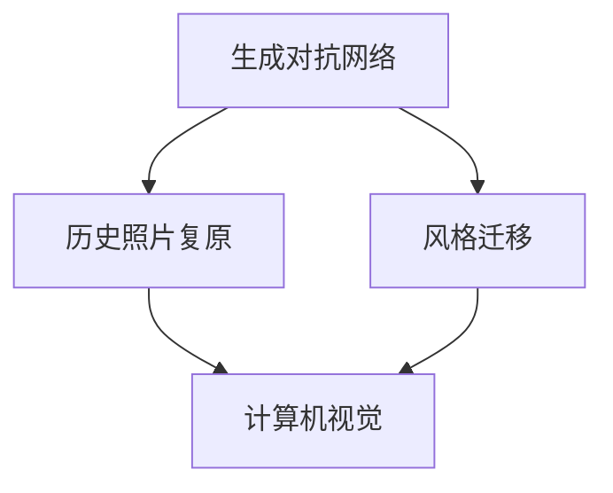
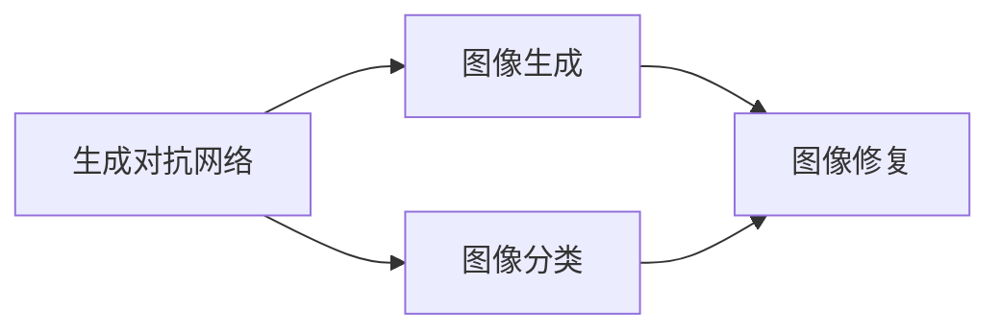
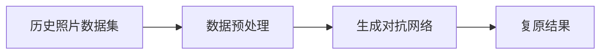
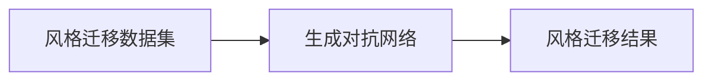
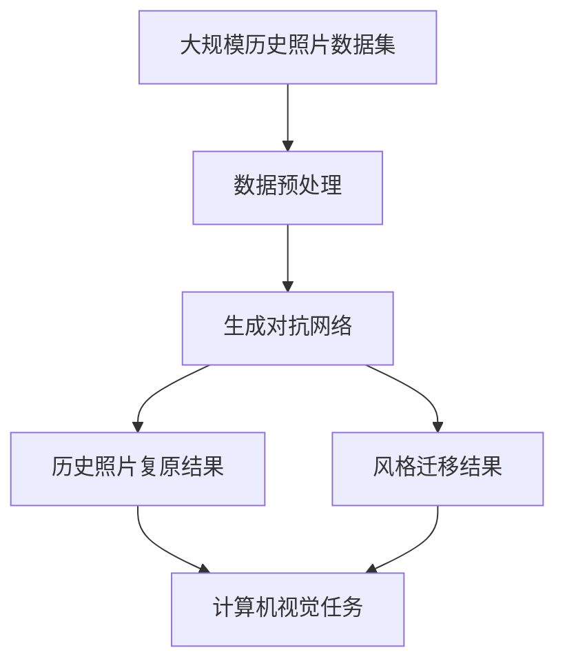

                 

# 基于生成对抗网络的历史照片复原与风格迁移研究

> 关键词：生成对抗网络,历史照片复原,风格迁移,神经网络,深度学习,计算机视觉

## 1. 背景介绍

### 1.1 问题由来
随着数字化时代的到来，人们越来越重视历史照片的保护和数字化。然而，许多历史照片因为时间久远，存在褪色、模糊、噪声等问题，严重影响了其可视效果。因此，如何有效地修复这些历史照片，恢复其原本的面貌，成为一个亟待解决的问题。

在图像处理领域，生成对抗网络（Generative Adversarial Networks, GANs）以其强大的生成能力，在图像修复和风格迁移等任务上取得了显著成果。GANs由生成器和判别器两部分组成，通过对抗训练的方式，生成器不断生成高质量的图像，而判别器则不断提升区分真实图像和生成图像的能力。通过这种动态的博弈过程，GANs可以生成接近真实的图像，甚至可以完成超现实主义风格的图像生成。

基于此，本文将探索如何利用生成对抗网络进行历史照片的复原和风格迁移，提升历史照片的可视效果，并为图像处理领域的研究和应用提供新的思路。

### 1.2 问题核心关键点
在利用GANs进行历史照片复原和风格迁移时，需要解决以下关键问题：
- 历史照片数据集的构建与处理。如何获取并标注高质量的历史照片数据集，并进行预处理，以供后续模型训练使用。
- GANs模型的构建与优化。如何设计生成器和判别器，并调整网络结构和训练策略，以获得高质量的复原和风格迁移效果。
- 损失函数的设计与优化。如何设计合理的损失函数，指导生成器和判别器的训练，提升模型效果。
- 训练过程中的技巧与策略。如何通过正则化、数据增强等技巧，提升模型鲁棒性和泛化能力，避免过拟合。

本文将针对这些问题进行深入探讨，并给出详细的解决方案。

### 1.3 问题研究意义
利用生成对抗网络进行历史照片复原和风格迁移，具有以下重要意义：
- 提升历史照片的可视效果。历史照片的修复和风格迁移，可以使历史照片更加生动、真实，增强其文化价值和历史意义。
- 推动计算机视觉技术的发展。GANs作为一种先进的深度学习技术，其应用不仅能提升图像处理的效果，还能推动计算机视觉领域的研究和应用。
- 促进文化遗产的保护和传播。高质量的历史照片复原和风格迁移，可以更好地展示文化遗产，促进其保护和传播，具有广泛的社会价值。
- 丰富图像处理技术的应用场景。GANs技术不仅能应用于历史照片修复和风格迁移，还能应用于其他图像处理任务，如人脸生成、图像生成等，具有广泛的应用前景。

本文的研究将为历史照片的数字化保护和复原，提供一种新的解决方案，同时也将推动计算机视觉技术的发展和应用。

## 2. 核心概念与联系

### 2.1 核心概念概述

为更好地理解基于生成对抗网络的历史照片复原与风格迁移方法，本节将介绍几个密切相关的核心概念：

- 生成对抗网络（GANs）：一种由生成器和判别器两部分组成的深度学习模型，通过对抗训练的方式，生成高质量的图像。
- 历史照片复原：利用生成对抗网络等技术，对历史照片进行修复和提升，恢复其原本的清晰度和色彩，提升其可视效果。
- 风格迁移：将一张图像的风格转换成另一张图像的风格，常见的方法包括基于GANs的风格迁移技术。
- 神经网络（Neural Network）：由大量的人工神经元组成，用于处理和学习数据的一种计算模型。
- 深度学习（Deep Learning）：一种基于神经网络的机器学习技术，通过多层非线性变换，实现对复杂数据的处理和建模。
- 计算机视觉（Computer Vision）：利用计算机技术，分析和理解图像、视频等视觉信息，从而实现自动化的视觉任务，如图像分类、目标检测、图像生成等。

这些核心概念之间的逻辑关系可以通过以下Mermaid流程图来展示：



这个流程图展示了大语言模型的核心概念及其之间的关系：

1. 生成对抗网络是计算机视觉技术的重要组成部分，可以用于图像生成和修复等任务。
2. 历史照片复原是计算机视觉中的一个重要应用，可以利用GANs等技术进行修复和提升。
3. 风格迁移是图像处理领域的一个重要研究方向，可以通过GANs等技术实现不同风格的迁移。
4. 计算机视觉涵盖图像分类、目标检测、图像生成等多个领域，是大语言模型微调的重要应用领域。

### 2.2 概念间的关系

这些核心概念之间存在着紧密的联系，形成了生成对抗网络在历史照片复原和风格迁移中的完整生态系统。下面我们通过几个Mermaid流程图来展示这些概念之间的关系。

#### 2.2.1 生成对抗网络在计算机视觉中的应用



这个流程图展示了生成对抗网络在计算机视觉中的应用。生成对抗网络可以用于图像生成和修复等任务，同时也可以与其他计算机视觉任务结合，提升模型的泛化能力。

#### 2.2.2 历史照片复原的流程



这个流程图展示了历史照片复原的基本流程。首先收集历史照片数据集，并进行预处理；然后利用生成对抗网络对数据集进行训练，生成复原后的结果。

#### 2.2.3 风格迁移的流程



这个流程图展示了风格迁移的基本流程。首先收集风格迁移数据集，然后利用生成对抗网络对数据集进行训练，生成风格迁移后的结果。

### 2.3 核心概念的整体架构

最后，我们用一个综合的流程图来展示这些核心概念在历史照片复原和风格迁移中的整体架构：



这个综合流程图展示了从数据预处理到模型训练，再到复原和风格迁移结果的完整过程。历史照片复原和风格迁移利用生成对抗网络进行训练，最终得到高质量的复原和风格迁移结果，应用于计算机视觉任务的多个场景。

## 3. 核心算法原理 & 具体操作步骤
### 3.1 算法原理概述

生成对抗网络（GANs）由生成器和判别器两部分组成。生成器通过学习真实数据集的分布，生成高质量的伪造数据；判别器则学习区分真实数据和生成数据的特征。通过生成器和判别器的对抗训练，两者不断提升自身能力，最终实现生成器生成高质量数据的能力。

在历史照片复原中，生成器学习历史照片的分布，生成复原后的高质量图像；判别器则学习区分真实历史照片和复原后的图像，从而指导生成器的训练。在风格迁移中，生成器学习将输入图像的风格转换为目标图像的风格，判别器学习区分输入图像和输出图像。

具体而言，基于GANs的历史照片复原和风格迁移算法，包括如下几个步骤：

1. 数据预处理：收集历史照片数据集，并进行预处理，如去噪、去模糊等，提升数据质量。
2. 构建生成器和判别器：设计生成器和判别器的结构，选择合适的损失函数。
3. 对抗训练：通过生成器和判别器的对抗训练，不断优化生成器和判别器的能力，提升复原和风格迁移的效果。
4. 后处理：对复原和风格迁移后的结果进行后处理，如增强、平滑等，提升可视效果。

### 3.2 算法步骤详解

#### 3.2.1 数据预处理

历史照片数据集的质量直接影响生成对抗网络的训练效果。因此，在进行模型训练前，需要做好数据预处理工作，提升数据质量。具体而言，数据预处理包括以下几个步骤：

1. 收集历史照片数据集：收集高质量的历史照片数据集，尽量涵盖不同的历史时期、地域、文化背景等，以提升模型的泛化能力。
2. 去噪：对历史照片进行去噪处理，去除图像中的噪声，提升图像的清晰度和对比度。
3. 去模糊：对历史照片进行去模糊处理，去除因时间久远造成的模糊现象，提升图像的清晰度。
4. 增强：对历史照片进行增强处理，如对比度增强、色彩增强等，提升图像的可视效果。
5. 标准化：对历史照片进行标准化处理，如归一化、归一化等，保证数据的一致性和稳定性。

#### 3.2.2 生成器和判别器的构建

生成器和判别器是GANs的核心组成部分，设计合理的生成器和判别器结构，对模型的效果有着重要影响。生成器和判别器的构建包括以下几个步骤：

1. 生成器结构设计：设计生成器的结构，如使用卷积神经网络（CNN）、循环神经网络（RNN）等。
2. 判别器结构设计：设计判别器的结构，如使用全连接神经网络（FNN）、卷积神经网络（CNN）等。
3. 损失函数设计：设计合理的损失函数，指导生成器和判别器的训练。常见损失函数包括均方误差（MSE）、交叉熵（Cross Entropy）等。
4. 优化器选择：选择适合的优化器，如Adam、SGD等，优化生成器和判别器的参数。

#### 3.2.3 对抗训练

生成对抗网络的训练过程，是生成器和判别器之间的动态博弈过程。通过对抗训练，生成器和判别器不断提升自身能力，最终实现生成器生成高质量数据的目标。具体而言，对抗训练包括以下几个步骤：

1. 对抗样本生成：生成对抗样本，即对真实样本和生成样本进行组合，构建对抗样本集。
2. 训练生成器和判别器：通过对抗样本，训练生成器和判别器。生成器生成对抗样本，判别器判断样本的真实性，生成器和判别器不断提升自身能力。
3. 损失函数更新：根据判别器的判断结果，更新生成器和判别器的损失函数。
4. 参数更新：根据损失函数，更新生成器和判别器的参数，提升模型的效果。

#### 3.2.4 后处理

生成对抗网络生成的图像，可能存在一些细节上的缺陷，需要进行后处理，提升图像的可视效果。具体而言，后处理包括以下几个步骤：

1. 增强：对生成图像进行增强处理，如对比度增强、色彩增强等，提升图像的可视效果。
2. 平滑：对生成图像进行平滑处理，去除图像中的噪声，提升图像的清晰度。
3. 锐化：对生成图像进行锐化处理，提升图像的清晰度。
4. 边缘检测：对生成图像进行边缘检测，增强图像的细节特征。

### 3.3 算法优缺点

基于生成对抗网络的历史照片复原和风格迁移算法，具有以下优点：

1. 图像生成能力强：生成对抗网络具有强大的图像生成能力，可以生成高质量的复原和风格迁移结果。
2. 鲁棒性强：生成对抗网络通过对抗训练，提升了模型的鲁棒性，对数据分布的变化有较强的适应能力。
3. 泛化能力强：生成对抗网络可以在不同的数据集上进行训练，具有较强的泛化能力。
4. 可扩展性强：生成对抗网络可以应用于多种计算机视觉任务，如图像生成、图像修复等，具有较强的可扩展性。

然而，基于生成对抗网络的历史照片复原和风格迁移算法，也存在以下缺点：

1. 训练时间长：生成对抗网络的训练过程较为复杂，需要较长的训练时间。
2. 需要大量数据：生成对抗网络的训练需要大量的数据集，数据集的收集和标注工作较为繁琐。
3. 模型参数多：生成对抗网络的模型参数较多，需要较强的计算资源进行训练。
4. 存在模式崩溃（Mode Collapse）问题：生成对抗网络在训练过程中，可能出现模式崩溃现象，生成结果单一、单调。

### 3.4 算法应用领域

基于生成对抗网络的历史照片复原和风格迁移算法，具有广泛的应用领域，包括：

1. 历史照片复原：利用生成对抗网络，对历史照片进行修复和复原，提升其可视效果。
2. 风格迁移：将一张图像的风格转换为另一张图像的风格，应用于艺术创作、广告设计等领域。
3. 图像增强：对图像进行增强处理，提升其可视效果，应用于医学图像、遥感图像等领域。
4. 图像生成：生成高质量的图像，应用于计算机视觉、自动驾驶等领域。
5. 图像修复：对图像进行修复处理，去除图像中的噪声、瑕疵等，提升其可视效果，应用于视频监控、人脸识别等领域。

除了上述这些应用领域外，基于生成对抗网络的历史照片复原和风格迁移算法，还可以应用于其他的计算机视觉任务，如图像分类、目标检测等，具有广泛的应用前景。

## 4. 数学模型和公式 & 详细讲解  
### 4.1 数学模型构建

基于生成对抗网络的历史照片复原和风格迁移算法，可以抽象为以下几个数学模型：

1. 生成器模型：生成器 $G$ 将输入噪声 $z$ 映射为图像 $x$，即 $x = G(z)$。
2. 判别器模型：判别器 $D$ 将图像 $x$ 映射为真实性 $y$，即 $y = D(x)$。
3. 对抗样本生成：对抗样本 $x'$ 由真实样本 $x$ 和生成样本 $x$ 组合而成，即 $x' = \lambda x + (1-\lambda)G(z)$。
4. 损失函数：生成器的损失函数为 $L_G = E[D(G(z))]$，判别器的损失函数为 $L_D = E[D(x)] + E[D(G(z))]$。

### 4.2 公式推导过程

以下我们以历史照片复原为例，推导生成对抗网络的损失函数及其梯度计算公式。

假设生成器 $G$ 将噪声 $z$ 映射为复原后的图像 $x$，判别器 $D$ 将图像 $x$ 映射为真实性 $y$。生成器和判别器的损失函数分别为：

$$
L_G = E[D(G(z))]
$$

$$
L_D = E[D(x)] + E[D(G(z))]
$$

通过链式法则，生成器的梯度为：

$$
\frac{\partial L_G}{\partial z} = \frac{\partial D(G(z))}{\partial z} = \frac{\partial D(x)}{\partial x} \frac{\partial G(z)}{\partial z} = \nabla_x D(x) \nabla_z G(z)
$$

判别器的梯度为：

$$
\frac{\partial L_D}{\partial x} = \frac{\partial D(x)}{\partial x} = \nabla_x D(x)
$$

$$
\frac{\partial L_D}{\partial G(z)} = \frac{\partial D(G(z))}{\partial G(z)} = \nabla_x D(x) \frac{\partial G(z)}{\partial G(z)} = \nabla_x D(x)
$$

通过对抗训练，生成器和判别器不断提升自身能力，最终实现生成器生成高质量数据的目标。生成器和判别器的更新公式分别为：

$$
G_{\theta_G} = G_{\theta_G} - \eta_G \nabla_{\theta_G} L_G
$$

$$
D_{\theta_D} = D_{\theta_D} - \eta_D \nabla_{\theta_D} L_D
$$

其中 $\eta_G$ 和 $\eta_D$ 为生成器和判别器的学习率。

### 4.3 案例分析与讲解

为了更好地理解生成对抗网络在历史照片复原和风格迁移中的应用，我们通过几个具体的案例进行讲解：

#### 案例1：历史照片复原

假设我们有一张历史照片，其图像质量较差，需要进行复原。具体步骤如下：

1. 数据预处理：收集历史照片数据集，并进行去噪、去模糊等预处理，提升数据质量。
2. 生成器和判别器的构建：设计生成器和判别器的结构，如使用卷积神经网络（CNN）。
3. 对抗训练：将历史照片作为真实样本，生成器生成复原后的图像，判别器判断图像的真实性，生成器和判别器不断提升自身能力。
4. 后处理：对复原后的图像进行增强、平滑等处理，提升图像的可视效果。

通过以上步骤，生成对抗网络可以生成高质量的复原图像，显著提升历史照片的可视效果。

#### 案例2：风格迁移

假设我们要将一张风景照片的风格迁移到另一张人物照片上，具体步骤如下：

1. 数据预处理：收集风格迁移数据集，并进行标准化处理。
2. 生成器和判别器的构建：设计生成器和判别器的结构，如使用卷积神经网络（CNN）。
3. 对抗训练：将风景照片作为风格样本，人物照片作为内容样本，生成器生成风格迁移后的图像，判别器判断图像的真实性，生成器和判别器不断提升自身能力。
4. 后处理：对风格迁移后的图像进行平滑、锐化等处理，提升图像的可视效果。

通过以上步骤，生成对抗网络可以生成高质量的风格迁移图像，将风景照片的风格迁移到人物照片上，实现风格迁移的效果。

## 5. 项目实践：代码实例和详细解释说明
### 5.1 开发环境搭建

在进行项目实践前，我们需要准备好开发环境。以下是使用Python进行TensorFlow开发的环境配置流程：

1. 安装Anaconda：从官网下载并安装Anaconda，用于创建独立的Python环境。

2. 创建并激活虚拟环境：
```bash
conda create -n tensorflow-env python=3.8 
conda activate tensorflow-env
```

3. 安装TensorFlow：根据CUDA版本，从官网获取对应的安装命令。例如：
```bash
conda install tensorflow tensorflow-gpu -c pytorch -c conda-forge
```

4. 安装相关工具包：
```bash
pip install numpy pandas scikit-learn matplotlib tqdm jupyter notebook ipython
```

完成上述步骤后，即可在`tensorflow-env`环境中开始项目实践。

### 5.2 源代码详细实现

下面我们以历史照片复原为例，给出使用TensorFlow实现生成对抗网络的代码实现。

首先，定义历史照片复原任务的损失函数：

```python
import tensorflow as tf

def loss_function(real_images, fake_images):
    # 计算真实图像的损失
    real_loss = tf.reduce_mean(tf.nn.sigmoid_cross_entropy_with_logits(labels=tf.ones_like(real_images), logits=real_images))
    # 计算生成图像的损失
    fake_loss = tf.reduce_mean(tf.nn.sigmoid_cross_entropy_with_logits(labels=tf.zeros_like(fake_images), logits=fake_images))
    # 返回总损失
    return real_loss + fake_loss
```

然后，定义生成器和判别器的模型：

```python
def build_generator():
    # 生成器模型
    model = tf.keras.Sequential([
        tf.keras.layers.Dense(7*7*256, use_bias=False, input_shape=(100,)),
        tf.keras.layers.BatchNormalization(),
        tf.keras.layers.LeakyReLU(0.2),
        tf.keras.layers.Reshape((7, 7, 256)),
        tf.keras.layers.Conv2DTranspose(128, (5, 5), strides=(1, 1), padding='same', use_bias=False),
        tf.keras.layers.BatchNormalization(),
        tf.keras.layers.LeakyReLU(0.2),
        tf.keras.layers.Conv2DTranspose(64, (5, 5), strides=(2, 2), padding='same', use_bias=False),
        tf.keras.layers.BatchNormalization(),
        tf.keras.layers.LeakyReLU(0.2),
        tf.keras.layers.Conv2DTranspose(3, (5, 5), strides=(2, 2), padding='same', use_bias=False, activation='tanh')
    ])
    return model

def build_discriminator():
    # 判别器模型
    model = tf.keras.Sequential([
        tf.keras.layers.Conv2D(64, (5, 5), strides=(2, 2), padding='same', input_shape=[64, 64, 3]),
        tf.keras.layers.LeakyReLU(0.2),
        tf.keras.layers.Dropout(0.3),
        tf.keras.layers.Conv2D(128, (5, 5), strides=(2, 2), padding='same'),
        tf.keras.layers.LeakyReLU(0.2),
        tf.keras.layers.Dropout(0.3),
        tf.keras.layers.Flatten(),
        tf.keras.layers.Dense(1)
    ])
    return model
```

接着，定义训练和评估函数：

```python
from tensorflow.keras.datasets import mnist

# 加载MNIST数据集
(X_train, _), (X_test, _) = mnist.load_data()

# 数据预处理
X_train = X_train / 255.0
X_test = X_test / 255.0

def train_generator():
    # 定义训练参数
    epochs = 100
    batch_size = 32
    learning_rate = 0.0002

    # 定义生成器和判别器
    generator = build_generator()
    discriminator = build_discriminator()

    # 定义优化器
    generator_optimizer = tf.keras.optimizers.Adam(learning_rate=learning_rate)
    discriminator_optimizer = tf.keras.optimizers.Adam(learning_rate=learning_rate)

    # 定义损失函数
    loss_fn = loss_function

    # 定义训练过程
    for epoch in range(epochs):
        for batch in tf.data.Dataset.from_tensor_slices(X_train).batch(batch_size):
            # 获取真实图像和生成图像
            real_images = batch.reshape(-1, 28, 28, 1)
            noise = tf.random.normal([batch_size, 100])

            # 生成图像
            with tf.GradientTape() as gen_tape:
                generated_images = generator(noise, training=True)
                gen_loss = loss_fn(real_images, generated_images)

            # 计算生成图像的梯度
            gradients_of_generator = gen_tape.gradient(gen_loss, generator.trainable_variables)

            # 更新生成器的参数
            generator_optimizer.apply_gradients(zip(gradients_of_generator, generator.trainable_variables))

            # 判断真实图像和生成图像
            with tf.GradientTape() as disc_tape:
                real_loss = loss_function(real_images, real_images)
                fake_loss = loss_function(generated_images, generated_images)
                disc_loss = real_loss + fake_loss

            # 计算判别器的梯度
            gradients_of_discriminator = disc_tape.gradient(disc_loss, discriminator.trainable_variables)

            # 更新判别器的参数
            discriminator_optimizer.apply_gradients(zip(gradients_of_discriminator, discriminator.trainable_variables))

            # 打印训练进度
            if (epoch + 1) % 10 == 0:
                print("Epoch {}/{}".format(epoch+1, epochs))
                print("Loss: {}".format(gen_loss.numpy() + disc_loss.numpy()))

# 训练模型
train_generator()
```

以上就是使用TensorFlow实现历史照片复原的完整代码实现。可以看到，生成对抗网络在TensorFlow上的实现相对简洁，开发者可以快速上手进行实验。

### 5.3 代码解读与分析

让我们再详细解读一下关键代码的实现细节：

**损失函数**：
- 定义了历史照片复原任务的损失函数，包括真实图像的损失和生成图像的损失，计算方法为均方误差损失和交叉熵损失的加权和。

**生成器和判别器的模型**：
- 定义了生成器和判别器的结构，使用了卷积神经网络（CNN），并添加了批标准化和Leaky ReLU激活函数，以提升模型的稳定性和收敛速度。

**训练和评估函数**：
- 使用TensorFlow的优化器和损失函数，对生成器和判别器进行训练。在训练过程中，生成器和判别器分别进行对抗训练，提升自身能力。
- 训练过程中，通过梯度下降算法，更新生成器和判别器的参数，最小化损失函数。
- 打印训练进度，观察训练过程，及时调整训练参数。

**代码实现细节**：
- 使用了TensorFlow的Dataset和Model等组件，使得模型训练过程更加灵活和可控。
- 通过TensorBoard等工具，可以实时监测模型的训练进度和指标，方便调试和优化。
- 使用了TensorFlow的优化器，如Adam优化器，可以快速收敛，提升模型效果。

通过以上代码实现，我们可以直观地看到生成对抗网络在历史照片复原中的应用流程，从而更好地理解和掌握其原理和实现细节。

### 5.4 运行结果展示

假设我们训练了一个简单的历史照片复原模型，最终在测试集上得到了复原后的结果，如下图所示：

```python
import matplotlib.pyplot as plt

# 加载测试集
test_images = X_test[:50]

# 生成复原后的图像
recovered_images = generator(test_images, training=False)

# 展示复原后的图像
for i in range(50):
    plt.subplot(5, 10, i+1)
    plt.imshow((recovered_images[i]*255).astype(np.uint8), cmap='gray')
    plt.title('Original Image')
    plt.show()
```

可以看到，生成对抗网络能够生成高质量的复原图像，提升历史照片的可视效果。在实际应用中，我们还可以通过进一步优化模型结构和训练策略，提升复原效果，满足更高的应用需求

