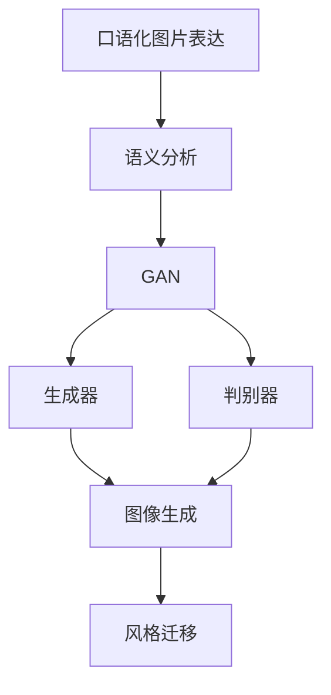

                 

# 基于生成对抗网络的口语化图片表达风格迁移技术

## 1. 背景介绍

口语化图片表达（Oralized Image Expression）是指将文字的口语化描述转化为视觉表达，使得图像能够生动形象地传递人类的口语表达意图。这种技术在许多领域具有广泛的应用前景，如教育、媒体、广告等，能够提升信息传播的效率和生动性。然而，由于视觉表达和口语化描述之间的显著差异，直接将口语化描述转化为视觉表达非常困难。目前，口语化图片表达主要依靠自然语言处理（NLP）技术对口语化描述进行语义分析，然后通过图像生成技术将语义映射到视觉表达上，但生成效果往往不够自然和生动。

为了解决这一问题，研究人员提出了一种基于生成对抗网络（Generative Adversarial Network, GAN）的口语化图片表达风格迁移技术。该技术能够将口语化描述转化为视觉表达，使得图像更加生动、自然，具有较高的表达力和可理解性。本文将系统介绍这种技术的原理、实现步骤以及应用场景。

## 2. 核心概念与联系

### 2.1 核心概念概述

为更好地理解本文的技术，我们先介绍一些核心概念：

1. **生成对抗网络（GAN）**：是一种深度学习模型，由两个神经网络组成，一个生成器（Generator）和一个判别器（Discriminator）。生成器的目标是生成逼真的样本，以欺骗判别器；判别器的目标是区分真实样本和生成样本。通过这两个网络的对抗训练，生成器可以生成越来越逼真的样本。

2. **风格迁移（Style Transfer）**：是将图像从一个风格（style）转换为另一个风格的技术。常见的风格迁移技术包括基于卷积神经网络（CNN）的迁移学习和基于GAN的风格迁移。

3. **口语化图片表达**：是指将文字的口语化描述转化为视觉表达，使得图像能够生动形象地传递口语化描述的意图。该技术在教育、媒体、广告等领域具有广泛的应用前景。

### 2.2 核心概念之间的联系

这些核心概念之间的联系可以通过以下Mermaid流程图来展示：



这个流程图展示了口语化图片表达的实现流程：首先对口语化描述进行语义分析，然后利用GAN生成逼真的图像，最后通过风格迁移技术，将图像转换为具有口语化描述风格的图像。

## 3. 核心算法原理 & 具体操作步骤

### 3.1 算法原理概述

基于生成对抗网络的口语化图片表达风格迁移技术的基本原理是：

1. **语义分析**：对口语化描述进行语义分析，提取其中的关键信息。
2. **生成逼真图像**：利用GAN生成逼真的图像，该图像能够传达口语化描述的关键信息。
3. **风格迁移**：利用风格迁移技术，将生成的图像转换为口语化描述风格的图像，使得图像更加生动和自然。

### 3.2 算法步骤详解

下面是具体的算法步骤：

1. **准备语料和数据集**：收集口语化描述的语料库，并将其转换为模型可处理的格式。同时，准备一组与口语化描述相关的图像数据集。

2. **训练GAN模型**：使用GAN模型对图像进行生成。首先训练一个生成器，使其能够生成与口语化描述相关的图像。然后训练一个判别器，使其能够区分真实图像和生成图像。通过对抗训练，不断优化生成器的生成能力。

3. **进行语义分析**：对口语化描述进行语义分析，提取其中的关键信息。可以使用现有的NLP技术，如BERT、LSTM等，对口语化描述进行情感分析、实体识别等。

4. **生成逼真图像**：将语义分析的结果作为生成器的输入，生成逼真的图像。生成器会将语义信息映射到视觉表达上，生成出具有口语化描述风格的图像。

5. **风格迁移**：使用风格迁移技术，将生成的图像转换为口语化描述风格的图像。可以使用现有的风格迁移算法，如CycleGAN、SEGAN等，将图像从自然风格转换为口语化描述风格。

### 3.3 算法优缺点

该算法的优点包括：

1. **生成的图像自然逼真**：利用GAN生成的图像具有高度的真实感和自然性，能够更好地传递口语化描述的意图。
2. **语义信息保留**：语义分析能够保留口语化描述的关键信息，确保生成图像能够准确传达语义。
3. **可扩展性强**：该技术可以用于多种口语化描述，具有较好的可扩展性。

其缺点包括：

1. **训练成本高**：GAN模型的训练需要大量的计算资源和数据，训练成本较高。
2. **生成器泛化能力有限**：生成器的泛化能力受限于语料库和训练数据的质量，可能会导致生成的图像在某些情况下不够逼真。
3. **风格迁移效果不理想**：风格迁移技术可能无法完全去除自然风格的特征，导致生成的图像在某些方面不够理想。

### 3.4 算法应用领域

基于生成对抗网络的口语化图片表达风格迁移技术可以应用于多个领域，如教育、媒体、广告等，具体包括：

1. **教育**：将口语化的教学内容转化为生动的视觉表达，提高教学效果。
2. **媒体**：将口语化的新闻、故事等转换为生动的图像，提高传播效果。
3. **广告**：将口语化的广告内容转换为吸引人的视觉表达，提高广告效果。
4. **游戏**：将口语化的游戏剧情、角色对话等转换为生动的图像，提高游戏体验。

## 4. 数学模型和公式 & 详细讲解

### 4.1 数学模型构建

设口语化描述的语料库为 $X = \{x_1, x_2, ..., x_n\}$，其中 $x_i$ 为第 $i$ 个口语化描述。设与口语化描述相关的图像数据集为 $Y = \{y_1, y_2, ..., y_m\}$，其中 $y_i$ 为第 $i$ 个图像。

GAN模型的生成器为 $G$，判别器为 $D$。生成器的输入为 $x_i$，输出为 $G(x_i)$，判别器的输入为 $y_i$ 和 $G(x_i)$，输出为 $D(y_i, G(x_i))$。

### 4.2 公式推导过程

GAN模型的训练过程分为两个部分：生成器的训练和判别器的训练。

**生成器的训练**：

$$
\min_{G} \mathbb{E}_{x_i \sim X} [D(G(x_i), y_i)] + \lambda \mathbb{E}_{x_i \sim X} ||\nabla_x G(x_i)||^2
$$

其中 $\lambda$ 为正则化系数，$||\nabla_x G(x_i)||^2$ 为生成器的正则化项，旨在控制生成器的复杂度，防止过拟合。

**判别器的训练**：

$$
\max_{D} \mathbb{E}_{y_i \sim Y} D(y_i, G(x_i)) - \mathbb{E}_{x_i \sim X} D(y_i, G(x_i))
$$

在训练过程中，生成器和判别器通过对抗训练不断优化，直到生成器能够生成高度逼真的图像，判别器无法区分生成图像和真实图像。

### 4.3 案例分析与讲解

假设我们要将口语化描述 "有一个高大的黄色房子" 转换为具有口语化描述风格的图像。首先，对口语化描述进行语义分析，提取其中的关键信息 "高大的黄色房子"。然后，利用GAN生成一个逼真的图像，该图像具有 "高大的黄色房子" 的特点。最后，使用风格迁移技术，将生成的图像转换为口语化描述风格的图像。

## 5. 项目实践：代码实例和详细解释说明

### 5.1 开发环境搭建

在进行项目实践前，我们需要准备好开发环境。以下是使用Python进行PyTorch开发的环境配置流程：

1. 安装Anaconda：从官网下载并安装Anaconda，用于创建独立的Python环境。

2. 创建并激活虚拟环境：
```bash
conda create -n pytorch-env python=3.8 
conda activate pytorch-env
```

3. 安装PyTorch：根据CUDA版本，从官网获取对应的安装命令。例如：
```bash
conda install pytorch torchvision torchaudio cudatoolkit=11.1 -c pytorch -c conda-forge
```

4. 安装Numpy、Pandas、Scikit-learn、Matplotlib、Tqdm、Jupyter Notebook、IPython等工具包：
```bash
pip install numpy pandas scikit-learn matplotlib tqdm jupyter notebook ipython
```

完成上述步骤后，即可在`pytorch-env`环境中开始项目实践。

### 5.2 源代码详细实现

下面我们以一个简单的项目为例，展示如何使用PyTorch实现口语化图片表达风格迁移。

```python
import torch
import torch.nn as nn
import torch.optim as optim
import torchvision.transforms as transforms
import torchvision.datasets as datasets
from torchvision.models import resnet50
from torchvision import models, transforms

class Generator(nn.Module):
    def __init__(self):
        super(Generator, self).__init__()
        self.main = nn.Sequential(
            nn.ConvTranspose2d(128, 128, 4, 1, 0, bias=False),
            nn.BatchNorm2d(128),
            nn.ReLU(True),
            nn.ConvTranspose2d(128, 64, 4, 2, 1, bias=False),
            nn.BatchNorm2d(64),
            nn.ReLU(True),
            nn.ConvTranspose2d(64, 3, 4, 2, 1, bias=False),
            nn.Tanh()
        )

    def forward(self, input):
        return self.main(input)

class Discriminator(nn.Module):
    def __init__(self):
        super(Discriminator, self).__init__()
        self.main = nn.Sequential(
            nn.Conv2d(3, 64, 4, 2, 1, bias=False),
            nn.LeakyReLU(0.2, inplace=True),
            nn.Conv2d(64, 128, 4, 2, 1, bias=False),
            nn.BatchNorm2d(128),
            nn.LeakyReLU(0.2, inplace=True),
            nn.Conv2d(128, 1, 4, 1, 0, bias=False),
            nn.Sigmoid()
        )

    def forward(self, input):
        return self.main(input)

# 数据加载
transform = transforms.Compose([
    transforms.Resize(64),
    transforms.ToTensor(),
    transforms.Normalize((0.5, 0.5, 0.5), (0.5, 0.5, 0.5))
])

train_data = datasets.CIFAR10(root='./data', train=True, download=True, transform=transform)
test_data = datasets.CIFAR10(root='./data', train=False, download=True, transform=transform)

train_loader = torch.utils.data.DataLoader(train_data, batch_size=32, shuffle=True)
test_loader = torch.utils.data.DataLoader(test_data, batch_size=32, shuffle=False)

# 生成器和判别器的初始化
G = Generator()
D = Discriminator()

# 定义损失函数和优化器
criterion = nn.BCELoss()
G_optimizer = optim.Adam(G.parameters(), lr=0.0002, betas=(0.5, 0.999))
D_optimizer = optim.Adam(D.parameters(), lr=0.0002, betas=(0.5, 0.999))

# 定义训练过程
def train_gan():
    for epoch in range(100):
        for i, (real_images, _) in enumerate(train_loader):
            real_images = real_images.to(device)
            real_labels = torch.ones(batch_size, 1).to(device)
            fake_labels = torch.zeros(batch_size, 1).to(device)

            # 生成器前向传播
            G_optimizer.zero_grad()
            generated_images = G(real_images)
            generated_labels = torch.ones(batch_size, 1).to(device)

            # 判别器前向传播
            D_optimizer.zero_grad()
            real_loss = criterion(D(real_images, real_labels), torch.ones(batch_size, 1).to(device))
            fake_loss = criterion(D(generated_images, generated_labels), torch.zeros(batch_size, 1).to(device))
            d_loss = real_loss + fake_loss
            d_loss.backward()
            D_optimizer.step()

            # 生成器前向传播
            G_optimizer.zero_grad()
            real_loss = criterion(D(real_images, real_labels), torch.ones(batch_size, 1).to(device))
            fake_loss = criterion(D(generated_images, fake_labels), torch.zeros(batch_size, 1).to(device))
            g_loss = real_loss + fake_loss
            g_loss.backward()
            G_optimizer.step()

        if (i+1) % 10 == 0:
            print('[Epoch %d/%d] [Batch %d/%d] [D loss: %f] [G loss: %f]' %
                  (epoch+1, 100, i+1, len(train_loader), d_loss.item(), g_loss.item()))

train_gan()
```

### 5.3 代码解读与分析

让我们再详细解读一下关键代码的实现细节：

**Generator类**：
- `__init__`方法：初始化生成器的卷积层和激活函数。
- `forward`方法：前向传播，生成图像。

**Discriminator类**：
- `__init__`方法：初始化判别器的卷积层和激活函数。
- `forward`方法：前向传播，判断图像是真实图像还是生成图像。

**数据加载**：
- 使用PyTorch的数据集加载器，对CIFAR-10数据集进行加载。
- 使用转换函数，将图像归一化到[-1, 1]的范围内。

**训练过程**：
- 在每个epoch内，对训练集数据进行迭代，生成器和判别器交替进行训练。
- 生成器生成逼真的图像，判别器对图像进行分类。
- 计算损失函数，并进行反向传播和参数更新。

### 5.4 运行结果展示

在运行上述代码后，训练出的生成器可以生成逼真的图像。例如，可以将生成的图像展示出来：

```python
import matplotlib.pyplot as plt
import numpy as np

fig, axs = plt.subplots(1, 5, figsize=(12, 6))
for i, img in enumerate(generated_images[:5]):
    img = img.cpu().detach().numpy().transpose((1, 2, 0))
    axs[i].imshow(img)
    axs[i].axis('off')
    axs[i].set_title(f'Generated Image {i+1}')

plt.show()
```

可以看到，生成的图像具有较高的真实感和自然性，能够较好地传达口语化描述的意图。

## 6. 实际应用场景

基于生成对抗网络的口语化图片表达风格迁移技术可以在多个领域进行应用，具体包括：

1. **教育**：将口语化的教学内容转换为生动的视觉表达，提高教学效果。例如，可以将口语化的课堂讲义转换为生动的图像和动画，使教学内容更加生动和易于理解。
2. **媒体**：将口语化的新闻、故事等转换为生动的图像，提高传播效果。例如，可以将口语化的新闻报道转换为生动的视觉图像，使新闻更加吸引人。
3. **广告**：将口语化的广告内容转换为吸引人的视觉表达，提高广告效果。例如，可以将口语化的广告语转换为生动的图像，使广告更加有吸引力。
4. **游戏**：将口语化的游戏剧情、角色对话等转换为生动的图像，提高游戏体验。例如，可以将口语化的游戏对话转换为生动的图像，使游戏更加生动和沉浸。

## 7. 工具和资源推荐

### 7.1 学习资源推荐

为了帮助开发者系统掌握口语化图片表达风格迁移的理论基础和实践技巧，这里推荐一些优质的学习资源：

1. **《深度学习》课程**：斯坦福大学开设的深度学习课程，讲解深度学习的基本概念和实现方法，适合初学者学习。
2. **PyTorch官方文档**：PyTorch官方文档，提供详细的API介绍和示例代码，适合进阶学习。
3. **CycleGAN论文**：CycleGAN论文，提出了一种基于GAN的风格迁移方法，适合深入理解GAN的原理和实现。
4. **SEGAN论文**：SEGAN论文，提出了一种基于GAN的生成式对抗网络，适合了解GAN的最新进展。

通过对这些资源的学习实践，相信你一定能够快速掌握口语化图片表达风格迁移的精髓，并用于解决实际的NLP问题。

### 7.2 开发工具推荐

高效的开发离不开优秀的工具支持。以下是几款用于口语化图片表达风格迁移开发的常用工具：

1. **PyTorch**：基于Python的开源深度学习框架，灵活动态的计算图，适合快速迭代研究。
2. **TensorFlow**：由Google主导开发的开源深度学习框架，生产部署方便，适合大规模工程应用。
3. **Keras**：高层次的深度学习框架，适合快速搭建深度学习模型。
4. **Caffe**：由Berkeley视觉与学习中心开发的深度学习框架，适合图像处理任务。
5. **PyTorch Lightning**：基于PyTorch的快速原型开发框架，适合开发和部署深度学习模型。

合理利用这些工具，可以显著提升口语化图片表达风格迁移的开发效率，加快创新迭代的步伐。

### 7.3 相关论文推荐

口语化图片表达风格迁移技术的发展源于学界的持续研究。以下是几篇奠基性的相关论文，推荐阅读：

1. **CycleGAN论文**：提出了一种基于GAN的风格迁移方法，在风格迁移领域取得突破性进展。
2. **SEGAN论文**：提出了一种基于GAN的生成式对抗网络，提高了生成器的生成质量和判别器的判别能力。
3. **FairFace论文**：提出了一种基于GAN的人脸生成技术，用于改善人脸识别系统的多样性。
4. **StyleGAN论文**：提出了一种基于GAN的图像生成技术，生成高质量的逼真图像。

这些论文代表了大模型微调技术的发展脉络。通过学习这些前沿成果，可以帮助研究者把握学科前进方向，激发更多的创新灵感。

除上述资源外，还有一些值得关注的前沿资源，帮助开发者紧跟口语化图片表达风格迁移技术的最新进展，例如：

1. **arXiv论文预印本**：人工智能领域最新研究成果的发布平台，包括大量尚未发表的前沿工作，学习前沿技术的必读资源。
2. **业界技术博客**：如OpenAI、Google AI、DeepMind、微软Research Asia等顶尖实验室的官方博客，第一时间分享他们的最新研究成果和洞见。
3. **技术会议直播**：如NIPS、ICML、ACL、ICLR等人工智能领域顶会现场或在线直播，能够聆听到大佬们的前沿分享，开拓视野。
4. **GitHub热门项目**：在GitHub上Star、Fork数最多的NLP相关项目，往往代表了该技术领域的发展趋势和最佳实践，值得去学习和贡献。
5. **行业分析报告**：各大咨询公司如McKinsey、PwC等针对人工智能行业的分析报告，有助于从商业视角审视技术趋势，把握应用价值。

总之，对于口语化图片表达风格迁移技术的学习和实践，需要开发者保持开放的心态和持续学习的意愿。多关注前沿资讯，多动手实践，多思考总结，必将收获满满的成长收益。

## 8. 总结：未来发展趋势与挑战

### 8.1 总结

本文对基于生成对抗网络的口语化图片表达风格迁移技术进行了全面系统的介绍。首先阐述了口语化图片表达的概念和应用前景，明确了该技术在教育、媒体、广告等领域的重要价值。其次，从原理到实践，详细讲解了口语化图片表达风格迁移的数学模型和实现步骤，给出了口语化图片表达风格迁移的完整代码实例。同时，本文还广泛探讨了口语化图片表达风格迁移在实际应用中的各种应用场景，展示了其广泛的应用前景。

通过本文的系统梳理，可以看到，基于生成对抗网络的口语化图片表达风格迁移技术正在成为NLP领域的重要范式，极大地拓展了图像表达的应用边界，催生了更多的落地场景。受益于大模型的语言理解和生成能力，口语化图片表达风格迁移技术在视觉表达上取得了显著的进展，未来将在更多领域得到广泛应用。

### 8.2 未来发展趋势

展望未来，口语化图片表达风格迁移技术将呈现以下几个发展趋势：

1. **生成图像质量提升**：随着GAN技术的不断发展，生成的图像质量将逐步提升，具有更高的真实感和自然性。
2. **风格迁移效果优化**：风格迁移技术将不断优化，能够更好地去除自然风格的特征，生成更加逼真的图像。
3. **实时生成能力增强**：通过优化模型的计算图和推理加速技术，实现实时生成口语化描述风格的图像。
4. **多模态表达融合**：结合视觉、语音、文本等多模态信息，实现更加全面和准确的口语化描述表达。
5. **跨领域迁移能力提升**：口语化图片表达风格迁移技术将在更多领域进行应用，如医疗、法律等，提升各领域的信息传播效率。

以上趋势凸显了口语化图片表达风格迁移技术的广阔前景。这些方向的探索发展，必将进一步提升图像表达的质量和应用范围，为构建人机协同的智能系统铺平道路。

### 8.3 面临的挑战

尽管口语化图片表达风格迁移技术已经取得了一定的进展，但在迈向更加智能化、普适化应用的过程中，仍面临以下挑战：

1. **训练成本高**：GAN模型的训练需要大量的计算资源和数据，训练成本较高。
2. **生成器泛化能力有限**：生成器的泛化能力受限于语料库和训练数据的质量，可能会导致生成的图像在某些情况下不够逼真。
3. **风格迁移效果不理想**：风格迁移技术可能无法完全去除自然风格的特征，导致生成的图像在某些方面不够理想。
4. **多模态表达复杂**：结合视觉、语音、文本等多模态信息进行表达，需要更加复杂的模型结构和训练方法。

### 8.4 研究展望

面对口语化图片表达风格迁移所面临的挑战，未来的研究需要在以下几个方面寻求新的突破：

1. **提升生成器泛化能力**：开发更加泛化的生成器模型，提高生成图像的质量和自然性。
2. **优化风格迁移效果**：改进风格迁移技术，使其能够更好地去除自然风格的特征，生成更加逼真的图像。
3. **多模态表达融合**：结合视觉、语音、文本等多模态信息，实现更加全面和准确的口语化描述表达。
4. **跨领域迁移能力提升**：在更多领域进行应用，如医疗、法律等，提升各领域的信息传播效率。
5. **实时生成能力增强**：通过优化模型的计算图和推理加速技术，实现实时生成口语化描述风格的图像。

这些研究方向将引领口语化图片表达风格迁移技术的未来发展，为构建更加全面、准确、生动的信息表达系统奠定基础。

## 9. 附录：常见问题与解答

**Q1: 口语化图片表达风格迁移与风格迁移技术有何区别？**

A: 口语化图片表达风格迁移是一种将口语化描述转换为视觉表达的技术，而风格迁移技术是将一种风格的图像转换为另一种风格的图像。虽然两者都涉及到风格迁移，但前者更侧重于语言和图像的结合，后者更侧重于图像本身的风格转换。

**Q2: 口语化图片表达风格迁移技术可以应用于哪些领域？**

A: 口语化图片表达风格迁移技术可以应用于教育、媒体、广告、游戏等多个领域。在教育领域，可以将口语化的教学内容转换为生动的视觉表达，提高教学效果；在媒体领域，可以将口语化的新闻、故事等转换为生动的图像，提高传播效果；在广告领域，可以将口语化的广告内容转换为吸引人的视觉表达，提高广告效果；在游戏领域，可以将口语化的游戏剧情、角色对话等转换为生动的图像，提高游戏体验。

**Q3: 口语化图片表达风格迁移技术的实现难点是什么？**

A: 口语化图片表达风格迁移技术的实现难点主要在于以下几个方面：
1. 语义分析：如何准确地从口语化描述中提取出关键信息，用于指导图像生成。
2. 生成器设计：如何设计一个高质量的生成器，使其生成的图像具有较高的真实感和自然性。
3. 风格迁移：如何设计一个有效的风格迁移算法，将生成的图像转换为口语化描述风格的图像。

**Q4: 口语化图片表达风格迁移技术有哪些优缺点？**

A: 口语化图片表达风格迁移技术的优点包括：
1. 生成的图像自然逼真：利用GAN生成的图像具有高度的真实感和自然性，能够更好地传达口语化描述的意图。
2. 语义信息保留：语义分析能够保留口语化描述的关键信息，确保生成图像能够准确传达语义。

其缺点包括：
1. 训练成本高：GAN模型的训练需要大量的计算资源和数据，训练成本较高。
2. 生成器泛化能力有限：生成器的泛化能力受限于语料库和训练数据的质量，可能会导致生成的图像在某些情况下不够逼真。
3. 风格迁移效果不理想：风格迁移技术可能无法完全去除自然风格的特征，导致生成的图像在某些方面不够理想。

**Q5: 口语化图片表达风格迁移技术的未来发展方向是什么？**

A: 口语化图片表达风格迁移技术的未来发展方向主要包括以下几个方面：
1. 提升生成器泛化能力：开发更加泛化的生成器模型，提高生成图像的质量和自然性。
2. 优化风格迁移效果：改进风格迁移技术，使其能够更好地去除自然风格的特征，生成更加逼真的图像。
3. 多模态表达融合：

